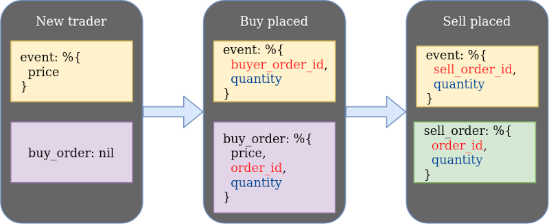

# Create a naive trading strategy - a single trader process without supervision

## Objectives

- create another supervised application inside umbrella to store our trading strategy
- define callbacks for events dependent on state of the trader
- push events from the streamer app to the naive app

## Initializiation

To develop our *naive* strategy will need to create a new supervised application inside our umbrella project:

```{r, engine = 'bash', eval = FALSE}
cd apps
mix new naive --sup
```

We can now focus on creating a `trader` abstraction inside that newly created application. First we need to create a new file called `trader.ex` inside `apps/naive/lib/naive/`.

Let's start with a skeleton of a GenServer:

```{r, engine = 'elixir', eval = FALSE}
# /apps/naive/lib/naive/trader.ex
defmodule Naive.Trader do
  use GenServer
  
  require Logger

  def start_link(args) do
    GenServer.start_link(__MODULE__, args, name: :trader)
  end

  def init(args) do
    {:ok, args}
  end
end
```

Our module uses the [GenServer](https://hexdocs.pm/elixir/master/GenServer.html#content) behaviour and to fulfill it's "contract", we need to implement the `init/1` function. The `start_link/1` function is a convention and it allows us to register the process with a name(it's a default function that supervisor will use when starting the Trader). We also add a `require Logger` as we will keep on logging across the module.

Next, let's model the state of our server:

```{r, engine = 'elixir', eval = FALSE}
  # /apps/naive/lib/naive/trader.ex
  defmodule State do
    @enforce_keys [:symbol, :profit_interval, :tick_size]
    defstruct [
      :symbol,
      :buy_order,
      :sell_order,
      :profit_interval,
      :tick_size
    ]
  end
```

Our trader needs to know:
- what symbol does it need to trade ("symbol" here is a pair of assets for example "XRPUSDT", which is XRP to/from USDT)
- placed buy order (if any)
- placed sell order (if any)
- profit interval (what net profit % we would like to achieve when buying and selling an asset - single trade cycle)
- tick_size (yes, I know, jargon warning. We can't ignore it here as it needs to be fetched from Binance and it's used to calculate a valid price. Tick size differs between symbols and it is a smallest acceptable price movement up or down. For example in physical world tick size for USD is a single cent, you can't sell something for $1.234, it's either $1.23 or $1.24 (one cent difference between those is the tick size) - more info [here](https://www.investopedia.com/terms/t/tick.asp)

Our strategy won't be able to work without symbol, profit_interval nor tick_size so we added them to the `@enforce_keys` attribute. This will ensure that we won't create an invalid `%State{}` without those values.

As now we know that our GenServer will need to receive those details via args, we can update pattern matching in `start_link/1` and `init/1` functions to confirm that passed values are indeed maps:

```{r, engine = 'elixir', eval = FALSE}
  # /apps/naive/lib/naive/trader.ex
  def start_link(%{} = args) do
    ...
  end

  def init(%{symbol: symbol, profit_interval: profit_interval}) do
    ...
  end
```

As we are already in the `init/1` function we will need to modify it to fetch the `tick_size` for the passed symbol and initialize a fresh state:

```{r, engine = 'elixir', eval = FALSE}
  # /apps/naive/lib/naive/trader.ex
  def init(%{symbol: symbol, profit_interval: profit_interval}) do
    symbol = String.upcase(symbol)

    Logger.info("Initializing new trader for #{symbol}")

    tick_size = fetch_tick_size(symbol)

    {:ok,
     %State{
       symbol: symbol,
       profit_interval: profit_interval,
       tick_size: tick_size
     }}
  end
```

We are uppercasing the symbol above as Binance's REST API accepts only uppercased symbols.

It's the time to connect to Binance's REST API. The easiest way to do that will be to use the [binance](https://github.com/dvcrn/binance.ex) module.

As previously, looking through the module's docs on Github, we can see the `Installation` section. We will follow the steps mentioned there, starting from adding `binance` to the deps in `/apps/naive/mix.exs`:

```{r, engine = 'elixir', eval = FALSE}
  # /apps/naive/mix.ex
  defp deps do
    [
      {:binance, "~> 0.7.1"},
      {:decimal, "~> 2.0"},
      {:streamer, in_umbrella: true}
    ]
  end
```

Beside adding the `:binance` module, we also added `:decimal` and the `:streamer`. The [decimal](https://github.com/ericmj/decimal) module will help us to calculate the buy and sell prices (without decimal module we would have problems with precision). Lastly, we need to include the `:streamer` application(created in the first chapter) as we will use the `%Streamer.Binance.TradeEvent{}` struct inside the naive application.

We need to run `mix deps.get` to install our new deps.

We can now get back to the `trader` module and focus on fetching the tick size from Binance:

```{r, engine = 'elixir', eval = FALSE}
  # /apps/naive/lib/naive/trader.ex
  defp fetch_tick_size(symbol) do
    Binance.get_exchange_info()
    |> elem(1)
    |> Map.get(:symbols)
    |> Enum.find(&(&1["symbol"] == symbol))
    |> Map.get("filters")
    |> Enum.find(&(&1["filterType"] == "PRICE_FILTER"))
    |> Map.get("tickSize")
    |> Decimal.new()
  end
```

We are using `get_exchange_info/0` to fetch list of symbols, that we will filter to find the symbol that we are requested to trade. Tick size is defined as a `PRICE_FILTER` filter. Here's the [link](https://github.com/binance/binance-spot-api-docs/blob/master/rest-api.md#exchange-information) to the documentation listing all keys in the result. In a nutshell, that's how the important parts of the result looks like:

```
{:ok, %{
  ...
  "symbols": [
    %{
      "symbol": "ETHUSDT",
      ...
      "filters": [
        ...
        %{"filterType: "PRICE_FILTER", "tickSize": tickSize, ...}
      ],
      ...
    }
  ]
}}
```

## How trading strategy will work?

Our trader process has an internal state that will serve as a indicator where in the trade cycle is it. The following diagram shows 3 possible trader states that trader will progress through from left to right:

<center>
  
</center>

Our trader will be receiving trade events sequentially and take decisions
based on it's own state and trade event's contents.

We will focus on a trader in 3 different states:
* a new trader without any orders
* a trader with a buy order placed
* a trader with a sell order placed.


* First state - A new trader

Trader doesn't have any open orders which we can confirm by pattern matching on the `buy_order` field from its state. From the incoming event, we can get
the current price which we will use in the buy order that the trader will place.

* Second state - Buy order placed

After placing a buy order, trader will be pattern matching to confirm that
has incoming event filled his buy order otherwise ignoring it.
When trade event matching the order id of trader's buy order will arrive, it means that buy order got filled(simplification - our order could be filled in two or more transactions but implementation in this chapter won't cater for this case, it will always assume that it got filled in a single transaction) and trader can now place the sell order based on the expected profit and the buy_price.

* Third state - Sell order placed

Finally, in a very similar fashion to previous state, the trader will be pattern matching to confirm that incoming event has filled his sell order(matching order id), otherwise ignoring it.
When trade event matching the order id of trader's sell order will arrive, that means that sell order got filled(simplification as described above) and full trade cycle has ended and the trader can now exit.

### Implementation of the first scenario

Enough theory :) back to the editor, we will implement the first scenario. Before doing that let's alias Streamer's TradeEvent struct as we will rely on it heavily in pattern matching. 

```{r, engine = 'elixir', eval = FALSE}
  # /apps/naive/lib/naive/trader.ex
  alias Streamer.Binance.TradeEvent
```

We are also aliasing the `%Streamer.Binance.TradeEvent{}` struct as we will rely on it heavily in pattern matching. 


To confirm that we are dealing with a "new" trader, we will pattern match on `buy_order: nil` from it's state:

```{r, engine = 'elixir', eval = FALSE}
  # /apps/naive/lib/naive/trader.ex
  def handle_cast(
        %TradeEvent{price: price},
        %State{symbol: symbol, buy_order: nil} = state
      ) do
    quantity = 100 # <= Hardcoded until chapter 7

    Logger.info("Placing BUY order for #{symbol} @ #{price}, quantity: #{quantity}")

    {:ok, %Binance.OrderResponse{} = order} =
      Binance.order_limit_buy(symbol, quantity, price, "GTC")

    {:noreply, %{state | buy_order: order}}
  end
```

For the time being, we will keep the quantity hardcoded as this chapter will
get really long otherwise - don't worry, we will refactor this in one of the next chapters.

After confirming that we deal with the "new" trader(by pattern matching on the `buy_order` field from state), we can safely progress to placing a new buy order. We just need to remember to return the updated state as otherwise, trader will go on a shopping spree, as every next incoming event will cause further buy orders(above pattern match will continue to be successful).

### Implementation of the second scenario

With that out of the way, we can now move on to monitoring for event that matches our buy order id and quantity to confirm that our buy order got filled:

```{r, engine = 'elixir', eval = FALSE}
  # /apps/naive/lib/naive/trader.ex
  def handle_cast(
        %TradeEvent{
          buyer_order_id: order_id,
          quantity: quantity
        },
        %State{
          symbol: symbol,
          buy_order: %Binance.OrderResponse{
            price: buy_price,
            order_id: order_id,
            orig_qty: quantity
          },
          profit_interval: profit_interval,
          tick_size: tick_size
        } = state
      ) do
    sell_price = calculate_sell_price(buy_price, profit_interval, tick_size)

    Logger.info(
      "Buy order filled, placing SELL order for " <>
        "#{symbol} @ #{sell_price}), quantity: #{quantity}"
    )

    {:ok, %Binance.OrderResponse{} = order} =
      Binance.order_limit_sell(symbol, quantity, sell_price, "GTC")

    {:noreply, %{state | sell_order: order}}
  end
```

We will implement calculating sell price in a sepearate function based on buy price, profit interval and tick_size.

Our pattern match will confirm that indeed our buy order got filled(order_id and quantity matches) so we can now we proceed with placing a sell order using calculated sell price and quantity retrieved from buy order.
Again, don't forget to return the updated state as otherwise, trader will keep on placing sell orders for every incoming event.

To calculate the sell price we will need to use precise math and that will require a custom module. We will use the [Decimal](https://github.com/ericmj/decimal) module, so first, let's alias it at the top of the file:

```{r, engine = 'elixir', eval = FALSE}
# /apps/naive/lib/naive/trader.ex
alias Decimal, as: D
```

Now to calculate the correct sell price, we can use the following formula which gets me pretty close to expected value:

```{r, engine = 'elixir', eval = FALSE}
  # /apps/naive/lib/naive/trader.ex
  defp calculate_sell_price(buy_price, profit_interval, tick_size) do
    fee = D.new("1.001")
    original_price = D.mult(D.new(buy_price), fee)

    net_target_price =
      D.mult(
        original_price,
        D.add("1.0", profit_interval)
      )

    gross_target_price = D.mult(net_target_price, fee)

    D.to_float(
      D.mult(
        D.div_int(gross_target_price, tick_size),
        tick_size
      )
    )
  end
```

First, we would like to convert all the numbers to the `Decimal` structs so it will be easier to work with them. We will also hardcode the fee which we will refactor in one of the future chapters.

We started by calculating the `gross_buy_price` which is a sum of buy
price together with the fee that we paid on top of it.

Next, we enlarge the originally paid price by profit interval to get `net_target_price` 

As we will be charged a fee for selling, we need to add the fee again on top of this target sell price(`gross_target_price`).

Next, we will use the tick size as Binance won't accept any prices that aren't divisible by the symbols' tick sizes so we need to "normalize" them on our side.

### Implementation of the third scenario

Getting back to handling incoming events, we can now add a clause for a trader that wants to confirm that his sell order was filled:

```{r, engine = 'elixir', eval = FALSE}
  # /apps/naive/lib/naive/trader.ex
  def handle_cast(
        %TradeEvent{
          seller_order_id: order_id,
          quantity: quantity
        },
        %State{
          sell_order: %Binance.OrderResponse{
            order_id: order_id,
            orig_qty: quantity
          }
        } = state
      ) do
    Logger.info("Trade finished, trader will now exit")
    {:stop, :normal, state}
  end
```

When the sell order was successfully filled(confirmed by pattern matching above), there's nothing else to do for the trader, so it can retrun a tuple with `:stop` atom which will cause the trader process to terminate.

### Implementation fallback scenario

A final callback function that we will need to implement will just ignore all
incoming events as they were not matched by any of the previous pattern matches:

```{r, engine = 'elixir', eval = FALSE}
  # /apps/naive/lib/naive/trader.ex
  def handle_cast(%TradeEvent{}, state) do
    {:noreply, state}
  end
```

We need this callback for cases where our trader has an "open" order(not yet filled) and the incoming event has nothing to do with it, so it needs to be ignored.

### Updating the Naive interface

Now we will update an interface of our `naive` application by modifying the Naive module to allow to send an event to the trader:

```{r, engine = 'elixir', eval = FALSE}
# /apps/naive/lib/naive.ex
defmodule Naive do
  @moduledoc """
  Documentation for `Naive`.
  """
  alias Streamer.Binance.TradeEvent

  def send_event(%TradeEvent{} = event) do
    GenServer.cast(:trader, event)
  end
end
```

We will use the fact that we registered our trader process with a name to be able to cast a message to it.

### Updating streamer app

To glue our apps together for the time and keep things simple in this chapter we will modify the streamer process to simply call our new `Naive` interface directly by appending a following function call at the end of `process_event/1` function inside the `Streamer.Binance` module:

```{r, engine = 'elixir', eval = FALSE}
  # /apps/streamer/lib/streamer/binance.ex
  defp process_event(%{"e" => "trade"} = event) do
    ...
    Naive.send_event(trade_event)
  end
```

This creates a two way link between the streamer and the naive app. In the next chapter we will fix that as in the perfect world those apps shouldn't even be aware of existance of each other.

### Access details to Binance

Inside the main config of our umbrella project we need to define access details for our Binance account:

```{r, engine = 'elixir', eval = FALSE}
config :binance,
  api_key: "YOUR-API-KEY-HERE",
  secret_key: "YOUR-SECRET-KEY-HERE"
```

*Important note*: To be able to run below test and perform real trades, Binance account is required with balance of at least 20 USDT. In the 4th chapter we will focus on creating a `BinanceMock` that will allow us to run our bot *without* requirement for a real Binance account. You don't need to test run it now if you don't need/want to have an account.

### Test run

Now it's the time to give our implementation a run for it's money. Once again, to be able to do that you will need to have at least 20 USDT tokens in your Binance's wallet and you will loose just under 0.5% of your USDTs(as "expected profit" is below 0 to quickly showcase the full trade cycle) in the following test:

```{r, engine = 'bash', eval = FALSE}
$ iex -S mix
...
iex(1)> Naive.Trader.start_link(%{symbol: "XRPUSDT", profit_interval: Decimal.new("-0.01")})
13:45:30.648 [info] Initializing new trader for XRPUSDT
{:ok, #PID<0.355.0>}
iex(2)> Streamer.start_streaming("xrpusdt")
{:ok, #PID<0.372.0>}
iex(3)> 
13:45:32.561 [info] Placing BUY order for XRPUSDT @ 0.25979000, quantity: 100
13:45:32.831 [info] Buy order filled, placing SELL order for XRPUSDT @ 0.2577, quantity: 100
13:45:33.094 [info] Trade finished, trader will now exit
```

After starting the IEx session, start the trader process with a map containing symbol and profit interval. To be able to quickly test full trade cycle we will pass sub-zero profit interval instead of waiting for the increase in price.

Next, we will start streaming on the same symbol, please be aware that this will cause an immediate reaction in the trader process.

We can see that our trader placed a buy order at 25.979c per XRP, it was filled in under 300ms, so then the trader placed a sell order at ~25.77c
which was also filled in under 300ms. This way the trader finished the trade
cycle and process can terminate.

That's it. Congratulations! You just made your first algorithmic trade and you should be proud of that! In the process of creating that algorithm we touched on multiple topics including GenServer and depending on it's state and external data (trade events) to perform different actions - this is a very common workflow that Elixir engineers are following and it's great to see it in action.

[Note] Please remember to run `mix format` to keep things nice and tidy.

Source code for this chapter can be found at [Github](https://github.com/frathon/create-a-cryptocurrency-trading-bot-in-elixir-source-code/tree/chapter_02)
