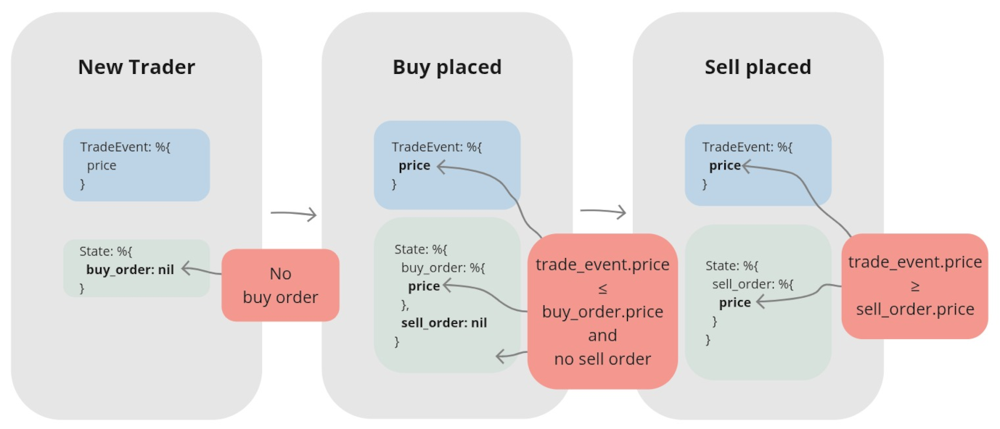

# Creating a Naive Trading Strategy

In this chapter, we'll build our first automated trading strategy. We'll start with a naive version.
It won't be smart, but it will serve as a great way to demonstrate valuable Elixir concepts,
especially how processes can manage and use their internal state.

**Important:** This example connects to Binance and places real trades with cryptocurrency.
If you'd rather not use real funds, you're in luck. In Chapter 4, we'll build a mock of the
`Binance` module that will let us run the code without an actual exchange account.

## Objectives

- Create another supervised application inside our umbrella for our trading strategy.
- Implement functions (`GenServer` callbacks) that react to trade events based on the trader's state.
- Connect the streamer and trader applications so events can flow between them.

## Initialization

To implement our *naive* strategy, we need to create a new supervised application inside our umbrella project:

```{r, engine = 'bash', eval = FALSE}
# inside your terminal
$ cd apps
$ mix new naive --sup
```

Now, let's create the `Naive.Trader` module inside our new application.
First, create a file named `trader.ex` in the `apps/naive/lib/naive/` directory.

Let's start with a skeleton of a GenServer:

```{r, engine = 'elixir', eval = FALSE}
# /apps/naive/lib/naive/trader.ex
defmodule Naive.Trader do
  use GenServer

  require Logger

  def start_link(args) do
    GenServer.start_link(__MODULE__, args, name: :trader)
  end

  def init(args) do
    {:ok, args}
  end
end
```

Why GenServer? Our trader needs to do three things: hold state (current orders), receive messages (trade events),
and make decisions based on both. GenServer is the standard OTP building block for exactly this pattern.

Our module uses the [GenServer](https://hexdocs.pm/elixir/master/GenServer.html#content) behavior.
While `init/1` is the only required callback, implementing `start_link/1` is a strong convention
for processes started by a supervisor.
Note that we are using a hardcoded atom `name: :trader`.
This is simple for a single bot, but it creates a global name conflict -
you cannot start a second trader for a different symbol because the name is already taken.
We'll learn how to use a `Registry` to handle multiple dynamic traders in Phase 2.
Finally, we require `Logger` so we can log information from this module.

Next, let's define the state for our `GenServer` process:

```{r, engine = 'elixir', eval = FALSE}
  # /apps/naive/lib/naive/trader.ex
  defmodule State do
    @enforce_keys [:symbol, :profit_target, :tick_size]
    defstruct [
      :symbol,
      :buy_order,
      :sell_order,
      :profit_target,
      :tick_size
    ]
  end
```

Our trader needs to know:

- which symbol to trade (a symbol represents a trading pair - for example, "XRPUSDT" means trading XRP against USDT)
- the currently placed buy order, if any
- the currently placed sell order, if any
- profit target (the desired profit percentage for a single trade cycle - one buy and one sell)
- tick_size (a bit of trading jargon that we'll demystify shortly)

Since our trader can't function without `:symbol`, `:profit_target`, or `:tick_size`,
we use the `@enforce_keys` attribute. This prevents us from creating a `%State{}` struct without these essential
values, ensuring our trader is always properly initialized.

**Terminology: Tick size**

Each symbol has a different tick size, which represents the smallest acceptable price increment.
Think of it like cents for dollars - you can't price something at $1.234; it must be $1.23 or $1.24.
In crypto, BTCUSDT might have a tick size of 0.01, while XRPUSDT might be 0.0001.
If you try to place an order at a price that isn't a multiple of the tick size, Binance will reject it.

You can find more information on Investopedia: https://www.investopedia.com/terms/t/tick.asp.
We need to fetch this value from Binance to calculate valid order prices.

Now that we know our `GenServer` needs these arguments, we can update our `start_link/1` and `init/1` functions
to pattern match on a map:

```{r, engine = 'elixir', eval = FALSE}
  # /apps/naive/lib/naive/trader.ex
  def start_link(%{} = args) do
    ...
  end

  def init(%{symbol: symbol, profit_target: profit_target}) do
    ...
  end
```

### Non-blocking Initialization

We could simply fetch the `tick_size` directly inside the `init/1` function. However, there is a catch.

`GenServer.start_link/3` is synchronous. It waits for `init/1` to return before it gives the PID to the caller (which is often a `Supervisor`).
If we perform a network request to Binance inside `init/1`, and that request takes 5 seconds (or fails!),
our entire application startup is blocked for that duration. If we had 100 traders starting up, and each took a few seconds,
our application would effectively hang or crash due to timeout.

To solve this, we'll use `handle_continue/2`, a callback added in OTP 21 specifically for this scenario.
It allows us to return immediately from `init/1` (unblocking the supervisor) and then perform further initialization work asynchronously.

Let's update our `init/1` to schedule this continuation:

```{r, engine = 'elixir', eval = FALSE}
  # /apps/naive/lib/naive/trader.ex
  def init(%{symbol: symbol, profit_target: profit_target}) do
    symbol = String.upcase(symbol)

    Logger.info("Initializing new trader for #{symbol}")

    {:ok,
     %State{
       symbol: symbol,
       profit_target: profit_target,
       tick_size: nil
     }, {:continue, :fetch_tick_size}}
  end
```

Notice the return tuple: `{:ok, state, {:continue, :fetch_tick_size}}`.
This tells the GenServer: "I'm successfully started, but before you process any messages, run the logic associated with `:fetch_tick_size`."

Now we need to implement the handle_continue/2 callback to do the actual work:

```{r, engine = 'elixir', eval = FALSE}
  # /apps/naive/lib/naive/trader.ex
  def handle_continue(:fetch_tick_size, %State{symbol: symbol} = state) do
    tick_size = fetch_tick_size(symbol)

    {:noreply, %{state | tick_size: tick_size}}
  end
```

A straightforward way to connect to the Binance REST API is by using the [binance](https://github.com/dvcrn/binance.ex) package.

Following the installation instructions in the library's documentation on GitHub, we'll start by adding `binance` to the deps in `/apps/naive/mix.exs`:

```{r, engine = 'elixir', eval = FALSE}
  # /apps/naive/mix.exs
  defp deps do
    [
      {:binance, "~> 1.0"},
      {:decimal, "~> 2.0"},
      {:streamer, in_umbrella: true}
    ]
  end
```

Along with the `:binance` library, we're also adding `:decimal` and our own `:streamer` application.
The [decimal](https://github.com/ericmj/decimal) library is essential for calculating prices,
as using standard floats would lead to precision errors common in financial calculations.
Lastly, we include our own `:streamer` application (from Chapter 1) because the `naive` application will
need to handle the `%Streamer.Binance.TradeEvent{}` struct it produces.

We need to run `mix deps.get` to install our new dependencies.

Now, let's return to the `Naive.Trader` module and implement the logic for fetching the `tick_size` from Binance:

```{r, engine = 'elixir', eval = FALSE}
  # /apps/naive/lib/naive/trader.ex
  defp fetch_tick_size(symbol) do
    {:ok, exchange_info} = Binance.get_exchange_info()

    exchange_info
    |> Map.get(:symbols)
    |> Enum.find(&(&1["symbol"] == symbol))
    |> Map.get("filters")
    |> Enum.find(&(&1["filterType"] == "PRICE_FILTER"))
    |> Map.get("tickSize")
  end
```

We use `get_exchange_info/0` to fetch all exchange information, then pipe the result through
a series of functions. This pipeline drills down through a complex nested data structure
to extract the exact `tickSize` value for our `symbol`.

The complete data structure is available in the official Binance API documentation:
https://github.com/binance/binance-spot-api-docs/blob/master/rest-api.md#exchange-information.
To simplify, the part of the data structure we care about looks like this:

```{r, engine = 'elixir', eval = FALSE}
{:ok, %{
  ...
  symbols: [
    %{
      "symbol": "XRPUSDT",
      ...
      "filters": [
        ...
        %{"filterType": "PRICE_FILTER", "tickSize": "0.01000000", ...}
      ],
      ...
    }
  ]
}}
```

**A Note on Error Handling:** For this naive strategy, we'll assume the API call to Binance always succeeds.
In a production application, you would need to handle potential errors, perhaps by using a `case` statement
to pattern match on both `{:ok, data}` and `{:error, reason}` tuples.

## How the Trading Strategy Will Work

Our trader maintains an internal state that tracks its progress through the trade cycle.
Think of it as a simple state machine with three states:

```{r, fig.align="center", out.width="100%", out.height="30%", echo=FALSE}

```

Take a moment to study this diagram. We'll refer back to it as we implement each state transition.
If you ever get lost in the code, this visual map will help you find your bearings.

Our trader reacts to trade events,
making decisions based on its current state and the event's data,
operating in one of three states:

### State 1: Ready to buy

Initially, the trader has no open orders. We can identify this state by pattern matching on `buy_order: nil`.
When the trader receives its first trade event,
it will use the event's price to place an initial buy order.

### State 2: Buy order placed

After placing a buy order, the trader compares its price to the price from incoming trade events.
When a trade event arrives with a price **at or below** our buy order's price,
we'll assume our order has been filled (as long as a sell order hasn't already been placed).
The trader is now ready to place a sell order.

**A Note on Simplification:** For this naive strategy, we'll assume an order is filled as soon as the
market price reaches our order's price. A production-ready system would need to handle complexities like
partial fills, but this simplification keeps us focused on our current learning objectives.

### State 3: Sell order placed

This state mirrors the previous one.
The trader compares the price from incoming trade events to its sell order's price.
When a trade event arrives with a price **at or above** our sell order's price,
we assume the order is filled. This completes the trade cycle.
With the trade cycle complete, the trader's job is done, and the process terminates.

### Implementation of the First Scenario

Enough theory! :) Back in the editor, we'll start with the first scenario.
Since we'll be pattern matching on `%Streamer.Binance.TradeEvent{}` structs frequently,
let's alias it first to keep our code clean.

```{r, engine = 'elixir', eval = FALSE}
  # /apps/naive/lib/naive/trader.ex
  alias Streamer.Binance.TradeEvent
```

**Architecture Note - Guard Convenience vs. Precision**: In the `handle_cast/2` clauses below,
we use Elixir guards (like `when trade_price <= buy_price`) to keep our state machine logic concise.
However, guards only work with basic types like floats. In production, you'd move these comparisons
into the function body and use `Decimal.compare/2` instead - something like `Decimal.compare(trade_price, buy_price) != :gt`.
This avoids floating-point drift, where `0.1` might be stored as `0.09999999999999999`.

To handle a "new" trader that is ready to buy, we'll pattern match on a state where `buy_order` is `nil`:

```{r, engine = 'elixir', eval = FALSE}
  # /apps/naive/lib/naive/trader.ex
  def handle_cast(
        %TradeEvent{price: price},
        %State{symbol: symbol, buy_order: nil} = state
      ) do
    quantity = "100" # <= Hardcoded until chapter 7

    Logger.info("Placing BUY order for #{symbol} @ #{price}, quantity: #{quantity}")

    {:ok, %Binance.OrderResponse{} = order} =
      Binance.order_limit_buy(symbol, quantity, price, "GTC")

    {:noreply, %{state | buy_order: order}}
  end
```

For now, we'll hardcode the quantity.
This keeps the chapter focused. Don't worry - we'll refactor this in a later chapter.

Pattern matching on `buy_order: nil` ensures this clause only runs for a trader
that hasn't placed an order yet. It's crucial that we **return the updated state**.
If we returned the original state, `buy_order` would remain `nil`, and our trader would go on a
shopping spree - placing a new buy order for every trade event it receives!

### Implementation of the Second Scenario

Now, let's implement the logic for when the buy order is filled.
We'll add a `handle_cast/2` clause that matches when two conditions are met:
the incoming trade price is **less than or equal** to our buy price, and a sell order hasn't been placed yet.

```{r, engine = 'elixir', eval = FALSE}
  # /apps/naive/lib/naive/trader.ex
  def handle_cast(
        %TradeEvent{
          price: trade_price
        },
        %State{
          symbol: symbol,
          buy_order: %Binance.OrderResponse{
              price: buy_price,
              order_id: order_id,
              orig_qty: quantity,
              transact_time: timestamp
          },
          sell_order: nil,
          profit_target: profit_target,
          tick_size: tick_size
        } = state
      ) when trade_price <= buy_price do
    {:ok, %Binance.Order{} = current_buy_order} =
      Binance.get_order(
        symbol,
        timestamp,
        order_id
      )

    buy_order_response = convert_order_to_order_response(current_buy_order)

    sell_price = calculate_sell_price(buy_price, profit_target, tick_size)

    Logger.info(
      "Buy order filled, placing SELL order for " <>
        "#{symbol} @ #{sell_price}, quantity: #{quantity}"
    )

    {:ok, %Binance.OrderResponse{} = order} =
      Binance.order_limit_sell(symbol, quantity, sell_price, "GTC")

    {:noreply, %{state | buy_order: buy_order_response, sell_order: order}}
  end
```

We'll implement the sell price calculation in a helper function that takes the
buy price, profit target, and tick size as arguments.

When the market price meets our buy order's price, we assume the buy order has been filled.
We can now place a sell order using the quantity from our original buy order and a newly calculated sell price.
Again, it's crucial to **return the updated state.**
Otherwise, the trader would place a new sell order for every subsequent trade event.

When the market price meets our buy price, we call `Binance.get_order/3`
to fetch the latest order details from the exchange.
While we optimistically assume the order is filled, this call ensures our local state
is updated with the definitive information from Binance.
Keeping our local state synchronized with the exchange is a critical practice that will
become even more important in later chapters.

We need to convert the returned `%Binance.Order{}` struct back into a `%Binance.OrderResponse{}`.
We do this because our other `handle_cast/2` clauses specifically pattern match on `%Binance.OrderResponse{}`.
The structs are nearly identical - the main difference is the timestamp field's name (`time` vs. `transact_time`).
We can easily convert from one to the other with this helper function at the bottom of the `Naive.Trader` module:

```{r, engine = 'elixir', eval = FALSE}
  # /apps/naive/lib/naive/trader.ex
  defp convert_order_to_order_response(%Binance.Order{} = order) do
    response = struct(Binance.OrderResponse, Map.from_struct(order))
    %{response | transact_time: order.time}
  end
```

Calculating the sell price requires precise math, so we'll use the excellent
[Decimal](https://github.com/ericmj/decimal) library.
Let's alias it at the top of the file:

```{r, engine = 'elixir', eval = FALSE}
# /apps/naive/lib/naive/trader.ex
alias Decimal, as: D
```

**A Note on Precision:** Financial calculations require high precision.
Standard floats can introduce tiny rounding errors that can compound over time.
The `Decimal` library solves this.
While we'll use `D.from_float/1` below, a production-ready system would handle prices
as strings (e.g., `"123.45"`) and parse them with `Decimal.new/1`.
This avoids any potential precision loss that can occur with floats.

To calculate the correct sell price, we can use the following formula:

```{r, engine = 'elixir', eval = FALSE}
  # /apps/naive/lib/naive/trader.ex
  defp calculate_sell_price(buy_price, profit_target, tick_size) do
    # Calculate a sell price that:
    #   1. Accounts for entry and exit fees
    #   2. Applies the desired profit target
    #   3. Is rounded down to the nearest valid tick_size
    #
    # Example:
    #   buy_price = 100.0
    #   profit_target = 0.02      # 2%
    #   fee = 0.1%
    #
    #   entry price incl. fee: 100.0 * 1.001 = 100.1
    #   target price:           100.1 * 1.02 = 102.102
    #   exit price incl. fee:   102.102 * 1.001 = 102.204102
    #
    #   tick_size = 0.01
    #   102.204102 → 102.20
    fee = D.new("1.001")

    buy_price
    |> D.from_float()
    |> D.mult(fee)                           # buy price incl. fee
    |> D.mult(D.add(D.new(1), profit_target))# apply profit target
    |> D.mult(fee)                           # sell-side fee
    |> D.div_int(tick_size)                  # round down to tick size
    |> D.mult(tick_size)
    |> D.to_float()
  end
```

First, we account for the trading fee.
Binance's standard trading fee is 0.1%. To find our break-even point, we multiply by 1.001 -
that's 1 (the original price) plus 0.001 (the 0.1% fee).
For example, if we bought at $100, we actually paid $100.10 after fees.
We use this to calculate `original_price`, which is our true cost basis.

Next, we increase the original paid price by the profit target. This gives us the `net_target_price`.

Since we'll also be charged a fee on the sell order, we must account for it again. We multiply our `net_target_price` by the `fee` to get the final `gross_target_price`.

Finally, we must align our price with the symbol's `tick_size`.
Binance will reject an order if its price isn't a multiple of this value
(e.g., you can't price something at $1.234 if the tick size is $0.01).
This final step uses integer division to round the `gross_target_price` **down** to
the nearest valid increment allowed by the `tick_size`.

### Implementation of the Third Scenario

Now for the final state: handling a filled sell order.

```{r, engine = 'elixir', eval = FALSE}
  # /apps/naive/lib/naive/trader.ex
  def handle_cast(
        %TradeEvent{
          price: trade_price
        },
        %State{
          symbol: symbol,
          sell_order: %Binance.OrderResponse{
            price: sell_price,
            order_id: order_id,
            transact_time: timestamp
          }
        } = state
      ) when trade_price >= sell_price do
    {:ok, %Binance.Order{} = current_sell_order} =
      Binance.get_order(
        symbol,
        timestamp,
        order_id
      )

    sell_order_response = convert_order_to_order_response(current_sell_order)

    Logger.info("Trade finished, trader will now exit")
    {:stop, :normal, %{state | sell_order: sell_order_response}}
  end
```

When a trade event's price is **greater than or equal to**
the sell order's price, we consider the order filled.
We fetch the final state of the sell order one last time (a step that will prove useful in a later chapter)
and then return a `{:stop, ...}` tuple. This special tuple tells the `GenServer` to shut down gracefully,
completing its lifecycle.

### Implementation of the Fallback Scenario

Finally, we need a **catch-all** `handle_cast/2` **clause**.
This function will handle any `%TradeEvent{}` that doesn't match the specific conditions in the clauses above
(for example, when the market price is moving between our buy and sell prices).
By simply returning the state unchanged, we effectively **ignore these events:**

```{r, engine = 'elixir', eval = FALSE}
  # /apps/naive/lib/naive/trader.ex
  def handle_cast(%TradeEvent{}, state) do
    {:noreply, state}
  end
```

### Updating the Naive interface

Next, we'll update the public interface of our `naive` application.
By modifying the `Naive` module, we can create a helper function to send events directly to our trader process:

```{r, engine = 'elixir', eval = FALSE}
# /apps/naive/lib/naive.ex
defmodule Naive do
  @moduledoc """
  Documentation for `Naive`.
  """
  alias Streamer.Binance.TradeEvent

  def send_event(%TradeEvent{} = event) do
    GenServer.cast(:trader, event)
  end
end
```

We can do this because we registered the trader process with the name `:trader` in its `start_link/1` function.
This allows us to send messages using the name instead of having to know the process' PID.

### Updating streamer app

To keep things simple, we'll connect our applications by having the `Streamer` call the `Naive` module directly.

```{r, engine = 'elixir', eval = FALSE}
  # /apps/streamer/lib/streamer/binance.ex
  defp process_event(%{"e" => "trade"} = event) do
    ...
    Naive.send_event(trade_event)
  end
```

This creates tight coupling between the `streamer` and `naive` applications.
Don't worry - this is a temporary shortcut.
We'll refactor this in the next chapter, as these applications ideally shouldn't have direct knowledge of each other.

### Configuring Binance Access

Inside the `config` directory of our umbrella project, we'll create a new file named `secrets.exs`.
We will use this for our Binance account access details.

```{r, engine = 'elixir', eval = FALSE}
# /config/secrets.exs
import Config

config :binance,
  api_key: "YOUR-API-KEY-HERE",
  secret_key: "YOUR-SECRET-KEY-HERE"
```

We don't want to commit this file to version control, so we add it to our `.gitignore`:

```{r, engine = 'bash', eval = FALSE}
# .gitignore
config/secrets.exs
```

Finally, we update our main config file to include it using [import_config](https://hexdocs.pm/elixir/master/Config.html#import_config/1):

```{r, engine = 'elixir', eval = FALSE}
# /config/config.exs
...
# Import secrets file with Binance keys if it exists
if File.exists?("config/secrets.exs") do
  import_config("secrets.exs")
end
```

**Reminder:** This test places real trades. You'll need at least 20 USDT in your Binance wallet.
If you skipped setting up Binance credentials earlier, no problem - just read through this section
and run it yourself after Chapter 4, when we'll have a mock that doesn't require real funds.

### Test run

Now it's time to put our implementation to the test.
We'll use a negative `profit_target` to ensure the trade cycle completes quickly.
This will result in a small, controlled loss of around 1%:

```{r, engine = 'bash', eval = FALSE}
$ iex -S mix
...
iex(1)> Naive.Trader.start_link(%{symbol: "XRPUSDT", profit_target: "-0.01"})
13:45:30.648 [info] Initializing new trader for XRPUSDT
{:ok, #PID<0.355.0>}
iex(2)> Streamer.start_streaming("xrpusdt")
{:ok, #PID<0.372.0>}
iex(3)>
13:45:32.561 [info] Placing BUY order for XRPUSDT @ 0.25979000, quantity: 100
13:45:32.831 [info] Buy order filled, placing SELL order for XRPUSDT @ 0.2577, quantity: 100
13:45:33.094 [info] Trade finished, trader will now exit
```

Once the IEx session starts, we'll launch the trader process.
We'll pass it a map containing our `symbol` and a negative `profit_target`.
This forces the sell order to be placed at a lower price, ensuring a faster fill for our test
(instead of waiting for the market price to actually rise).

Next, start streaming for the same symbol.
As soon as you do, the `streamer` will begin sending trade events to the `trader` process,
triggering the trading logic immediately.

The log output shows our trader placing a buy order at 0.25979 USDT per XRP.
Less than 300 milliseconds later, a trade event arrives with a price matching our buy order,
causing our strategy to assume the order was filled.
The trader then immediately places a sell order at approximately 0.2577 USDT, which is also filled quickly.
With the sell order filled, the trader has finished its trade cycle, and the process terminates as designed.

That's it. **Congratulations!** You just built and executed your first algorithmic trade.
More importantly, you've internalized one of Elixir's most powerful patterns:
a `GenServer` that holds state, receives messages, and makes decisions.
This same pattern scales from a single trader to thousands - which is exactly where we're headed.

In the next chapter, we'll decouple our applications using PubSub,
removing the tight coupling between `streamer` and `naive` that's been nagging at us.

As a final step, remember to run `mix format` to keep your code nice and tidy.

The source code for this chapter can be found in the book's source code repository
(branch:
[chapter_02](https://github.com/Cinderella-Man/hands-on-elixir-and-otp-cryptocurrency-trading-bot-source-code/tree/chapter_02)).
