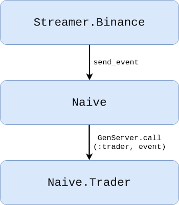
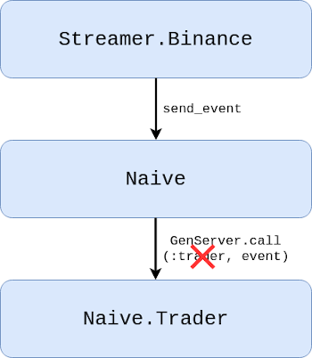
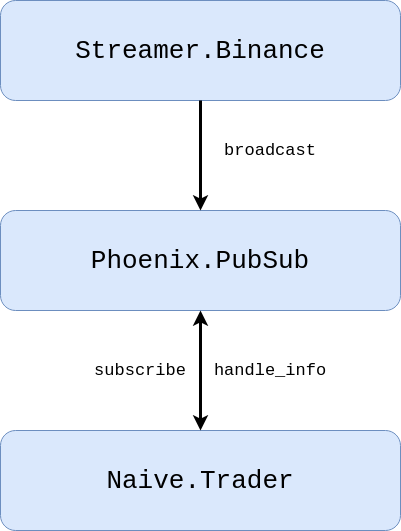
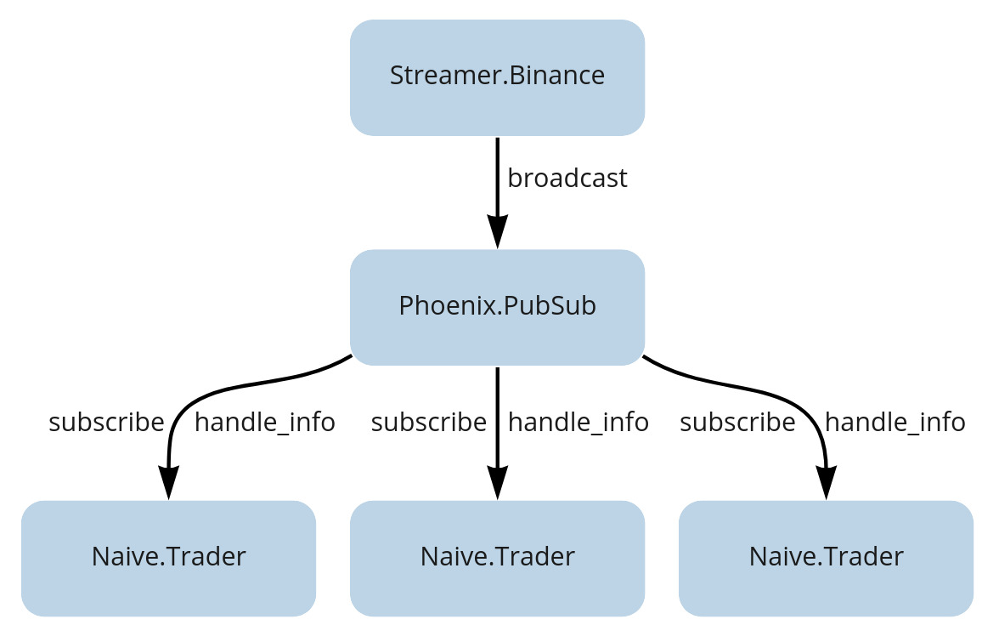
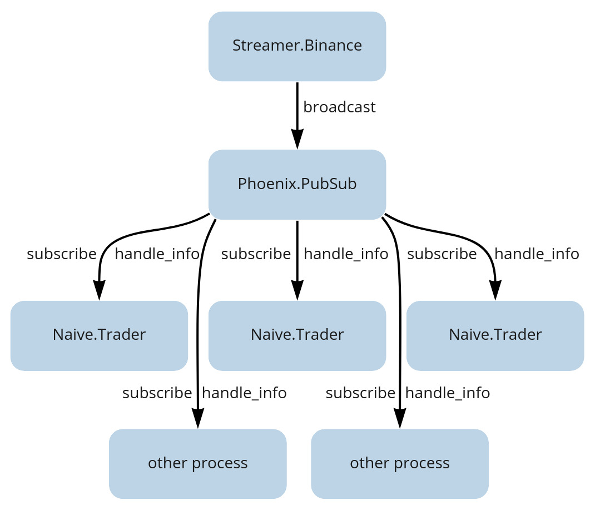

# 引入 PubSub 作为通信方式 {#introduce-pubsub}

把我们现在的通信系统想成一次直接打电话。
`Streamer` 要发送消息，就必须知道 `Trader` 的精确“电话号码”——
在这里就是它的进程 ID 或注册名。
如果我们把它改成无线电广播会怎样？
`Streamer` 只需要在一个已知频率（也就是一个“topic”）上发射，任何有收音机的人都能接收——不再需要电话号码。
在本章里，我们就要引入发布-订阅（Publish-Subscribe）模式来做到这一点。
这种模式让 `Streamer` 可以把数据广播到某个 topic，而任意数量的 `Trader` 进程都能收听。
结果就是一个更灵活、可扩展得多的系统。

## 目标

- 理解发布-订阅（PubSub）模式在架构上的好处。
- 实现 `Phoenix.PubSub`，让 `Streamer.Binance` 和 `Naive.Trader` 解耦。

## 设计

先来看看当前情况：

```{r, fig.align="center", out.width="30%", echo=FALSE}

```

目前，`Streamer.Binance` 进程会调用 `Naive.send_event/1`，
再向那个唯一、已命名的 `Naive.Trader` 进程发送一条 `cast` 消息。

随着交易策略不断扩展，我们将需要同时运行多个 `Naive.Trader`
进程。

这立刻就带来了一个问题：当前设计依赖于一个单独的、带名字的 trader 进程，
但我们无法把多个进程注册成同一个名字。

```{r, fig.align="center", out.width="30%", echo=FALSE}

```

另一个相关问题是 **紧耦合**。
`Streamer` 现在必须准确记住到底哪些进程需要它的数据，
以及如何找到它们。假设我们要加一个新的特性，需要交易事件——比如一个日志模块。
按照现在的设计，我们就得修改 `Streamer.Binance`，让它也去调用 logger。
每增加一个消费者，就意味着要改一次生产者。
如果把这个责任转移出去，`Streamer` 只要负责广播事件，
任何感兴趣的进程都可以按照自己的方式来监听。

为了解决这些问题，我们会采用发布-订阅（Publish-Subscribe，也就是 PubSub）模型：

```{r, fig.align="center", out.width="25%", echo=FALSE}

```

`Streamer` 会把事件**广播**到一个特定的 topic。
任何对这些数据感兴趣的进程都可以**订阅**这个 topic，并自动收到消息。
这样就能把 `Streamer` 和 `Naive` 应用完全解耦。

有了这个新设计，我们就可以很容易地同时运行多个 trader。
每个 trader 只要订阅相关 topic，就能开始接收消息：

```{r, fig.align="center", out.width="100%", out.height="35%", echo=FALSE}

```

这种解耦设计也会打开更多未来的可能性。
比如，另一个独立进程也可以订阅同一个 topic，把数据保存到
数据库里，用于回测：

```{r, fig.align="center", out.width="100%", out.height="45%", echo=FALSE}

```

## 实现

我们先把 [Phoenix.PubSub](https://github.com/phoenixframework/phoenix_pubsub) 库
加到 `Streamer` 和 `Naive` 两个应用的依赖里。
`Streamer` 应用会充当发布者（或者说广播者），
而 `Naive` 应用会放我们的订阅者（也就是 `Naive.Trader` 进程）。

正如 GitHub 上该库的 README 所说，我们首先需要在每个应用的 `mix.exs` 文件里加上 `:phoenix_pubsub` 依赖：

```{r, engine = 'elixir', eval = FALSE}
  # /apps/streamer/mix.exs & /apps/naive/mix.exs
  # Note: deps are conventionally kept in alphabetical order
  defp deps do
    [
      ...
      {:phoenix_pubsub, "~> 2.0"},
      ...
    ]
  end
```

```{=latex}
\begin{sidequest}
```
```{=html}
<div class="sidequest">
```

**架构说明：依赖泄漏**：注意我们刚刚做了什么。为了让交易逻辑工作起来，
`naive` 应用仍然在物理上依赖 `streamer` 应用。
即便 PubSub 理论上是用来“解耦”进程的，我们的项目结构仍然是紧耦合的。

这正是“umbrella 税”的一个典型例子。如果我们哪天想把 `naive` 的交易逻辑迁移到
一台没有 streamer 的其他服务器上，
就很难轻松做到，因为 `mix.exs` 里有 `{:streamer, in_umbrella: true}` 这行。
到了第 3 阶段，我们会看到，迁移到单体或者更精炼的结构，反而可能简化这些关系。

```{=html}
</div>
```
```{=latex}
\end{sidequest}
```

接下来，我们需要把 `Phoenix.PubSub` 加到应用的监督树里，作为一个子进程。
既然 `Streamer` 应用是发布者，那把 PubSub server 放在这里就是最合理的选择。
我们会修改 `/apps/streamer/lib/streamer/application.ex`，把它
加到 children 列表中：

```{r, engine = 'elixir', eval = FALSE}
# /apps/streamer/lib/streamer/application.ex
  def start(_type, _args) do
    children = [
      {
        Phoenix.PubSub,
        name: Streamer.PubSub
      }
    ]
    ...
  end
```

```{=latex}
\begin{sidequest}
```
```{=html}
<div class="sidequest">
```

**注意：umbrella 里的共享资源**
你可能会好奇，`Naive` 应用怎么能找到位于 `Streamer` 应用内部的 `Streamer.PubSub`。
因为我们使用的是 umbrella 项目，所有应用都运行在同一个 Erlang 节点里。
这意味着它们共享同一块内存空间和进程注册表。只要 `Streamer` 应用已经启动了 PubSub 进程，
umbrella 里的任何其他应用都可以通过它的名字“看到”并与之交互。

```{=html}
</div>
```
```{=latex}
\end{sidequest}
```

`Phoenix.PubSub` 默认带有 `Phoenix.PubSub.PG2` 适配器。
这个适配器利用了 Erlang 内置的 [`pg`](http://erlang.org/doc/man/pg.html)（进程组）模块，
从而可以在集群中进行分布式消息传递。
这带来的实际意义很大：`Streamer` 和 `Naive` 应用即使运行在不同服务器上，
只要它们属于同一个 Erlang 集群，就仍然可以像在本地一样透明通信。

现在，我们来修改 `Streamer`，让它向 PubSub topic 使用 `broadcast/3` 发送消息，而不是直接调用 `Naive` 模块：

```{r, engine = 'elixir', eval = FALSE}
# /apps/streamer/lib/streamer/binance.ex
  defp process_event(...) do
    ...
    Phoenix.PubSub.broadcast(
      Streamer.PubSub,
      "TRADE_EVENTS:#{trade_event.symbol}",
      trade_event
    )
  end
```

在 trader 的 `init/1` 回调里，我们需要对 `TRADE_EVENTS` topic 调用 `subscribe/2`：

```{r, engine = 'elixir', eval = FALSE}
# /apps/naive/lib/naive/trader.ex
  def init(...) do
    ...
    Phoenix.PubSub.subscribe(
      Streamer.PubSub,
      "TRADE_EVENTS:#{symbol}"
    )
    ...
  end
```

```{=latex}
\begin{sidequest}
```
```{=html}
<div class="sidequest">
```

**等等——如果消息在我们拿到 tick size 之前就到了怎么办？**

我们仔细看看更新后的 `init/1` 到底发生了什么：

```{r, engine = 'elixir', eval = FALSE}
  # /apps/naive/lib/naive/trader.ex
  def init(%{symbol: symbol, profit_target: profit_target}) do
    symbol = String.upcase(symbol)

    Logger.info("Initializing new trader for #{symbol}")

    Phoenix.PubSub.subscribe(      # <- we subscribe here...
      Streamer.PubSub,
      "TRADE_EVENTS:#{symbol}"
    )

    {:ok,
     %State{
       symbol: symbol,
       profit_target: profit_target,
       tick_size: nil              # <- ...but tick_size is still nil!
     }, {:continue, :fetch_tick_size}}
  end

  def handle_continue(:fetch_tick_size, %State{symbol: symbol} = state) do
    tick_size = fetch_tick_size(symbol)  # <- tick_size fetched here

    {:noreply, %{state | tick_size: tick_size}}
  end
```

我们在 `init/1` 中订阅了交易事件，但要等到 `handle_continue/2` 运行时才去获取 `tick_size`。
如果这段时间里有交易事件到达怎么办？我们的 trader 会不会在初始化完成之前就收到消息？

这是个很好的问题，而答案能揭示出 GenServer 工作方式里的一个重要细节。

真实的执行顺序如下：

1. `init/1` 运行——我们订阅 PubSub，并返回 `{:ok, state, {:continue, :fetch_tick_size}}`
2. `handle_continue/2` 运行——我们从 Binance 获取 `tick_size`
3. 直到这时，GenServer 才开始处理 mailbox 里的消息

关键点在于：**`handle_continue/2` 不是一条会进入 mailbox 的消息。**
它是在 `init/1` 返回后*立刻*发生的一次直接函数调用，
甚至在 GenServer 开始查看 mailbox 之前就执行了。
你可以把 `{:continue, ...}` 这个元组理解成：“我还没完全准备好，请继续帮我做初始化。”

所以，即使在第 1 步和第 2 步期间有交易事件堆积到了 mailbox 里，它们也会耐心等待。
在整个初始化流程完成——包括所有 `handle_continue/2` 回调——之前，GenServer 不会去调用 `handle_info/2`。

这正是 `handle_continue/2` 存在的原因：
它允许我们执行较慢的初始化（比如网络请求），而不会阻塞 supervisor，
同时还能保证进程在处理任何真正工作之前已经完全准备就绪。

```{=html}
</div>
```
```{=latex}
\end{sidequest}
```

接下来，我们会把 `Trader` 里的 `handle_cast/2` 回调替换成 `handle_info/2`。
这个改动非常关键，而且你需要理解为什么要这么做。

当你使用 `GenServer.cast/2` 时，它会给消息包上一层特殊的 `:"$gen_cast"` 标签。
GenServer 会识别这个标签，并把消息路由到 `handle_cast/2`。
但 `Phoenix.PubSub` 并不会使用 `GenServer.cast/2`——它会直接用 `Process.send/3` 把普通的 Elixir 消息发到你的进程 mailbox 里。

没有 `:"$gen_cast"` 这个标签时，我们收到的就是“未标记”的消息。
可以把 `handle_info/2` 理解成处理所有不是标准 call 或 cast 的兜底入口。
PubSub 消息正会落到这里。

最后，我们可以把 `Naive` 模块里的 `send_event/1` 函数删掉了，
因为它已经不再需要。

把所有代码改动都完成后，现在是运行 `mix format` 的好时机，
这样能保持代码库一致、整洁。

接下来，我们进入 `iex` 会话来测试新的广播系统。

我们会启动一个针对同一个 `symbol` 的 `Streamer` 和 `Naive.Trader`。
从下面的输出可以看到，`Trader` 成功订阅了 topic，
接收到了事件，并完成了完整的交易循环：

```{r, engine = 'bash', eval = FALSE}
$ iex -S mix
...
iex(1)> Streamer.start_streaming("xrpusdt")
{:ok, #PID<0.483.0>}
iex(2)> Naive.Trader.start_link(%{symbol: "XRPUSDT", profit_target: "-0.01"})
23:46:37.482 [info]  Initializing new trader for XRPUSDT
{:ok, #PID<0.474.0>}
23:46:55.179 [info]  Placing BUY order for XRPUSDT @ 0.29462000, quantity: 100
23:46:55.783 [info]  Buy order filled, placing SELL order for XRPUSDT @ 0.29225,
quantity: 100.00000000
23:46:56.029 [info]  Trade finished, trader will now exit
```

无线电广播已经开始运作了！我们的 `Streamer` 正在把信号发送到空中，
而 `Trader` 也成功调到了频道。
这种解耦是一个重要里程碑——我们已经移除了生产者和消费者之间的硬依赖，
也为接下来要构建的多 trader 系统打开了大门。

不过，我们的开发流程里还有一个很大的瓶颈：
我们完全依赖实时 Binance API。

这会让测试变慢，需要有余额的账户，而且很难复现特定的市场条件。

在下一章里，
我们会利用刚刚建立的解耦架构来解决这个问题。
我们会创建一个 `BinanceMock` 应用，完美模拟真实交易所的行为。
这样我们就能在一个安全、快速、免费的环境里测试和改进交易逻辑，
而不用冒一分钱的风险。

本章的完整源代码可以在本书仓库中找到（分支：
[chapter_03](https://github.com/Cinderella-Man/hands-on-elixir-and-otp-cryptocurrency-trading-bot-source-code/tree/chapter_03)）。
