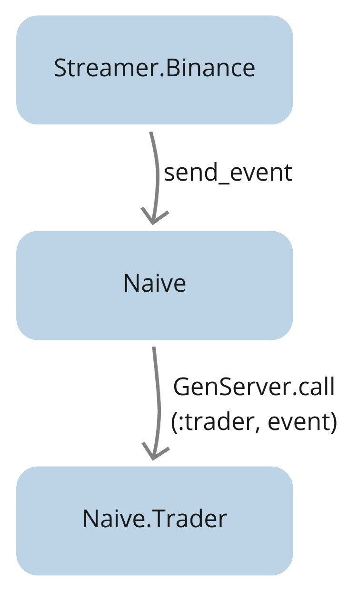
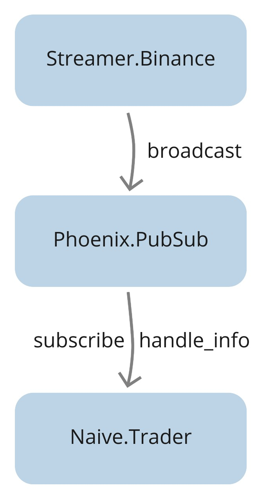
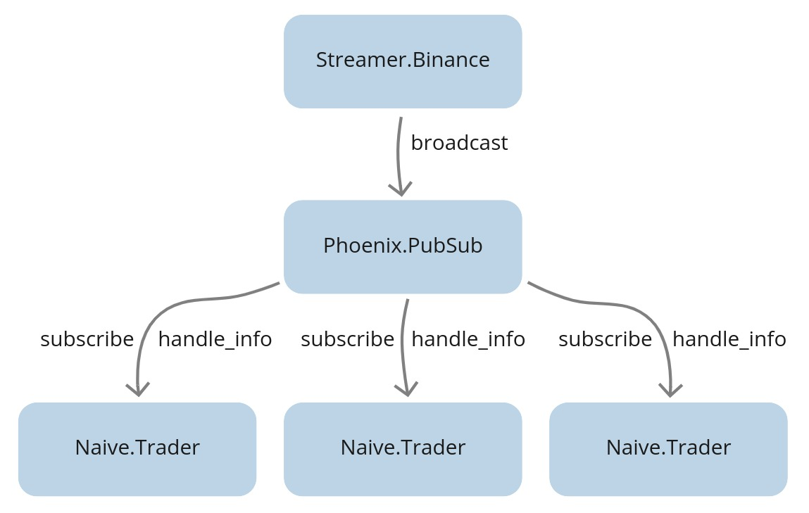

# Introduce PubSub as a communication method

## Objectives

- consider reasons why introducing a PubSub communication would be benefitial
- implement the PubSub communication between the `Streamer.Binance` and the `Naive.Trader`(s)

## Design

First, let's look at the current situation:

<center>
  
</center>
<br/>

We started with the Binance streamer calling the `send_event/1` function on the `Naive` module. The `Naive` module then calls the trader process using the GenServer's `cast/2` function(via it's registered name).

Next step in the process of extending our trading strategy will be to scale it to run multiple `Naive.Trader` processes in parallel. To be able to do that we will need to remove the option to register the `trader` process with a name(as only one process can be registered under single name).

<center>
  
</center>
<br/>

The second issue with that design was the fact that the `Streamer` needs to be aware of all processes that are interested in the streamed data and explicitly push that information to them.

To fix those issues we will invert the design and introduce a PubSub mechanism:

<center>
  
</center>
<br/>

The streamer will broadcast trade events to the PubSub topic and whatever is interested in that data, can subscribe to the topic and it will receive the broadcasted messages.
There's no coupling between the `Streamer` and `Naive` app any more.

We can now introduce multiple traders that will subscribe to the topic and
they will receive messages from the PubSub:

<center>
  
</center>
<br/>

Going even further down the line we can picture that system could consist of other processes interested in the streamed data. Example of those could be a process that will save all streamed information to the database to be utilized in backtesting later on:

<center>
  
</center>

## Implementation

We will start by adding a [`Phoenix.PubSub`](https://github.com/phoenixframework/phoenix_pubsub) library to both `Streamer` and `Naive` app(as both will be using it, `Streamer` app as a broadcaster and `Naive` app as a subscriber)

Scrolling down through it's readme on GitHub we can see that we need to add `:phoenix_pubsub` to list of dependencies:

```{r, engine = 'elixir', eval = FALSE}
# /apps/streamer/mix.exs & /apps/naive/mix.exs
  defp deps do
    [
      ...
      {:phoenix_pubsub, "~> 2.0"},
      ...
    ]
  end
```

Remember to place it so the list will keep alphabetical order. Second step in the readme says that we need to add PubSub as a child of our app. We need to decide where we will put it, `Streamer` sounds like a good starting point. We will modify the `/apps/streamer/lib/streamer/application.ex` module by appending the PubSub to it:

```{r, engine = 'elixir', eval = FALSE}
# /apps/streamer/lib/streamer/application.ex
  def start(_type, _args) do
    children = [
      {
        Phoenix.PubSub,
        name: Streamer.PubSub, adapter_name: Phoenix.PubSub.PG2
      }
    ]
    ...
  end
```

We will add the `:adapter_name` option to instruct PubSub to use [`pg`](http://erlang.org/doc/man/pg.html) adapter, which will give us distrubuted process groups.

We will now modify the streamer to broadcast a message to PubSub topic instead of using the `Naive` module's function:

```{r, engine = 'elixir', eval = FALSE}
# /apps/streamer/lib/streamer/binance.ex
  defp process_event(...) do
    ...

    Phoenix.PubSub.broadcast(
      Streamer.PubSub,
      "TRADE_EVENTS:#{trade_event.symbol}",
      trade_event
    )
  end
```

Inside the trader on init we need to subscribe to the "TRADE_EVENTS" PubSub channel:

```{r, engine = 'elixir', eval = FALSE}
# /apps/naive/lib/naive/trader.ex
  def init(...) do
    ...

    Phoenix.PubSub.subscribe(
      Streamer.PubSub,
      "TRADE_EVENTS:#{symbol}"
    )

    ...
  end
```

Next, we need to convert all `handle_call` callbacks to `handle_info` inside our `Trader` module as PubSub doesn't use `GenServer.cast/2` to send messages over to subscribers.

The final change will be to remove the `send_event` function from the `Naive`
module as it's no longer required.

Our update is now finished so we can start an iex session to see how it works.

First, we will start a streamer process that will broadcast messages
to PubSub. Next, we will start trading on the same symbol. On init, trader will subscribe to a PubSub channel and it will make a full trade cycle.

```{r, engine = 'bash', eval = FALSE}
$ iex -S mix
...
iex(1)> Streamer.start_streaming("xrpusdt")
{:ok, #PID<0.483.0>}
iex(2)> Naive.Trader.start_link(%{symbol: "XRPUSDT", profit_interval: Decimal.new("-0.01")}) 
23:46:37.482 [info]  Initializing new trader for XRPUSDT
{:ok, #PID<0.474.0>}
23:46:55.179 [info]  Placing BUY order for XRPUSDT @ 0.29462000, quantity: 100
23:46:55.783 [info]  Buy order filled, placing SELL order for XRPUSDT @ 0.29225), quantity: 100.00000000
23:46:56.029 [info]  Trade finished, trader will now exit
```

This shows that new trader process successfully subscribed to the PubSub, received the broadcasted messages, placed buy/sell orders and terminated after full trade cycle finished.

[Note] Please remember to run `mix format` to keep things nice and tidy.

Source code for this chapter can be found at [Github](https://github.com/frathon/create-a-cryptocurrency-trading-bot-in-elixir-source-code/tree/chapter_03)
