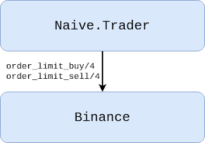
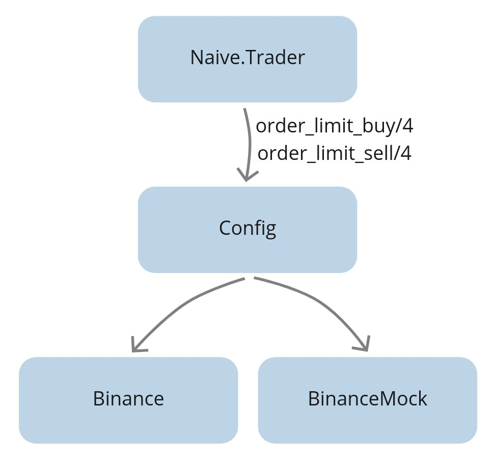
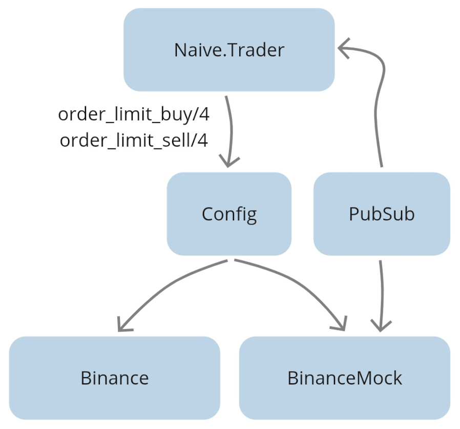
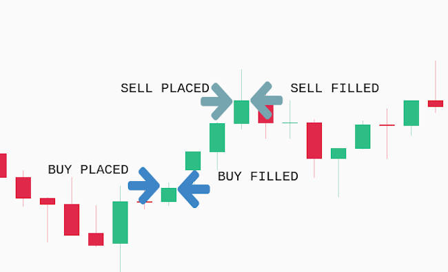

# Mock the Binance API

So far, our `Trader` has been talking directly to the real Binance exchange.
If you ran the example from the previous chapter, you may have noticed the tension:
every test run uses real API calls, burns through rate limits, and - if you're not careful - real money.
Developing against a live API can feel a bit like walking a tightrope without a safety net.

In this chapter, we'll overcome these hurdles by creating a new `BinanceMock` module that will act
as a drop-in replacement for the real `Binance` module. This mock, built as a `GenServer`,
will maintain an in-memory order book and leverage our existing PubSub system to simulate order updates.
This approach will allow us to develop and test our trading logic safely and efficiently.

Let's dive in!

## Objectives

- Design the `BinanceMock` application
- Create a new app
- Implement getting exchange info
- Implement placing buy and sell orders
- Implement callback for incoming trade events
- Update the Trader and Configuration
- Test the implementation

## Design

Let's start by reviewing the current state of our application:

```{r, fig.align="center", out.width="30%", echo=FALSE}

```

Currently, our `Trader` uses the `Binance` module to place buy/sell
orders and get exchange info.

Since `Binance.get_exchange_info/0` retrieves public data and doesn't require authentication,
our mock can simply pass this request through to the real `Binance` library.

Other functions, such as placing buy and sell orders, require a funded Binance account.
To avoid this dependency during development, we'll create a mock that simulates these
functions.

We will update the `Trader` to fetch the module's name from the configuration:

```{r, fig.align="center", out.width="80%", out.height="40%", echo=FALSE}

```

By fetching the module name from our configuration, we give our `Trader` 'pluggable' behavior.
This means we can swap the real `Binance` client for our mock one with a single line of config -
all without touching a single line of our core trading logic. It's a clean, powerful way to keep our system flexible.

The `BinanceMock` module itself will implement the same contract
(or public API) as the real `Binance` module.

It will need to store buy and sell orders and provide a way to retrieve them,
covering the functionality of the REST API endpoints we use.

However, the real Binance API also tracks when orders are filled.
In the real world, Binance tells us when an order is filled.
In our mock world, *we* are the exchange - and that's a fundamental shift in perspective.
We're no longer just a client waiting for notifications; we're the system that must watch the incoming price stream and decide:
'Has the price hit our target? If so, let's fill that order!'
This is where our mock really comes to life.

To mimic this, `BinanceMock` will subscribe to the `"TRADE_EVENTS:#{symbol}"`
PubSub topic. These trade events will provide the data needed to
update the statuses of our fake orders.

```{r, fig.align="center", out.width="80%", out.height="40%", echo=FALSE}

```

So, how will our mock know when to fill an order?
The `BinanceMock` process will subscribe to the trade events stream and
mark an order as filled once a market trade occurs at a price that would execute it.

```{r, fig.align="center", out.width="90%", echo=FALSE}

```

As the diagram shows, our naive strategy places an order at the current market price.

In this scenario, the market price briefly **rises** after our order is placed.
The `BinanceMock` will then wait for a trade event from PubSub where the
**trade price is at or below our buy order's price**.
When this condition is met, `BinanceMock` marks our buy order as `"FILLED"`.

Upon detecting the filled order, the `Trader` will proceed to place a sell order.
Similar to the buy order, `BinanceMock` will wait for a trade event from PubSub
where the **trade price is at or above the sell order's price**.
When this condition is met, `BinanceMock` marks our sell order as `"FILLED"`.

Enough theory for now, let's get our hands dirty with some coding.

## Create "BinanceMock" app

Let's start by creating a new supervised app called `BinanceMock`:

```{r, engine = 'bash', eval = FALSE}
$ cd apps
$ mix new binance_mock --sup
```

Next, we'll set up the `BinanceMock` module itself.
We'll make it a `GenServer` to manage its state, which will include the
in-memory order books.

We'll use the `Decimal` module for accurate price comparisons and the
`Logger` module for logging.

The `GenServer` will manage its state using an internal `%State{}` struct, which contains:

* an `order_books` map, which will store the order book for each trading `symbol`.
* a list of `subscriptions` to track the PubSub topics the mock is listening to.
* the `next_order_id`, ensuring we can create unique and predictable IDs for our fake orders.

The `order_books` map will hold an `%OrderBook{}` struct for each trading `symbol`.
Each `%OrderBook{}` will, in turn, contain three lists:
`buy_side`, `sell_side`, and `historical`.

```{r, engine = 'elixir', eval = FALSE}
# /apps/binance_mock/lib/binance_mock.ex
defmodule BinanceMock do
  use GenServer

  alias Decimal, as: D
  alias Streamer.Binance.TradeEvent

  require Logger

  defmodule State do
    defstruct order_books: %{}, subscriptions: [], next_order_id: 1
  end

  defmodule OrderBook do
    defstruct buy_side: [], sell_side: [], historical: []
  end  

  def start_link(_args) do
    GenServer.start_link(__MODULE__, nil, name: __MODULE__)
  end

  def init(_args) do
    {:ok, %State{}}
  end
end
```

## Implement getting exchange info

As mentioned, we can retrieve the exchange info by calling the `Binance` module's
function directly, since it provides public data:

```{r, engine = 'elixir', eval = FALSE}
# /apps/binance_mock/lib/binance_mock.ex
  def get_exchange_info do
    Binance.get_exchange_info()
  end
```

## Implement placing buy and sell orders

Since the logic for placing buy and sell limit orders is nearly identical,
we'll create a private helper function, `order_limit/4`, to handle both.

```{r, engine = 'elixir', eval = FALSE}
# /apps/binance_mock/lib/binance_mock.ex
  def order_limit_buy(symbol, quantity, price, "GTC") do
    order_limit(symbol, quantity, price, "BUY")
  end

  def order_limit_sell(symbol, quantity, price, "GTC") do
    order_limit(symbol, quantity, price, "SELL")
  end
```

In the `order_limit/4` helper function, we will:

* Generate a fake order based on the provided `symbol`, `quantity`, `price`, and `side`.
* Send a `cast` message to the `BinanceMock` `GenServer` to add the fake order to the order book.
* Return an `{:ok, %OrderResponse{}}` tuple to maintain API compatibility with the real `Binance` module.

```{r, engine = 'elixir', eval = FALSE}
# /apps/binance_mock/lib/binance_mock.ex
  defp order_limit(symbol, quantity, price, side) do
    %Binance.Order{} =
      fake_order =
      generate_fake_order(
        symbol,
        quantity,
        price,
        side
      )

    GenServer.cast(
      __MODULE__,
      {:add_order, fake_order}
    )

    {:ok, convert_order_to_order_response(fake_order)}
  end
```


Next, let's implement the `handle_cast/2` callback for the `:add_order` message.
This function will first subscribe to the appropriate `TRADE_EVENTS:#{symbol}` topic
(if it hasn't already) and then add the incoming order to the correct order book
for its symbol:

```{r, engine = 'elixir', eval = FALSE}
# /apps/binance_mock/lib/binance_mock.ex
  def handle_cast(
        {:add_order, %Binance.Order{symbol: symbol} = order},
        %State{
          order_books: order_books,
          subscriptions: subscriptions
        } = state
      ) do
    new_subscriptions = subscribe_to_topic(symbol, subscriptions)
    updated_order_books = add_order(order, order_books)

    {
      :noreply,
      %{
        state
        | order_books: updated_order_books,
          subscriptions: new_subscriptions
      }
    }
  end
```

Let's start by implementing `subscribe_to_topic/2`.
This function ensures the `symbol` is uppercased and checks
if we've already subscribed to that symbol's topic.
If not, it subscribes the process to the `TRADE_EVENTS:#{symbol}` topic
using the `Phoenix.PubSub` module.

Finally, we'll prepend the symbol to our list of subscriptions and return the updated list:

```{r, engine = 'elixir', eval = FALSE}
# /apps/binance_mock/lib/binance_mock.ex
  defp subscribe_to_topic(symbol, subscriptions) do
    symbol = String.upcase(symbol)
    stream_name = "TRADE_EVENTS:#{symbol}"

    case Enum.member?(subscriptions, symbol) do
      false ->
        Logger.debug("BinanceMock subscribing to #{stream_name}")

        Phoenix.PubSub.subscribe(
          Streamer.PubSub,
          stream_name
        )

        [symbol | subscriptions]

      _ ->
        subscriptions
    end
  end
```

Next, let's implement the `add_order/2` function. First, we need to get the order book
for the order's symbol.

Depending on the order's side, we will update either the `buy_side` or `sell_side` list.

**A Note on Performance: Going the Extra Mile**

Before we dive into the code for adding orders,
let's talk about performance. When adding a new order to our `buy_side` or `sell_side` lists,
we have a crucial requirement: **the list must remain sorted by price**.

A simple approach would be to add the new order and then re-sort the
entire list with `Enum.sort/1`. While this works, it introduces a hidden performance
bottleneck.

Sorting the entire list on every insertion is
an expensive operation with a time complexity of $O(n \log n)$. As the number of open orders
grows, this seemingly innocent function could slow down our entire mock server.

This is where we can **go the extra mile**. Instead of the easy add-then-sort method,
we will write a custom `insert_sorted/3` helper. This function will find the correct
position for the new order in the already-sorted list and insert it there directly.
This approach is far more efficient ($O(n)$) and ensures our mock remains fast
and responsive, no matter how many orders we're handling.

While it might seem like over-engineering for a mock server,
this is a **perfect exercise** in writing professional, scalable code.
A word of caution, though: in real-world projects, you should *measure before you optimize*.
Here, the exercise is valuable because (a) the fix is simple, and (b) it teaches a pattern you'll use elsewhere.
Learning to identify *when* a potential bottleneck is worth addressing - and when it isn't - is just as important as knowing *how* to fix it.

```{r, engine = 'elixir', eval = FALSE}
# /apps/binance_mock/lib/binance_mock.ex
  defp add_order(
         %Binance.Order{symbol: symbol} = order,
         order_books
       ) do
    order_book = Map.get(order_books, symbol, %OrderBook{})

    order_book =
      if order.side == "SELL" do
        # Sell orders are sorted ascending (lowest price first)
        updated_sell_side = insert_sorted(order, order_book.sell_side, &D.lt?/2)
        %{order_book | sell_side: updated_sell_side}
      else
        # Buy orders are sorted descending (highest price first)  
        updated_buy_side = insert_sorted(order, order_book.buy_side, &D.gt?/2)
        %{order_book | buy_side: updated_buy_side}
      end

    Map.put(order_books, symbol, order_book)
  end

  defp insert_sorted(order, orders, sorter) do
    {left, right} =
      Enum.split_while(
        orders,
        &sorter.(
          D.from_float(&1.price),
          D.from_float(order.price)
        )
      )

    left ++ [order | right]
  end
```

The magic of our new approach lies in the `insert_sorted/3` helper function.
Instead of appending an order and then re-sorting the entire list,
this function finds the correct position and reconstructs the list in a single,
efficient pass. Let's break down how it works.

The function uses `Enum.split_while/2` to divide the existing list into two parts:
a `left` list containing all orders that should come *before* our new one,
and a `right` list with everything that should come *after*.

Once the split point is found, the expression `left ++ [order | right]` efficiently
reconstructs the list. The `[order | right]` part prepends the new order to the
right list (a very fast operation in Elixir), and then the `++` operator concatenates
the left list with that result. This builds a new, sorted list in a single pass
without a costly re-sort.

Notice how we pass a sorter function (`&D.lt?/2` or `&D.gt?/2`) as the third argument.
This makes our helper flexible, allowing us to sort in either ascending or descending order.

Now, let's implement the helper functions we referred to previously:
`generate_fake_order/4` and `convert_order_to_order_response/1`.

Starting with `generate_fake_order/4`, this function takes a `symbol`, `quantity`, `price`,
and `side` and returns a `%Binance.Order{}` struct populated with fake data.


To ensure our tests are predictable, we need a way to generate unique
and consistent IDs for these fake orders. We'll achieve this by using
the `next_order_id` from our `GenServer`'s state, which guarantees that
tests produce the same order IDs every time they run.

```{r, engine = 'elixir', eval = FALSE}
# /apps/binance_mock/lib/binance_mock.ex
  defp generate_fake_order(symbol, quantity, price, side)
      when is_binary(symbol) and
             is_binary(quantity) and
             is_number(price) and
             (side == "BUY" or side == "SELL") do
    current_timestamp = :os.system_time(:millisecond)
    order_id = GenServer.call(__MODULE__, :generate_id)
    client_order_id = :crypto.hash(:md5, "#{order_id}") |> Base.encode16()

    Binance.Order.new(%{
      symbol: symbol,
      order_id: order_id,
      client_order_id: client_order_id,
      price: price,
      orig_qty: quantity,
      executed_qty: "0.00000000",
      cummulative_quote_qty: "0.00000000",
      status: "NEW",
      time_in_force: "GTC",
      type: "LIMIT",
      side: side,
      stop_price: "0.00000000",
      iceberg_qty: "0.00000000",
      time: current_timestamp,
      update_time: current_timestamp,
      is_working: true
    })
  end
```

To convert a `%Binance.Order{}` into a `%Binance.OrderResponse{}`,
we can reuse the same logic we implemented in the `Naive.Trader` module.

Since this conversion logic is needed in both our `Trader` and `BinanceMock`,
the best practice would be to move this function into a shared application
within our umbrella project.
For now, however, we'll simply copy the implementation to avoid refactoring too early.

```{r, engine = 'elixir', eval = FALSE}
# /apps/binance_mock/lib/binance_mock.ex
  defp convert_order_to_order_response(%Binance.Order{} = order) do
    response = struct(Binance.OrderResponse, Map.from_struct(order))
    %{response | transact_time: order.time}
  end
```

**Note**: You might be tempted to stop everything and build a shared Core application right now -
after all, this duplication violates the DRY (Don't Repeat Yourself) principle.
In real-world projects, we often accept a little 'technical debt' like this to keep momentum.
The key is to *acknowledge* it and *plan* to address it. Don't worry - we'll pay this debt back in Chapter 15
when we extract shared utilities into a proper Core application!

To complete the order placement logic, we need the `handle_call/3` callback
for `:generate_id`. This function replies to the caller with the current `next_order_id`
and updates the `state` by incrementing the ID for the next request.

```{r, engine = 'elixir', eval = FALSE}
# /apps/binance_mock/lib/binance_mock.ex
  def handle_call(
        :generate_id,
        _from,
        %State{next_order_id: id} = state
      ) do
    {:reply, id, %{state | next_order_id: id + 1}}
  end
```

## Implement Order Retrieval

We can now move on to retrieving the orders.
First, we need to add an interface function that will call our `BinanceMock` `GenServer`:

```{r, engine = 'elixir', eval = FALSE}
# /apps/binance_mock/lib/binance_mock.ex
  def get_order(symbol, time, order_id) do
    GenServer.call(
      __MODULE__,
      {:get_order, symbol, time, order_id}
    )
  end
```

The `handle_call/3` callback is straightforward.
First, it retrieves the order book for the given `symbol`.

A retrieval request doesn't specify whether the order is a buy or a sell, or if it's open or filled.
Therefore, we must search all three lists - `buy_side`, `sell_side`,
and `historical` - to find the matching order.

```{r, engine = 'elixir', eval = FALSE}
# /apps/binance_mock/lib/binance_mock.ex
  def handle_call(
        {:get_order, symbol, time, order_id},
        _from,
        %State{order_books: order_books} = state
      ) do
    order_book =
      Map.get(
        order_books,
        symbol,
        %OrderBook{}
      )

    (order_book.buy_side ++
       order_book.sell_side ++
       order_book.historical)
    |> Enum.find(
      &(&1.symbol == symbol and
          &1.time == time and
          &1.order_id == order_id)
    )
    |> case do
      %Binance.Order{} = order -> {:reply, {:ok, order}, state}
      _ -> {:reply, {:error, :not_found}, state}
    end
  end
```

## Implement callback for incoming trade events

Finally, we need to handle incoming trade events received from the PubSub topic.
We'll implement a `handle_info/2` callback that performs the following steps:

* Gets the order book for the `symbol` from the trade event.
* Finds all `buy_side` orders that can be filled. A buy order is considered filled if its price is **greater than or equal** to the trade's price. For example, a buy order at $50.00 will be filled by a trade at $50.00 or below.
* Finds all `sell_side` orders that can be filled. A sell order is considered filled if its price is **less than or equal** to the trade's price. For example, a sell order at $50.00 will be filled by a trade at $50.00 or above.
* Moves the filled orders from the active `buy_side` and `sell_side` lists into a `historical` list for future lookups.

**Here we see the payoff from our earlier decision to keep the order lists sorted.**
We can efficiently filter out filled orders using `Enum.split_while/2`:

```{r, engine = 'elixir', eval = FALSE}
# /apps/binance_mock/lib/binance_mock.ex
  def handle_info(
        %TradeEvent{} = trade_event,
        %{order_books: order_books} = state
      ) do
    order_book =
      Map.get(
        order_books,
        trade_event.symbol,
        %OrderBook{}
      )

    trade_price = D.from_float(trade_event.price)

    {to_fill_buy_orders, remaining_buy_orders} =
      order_book.buy_side
      |> Enum.split_while(&D.lte?(trade_price, D.from_float(&1.price)))

    {to_fill_sell_orders, remaining_sell_orders} =
      order_book.sell_side
      |> Enum.split_while(&D.gte?(trade_price, D.from_float(&1.price)))

    filled_orders = 
      (to_fill_buy_orders ++ to_fill_sell_orders)
      |> Enum.map(&Map.replace!(&1, :status, "FILLED"))

    order_books =
      Map.put(
        order_books,
        trade_event.symbol,
        %{
          buy_side: remaining_buy_orders,
          sell_side: remaining_sell_orders,
          historical: filled_orders ++ order_book.historical
        }
      )

    {:noreply, %{state | order_books: order_books}}
  end
```

**Note:** We're letting that `historical` list grow forever. In a high-frequency environment,
this is a silent "time bomb" that will eventually exhaust your RAM and crash the node -
potentially hours or days after deployment, making it notoriously hard to debug.
We'll leave it as-is since it's just a mock, but to make this production-grade,
you'd want to either truncate the list (e.g., keep only the last 1,000 orders) or offload the data to persistent storage.

And that's it for the `BinanceMock` implementation. Now, we need to add it to
the application's supervision tree so it starts automatically:

```{r, engine = 'elixir', eval = FALSE}
# /apps/binance_mock/lib/binance_mock/application.ex
...
  def start(_type, _args) do
    children = [
      {BinanceMock, []}
    ]
    ...
  end
end
```

## Update the Trader and Configuration

Next, let's update the `Naive.Trader` module.
We'll use a module attribute to read the Binance client from
the application's configuration:

```{r, engine = 'elixir', eval = FALSE}
  # /apps/naive/lib/naive/trader.ex
  @binance_client Application.compile_env(:naive, :binance_client)
```

Inside the `Naive.Trader` module, we'll replace all direct calls to `Binance` with
our new `@binance_client` module attribute:

```{r, engine = 'elixir', eval = FALSE}
# /apps/naive/lib/naive/trader.ex

...
  @binance_client.order_limit_buy(
...
  @binance_client.get_order(
...
  @binance_client.order_limit_sell(
...
  @binance_client.get_order(
...
  @binance_client.get_exchange_info()
...
```

Since `Naive.Trader` now relies on the application configuration to determine
which client to use, we need to add this setting to our `/config/config.exs` file:

```{r, engine = 'elixir', eval = FALSE}
# /config/config.exs

config :naive,
  binance_client: BinanceMock
```

The final step is to configure our dependencies.
We'll start by modifying the `mix.exs` of the `binance_mock` app to list the
packages it requires:

```{r, engine = 'elixir', eval = FALSE}
# /apps/binance_mock/mix.exs
...
  defp deps do
    [
      {:binance, "~> 1.0"},
      {:decimal, "~> 2.0"},
      {:phoenix_pubsub, "~> 2.0"},
      {:streamer, in_umbrella: true}
    ]
  end
...
```

We'll also add `:binance_mock` to the dependency list for the `naive` app,
since it will use either `Binance` or `BinanceMock` to trade:

```{r, engine = 'elixir', eval = FALSE}
# /apps/naive/mix.exs
...
  defp deps do
    [
      ...
      {:binance_mock, in_umbrella: true},
      ...
    ]
  end
...
```

## Test the implementation

We can now see the `BinanceMock` in action.
First, let's start an `iex` session and verify that the `BinanceMock` process is running.
Since our configuration already points to `BinanceMock`, we can start streaming and
trading on a `symbol` just as we did in the previous chapter:

```{r, engine = 'bash', eval = FALSE}
$ iex -S mix
...
iex(1)> Process.whereis(BinanceMock)
#PID<0.320.0> # <- confirms that BinanceMock process is alive
iex(2)> Streamer.start_streaming("xrpusdt")
{:ok, #PID<0.332.0>}
iex(3)> Naive.Trader.start_link(%{symbol: "xrpusdt", profit_target: "-0.001"})
00:19:39.232 [info]  Initializing new trader for XRPUSDT
{:ok, #PID<0.318.0>}
00:19:40.826 [info]  Placing BUY order for XRPUSDT @ 0.29520000, quantity: 100
00:19:44.569 [info]  Buy order filled, placing SELL order for XRPUSDT @ 0.29549,
quantity: 100.0
00:20:09.391 [info]  Trade finished, trader will now exit
```

**Well done!** You've just built one of the most critical components for any serious application:
a mock for an external service. By creating `BinanceMock`, you've successfully *decoupled* your trading logic from the live Binance exchange -
and decoupling is the secret weapon of maintainable software.

This is a massive milestone. It means you can now test your trading strategies safely without risking real money,
develop new features without needing an active internet connection,
and run automated tests reliably without worrying about network latency or API rate limits.

More importantly, you've learned a pattern that applies far beyond this project:
whenever you depend on an external system, consider how you'd swap it out. That mindset will serve you well.

**So, What's Next?**

Now that we have a safe and reliable testing environment, we can confidently tackle
a much bigger challenge. Our current trader can only handle one symbol at a time.
To build a truly effective bot, we need it to trade on many different symbols in parallel.

In the next chapter, we'll dive deep into the heart of OTP by building a
supervision tree. This will allow us to dynamically launch, monitor, and even
automatically restart traders for multiple symbols, creating a truly fault-tolerant
and concurrent trading system. The `BinanceMock` we've just built will be an essential
safety net, allowing us to engineer this complex architecture with confidence.
Let's get started!

[Note] Please remember to run `mix format` to keep things nice and tidy.

The source code for this chapter can be found in the book's source code repository
(branch:
[chapter_04](https://github.com/Cinderella-Man/hands-on-elixir-and-otp-cryptocurrency-trading-bot-source-code/tree/chapter_04)).
