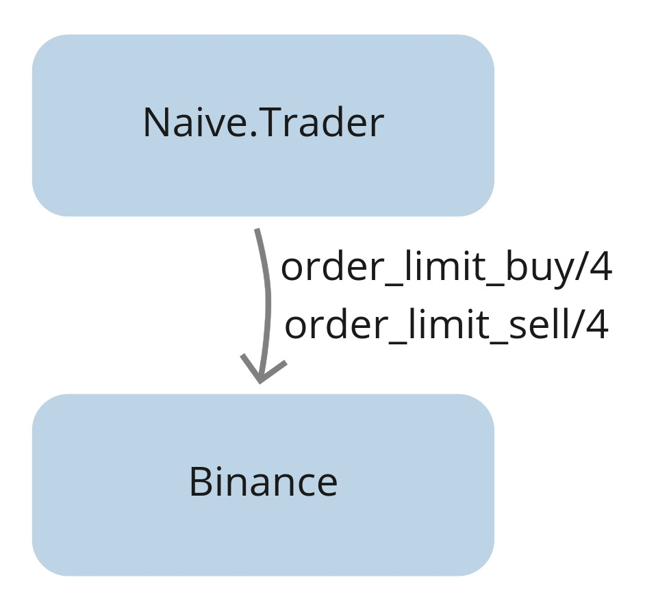

# Mock the Binance API

## Objectives

- design the binance mock application
- create a new app
- implement getting exchange info
- implement placing buy and sell orders
- implement callback for incoming trade events
- upgrade trader and config
- test the implementation

## Design

First, let's start with the current state:

```{r, fig.align="center", out.width="40%", echo=FALSE}

```

Currently, our trader is using the `Binance` module to place buy/sell
orders and get exchange info.
The `get_exchange_info/0` function doesn't require a Binance account as it's publicly available information so we can call the `Binance` lib directly from our module.
The remaining ones(buying/selling) require a `Binance` account and some coins/tokens inside its wallet. We need to mock those inside our module.

\newpage

We will update the trader to fetch the Binance's module name from the config:

```{r, fig.align="center", out.width="80%", echo=FALSE}
knitr::include_graphics("images/chapter_04_02_proposal.png")
```

We will set up a config so it points to the Binance client to be used - either Binance or BinanceMock. Regards the BinanceMock itself it will have the same interface as the Binance module.
It will need to store both buy and sell orders and it will allow us to retrieve them. That will cover the REST functions but Binance also streams back trade events for those orders as they get filled, that's why BinanceMock will also need to broadcast fake events to the "TRADE_EVENTS:#{symbol}" PubSub topic so the trader will pick them up:


```{r, fig.align="center", out.width="80%", echo=FALSE}
knitr::include_graphics("images/chapter_04_03_proposal_pubsub.png")
```

\newpage

When exactly should we broadcast those fake trade events? Well, the best thing
that we can do is make the `BinanceMock` process subscribe to the trade events stream and try to broadcast fake trade events whenever the price of orders would be matched:


```{r, fig.align="center", out.width="70%", echo=FALSE}

```

Starting from the arrow on the left, our naive strategy will place an order at the current price.
In this hypotetical scenario, the price raised for a moment after placing the buy order, so BinanceMock will keep on waiting until a trade event will get broadcasted from the PubSub with a price *below* the buy order's price. At that moment BinanceMock will generate a fake trade event and broadcast it to the same PubSub topic.
The trader will get that event and assume that it came from the Binance and that the buy order got filled so it will place a sell order.
Similar to the buy order, BinanceMock will keep on waiting until a trade event will get broadcasted from the PubSub with the price *above* the sell order's price. At that moment BinanceMock will generate a fake trade event and broadcast it to the same PubSub topic.

Enough theory for now, let's get our hands dirty with some coding.

## Create "BinanceMock" app

We will start by creating a new supervised app called `BinanceMock`:

```{r, engine = 'bash', eval = FALSE}
$ cd apps
$ mix new binance_mock --sup
```

The next step will be to update the `BinanceMock` module to be a GenServer. 

We will utilize:

* the `Decimal` module for comparing the prices
* the `Logger` module to log

\newpage

As well as we will define internal `%State{}` struct that will hold:

* map called `order_books` for each traded symbol
* list of symbols that mock subscribed to
* last generated id - for consistent generating of unique ids for fake trade events

`order_books` map will consist of `:"#{symbol}` => `%OrderBook{}`. We will define the `%OrderBook{}` struct as 3 lists `buy_side`, `sell_side` and `historical`:

```{r, engine = 'elixir', eval = FALSE}
# /apps/binance_mock/lib/binance_mock.ex
defmodule BinanceMock do
  use GenServer

  alias Decimal, as: D

  require Logger

  defmodule State do
    defstruct order_books: %{}, subscriptions: [], fake_order_id: 1
  end

  defmodule OrderBook do
    defstruct buy_side: [], sell_side: [], historical: []
  end  

  def start_link(_args) do
    GenServer.start_link(__MODULE__, nil, name: __MODULE__)
  end

  def init(_args) do
    {:ok, %State{}}
  end
end
```

## Implement getting exchange info

As it was mentioned before, to retrieve exchange info we can just call Binance's function directly as its publicly available information:

```{r, engine = 'elixir', eval = FALSE}
# /apps/binance_mock/lib/binance_mock.ex
  def get_exchange_info do
    Binance.get_exchange_info()
  end
```

\newpage

## Implement placing buy and sell orders

For buy and sell limit orders we will write a helper function as the logic is
the same for both order sides:

```{r, engine = 'elixir', eval = FALSE}
# /apps/binance_mock/lib/binance_mock.ex
  def order_limit_buy(symbol, quantity, price, "GTC") do
    order_limit(symbol, quantity, price, "BUY")
  end

  def order_limit_sell(symbol, quantity, price, "GTC") do
    order_limit(symbol, quantity, price, "SELL")
  end
```

The "order_limit" helper function will:

* generate a fake order based on symbol, quantity, price, and side
* cast a message to the BinanceMock process to add the fake order
* return with a tuple with `%OrderResponse{}` struct to be consistent with the Binance module:

```{r, engine = 'elixir', eval = FALSE}
# /apps/binance_mock/lib/binance_mock.ex
  defp order_limit(symbol, quantity, price, side) do
    %Binance.Order{} =
      fake_order =
      generate_fake_order(
        symbol,
        quantity,
        price,
        side
      )

    GenServer.cast(
      __MODULE__,
      {:add_order, fake_order}
    )

    {:ok, convert_order_to_order_response(fake_order)}
  end
```

We can now move on to the implementation of the `handle_cast/2` callback to `:add_order` to the order book for the symbol from the order.
It needs to do two things:

* subscribe to the `TRADE_EVENTS:#{symbol}` topic for the symbol from the order
* add the order to the correct order book

```{r, engine = 'elixir', eval = FALSE}
# /apps/binance_mock/lib/binance_mock.ex
  def handle_cast(
        {:add_order, %Binance.Order{symbol: symbol} = order},
        %State{
          order_books: order_books,
          subscriptions: subscriptions
        } = state
      ) do
    new_subscriptions = subscribe_to_topic(symbol, subscriptions)
    updated_order_books = add_order(order, order_books)

    {
      :noreply,
      %{
        state
        | order_books: updated_order_books,
          subscriptions: new_subscriptions
      }
    }
  end
```

We will start with the implementation of the `subscribe_to_topic/2` function. We need to make sure that the symbol is uppercased as well as check have we already subscribed to that topic. Otherwise, we can safely use the PubSub module to subscribe to the `TRADE_EVENTS:#{symbol}` topic for this symbol.
We need to remember to append the symbol to the list of subscription and return the updated list:

```{r, engine = 'elixir', eval = FALSE}
# /apps/binance_mock/lib/binance_mock.ex
  defp subscribe_to_topic(symbol, subscriptions) do
    symbol = String.upcase(symbol)
    stream_name = "TRADE_EVENTS:#{symbol}"

    case Enum.member?(subscriptions, symbol) do
      false ->
        Logger.debug("BinanceMock subscribing to #{stream_name}")

        Phoenix.PubSub.subscribe(
          Streamer.PubSub,
          stream_name
        )

        [symbol | subscriptions]

      _ ->
        subscriptions
    end
  end
```

Next, time for implementation of the `add_order` function. First, we need to get the order book for the symbol of the order. Depends on the side of the order we will update either the `buy_side` or `sell_side` list remembering that both sides are sorted. We are sorting them so we can easily grab all orders that should be filled whenever trade event arrived, this will become clearer as we will write a handle callback for incoming trade events:

```{r, engine = 'elixir', eval = FALSE}
# /apps/binance_mock/lib/binance_mock.ex
  defp add_order(
         %Binance.Order{symbol: symbol} = order,
         order_books
       ) do
    order_book =
      Map.get(
        order_books,
        :"#{symbol}",
        %OrderBook{}
      )

    order_book =
      if order.side == "SELL" do
        Map.replace!(
          order_book,
          :sell_side,
          [order | order_book.sell_side]
          |> Enum.sort(&D.lt?(&1.price, &2.price))
        )
      else
        Map.replace!(
          order_book,
          :buy_side,
          [order | order_book.buy_side]
          |> Enum.sort(&D.gt?(&1.price, &2.price))
        )
      end

    Map.put(order_books, :"#{symbol}", order_book)
  end
```

Now we need to follow up and implement the functions that we referred to
previously - those are `generate_fake_order` and `convert_order_to_order_response`.

Starting with the `generate_fake_orders`, it's a function that takes a symbol, quantity, price, and side and based on those values returns a `Binance.Order` struct. To return the struct we will need to generate a unique id for each faked order - this is where `fake_order_id` will be used(callback implemented later). This way we will be able to run tests multiple times using the BinanceMock and always get the same ids:

```{r, engine = 'elixir', eval = FALSE}
# /apps/binance_mock/lib/binance_mock.ex
  defp generate_fake_order(symbol, quantity, price, side)
       when is_binary(symbol) and
              is_binary(quantity) and
              is_binary(price) and
              (side == "BUY" or side == "SELL") do
    current_timestamp = :os.system_time(:millisecond)
    order_id = GenServer.call(__MODULE__, :generate_id)
    client_order_id = :crypto.hash(:md5, "#{order_id}") |> Base.encode16()

    Binance.Order.new(%{
      symbol: symbol,
      order_id: order_id,
      client_order_id: client_order_id,
      price: price,
      orig_qty: quantity,
      executed_qty: "0.00000000",
      cummulative_quote_qty: "0.00000000",
      status: "NEW",
      time_in_force: "GTC",
      type: "LIMIT",
      side: side,
      stop_price: "0.00000000",
      iceberg_qty: "0.00000000",
      time: current_timestamp,
      update_time: current_timestamp,
      is_working: true
    })
  end
```

We can now focus on converting the `Binance.Order` to the `Binance.OrderResponse` struct. As `Binance.Order` struct contains almost all of the same fields that the `Binance.OrderResponse` struct, we can use `struct` function without exclamation mark to ignore all additional fields. The only field that has a different name is `transact_time` field which is called `time` in the `Binance.Order` struct - we can fix that separately:

```{r, engine = 'elixir', eval = FALSE}
# /apps/binance_mock/lib/binance_mock.ex
  defp convert_order_to_order_response(%Binance.Order{} = order) do
    %{
      struct(
        Binance.OrderResponse,
        order |> Map.to_list()
      )
      | transact_time: order.time
    }
  end
```

The last function to finish support for placing buy and sell orders is to add a callback that will iterate the fake order id and return it:

```{r, engine = 'elixir', eval = FALSE}
# /apps/binance_mock/lib/binance_mock.ex
  def handle_call(
        :generate_id,
        _from,
        %State{fake_order_id: id} = state
      ) do
    {:reply, id + 1, %{state | fake_order_id: id + 1}}
  end
```

## Implement order retrival

We can now move on to retrieving the orders. First, we need to add an interface function that will call our BinanceMock GenServer:

```{r, engine = 'elixir', eval = FALSE}
# /apps/binance_mock/lib/binance_mock.ex
  def get_order(symbol, time, order_id) do
    GenServer.call(
      __MODULE__,
      {:get_order, symbol, time, order_id}
    )
  end
```

The callback itself is pretty straightforward. We will need to get an order book for the passed symbol. As we don't know the order's side, we will concat all 3 lists(buy_side, sell_side, and historical) and try to find an order that will
match passed symbol, time, and order_id:

```{r, engine = 'elixir', eval = FALSE}
# /apps/binance_mock/lib/binance_mock.ex
  def handle_call(
        {:get_order, symbol, time, order_id},
        _from,
        %State{order_books: order_books} = state
      ) do
    order_book =
      Map.get(
        order_books,
        :"#{symbol}",
        %OrderBook{}
      )

    result =
      (order_book.buy_side ++
         order_book.sell_side ++
         order_book.historical)
      |> Enum.find(
        &(&1.symbol == symbol and
            &1.time == time and
            &1.order_id == order_id)
      )

    {:reply, {:ok, result}, state}
  end
```

## Implement callback for incoming trade events

Finally, we need to handle incoming trade events(streamed from the PubSub topic). We need to implement a callback that will:

* get the order book for the symbol from the trade event
* use the `take_while/2` function on the buy orders with prices that are *greater* than the current price - we can update their status to filled.
* use the `take_while/2` function again, this time to sell orders with prices *less* than the current price, we will also update their statuses to filled.
* concat both lists of filled orders, convert them to trade events, and broadcast them to the PubSub's TRADE_EVENTS topic.
* remove the filled orders from buy and sell lists and put them into the historical list.

\newpage

Here we can clearly see the benefit of sorting the lists, we can use functions like `take_while/2` and `drop/2` instead of `filter/2`
and `reject/2`(later ones will go through whole lists which could become a bottleneck when multiple open orders would be active):

```{r, engine = 'elixir', eval = FALSE}
# /apps/binance_mock/lib/binance_mock.ex
  def handle_info(
        %Streamer.Binance.TradeEvent{} = trade_event,
        %{order_books: order_books} = state
      ) do
    order_book =
      Map.get(
        order_books,
        :"#{trade_event.symbol}",
        %OrderBook{}
      )

    filled_buy_orders =
      order_book.buy_side
      |> Enum.take_while(&D.lt?(trade_event.price, &1.price))
      |> Enum.map(&Map.replace!(&1, :status, "FILLED"))

    filled_sell_orders =
      order_book.sell_side
      |> Enum.take_while(&D.gt?(trade_event.price, &1.price))
      |> Enum.map(&Map.replace!(&1, :status, "FILLED"))

    (filled_buy_orders ++ filled_sell_orders)
    |> Enum.map(&convert_order_to_event(&1, trade_event.event_time))
    |> Enum.each(&broadcast_trade_event/1)

    remaining_buy_orders =
      order_book.buy_side
      |> Enum.drop(length(filled_buy_orders))

    remaining_sell_orders =
      order_book.sell_side
      |> Enum.drop(length(filled_sell_orders))

    order_books =
      Map.replace!(
        order_books,
        :"#{trade_event.symbol}",
        %{
          buy_side: remaining_buy_orders,
          sell_side: remaining_sell_orders,
          historical:
            filled_buy_orders ++
              filled_sell_orders ++
              order_book.historical
        }
      )

    {:noreply, %{state | order_books: order_books}}
  end
```

Inside the callback we referred to two new functions that we will implement now(`convert_order_to_event` and `broadcast_trade_event`).

Starting with the `convert_order_to_event` function, it will simply return a new `Streamer.Binance.TradeEvent` struct filled with data. An interesting thing to observe here is that again all values are predictable and function will return the same values for the same input - this will become beneficial for backtesting over and over again and comparing the behavior between runs:

```{r, engine = 'elixir', eval = FALSE}
# /apps/binance_mock/lib/binance_mock.ex
  defp convert_order_to_event(%Binance.Order{} = order, time) do
    %Streamer.Binance.TradeEvent{
      event_type: order.type,
      event_time: time - 1,
      symbol: order.symbol,
      trade_id: Integer.floor_div(time, 1000),
      price: order.price,
      quantity: order.orig_qty,
      buyer_order_id: order.order_id,
      seller_order_id: order.order_id,
      trade_time: time - 1,
      buyer_market_maker: false
    }
  end
```

Broadcasting trade events to PubSub will be the last function that will finish
the implementation of `BinanceMock` for now. It's safe to assume that the incoming
symbol will be uppercased as it comes from the exchange (the symbol is part of the topic name which is case-sensitive):

```{r, engine = 'elixir', eval = FALSE}
# /apps/binance_mock/lib/binance_mock.ex
  defp broadcast_trade_event(%Streamer.Binance.TradeEvent{} = trade_event) do
    Phoenix.PubSub.broadcast(
      Streamer.PubSub,
      "TRADE_EVENTS:#{trade_event.symbol}",
      trade_event
    )
  end
```

That finishes the `BinanceMock` implementation. Now, we need to add it to
the children list of the application so it starts automatically:

```{r, engine = 'elixir', eval = FALSE}
# /apps/binance_mock/lib/binance_mock/application.ex
...
  def start(_type, _args) do
    children = [
      {BinanceMock, []}
    ]
    ...
  end
end
```

\newpage

## Upgrade trader and config

We can move on to the `Naive.Trader` module where we will add an attribute that will point to the Binance client dictated by config:

```{r, engine = 'elixir', eval = FALSE}
  # /apps/naive/lib/naive/trader.ex
  @binance_client Application.compile_env(:naive, :binance_client)
```

We need to replace all direct calls to the `Binance` module for calls to the `@binance_client` attribute inside the `Naive.Trader`:

```{r, engine = 'elixir', eval = FALSE}
# /apps/naive/lib/naive/trader.ex

...
  @binance_client.order_limit_buy(
...
  @binance_client.order_limit_sell
...
  @binance_client.get_exchange_info()
...
```

As the `Naive.Trader` is now relying on the config to specify which Binance client should they use, we need to add it to the config:

```{r, engine = 'elixir', eval = FALSE}
# /config/config.exs

config :naive,
  binance_client: BinanceMock
```

The last modification to our system will be to modify the `mix.exs` of the `binance_mock` app to list all deps required for it to work:

```{r, engine = 'elixir', eval = FALSE}
# /apps/binance_mock/mix.exs
...
  defp deps do
    [
      {:binance, "~> 1.0"},
      {:decimal, "~> 2.0"},
      {:phoenix_pubsub, "~> 2.0"},
      {:streamer, in_umbrella: true}
    ]
  end
...
```

\newpage

We also add `:binance_mock` to the list of deps of the `naive` app(as the Naive app will use either `Binance` or `BinanceMock` to "trade"):

```{r, engine = 'elixir', eval = FALSE}
# /apps/naive/mix.exs
...
  defp deps do
    [
      ...
      {:binance_mock, in_umbrella: true}
      ...
    ]
  end
...
```

## Test the implementation

We can now see the BinanceMock in action. First, we will start an iex session and double-check that the BinanceMock process is alive.

```{r, engine = 'bash', eval = FALSE}
$ iex -S mix
...
iex(1)> Process.whereis(BinanceMock)
#PID<0.320.0> # <- confirms that BinanceMock process is alive
iex(2)> Streamer.start_streaming("xrpusdt")
{:ok, #PID<0.332.0>}
iex(3)> Naive.Trader.start_link(
%{symbol: "XRPUSDT", profit_interval: "-0.001"}
)
00:19:39.232 [info]  Initializing new trader for XRPUSDT
{:ok, #PID<0.318.0>}
00:19:40.826 [info]  Placing BUY order for XRPUSDT @ 0.29520000, quantity: 100
00:19:44.569 [info]  Buy order filled, placing SELL order for XRPUSDT @ 0.29549),
quantity: 100.0
00:20:09.391 [info]  Trade finished, trader will now exit
```

As config already points to it so we can continue as previously by starting the streaming and trading on the symbol. The trader is using the `BinanceMock` and it looks like everything works as it would be dealing with a real exchange.

[Note] Please remember to run the `mix format` to keep things nice and tidy.

Source code for this chapter can be found at [Github](https://github.com/frathon/hands-on-elixir-and-otp-cryptocurrency-trading-bot-source-code/tree/chapter_04)
