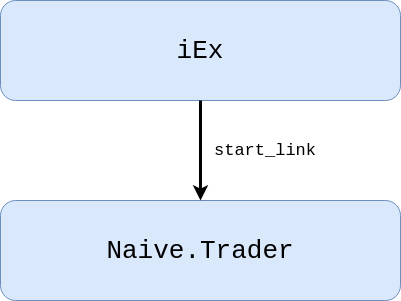
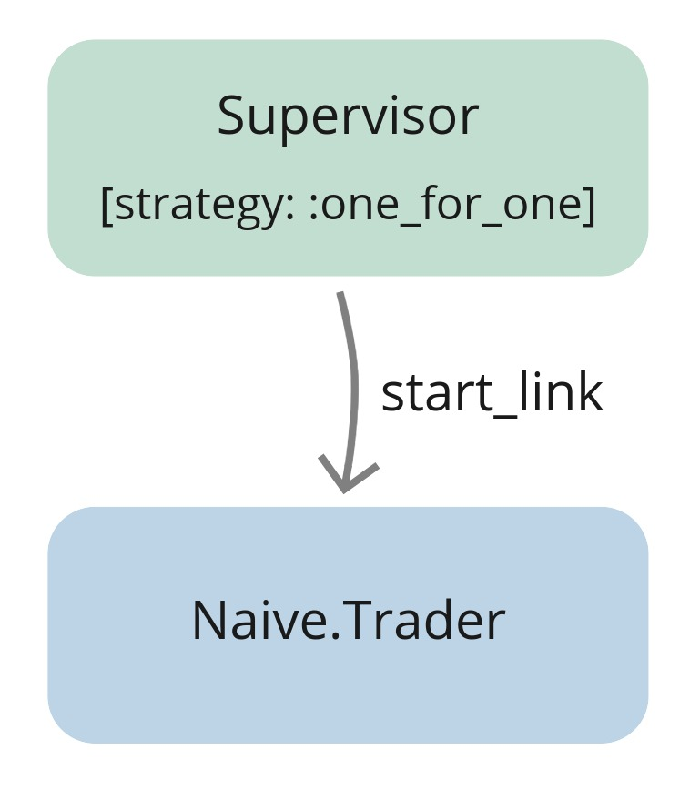
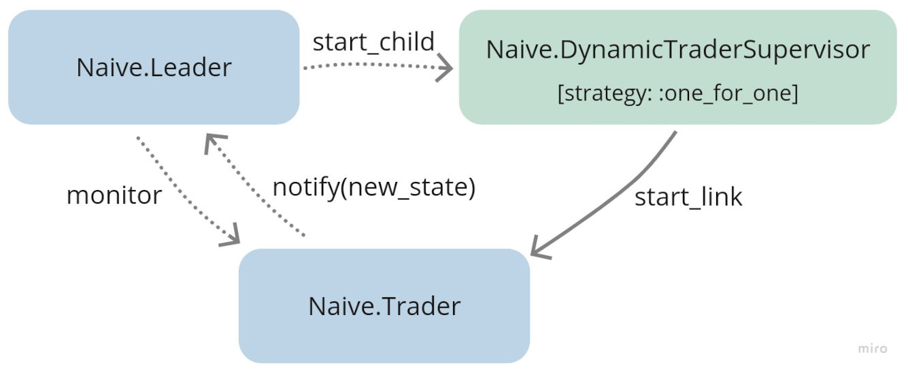
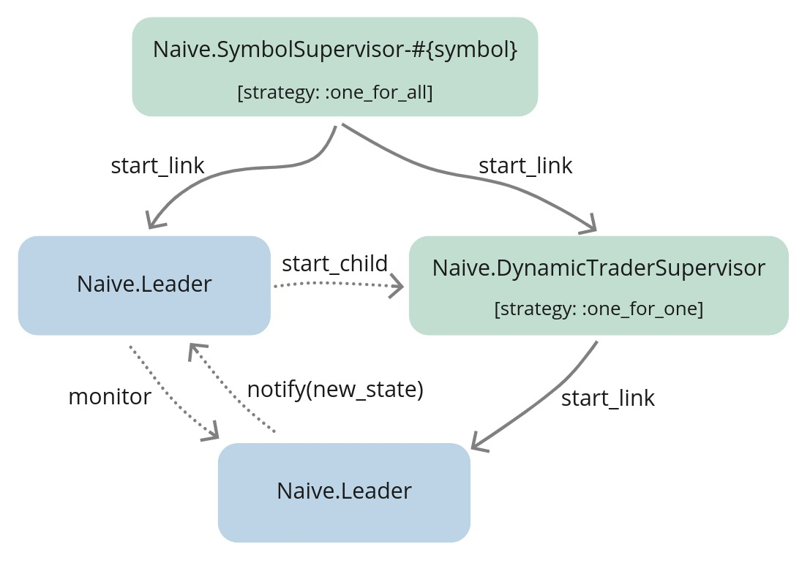
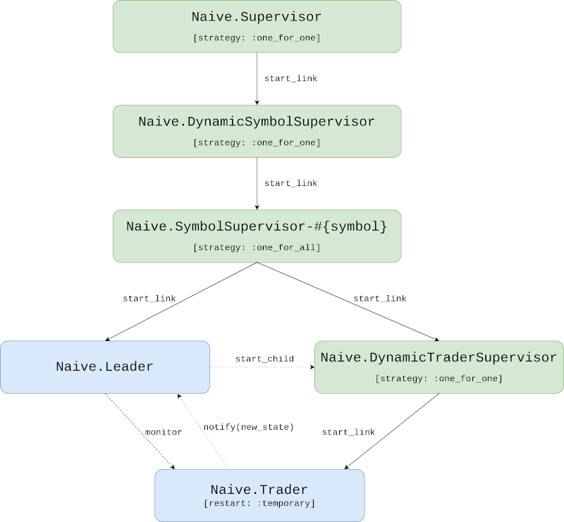
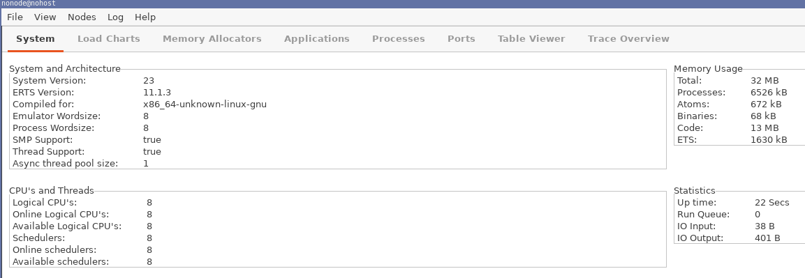
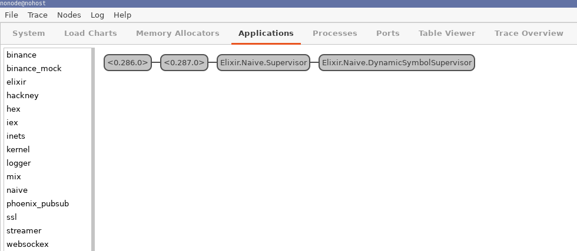

# 在多个 symbol 上启用并行交易 {#05-enable-parallel-trading}

在上一章中，我们构建了 `BinanceMock`，把交易逻辑与真实交易所解耦开来。
这是至关重要的一步——但我们的系统仍然有一个根本限制：
它一次只能交易一个 symbol，而且一旦出问题，所有东西都会停下来。

在本章中，我们会通过构建一个正确的 OTP 监督树来修复这两个问题。
这正是 Elixir 真正闪光的地方。我们不再写大量防御性代码去处理每一种可能的故障，
而是拥抱“让它崩溃”的哲学，构建一个能自动从错误中恢复的系统。
到本章结束时，你会看到 trader 可以在多个 symbol 上并行运行，而且每个 trader 都能对崩溃具有韧性。

让我们开始吧！

## 目标

- 设计一个监督树，允许每个 symbol 上并行运行多个 trader
- 更新应用 supervisor
- 实现 `Naive.Leader`
- 实现 `Naive.SymbolSupervisor`

## 介绍——架构设计

在第二章中，我们实现了一个基本的 trader，它会经历完整的交易循环。在 iEx 会话里，我们通过 `start_link/1` 函数启动 `Naive.Trader` 进程：

```{r, fig.align="center", out.width="25%", echo=FALSE}

```

`GenServer.start_link/3` 会在 iEx 的进程和新的 `Naive.Trader` 进程之间建立链接。
每当 trader 进程终止（无论是因为完成交易循环还是因为错误），都不会有新的进程自动启动——这里完全没有监督。

不过，只要借助一点 Elixir 和 OTP 的帮助，我们可以做得更好。

先在 trader 进程上面加一个 supervisor。它会在前一个 trader 完成或崩溃后启动一个新的 trader 进程：

```{r, fig.align="center", out.width="25%", echo=FALSE}

```

这样看起来好多了，但这里有一个关键问题。
当 trader 挂出一个买单时，这个订单会同时存在于两个地方：
Binance 交易所（或者我们的 mock）以及 trader 自己的内部状态里。
如果 trader 崩溃，supervisor 会尽职尽责地把它重新启动——但会用一个全新的空状态。
与此同时，我们的买单还在交易所里等待成交。新的 trader 根本不知道它的存在。

这正是状态型进程的根本挑战：**supervisor 可以重启进程，但它不能恢复状态。**

为了解决这个问题，我们需要把 trader 的状态复制到 trader 进程之外——这就是为什么我们会引入一个新的 server，叫做 `Naive.Leader`，用来跟踪 trader 的数据：

```{r, fig.align="center", out.width="70%", echo=FALSE}

```

`Naive.Leader` 会成为启动新 trader 的接口。
它会调用 `DynamicSupervisor.start_child/1`，而后者又会调用 `Naive.Trader.start_link/1`。

这里就是我们拥抱 Elixir 著名的“让它崩溃”哲学的地方——不过有一点不同。
我们的 trader 会用 `restart: :temporary` 启动，这会告诉 supervisor *不要* 自动重启它们。
相反，重启职责由 Leader 来承担。为什么？因为 Leader 持有缓存状态。
当 trader 崩溃时，Leader 可以用它最后已知的状态来重启它，而不是从空白状态开始。

这种模式——外部状态管理加上受监督的重启——让我们同时拥有两种优势：容错性 *和* 状态恢复。

随着 trader 状态不断更新，它会把新的状态通知给 leader 以便存储。
这样每当 trader 进程崩溃时，leader 都能用最后已知的状态启动一个新的 trader 进程。

这个结构也会让我们在同一个 symbol 上启动并监督多个 trader——这是我们朴素策略在下一章里会需要的能力。

对于我们要交易的每个 symbol，我们都需要上面这一组三个进程（Leader + DynamicTraderSupervisor + Trader）。为了有效地初始化（并监督）它们，我们会再增加一个 `Naive.SymbolSupervisor`，它会同时启动 `Naive.Leader` 和 `Naive.DynamicTraderSupervisor`：

```{r, fig.align="center", out.width="70%", echo=FALSE}

```


我们会需要多个 symbol supervisor，每个我们想交易的 symbol 都对应一个。和 trader 一样，它们会按需动态启动，这也提示我们需要另一个 dynamic supervisor 来监督 symbol supervisor，并且它会作为 `Naive.Supervisor`（也就是 `Naive.Application` 模块）的直接子进程：

```{r, fig.align="center", out.width="70%", echo=FALSE}

```

你可能会想：我们是不是还需要另一个 server 来跟踪哪些 symbol 正在被交易？
答案是不需要——我们可以给每个 `Naive.SymbolSupervisor` 注册一个名字，例如 `:"Naive.SymbolSupervisor-XRPUSDT"`。
这样我们就能通过名字查找 supervisor，而不必自己维护 PID。
Elixir 的进程注册表会替我们完成这些 bookkeeping。

从图的最上层开始看，整个流程是这样的：

* `Naive.Application` 是 `naive` app 的顶层应用 supervisor，它在 `naive` 应用创建时自动生成
* 它只有一个子进程 `Naive.DynamicSymbolSupervisor`，它采用 one_for_one 策略，并且它的所有子进程都是 `Naive.SymbolSupervisor`
* `Naive.SymbolSupervisor` 进程会再启动两个子进程：`Naive.Leader` 和 `DynamicTraderSupervisor`，它们都会在 init 时创建
* `Naive.Leader` 会请求 `DynamicTraderSupervisor` 启动 `Naive.Trader` 子进程

现在看起来可能有点绕，但等我们开始写代码后，一切都会清楚得多。
开始吧！

## 更新应用 supervisor

我们先从把 `Naive.DynamicSymbolSupervisor` 和一个 server 加到 `Naive.Application` supervisor 的 children 列表开始：

```{r, engine = 'elixir', eval = FALSE}
  # /apps/naive/lib/naive/application.ex
  def start(_type, _args) do
    children = [
      {
        DynamicSupervisor,
        strategy: :one_for_one,
        name: Naive.DynamicSymbolSupervisor
      }
    ]

    ...
  end
```

## 添加接口方法

现在我们来给 `Naive` 模块添加一个接口方法，它会指示 `Naive.DynamicSymbolSupervisor` 启动 `Naive.SymbolSupervisor`（我们下一步会实现它）作为它的子进程：

```{r, engine = 'elixir', eval = FALSE}
  # /apps/naive/lib/naive.ex
  def start_trading(symbol) do
    symbol = String.upcase(symbol)

    {:ok, _pid} =
      DynamicSupervisor.start_child(
        Naive.DynamicSymbolSupervisor,
        {Naive.SymbolSupervisor, symbol}
      )
  end
```

## 实现 `Naive.SymbolSupervisor`

接下来是 `Naive.SymbolSupervisor`。第一步是在 `apps/naive/lib/naive` 目录下创建一个名为 `symbol_supervisor.ex` 的文件。这里没有必要使用 [DynamicSupervisor](https://hexdocs.pm/elixir/master/DynamicSupervisor.html)，因为我们在 init 时就知道自己要自动启动哪些子进程。它是一个完整的 supervisor 实现，写法很简单：只需要在 init 函数里列出子进程即可：

```{r, engine = 'elixir', eval = FALSE}
# /apps/naive/lib/naive/symbol_supervisor.ex
defmodule Naive.SymbolSupervisor do
  use Supervisor

  require Logger

  def start_link(symbol) do
    Supervisor.start_link(
      __MODULE__,
      symbol,
      name: :"#{__MODULE__}-#{symbol}"
    )
  end

  def init(symbol) do
    Logger.info("Starting new supervision tree to trade on #{symbol}")

    Supervisor.init(
      [
        {
          DynamicSupervisor,
          strategy: :one_for_one,
          name: :"Naive.DynamicTraderSupervisor-#{symbol}"
        },
        {Naive.Leader, symbol}
      ],
      strategy: :one_for_all
    )
  end
end
```

```{=latex}
\begin{sidequest}
```
```{=html}
<div class="sidequest">
```

**关键架构说明：原子泄漏风险**

你可能注意到我们这里动态创建了 atom（例如 `:"#{__MODULE__}-#{symbol}"`）。
在 Erlang VM 中，atom 不会被垃圾回收。如果这个系统接受任意用户输入（比如为 "User1"、"User2"……创建 trader），
最终我们会因为耗尽 atom 表而把 VM 搞崩（默认上限大约一百万）。

由于 Binance 交易对的列表是有限的，所以目前我们是安全的。
不过，这仍然被视为一种反模式。**在第 13 章中，我们会重构这里，改用 Registry**，
这样就可以用字符串查找进程，从而完全消除这个风险。

```{=html}
</div>
```
```{=latex}
\end{sidequest}
```

一般来说，supervisor 模块应该保持精简，只专注于监督。业务逻辑应该放在它们管理的子进程里。

我们给 `Naive.SymbolSupervisor` 进程注册了名字，这会帮助我们在 observer GUI 中理解监督树（未来也能让我们停止这些 supervisor）。

如前所述，一旦 `Naive.Leader` 或 `Naive.DynamicSymbolSupervisor-#{symbol}` 中的任意一个崩溃，我们都希望把另一个子进程也杀掉，因为我们无法恢复状态——把两者重新初始化会更简单。

## 实现 `Naive.Leader`

现在轮到 `Naive.Leader` 模块了。和前面一样，第一步是在 `apps/naive/lib/naive` 目录下创建一个名为 `leader.ex` 的文件。此时它先是一个骨架 GenServer 实现，用来让代码先能编译通过：

```{r, engine = 'elixir', eval = FALSE}
# /apps/naive/lib/naive/leader.ex
defmodule Naive.Leader do
  use GenServer

  def start_link(symbol) do
    GenServer.start_link(
      __MODULE__,
      symbol,
      name: :"#{__MODULE__}-#{symbol}"
    )
  end

  def init(symbol) do
    {:ok, %{symbol: symbol}}
  end
end
```

现在我们已经让一半的监督树跑起来了，所以可以在 iex 里试试看。
通过 observer，我们可以看到调用 `start_trading/1` 时创建的所有进程：

```{r, engine = 'bash', eval = FALSE}
$ iex -S mix
...
iex(1)> Mix.ensure_application!(:wx)
:ok
iex(2)> Mix.ensure_application!(:runtime_tools)
:ok
iex(3)> Mix.ensure_application!(:observer)
:ok
iex(4)> :observer.start()
```

上面的函数会打开一个新的窗口，长得大概如下：

```{r, fig.align="center", out.width="100%", echo=FALSE}

```

为了清楚地看到监督树，我们会点击顶部的 “Applications” 标签——左侧就会显示如下进程树：

```{r, fig.align="center", out.width="100%", echo=FALSE}

```

如果你看到的是别的进程树，就在左侧列表里选择 `naive` 应用。

`Naive.Supervisor` 就是我们的 `Naive.Application` 模块（你可以通过查看模块里传给 `start_link` 函数的 `name` 选项来确认）。它会启动 `Naive.DynamicSymbolSupervisor`。

现在我们可以多次调用 `Naive.start_trading/1`，看看增加进程后这棵树会变成什么样（回到 iex 会话）：

```{r, engine = 'bash', eval = FALSE}
...
iex(2)> Naive.start_trading("adausdt")
23:14:40.974 [info]  Starting new supervision tree to trade on ADAUSDT
{:ok, #PID<0.340.0>}
iex(3)> Naive.start_trading("xrpusdt")
23:15:12.117 [info]  Starting new supervision tree to trade on XRPUSDT
{:ok, #PID<0.345.0>}
```

我们可以看到新创建了两条分支：

* `SymbolSupervisor-ADAUSDT`
* `SymbolSupervisor-XRPUSDT`

每一条分支里都包含一个 `Naive.Leader` 和一个 `DynamicTraderSupervisor`。

### 更新 leader 模块

接下来我们回到 leader 实现，继续把 trader 跑起来。

我们会引入一个 leader 的状态，它由 symbol、setting，以及 trader 数据列表组成。trader 数据会保存 trader 的 PID、ref 和 state：

```{r, engine = 'elixir', eval = FALSE}
# /apps/naive/lib/naive/leader.ex
  ...
  alias Naive.Trader

  require Logger

  @binance_client Application.compile_env(:naive, :binance_client)

  defmodule State do
    defstruct symbol: nil,
              settings: nil,
              traders: []
  end

  defmodule TraderData do
    defstruct pid: nil,
              ref: nil,
              state: nil
  end
```

我们会沿用第 2 章里学到的 `handle_continue` 模式——
这次是为了异步初始化 leader，并启动 trader，而不会阻塞 supervisor：

```{r, engine = 'elixir', eval = FALSE}
  # /apps/naive/lib/naive/leader.ex
  def init(symbol) do
    {:ok,
      %State{
          symbol: symbol
      }, {:continue, :start_traders}}
  end
```

`Naive.Leader` 会获取 symbol settings，然后基于它们构建 trader 的状态，这样 trader 就不需要再去获取一遍相同的设置了。它还会按照 setting 中 `chunks` 键的值启动同样数量的 trader：

```{r, engine = 'elixir', eval = FALSE}
  # /apps/naive/lib/naive/leader.ex
  # 放在 init() 下面
  def handle_continue(:start_traders, %{symbol: symbol} = state) do
    settings = fetch_symbol_settings(symbol)
    trader_state = fresh_trader_state(settings)
    traders = for _i <- 1..settings.chunks,
              do: start_new_trader(trader_state)

    {:noreply, %{state | settings: settings, traders: traders}}
  end
```

获取 symbol settings 这件事现在先硬编码，以保持本章聚焦。我们还会把从 `Naive.Trader` 里获取 tick size 的代码移到 `Naive.Leader` 中，并把其他值都写死：

```{r, engine = 'elixir', eval = FALSE}
  # /apps/naive/lib/naive/leader.ex
  defp fetch_symbol_settings(symbol) do
    tick_size = fetch_tick_size(symbol)

    %{
      symbol: symbol,
      chunks: 1,
      # -0.12% for quick testing
      profit_target: "-0.0012",
      tick_size: tick_size
    }
  end

  defp fetch_tick_size(symbol) do
    @binance_client.get_exchange_info()
    |> elem(1)
    |> Map.get(:symbols)
    |> Enum.find(&(&1["symbol"] == symbol))
    |> Map.get("filters")
    |> Enum.find(&(&1["filterType"] == "PRICE_FILTER"))
    |> Map.get("tickSize")
  end
```

另外，我们还需要创建一个辅助方法 `fresh_trader_state/1`，它会在 `handle_continue/2` 回调里使用：

```{r, engine = 'elixir', eval = FALSE}
  # /apps/naive/lib/naive/leader.ex
  # 放在 `fetch_symbol_settings` 函数上方
  defp fresh_trader_state(settings) do
    struct(Trader.State, settings)
  end
```

启动一个新的 trader 和我们之前写过的启动新的 `Naive.SymbolSupervisor` 的代码并没有什么不同。我们需要调用 `DynamicSupervisor.start_child/2`，并监控这个进程：

```{r, engine = 'elixir', eval = FALSE}
  # /apps/naive/lib/naive/leader.ex
  defp start_new_trader(%Trader.State{} = state) do
    {:ok, pid} =
      DynamicSupervisor.start_child(
        :"Naive.DynamicTraderSupervisor-#{state.symbol}",
        {Naive.Trader, state}
      )

    ref = Process.monitor(pid)

    %TraderData{pid: pid, ref: ref, state: state}
  end
```

### 更新 `Naive.Trader` 模块

现在我们可以更新 `Naive.Trader` 了。首先，我们会把 restart 设成 temporary，避免它被 `Naive.DynamicTraderSupervisor` 自动重启：

```{r, engine = 'elixir', eval = FALSE}
# /apps/naive/lib/naive/trader.ex
defmodule Naive.Trader do
  use GenServer, restart: :temporary
  ...
```

在我们的新监督结构下，`tick_size` 会在 `Trader` 进程真正启动之前就被解析好。
这对系统设计来说是一个很大的提升：我们的 `Trader` 不再依赖 Binance API 才能启动。

因为现在我们把一个已经填充好的 `%State{}` 结构体传给了 `start_link/1`，
初始化会立刻完成。我们不再需要用 `handle_continue/2` 来避免阻塞，所以可以删除它。

我们来重构 `start_link/1` 和 `init/1`，让它们接受注入的状态，并移除异步获取逻辑：

```{r, engine = 'elixir', eval = FALSE}
  # /apps/naive/lib/naive/trader.ex
  def start_link(%State{} = state) do
    GenServer.start_link(__MODULE__, state)
  end

  def init(%State{symbol: symbol} = state) do
    symbol = String.upcase(symbol)

    Logger.info("Initializing new trader for symbol(#{symbol})")

    Phoenix.PubSub.subscribe(
      Streamer.PubSub,
      "TRADE_EVENTS:#{symbol}"
    )

    {:ok, state}
  end

  def handle_continue(...) do # <= 删除这个函数
```

接下来，我们需要更新三个会改变 `Naive.Trader` 进程状态的 `handle_info/2` 回调（在挂买单和挂卖单时）。在返回之前，它们需要通知 `Naive.Leader` 状态已经发生变化：

```{r, engine = 'elixir', eval = FALSE}
  # /apps/naive/lib/naive/trader.ex
  ...

  def handle_info(
        ...
  ) ... do
    ...
    Logger.info("Placing BUY order for #{symbol} @ #{price}, quantity: #{quantity}")
    ...
    new_state = %{state | buy_order: order}
    Naive.Leader.notify(:trader_state_updated, new_state)
    {:noreply, new_state}
  end

  def handle_info(
        ...
  ) ... do
    ...
    Logger.info("Buy order filled, placing sell order ...")  
    ...

    new_state = %{state | buy_order: buy_order_response, sell_order: order}
    Naive.Leader.notify(:trader_state_updated, new_state)
    {:noreply, new_state}
  end

  def handle_info(
        ...
  ) ... do
    ...
    Logger.info("Trade finished, trader will now exit")
    new_state = %{state | sell_order: sell_order_response}
    Naive.Leader.notify(:trader_state_updated, new_state)
    {:stop, :normal, new_state}
  end
  ...
```

### 完成 `Naive.Leader` 实现

现在我们回到 `Naive.Leader`，实现通知逻辑。我们先从 notify 函数开始，它只需要调用 `Naive.Leader` 进程：

```{r, engine = 'elixir', eval = FALSE}
  # /apps/naive/lib/naive/leader.ex
  # 放在 init 下面
  def notify(:trader_state_updated, trader_state) do
    GenServer.call(
      :"#{__MODULE__}-#{trader_state.symbol}",
      {:update_trader_state, trader_state}
    )
  end
```

现在，轮到一个处理 trader 状态更新的回调函数了。由于这是一个 `handle_call/3` 回调，我们能拿到发送通知消息的 trader PID。我们会尝试在 trader 列表里找到它。如果找到了，我们就把这个 trader 的本地缓存状态更新掉：

```{r, engine = 'elixir', eval = FALSE}
  # /apps/naive/lib/naive/leader.ex
  # 放在 handle_continue 下面
  def handle_call(
    {:update_trader_state, new_trader_state},
    {trader_pid, _},
    %{traders: traders} = state
  ) do
    case Enum.find_index(traders, &(&1.pid == trader_pid)) do
      nil ->
        Logger.warning(
          "Tried to update the state of trader that leader is not aware of"
        )
        {:reply, :ok, state}
      
      index ->
        old_trader_data = Enum.at(traders, index)
        new_trader_data = %{old_trader_data | :state => new_trader_state}

        {:reply, :ok, %{state | :traders =>
          List.replace_at(traders, index, new_trader_data)}}
    end
  end
```

我们还需要另外两个 `handle_info/2` 回调：一个处理交易完成，另一个处理 trader 崩溃。

先看交易完成场景。和之前一样，我们会尝试在 trader 列表里找到这个 trader。如果找到了，我们就用一个新的、带 fresh state 的 trader 替换它。我们还会在本地缓存里覆盖已有 trader 数据（因为 PID、ref 和 state 都会变）：

```{r, engine = 'elixir', eval = FALSE}
  # /apps/naive/lib/naive/leader.ex
  # 放在 state updated handle_call 回调下面
  def handle_info(
        {:DOWN, _ref, :process, trader_pid, :normal},
        %{traders: traders, symbol: symbol, settings: settings} = state
      ) do
    Logger.info("#{symbol} trader finished trade - restarting")

    case Enum.find_index(traders, &(&1.pid == trader_pid)) do
      nil ->
        Logger.warning(
          "Tried to restart finished #{symbol} " <>
            "trader that leader is not aware of"
        )

        {:noreply, state}

      index ->
        new_trader_data = start_new_trader(fresh_trader_state(settings))
        new_traders = List.replace_at(traders, index, new_trader_data)

        {:noreply, %{state | traders: new_traders}}
    end
  end
```

这里我们假设，当 `Naive.Trader` 进程死掉的原因是 `:normal` 时，就表示它是在交易循环结束后被我们停止的。

最后一个需要提供的回调会处理 trader 崩溃的场景。我们希望找到崩溃 trader 的缓存状态，然后用同样的状态重启一个新的 trader，接着更新本地缓存，因为那个 trader 的 PID 和 ref 都会变化：

```{r, engine = 'elixir', eval = FALSE}
  # /apps/naive/lib/naive/leader.ex
  # 放在交易完成 handle_info 回调下面
  def handle_info(
        {:DOWN, _ref, :process, trader_pid, reason},
        %{traders: traders, symbol: symbol} = state
      ) do
    Logger.error("#{symbol} trader died - reason #{reason} - trying to restart")

    case Enum.find_index(traders, &(&1.pid == trader_pid)) do
      nil ->
        Logger.warning(
          "Tried to restart #{symbol} trader " <>
            "but failed to find its cached state"
        )

        {:noreply, state}

      index ->
        trader_data = Enum.at(traders, index)
        new_trader_data = start_new_trader(trader_data.state)
        new_traders = List.replace_at(traders, index, new_trader_data)

        {:noreply, %{state | traders: new_traders}}
    end
  end
```

### IEx 测试

这样实现部分就完成了，接下来我们进入 IEx 看看它的工作效果。

我们先启动 observer，然后启动任意一个有效 symbol 的 trading。

当 trader 启动后，你应该可以右键选择 “Kill process”（保留 reason 为 kill），然后点击 “OK”。这时你会看到 trader 的 PID 发生变化，同时 leader 也会输出一条日志。

```{r, engine = 'bash', eval = FALSE}
$ iex -S mix
...
iex(1)> Mix.ensure_application!(:wx)
:ok
iex(2)> Mix.ensure_application!(:runtime_tools)
:ok
iex(3)> Mix.ensure_application!(:observer)
:ok
iex(4)> :observer.start()
:ok
iex(5)> Streamer.start_streaming("xrpusdt")
{:ok, #PID<0.245.0>}
iex(6)> Naive.start_trading("xrpusdt")
...
00:04:35.041 [info]  Starting new supervision tree to trade on XRPUSDT
{:ok, #PID<0.455.0>}
00:04:37.697 [info]  Initializing new trader for XRPUSDT
iex(7)>
00:08:01.476 [error] XRPUSDT trader died - reason killed - trying to restart
00:08:01.476 [info]  Initializing new trader for XRPUSDT
```

**非常棒！** 你刚刚构建了一个生产级的监督树，它能够：

- 并行交易多个 symbol，每个 symbol 都有自己独立的故障域
- 用最后已知的状态自动恢复崩溃的 trader
- 只要对新的 symbol 调用 `start_trading/1`，就能水平扩展

这就是 OTP 的核心体现。我们构建的 `Naive.Leader` 模式——在外部缓存状态并控制重启——
是你在 Elixir 系统中会反复用到的一种技巧。

**下一步是什么？**

我们的监督树已经很稳固了，但我们的交易策略还有一个微妙的缺陷。当一个 trader 完成卖出、又启动新的 trader 时，
它会立刻按当前市场价格买入——也就是我们刚刚卖出的那个价格。我们为了没有收益的操作支付了两次手续费！

在下一章中，我们会通过引入一个 `buy_down_interval` 来修复这个问题。不再按当前价格买入，
而是让 trader 在*低于*市场价的位置挂买单，这样只有在确实有利润空间时才重新进入仓位。
这只是一个小改动，但对盈利能力的影响很大。

[Note] 请记得运行 `mix format`，保持代码整洁。

本章的源代码可以在本书的源代码仓库中找到（分支：
[chapter_05](https://github.com/Cinderella-Man/hands-on-elixir-and-otp-cryptocurrency-trading-bot-source-code/tree/chapter_05)）。
