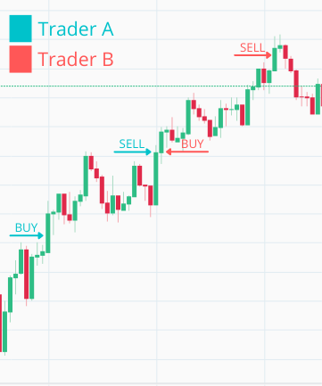
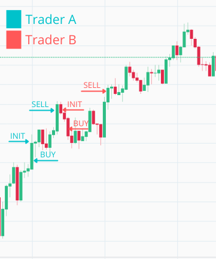

# 引入 `buy_down_interval` 让单个 trader 更有利润 {#introduce-buydown-interval}

上一章里，我们构建了一个稳健的监督树，能够在多个 symbol 上并行交易，并在崩溃后恢复。
这对可靠性来说很不错——但我们的交易策略在盈利能力上仍然有一个隐蔽问题。

当 trader 完成一次卖出，而 Leader 启动新的 trader 时，它会立刻以当前市场价挂买单。
这和我们刚卖出的价格是一样的！我们等于在没有任何对我们有利的价格变化时，
白白付了两次交易所手续费（一次卖出，一次买入）。这就像在跑步机上跑步——看起来很忙，但其实没前进多少。

这一章里，我们会通过引入 `buy_down_interval` 来修复这个问题。trader 不再按当前价格买入，
而是会先计算一个更低的价格，再把买单挂在那里。这个简单改动能确保我们只有在价格回落到足以覆盖手续费并留下利润空间时才重新入场。
这只是一个小改动，但对最终收益的影响很明显。

我们开始吧！

## 目标

- 说明为什么要引入 `buy_down_interval`
- 把 `buy_down_interval` 加入 `Naive.Trader` 的状态并计算买入价格
- 让 `Naive.Leader` 构建出的 `Naive.Trader` 状态包含 `buy_down_interval`
- 在 IEx 中手动测试实现

## 为什么我们需要在当前价格下方买入？功能概览

```{r, fig.align="center", out.width="50%", echo=FALSE}

```

上图中标蓝色的 `Naive.Trader` 进程，在收到第一条交易事件后，会立刻按当前价格挂出买单。

Trader A 退出后，新的 trader B 又会再次以 *和上一个 trader 刚卖出时相同的价格* 立刻挂买单。
当它成交后，又会挂出卖单，如此循环往复。

这里的问题很明显：我们只是平白付了两次手续费（Trader A 卖出一次，Trader B 买入一次），
却没有真正获得任何收益。假设每笔交易手续费是 0.1%。
如果 Trader A 以 100 美元卖出，而 Trader B 立刻又以 100 美元买入，我们就在没有任何价格波动的情况下损失了 0.2%（0.20 美元）的手续费。
在这个场景里，Trader A 本来完全可以继续持币，等到更好的机会再卖；
现在我们等于在做无意义的来回交易，实质上是在烧钱。

解决办法就是让买单价格更聪明一些。

思路很简单：我们不再根据当前价格（也就是上一条 TradeEvent 的价格）直接挂新买单，
而是引入一个 `buy_down_interval`：

```{r, fig.align="center", out.width="50%", echo=FALSE}

```

当新的 `Naive.Trader` 进程收到第一条交易事件时，它会先取出那个价格，再减去 `buy_down_interval`（例如 0.005 表示比当前价低 0.5%），
然后按这个计算出来的价格挂出买单。

从上图我们也能看出，`buy_down_interval` 不应该小于你每笔交易支付手续费的两倍。
为什么要乘二？因为一次完整循环里会产生两次手续费：买入一次，卖出一次。
在本文写作时，Binance 的手续费是 0.1%，所以我们的 `buy_down_interval` 至少应该是 0.2% 才能打平——
再往上才算利润空间。

还有一点要记住：如果 `buy_down_interval` 设得太高，
我们的买单可能永远都不会成交，因为价格未必会跌那么多。

## `Naive.Trader` 实现

先打开 `Naive.Trader` 模块的文件（`/apps/naive/lib/naive/trader.ex`），把 `buy_down_interval` 加到它的状态里：

```{r, engine = 'elixir', eval = FALSE}
  # /apps/naive/lib/naive/trader.ex
  ...
  defmodule State do
    @enforce_keys [
      :symbol,
      :buy_down_interval, # <= add this line
      :profit_target,
      :tick_size
    ]
    defstruct [
      :symbol,
      :buy_order,
      :sell_order,
      :buy_down_interval, # <= add this line
      :profit_target,
      :tick_size
    ]
  end
  ...
```

接下来，我们需要更新最初那个负责挂买单的 `handle_info/2` 回调。
为了计算买入价格，我们需要从 trader 的 `state` 里取出 `buy_down_interval` 和 `tick_size`。
我们会把价格计算逻辑单独放到文件末尾的一个函数里：

```{r, engine = 'elixir', eval = FALSE}
  # /apps/naive/lib/naive/trader.ex
  ...
  def handle_info(
        %TradeEvent{price: price},
        %State{
          symbol: symbol,
          buy_order: nil,
          buy_down_interval: buy_down_interval, # <= add this line
          tick_size: tick_size                  # <= add this line          
        } = state
      ) do
    price = calculate_buy_price(price, buy_down_interval, tick_size)
    # ^ add above call
    ...
```

计算买入价格的方法和之前计算卖出价格非常类似——如果你还记得的话，这两种计算都包含按百分比调整，再对齐 tick size。

公式很直接：`buy_price = current_price - (current_price × buy_down_interval)`。
例如，如果当前价格是 100 美元，而我们的 `buy_down_interval` 是 0.005（0.5%），那我们会把买单挂在 99.50 美元。

首先，我们会把所有变量转换成 `Decimal` 结构体。
这对金融计算非常重要——普通 float 会引入细小的舍入误差，而这些误差会在很多笔交易里累积起来。
使用 Decimal，我们就能得到精确运算。

然后，我们从价格里减去买下调的金额（price × buy_down_interval）。

最后得到的数字不一定就是合法价格，因为每个价格都必须能被 `tick_size` 整除，
这一点我们会在最后一步保证：

```{r, engine = 'elixir', eval = FALSE}
  # /apps/naive/lib/naive/trader.ex
  ...
  defp calculate_buy_price(current_price, buy_down_interval, tick_size) do
    current_price = D.from_float(current_price)

    # not necessarily legal price
    exact_buy_price =
      D.sub(
        current_price,
        D.mult(current_price, buy_down_interval)
      )

    # Round down to nearest legal tick size
    # e.g., 0.15173 with tick_size 0.0001 -> div_int gives 1517 -> mult gives 0.1517
    exact_buy_price
    |> D.div_int(tick_size)
    |> D.mult(tick_size)
    |> D.to_float()
  end
  ...
```

## `Naive.Leader` 实现

接下来，我们需要更新 `Naive.Leader`，因为它需要把 `buy_down_interval` 加到 `Naive.Trader` 的状态里：

```{r, engine = 'elixir', eval = FALSE}
  # /apps/naive/lib/naive/leader.ex
  defp fetch_symbol_settings(symbol) do
    ...

    %{
      symbol: symbol,
      chunks: 1,
      # 0.01% for quick testing
      buy_down_interval: "0.0001", # <= add this line
      # -0.12% for quick testing
      profit_target: "-0.0012",
      tick_size: tick_size
    }
  end  
  ...
```


### 在 IEx 中手动测试

到这里，`buy_down_interval` 的实现就完成了。我们接下来进入 IEx 会话看看效果，不过在那之前，我们先暂时把日志级别调成 `debug`，以便看到当前价格：

```{r, engine = 'elixir', eval = FALSE}
# /config/config.exs
...
config :logger,
  level: :debug # <= updated for our manual test
...
```

After starting the streaming we should start seeing log messages with current prices. As we updated our implementation we should place our buy order below the current price as it's visible below:

```{r, engine = 'bash', eval = FALSE}
$ iex -S mix
...
iex(1)> Streamer.start_streaming("XRPUSDT")
{:ok, #PID<0.313.0>}
iex(2)> Naive.start_trading("XRPUSDT")
21:16:14.829 [info]  Starting new supervision tree to trade on XRPUSDT
...
21:16:16.755 [info]  Initializing new trader for XRPUSDT
...
21:16:20.000 [debug] Trade event received XRPUSDT@0.15180000
21:16:20.009 [info]  Placing BUY order for XRPUSDT @ 0.1517, quantity: 100
```

可以看到，我们的 `Naive.Trader` 进程把买单挂在了 0.1517，而交易事件里的当前价格是 0.1518。
这中间的差异，就是 `buy_down_interval` 作用在当前价格上并按 tick size 四舍五入（向下取整）后的结果。

**不错！** 有了这个改动，我们的 trader 在入场时就更聪明了：

- 买单挂在*低于*当前市场价的位置，而不是直接挂在当前价
- 我们避免了那种“跑步机效应”——为了零价格波动白白付手续费
- `buy_down_interval` 让我们可以控制：价格要回落多少才重新买入

**那么，下一步是什么？**

我们的 trader 现在买入价格更好了，但代码里还有一个硬编码值：quantity。
我们一直都是固定买 100 个单位，不管 symbol 的价格是多少，也不管我们真正有多少预算。
这非常 *naive*。事实上，甚至有点太 naive 了。

下一章里，我们会为每个 trader 引入正式的 `budget`，并根据预算和当前价格动态计算 quantity。
这样我们的交易会更真实，也能为后面把预算拆分给多个 trader 做好准备。

[注] 别忘了把日志级别改回去，否则日志会太吵。

[注 2] 别忘了运行 `mix format`，让代码保持整洁。

本章的源代码可以在本书的源代码仓库中找到（分支：
[chapter_06](https://github.com/Cinderella-Man/hands-on-elixir-and-otp-cryptocurrency-trading-bot-source-code/tree/chapter_06)）。
