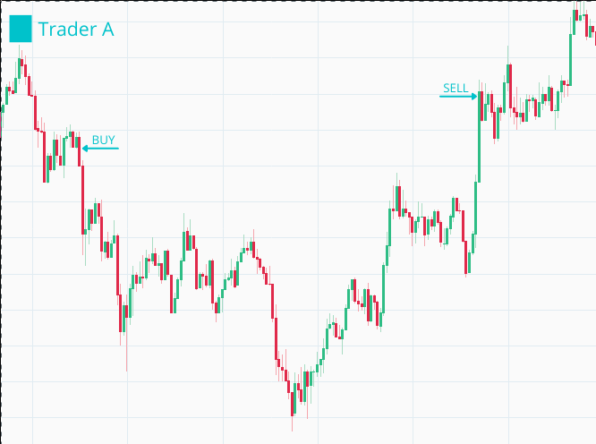
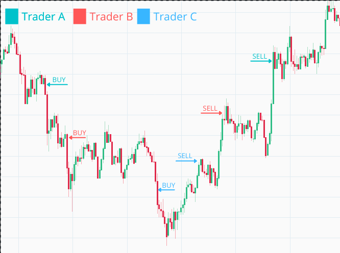
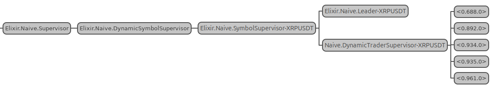

# Run multiple traders in parallel

In the previous chapter, we gave our traders a proper budget and dynamic quantity calculation.
But we're still only running one trader at a time per symbol. When that trader buys and the price keeps dropping,
it just sits there waiting for the price to climb back up to its sell target - missing every dip along the way.

That's leaving money on the table. What if we could spin up additional traders as the price falls,
each one buying at a lower level? Then when the price recovers, they'd all sell at their respective targets,
potentially turning a single trade into multiple profitable ones.

In this chapter, we'll implement exactly that. We'll add a "rebuy" mechanism that monitors the price after a buy order fills.
When the price drops below our buy price by a configurable `rebuy_interval`, we'll notify the Leader to start another trader.
The Leader will honor our `chunks` setting to cap the maximum number of parallel traders - remember that budget we set up?
It's about to get divided among multiple traders working in concert.

Let's put our supervision tree to work!

## Objectives

- describe and design the required functionality
- implement rebuy in the `Naive.Trader`
- implement rebuy in the `Naive.Leader`
- improve logs by assigning IDs to traders

## Describe and design the required functionality

At this moment, inside the `Naive.Leader` we have some silly code that starts all of the traders at the same moment:

```{r, engine = 'elixir', eval = FALSE}
    # /apps/naive/lib/naive/leader.ex
    ...
    traders =
      for _i <- 1..settings.chunks,
          do: start_new_trader(trader_state)
    ...
```

Let's say that we placed a buy order that got filled and the price has fallen before reaching the sell level. We can see here that we missed a nice opportunity to buy more as price drops and make money as it climbs back:

```{r, fig.align="center", out.height="20%", echo=FALSE}

```

We will implement an additional trade event callback inside the `Naive.Trader` that will keep checking the price after the buy order has been filled.
Whenever the price drops below the `buy_order`'s `price` by `rebuy_interval`, we will notify the `Naive.Leader` to start a new `Naive.Trader` process:

```{r, fig.align="center", out.height="20%", echo=FALSE}

```

The `Naive.Leader` keeps track of how many `Naive.Trader`s are running and needs to honor the number of `chunks` set up in the settings (one chunk == one trader).

To stop the `Naive.Trader`s from continuously notifying about price drops,
we'll introduce a boolean flag that tracks whether the `Naive.Leader` has already been notified.

## Implement rebuy inside `Naive.Trader`

We will start by adding the `rebuy_interval` and the `rebuy_notified` to the trader's state:

```{r, engine = 'elixir', eval = FALSE}
  # /apps/naive/lib/naive/trader.ex
  ...
  defmodule State do
    @enforce_keys [
      :symbol,
      :budget,
      :buy_down_interval,
      :profit_target,
      :rebuy_interval, # <= add this field
      :rebuy_notified, # <= add this field
      :tick_size,
      :step_size
    ]
    defstruct [
      :symbol,
      :budget,
      :buy_order,
      :sell_order,
      :buy_down_interval,
      :profit_target,
      :rebuy_interval, # <= add this field
      :rebuy_notified, # <= add this field
      :tick_size,
      :step_size
    ]
  end
```

Rebuy logic should be placed almost as the last callback, just before the catch-all that ignores all events.
We need to retrieve the current `price` and `buy_price` and check that we haven't already notified the leader (via the `rebuy_notified` flag):

```{r, engine = 'elixir', eval = FALSE}
  # /apps/naive/lib/naive/trader.ex
  ...
  # sell filled callback here
  ...
  def handle_info(
        %TradeEvent{
          price: current_price
        },
        %State{
          symbol: symbol,
          buy_order: %Binance.OrderResponse{
            price: buy_price
          },
          rebuy_interval: rebuy_interval,
          rebuy_notified: false
        } = state
      ) do

  end
  # catch all callback here
```

We need to calculate whether the current price has dropped below the rebuy threshold.
If yes, we will notify the leader and update the boolean flag.
We'll abstract the calculation to a separate function(for readability) that we'll write below:

```{r, engine = 'elixir', eval = FALSE}
    # /apps/naive/lib/naive/trader.ex
    # body of the above callback
    if trigger_rebuy?(buy_price, current_price, rebuy_interval) do
      Logger.info("Rebuy triggered for #{symbol} trader")
      new_state = %{state | rebuy_notified: true}
      Naive.Leader.notify(:rebuy_triggered, new_state)
      {:noreply, new_state}
    else
      {:noreply, state}
    end
```

As mentioned before, we will set the `rebuy_notified` boolean flag to true and notify the leader using the `notify` function with the dedicated atom.

At the bottom of the module we need to add the `trigger_rebuy?` helper function:

```{r, engine = 'elixir', eval = FALSE}
  # /apps/naive/lib/naive/trader.ex
  # bottom of the module
  defp trigger_rebuy?(buy_price, current_price, rebuy_interval) do
    buy_price = Decimal.from_float(buy_price)
    current_price = Decimal.from_float(current_price)

    rebuy_price =
      D.sub(
        buy_price,
        D.mult(buy_price, rebuy_interval)
      )

    D.lt?(current_price, rebuy_price)
  end
```

## Implement rebuy in the `Naive.Leader`

Moving on to the `Naive.Leader` module,
we need to change it so it only starts one trader initially (instead of all of them at once) inside `handle_continue`:

```{r, engine = 'elixir', eval = FALSE}
  # /apps/naive/lib/naive/leader.ex
  def handle_continue(:start_traders, %{symbol: symbol} = state) do
    ...
    traders = [start_new_trader(trader_state)] # <= updated part

    ...
  end
```

We will need to add a new clause of the `notify` function that will handle the rebuy scenario:

```{r, engine = 'elixir', eval = FALSE}
  # /apps/naive/lib/naive/leader.ex
  # add below current `notify` function
  def notify(:rebuy_triggered, trader_state) do
    GenServer.call(
      :"#{__MODULE__}-#{trader_state.symbol}",
      {:rebuy_triggered, trader_state}
    )
  end
```

We need to add a new `handle_call` function that will start new traders only when there are still chunks available(enforce the maximum number of parallel traders) - let's start with a header:

```{r, engine = 'elixir', eval = FALSE}
  # /apps/naive/lib/naive/leader.ex
  # place this one after :update_trader_state handle_call
  def handle_call(
        {:rebuy_triggered, new_trader_state},
        {trader_pid, _},
        %{traders: traders, symbol: symbol, settings: settings} = state
      ) do

  end
```

There are a few important details to make note of:

* we need the trader's PID to be able to find its details inside the list of traders
* we need settings to confirm the number of chunks to be able to limit the maximum number of parallel traders

Moving on to the body of our callback.
As with the other callbacks,
we'll check if we can find the trader in our list,
and based on that we'll either start another one (if we haven't reached the chunk limit) or ignore the request:

```{r, engine = 'elixir', eval = FALSE}
    # /apps/naive/lib/naive/leader.ex
    # body of our callback
    case Enum.find_index(traders, &(&1.pid == trader_pid)) do
      nil ->
        Logger.warning("Rebuy triggered by trader that leader is not aware of")
        {:reply, :ok, state}

      index ->
        old_trader_data = Enum.at(traders, index)
        new_trader_data = %{old_trader_data | :state => new_trader_state}
        updated_traders = List.replace_at(traders, index, new_trader_data)

        updated_traders =
          if settings.chunks == length(traders) do
            Logger.info("All traders already started for #{symbol}")
            updated_traders
          else
            Logger.info("Starting new trader for #{symbol}")
            [start_new_trader(fresh_trader_state(settings)) | updated_traders]
          end

        {:reply, :ok, %{state | :traders => updated_traders}}
    end
```

In the above code, we need to remember to update the state of the trader that triggered the rebuy inside the `traders` list as well as add the state of a new trader to that list.

As with the other settings, we'll hardcode the `rebuy_interval` inside `fetch_symbol_settings`
and initialize `rebuy_notified` inside `fresh_trader_state`:

```{r, engine = 'elixir', eval = FALSE}
  # /apps/naive/lib/naive/leader.ex
  defp fresh_trader_state(settings) do
    %{
      struct(Trader.State, settings)
      | budget: D.div(settings.budget, settings.chunks),
        rebuy_notified: false # <= add this line
    }
  end

  defp fetch_symbol_settings(symbol) do
    ...

    Map.merge(
      %{
        ...
        chunks: 5, # <= update to 5 parallel traders max
        budget: 100, # <= update this line
        ...
        profit_target: "-0.0012",
        rebuy_interval: "0.001" # <= add this line
      },
      symbol_filters
    )
  end
```

We also update the `chunks` and the `budget` to allow our strategy to start up to 5 parallel traders with a budget of 20 USDT each(100/5) as Binance has minimal order requirement at about $15(when using the `BinanceMock` this doesn't really matter).

## Improve logs by assigning ids to traders

The final change will be to add an `id` to the trader's state so we can use it inside log messages to give us meaningful data about what's going on(otherwise we won't be able to tell which message was logged by which trader).

First, let's add the `id` into the `Naive.Leader`'s fresh_trader_state as it will be defined per trader:

```{r, engine = 'elixir', eval = FALSE}
  # /apps/naive/lib/naive/leader.ex
  defp fresh_trader_state(settings) do
    %{
      struct(Trader.State, settings)
      | id: :os.system_time(:millisecond), # <= add this line
        budget: D.div(settings.budget, settings.chunks),
        rebuy_notified: false
    }
  end
```

Now we can move on to the `Naive.Trader` and add it to the `%State{}` struct. We'll also modify every callback to include the id in log messages:

```{r, engine = 'elixir', eval = FALSE}
  # /apps/naive/lib/naive/trader.ex
  defmodule State do
    @enforce_keys [
      :id,
      ...
    ]
    defstruct [
      :id,
      ...
    ]
  end

  ...

  def init(%State{id: id, symbol: symbol} = state) do
    ...

    Logger.info("Initializing new trader(#{id}) for #{symbol}")

    ...
  end

  def handle_info(
        %TradeEvent{price: price},
        %State{
          id: id,
          ...
        } = state
      ) do
    ...
    Logger.info(
      "The trader(#{id}) is placing a BUY order " <>
        "for #{symbol} @ #{price}, quantity: #{quantity}"
    )
    ...
  end

  def handle_info(
        %TradeEvent{
          ...
        },
        %State{
          id: id,
          ...
        } = state
      ) ... do
    ...
        Logger.info(
          "The trader(#{id}) is placing a SELL order for " <>
            "#{symbol} @ #{sell_price}, quantity: #{quantity}."
        )
        ...
  end

  def handle_info(
        %TradeEvent{
          ...
        },
        %State{
          id: id,
          ...
        } = state
      ) do
    ...
      Logger.info("Trader(#{id}) finished trade cycle for #{symbol}")
      ...
  end

  def handle_info(
        %TradeEvent{
          price: current_price
        },
        %State{
          id: id,
          ...
        } = state
      ) do
      ...
      Logger.info("Rebuy triggered for #{symbol} by the trader(#{id})")
      ...
  end
```

That finishes the implementation part - we should now be able to test the implementation and see a dynamically growing number of traders for our strategy based on price movement.

## Manual testing in IEx

Let's start an IEx session and open the `:observer`(go to the "Applications" tab and click on `naive` in the left panel).
We'll be able to watch the number of traders grow and see PIDs changing as traders complete their trade cycles:

```{r, engine = 'bash', eval = FALSE}
$ iex -S mix
...
iex(1)> Mix.ensure_application!(:wx)
:ok
iex(2)> Mix.ensure_application!(:runtime_tools)
:ok
iex(3)> Mix.ensure_application!(:observer)
:ok
iex(4)> :observer.start()
...
iex(5)> Streamer.start_streaming("XRPUSDT")
{:ok, #PID<0.303.0>}
iex(6)> Naive.start_trading("XRPUSDT")
10:22:05.018 [info]  The trader(1616754009963) is placing a BUY order for XRPUSDT @ 8.175,
quantity: 2.446
10:22:11.665 [info]  Rebuy triggered for XRPUSDT by the trader(1616754009963)
10:22:11.665 [info]  Starting new trader for XRPUSDT
10:22:11.665 [info]  Initializing new trader(1616754131665) for XRPUSDT
10:22:11.665 [info]  The trader(1616754009963) is placing a SELL order for XRPUSDT @ 8.181,
quantity: 2.446.
10:22:11.665 [info]  The trader(1616754131665) is placing a BUY order for XRPUSDT @ 8.157,
quantity: 2.451
10:22:58.339 [info]  Trader(1616754009963) finished trade cycle for XRPUSDT
10:22:58.339 [info]  XRPUSDT trader finished trade - restarting
10:22:58.339 [info]  Initializing new trader(1616754178339) for XRPUSDT
10:22:58.339 [info]  The trader(1616754178339) is placing a BUY order for XRPUSDT @ 8.212,
quantity: 2.435
10:23:13.232 [info]  Rebuy triggered for XRPUSDT by the trader(1616754178339)
10:23:13.232 [info]  Starting new trader for XRPUSDT
10:23:13.232 [info]  Initializing new trader(1616754193232) for XRPUSDT
10:23:13.232 [info]  The trader(1616754178339) is placing a SELL order for XRPUSDT @ 8.218,
quantity: 2.435.
10:23:31.120 [info]  The trader(1616754193232) is placing a BUY order for XRPUSDT @ 8.194,
quantity: 2.44
10:23:31.121 [info]  Trader(1616754178339) finished trade cycle for XRPUSDT
10:23:31.122 [info]  XRPUSDT trader finished trade - restarting
10:23:31.122 [info]  Initializing new trader(1616754211122) for XRPUSDT
10:24:31.891 [info]  The trader(1616754211122) is placing a BUY order for XRPUSDT @ 8.198,
quantity: 2.439
10:25:24.155 [info]  The trader(1616754211122) is placing a SELL order for XRPUSDT @ 8.204,
quantity: 2.439.
10:25:24.155 [info]  The trader(1616754193232) is placing a SELL order for XRPUSDT @ 8.2,
quantity: 2.44.
10:25:24.155 [info]  Rebuy triggered for XRPUSDT by the trader(1616754211122)
10:25:24.155 [info]  Starting new trader for XRPUSDT
10:25:24.156 [info]  Initializing new trader(1616754324155) for XRPUSDT
10:25:24.156 [info]  Rebuy triggered for XRPUSDT by the trader(1616754193232)
10:25:24.156 [info]  The trader(1616754324155) is placing a BUY order for XRPUSDT @ 8.183,
quantity: 2.444
10:25:24.156 [info]  Starting new trader for XRPUSDT
10:25:24.156 [info]  Initializing new trader(1616754324156) for XRPUSDT 
10:25:24.156 [info]  The trader(1616754324156) is placing a BUY order for XRPUSDT @ 8.176,
quantity: 2.446
10:25:24.156 [info]  The trader(1616754324155) is placing a SELL order for XRPUSDT @ 8.189,
quantity: 2.444.
10:25:37.527 [info]  Trader(1616754324155) finished trade cycle for XRPUSDT
10:25:37.528 [info]  XRPUSDT trader finished trade - restarting
10:25:37.528 [info]  Initializing new trader(1616754337528) for XRPUSDT
10:25:37.528 [info]  The trader(1616754337528) is placing a BUY order for XRPUSDT @ 8.192,
quantity: 2.441
10:25:37.530 [info]  Trader(1616754211122) finished trade cycle for XRPUSDT
10:25:37.530 [info]  Trader(1616754193232) finished trade cycle for XRPUSDT
10:25:37.530 [info]  XRPUSDT trader finished trade - restarting
10:25:37.530 [info]  Initializing new trader(1616754337530) for XRPUSDT
10:25:37.530 [info]  XRPUSDT trader finished trade - restarting
10:25:37.530 [info]  Initializing new trader(1616754337530) for XRPUSDT
10:25:40.015 [info]  Rebuy triggered for XRPUSDT by the trader(1616754337528)
10:25:40.015 [info]  The trader(1616754337530) is placing a BUY order for XRPUSDT @ 8.179,
quantity: 2.445
10:25:40.015 [info]  All traders already started for XRPUSDT
```

And our observer shows the following:

```{r, fig.align="center", out.width="100%", echo=FALSE}

```

We can clearly see that our strategy dynamically scaled from 1 to 5 parallel traders and they were going through different trading steps without any problems -
I think that's really cool to see and it wasn't difficult to achieve in Elixir.

**This is a big milestone!** Our naive trading strategy now:

- Dynamically scales from 1 to N parallel traders based on price movement
- Buys at progressively lower prices as the market dips
- Respects the `chunks` limit to cap maximum parallel exposure
- Assigns unique IDs to each trader for meaningful log output
- Automatically restarts traders after completed trade cycles

The supervision tree we built back in Chapter 5 is now fully utilized - each trader runs independently,
and if one crashes, the Leader can restart it with cached state while the others keep trading.

**So, What's Next?**

Our strategy works, but all the settings are still hardcoded in the `Naive.Leader`.
Want to trade BTCUSDT with different parameters than XRPUSDT? Too bad - they all use the same values.

In the next chapter, we'll fix this by moving our settings into a Postgres database.
We'll set up Docker, add Ecto to our project, create a settings table, and seed it with defaults for every trading pair Binance supports.
This will let us fine-tune the strategy per symbol and eventually enable or disable trading dynamically.

[Note] Please remember to run `mix format` to keep things nice and tidy.

The source code for this chapter can be found in the book's source code repository
(branch:
[chapter_08](https://github.com/Cinderella-Man/hands-on-elixir-and-otp-cryptocurrency-trading-bot-source-code/tree/chapter_08)).
