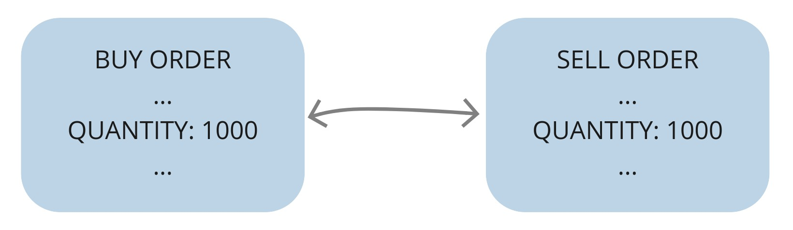
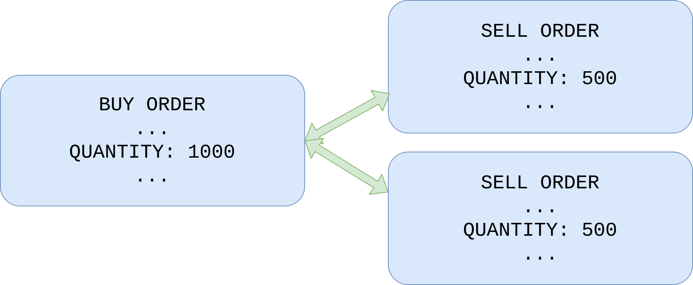

# Add support for multiple transactions per order

## Objectives

- describe issue with current implementation
- improve buy order filled callback
- implement buy order "filled" callback
- improve sell order callback

## Issue with the current implementation

Currently, `Naive.Trader` process is placing a buy order and it's assuming that it will be filled by a *single* opposite sell order(we are pattern matching on quantity to confirm that):

```{r, fig.align="center", out.width="80%", echo=FALSE}

```

Here we can see our buy order for 1000 units(on the left) and other trader's sell order(on the right) for 1000 units. This(order fully filled in single transaction) is a case most of the time but it's not ALWAYS the case.

\newpage

Sometimes our order will be filled by two or more transactions:

```{r, fig.align="center", out.width="80%", echo=FALSE}

```

The easiest and the safest way to check has this event filled our order fully is to fetch our order again from Binance at the moment when trade event filling our order arrives.

Problem with this approach is that sometimes we will run into a race condition:

```{r, fig.align="center", out.width="100%", echo=FALSE}
knitr::include_graphics("images/chapter_08_03_race_condition_timeline.png")
```

From the left, first, we are sending a buy order for quantity 1000 to the Binance. It hangs for a while until it gets filled by 2 transactions that happened very quickly. Quickly enough for us to receive both messages almost in the same moment.

When our bot will handle the first one it will fetch our the buy order which is already filled. It will cause the trader to place a sell order but then the there's another trade event waiting in the message box. It will be handled by another callback that will again fetch order and place another sell order to be placed and that's obviously not correct.

What we need to do is to update the status of the buy order after the first fetch(if it's filled) so when second trade event arrives we will ignore it(this will require additional callback).

The same issue will appear when placing sell order and dealing multiple simultaneous transaction.

\newpage

## Improve buy order filled callback

First, we need to modify the callback which monitors incoming trade events for ones filling it's buy order and then places sell order. We need to remove pattern matching assuming that a single trade event will fill our buy order - we need to drop quantity check as well as add 

```{r, engine = 'elixir', eval = FALSE}
  # /apps/naive/lib/naive/trader.ex
  def handle_info(
        %TradeEvent{
          buyer_order_id: order_id # <= quantity got removed from here
        },
        %State{
          symbol: symbol,
          buy_order:
            %Binance.OrderResponse{
              price: buy_price,
              order_id: order_id,
              orig_qty: quantity,
              transact_time: timestamp # <= timestamp added to query order
            } = buy_order, # <= buy order to update it
          profit_interval: profit_interval,
          tick_size: tick_size
        } = state
      ) do
```

Now we can fetch our buy order to check is it already filled. We will get the `Binance.Order` struct instead of the `Binance.OrderResponse` that we normally deal with. At this moment we will simply update our `Binance.OrderResponse` struct from state:

```{r, engine = 'elixir', eval = FALSE}
  # /apps/naive/lib/naive/trader.ex
  # inside the same callback
  def handle_info(
      ...
      ) do
    {:ok, %Binance.Order{} = current_buy_order} =
      @binance_client.get_order(
        symbol,
        timestamp,
        order_id
      )
    
    buy_order = %{buy_order | status: current_buy_order.status}
    ...
```

The rest of the logic inside this callback will depend on the `status` of the buy order. If our buy order is "filled" we would like to follow the existing logic but also update `buy_order` field inside the state of the trader process. On the other hand if our order is not yet filled the only thing to do is to update `buy_order` field inside the state of the Trader process.

\newpage

Here's an updated body below above changes(few variables got renamed for clarity as we are now fetch the order):

```{r, engine = 'elixir', eval = FALSE}
  # /apps/naive/lib/naive/trader.ex
  # inside the same callback
  buy_order = ....

    {:ok, new_state} =
      if buy_order.status == "FILLED" do
        sell_price = calculate_sell_price(buy_price, profit_interval, tick_size)

        Logger.info(
          "Buy order filled, placing SELL order for " <>
            "#{symbol} @ #{sell_price}, quantity: #{quantity}"
        )

        {:ok, %Binance.OrderResponse{} = order} =
          @binance_client.order_limit_sell(symbol, quantity, sell_price, "GTC")

        {:ok, %{state | buy_order: buy_order, sell_order: order}}
      else
        Logger.info("Buy order partially filled")
        {:ok, %{state | buy_order: buy_order}}
      end

    Naive.Leader.notify(:trader_state_updated, new_state)
    {:noreply, new_state}
  end
```

As we are branching our logic and both paths are updating the state, we will return it together with an `:ok` atom to be able to pattern match it and assign as a new state.

## Implement buy order "filled" callback

Above callback covers the case where we will get multiple transactions filling our buy order. We aren't yet covering for the race condition described at the begining of this chapter. When another trade event matching  `buyer_order_id` would arrive, above callback would be used and another sell order would be placed. To avoid that we need to add a new callback *ABOVE* the one that we just edited that will match `buyer_order_id` together with "filled" `status` and it will simply ignore that trade event as we know that sell event needed to be placed by previous trade event:

```{r, engine = 'elixir', eval = FALSE}
  # /apps/naive/lib/naive/trader.ex
  # place this callback ABOVE callback from previous section
  def handle_info(
        %Streamer.Binance.TradeEvent{
          buyer_order_id: order_id
        },
        %State{
          buy_order: %Binance.OrderResponse{
            order_id: order_id, # <= confirms that it's event for buy order
            status: "FILLED" # <= confirms buy order filled
          },
          sell_order: %Binance.OrderResponse{} # <= confirms sell order placed
        } = state
      ) do
    {:noreply, state}
  end
```

## Improve sell order callback

Let's move on to the callback where the trader receives trade event matching sell order's id (about line 135 inside the `Naive.Trader` module).

We need to modify the header of our callback in the following ways:

* drop the both pattern matches on `quantity` as we already know that trade event could partially fill our order (#1)
* get `symbol` out of state (#2)
* get `transact_time` out of the `sell_order` (used to fetch `get_order`) (#3)
* assign `sell_order` to a variable (#4)

```{r, engine = 'elixir', eval = FALSE}
  # /apps/naive/lib/naive/trader.ex
  def handle_info(
        %TradeEvent{
          seller_order_id: order_id # `quantity` check removed below (#1)
        },
        %State{
          symbol: symbol, (#2)
          sell_order:
            %Binance.OrderResponse{
              order_id: order_id,
              transact_time: timestamp # `transact_time` to `get_order` (#3)
            } = sell_order # to update order (#4)
        } = state
      ) do
```


Moving to the body of the function, we need to:

* fetch current state of our sell order
* update `status` of our `sell_order` from Trader's state
* branch out the logic based on `status` of the `sell_order`:
  
  - log and return the `:stop` atom to stop the GenServer
  
  or
  
  - update the state with new `sell_order` and continue

\newpage

Here's the full body of our callback:

```{r, engine = 'elixir', eval = FALSE}
    # /apps/naive/lib/naive/trader.ex
    # inside the callabck
    {:ok, %Binance.Order{} = current_sell_order} =
      @binance_client.get_order(
        symbol,
        timestamp,
        order_id
      )

    sell_order = %{sell_order | status: current_sell_order.status}

    if sell_order.status == "FILLED" do
      Logger.info("Trade finished, trader will now exit")
      {:stop, :normal, state}
    else
      Logger.info("Sell order partially filled")
      new_state = %{state | sell_order: sell_order}
      {:noreply, new_state}
    end
```

## Test the implementation

Testing this feature is a bit tricky as it requires trading on real Binance exchange(as our BinanceMock always fills order with a single transaction) as well as race condition to happen :) Not that easy but even without race condition we should still test that code works as expected wiht BinanceMock:

```{r, engine = 'bash', eval = FALSE}
$ iex -S mix
...
iex(1)> Naive.start_trading("XRPUSDT")
23:27:35.977 [info]  Starting new supervision tree to trade on XRPUSDT
{:ok, #PID<0.331.0>}
23:27:39.073 [info]  Initializing new trader for XRPUSDT
iex(2)> Streamer.start_streaming("XRPUSDT")
{:ok, #PID<0.345.0>}
23:31:57.044 [info]  Initializing new trader for XRPUSDT
23:31:57.888 [info]  Placing BUY order for XRPUSDT @ 0.28031, quantity: 71.3
23:32:01.023 [info]  Buy order filled, placing SELL order for XRPUSDT @ 0.28053,
quantity: 71.30000000
23:33:08.865 [info]  Trade finished, trader will now exit
23:33:08.865 [info]  XRPUSDT Trader finished - restarting
```

[Note] Please remember to run `mix format` to keep things nice and tidy.

Source code for this chapter can be found at [Github](https://github.com/frathon/hands-on-elixir-and-otp-cryptocurrency-trading-bot-source-code/tree/chapter_08)
