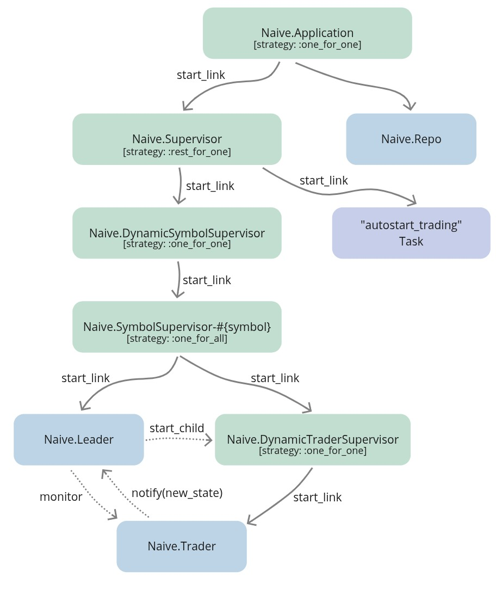
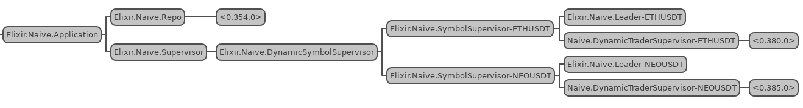

# 启动、停止、shutdown 和自动恢复 trading {#11-start-stop-and-autostart-trading}

在上一章中，我们为 `streamer` 应用加上了正确的监督、start/stop 功能，
以及 autostart 能力。现在轮到 `naive` 交易应用也做同样的事情了——不过这里有一个重要区别。

Trading 和 streaming 不一样。
当我们停止一个 streamer 时，只是关闭一个 WebSocket 连接——没什么大不了的。
但当我们停止一个 trader 时，它可能正处在一次交易循环的中间：
它已经买入了某个资产，正在等待价格上涨后卖出。
如果我们粗暴地终止它，就会留下一个我们本不打算持有的仓位。

这就是为什么我们会在本章实现四个操作：

- **start**——在某个交易对上开始 trading（模式和 streaming 一样）
- **stop**——立即终止 trading（适用于紧急情况）  
- **shutdown**——优雅地停止 trading，让所有活跃 trader 完成当前交易循环后再终止
- **autostart**——在应用重启时恢复之前已启用的交易对上的 trading

其中最关键的新增功能就是 shutdown。
它为我们提供了一种可控的收尾方式，避免被困在未完成的仓位里。让我们开始吧！

## 目标
- 描述并设计所需功能
- （重新）实现 start trading 功能
- 实现 stop trading 功能
- 实现 autostart trading 功能
- 实现 shutdown trading 功能
- 测试实现

## 描述并设计所需功能

在第 9 章中，我们已经在 `naive` 应用里引入了 Postgres 数据库，并为每个 symbol 添加了 settings。

在本章中，我们会继续推进，提供更多 trading 功能，这些功能会和上一章为 `streamer` 应用实现的功能非常相似：

* **stop trading** - 由于 `Naive.SymbolSupervisor` 进程是用可以轻松反推出名字的方式注册的，我们应该可以利用 `Process.whereis/1` 函数获取它们的 PID，并指示 `Naive.DynamicSymbolSupervisor` 终止这些子进程。同样，我们需要把这段逻辑放到某个地方，所以我们会把 `Naive.DynamicSymbolSupervisor` 实现成一个完整的模块，使用 `DynamicSupervisor` 行为。
* **start trading** - 由于 `Naive.DynamicSymbolSupervisor` 现在会变成一个模块，我们就可以把 `Naive` 模块里的 `start_trading/1` 实现移除，并把它重新实现到 `Naive.DynamicSymbolSupervisor` 模块里。它会遵循和 streaming 相同的模式：检查 PID，启动 `Naive.SymbolSupervisor` 进程，并把该 symbol 在 `settings` 表中的 `status` 标志切换掉。
* **shutdown trading** - 有时粗暴地停止 trading 并不是最好的办法，更好的方式是让 `Naive.Trader` 进程把正在进行的交易完成。为了做到这一点，我们需要通知负责该 symbol 的 `Naive.Leader` 进程，该 symbol 的 settings 已经更新，这样就应该让 `Naive.Leader` 停止启动新的 `Naive.Trader` 进程，并在最后一个 trader 完成后终止整个树。
* **autostart trading** - 这会和上一章中的实现非常类似。它需要引入一个新的 supervisor（我们会沿用同样的命名规范：把 `Naive.Application` 注册的进程名改成 `Naive.Application`，再创建一个叫做 `Naive.Supervisor` 的新 supervisor）并利用 `Task` 进程执行 autostart 逻辑。


```{r, fig.align="center", out.height="50%", out.width="100%", echo=FALSE}

```

## （重新）实现 start trading 功能

要（重新）实现 `start_trading/1`，我们需要在 `/apps/naive/lib/naive` 目录下创建一个新的 `dynamic_symbol_supervisor.ex` 文件，并让它使用 `DynamicSupervisor` 行为。此前我们一直在使用默认的 `DynamicSupervisor` 实现（它是 `Naive.Application` 的一个子进程——之后会被下面这个模块替换）：

```{r, engine = 'elixir', eval = FALSE}
# /apps/naive/lib/naive/dynamic_symbol_supervisor.ex
defmodule Naive.DynamicSymbolSupervisor do # <= 更新后的模块名
  use DynamicSupervisor

  require Logger # <= 添加 Logger

  import Ecto.Query, only: [from: 2] # <= 为查询而添加

  alias Naive.Repo             # <= 为查询/更新而添加
  alias Naive.Schema.Settings  # <= 为查询/更新而添加

  def start_link(init_arg) do
    DynamicSupervisor.start_link(__MODULE__, init_arg, name: __MODULE__)
  end

  def init(_init_arg) do
    DynamicSupervisor.init(strategy: :one_for_one)
  end
end
```

上面的代码是 [DynamicSupervisor 文档](https://hexdocs.pm/elixir/master/DynamicSupervisor.html#module-module-based-supervisors) 中的默认实现，只是加了一些额外的 import、require 和 alias，因为我们在本章会用到它们。

我们的 `start_trading/1` 实现和上一章 `streamer` 应用里的实现几乎一样：

```{r, engine = 'elixir', eval = FALSE}
# /apps/naive/lib/naive/dynamic_symbol_supervisor.ex
  ...
  def start_trading(symbol) when is_binary(symbol) do
    case get_pid(symbol) do
      nil ->
        Logger.info("Starting trading of #{symbol}")
        {:ok, _settings} = update_trading_status(symbol, "on")
        {:ok, _pid} = start_symbol_supervisor(symbol)

      pid ->
        Logger.warning("Trading on #{symbol} already started")
        {:ok, _settings} = update_trading_status(symbol, "on")
        {:ok, pid}
    end
  end
  ...
```

以及一些额外的辅助函数：

```{r, engine = 'elixir', eval = FALSE}
# /apps/naive/lib/naive/dynamic_symbol_supervisor.ex
  defp get_pid(symbol) do
    Process.whereis(:"Elixir.Naive.SymbolSupervisor-#{String.upcase(symbol)}")
  end

  defp update_trading_status(symbol, status)
       when is_binary(symbol) and is_binary(status) do
    Repo.get_by(Settings, symbol: String.upcase(symbol))
    |> Ecto.Changeset.change(%{status: status})
    |> Repo.update()
  end

  defp start_symbol_supervisor(symbol) do
    DynamicSupervisor.start_child(
      Naive.DynamicSymbolSupervisor,
      {Naive.SymbolSupervisor, symbol}
    )
  end
```

这套实现和辅助函数和 `streamer` 应用里的几乎一样。也许有人会想把某些逻辑抽象出来，但请记住，我们应该把 umbrella 项目里的各个应用当作独立服务来对待，尽量不要共享任何代码（我们在 `TradeEvent` 结构体上打破了这一点，但其实我们完全可以把那个结构体单独提取到一个 lib 里，共享给两个应用）。我会避免在 umbrella 项目中共享任何业务逻辑。

为了让 `start_trading/1` 真正工作，我们还需要在两个地方做更新：

* 更新 `Naive.Application` 里的 `children` 列表：

```{r, engine = 'elixir', eval = FALSE}
# /apps/naive/lib/naive/application.ex
    ...
    children = [
      {Naive.Repo, []},
      {Naive.DynamicSymbolSupervisor, []} # <= 替换 DynamicSupervisor
    ]
```

* 用 `defdelegate` 宏替换 `Naive` 模块里的 `start_trading/1` 实现（因为那里已经没有任何逻辑需要执行了）：

```{r, engine = 'elixir', eval = FALSE}
# /apps/naive/lib/naive.ex
...
  alias Naive.DynamicSymbolSupervisor

  defdelegate start_trading(symbol), to: DynamicSymbolSupervisor
```

此时我们又可以使用 `Naive.start_trading/1` 在某个交易对上开始 trading 了（底层会使用新的 `Naive.DynamicSymbolSupervisor` 模块中的逻辑）。

## 实现 stop trading 功能

停止 trading 需要在两个地方做改动，首先是在 `Naive.DynamicSymbolSupervisor` 里添加终止逻辑：

```{r, engine = 'elixir', eval = FALSE}
# /apps/naive/lib/naive/dynamic_symbol_supervisor.ex
  ...
  def stop_trading(symbol) when is_binary(symbol) do
    case get_pid(symbol) do
      nil ->
        Logger.warning("Trading on #{symbol} already stopped")
        {:ok, _settings} = update_trading_status(symbol, "off")

      pid ->
        Logger.info("Stopping trading of #{symbol}")

        :ok =
          DynamicSupervisor.terminate_child(
            Naive.DynamicSymbolSupervisor,
            pid
          )

        {:ok, _settings} = update_trading_status(symbol, "off")
    end
  end
  ...
```

第二个改动，是在 `Naive` 模块里通过 `defdelegate` 创建一个转发接口：

```{r, engine = 'elixir', eval = FALSE}
# /apps/naive/lib/naive.ex
  ...
  defdelegate stop_trading(symbol), to: DynamicSymbolSupervisor
  ...
```

这样就基本完成了 `stop_trading/1` 功能。我们现在已经可以开始和停止（之前做不到的）symbol trading 了。

## 实现 autostart trading 功能

为了实现自动启动，我们需要像上一章那样增加一个新的监督层，专门监督 `Naive.DynamicSymbolSupervisor` 和负责 autostart 的 `Task`。

让我们在 `/apps/naive/lib/naive` 目录下创建一个 `supervisor.ex` 文件，并像上一章一样把 `Naive.DynamicSymbolSupervisor` 和 `Task` 放到 children 列表里。同时把监督策略更新为 `:rest_for_one`：

```{r, engine = 'elixir', eval = FALSE}
# /apps/naive/lib/naive/supervisor.ex
defmodule Naive.Supervisor do
  use Supervisor

  def start_link(init_arg) do
    Supervisor.start_link(__MODULE__, init_arg, name: __MODULE__)
  end

  def init(_init_arg) do
    children = [
      {Naive.DynamicSymbolSupervisor, []},                 # <= 添加
      {Task,                                               # <= 添加
       fn ->                                               # <= 添加
         Naive.DynamicSymbolSupervisor.autostart_trading() # <= 添加
       end}                                                # <= 添加
    ]

    Supervisor.init(children, strategy: :rest_for_one) # <= 更新策略
  end
end
```

现在我们需要把 `Naive.Application` 的 children 列表中的 `Naive.DynamicSymbolSupervisor` 替换成 `Naive.Supervisor`，并更新 `Naive.Application` 进程注册时使用的名字：

```{r, engine = 'elixir', eval = FALSE}
# /apps/naive/lib/naive/application.ex
  ...
  def start(_type, _args) do
    children = [
      {Naive.Repo, []},
      {Naive.Supervisor, []} # <= 替换为 DynamicSymbolSupervisor
    ]

    opts = [strategy: :one_for_one, name: Naive.Application] # <= 更新名称
```


最后，我们还需要在 `Naive.DynamicSymbolSupervisor` 模块中实现 `autostart_trading/0`，因为新的 Task 会引用它：

```{r, engine = 'elixir', eval = FALSE}
# /apps/naive/lib/naive/dynamic_symbol_supervisor.ex
  ...
  # 在 `init/1` 函数后面添加下面这个函数
  def autostart_trading do
    fetch_symbols_to_trade()
    |> Enum.map(&start_trading/1)
  end
 
  ...

  # 在模块末尾添加这个辅助函数
  defp fetch_symbols_to_trade do
    Repo.all(
      from(s in Settings,
        where: s.status == "on",
        select: s.symbol
      )
    )
  end
  ...
```

这些和上一章里的实现是一样的（只是函数名不同）。我们会读取已启用的 symbol，并为每一个启动新的 `Naive.SymbolSupervisor` 进程。

此时我们已经可以看到这个实现开始工作了：

```{r, fig.align="center", out.width="100%", echo=FALSE}

```


现在我们可以在 IEx 中测试当前实现：

```{r, engine = 'bash', eval = FALSE}
$ iex -S mix
...
iex(1)> Mix.ensure_application!(:wx)
:ok
iex(2)> Mix.ensure_application!(:runtime_tools)
:ok
iex(3)> Mix.ensure_application!(:observer)
:ok
iex(4)> :observer.start()
...
iex(5)> Streamer.start_streaming("XRPUSDT")
21:35:30.107 [info]  Starting streaming on XRPUSDT
{:ok, #PID<0.370.0>}
iex(6)> Naive.start_trading("XRPUSDT")
21:35:30.207 [info]  Starting trading of XRPUSDT
21:35:30.261 [info]  Starting new supervision tree to trade on XRPUSDT
{:ok, #PID<0.372.0>}
21:35:33.344 [info]  Initializing new trader(1612647333342) for XRPUSDT
iex(7)> Streamer.start_streaming("ETHUSDT")
21:35:33.507 [info]  Starting streaming on ETHUSDT
{:ok, #PID<0.370.0>}
iex(8)> Naive.start_trading("ETHUSDT")
21:35:54.128 [info]  Starting trading of ETHUSDT
21:35:54.169 [info]  Starting new supervision tree to trade on ETHUSDT
{:ok, #PID<0.383.0>}
21:35:56.007 [info]  Initializing new trader(1612647356007) for ETHUSDT
iex(9)> Naive.stop_trading("ETHUSDT")
21:38:07.699 [info]  Stopping trading of ETHUSDT
{:ok,
 %Naive.Schema.Settings{
     ...
 }}
```

现在我们可以退出 IEx 并重新打开一个新的：

```{r, engine = 'bash', eval = FALSE}
$ iex -S mix
...
21:39:16.894 [info]  Starting trading of XRPUSDT
21:39:16.938 [info]  Starting new supervision tree to trade on XRPUSDT
21:39:18.786 [info]  Initializing new trader(1612647558784) for XRPUSDT
iex(1)>
```

上面的日志确认了 `naive` 应用会自动启动之前已启用的 symbol（通过 `start_trading/1`），同时 `stop_trading/1` 会更新数据库里的状态（因此该 symbol 在下次初始化时不会再被自动启动）。

## 实现 shutdown trading 功能

最后但同样重要的一项，是实现 `shutdown_trading/1` 功能。我们先从最简单的一步开始：在 `Naive` 模块（接口层）中，把函数调用委托给 `Naive.DynamicSymbolSupervisor` 模块：

```{r, engine = 'elixir', eval = FALSE}
  # /apps/naive/lib/naive.ex
  ...
  defdelegate shutdown_trading(symbol), to: DynamicSymbolSupervisor
  ...
```

接下来，我们在 `Naive.DynamicSymbolSupervisor` 模块里创建一个 `shutdown_trading/1` 函数。
这里我们会检查该 symbol 是否还有 trading 在进行（和 start/stop 一样），如果有，我们就通知负责该 symbol 的 `Naive.Leader` 进程，说明该 symbol 的 settings 已经更新：

```{r, engine = 'elixir', eval = FALSE}
# /apps/naive/lib/naive/dynamic_symbol_supervisor.ex
  ...
  def shutdown_trading(symbol) when is_binary(symbol) do
    case get_pid(symbol) do
      nil ->
        Logger.warning("Trading on #{symbol} already stopped")
        {:ok, _settings} = update_trading_status(symbol, "off")

      _pid ->
        Logger.info("Shutdown of trading on #{symbol} initialized")
        {:ok, settings} = update_trading_status(symbol, "shutdown")
        Naive.Leader.notify(:settings_updated, settings)
        {:ok, settings}
    end
  end
  ...
```

上面实现中的关键部分，是 `notify(:settings_updated, settings)`，它会通知 `Naive.Leader` 进程需要更新 trading settings。

目前 `Naive.Leader` 模块 *并不支持* 在启动后更新 settings——我们来增加一个新的接口函数，以及一个处理 settings 更新的回调函数：

```{r, engine = 'elixir', eval = FALSE}
# /apps/naive/lib/naive/leader.ex
  ...
  # 把下面这个函数加到 `notify` 函数的最后一个分支
  def notify(:settings_updated, settings) do
    GenServer.call(
      :"#{__MODULE__}-#{settings.symbol}",
      {:update_settings, settings}
    )
  end

  # 把下面这个 handler 加到 `handle_call` 函数的最后一个分支
  def handle_call(
        {:update_settings, new_settings},
        _,
        state
      ) do
    {:reply, :ok, %{state | settings: new_settings}}
  end
```

好，我们现在有办法“在线”更新 `Naive.Leader` 进程的 settings 了，但 `shutdown` 状态应该对 `Naive.Leader` 的行为产生什么影响呢？

有两个地方需要修改：

* 每当 `Naive.Trader` 进程完成交易循环时，`Naive.Leader` 进程都不应该启动新的 trader；同时还要检查这是不是最后一个 trader——如果是，就需要调用 `Naive.stop_trading/1`，传入它的 symbol，从而终止整个 symbol 的监督树
* 每当 `Naive.Leader` 收到 `rebuy` 通知时，如果 symbol 处于 `shutdown` 状态，就应该直接忽略它

先来看更新后的“交易结束” handler：

```{r, engine = 'elixir', eval = FALSE}
# /apps/naive/lib/naive/leader.ex
  ...
  def handle_info(
        {:DOWN, _ref, :process, trader_pid, :normal},
        %{traders: traders, symbol: symbol, settings: settings} = state
      ) do
    Logger.info("#{symbol} trader finished trade - restarting")

    case Enum.find_index(traders, &(&1.pid == trader_pid)) do
      nil ->
        Logger.warning(
          "Tried to restart finished #{symbol} " <>
            "trader that leader is not aware of"
        )

        if settings.status == "shutdown" and traders == [] do # <= 额外检查
          Naive.stop_trading(state.symbol)
        end

        {:noreply, state}

      index ->
        new_traders =
          if settings.status == "shutdown" do # <= 重构后的代码
            Logger.warning(
              "The leader won't start a new trader on #{symbol} " <>
                "as symbol is in the 'shutdown' state"
            )
            
            if length(traders) == 1 do
              Naive.stop_trading(state.symbol)
            end
            
            List.delete_at(traders, index)
          else
            new_trader_data = start_new_trader(fresh_trader_state(settings))
            List.replace_at(traders, index, new_trader_data)
          end

        {:noreply, %{state | traders: new_traders}}
    end
  end
```

如上所示，每当 `Naive.Trader` 进程完成一次交易循环时，`Naive.Leader` 进程都会检查自己是否能在状态中找到这位 trader 的记录（这部分没有变化）。
我们会修改这个回调，让 leader 进程检查 `settings.status`。
在 `shutdown` 状态下，它会检查这是不是 `traders` 列表中的最后一个 trader，如果是，就会调用 `Naive.stop_trading/1` 来终止整个树。

我们还需要修改的第二个回调，就是 `rebuy` 触发处理：

```{r, engine = 'elixir', eval = FALSE}
# /apps/naive/lib/naive/leader.ex
  ...
  def handle_call(
        {:rebuy_triggered, new_trader_state},
        {trader_pid, _},
        %{traders: traders, symbol: symbol, settings: settings} = state
      ) do
    case Enum.find_index(traders, &(&1.pid == trader_pid)) do
      nil ->
        Logger.warning("Rebuy triggered by trader that leader is not aware of")
        {:reply, :ok, state}

      index ->
        old_trader_data = Enum.at(traders, index)
        new_trader_data = %{old_trader_data | :state => new_trader_state}
        updated_traders = List.replace_at(traders, index, new_trader_data)

        updated_traders =
          if settings.chunks == length(traders) do
            Logger.info("All traders already started for #{symbol}")
            updated_traders
          else
            if settings.status == "shutdown" do
              Logger.warning(
                "The leader won't start a new trader on #{symbol} " <>
                  "as symbol is in the 'shutdown' state"
              )

              updated_traders
            else
              Logger.info("Starting new trader for #{symbol}")
              [start_new_trader(fresh_trader_state(settings)) | updated_traders]
            end
          end

        {:reply, :ok, %{state | :traders => updated_traders}}
    end
  end
  ...
```

在上面的 `rebuy_triggered` handler 里，我们根据 `settings.status` 添加了分支；当 symbol 处于 `shutdown` 状态时，我们就直接忽略 rebuy 通知。

最后一个改动，是创建一个新的 migration，让 `TradingStatusEnum` 多一个 `shutdown` 选项：

```{r, engine = 'bash', eval = FALSE}
$ cd apps/naive 
$ mix ecto.gen.migration update_trading_status
* creating priv/repo/migrations/20210205232303_update_trading_status.exs
```

在生成的 migration 文件里，我们需要执行一条原始 SQL 命令：

```{r, engine = 'elixir', eval = FALSE}
# /apps/naive/priv/repo/migrations/20210205232303_update_trading_status.exs
defmodule Naive.Repo.Migrations.UpdateTradingStatus do
  use Ecto.Migration

  @disable_ddl_transaction true

  def change do
    Ecto.Migration.execute "ALTER TYPE trading_status ADD VALUE IF NOT EXISTS 'shutdown'"
  end
end
```

我们还需要对 `Naive.Schema.TradingStatusEnum` 做同样的修改：

```{r, engine = 'elixir', eval = FALSE}
# /apps/naive/lib/naive/schema/trading_status_enum.ex
import EctoEnum

defenum(Naive.Schema.TradingStatusEnum, :trading_status, [:on, :off, :shutdown])
```

别忘了运行 `mix ecto.migrate` 来执行新的 migration。

## 在 IEx 中手动测试

现在我们可以测试 `shutdown_trading/1` 功能了：

```{r, engine = 'bash', eval = FALSE}
$ iex -S mix
...
iex(1)> Streamer.start_streaming("XRPUSDT")
21:46:26.651 [info]  Starting streaming on XRPUSDT
{:ok, #PID<0.372.0>}
iex(2)> Naive.start_trading("XRPUSDT")     
21:46:42.830 [info]  Starting trading of XRPUSDT
21:46:42.867 [info]  Starting new supervision tree to trade on XRPUSDT
{:ok, #PID<0.379.0>}
21:46:44.816 [info]  Initializing new trader(1612648004814) for XRPUSDT
...
21:47:52.448 [info]  Rebuy triggered for XRPUSDT by the trader(1612648004814)
...
21:49:58.900 [info]  Rebuy triggered for XRPUSDT by the trader(1612648089409)
...
21:50:58.927 [info]  Rebuy triggered for XRPUSDT by the trader(1612648198900)
...
21:53:27.202 [info]  Rebuy triggered for XRPUSDT by the trader(1612648326215)
21:53:27.250 [info]  Rebuy triggered for XRPUSDT by the trader(1612648325512)
21:53:27.250 [info]  All traders already started for XRPUSDT

# 此时我们有 5 个 `Naive.Trader` 进程在并行交易

iex(4)> Naive.shutdown_trading("XRPUSDT")
21:55:01.556 [info]  Shutdown of trading on XRPUSDT initialized
{:ok,
 %Naive.Schema.Settings{
     ...
 }}
...
22:06:58.855 [info]  Trader(1612648407202) finished trade cycle for XRPUSDT
22:06:58.855 [info]  XRPUSDT trader finished trade - restarting
22:06:58.855 [warn]  The leader won't start a new trader on XRPUSDT as symbol is in
shutdown state
22:07:50.768 [info]  Trader(1612648325512) finished trade cycle for XRPUSDT
22:07:50.768 [info]  XRPUSDT trader finished trade - restarting
22:07:50.768 [warn]  The leader won't start a new trader on XRPUSDT as symbol is in
shutdown state
22:07:50.857 [info]  Trader(1612648326215) finished trade cycle for XRPUSDT
22:07:50.857 [info]  XRPUSDT trader finished trade - restarting
22:07:50.857 [warn]  The leader won't start a new trader on XRPUSDT as symbol is in
shutdown state
22:07:51.079 [info]  Trader(1612648089409) finished trade cycle for XRPUSDT
22:07:51.079 [info]  XRPUSDT trader finished trade - restarting
22:07:51.079 [warn]  The leader won't start a new trader on XRPUSDT as symbol is in
shutdown state
22:08:05.401 [info]  Trader(1612648004814) finished trade cycle for XRPUSDT
22:08:05.401 [info]  XRPUSDT trader finished trade - restarting
22:08:05.401 [warn]  The leader won't start a new trader on XRPUSDT as symbol is in
shutdown state
22:08:05.401 [info]  Stopping trading of XRPUSDT
```

如上面的日志所示，我们的 `naive` 策略先从 1 个 `Naive.Trader` 进程扩展到了 5 个并行进程，
然后我们调用了 `shutdown_trading/1`。
在 `shutdown` 状态下，`Naive.Leader` 进程忽略了 `rebuy` 通知，
也不会再启动新的 `Naive.Trader` 进程，而是等待现有 trader 完成。
当最后一个 `Naive.Trader` 进程完成交易循环时，
`Naive.Leader` 调用了 `stop_trading/1` 来终止整个 symbol 的监督树。

**现在 naive 交易应用已经具备完整的生命周期控制了！** 我们实现了：

- 带数据库状态持久化的 start/stop trading
- 允许 trader 完成当前循环的优雅 shutdown
- 在应用重启后恢复 trading 的 autostart 功能
- 一个 `rest_for_one` 监督策略，确保需要时 autostart 也会重新运行

shutdown 功能对真实交易系统尤其重要。它意味着我们可以安全地收尾，而不会留下未平仓位或未完成的交易。

**下一步是什么？**

如果你一直跟着做，可能已经注意到 `Naive.DynamicSymbolSupervisor` 和 `Streamer.DynamicStreamerSupervisor` 模块看起来非常相似。实际上，我们已经在两个应用之间复制了同样的监督模式。

在下一章中，我们会通过创建一个 `Core.ServiceSupervisor` 模块来解决这种重复，抽象出通用逻辑。我们会使用 Elixir 宏来生成这些样板代码，让我们只用更少的重复，就能定义 supervisor，同时保持每个应用彼此独立。


[Note] 请记得运行 `mix format`，保持代码整洁。

本章源码可以在本书的源码仓库中找到
（分支：
[chapter_11](https://github.com/Cinderella-Man/hands-on-elixir-and-otp-cryptocurrency-trading-bot-source-code/tree/chapter_11)）。
