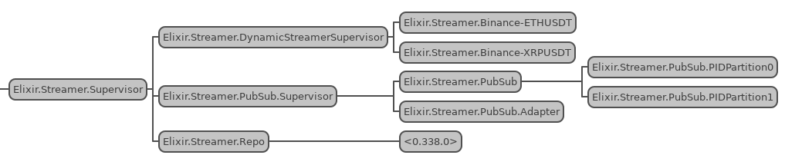
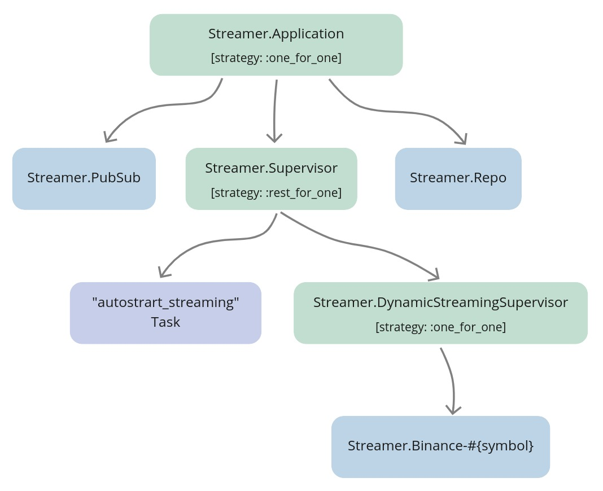
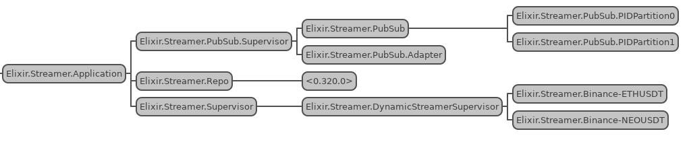

# Supervise and autostart streaming

## Objectives

- describe and design the required functionality
- register the `Streamer.Binance` processes with names
- set up `ecto` inside the `streamer` app
- create and migrate the db
- seed default settings
- implement the supervision tree and start streaming functionality
- implement the stop functionality
- implement the autostart streaming functionality
- test the implementation

## Describe and design the required functionality

At this moment there's no supervision around the streamer processes, whenever an error would occur inside the `Streamer.Binance` process, it will die and never come back up.

That's less than perfect, but we can use supervisors to the rescue.

We will create a new `Streamer.DynamicStreamerSupervisor` module inside our `streamer` application that will supervise the `Streamer.Binance` processes.

Next, we will consider a list of functionalities that we would like it to provide:

- start streaming. This will require a new `Streamer.Binance` process started under the                           
`Streamer.DynamicStreamerSupervisor`. We will put logic responsible for starting that process inside the `Streamer.DynamicStreamerSupervisor` module.
- stop streaming. To be able to stop the `Streamer.Binance` process streaming on a specific symbol, we will need to know that process' PID based only on symbol string(ie. "ETHUSDT"). To make that possible, we will need to register every `Streamer.Binance` process with a name that we will be able to "reverse-engineer" based only on symbol string for example: `:"#{__MODULE__}-#{symbol}"`
- autostart streaming. At the start of streaming on a symbol, we should persist that action as a symbol's streaming setting inside the database. We will need to generate a new Ecto.Repo, configure, create and migrate DB (just like in the last chapter for the `naive` app) to be able to retrieve that list. We will write a logic that will fetch settings of the symbols, autostart the ones that are enabled and place all that logic inside the `Streamer.DynamicStreamerSupervisor` module. We will introduce a [Task](https://hexdocs.pm/elixir/master/Task.html) child process that will utilize the logic from the `Streamer.DynamicStreamerSupervisor` to fetch those enabled symbols and start `Streamer.Binance` processes on startup - we will describe all of this separately in its section in this chapter.

## Register the `Streamer.Binance` processes with names

To be able to perform start/stop streaming on a symbol we will first need to be able to figure out the PID of the `Streamer.Binance` process that is streaming that symbol.

The first change that we need to apply will be to register `Streamer.Binance` processes with names by passing the 4th argument to the `WebSockex.start_link/4` function:

```{r, engine = 'elixir', eval = FALSE}
  # /apps/streamer/lib/streamer/binance.ex
  def start_link(symbol) do
    Logger.info(
      "Binance streamer is connecting to websocket " <>
        "stream for #{symbol} trade events"
    )

    WebSockex.start_link(
      "#{@stream_endpoint}#{String.downcase(symbol)}@trade", # <= lowercase symbol
      __MODULE__,
      nil,
      name: :"#{__MODULE__}-#{symbol}" # <= uppercase symbol
    )
  end
```

Few things worth mention here:

- we are getting the uppercase symbol but inside the URL we need to use a lowercase symbol so we will introduce a new separate variable to be used in the URL
- we are registering the process using the uppercase symbol so the name will remain consistent with the `naive` application's processes
- to register process we are sending keyword list as the 4th argument to custom `start_link/4` function of `WebSockex` module ([link to source](https://github.com/Azolo/websockex/blob/master/lib/websockex.ex#L376) - again, no need to be afraid of reading the source code in Elixir, that's the beauty of it)

## Set up `ecto` inside the `streamer` app

In the same fashion as in the last chapter, we will need to set up the database inside the `streamer` app. We will use the same Postgres server(docker container) that we've set up inside docker in the last chapter, just a separate database, so there's no need to update the `docker-compose.yml` file.

As previously the first step will be to add the `ecto` modules and Postgres related packages into `deps` inside the `mix.exs` file of the `streamer` app. Additionally, we will add the `binance` module that we will use to fetch all symbols supported by the exchange(to generate default settings as we've done for the `naive` application. We are unable to use the `BinanceMock` as this will cause the circular dependency [Binance Mock depends on the streamer app]):

```{r, engine = 'elixir', eval = FALSE}
  # /apps/streamer/mix.exs
  ...
  defp deps do
    [
      {:binance, "~> 1.0"},    # <= used to retrieve symbols list(exchangeInfo)
      {:ecto_sql, "~> 3.0"},   # <= added dependency
      {:ecto_enum, "~> 1.4"},  # <= added dependency
      {:jason, "~> 1.2"},
      {:phoenix_pubsub, "~> 2.0"},
      {:postgrex, ">= 0.0.0"}, # <= added dependency
      {:websockex, "~> 0.4"}
    ]
  end
```

Run `mix deps.get` to install new dependencies.

We can now use `ecto` generator to add an `ecto` repository to the Streamer application:

```{r, engine = 'bash', eval = FALSE}
$ cd apps/streamer
$ mix ecto.gen.repo -r Streamer.Repo
* creating lib/streamer
* creating lib/streamer/repo.ex
* updating ../../config/config.exs
...
```

Update the config to match access details to Postgres' docker instance:

```{r, engine = 'elixir', eval = FALSE}
# /config/config.exs
config :streamer,             # <= added line 
  ecto_repos: [Streamer.Repo] # <= added line

config :streamer, Streamer.Repo,
  database: "streamer",               # <= database updated 
  username: "postgres",               # <= username updated
  password: "hedgehogSecretPassword", # <= password updated
  hostname: "localhost"
```

The last step will be to update the `children` list of the `Streamer.Application` module:

```{r, engine = 'elixir', eval = FALSE}
# /apps/streamer/lib/streamer/application.ex
...
  def start(_type, _args) do
    children = [
      {Streamer.Repo, []}, # <= repo added
      {
        Phoenix.PubSub,
        name: Streamer.PubSub, adapter_name: Phoenix.PubSub.PG2
      }
    ]
    ...
```

## Create and migrate the db

We can now create a new streamer database using the `mix` tool, after that we will be able to generate a migration file that will create the `settings` table:

```{r, engine = 'bash', eval = FALSE}
$ mix ecto.create -r Streamer.Repo
The database for Streamer.Repo has been created
$ cd apps/streamer
$ mix ecto.gen.migration create_settings
* creating priv/repo/migrations
* creating priv/repo/migrations/20210203184805_create_settings.exs
```

We can safely start just with `id`, `symbol` and `status` columns, where the last one will follow the same enum idea from the previous chapter:

```{r, engine = 'elixir', eval = FALSE}
# /apps/streamer/priv/repo/migrations/20210203184805_create_settings.exs
defmodule Streamer.Repo.Migrations.CreateSettings do
  use Ecto.Migration

  alias Streamer.Schema.StreamingStatusEnum

  def change do
    StreamingStatusEnum.create_type()

    create table(:settings, primary_key: false) do
      add(:id, :uuid, primary_key: true)
      add(:symbol, :text, null: false)
      add(:status, StreamingStatusEnum.type(), default: "off", null: false)
      
      timestamps()
    end

    create(unique_index(:settings, [:symbol]))
  end
end
```

That finishes our work on the migration file, we need to add the `StreamingStatusEnum` in the same way as in the last chapter (create a `schema` directory inside the `apps/streamer/lib/streamer` directory and a new  file called `streaming_status_enum.ex` and place below logic (defining the enum) in it:

```{r, engine = 'elixir', eval = FALSE}
# /apps/streamer/lib/streamer/schema/streaming_status_enum.ex
import EctoEnum

defenum(Streamer.Schema.StreamingStatusEnum, :streaming_status, [:on, :off])
```

Let's run the migration to create the table, unique index, and the enum:

```{r, engine = 'bash', eval = FALSE}
$ mix ecto.migrate
21:31:56.850 [info]  == Running 20210203184805
Streamer.Repo.Migrations.CreateSettings.change/0 forward
21:31:56.850 [info]  execute "CREATE TYPE public.streaming_status AS ENUM ('on', 'off')"
21:31:56.851 [info]  create table settings
21:31:56.912 [info]  create index settings_symbol_index
21:31:56.932 [info]  == Migrated 20210203184805 in 0.0s
```

We can now create a schema file for the `settings` table. Inside the                                  
`/apps/streamer/lib/streamer/schema` directory create a file called `settings.ex`:

```{r, engine = 'elixir', eval = FALSE}
# /apps/streamer/lib/streamer/schema/settings.ex
defmodule Streamer.Schema.Settings do
  use Ecto.Schema

  alias Streamer.Schema.StreamingStatusEnum

  @primary_key {:id, :binary_id, autogenerate: true}

  schema "settings" do
    field(:symbol, :string)
    field(:status, StreamingStatusEnum)

    timestamps()
  end
end
```

We are now ready to query the table but first, we need to insert the default settings into the database.

## Seed default settings

As with the settings inside the `naive` application, we will fetch all symbols from binance and bulk insert them into the database.

First let's create a new file called `seed_settings.exs` inside the `apps/streamer/priv` directory. As this file is nearly the same as the one from the last chapter I will skip the lengthy explanation - this is the script:

```{r, engine = 'elixir', eval = FALSE}
# /apps/streamer/priv/seed_settings.exs
require Logger

alias Decimal
alias Streamer.Repo
alias Streamer.Schema.Settings

Logger.info("Fetching exchange info from Binance to create streaming settings")

{:ok, %{symbols: symbols}} = Binance.get_exchange_info()

timestamp = NaiveDateTime.utc_now()
  |> NaiveDateTime.truncate(:second)

base_settings = %{
  symbol: "",
  status: "off",
  inserted_at: timestamp,
  updated_at: timestamp
}

Logger.info("Inserting default settings for symbols")

maps = symbols
  |> Enum.map(&(%{base_settings | symbol: &1["symbol"]}))

{count, nil} = Repo.insert_all(Settings, maps)

Logger.info("Inserted settings for #{count} symbols")
```

Don't forget to run the seeding script before progressing forward:

```{r, engine = 'bash', eval = FALSE}
$ cd apps/streamer
$ mix run priv/seed_settings.exs
22:03:46.675 [info]  Fetching exchange info from Binance to create streaming settings
22:03:51.386 [info]  Inserting default settings for symbols
22:03:51.448 [info]  Inserted settings for 1277 symbols
```

## Implement the supervision tree and start streaming functionality

Let's start by creating a new file called `dynamic_streamer_supervisor.ex` inside the                          
`/apps/streamer/lib/streamer` directory. Let's start with a default implementation from the [docs](https://hexdocs.pm/elixir/master/DynamicSupervisor.html#module-module-based-supervisors) (updated with correct module and process names):

```{r, engine = 'elixir', eval = FALSE}
# /apps/streamer/lib/streamer/dynamic_streamer_supervisor.ex
defmodule Streamer.DynamicStreamerSupervisor do
  use DynamicSupervisor

  def start_link(init_arg) do
    DynamicSupervisor.start_link(__MODULE__, init_arg, name: __MODULE__)
  end

  def init(_init_arg) do
    DynamicSupervisor.init(strategy: :one_for_one)
  end
end
```

Next, we will add the `start_streaming/1` function at the bottom of the                     
`Streamer.DynamicStreamerSupervisor` module:

```{r, engine = 'elixir', eval = FALSE}
# /apps/streamer/lib/streamer/dynamic_streamer_supervisor.ex
  ...
  def start_streaming(symbol) when is_binary(symbol) do
    case get_pid(symbol) do
      nil ->
        Logger.info("Starting streaming on #{symbol}")
        {:ok, _settings} = update_streaming_status(symbol, "on")
        {:ok, _pid} = start_streamer(symbol)

      pid ->
        Logger.warn("Streaming on #{symbol} already started")
        {:ok, _settings} = update_streaming_status(symbol, "on")
        {:ok, pid}
    end
  end
```

To unpack above - we are checking is there a streamer process already running for the passed symbol and based on the result of that check, we either start the new streaming process(and update the symbol's settings) or just update the symbol's settings.

Inside the `start_streaming/1` function, we are using 3 helper functions that we need to add at the bottom of the file:

```{r, engine = 'elixir', eval = FALSE}
# /apps/streamer/lib/streamer/dynamic_streamer_supervisor.ex
  defp get_pid(symbol) do
    Process.whereis(:"Elixir.Streamer.Binance-#{symbol}")
  end

  defp update_streaming_status(symbol, status)
       when is_binary(symbol) and is_binary(status) do
    Repo.get_by(Settings, symbol: symbol)
    |> Ecto.Changeset.change(%{status: status})
    |> Repo.update()
  end

  defp start_streamer(symbol) do
    DynamicSupervisor.start_child(
      Streamer.DynamicStreamerSupervisor,
      {Streamer.Binance, symbol}
    )
  end
```

The above functions are quite self-explanatory, `get_pid/1` is a convenience wrapper,                  
`update_streaming_status/2` will update the status field for the passed symbol, `start_streamer/1` will instruct the `Streamer.DynamicStreamerSupervisor` to start a new `Streamer.Binance` process with symbol passed as the first argument.

The last step to get the above function to work(and future ones in this module) would be to add a `require`, an `import`, and a few `alias`es at the top of the module:

```{r, engine = 'elixir', eval = FALSE}
# /apps/streamer/lib/streamer/dynamic_streamer_supervisor.ex
  require Logger

  import Ecto.Query, only: [from: 2]

  alias Streamer.Repo
  alias Streamer.Schema.Settings
```

\newpage

As we added a new `start_streaming/1` logic inside the `Streamer.DynamicStreamerSupervisor`, we need to replace the `start_streaming/1` implementation inside the `Streamer` module:

```{r, engine = 'elixir', eval = FALSE}
# /apps/streamer/lib/streamer.ex
  ...
  alias Streamer.DynamicStreamerSupervisor

  def start_streaming(symbol) do
    symbol
    |> String.upcase()
    |> DynamicStreamerSupervisor.start_streaming()
  end
```

As we don't need to put any logic inside the `Streamer.start_streaming/1` function, we can just delegate the call straight to the `Streamer.DynamicStreamerSupervisor` module.

The last step will be to append the `Streamer.DynamicStreamSupervisor` to the `children` list of the `Streamer.Application`:

```{r, engine = 'elixir', eval = FALSE}
  # /apps/streamer/lib/streamer/application.ex
  def start(_type, _args) do
    children = [
      ...
      {Streamer.DynamicStreamerSupervisor, []}
    ]
```

At this moment our supervision tree already works and all streamer processes are being monitored by the `Streamer.DynamicStreamerSupervisor`:

```{r, fig.align="center", out.width="100%", echo=FALSE}

```

## Implement the stop functionality

As we can see, we are now registering the `Streamer.Binance` processes with names that contain their symbols. We will be able to retrieve PIDs of those registered processes just by simply passing the symbol string(ie. "ETHUSDT") into `get_pid/1`, which will allow us to then request termination of those processes by the `Streamer.DynamicStreamerSupervisor`.

Let's write a `stop_streaming/1` logic inside the `Streamer.DynamicStreamerSupervisor` module(put it above first private function):

```{r, engine = 'elixir', eval = FALSE}
  # /apps/streamer/lib/streamer/dynamic_streamer_supervisor.ex
  def stop_streaming(symbol) when is_binary(symbol) do
    case get_pid(symbol) do
      nil ->
        Logger.warn("Streaming on #{symbol} already stopped")
        {:ok, _settings} = update_streaming_status(symbol, "off")

      pid ->
        Logger.info("Stopping streaming on #{symbol}")

        :ok =
          DynamicSupervisor.terminate_child(
            Streamer.DynamicStreamerSupervisor,
            pid
          )

        {:ok, _settings} = update_streaming_status(symbol, "off")
    end
  end
```

`stop_streaming/1` looks very similar to `start_streaming/1`, we are checking is there already a `Streamer.Binance` process registered for that symbol, and we either ask the                       
`Streamer.DynamicStreamerSupervisor` to terminate it for us (using the                        
`DynamicSupervisor.terminate_child/2` function + update the status) or just update the status to be `off`.

We need to update the `Streamer` module to provide the interface to stop streaming on a symbol:

```{r, engine = 'elixir', eval = FALSE}
# /apps/streamer/lib/streamer.ex
  ...
  def stop_streaming(symbol) do
    symbol
    |> String.upcase()
    |> DynamicStreamerSupervisor.stop_streaming()
  end
  ...
```

## Implement the autostart streaming functionality

Currently, whenever we will shutdown the elixir app, settings persist in the database but streamers are not started on the next init.

To fix this, we will add `autostart_streaming/0` inside the `Streamer.DynamicStreamerSupervisor`.

Note: It very important to differentiate between module and process. We will put our autostarting logic inside the *module* but the `Streamer.DynamicStreamerSupervisor` *process* won't run it.

We will introduce a new [Task](https://hexdocs.pm/elixir/master/Task.html) process that will execute all the autostarting logic.

That will cover the problem of the Supervisor executing too much business logic (as the Task will execute it), but how will we supervise them together?
At init both will start, the `Streamer.DynamicStreamerSupervisor` first, and then Task will ask it to start multiple children and that will work fine. The problem occurs when the `Streamer.DynamicStreamerSupervisor` would die because of any reason. Currently, it's supervised using the `one_for_one` strategy(and the `Task` would be as well) which means that it will get started again by the `Streamer.Application` process but at that moment the "autostarting" `Task` won't be there anymore to start streaming on all enabled symbols.

We can clearly see that whenever the `Streamer.DynamicStreamerSupervisor` will die it needs to be started again *together* with the "autostart" `Task` and this won't fit our current `Streamer.Application`'s strategy.

In cases like those, a new level of supervision needs to be introduced that will have a different supervision strategy for those "coupled" processes. We will rename the process name of the `Streamer.Application` (which is currently registered as `Streamer.Supervisor`) to `Streamer.Application`. Then we will introduce the new `Streamer.Supervisor` module and register it under the same name. We will attach both `Streamer.DynamicStreamerSupervisor` and Task to the `Streamer.Supervisor` and assign it with the `rest_for_one` strategy  which will restart the Task whenever           
`Streamer.DynamicStreamerSupervisor` would die:

```{r, fig.align="center", out.width="100%", echo=FALSE}

```

Let's start by creating the `autostart_streaming/0` functionality inside the                         
`Streamer.DynamicStreamerSupervisor`:

```{r, engine = 'elixir', eval = FALSE}
  # /apps/streamer/lib/streamer/dynamic_streamer_supervisor.ex

  # add below after the `init/1` function
  def autostart_streaming do
    fetch_symbols_to_stream()
    |> Enum.map(&start_streaming/1)
  end

  # and this at the end of the module
  defp fetch_symbols_to_stream do
    Repo.all(
      from(s in Settings,
        where: s.status == "on",
        select: s.symbol
      )
    )
  end
```

`autostart_streaming/0` function fetches all symbols from the `settings` table with `status == "on"` then it passes them one by one into the `start_streaming/1` function using `Enum.map/2`.

We can now focus on referring to the above autostarting logic inside the new supervisor that we will create now. Let's start by creating a new file called `supervisor.ex` inside the `/apps/streamer/lib/streamer/` directory and fill it with default [Supervisor](https://hexdocs.pm/elixir/master/Supervisor.html#module-module-based-supervisors) implementation:

```{r, engine = 'elixir', eval = FALSE}
# /apps/streamer/lib/streamer/supervisor.ex
defmodule Streamer.Supervisor do # <= updated module name
  use Supervisor

  def start_link(init_arg) do
    Supervisor.start_link(__MODULE__, init_arg, name: __MODULE__)
  end

  def init(_init_arg) do
    children = [

    ]

    Supervisor.init(children, strategy: :one_for_one)
  end
end
```

We can now update the strategy to `rest_for_one`:

```{r, engine = 'elixir', eval = FALSE}
# /apps/streamer/lib/streamer/supervisor.ex
  def init(_init_arg) do
    ...
    Supervisor.init(children, strategy: :rest_for_one) # <= strategy updated
  end
```

The last step inside our new supervisor will be to add 2 children: `Streamer.DynamicStreamerSupervisor` and `Task` (that will autostart the symbol streamers):

```{r, engine = 'elixir', eval = FALSE}
# /apps/streamer/lib/streamer/supervisor.ex
  def init(_init_arg) do
    children = [
      {Streamer.DynamicStreamerSupervisor, []},
      {Task,
       fn ->
         Streamer.DynamicStreamerSupervisor.autostart_streaming()
       end}
    ]
    ...
  end
```

The final update in this chapter will be to replace the `Streamer.DynamicStreamerSupervisor` as one of the children inside the `Streamer.Application` module and update the name that the application process registers under:

```{r, engine = 'elixir', eval = FALSE}
# /apps/streamer/lib/streamer/application.ex
    ...
    children = [
      {Streamer.Repo, []},
      {
        Phoenix.PubSub,
        name: Streamer.PubSub, adapter_name: Phoenix.PubSub.PG2
      },
      {Streamer.Supervisor, []} # <= updated supervisor
    ]

    opts = [strategy: :one_for_one, name: Streamer.Application] # <= updated name
    ...
```


## Test the implementation

Let's start an IEx session and call the `start_streaming/1` function twice for two different symbols and then exit using double Ctrl+c:

```{r, engine = 'bash', eval = FALSE}
$ iex -S mix
...
iex(1)> Streamer.start_streaming("ethusdt")
18:51:39.809 [info]  Starting streaming on ETHUSDT
{:ok, #PID<0.370.0>}
iex(2)> Streamer.start_streaming("neousdt")
18:51:47.288 [info]  Starting streaming on NEOUSDT
{:ok, #PID<0.377.0>}
```

Now, open a *new* IEx session and look at the output:

```{r, engine = 'bash', eval = FALSE}
$ iex -S mix
...
iex(1)> 
18:53:48.920 [info]  Starting streaming on ETHUSDT
18:53:50.306 [info]  Starting streaming on NEOUSDT
```

We can also confirm that streamer processes are there by using `:observer.start()`:

```{r, fig.align="center", out.width="100%", echo=FALSE}

```

Inside the same `iex` session run the following:

```{r, engine = 'bash', eval = FALSE}
iex(5)> Streamer.stop_streaming("neousdt") 
18:57:37.205 [info]  Stopping streaming on NEOUSDT
{:ok,
 %Streamer.Schema.Settings{
   ...
 }}
iex(6)> Streamer.stop_streaming("ethusdt")
18:57:51.553 [info]  Stopping streaming on ETHUSDT
{:ok,
 %Streamer.Schema.Settings{
   ...
 }}
```

Stop the IEx session and start a new one - streamers shouldn't be autostarted anymore.

[Note] Please remember to run the `mix format` to keep things nice and tidy.

Source code for this chapter can be found at [Github](https://github.com/Cinderella-Man/hands-on-elixir-and-otp-cryptocurrency-trading-bot-source-code/tree/chapter_11)
