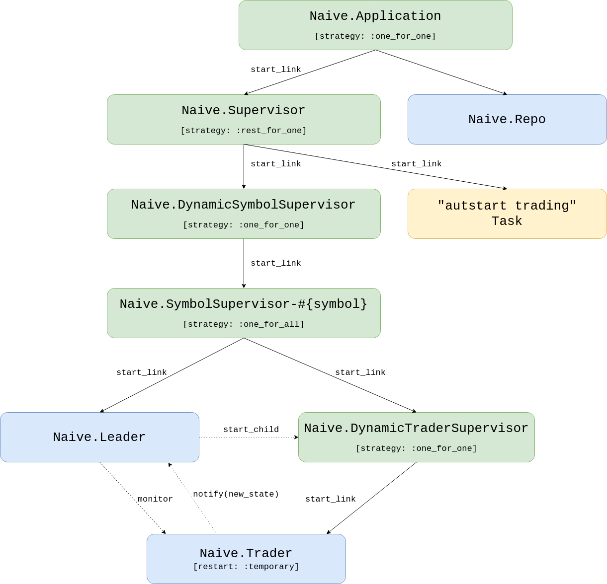
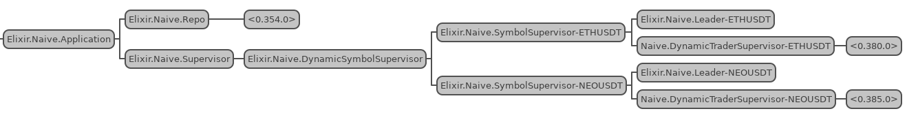

# Start, stop, shutdown and autostart trading

## Objectives
- describe and design the required functionality
- (re-)implement the start trading functionality
- implement the stop trading functionality
- implement the autostart trading functionality
- implement the shutdown trading functionality
- test the implementation

## Describe and design the required functionality

In the 10th chapter, we've introduced the Postgres database inside the `naive` application together with the settings per symbol.

In this chapter, we will progress forward to provide additional trading functionality that will be similar to the functionality implemented in the last chapter for the `streaming` application:

* **stop trading** - as the `Naive.SymbolSupervisor` processes are registered with names that can be easily reverse engineered, we should be able to utilize the `Process.where_is/1` function to retrieve the PIDs and instruct the `Naive.DynamicSymbolSupervisor` to terminate those child processes. Again, we need to put that logic somewhere so we will implement the `Naive.DynamicSymbolSupervisor` as a full module using the `DynamicSupervisor` behavior.
* **start_trading** - as our `Naive.DynamicSymbolSupervisor` will now be a module we will be able to remove the `start_trading/1` implementation from the `Naive` module and reimplement it inside the `Naive.DynamicSymbolSupervisor` module. It will follow the same pattern of checking for PID, starting the `Naive.SymbolSupervisor` process and flipping the `status` flag inside the `settings` table's row for that symbol.
* **shutdown trading** - sometimes abruptly stopping trading won't be the best solution, it would be better to allow the `Naive.Trader` processes to finish their ongoing trades. To be able to do that we will need to inform the `Naive.Leader` process assigned to the symbol that the settings for that symbol have been updated and that should cause the `Naive.Leader` process to withhold starting new `Naive.Trader` processes and terminate the whole tree when the last trader will finish.
* **autostart trading** - this will be a very similar implementation to the one from the last chapter. It will require introducing a new supervisor(we will follow the same naming convention: rename `Naive.Application`'s registered process name to `Naive.Application`, create a new supervisor called `Naive.Supervisor`) and utilize the `Task` process to execute the autostarting logic.


```{r, fig.align="center", out.height="50%", echo=FALSE}

```

## (Re-)Implement the start trading functionality

To (re-)implement the `start_trading/1` functionality we will need to create a new file called                        
`dynamic_symbol_supervisor.ex` inside the `/apps/naive/lib/naive` directory that will use the                            
`DynamicSupervisor` behavior. Previously we have been using default `DynamicSupervisor` implementation(one of the children of the `Naive.Application` - to be substituted with the below module):

```{r, engine = 'elixir', eval = FALSE}
# /apps/naive/lib/naive/dynamic_symbol_supervisor.ex
defmodule Naive.DynamicSymbolSupervisor do # <= module updated
  use DynamicSupervisor

  require Logger # <= Logger added

  import Ecto.Query, only: [from: 2] # <= added for querying

  alias Naive.Repo             # <= added for querying/updating
  alias Naive.Schema.Settings  # <= added for querying/updating

  def start_link(init_arg) do
    DynamicSupervisor.start_link(__MODULE__, init_arg, name: __MODULE__)
  end

  def init(_init_arg) do
    DynamicSupervisor.init(strategy: :one_for_one)
  end
end
```

The above code is a default implementation from the [DynamicSupervisor docs](https://hexdocs.pm/elixir/master/DynamicSupervisor.html#module-module-based-supervisors) with some additional imports, require and aliases as we will use them in this chapter.

Our `start_trading/1` implementation is almost the same as one for the `streamer` application from the last chapter:

```{r, engine = 'elixir', eval = FALSE}
# /apps/naive/lib/naive/dynamic_symbol_supervisor.ex
  ...
  def start_trading(symbol) when is_binary(symbol) do
    symbol = String.upcase(symbol)
    
    case get_pid(symbol) do
      nil ->
        Logger.info("Starting trading of #{symbol}")
        {:ok, _settings} = update_trading_status(symbol, "on")
        {:ok, _pid} = start_symbol_supervisor(symbol)

      pid ->
        Logger.warn("Trading on #{symbol} already started")
        {:ok, _settings} = update_trading_status(symbol, "on")
        {:ok, pid}
    end
  end
  ...
```

\newpage

together with additional helper functions:

```{r, engine = 'elixir', eval = FALSE}
# /apps/naive/lib/naive/dynamic_symbol_supervisor.ex
  defp get_pid(symbol) do
    Process.whereis(:"Elixir.Naive.SymbolSupervisor-#{symbol}")
  end

  defp update_trading_status(symbol, status)
       when is_binary(symbol) and is_binary(status) do
    Repo.get_by(Settings, symbol: symbol)
    |> Ecto.Changeset.change(%{status: status})
    |> Repo.update()
  end

  defp start_symbol_supervisor(symbol) do
    DynamicSupervisor.start_child(
      Naive.DynamicSymbolSupervisor,
      {Naive.SymbolSupervisor, symbol}
    )
  end
```

Both implementation and helper functions are almost the same as the ones inside the `naive` application. It could be tempting to abstract some of the logic away but remember that we should treat all applications in our umbrella project as standalone services that should not share any code if possible(we broke that rule for the `TradeEvent` struct from the `streamer` app but we could easily just make a lib with that struct that would be shared between two applications). I would shy away from sharing any business logic between applications in the umbrella project.

There are two additional places where we need to make updates to get our `start_trading/1` to work again:

* we need to update the `children` list inside the `Naive.Application`:

```{r, engine = 'elixir', eval = FALSE}
# /apps/naive/lib/naive/application.ex
    ...
    children = [
      {Naive.Repo, []},
      {Naive.DynamicSymbolSupervisor, []} # <= replacement of DynamicSupervisor
    ]
```

* we need to replace the `start_trading/1` implementation inside the `Naive` module to `defdelegate` macro(as we don't have any logic to run there):

```{r, engine = 'elixir', eval = FALSE}
# /apps/naive/lib/naive.ex
...
  alias Naive.DynamicSymbolSupervisor

  defdelegate start_trading(symbol), to: DynamicSymbolSupervisor
...
```

At this moment we are again able to use the `Naive.start_trading/1` function to start trading on a symbol (behind the scenes it will use logic from the new `Naive.DynamicSymbolSupervisor` module).

## Implement the stop trading functionality

Stop trading will require a change in two places, first inside the `Naive.DynamicSymbolSupervisor` where we will place the termination logic:

```{r, engine = 'elixir', eval = FALSE}
# /apps/naive/lib/naive/dynamic_symbol_supervisor.ex
  ...
  def stop_trading(symbol) when is_binary(symbol) do
    symbol = String.upcase(symbol)

    case get_pid(symbol) do
      nil ->
        Logger.warn("Trading on #{symbol} already stopped")
        {:ok, _settings} = update_trading_status(symbol, "off")

      pid ->
        Logger.info("Stopping trading of #{symbol}")

        :ok =
          DynamicSupervisor.terminate_child(
            Naive.DynamicSymbolSupervisor,
            pid
          )

        {:ok, _settings} = update_trading_status(symbol, "off")
    end
  end
  ...
```

The second change we need to make is to create a forwarding interface using `defdelegate` inside the `Naive` module:

```{r, engine = 'elixir', eval = FALSE}
# /apps/naive/lib/naive.ex
  ...
  defdelegate stop_trading(symbol), to: DynamicSymbolSupervisor
  ...
```

That pretty much finishes the `stop_trading/1` functionality. We are now able to start and stop(what was previously not available) trading on a symbol.

## Implement the autostart trading functionality

To implement the autostarting we will need to (in a similar fashion as in the last chapter) add a new supervision level that will be dedicated to supervising the `Naive.DynamicSymbolSupervisor` and the "autostarting" `Task`.

Let's create a new file called `supervisor.ex` inside the `/apps/naive/lib/naive` directory and (as in the last chapter) we will add the `Naive.DynamicSymbolSupervisor` and the `Task` to its children list. We will also update the supervision strategy to `:rest_for_one`:

```{r, engine = 'elixir', eval = FALSE}
# /apps/naive/lib/naive/supervisor.ex
defmodule Naive.Supervisor do
  use Supervisor

  def start_link(init_arg) do
    Supervisor.start_link(__MODULE__, init_arg, name: __MODULE__)
  end

  def init(_init_arg) do
    children = [
      {Naive.DynamicSymbolSupervisor, []},                 # <= added
      {Task,                                               # <= added
       fn ->                                               # <= added
         Naive.DynamicSymbolSupervisor.autostart_trading() # <= added
       end}                                                # <= added
    ]

    Supervisor.init(children, strategy: :rest_for_one) # <= strategy updated
  end
end
```

Now we need to swap the `Naive.DynamicSymbolSupervisor` to `Naive.Supervisor` in the `children` list of the `Naive.Application`, as well as update the registered process' name of the `Naive.Application`:

```{r, engine = 'elixir', eval = FALSE}
# /apps/naive/lib/naive/application.ex
  ...
  def start(_type, _args) do
    children = [
      {Naive.Repo, []},
      {Naive.Supervisor, []} # <= replacement for DynamicSymbolSupervisor
    ]

    opts = [strategy: :one_for_one, name: Naive.Application] # <= name updated
```

\newpage

Finally, we need to implement `autostart_trading/0` inside the `Naive.DynamicSymbolSupervisor` module as our new `Task` refers to it:

```{r, engine = 'elixir', eval = FALSE}
# /apps/naive/lib/naive/dynamic_symbol_supervisor.ex
  ...
  # add the below function after the `init/1` function
  def autostart_trading do
    fetch_symbols_to_trade()
    |> Enum.map(&start_trading/1)
  end
 
  ...

  # and this helper at the end of the module
  defp fetch_symbols_to_trade do
    Repo.all(
      from(s in Settings,
        where: s.status == "on",
        select: s.symbol
      )
    )
  end
  ...
```

Those are the same (excluding updated function names) as inside the `streamer` application. We are fetching enabled symbols and starting new `Naive.SymbolSupervisor` processes for each one.

At this moment we can already see our implementation in action:

```{r, fig.align="center", out.width="100%", echo=FALSE}

```


At this moment we are able to test the current implementation inside the IEx:

```{r, engine = 'bash', eval = FALSE}
$ iex -S mix
...
iex(1)> Naive.start_trading("ethusdt")
21:35:30.207 [info]  Starting trading of ETHUSDT
21:35:30.261 [info]  Starting new supervision tree to trade on ETHUSDT
{:ok, #PID<0.372.0>}
21:35:33.344 [info]  Initializing new trader(1612647333342) for ETHUSDT
iex(3)> Naive.start_trading("neousdt")    
21:35:54.128 [info]  Starting trading of NEOUSDT
21:35:54.169 [info]  Starting new supervision tree to trade on NEOUSDT
{:ok, #PID<0.383.0>}
21:35:56.007 [info]  Initializing new trader(1612647356007) for NEOUSDT
21:38:07.699 [info]  Stopping trading of NEOUSDT
{:ok,
 %Naive.Schema.Settings{
     ...
 }}
```

We can now exit the IEx and start a new one:

```{r, engine = 'bash', eval = FALSE}
$ iex -S mix
...
21:39:16.894 [info]  Starting trading of ETHUSDT
21:39:16.938 [info]  Starting new supervision tree to trade on ETHUSDT
21:39:18.786 [info]  Initializing new trader(1612647558784) for ETHUSDT
iex(1)>
```

The above logs confirm that the `naive` application autostarts the previously enabled symbols(using the `start_trading/1` function) as well as `stop_trading/1` updates the status inside the database (so the symbol isn't autostarted at the next initialization).

## Implement the shutdown trading functionality

Last but not least, we will move on to the `shutdown_trading/1` functionality. Let's start with the simplest part which is delegating the function call to the `Naive.DynamicSymbolSupervisor` module from the `Naive` module(interface):

```{r, engine = 'elixir', eval = FALSE}
  # /apps/naive/lib/naive.ex
  ...
  defdelegate shutdown_trading(symbol), to: DynamicSymbolSupervisor
  ...
```


Next, we will create a `shutdown_trading/1` function inside the `Naive.DynamicSymbolSupervisor` module where we will check is there any trading going on for that symbol(the same as for start/stop), and in case of trading happening we will inform the `Naive.Leader` process handling that symbol that settings have been updated:

```{r, engine = 'elixir', eval = FALSE}
# /apps/naive/lib/naive/dynamic_symbol_supervisor.ex
  ...
  def shutdown_trading(symbol) when is_binary(symbol) do
    symbol = String.upcase(symbol)

    case get_pid(symbol) do
      nil ->
        Logger.warn("Trading on #{symbol} already stopped")
        {:ok, _settings} = update_trading_status(symbol, "off")

      _pid ->
        Logger.info("Shutdown of trading on #{symbol} initialized")
        {:ok, settings} = update_trading_status(symbol, "shutdown")
        Naive.Leader.notify(:settings_updated, settings)
        {:ok, settings}
    end
  end
  ...
```

The crucial part of the implementation above is the `notify(:settings_updated, settings)` where we inform the `Naive.Leader` process that it needs to update trading settings.

Currently, the `Naive.Leader` module does *not* support updating the settings after startup - let's add a new interface function together with a callback function that will handle settings updating:

```{r, engine = 'elixir', eval = FALSE}
# /apps/naive/lib/naive/leader.ex
  ...
  # add the below function as the last clause of the `notify` function
  def notify(:settings_updated, settings) do
    GenServer.call(
      :"#{__MODULE__}-#{settings.symbol}",
      {:update_settings, settings}
    )
  end

  # add the below handler function as the last clause of `handle_call` function
  def handle_call(
        {:update_settings, new_settings},
        _,
        state
      ) do
    {:reply, :ok, %{state | settings: new_settings}}
  end
```

Ok, we have a way to update the settings of the `Naive.Leader` process "on the go" but what effects should the `shutdown` state have on the `Naive.Leader`'s actions?

There are two places that require modification:

* whenever the `Naive.Trader` process will finish the trade cycle, `Naive.Leader` process should *not* start a new one, as well as check, was that the last trader process and if that was the case it needs to call the `Naive.stop_trading/1` function with its symbol to terminate whole supervision tree for that symbol
* whenever the `Naive.Leader` process will receive a `rebuy` notification, it should just ignore it when the symbol is in the `shutdown` state.

Let's look at the updated implementation of the "end of trade" handler:

```{r, engine = 'elixir', eval = FALSE}
# /apps/naive/lib/naive/leader.ex
  ...
  def handle_info(
        {:DOWN, _ref, :process, trader_pid, :normal},
        %{traders: traders, symbol: symbol, settings: settings} = state
      ) do
    Logger.info("#{symbol} trader finished trade - restarting")

    case Enum.find_index(traders, &(&1.pid == trader_pid)) do
      nil ->
        Logger.warn(
          "Tried to restart finished #{symbol} " <>
            "trader that leader is not aware of"
        )

        if settings.status == "shutdown" and traders == [] do # <= additional check
          Naive.stop_trading(state.symbol)
        end

        {:noreply, state}

      index ->
        new_traders =
          if settings.status == "shutdown" do # <= refactored code
            Logger.warn(
              "The leader won't start a new trader on #{symbol} " <>
                "as symbol is in the 'shutdown' state"
            )
            
            if length(traders) == 1 do
              Naive.stop_trading(state.symbol)
            end
            
            List.delete_at(traders, index)
          else
            new_trader_data = start_new_trader(fresh_trader_state(settings))
            List.replace_at(traders, index, new_trader_data)
          end

        {:noreply, %{state | traders: new_traders}}
    end
  end
  ...
```

As visible in the above code, whenever the `Naive.Trader` process will finish the trade cycle, the `Naive.Leader` process will check can it find a record of that trader in its state (no changes here). We will modify the callback so the leader process will check the `settings.status`. In the `shutdown` status it checks wheater it was the last trader in the `traders` list, to terminate the whole tree at that time(using the `Naive.stop_trading/1` function).

The second callback that we need to modify is the `rebuy` triggered:

```{r, engine = 'elixir', eval = FALSE}
# /apps/naive/lib/naive/leader.ex
  ...
  def handle_call(
        {:rebuy_triggered, new_trader_state},
        {trader_pid, _},
        %{traders: traders, symbol: symbol, settings: settings} = state
      ) do
    case Enum.find_index(traders, &(&1.pid == trader_pid)) do
      nil ->
        Logger.warn("Rebuy triggered by trader that leader is not aware of")
        {:reply, :ok, state}

      index ->
        old_trader_data = Enum.at(traders, index)
        new_trader_data = %{old_trader_data | :state => new_trader_state}
        updated_traders = List.replace_at(traders, index, new_trader_data)

        updated_traders =
          if settings.chunks == length(traders) do
            Logger.info("All traders already started for #{symbol}")
            updated_traders
          else
            if settings.status == "shutdown" do
              Logger.warn(
                "The leader won't start a new trader on #{symbol} " <>
                  "as symbol is in the 'shutdown' state"
              )

              updated_traders
            else
              Logger.info("Starting new trader for #{symbol}")
              [start_new_trader(fresh_trader_state(settings)) | updated_traders]
            end
          end

        {:reply, :ok, %{state | :traders => updated_traders}}
    end
  end
  ...
```

In the above `rebuy_triggered` handler function we added branching on the `settings.status` and we simply ignore the rebuy notification when the symbol is in the `shutdown` status.

The final change will be to create a new migration that will update the `TradingStatusEnum` to have a `shutdown` option:

```{r, engine = 'bash', eval = FALSE}
$ cd apps/naive 
$ mix ecto.gen.migration update_trading_status
* creating priv/repo/migrations/20210205232303_update_trading_status.exs
```


Inside the generated migration file we need to excute a raw SQL command:

```{r, engine = 'elixir', eval = FALSE}
# /apps/naive/priv/repo/migrations/20210205232303_update_trading_status.exs
defmodule Naive.Repo.Migrations.UpdateTradingStatus do
  use Ecto.Migration

  @disable_ddl_transaction true

  def change do
    Ecto.Migration.execute "ALTER TYPE trading_status ADD VALUE IF NOT EXISTS 'shutdown'"
  end
end
```

We need to apply the same change to the `Naive.Schema.TradingStatusEnum`:

```{r, engine = 'elixir', eval = FALSE}
# /apps/naive/lib/naive/schema/trading_status_enum.ex
import EctoEnum

defenum(Naive.Schema.TradingStatusEnum, :trading_status, [:on, :off, :shutdown])
```

Don't forget to run `mix ecto.migrate` to run the new migration.

We can now test the `shutdown_trading/1` functionality inside the IEx:

```{r, engine = 'bash', eval = FALSE}
$ iex -S mix
...
iex(1)> Streamer.start_streaming("ethusdt")
21:46:26.651 [info]  Starting streaming on ETHUSDT
{:ok, #PID<0.372.0>}
iex(2)> Naive.start_trading("ethusdt")     
21:46:42.830 [info]  Starting trading of ETHUSDT
21:46:42.867 [info]  Starting new supervision tree to trade on ETHUSDT
{:ok, #PID<0.379.0>}
21:46:44.816 [info]  Initializing new trader(1612648004814) for ETHUSDT
...
21:47:52.448 [info]  Rebuy triggered for ETHUSDT by the trader(1612648004814)
...
21:49:58.900 [info]  Rebuy triggered for ETHUSDT by the trader(1612648089409)
...
21:50:58.927 [info]  Rebuy triggered for ETHUSDT by the trader(1612648198900)
...
21:53:27.202 [info]  Rebuy triggered for ETHUSDT by the trader(1612648326215)
21:53:27.250 [info]  Rebuy triggered for ETHUSDT by the trader(1612648325512)
21:53:27.250 [info]  All traders already started for ETHUSDT

# at this moment we have 5 `Naive.Trader` processes trading in parallel

iex(4)> Naive.shutdown_trading("ethusdt")
21:55:01.556 [info]  Shutdown of trading on ETHUSDT initialized
{:ok,
 %Naive.Schema.Settings{
     ...
 }}
...
22:06:58.855 [info]  Trader(1612648407202) finished trade cycle for ETHUSDT
22:06:58.855 [info]  ETHUSDT trader finished trade - restarting
22:06:58.855 [warn]  The leader won't start a new trader on ETHUSDTas symbol is in
shutdown state
22:07:50.768 [info]  Trader(1612648325512) finished trade cycle for ETHUSDT
22:07:50.768 [info]  ETHUSDT trader finished trade - restarting
22:07:50.768 [warn]  The leader won't start a new trader on ETHUSDTas symbol is in
shutdown state
22:07:50.857 [info]  Trader(1612648326215) finished trade cycle for ETHUSDT
22:07:50.857 [info]  ETHUSDT trader finished trade - restarting
22:07:50.857 [warn]  The leader won't start a new trader on ETHUSDTas symbol is in
shutdown state
22:07:51.079 [info]  Trader(1612648089409) finished trade cycle for ETHUSDT
22:07:51.079 [info]  ETHUSDT trader finished trade - restarting
22:07:51.079 [warn]  The leader won't start a new trader on ETHUSDTas symbol is in
shutdown state
22:08:05.401 [info]  Trader(1612648004814) finished trade cycle for ETHUSDT
22:08:05.401 [info]  ETHUSDT trader finished trade - restarting
22:08:05.401 [warn]  The leader won't start a new trader on ETHUSDTas symbol is in
shutdown state
22:08:05.401 [info]  Stopping trading of ETHUSDT
```

As we can see from the logs above, our `naive` strategy grown from 1 to 5 `Naive.Trader` processes running in parallel, then we called the `shutdown_trading/1` function. In the `shutdown` status, the `Naive.Leader` process ignored `rebuy` notifications and wasn't starting any new `Naive.Trader` processes as the old ones were finishing. At the moment when the last `Naive.Trader` process finished the trade cycle, the `Naive.Leader` called `stop_trading/1` on "it's" symbol, terminating the whole supervision tree for that symbol.

[Note] Please remember to run the `mix format` to keep things nice and tidy.

Source code for this chapter can be found at [Github](https://github.com/frathon/hands-on-elixir-and-otp-cryptocurrency-trading-bot-source-code/tree/chapter_12)
