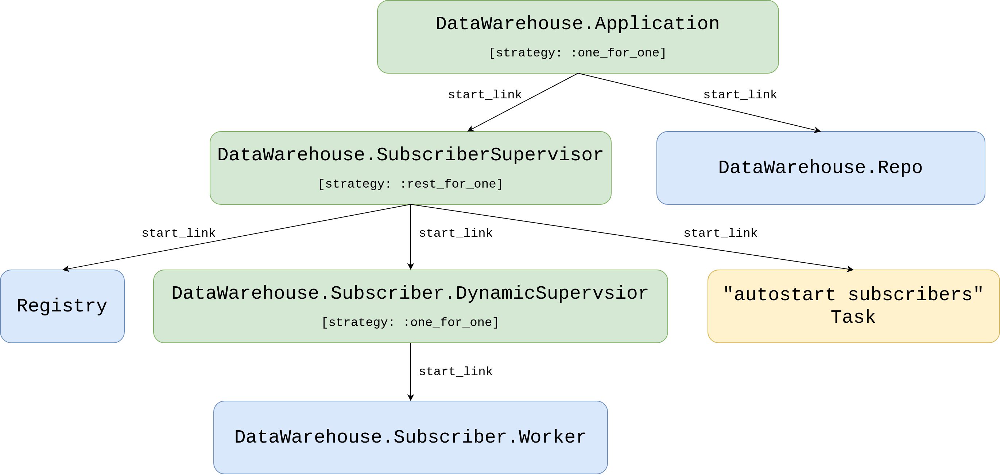

# 将交易事件和订单存入数据库 {#13-store-trade-events-and-orders}

在上一章中，我们通过一个基于宏的 `Core.ServiceSupervisor` 消除了重复的监督代码。
它确实能工作——但如果你觉得我们像是为了挂一幅画而抡起了大锤，你并不是一个人。
宏很强大，但它也会增加复杂性，让调试更难，也会让不熟悉元编程的开发者感到困惑。

好消息是：Elixir 针对这个问题提供了一个更简单的工具。
`Registry` 模块让我们可以用普通字符串而不是 atom 来跟踪动态进程，
而且它和 `DynamicSupervisor` 可以无缝配合。
到本章结束时，我们会得到一种非常干净的监督模式，足以让 `Core.ServiceSupervisor` 变得多余。

但首先，我们需要有数据可用。我们的交易机器人可以执行交易，但它有“健忘症”——
每次重启时，所有历史都会消失。这有两个问题：

1. **回测**：如果我们不存数据，就没法用历史数据评估策略。
2. **审计**：任何严肃的交易系统都需要记录发生了什么，以及何时发生。

在本章中，我们会创建一个 `data_warehouse` 应用，它会订阅交易事件和订单，
并把它们持久化到数据库中。与此同时，我们会发现 `Registry` 加上 `DynamicSupervisor`
能提供宏方案所能提供的一切——而复杂度只有一半。

## 目标
- 概述需求
- 在 umbrella 中创建一个新的 `data_warehouse` 应用
- 使用 Ecto 连接数据库
- 存储交易事件数据
- 存储订单数据
- 实现监督

## 需求概述

在下一章中，我们会针对历史数据测试策略——这个过程叫做回测，到了那一章我会详细解释。

在我们能够进行回测之前，需要先把交易事件和订单都存进数据库。

先说交易事件。
`streamer` 应用当然可以把来自 Binance 的交易事件存进自己的数据库，但如果我们还想引入另一种非流式的交易事件来源（比如平面文件或 HTTP 轮询）呢？
更好的做法是：让 `Streamer.Binance` 进程继续像现在这样负责流式发送这些交易事件，
然后我们创建一个新的应用，去订阅现有的 `TRADE_EVENTS:#{symbol}` topic，并把它们存到数据库里。

订单数据也类似。此时，`naive` 应用使用 Binance 模块来下单。
我们也可以把订单存进 `naive` 应用自己的数据库，但如果我们以后还想引入另一个交易策略呢？
为每个策略分别维护独立数据库，会让未来的报表、审计等工作变得更加复杂。

为了存储交易事件和订单数据，我们会在 umbrella 项目里创建一个名为 `data_warehouse` 的新应用。
它会订阅 `TRADE_EVENTS:#{symbol}` 流以及 `ORDERS:#{symbol}` 流，
把广播过来的数据转换成它自己的表示形式（结构体），再存入数据库。

交易事件已经通过 PubSub topic 广播了，而订单还没有。
我们需要修改 `Naive.Trader` 模块，在挂出买单和卖单时，把新的和更新后的订单广播到 `ORDERS:#{symbol}` topic。

在实现了一个基础 worker 用来把接收到的数据（交易事件和订单）存进数据库之后，
我们再来引入一个使用 [Elixir Registry](https://hexdocs.pm/elixir/master/Registry.html) 的监督树。
它会让我们不必再用唯一 atom 来注册每个 worker，而是能直接通过查找 PID 来完成关联。

## 在 umbrella 中创建一个新的 `data_warehouse` 应用

我们先在 umbrella 里创建一个新应用，叫做 `data_warehouse`：

```{r, engine = 'bash', eval = FALSE}
$ cd apps
$ mix new data_warehouse --sup
* creating README.md
* creating .formatter.exs
* creating .gitignore
* creating mix.exs
* creating lib
* creating lib/data_warehouse.ex
* creating lib/data_warehouse/application.ex
* creating test
* creating test/test_helper.exs
* creating test/data_warehouse_test.exs
...
```

## 使用 Ecto 连接数据库

现在我们可以像之前那样继续，修改 `mix.exs` 文件，把所需依赖（比如 `ecto`）加入 `deps`：

```{r, engine = 'elixir', eval = FALSE}
  # /apps/data_warehouse/mix.exs
  defp deps do
    [
      {:binance, "~> 1.0"},
      {:decimal, "~> 2.0"},
      {:ecto_sql, "~> 3.0"},
      {:ecto_enum, "~> 1.4"},
      {:phoenix_pubsub, "~> 2.0"},
      {:postgrex, ">= 0.0.0"},
      {:streamer, in_umbrella: true}
    ]
  end
```

另外，我们还加入了 `phoenix_pubsub`（用于订阅 PubSub topic）、`streamer` 应用（用于复用它的 `Streamer.Binance.TradeEvent` 结构体）、
`decimal` 模块（用于数值转换）以及 `binance` 包（用于匹配其结构体）。

现在我们可以回到终端安装新增依赖，并生成一个新的 `Ecto.Repo` 模块：

```{r, engine = 'bash', eval = FALSE}
$ mix deps.get
  ...
$ cd apps/data_warehouse 
$ mix ecto.gen.repo -r DataWarehouse.Repo
* creating lib/data_warehouse
* creating lib/data_warehouse/repo.ex
* updating ../../config/config.exs
```

在我们能够创建 migration 来建立表之前，需要先更新 `config/config.exs` 文件中自动生成的配置：

```{r, engine = 'elixir', eval = FALSE}
# /config/config.exs
...
config :data_warehouse, DataWarehouse.Repo,
  database: "data_warehouse", # <= update this line
  username: "postgres",       # <= update this line
  password: "postgres",       # <= update this line
  hostname: "localhost"
...
config :data_warehouse,            # <= add this line
  ecto_repos: [DataWarehouse.Repo] # <= add this line
```

并把 `DataWarehouse.Repo` 模块加入 `DataWarehouse.Application` 进程的 children 列表：

```{r, engine = 'elixir', eval = FALSE}
    # /apps/data_warehouse/lib/data_warehouse/application.ex
    ...
    children = [
      {DataWarehouse.Repo, []}
    ]
    ...
```

最后一步是运行 `mix ecto.create -r DataWarehouse.Repo` 来创建数据库。

这样 Ecto 的基础就完成了——接下来我们可以开始实现订单和交易事件的存储。


## 存储交易事件数据

要把交易事件存入数据库，第一步是创建一个表来保存这些数据。我们先创建 migration：

```{r, engine = 'elixir', eval = FALSE}
$ cd apps/data_warehouse
$ mix ecto.gen.migration create_trade_events
* creating priv/repo/migrations
* creating priv/repo/migrations/20210222224514_create_trade_events.exs
```

`Streamer.Binance.TradeEvent` 结构体会作为我们新 `trade_events` 表的列清单。

请注意，我们会把 `price` 和 `quantity` 存为 `:decimal`，而不是 `:string`，以便在 SQL 查询中做数学比较（比如 `WHERE price > 1000.5`）。
字符串列做的是字典序比较，比如 `where "9.0" > "10.0"`，那就会得到错误结果。
我们也会用 `:decimal` 而不是 `:float`，这样可以在金融计算中保持精确精度，避免浮点舍入误差。

下面是 migration 的完整实现：

```{r, engine = 'elixir', eval = FALSE}
# /apps/data_warehouse/priv/repo/migrations/20210222224514_create_trade_events.exs
defmodule DataWarehouse.Repo.Migrations.CreateTradeEvents do
  use Ecto.Migration

  def change do
    create table(:trade_events, primary_key: false) do
      add(:id, :uuid, primary_key: true)
      add(:event_type, :text)
      add(:event_time, :bigint)
      add(:symbol, :text)
      add(:trade_id, :bigint)
      add(:price, :decimal)
      add(:quantity, :decimal)
      add(:trade_time, :bigint)
      add(:buyer_market_maker, :bool)

      timestamps()
    end
  end
end
```

我们额外加入了 `id` 字段，方便识别每条交易事件，并加入了 timestamps 用于监控。

现在我们运行 migration，为我们创建一个新的 `trade_events` 表：

```{r, engine = 'elixir', eval = FALSE}
$ mix ecto.migrate
```

下一步是在 `apps/data_warehouse/lib/data_warehouse` 目录下创建一个新的 `schema` 目录。
在其中，我们需要创建一个新的 schema 文件 `trade_event.ex`。
我们可以直接把 migration 中的列拷贝到 schema 里：

```{r, engine = 'elixir', eval = FALSE}
# /apps/data_warehouse/lib/data_warehouse/schema/trade_event.ex
defmodule DataWarehouse.Schema.TradeEvent do
  use Ecto.Schema

  @primary_key {:id, :binary_id, autogenerate: true}

  schema "trade_events" do
    field(:event_type, :string)
    field(:event_time, :integer)
    field(:symbol, :string)
    field(:trade_id, :integer)
    field(:price, :decimal)
    field(:quantity, :decimal)
    field(:trade_time, :integer)
    field(:buyer_market_maker, :boolean)

    timestamps()
  end
end
```

此时我们应该已经可以对这张表执行 crud（create、read/select、update、delete）操作了。

现在，交易事件已经可以存进数据库了，我们接着来收集它们。
交易事件是通过这里的 `Streamer.Binance` 进程广播出来的：

```{r, engine = 'elixir', eval = FALSE}
    # /apps/streamer/lib/streamer/binance.ex
    ...
    Phoenix.PubSub.broadcast(
      Streamer.PubSub,
      "TRADE_EVENTS:#{trade_event.symbol}",
      trade_event
    )
    ...
```

我们会实现一个 `subscriber` 进程，它会被赋予一个 PubSub topic，并把进入的数据存入数据库。


先在 `apps/data_warehouse/lib/data_warehouse` 目录下创建一个名为 `subscriber` 的新文件夹，
并在其中添加一个 `worker.ex` 文件：

```{r, engine = 'elixir', eval = FALSE}
# /apps/data_warehouse/lib/data_warehouse/subscriber/worker.ex
defmodule DataWarehouse.Subscriber.Worker do
  use GenServer

  require Logger

  defmodule State do
    @enforce_keys [:topic]
    defstruct [:topic]
  end

  def start_link(topic) do
    GenServer.start_link(
      __MODULE__,
      topic,
      name: :"#{__MODULE__}-#{topic}"
    )
  end

  def init(topic) do
    {:ok,
     %State{
       topic: topic
     }}
  end
end
```

此时它只是一个标准的 `GenServer` 实现，状态结构体里只有一个键（`:topic`）。

**注意：** 这里我们使用的是基于 atom 的名字（`:"#{__MODULE__}-#{topic}"`）。
现在这样可以工作，但我们会在监督部分用基于 Registry 的命名方式替换掉它。

我们需要更新 `init/1` 函数，让它订阅 PubSub topic：

```{r, engine = 'elixir', eval = FALSE}
# /apps/data_warehouse/lib/data_warehouse/subscriber/worker.ex
  def init(topic) do
    Logger.info("DataWarehouse worker is subscribing to #{topic}")

    Phoenix.PubSub.subscribe(
      Streamer.PubSub,
      topic
    )
    ...
```


接下来，我们需要为收到的消息添加处理器：

```{r, engine = 'elixir', eval = FALSE}
# /apps/data_warehouse/lib/data_warehouse/subscriber/worker.ex
  def handle_info(%Streamer.Binance.TradeEvent{} = trade_event, state) do
    opts =
      trade_event
      |> Map.from_struct()
      |> Map.update!(:price, &Decimal.from_float/1)
      |> Map.update!(:quantity, &Decimal.new/1)

    struct!(DataWarehouse.Schema.TradeEvent, opts)
    |> DataWarehouse.Repo.insert()

    {:noreply, state}
  end
```

和 `Naive.Trader` 的情况一样，所有进入的消息都会触发一个 `handle_info/2` 回调，回调参数就是消息内容和 subscriber worker 当前状态。
我们只需要把收到的交易事件转成 map，再把这个 map 转成 `TradeEvent` 结构体，最后插入数据库即可。

要存储交易事件，所需代码就这些了。我们在交互式 shell 里测试一下：

```{r, engine = 'bash', eval = FALSE}
$ iex -S mix
...
iex(1)> Streamer.start_streaming("XRPUSDT")
00:48:30.147 [info]  Starting Elixir.Streamer.Binance worker for XRPUSDT
{:ok, #PID<0.395.0>}
iex(2)> DataWarehouse.Subscriber.Worker.start_link("TRADE_EVENTS:XRPUSDT")
00:49:48.204 [info]  DataWarehouse worker is subscribing to TRADE_EVENTS:XRPUSDT
{:ok, #PID<0.405.0>}
```

过几分钟后，我们可以用 `psql` 检查数据库：

```{r, engine = 'bash', eval = FALSE}
$ psql -Upostgres -h127.0.0.1
Password for user postgres:
...
postgres=# \c data_warehouse;
You are now connected to database "data_warehouse" as user "postgres".
data_warehouse=# \x
Expanded display is on.
data_warehouse=# SELECT * FROM trade_events;
-[ RECORD 1 ]------+-------------------------------------
id                 | f6eae686-946a-4e34-9c33-c7034c2cad5d
event_type         | trade
event_time         | 1614041388236
symbol             | XRPUSDT
trade_id           | 152765072
price              | 0.56554000
quantity           | 1199.10000000
trade_time         | 1614041388235
buyer_market_maker | f
inserted_at        | 2021-02-23 00:49:48
...
```

从上面的输出可以看出，交易事件已经开始存入数据库。

## 存储订单数据

和上面的交易事件数据一样，要存储订单数据，我们会通过新的 migration 创建一个 `orders` 表：

```{r, engine = 'elixir', eval = FALSE}
$ cd apps/data_warehouse
$ mix ecto.gen.migration create_orders
* creating priv/repo/migrations/20210222224522_create_orders.exs
```

这张表的列清单会直接复制自 Binance 交易所返回的 [`Binance.Order`](https://github.com/dvcrn/binance.ex/blob/master/lib/binance/order.ex) 结构体：

```{r, engine = 'elixir', eval = FALSE}
# /apps/data_warehouse/priv/repo/migrations/20210222224522_create_orders.exs
defmodule DataWarehouse.Repo.Migrations.CreateOrders do
  use Ecto.Migration

  def change do
    create table(:orders, primary_key: false) do
      add(:order_id, :bigint, primary_key: true)
      add(:client_order_id, :text)
      add(:symbol, :text)
      add(:price, :decimal)
      add(:original_quantity, :decimal)
      add(:executed_quantity, :decimal)
      add(:cummulative_quote_quantity, :decimal)
      add(:status, :text)
      add(:time_in_force, :text)
      add(:type, :text)
      add(:side, :text)
      add(:stop_price, :decimal)
      add(:iceberg_quantity, :decimal)
      add(:time, :bigint)
      add(:update_time, :bigint)

      timestamps()
    end
  end
end
```

我们把所有缩写名称，比如 `orig_qty`，都改成了完整名称，比如 `original_quantity`。


现在运行 migration，为我们创建新的 `orders` 表：

```{r, engine = 'bash', eval = FALSE}
$ mix ecto.migrate
```

我们可以把上面的字段列表复制出来，创建一个 schema 模块。
先在 `apps/data_warehouse/lib/data_warehouse/schema` 目录下创建一个名为 `order.ex` 的新文件：

```{r, engine = 'elixir', eval = FALSE}
# /apps/data_warehouse/lib/data_warehouse/schema/order.ex
defmodule DataWarehouse.Schema.Order do
  use Ecto.Schema

  @primary_key {:order_id, :integer, autogenerate: false}

  schema "orders" do
    field(:client_order_id, :string)
    field(:symbol, :string)
    field(:price, :decimal)
    field(:original_quantity, :decimal)
    field(:executed_quantity, :decimal)
    field(:cummulative_quote_quantity, :decimal)
    field(:status, :string)
    field(:time_in_force, :string)
    field(:type, :string)
    field(:side, :string)
    field(:stop_price, :decimal)
    field(:iceberg_quantity, :decimal)
    field(:time, :integer)
    field(:update_time, :integer)

    timestamps()
  end
end
```

现在我们可以为 `DataWarehouse.Subscriber.Worker` 增加一个处理器，它会把 `Binance.Order` 结构体转换成 `DataWarehouse.Schema.Order`，并把数据存进数据库：

```{r, engine = 'elixir', eval = FALSE}
# /apps/data_warehouse/lib/data_warehouse/subscriber/worker.ex
  def handle_info(%Binance.Order{} = order, state) do
    data =
      order
      |> Map.from_struct()
      |> Map.update!(:price, &Decimal.from_float/1)
      |> Map.update!(:stop_price, &Decimal.new/1)

    struct(DataWarehouse.Schema.Order, data)
    |> Map.merge(%{
      original_quantity: Decimal.new(order.orig_qty),
      executed_quantity: Decimal.new(order.executed_qty),
      cummulative_quote_quantity: Decimal.new(order.cummulative_quote_qty),
      iceberg_quantity: Decimal.new(order.iceberg_qty)
    })
    |> DataWarehouse.Repo.insert(
      on_conflict: :replace_all,
      conflict_target: :order_id
    )

    {:noreply, state}
  end
  ...
```

在上面的代码中，我们使用 `struct/2` 函数复制了匹配的字段，但两个结构体之间并非一一对应的其他字段不会被复制，
所以我们需要在第二步里用 `Map.merge/2` 把它们补上。
我们还使用了 `on_conflict: :replace_all` 选项，让 `insert/2` 的行为更像 `upsert/2`（这样就不用单独写插入和更新订单的逻辑了）。

有了这些之后，我们现在可以把广播出来的订单数据存进数据库了，不过目前还没有东西真正广播订单。

我们需要修改 `Naive.Trader` 模块，让它在挂出买单/卖单时广播 `Binance.Order`：

```{r, engine = 'elixir', eval = FALSE}
    # /apps/naive/lib/naive/trader.ex
    ...
  # inside placing initial buy order callback
    {:ok, %Binance.OrderResponse{} = order} =
      @binance_client.order_limit_buy(symbol, quantity, price, "GTC")

    :ok = broadcast_order(order)
    ...

  # inside buy order filled callback
  def handle_info(
        %TradeEvent{
          ...
        },
        %State{
          ...
        } ...
  ) ... do
    {:ok, %Binance.Order{} = current_buy_order} =
      @binance_client.get_order(
        symbol,
        timestamp,
        order_id
      )

    buy_order_response = convert_to_order_response(current_buy_order)
    :ok = broadcast_order(buy_order_response)
    ...
    {:ok, %Binance.OrderResponse{} = order} =
      @binance_client.order_limit_sell(symbol, quantity, sell_price, "GTC")

    :ok = broadcast_order(order)
    ...

  # inside sell order filled callback
  def handle_info(
        %TradeEvent{
          ...
        },
        %State{
          ...
        } ...
  ) ... do
    {:ok, %Binance.Order{} = current_sell_order} =
      @binance_client.get_order(
        symbol,
        timestamp,
        order_id
      )

    sell_order_response = convert_to_order_response(current_sell_order)
    :ok = broadcast_order(sell_order_response)
    ...
```

上面这四个地方发送的是 `Binance.OrderResponse` 结构体——而我们的 `broadcast_order/1` 函数需要把它们转换成 `Binance.Order` 结构体。
在 `Naive.Trader` 模块底部添加如下代码：

```{r, engine = 'elixir', eval = FALSE}
  # /apps/naive/lib/naive/trader.ex
  defp broadcast_order(%Binance.OrderResponse{} = response) do
    order =
      response
      |> convert_to_order()

    Phoenix.PubSub.broadcast(
      Streamer.PubSub,
      "ORDERS:#{order.symbol}",
      order
    )
  end

  defp convert_to_order(%Binance.OrderResponse{} = response) do
    data =
      response
      |> Map.from_struct()

    struct(Binance.Order, data)
    |> Map.merge(%{
      cummulative_quote_qty: "0.00000000",
      stop_price: "0.00000000",
      iceberg_qty: "0.00000000",
      is_working: true
    })
  end
```

由于 `DataWarehouse.Subscriber.Worker` 进程只接受广播出来的 `Binance.Order` 结构体，
我们先把传入的 `Binance.OrderResponse` 结构体转换为 `Binance.Order`，然后再把它广播到 PubSub topic。

和之前一样，转换逻辑使用了 `struct/2` 函数，但它也补上了 `Binance.OrderResponse` 中缺失的默认值，
因为后者比 `Binance.Order` 小得多。

现在我们就可以把订单存进数据库里了，下面可以检查一下：

```{r, engine = 'bash', eval = FALSE}
$ iex -S mix
...
iex(1)> DataWarehouse.Subscriber.Worker.start_link("ORDERS:XRPUSDT")
22:37:43.043 [info]  DataWarehouse worker is subscribing to ORDERS:XRPUSDT
{:ok, #PID<0.400.0>}
iex(2)> Naive.start_trading("XRPUSDT")
22:38:39.741 [info]  Starting Elixir.Naive.SymbolSupervisor worker for XRPUSDT
22:38:39.832 [info]  Starting new supervision tree to trade on XRPUSDT
{:ok, #PID<0.402.0>}
22:38:41.654 [info]  Initializing new trader(1614119921653) for XRPUSDT
iex(3)> Streamer.start_streaming("XRPUSDT")
22:39:23.786 [info]  Starting Elixir.Streamer.Binance worker for XRPUSDT
{:ok, #PID<0.412.0>}
22:39:27.187 [info]  The trader(1614119921653) is placing a BUY order for XRPUSDT @ 37.549,
quantity: 5.326
22:39:27.449 [info]  The trader(1614119921653) is placing a SELL order for XRPUSDT @ 37.578,
quantity: 5.326.
```

此时在 DataWarehouse 的数据库里，我们应该能看到订单：

```{r, engine = 'bash', eval = FALSE}
$ psql -Upostgres -h127.0.0.1
Password for user postgres: 
...
postgres=# \c data_warehouse;
You are now connected to database "data_warehouse" as user "postgres".
data_warehouse=# \x
Expanded display is on.
data_warehouse=# SELECT * FROM orders;
-[ RECORD 1 ]--------------+---------------------------------
order_id                   | 1
client_order_id            | C81E728D9D4C2F636F067F89CC14862C
symbol                     | XRPUSDT
price                      | 38.16
original_quantity          | 5.241
executed_quantity          | 0.00000000
cummulative_quote_quantity | 0.00000000
status                     | FILLED
time_in_force              | GTC
type                       | LIMIT
side                       | BUY
stop_price                 | 0.00000000
iceberg_quantity           | 0.00000000
time                       | 1614120906320
update_time                | 1614120906320
inserted_at                | 2021-02-23 22:55:10
updated_at                 | 2021-02-23 22:55:10
-[ RECORD 2 ]--------------+---------------------------------
order_id                   | 2
client_order_id            | ECCBC87E4B5CE2FE28308FD9F2A7BAF3
symbol                     | XRPUSDT
price                      | 38.19
original_quantity          | 5.241
executed_quantity          | 0.00000000
cummulative_quote_quantity | 0.00000000
status                     | NEW
time_in_force              | GTC
type                       | LIMIT
side                       | SELL
stop_price                 | 0.00000000
iceberg_quantity           | 0.00000000
time                       | 
update_time                | 
inserted_at                | 2021-02-23 22:55:10
updated_at                 | 2021-02-23 22:55:10
```

上面的第一条记录已经插入并更新，因为它的状态是 `FILLED`；
第二条还没有更新，因为它仍然是 `NEW` 状态——这说明 upsert 的技巧确实起作用了。

到这里，订单存储的实现就完成了。

此时我们可以手动启动 worker 来存储数据，但还没有容错能力。
如果某个 worker 崩溃了，数据流就会中断，而且没人会重启它。
让我们通过构建一个正确的监督树来解决这个问题——顺便，我们还会发现一种让基于宏的 `Core.ServiceSupervisor` 变得多余的模式。

## 实现监督

`data_warehouse` 应用的监督树会和 `naive`、`streamer` 应用里的类似，
但又有足够不同，不适合再使用 `Core.ServiceSupervisor` 这个抽象。

比如，我们的 schema 用的是 `topic` 列，而不是 `symbol`。我们当然可以修改 `Core.ServiceSupervisor` 让它接受一个可配置的列名，
但那是在为我们自己过度设计制造的问题增加复杂度。

还有一个更深层的问题：我们现在给每个 worker 都注册成一个 atom 名称。atom 不会被垃圾回收——一旦创建，它们就永远留在 VM 的 atom 表里。
如果 symbol 和 topic 足够多，我们最终可能会碰到 Erlang 的 atom 上限（默认大约 100 万个）。
这种情况在实践中不一定会发生，但它确实是一个代码异味，说明我们用错了工具。

更好的办法是把 [DynamicSupervisor](https://hexdocs.pm/elixir/master/DynamicSupervisor.html)
和 [Registry](https://hexdocs.pm/elixir/master/Registry.html) 组合起来。

`DynamicSupervisor` 会监督 `Subscriber.Worker`，而我们不再用 atom 注册它们，而是通过 `:via` 的 Elixir `Registry` 来启动。

我们会把在 `naive` 和 `streamer` 应用里实现过的所有功能都加进来。
我们会提供 start 和 stop 存储的函数，输入的是 PubSub topic；
同时也会把这些 topic 存到数据库里，这样存储功能就能自动启动。

### 创建 `subscriber_settings` 表

为了支持自动启动功能，我们需要创建一个新的 migration，用来创建 `subscriber_settings` 表：

```{r, engine = 'bash', eval = FALSE}
$ cd apps/data_warehouse
$ mix ecto.gen.migration create_subscriber_settings
* creating priv/repo/migrations/20210227230123_create_subscriber_settings.exs
```

此时我们可以把在 `streamer` 应用里创建 `settings` 表（包括 enum 和 index）的代码复制过来，并稍微修改以适配 `data_warehouse` 应用。
第一个重要变化（除了把命名空间从 `Streamer` 改为 `DataWarehouse`）是：
这里我们是按 topic 配置，而不是按 symbol，像 `naive` 和 `streamer` 那样。

```{r, engine = 'elixir', eval = FALSE}
# /apps/data_warehouse/priv/repo/migrations/20210227230123_create_subscriber_settings.exs
defmodule DataWarehouse.Repo.Migrations.CreateSubscriberSettings do
  use Ecto.Migration

  alias DataWarehouse.Schema.SubscriberStatusEnum

  def change do
    SubscriberStatusEnum.create_type()

    create table(:subscriber_settings, primary_key: false) do
      add(:id, :uuid, primary_key: true)
      add(:topic, :text, null: false)
      add(:status, SubscriberStatusEnum.type(), default: "off", null: false)
      
      timestamps()
    end

    create(unique_index(:subscriber_settings, [:topic]))
  end
end
```

schema 和 enum 几乎和 `streamer` 版本一样——把它们复制过来，并更新命名空间：

```{r, engine = 'bash', eval = FALSE}
$ cp apps/streamer/lib/streamer/schema/settings.ex \
apps/data_warehouse/lib/data_warehouse/schema/subscriber_settings.ex
$ cp apps/streamer/lib/streamer/schema/streaming_status_enum.ex \
apps/data_warehouse/lib/data_warehouse/schema/subscriber_status_enum.ex
```


复制之后，把 `symbol` 改成 `topic`，并更新 `DataWarehouse.Schema.SubscriberSettings` 中的表名：

```{r, engine = 'elixir', eval = FALSE}
# /apps/data_warehouse/lib/data_warehouse/schema/subscriber_settings.ex
defmodule DataWarehouse.Schema.SubscriberSettings do
  use Ecto.Schema

  alias DataWarehouse.Schema.SubscriberStatusEnum

  @primary_key {:id, :binary_id, autogenerate: true}

  schema "subscriber_settings" do
    field(:topic, :string)
    field(:status, SubscriberStatusEnum)

    timestamps()
  end
end
```

在 `apps/data_warehouse/lib/data_warehouse/schema/subscriber_status_enum.ex` 中，我们需要把引用从 `Streamer` 改成 `DataWarehouse`，
并把 `StreamingStatusEnum` 改成 `SubscriberStatusEnum`：

```{r, engine = 'elixir', eval = FALSE}
# /apps/data_warehouse/lib/data_warehouse/schema/subscriber_status_enum.ex
import EctoEnum

defenum(DataWarehouse.Schema.SubscriberStatusEnum, :subscriber_status, [:on, :off])
```

别忘了运行 migration：

```{r, engine = 'bash', eval = FALSE}
$ mix ecto.migrate
```

此时我们已经具备了对新表执行查询所需的所有部件。
在这里，我们可以顺便想一想 seeding 脚本。对于 `data_warehouse` 来说，
我们其实不需要预先提供这个脚本，因为我们事先并不知道会用到哪些 topic 名称。
所以这里不采用预先 seed 的方式，而是在调用 `start_storing/1` 或 `stop_storing/1` 时，用代码“upsert”（通过 `insert` 函数）对应的 settings。

### 使用 Registry 重新设计监督

现在我们可以专注于监督树。和 `naive`、`streamer` 应用一样，
我们还需要一个额外的监督层来管理自动启动的 `Task`——而对于 `data_warehouse`，还要加上 `Registry`。

完整的监督树会长这样：

```{r, fig.align="center", out.width="100%", out.height="40%", echo=FALSE}

```

整体看起来和我们在 `streamer`、`naive` 应用里创建的监督树非常相似，
但这里多了一个 `Registry`，它由 `SubscriberSupervisor` 进程负责监督。

思路是：在 `Worker` 模块的 `start_link/1` 里，我们会使用 `:via` 元组来注册 worker 进程。
GenServer 内部会利用 `Registry` 的 `register_name/2` 之类的函数，把进程按 `topic` 字符串注册起来。
这样我们就能通过这些 topic 字符串来取回对应 PID，而不必再把每个 worker 进程注册成一个 atom 名称。

和之前一样，`DynamicSupervisor` 仍然负责监督 `Worker` 进程，
它甚至不会知道我们用了 `Registry` 来维护 `topic => PID` 的关联。

这正是我们在第 5 章里提到的 atom 问题的回报。
我们不再为每个 symbol 创建 `:"Naive.SymbolSupervisor-XRPUSDT"` 这样的 atom，
而是直接使用普通字符串作为 Registry 的键。
没有 atom 表增长，也没有撞上 VM atom 上限的风险——只有干净、可回收的字符串。

更棒的是：这一整套模式完全不需要宏。

### 创建 `DataWarehouse.Subscriber.DynamicSupervisor` 模块

我们先在 `apps/data_warehouse/lib/data_warehouse/subscriber` 目录下创建一个名为 `dynamic_supervisor.ex` 的新文件，并放入默认的 dynamic supervisor 实现：

```{r, engine = 'elixir', eval = FALSE}
# /apps/data_warehouse/lib/data_warehouse/subscriber/dynamic_supervisor.ex
defmodule DataWarehouse.Subscriber.DynamicSupervisor do
  use DynamicSupervisor

  def start_link(_arg) do
    DynamicSupervisor.start_link(__MODULE__, [], name: __MODULE__)
  end

  def init(_arg) do
    DynamicSupervisor.init(strategy: :one_for_one)
  end
end
```

由于我们会把所有与自动启动、启动和停止相关的逻辑都放在这个模块里，
现在就可以先加上 alias、import 和 require：

```{r, engine = 'elixir', eval = FALSE}
# /apps/data_warehouse/lib/data_warehouse/subscriber/dynamic_supervisor.ex
  require Logger

  alias DataWarehouse.Repo
  alias DataWarehouse.Schema.SubscriberSettings
  alias DataWarehouse.Subscriber.Worker

  import Ecto.Query, only: [from: 2]

  @registry :subscriber_workers
```

另外，我们还添加了 `@registry` 模块属性，后面会用它来取回特定 topic 对应的 PID。

接下来可以实现 `autostart_workers/0`，它会和我们在 `streamer` 和 `naive` 应用中实现的版本非常相似：

```{r, engine = 'elixir', eval = FALSE}
  # /apps/data_warehouse/lib/data_warehouse/subscriber/dynamic_supervisor.ex
  ...
  def autostart_workers do
    Repo.all(
      from(s in SubscriberSettings,
        where: s.status == "on",
        select: s.topic
      )
    )
    |> Enum.map(&start_child/1)
  end

  defp start_child(args) do
    DynamicSupervisor.start_child(
      __MODULE__,
      {Worker, args}
    )
  end
```

可以看到，我们查询数据库获取的是 `topic` 列表（不是 symbol），然后对每个结果调用 `start_child/2`。

`start_worker/1` 才是 `Registry` 发挥作用的地方，因为我们不需要再检查某个 topic 是否已经有进程在运行——这个检查可以交给 `Registry`。

如果某个 topic 已经有进程在运行，它就只会返回一个以 `:error` 开头的元组：

```{r, engine = 'elixir', eval = FALSE}
  # /apps/data_warehouse/lib/data_warehouse/subscriber/dynamic_supervisor.ex
  ...
  def start_worker(topic) do
    Logger.info("Starting storing data from #{topic} topic")
    update_status(topic, "on")
    start_child(topic)
  end
  ...
  defp update_status(topic, status)
       when is_binary(topic) and is_binary(status) do
    %SubscriberSettings{
      topic: topic,
      status: status
    }
    |> Repo.insert(
      on_conflict: :replace_all,
      conflict_target: :topic
    )
  end
```

由于我们没有用默认设置去 seed 数据库，所以这里使用了和订单存储时一样的 upsert 模式。

这个模块最后一个函数是 `stop_worker/1`，它会使用私有的 `stop_child/1` 函数。
`stop_child/1` 展示了如何取出分配给传入 `topic` 的进程 PID：

```{r, engine = 'elixir', eval = FALSE}
  # /apps/data_warehouse/lib/data_warehouse/subscriber/dynamic_supervisor.ex
  ...
  def stop_worker(topic) do
    Logger.info("Stopping storing data from #{topic} topic")
    update_status(topic, "off")
    stop_child(topic)
  end
  ...
  defp stop_child(args) do
    case Registry.lookup(@registry, args) do
      [{pid, _}] -> DynamicSupervisor.terminate_child(__MODULE__, pid)
      _ -> Logger.warning("Unable to locate process assigned to #{inspect(args)}")
    end
  end
```

这就是 `DataWarehouse.Subscriber.DynamicSupervisor` 的完整实现——
它几乎和上一章基于宏的版本一样精简，但没有任何元编程。

### 使用 `:via` 注册 Worker 进程

上面的 `DynamicSupervisor` 模块假设 Worker 已经注册进 `Registry` 了——
为了做到这一点，我们需要更新 `DataWarehouse.Subscriber.Worker` 模块的 `start_link/1` 函数：

```{r, engine = 'elixir', eval = FALSE}
  # /apps/data_warehouse/lib/data_warehouse/subscriber/worker.ex
  ...
  def start_link(topic) do
    GenServer.start_link(
      __MODULE__,
      topic,
      name: via_tuple(topic)
    )
  end
  ...
  defp via_tuple(topic) do
    {:via, Registry, {:subscriber_workers, String.upcase(topic)}}
  end
  ...    
```

把 `:name` 选项传给 `GenServer.start_link/3`，就是在告诉它使用 `Registry` 模块来按 topic 名称注册进程。

### 创建一个新的监督层，管理 Registry、Task 和 DynamicSupervisor

我们已经有了最底层的模块——`Worker` 和 `DynamicSupervisor`——
现在该添加一个新的 `Supervisor`，让它启动 `Registry`、`DynamicSupervisor`，以及负责自动启动存储的 `Task`。
先在 `apps/data_warehouse/lib/data_warehouse` 目录下创建一个新文件 `subscriber_supervisor.ex`：

```{r, engine = 'elixir', eval = FALSE}
# /apps/data_warehouse/lib/data_warehouse/subscriber_supervisor.ex
defmodule DataWarehouse.SubscriberSupervisor do
  use Supervisor

  alias DataWarehouse.Subscriber.DynamicSupervisor

  @registry :subscriber_workers

  def start_link(_args) do
    Supervisor.start_link(__MODULE__, [], name: __MODULE__)
  end

  def init(_args) do
    children = [
      {Registry, [keys: :unique, name: @registry]},
      {DynamicSupervisor, []},
      {Task,
       fn ->
         DynamicSupervisor.autostart_workers()
       end}
    ]

    Supervisor.init(children, strategy: :rest_for_one)
  end
end
```

这里最重要的是，`Registry` 的名字必须和 `DynamicSupervisor` 以及 `Worker` 模块里定义的名字一致。

### 将 `SubscriberSupervisor` 连接到 `Application`

我们需要更新 `DataWarehouse.Application` 模块，让它启动新的 `DataWarehouse.SubscriberSupervisor` 进程，并且像其他应用一样，把自己按模块名注册（只是为了保持一致性）：

```{r, engine = 'elixir', eval = FALSE}
  # /apps/data_warehouse/lib/data_warehouse/application.ex
  ...
  def start(_type, _args) do
    children = [
      {DataWarehouse.Repo, []},
      {DataWarehouse.SubscriberSupervisor, []} # <= new module added
    ]

    opts = [strategy: :one_for_one, name: __MODULE__] # <= name updated
    Supervisor.start_link(children, opts)
  end
  ...
```

### 添加接口

最后一步，是给 `DataWarehouse` 应用增加一个开始和停止存储的接口：

```{r, engine = 'elixir', eval = FALSE}
  # /apps/data_warehouse/lib/data_warehouse.ex
  alias DataWarehouse.Subscriber.DynamicSupervisor

  def start_storing(stream, symbol) do
    to_topic(stream, symbol)
    |> DynamicSupervisor.start_worker()
  end

  def stop_storing(stream, symbol) do
    to_topic(stream, symbol)
    |> DynamicSupervisor.stop_worker()
  end

  defp to_topic(stream, symbol) do
    [stream, symbol]
    |> Enum.map(&String.upcase/1)
    |> Enum.join(":")
  end
```

在上面这些函数里，我们只是对传入参数做了一些大小写上的 sanity check，假定 topic 和 stream 都是大写的。

### 测试

上面的接口就是实现中的最后一步，现在可以测试一切是否按预期运行：

```{r, engine = 'bash', eval = FALSE}
$ iex -S mix
...
iex(1)> DataWarehouse.start_storing("TRADE_EVENTS", "XRPUSDT")
19:34:00.740 [info]  Starting storing data from TRADE_EVENTS:XRPUSDT topic
19:34:00.847 [info]  DataWarehouse worker is subscribing to TRADE_EVENTS:XRPUSDT
{:ok, #PID<0.429.0>}
iex(2)> DataWarehouse.start_storing("TRADE_EVENTS", "XRPUSDT")
19:34:04.753 [info]  Starting storing data from TRADE_EVENTS:XRPUSDT topic
{:error, {:already_started, #PID<0.459.0>}}
iex(3)> DataWarehouse.start_storing("ORDERS", "XRPUSDT")
19:34:09.386 [info]  Starting storing data from ORDERS:XRPUSDT topic
19:34:09.403 [info]  DataWarehouse worker is subscribing to ORDERS:XRPUSDT
{:ok, #PID<0.431.0>}
BREAK: (a)bort (A)bort with dump (c)ontinue (p)roc info (i)nfo
       (l)oaded (v)ersion (k)ill (D)b-tables (d)istribution
^C%
$ iex -S mix
...
19:35:30.058 [info]  DataWarehouse worker is subscribing to TRADE_EVENTS:XRPUSDT
19:35:30.062 [info]  DataWarehouse worker is subscribing to ORDERS:XRPUSDT
# autostart works ^^^
iex(1)> Naive.start_trading("XRPUSDT")
19:36:45.316 [info]  Starting Elixir.Naive.SymbolSupervisor worker for XRPUSDT
19:36:45.417 [info]  Starting new supervision tree to trade on XRPUSDT
{:ok, #PID<0.419.0>}
iex(3)> 
19:36:47.484 [info]  Initializing new trader(1615221407466) for XRPUSDT
iex(2)> Streamer.start_streaming("XRPUSDT")
16:37:39.660 [info]  Starting Elixir.Streamer.Binance worker for XRPUSDT
{:ok, #PID<0.428.0>}
...
iex(3)> DataWarehouse.stop_storing("trade_events", "XRPUSDT")
19:39:26.398 [info]  Stopping storing data from trade_events:XRPUSDT topic
:ok
iex(4)> DataWarehouse.stop_storing("trade_events", "XRPUSDT")
19:39:28.151 [info]  Stopping storing data from trade_events:XRPUSDT topic
19:39:28.160 [warn]  Unable to locate process assigned to "trade_events:XRPUSDT"
:ok
iex(5)> [{pid, nil}] = Registry.lookup(:subscriber_workers, "ORDERS:XRPUSDT")
[{#PID<0.417.0>, nil}]
iex(6)> Process.exit(pid, :crash)
true
16:43:40.812 [info]  DataWarehouse worker is subscribing to ORDERS:XRPUSDT
```

可以看到，即使是这样一个简单实现，也能处理 start、autostart 和 stop。
它还可以优雅地处理“启动已经在运行的 worker”以及“停止根本没有在运行的 worker”这两种情况。

作为一个挑战，你可以把 `naive` 和 `streamer` 应用也改成使用 `Registry`，并删除 `Core.ServiceSupervisor` 模块（以及 `core` 应用），因为上面的方案已经把它替代了——
这里有一个 [PR 链接](https://github.com/Cinderella-Man/hands-on-elixir-and-otp-cryptocurrency-trading-bot-source-code/pull/27)，里面总结了所需的修改。

**我们现在有了持久化存储和更清晰的监督模式。** 我们完成了这些：

- 创建了一个订阅 PubSub topic 并存储进入数据的 `data_warehouse` 应用
- 为交易事件和订单都实现了处理器
- 使用 `Registry` 搭配 `:via` 元组按 topic 跟踪 worker 进程——不需要 atom
- 构建了一个带自动启动能力的完整监督树

关键洞见是：`Registry` 解决了和我们宏方案相同的“动态识别进程”问题，
但不需要元编程。我们用普通字符串（比如 `"TRADE_EVENTS:XRPUSDT"`）来注册进程，
需要时再查找它们，让 Registry 负责所有 bookkeeping。
`DynamicSupervisor` 甚至都不知道我们在用 Registry——它只是照常监督子进程。

这个模式比 `Core.ServiceSupervisor` 简单得多，所以 `Core.ServiceSupervisor` 现在已经成了多余的负担。
如果你完成了把 `naive` 和 `streamer` 重构为使用 Registry 的挑战，你大概已经把它删掉了；如果还没有，我建议你试试看——上面的 PR 已经展示了所需的具体修改。

**那么，下一步是什么？**

随着交易事件流入数据库，我们终于有了做回测所需的原材料。
在下一章里，我们会构建一个 `Publisher` task，它会把数据库中的历史交易事件通过 PubSub 再次流式发送出去——本质上就是重放过去。
我们的 `Naive.Trader` 不会区分实时数据和历史数据，这意味着我们可以在不冒真钱风险的情况下，拿真实市场条件来测试策略。

这正是我们所有架构决策开始发挥作用的地方：从一开始就采用的 pub/sub 模式，让切换数据源变得非常简单。同样的接口，不同的生产者。

[Note] 请记得运行 `mix format`，保持代码整洁。

本章源码（包括上面的挑战）可以在本书的源码仓库中找到
（分支：
[chapter_13](https://github.com/Cinderella-Man/hands-on-elixir-and-otp-cryptocurrency-trading-bot-source-code/tree/chapter_13)).
