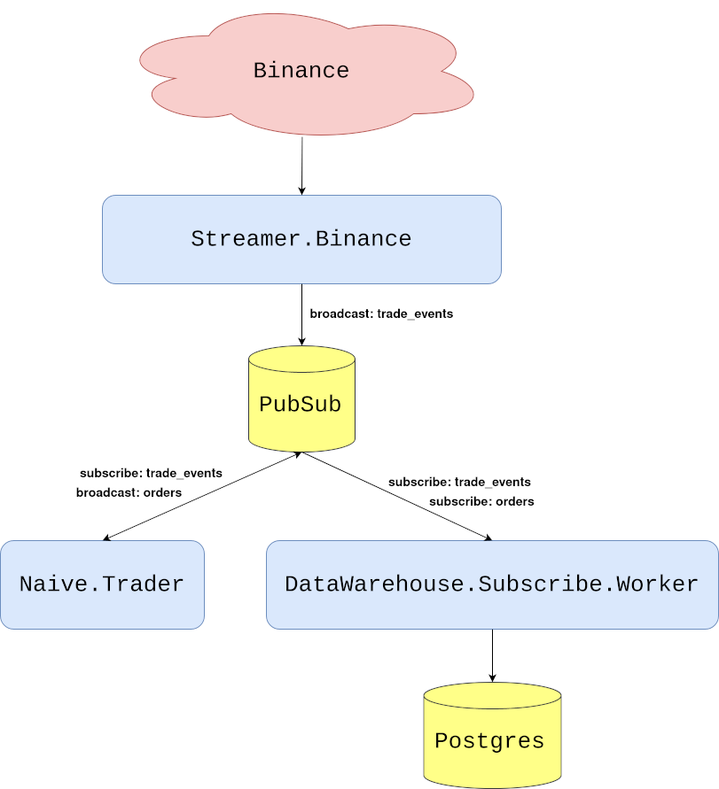
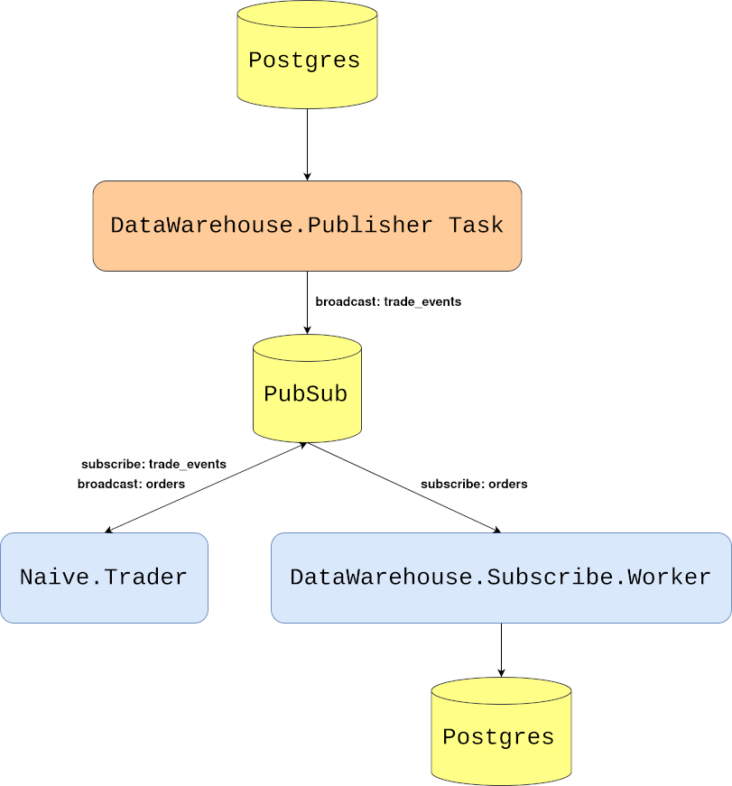

# Backtest trading strategy

In the last chapter, we built a `data_warehouse` application that stores trade events and orders in a database.
We also discovered that `Registry` plus `DynamicSupervisor` gives us a cleaner supervision pattern than macros.
But storing data is only useful if we do something with it.

Here's what we're going to do: replay historical trade events through our system as if they were happening live.
Our `Naive.Trader` won't know the difference - it will place buy and sell orders just like it would with real market data.
This technique is called backtesting, and it's how traders evaluate strategies before risking real money.

The beauty of our pub/sub architecture becomes clear here.
We built the system so that producers and consumers are decoupled - the trader doesn't care *who* broadcasts trade events,
only that they arrive on the `TRADE_EVENTS:#{symbol}` topic.
That means we can swap out the live `Streamer.Binance` process for a `Publisher` task that reads from our database,
and everything just works.

## Objectives
- overview of requirements
- implement the Publisher task
- test the backtesting

## Overview of requirements

Before diving into implementation, let's visualize the current data flow through our system.

At this moment we are receiving trade events from Binance through WebSocket.
The `Streamer.Binance` process is handling those messages by parsing them from JSON string to map,
then converting them to structs and broadcasting them to the `TRADE_EVENTS:#{symbol}` PubSub topic.
The `Naive.Trader` subscribes to the `TRADE_EVENTS:#{symbol}` topic and takes decisions based on incoming data.
As it places buy and sell orders it broadcasts them to the `ORDERS:#{symbol}` PubSub topic.
The `DataWarehouse.Subscriber.Worker` processes subscribe to both trade events and orders topics and store incoming data inside the database.

We can visualize this flow like this:

```{r, fig.align="center", out.width="100%", out.height="60%", echo=FALSE}

```

To backtest, we substitute the `Streamer.Binance` process with a `Task` that streams trade events from the database
to the same `TRADE_EVENTS:#{symbol}` topic:

```{r, fig.align="center", out.width="100%", out.height="60%", echo=FALSE}

```

## Implement the Publisher task

We'll start by creating a new file called `publisher.ex` inside the
`apps/data_warehouse/lib/data_warehouse` directory with the basic `Task` behavior:

```{r, engine = 'elixir', eval = FALSE}
# /apps/data_warehouse/lib/data_warehouse/publisher.ex
defmodule DataWarehouse.Publisher do
  use Task

  def start_link(arg) do
    Task.start_link(__MODULE__, :run, [arg])
  end

  def run(arg) do
    # ...
  end
end
```

To be able to query the database we will import `Ecto` and require `Logger` for logging:

```{r, engine = 'elixir', eval = FALSE}
  # /apps/data_warehouse/lib/data_warehouse/publisher.ex
  ...
  import Ecto.Query, only: [from: 2]

  require Logger
  ...
```

We can now modify the `run/1` function to expect specific `type`, `symbol`, `from`, `to` and `interval`:

```{r, engine = 'elixir', eval = FALSE}
  # /apps/data_warehouse/lib/data_warehouse/publisher.ex  
  ...
  def run(%{
        type: :trade_events,
        symbol: symbol,
        from: from,
        to: to,
        interval: interval
      }) do
    ...  
```

The `interval` parameter controls the delay (in milliseconds) between broadcasting each event -
this prevents overwhelming the system and simulates the pace of real market data.

Inside the body of the `run/1` function, first, we will convert `from` and `to` Unix timestamps by using private helper functions
as well as make sure that the passed symbol is uppercase:

```{r, engine = 'elixir', eval = FALSE}
  # /apps/data_warehouse/lib/data_warehouse/publisher.ex  
  ...
  def run(%{
        ...
      }) do
    symbol = String.upcase(symbol)

    from_ts =
      "#{from}T00:00:00.000Z"
      |> convert_to_ms()

    to_ts =
      "#{to}T23:59:59.000Z"
      |> convert_to_ms()
  end
  ...
  defp convert_to_ms(iso8601DateString) do
    iso8601DateString
    |> NaiveDateTime.from_iso8601!()
    |> DateTime.from_naive!("Etc/UTC")
    |> DateTime.to_unix()
    |> Kernel.*(1000)
  end
```

Next, we will select data from the database but because of possibly hundreds of thousands of rows being selected and
because we are broadcasting them to PubSub with a delay between each, it could take a substantial amount of time to `broadcast` all of them.
Instead of selecting data and storing all of it in memory, we will use `Repo.stream/1` to keep broadcasting on the go.
Additionally, we will add `index` to the data to be able to log info messages every 10k messages.
The last thing that we need to define will be the timeout value - the default value is 5 seconds and we will change it to `:infinity`:

```{r, engine = 'elixir', eval = FALSE}
  # /apps/data_warehouse/lib/data_warehouse/publisher.ex
  def run(%{
        ...
      }) do
    ...
    DataWarehouse.Repo.transaction(
      fn ->
        from(te in DataWarehouse.Schema.TradeEvent,
          where:
            te.symbol == ^symbol and
              te.trade_time >= ^from_ts and
              te.trade_time < ^to_ts,
          order_by: te.trade_time
        )
        |> DataWarehouse.Repo.stream()
        |> Enum.with_index()
        |> Enum.map(fn {row, index} ->
          :timer.sleep(interval)

          if rem(index, 10_000) == 0 do
            Logger.info("Publisher broadcasted #{index} events")
          end

          publish_trade_event(row)
        end)
      end,
      timeout: :infinity
    )

    Logger.info("Publisher finished streaming trade events")
  end
```

Finally, the above code uses the `publish_trade_event/1` helper function which converts DataWarehouse's TradeEvent
to the Streamer's TradeEvent to broadcast the same structs as the `streamer` application:

```{r, engine = 'elixir', eval = FALSE}
  # /apps/data_warehouse/lib/data_warehouse/publisher.ex
  ...
  defp publish_trade_event(%DataWarehouse.Schema.TradeEvent{} = trade_event) do
    new_trade_event =
      trade_event
      |> Map.from_struct()
      |> Map.update!(:price, &Decimal.to_float/1)
      |> Map.update!(:quantity, &Decimal.to_string/1)
      |> then(&struct(Streamer.Binance.TradeEvent, &1))

    Phoenix.PubSub.broadcast(
      Streamer.PubSub,
      "TRADE_EVENTS:#{trade_event.symbol}",
      new_trade_event
    )
  end
```

We also need to keep the interface tidy, so we'll add `publish_data` to the `DataWarehouse` module:

```{r, engine = 'elixir', eval = FALSE}
  # /apps/data_warehouse/lib/data_warehouse.ex
...
  def publish_data(args) do
    DataWarehouse.Publisher.start_link(args)
  end
...
```

This finishes our implementation - we should be able to stream trade events from the database to the PubSub using the above Task which we will do below.

## Test the backtesting

First, let's clean our database of any stored trade events and orders as well as disable all streaming/trading/data warehousing:

```{r, engine = 'bash', eval = FALSE}
$ PGPASSWORD=postgres psql -Upostgres -hlocalhost <<EOF
\c streamer
UPDATE settings SET status='off';
\c naive
UPDATE settings SET status='off';
\c data_warehouse
UPDATE subscriber_settings SET status='off';
DELETE FROM orders;
DELETE FROM trade_events;
EOF
```

For consistency and ease of testing, I've prepared a compressed file of trade events for XRPUSDT(2019-06-03).
We can download that file from GitHub using `wget`:

```{r, engine = 'bash', eval = FALSE}
$ cd /tmp
$ wget https://github.com/Cinderella-Man/binance-trade-events/\
raw/master/XRPUSDT/XRPUSDT-2019-06-03.csv.gz
```

We can now uncompress the archive and load those trade events into our database:

```{r, engine = 'bash', eval = FALSE}
$ gunzip XRPUSDT-2019-06-03.csv.gz
$ awk -F';' 'BEGIN {OFS=";"} {print $1,$2,$3,$4,$5,$6,$7,$10,$11,$12,$13}' \
/tmp/XRPUSDT-2019-06-03.csv | \
PGPASSWORD=postgres psql -Upostgres -h localhost -ddata_warehouse \
-c "\COPY trade_events FROM STDIN WITH (FORMAT csv, delimiter ';');"
COPY 206115
```

The number after the word `COPY` in the response indicates the number of rows that got copied into the database.

We can now start a new iex session where we will start trading(the `naive` application)
as well as storing orders(the `data_warehouse` application) and instead of starting the `Streamer.Binance` worker
we will start the `DataWarehouse.Publisher` task with arguments matching the imported day and symbol:

```{r, engine = 'bash', eval = FALSE}
$ iex -S mix
...
iex(1)> DataWarehouse.start_storing("ORDERS", "XRPUSDT")      
19:17:59.596 [info]  Starting storing data from ORDERS:XRPUSDT topic
19:17:59.632 [info]  DataWarehouse worker is subscribing to ORDERS:XRPUSDT
{:ok, #PID<0.417.0>}
iex(2)> Naive.start_trading("XRPUSDT")
19:18:16.293 [info]  Starting Elixir.Naive.SymbolSupervisor worker for XRPUSDT
19:18:16.332 [info]  Starting new supervision tree to trade on XRPUSDT
{:ok, #PID<0.419.0>}
19:18:18.327 [info]  Initializing new trader(1615288698325) for XRPUSDT
iex(3)> DataWarehouse.publish_data(%{
  type: :trade_events,
  symbol: "XRPUSDT",
  from: "2019-06-02",
  to: "2019-06-04",
  interval: 5
})
{:ok, #PID<0.428.0>}
19:19:07.532 [info]  Publisher broadcasted 0 events
19:19:07.534 [info]  The trader(1615288698325) is placing a BUY order for
XRPUSDT @ 0.44391, quantity: 450.5
19:19:07.749 [info]  The trader(1615288698325) is placing a SELL order for
XRPUSDT @ 0.44426, quantity: 450.5.
...
19:20:07.568 [info]  Publisher broadcasted 10000 events
...
19:21:07.571 [info]  Publisher broadcasted 20000 events
19:22:07.576 [info]  Publisher broadcasted 30000 events
...
19:39:07.875 [info]  Publisher broadcasted 200000 events
19:39:44.576 [info]  Publisher finished streaming trade events
```

From the above log, we can see that it took about 20 minutes to run 206k records through the system.
Most of that time (17+ minutes) was the 5ms sleep between each event - the actual processing is much faster.

After streaming finishes, we can check the orders table to see how many trades we made:

```{r, engine = 'bash', eval = FALSE}
$ PGPASSWORD=postgres psql -Upostgres -hlocalhost \
-ddata_warehouse -c "SELECT COUNT(*) FROM orders;"
 count 
-------
   382
(1 row)
```

By looking at the orders we can figure out some performance metrics, but manually querying the database after every backtest isn't practical.
We'll address performance reporting in future chapters.

**We now have a working backtesting system.** Here's what we achieved:

- Created a `Publisher` task that streams historical trade events from the database
- Used `Repo.stream/1` to handle large datasets without loading everything into memory
- Ran 200K+ trade events through our strategy and generated hundreds of orders

The key insight is that our pub/sub architecture made this almost trivial.
We didn't need to modify the `Naive.Trader` at all - we just changed who's broadcasting to the `TRADE_EVENTS` topic.
The same decoupling that makes our system modular also makes it testable.

**So, What's Next?**

Speaking of testing - we've been manually verifying that things work by running iex sessions and checking database tables.
That's fine for exploration, but it doesn't scale. What happens when we refactor and accidentally break something?

In the next chapter, we'll implement proper end-to-end tests.
We'll broadcast carefully crafted trade events and assert that the right orders appear in the database.
Along the way, we'll clean up some technical debt - remember how we put PubSub and TradeEvent in the `streamer` app?
That decision is about to cause problems, and we'll fix it by introducing a `core` application.

[Note] Please remember to run `mix format` to keep things nice and tidy.

The source code for this chapter can be found in the book's source code repository
(branch:
[chapter_14](https://github.com/Cinderella-Man/hands-on-elixir-and-otp-cryptocurrency-trading-bot-source-code/tree/chapter_14)).
