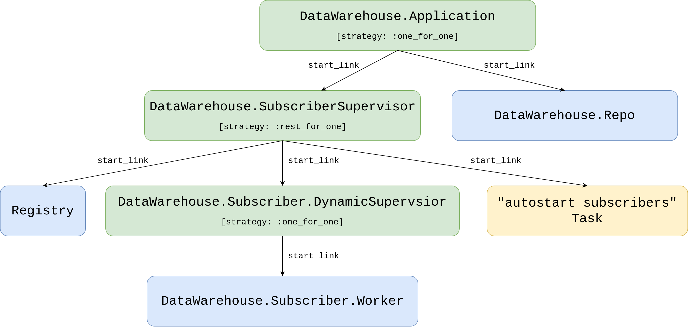

# Store trade events and orders inside the database

## Objectives
- overview of requirements
- create a new `data_warehouse` application in the umbrella
- connect to the database using Ecto
- store trade events' data
- store orders' data
- implement supervision

## Overview of requirements

In the next chapter, we will move on to testing our strategy against historical data(aka backtesting - I will explain that process in the next chapter). What we need to have in place before we will be able to do that is both trade events and orders stored in the database.

Starting with the trade events. The `streamer` application could store trade events from Binance inside its database but how would that work if we would like to introduce another source of non-streamed trade events(ie. flat files, HTTP polling). It would be better if the `Streamer.Binance` process would keep on streaming those trade events as it is and we would create a new application that would subscribe to the existing `TRADE_EVENTS:#{symbol}` topic and store them in the database.

A similar idea applies to the orders' data. At this moment the `naive` application uses the Binance module to place orders. We could store them inside the `naive` application's database but how would that work if we would like to introduce another trading strategy. Holding data in separate databases for each strategy would cause further complications in future reporting, auditing, etc.

To store trade events' and orders' data we will create a new application called `data_warehouse` inside our umbrella project. It will subscribe to a `TRADE_EVENTS:#{symbol}` stream as well as `ORDERS:#{symbol}` stream, convert broadcasted data to its own representations(structs) and store it inside the database.

Trade events are already broadcasted to the PubSub topic, orders on the other hand aren't. We will need to modify the `Naive.Trader` module to broadcast the new and updated orders to the `ORDERS:#{symbol}` topic.

After implementing the basic worker that will store the incoming data(trade events and orders) inside the database, we will look into adding a supervision tree utilizing [Elixir Registry](https://hexdocs.pm/elixir/master/Registry.html). It will allow us to skip registering every worker with a unique atom and will offer an easy lookup to fetch PIDs instead.

## Create a new `data_warehouse` application in the umbrella

Let's start by creating a new application called `data_warehouse` inside our umbrella:

```{r, engine = 'bash', eval = FALSE}
$ cd apps
$ mix new data_warehouse --sup
* creating README.md
* creating .formatter.exs
* creating .gitignore
* creating mix.exs
* creating lib
* creating lib/data_warehouse.ex
* creating lib/data_warehouse/application.ex
* creating test
* creating test/test_helper.exs
* creating test/data_warehouse_test.exs
...
```

## Connect to the database using Ecto

We can now follow similar steps as previously and add required dependencies (like the `ecto`) to its `deps` by modifying its `mix.exs` file:

```{r, engine = 'elixir', eval = FALSE}
  # /apps/data_warehouse/mix.exs
  defp deps do
    [
      {:binance, "~> 1.0"},
      {:ecto_sql, "~> 3.0"},
      {:ecto_enum, "~> 1.4"},
      {:phoenix_pubsub, "~> 2.0"},
      {:postgrex, ">= 0.0.0"},
      {:streamer, in_umbrella: true}
    ]
  end
```

Additionally, we added the `phoenix_pubsub`(to subscribe to the PubSub topic), the `streamer` application(to use its `Streamer.Binance.TradeEvent` struct) and the `binance` package(to pattern match it's structs).

We can now jump back to the terminal to install added dependencies and generate a new `Ecto.Repo` module:

```{r, engine = 'bash', eval = FALSE}
$ mix deps.get
  ...
$ cd apps/data_warehouse 
$ mix ecto.gen.repo -r DataWarehouse.Repo
* creating lib/data_warehouse
* creating lib/data_warehouse/repo.ex
* updating ../../config/config.exs
```

Before we will be able to create migrations that will create our tables we need to update the generated configuration inside the `config/config.exs` file:

```{r, engine = 'elixir', eval = FALSE}
# /config/config.exs
...
config :data_warehouse,            # <= added line
  ecto_repos: [DataWarehouse.Repo] # <= added line

config :data_warehouse, DataWarehouse.Repo,
  database: "data_warehouse",         # <= updated line
  username: "postgres",               # <= updated line
  password: "hedgehogSecretPassword", # <= updated line
  hostname: "localhost"
...
```

and add the `DataWarehouse.Repo` module to the children list of the `DataWarehouse.Application`'s process:

```{r, engine = 'elixir', eval = FALSE}
    # /apps/data_warehouse/lib/data_warehouse/application.ex
    ...
    children = [
      {DataWarehouse.Repo, []}
    ]
    ...
```

The last step will be to create a database by running `mix ecto.create -r DataWarehouse.Repo` command.

This ends up the setup of the `Ecto` - we can now move on to the implementation of storing the orders and the trade events.

\newpage

## Store trade events' data

The first step to store trade events inside the database will be to create a table that will hold our data. We will start by creating the migration:

```{r, engine = 'elixir', eval = FALSE}
$ cd apps/data_warehouse
$ mix ecto.gen.migration create_trade_events
* creating priv/repo/migrations
* creating priv/repo/migrations/20210222224514_create_trade_events.exs
```

The `Streamer.Binance.TradeEvent` struct will serve as a list of columns for our new `trade_events` table. Here's the full implementation of our migration:

```{r, engine = 'elixir', eval = FALSE}
# /apps/data_warehouse/priv/repo/migrations/20210222224514_create_trade_events.exs
defmodule DataWarehouse.Repo.Migrations.CreateTradeEvents do
  use Ecto.Migration

  def change do
    create table(:trade_events, primary_key: false) do
      add(:id, :uuid, primary_key: true)
      add(:event_type, :text)
      add(:event_time, :bigint)
      add(:symbol, :text)
      add(:trade_id, :integer)
      add(:price, :text)
      add(:quantity, :text)
      add(:buyer_order_id, :bigint)
      add(:seller_order_id, :bigint)
      add(:trade_time, :bigint)
      add(:buyer_market_maker, :bool)

      timestamps()
    end
  end
end
```

We added the additional `id` field to easily identify each trade event and our timestamps for monitoring.

Let's run the migration so it will create a new `trade_events` table for us:

```{r, engine = 'elixir', eval = FALSE}
$ mix ecto.migrate
```

\newpage

The next step will be to create a new directory called `schema` inside the                              
`apps/data_warehouse/lib/data_warehouse` directory. Inside it, we need to create a new schema file called `trade_event.ex`. We can copy across the same columns from the migration straight to schema:

```{r, engine = 'elixir', eval = FALSE}
# /apps/data_warehouse/lib/data_warehouse/schema/trade_event.ex
defmodule DataWarehouse.Schema.TradeEvent do
  use Ecto.Schema

  @primary_key {:id, :binary_id, autogenerate: true}

  schema "trade_events" do
    field(:event_type, :string)
    field(:event_time, :integer)
    field(:symbol, :string)
    field(:trade_id, :integer)
    field(:price, :string)
    field(:quantity, :string)
    field(:buyer_order_id, :integer)
    field(:seller_order_id, :integer)
    field(:trade_time, :integer)
    field(:buyer_market_maker, :boolean)

    timestamps()
  end
end
```

At this moment we should be able to execute crud(create, read[select], update, delete) operations over the table using the above struct.

Currently, we can already store the trade events' data inside the database so we can move on to collecting it. Trade events are getting broadcasted by the `Streamer.Binance` process here:

```{r, engine = 'elixir', eval = FALSE}
    # /apps/streamer/lib/streamer/binance.ex
    ...
    Phoenix.PubSub.broadcast(
      Streamer.PubSub,
      "TRADE_EVENTS:#{trade_event.symbol}",
      trade_event
    )
    ...
```

We will implement a `subscriber` process that will be given a PubSub topic and will store incoming data inside the database.

\newpage

Let's start by creating a new folder called `subscriber` inside the                              
`apps/data_warehouse/lib/data_warehouse` directory together with a new file called `worker.ex` inside it:

```{r, engine = 'elixir', eval = FALSE}
# /apps/data_warehouse/lib/data_warehouse/subscriber/worker.ex
defmodule DataWarehouse.Subscriber.Worker do
  use GenServer

  require Logger

  defmodule State do
    @enforce_keys [:topic]
    defstruct [:topic]
  end

  def start_link(topic) do
    GenServer.start_link(
      __MODULE__,
      topic,
      name: :"#{__MODULE__}-#{topic}"
    )
  end

  def init(topic) do
    {:ok,
     %State{
       topic: topic
     }}
  end
end
```

At this moment it's just a box standard implementation of the `GenServer` with a state struct containing a single key(`:topic`). We need to update the `init/1` function to subscribe to the PubSub topic:

```{r, engine = 'elixir', eval = FALSE}
# /apps/data_warehouse/lib/data_warehouse/subscriber/worker.ex
  def init(topic) do
    Logger.info("DataWarehouse worker is subscribing to #{topic}")

    Phoenix.PubSub.subscribe(
      Streamer.PubSub,
      topic
    )
    ...
```

\newpage

Next, we need to add a handler for received messages:

```{r, engine = 'elixir', eval = FALSE}
# /apps/data_warehouse/lib/data_warehouse/subscriber/worker.ex
  def handle_info(%Streamer.Binance.TradeEvent{} = trade_event, state) do
    opts =
      trade_event
      |> Map.from_struct()

    struct!(DataWarehouse.Schema.TradeEvent, opts)
    |> DataWarehouse.Repo.insert()

    {:noreply, state}
  end
```

As we did in the case of the `Naive.Trader`, all incoming messages trigger a `handle_info/2` callback with the contents of the message and the current state of the subscriber worker. We just convert that incoming trade event to a map and then that map to the `TradeEvent` struct that gets inserted into the database.

This finishes storing of trade events implementation which we can test by in the interactive shell by running:

```{r, engine = 'bash', eval = FALSE}
$ iex -S mix
...
iex(1)> Streamer.start_streaming("XRPUSDT")
00:48:30.147 [info]  Starting Elixir.Streamer.Binance worker for XRPUSDT
{:ok, #PID<0.395.0>}
iex(2)> DataWarehouse.Subscriber.Worker.start_link("TRADE_EVENTS:XRPUSDT")
00:49:48.204 [info]  DataWarehouse worker is subscribing to TRADE_EVENTS:XRPUSDT
{:ok, #PID<0.405.0>}
```

After a couple of minutes we can check the database using `psql`:

```{r, engine = 'bash', eval = FALSE}
$ psql -Upostgres -h127.0.0.1
Password for user postgres:
...
postgres=# \c data_warehouse;
You are now connected to database "data_warehouse" as user "postgres".
data_warehouse=# \x
Expanded display is on.
data_warehouse=# SELECT * FROM trade_events;
-[ RECORD 1 ]------+-------------------------------------
id                 | f6eae686-946a-4e34-9c33-c7034c2cad5d
event_type         | trade
event_time         | 1614041388236
symbol             | XRPUSDT
trade_id           | 152765072
price              | 0.56554000
quantity           | 1199.10000000
buyer_order_id     | 1762454848
seller_order_id    | 1762454775
trade_time         | 1614041388235
buyer_market_maker | f
inserted_at        | 2021-02-23 00:49:48
...
```

As we can see in the above output, trade events are now getting stored inside the database.

## Store orders' data

In the same fashion as with trade events' data above, to store orders data we will create an `orders` table inside a new migration:

```{r, engine = 'elixir', eval = FALSE}
$ cd apps/data_warehouse
$ mix ecto.gen.migration create_orders
* creating priv/repo/migrations/20210222224522_create_orders.exs
```

The list of columns for this table will be a copy of [`Binance.Order`](https://github.com/dvcrn/binance.ex/blob/master/lib/binance/order.ex) struct returned from the Binance exchange:

```{r, engine = 'elixir', eval = FALSE}
# /apps/data_warehouse/priv/repo/migrations/20210222224522_create_orders.exs
defmodule DataWarehouse.Repo.Migrations.CreateOrders do
  use Ecto.Migration

  def change do
    create table(:orders, primary_key: false) do
      add(:order_id, :bigint, primary_key: true)
      add(:client_order_id, :text)
      add(:symbol, :text)
      add(:price, :text)
      add(:original_quantity, :text)
      add(:executed_quantity, :text)
      add(:cummulative_quote_quantity, :text)
      add(:status, :text)
      add(:time_in_force, :text)
      add(:type, :text)
      add(:side, :text)
      add(:stop_price, :text)
      add(:iceberg_quantity, :text)
      add(:time, :bigint)
      add(:update_time, :bigint)

      timestamps()
    end
  end
end
```

We updated all of the shortened names like `orig_qty` to full names like `original_quantity`.


Let's run the migration so it will create a new `orders` table for us:

```{r, engine = 'bash', eval = FALSE}
$ mix ecto.migrate
```

We can copy the above fields list to create a schema module. First, let's create a new file called `order.ex` inside the `apps/data_warehouse/lib/data_warehouse/schema` directory:

```{r, engine = 'elixir', eval = FALSE}
# /apps/data_warehouse/lib/data_warehouse/schema/order.ex
defmodule DataWarehouse.Schema.Order do
  use Ecto.Schema

  @primary_key {:order_id, :integer, autogenerate: false}

  schema "orders" do
    field(:client_order_id, :string)
    field(:symbol, :string)
    field(:price, :string)
    field(:original_quantity, :string)
    field(:executed_quantity, :string)
    field(:cummulative_quote_quantity, :string)
    field(:status, :string)
    field(:time_in_force, :string)
    field(:type, :string)
    field(:side, :string)
    field(:stop_price, :string)
    field(:iceberg_quantity, :string)
    field(:time, :integer)
    field(:update_time, :integer)

    timestamps()
  end
end
```

\newpage

We can now add a handler to our `DataWarehouse.Subscriber.Worker` that will convert the `Binance.Order` struct to `DataWarehouse.Schema.Order` and store data inside the database:

```{r, engine = 'elixir', eval = FALSE}
# /apps/data_warehouse/lib/data_warehouse/subscriber/worker.ex
  def handle_info(%Binance.Order{} = order, state) do
    data =
      order
      |> Map.from_struct()

    struct(DataWarehouse.Schema.Order, data)
    |> Map.merge(%{
      original_quantity: order.orig_qty,
      executed_quantity: order.executed_qty,
      cummulative_quote_quantity: order.cummulative_quote_qty,
      iceberg_quantity: order.iceberg_qty
    })
    |> DataWarehouse.Repo.insert(
      on_conflict: :replace_all,
      conflict_target: :order_id
    )

    {:noreply, state}
  end
  ...
```

In the above code, we are copying the matching fields using the `struct/2` function but all other fields that aren't 1 to 1 between two structs won't be copied, so we need to merge them in the second step(using the `Map.merge/2` function). We are also using the `on_conflict: :replace_all` option to make the `insert/2` function act as it would be `upsert/2`(to avoid writing separate logic for inserting and updating the orders).

Having all of this in place we will now be able to store broadcasted orders' data in the database but there's nothing actually broadcasting them.

We need to modify the `Naive.Trader` module to broadcast the `Binance.Order` whenever it places buy/sell orders or fetches them again:

```{r, engine = 'elixir', eval = FALSE}
    # /apps/naive/lib/naive/trader.ex
    ...
    # inside placing initial buy order callback
    {:ok, %Binance.OrderResponse{} = order} =
      @binance_client.order_limit_buy(symbol, quantity, price, "GTC")

    :ok = broadcast_order(order)
    ...

    # inside buy order (partially) filled callback
    {:ok, %Binance.Order{} = current_buy_order} =
      @binance_client.get_order(
        symbol,
        timestamp,
        order_id
      )

    :ok = broadcast_order(current_buy_order)
    ...

        # inside the same callback in case of buy order filled
        {:ok, %Binance.OrderResponse{} = order} =
          @binance_client.order_limit_sell(symbol, quantity, sell_price, "GTC")
        
        :ok = broadcast_order(order)
    ...

    # inside sell order (partially) filled callback
    {:ok, %Binance.Order{} = current_sell_order} =
      @binance_client.get_order(
        symbol,
        timestamp,
        order_id
      )
    
    :ok = broadcast_order(current_sell_order)
    ...
```

Above 4 places send both the `Binance.OrderResponse` and the `Binance.Order` structs - our `broadcast_order/1` function needs to be able to handle them both. Add the following at the bottom of the `Naive.Trader` module:

```{r, engine = 'elixir', eval = FALSE}
  # /apps/naive/lib/naive/trader.ex
  defp broadcast_order(%Binance.OrderResponse{} = response) do
    response
    |> convert_to_order()
    |> broadcast_order()
  end

  defp broadcast_order(%Binance.Order{} = order) do
    Phoenix.PubSub.broadcast(
      Streamer.PubSub,
      "ORDERS:#{order.symbol}",
      order
    )
  end

  defp convert_to_order(%Binance.OrderResponse{} = response) do
    data =
      response
      |> Map.from_struct()

    struct(Binance.Order, data)
    |> Map.merge(%{
      cummulative_quote_qty: "0.00000000",
      stop_price: "0.00000000",
      iceberg_qty: "0.00000000",
      is_working: true
    })
  end
```

As `DataWarehouse.Subscriber.Worker` process expects only the `Binance.Order` structs to be broadcasted, we first check is it the `Binance.OrderResponse` struct and convert the passed value to the `Binance.Order` struct (if that's the case) and only then broadcast it to the PubSub topic.

The converting logic as previously uses the `struct/2` function but it also merges in default values that are missing from the much smaller `Binance.OrderResponse` struct(with comparison to the `Binance.Order`).

At this moment we will be able to store orders inside the database and we can check that by running:

```{r, engine = 'bash', eval = FALSE}
$ iex -S mix
...
iex(1)> DataWarehouse.Subscriber.Worker.start_link("ORDERS:NEOUSDT")
22:37:43.043 [info]  DataWarehouse worker is subscribing to ORDERS:XRPUSDT
{:ok, #PID<0.400.0>}
iex(2)> Naive.start_trading("NEOUSDT")
22:38:39.741 [info]  Starting Elixir.Naive.SymbolSupervisor worker for NEOUSDT
22:38:39.832 [info]  Starting new supervision tree to trade on NEOUSDT
{:ok, #PID<0.402.0>}
22:38:41.654 [info]  Initializing new trader(1614119921653) for NEOUSDT
iex(3)> Streamer.start_streaming("NEOUSDT")
22:39:23.786 [info]  Starting Elixir.Streamer.Binance worker for NEOUSDT
{:ok, #PID<0.412.0>}
22:39:27.187 [info]  The trader(1614119921653) is placing a BUY order for NEOUSDT @ 37.549,
quantity: 5.326
22:39:27.449 [info]  The trader(1614119921653) is placing a SELL order for NEOUSDT @ 37.578,
quantity: 5.326.
```

\newpage

At this moment inside the DataWarehouse's database we should see orders:

```{r, engine = 'bash', eval = FALSE}
$ psql -Upostgres -h127.0.0.1
Password for user postgres: 
...
postgres=# \c data_warehouse;
You are now connected to database "data_warehouse" as user "postgres".
data_warehouse=# \x
Expanded display is on.
data_warehouse=# SELECT * FROM orders;
-[ RECORD 1 ]--------------+---------------------------------
order_id                   | 1
client_order_id            | C81E728D9D4C2F636F067F89CC14862C
symbol                     | NEOUSDT
price                      | 38.16
original_quantity          | 5.241
executed_quantity          | 0.00000000
cummulative_quote_quantity | 0.00000000
status                     | FILLED
time_in_force              | GTC
type                       | LIMIT
side                       | BUY
stop_price                 | 0.00000000
iceberg_quantity           | 0.00000000
time                       | 1614120906320
update_time                | 1614120906320
inserted_at                | 2021-02-23 22:55:10
updated_at                 | 2021-02-23 22:55:10
-[ RECORD 2 ]--------------+---------------------------------
order_id                   | 2
client_order_id            | ECCBC87E4B5CE2FE28308FD9F2A7BAF3
symbol                     | NEOUSDT
price                      | 38.19
original_quantity          | 5.241
executed_quantity          | 0.00000000
cummulative_quote_quantity | 0.00000000
status                     | NEW
time_in_force              | GTC
type                       | LIMIT
side                       | SELL
stop_price                 | 0.00000000
iceberg_quantity           | 0.00000000
time                       | 
update_time                | 
inserted_at                | 2021-02-23 22:55:10
updated_at                 | 2021-02-23 22:55:10
```

The first record above got inserted and updated as its state is "FILLED", the second one wasn't updated yet as it's still in "NEW" state - that confirms that the upsert trick works.

That finishes the implementation of storing orders inside the database.

## Implement supervision

Currently, we have a `DataWarehouse.Subscriber.Worker` process that will take care of storing data into the database, but sadly if anything will go wrong inside our worker and it will crash there's no supervision in place to restart it.

The supervision tree for the `data_warehouse` application will be similar to ones from the `naive` and `streamer` apps but different enough to *not* use the `Core.ServiceSupervisor` abstraction.

For example, it doesn't use the `symbol` column, it works based on the `topic` column. This would require changes to the `Core.ServiceSupervisor`'s functions like `update_status/4` or `fetch_symbols_to_start/2`, we could update them to accept column name but that would need to be passed through other functions. We can see that this is probably not the best approach and the further we will get the more complex it will become. The second issue would be that we are registering all processes with names and that can be problematic as the list of processes will start to grow(as we can imagine in the case of the `data_warehouse` application).

The better approach would be to mix the [DynamicSupervisor](https://hexdocs.pm/elixir/master/DynamicSupervisor.html) together with [Registry](https://hexdocs.pm/elixir/master/Registry.html).  

The `DynamicSupervisor` will supervise the `Subscriber.Worker`s and instead of keeping track of them by registering them using atoms we will start them `:via` Elixir `Registry`.

We will add all functionality that we implemented for `naive` and `streamer` applications. We will provide the functions to start and stop storing data on passed PubSub topics as well as store those topics inside the database so storing will be autostarted.

### Create `subscriber_settings` table

To provide autostarting function we need to create a new migration that will create the `subscriber_settings` table:

```{r, engine = 'bash', eval = FALSE}
$ cd apps/data_warehouse
$ mix ecto.gen.migration create_subscriber_settings
* creating priv/repo/migrations/20210227230123_create_subscriber_settings.exs
```

\newpage

At this moment we can copy the code to create the `settings` table(enum and index as well) from the `streamer` application and tweak it to fit the `data_warehouse` application. So the first important change (besides updating namespaces from `Streamer` to `DataWarehouse`) will be to make a note that we have a setting per topic - not per symbol as for the `naive` and `streamer` applications:

```{r, engine = 'elixir', eval = FALSE}
# /apps/data_warehouse/priv/repo/migrations/20210227230123_create_subscriber_settings.exs
defmodule DataWarehouse.Repo.Migrations.CreateSubscriberSettings do
  use Ecto.Migration

  alias DataWarehouse.Schema.SubscriberStatusEnum

  def change do
    SubscriberStatusEnum.create_type()

    create table(:subscriber_settings, primary_key: false) do
      add(:id, :uuid, primary_key: true)
      add(:topic, :text, null: false)
      add(:status, SubscriberStatusEnum.type(), default: "off", null: false)
      
      timestamps()
    end

    create(unique_index(:subscriber_settings, [:topic]))
  end
end
```

Both schema and enum will be almost identical to the ones from the `streamer` application - we can simply copy those files and apply basic tweaks like updating the namespace:

```{r, engine = 'bash', eval = FALSE}
$ cp apps/streamer/lib/streamer/schema/settings.ex \
apps/data_warehouse/lib/data_warehouse/schema/subscriber_settings.ex
$ cp apps/streamer/lib/streamer/schema/streaming_status_enum.ex \
apps/data_warehouse/lib/data_warehouse/schema/subscriber_status_enum.ex
```

Remember about updating the `symbol` column to `topic` as well as table name inside the

`DataWarehouse.Schema.SubscriberSettings`:

```{r, engine = 'elixir', eval = FALSE}
# /apps/data_warehouse/lib/data_warehouse/schema/subscriber_settings.ex
defmodule DataWarehouse.Schema.SubscriberSettings do
  use Ecto.Schema

  alias DataWarehouse.Schema.SubscriberStatusEnum

  @primary_key {:id, :binary_id, autogenerate: true}

  schema "subscriber_settings" do
    field(:topic, :string)
    field(:status, SubscriberStatusEnum)

    timestamps()
  end
end
```

Inside `apps/data_warehouse/lib/data_warehouse/schema/subscriber_status_enum.ex` we need to swap references of `Streamer` to `DataWarehouse` and references of `StreamingStatusEnum` to `SubscriberStatusEnum`:

```{r, engine = 'elixir', eval = FALSE}
# /apps/data_warehouse/lib/data_warehouse/schema/subscriber_status_enum.ex
import EctoEnum

defenum(DataWarehouse.Schema.SubscriberStatusEnum, :subscriber_status, [:on, :off])
```

Don't forget to run the migration:

```{r, engine = 'bash', eval = FALSE}
$ mix ecto.migrate
```

At this moment we have all pieces in place to execute queries on our new table. In this place, we can think about the seeding script. For the `data_warehouse` specifically, we won't need to provide that script as we don't know in advance what topic names we will use. Instead of seeding settings in advance, our code will "upsert"(using `insert` function) settings when `start_storing/1` or `stop_storing/1` are called.

### Redesign supervision using Registry

We can now focus on drafting a supervision tree for the `data_warehouse` application. At this moment we have only the `DataWarehouse.Subscriber.Worker` and the `DataWarehouse.Application` modules.

As it was with the case of `naive` and `streamer` applications, we will need an additional level of supervision to cater for "autostarting" `Task` as well as, in the case of the `data_warehouse` application the `Registry`.

\newpage

The full supervision tree will look as follows:

```{r, fig.align="center", out.width="100%", out.height="40%", echo=FALSE}

```

Everything looks very similar to the supervision tree that we created in the `streamer` and the `naive` applications but there's an additional `Registry` that is supervised by the `SubscriberSupervisior` process.

The idea is that inside the `Worker` module's `start_link/1` we will register worker processes using [:via](https://hexdocs.pm/elixir/master/GenServer.html#module-name-registration) tuple. Internally, GenServer will utilize `Registry`'s functions like `register_name/2` to add process to the registry under the `topic` string. This way we will be able to retrieve PIDs assigned to topics using those topic strings instead of registering each worker process with an atom name.

Just as previously the `DynamicSupervisor` will be in charge of supervising the `Worker` processes and it won't be even aware that we are using the `Registry` to keep track of `topic => PID` association.

### Create the `DataWarehouse.Subscriber.DynamicSupervisor` module

Let's start by creating a new file called `dynamic_supervisor.ex` inside the                                  
`apps/data_warehouse/lib/data_warehouse/subscriber` directory and put default dynamic supervisor implementation inside:

```{r, engine = 'elixir', eval = FALSE}
# /apps/data_warehouse/lib/data_warehouse/subscriber/dynamic_supervisor.ex
defmodule DataWarehouse.Subscriber.DynamicSupervisor do
  use DynamicSupervisor

  def start_link(_arg) do
    DynamicSupervisor.start_link(__MODULE__, [], name: __MODULE__)
  end

  def init(_arg) do
    DynamicSupervisor.init(strategy: :one_for_one)
  end
end
```

As we will put all our logic related to autostarting, starting and stopping inside this module we can already add aliases, import and require:

```{r, engine = 'elixir', eval = FALSE}
# /apps/data_warehouse/lib/data_warehouse/subscriber/dynamic_supervisor.ex
  require Logger

  alias DataWarehouse.Repo
  alias DataWarehouse.Schema.SubscriberSettings
  alias DataWarehouse.Subscriber.Worker

  import Ecto.Query, only: [from: 2]

  @registry :subscriber_workers
```

Additionally, we added the `@registry` module attribute that we will use to retrieve PID for the specific topic.

We can move on to implementing `autostart_workers/0` which will look very similar to the ones that we implemented in the `streamer` and the `naive` applications:

```{r, engine = 'elixir', eval = FALSE}
  # /apps/data_warehouse/lib/data_warehouse/subscriber/dynamic_supervisor.ex
  ...
  def autostart_workers do
    Repo.all(
      from(s in SubscriberSettings,
        where: s.status == "on",
        select: s.topic
      )
    )
    |> Enum.map(&start_child/1)
  end

  defp start_child(args) do
    DynamicSupervisor.start_child(
      __MODULE__,
      {Worker, args}
    )
  end
```

We can see that we are querying the database for a list of `topic`s(not symbols) and we are calling `start_child/2` for each result.


The `start_worker/1` is where the `Registry` will shine as we won't need to check is there already a process running for that topic - we can leave that check to the `Registry`. If there's a process already running for that topic it will just return a tuple starting with `:error` atom:

```{r, engine = 'elixir', eval = FALSE}
  # /apps/data_warehouse/lib/data_warehouse/subscriber/dynamic_supervisor.ex
  ...
  def start_worker(topic) do
    Logger.info("Starting storing data from #{topic} topic")
    update_status(topic, "on")
    start_child(topic)
  end
  ...
  defp update_status(topic, status)
       when is_binary(topic) and is_binary(status) do
    %SubscriberSettings{
      topic: topic,
      status: status
    }
    |> Repo.insert(
      on_conflict: :replace_all,
      conflict_target: :topic
    )
  end
```

As we are not seeding the database with the default settings we will use the `insert/2` function with options(as previously) to make it work as it would be an "upsert" function.

Last function in this module will be `stop_worker/1` which uses private `stop_child/1` function. The `stop_child/1` function shows how to retrieve `PID` of the process assigned to the passed `topic`:

```{r, engine = 'elixir', eval = FALSE}
  # /apps/data_warehouse/lib/data_warehouse/subscriber/dynamic_supervisor.ex
  ...
  def stop_worker(topic) do
    Logger.info("Stopping storing data from #{topic} topic")
    update_status(topic, "off")
    stop_child(topic)
  end
  ...
  defp stop_child(args) do
    case Registry.lookup(@registry, args) do
      [{pid, _}] -> DynamicSupervisor.terminate_child(__MODULE__, pid)
      _ -> Logger.warning("Unable to locate process assigned to #{inspect(args)}")
    end
  end
```

That is a full implementation of the `DataWarehouse.Subscriber.DynamicSupervisor` module and it's almost as slim as one from the last chapter where we leveraged macros to achieve that lightness. Using the `Registry` is the preferred way to manage a list of identifiable processes. We won't run into an issue of overusing the atoms(as they are not garbage collected, we could hit that limit sooner or later).


### Register Worker processes using :via

The above `DynamicSupervisor` module assumes that Workers are registered inside the `Registry` - to make this happen we will need to update the `start_link/1` function of the                   
`DataWarehouse.Subscriber.Worker` module:

```{r, engine = 'elixir', eval = FALSE}
  # /apps/data_warehouse/lib/data_warehouse/subscriber/worker.ex
  ...
  def start_link(topic) do
    GenServer.start_link(
      __MODULE__,
      topic,
      name: via_tuple(topic)
    )
  end
  ...
  defp via_tuple(topic) do
    {:via, Registry, {:subscriber_workers, topic}}
  end
  ...    
```

Passing the `:name` option to the `GenServer`'s `start_link/3` function we instruct it to utilize the `Registry` module to register processes under topic names.

### Create a new supervision level for Registry, Task and the DynamicSupervisor

We have the lowest level modules - the `Worker` and the `DynamicSupervisor` implemented - time to add a new `Supervisor` that will start the `Registry`, the `DynamicSupervisor`, and the autostart storing `Task`. First create a new file called `subscriber_supervisor.ex` inside the `apps/data_warehouse/lib/data_warehouse` directory:

```{r, engine = 'elixir', eval = FALSE}
# /apps/data_warehouse/lib/data_warehouse/subscriber_supervisor.ex
defmodule DataWarehouse.SubscriberSupervisor do
  use Supervisor

  alias DataWarehouse.Subscriber.DynamicSupervisor

  @registry :subscriber_workers

  def start_link(_args) do
    Supervisor.start_link(__MODULE__, [], name: __MODULE__)
  end

  def init(_args) do
    children = [
      {Registry, [keys: :unique, name: @registry]},
      {DynamicSupervisor, []},
      {Task,
       fn ->
         DynamicSupervisor.autostart_workers()
       end}
    ]

    Supervisor.init(children, strategy: :rest_for_one)
  end
end
```

The important part here will be to match the `Registry` name to the one defined inside the `DynamicSupervisor` and the `Worker` modules.

### Link the `SubscriberSupervisor` to the `Application`

We need to update the `DataWarehouse.Application` module to start our new                          
`DataWarehouse.SubscriberSupervisor` process as well as register itself under name matching to its module(just for consistency with other applications):

```{r, engine = 'elixir', eval = FALSE}
  # /apps/data_warehouse/lib/data_warehouse/application.ex
  ...
  def start(_type, _args) do
    children = [
      {DataWarehouse.Repo, []},
      {DataWarehouse.SubscriberSupervisor, []} # <= new module added
    ]

    # See https://hexdocs.pm/elixir/Supervisor.html
    # for other strategies and supported options
    opts = [strategy: :one_for_one, name: __MODULE__] # <= name updated
    Supervisor.start_link(children, opts)
  end
  ...
```

### Add interface

The final step will be to add an interface to the `DataWarehouse` application to start and stop storing:

```{r, engine = 'elixir', eval = FALSE}
  # /apps/data_warehouse/lib/data_warehouse.ex
  alias DataWarehouse.Subscriber.DynamicSupervisor

  def start_storing(stream, symbol) do
    to_topic(stream, symbol)
    |> DynamicSupervisor.start_worker()
  end

  def stop_storing(stream, symbol) do
    to_topic(stream, symbol)
    |> DynamicSupervisor.stop_worker()
  end

  defp to_topic(stream, symbol) do
    [stream, symbol]
    |> Enum.map(&String.upcase/1)
    |> Enum.join(":")
  end
```

Inside the above functions, we are just doing a couple of sanity checks on the case of the passed arguments assuming that both topics and stream are uppercase.

### Test

The interface above was the last step in our implementation, we can now test that all works as expected:

```{r, engine = 'bash', eval = FALSE}
$ iex -S mix
...
iex(1)> DataWarehouse.start_storing("TRADE_EVENTS", "NEOUSDT")
19:34:00.740 [info]  Starting storing data from TRADE_EVENTS:NEOUSDT topic
19:34:00.847 [info]  DataWarehouse worker is subscribing to TRADE_EVENTS:NEOUSDT
{:ok, #PID<0.429.0>}
iex(2)> DataWarehouse.start_storing("TRADE_EVENTS", "NEOUSDT")
19:34:04.753 [info]  Starting storing data from TRADE_EVENTS:NEOUSDT topic
{:error, {:already_started, #PID<0.459.0>}}
iex(3)> DataWarehouse.start_storing("ORDERS", "NEOUSDT")
19:34:09.386 [info]  Starting storing data from ORDERS:NEOUSDT topic
19:34:09.403 [info]  DataWarehouse worker is subscribing to ORDERS:NEOUSDT
{:ok, #PID<0.431.0>}
BREAK: (a)bort (A)bort with dump (c)ontinue (p)roc info (i)nfo
       (l)oaded (v)ersion (k)ill (D)b-tables (d)istribution
^C%
$ iex -S mix
...
19:35:30.058 [info]  DataWarehouse worker is subscribing to TRADE_EVENTS:NEOUSDT
19:35:30.062 [info]  DataWarehouse worker is subscribing to ORDERS:NEOUSDT
# autostart works ^^^
iex(1)> Naive.start_trading("NEOUSDT")
19:36:45.316 [info]  Starting Elixir.Naive.SymbolSupervisor worker for NEOUSDT
19:36:45.417 [info]  Starting new supervision tree to trade on NEOUSDT
{:ok, #PID<0.419.0>}
iex(3)> 
19:36:47.484 [info]  Initializing new trader(1615221407466) for NEOUSDT
iex(2)> Streamer.start_streaming("NEOUSDT")
16:37:39.660 [info]  Starting Elixir.Streamer.Binance worker for NEOUSDT
{:ok, #PID<0.428.0>}
...
iex(3)> DataWarehouse.stop_storing("trade_events", "NEOUSDT")
19:39:26.398 [info]  Stopping storing data from trade_events:NEOUSDT topic
:ok
iex(4)> DataWarehouse.stop_storing("trade_events", "NEOUSDT")
19:39:28.151 [info]  Stopping storing data from trade_events:NEOUSDT topic
19:39:28.160 [warn]  Unable to locate process assigned to "trade_events:NEOUSDT"
:ok
iex(5)> [{pid, nil}] = Registry.lookup(:subscriber_workers, "ORDERS:NEOUSDT")
[{#PID<0.417.0>, nil}]
iex(6)> Process.exit(pid, :crash)
true
16:43:40.812 [info]  DataWarehouse worker is subscribing to ORDERS:NEOUSDT
```

As we can see even this simple implementation handles starting, autostarting, and stopping. It also gracefully handles starting workers when one is already running as well as stopping when there none running.

As a challenge, you could update the `naive` and the `streamer` application to use the `Registry` and remove `Core.ServiceSupervisor` module as it was superseded by the above solution - here's the [link to PR](https://github.com/Cinderella-Man/hands-on-elixir-and-otp-cryptocurrency-trading-bot-source-code/pull/7)(pull request) that sums up the required changes.

[Note] Please remember to run the `mix format` to keep things nice and tidy.

The source code for this chapter can be found on [GitHub](https://github.com/Cinderella-Man/hands-on-elixir-and-otp-cryptocurrency-trading-bot-source-code/tree/chapter_14)
