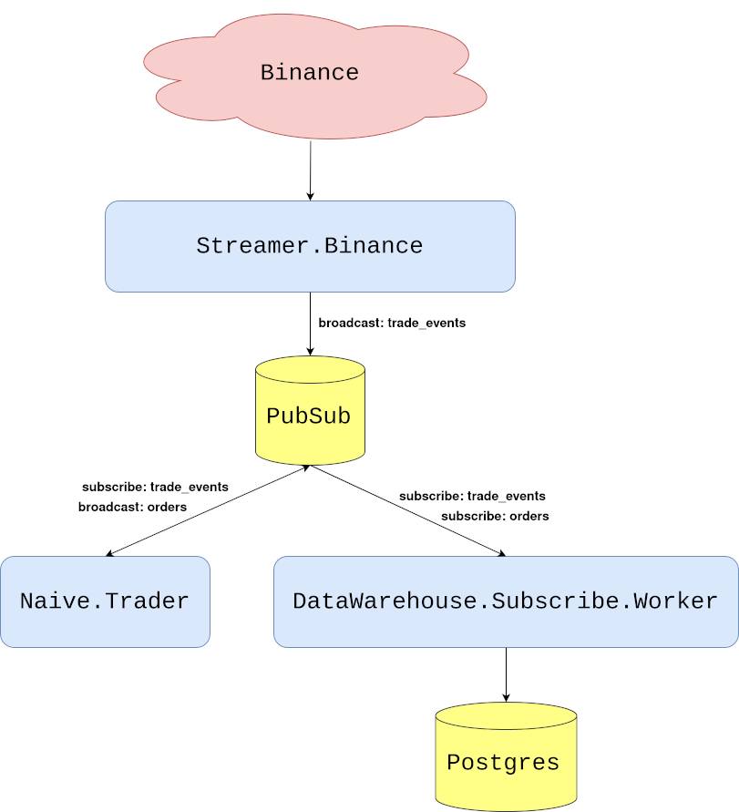
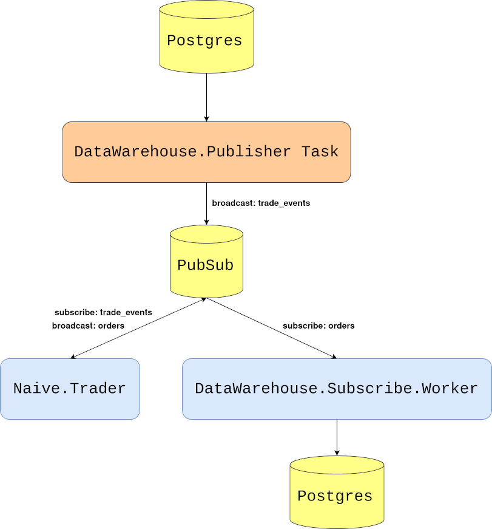

# Backtest trading strategy

## Objectives
- overview of requirements
- implement the storing task
- test the backtesting

## Overview of requirements

In the last chapter, we started storing trade events and orders in the database which will be crucial for backtesting, which we will focus on in this chapter.

Backtesting is a procedure of running historical data through the system and observing how our strategy would perform as if we would run it "in the past". Backtesting works on assumption that the market will behave in a similar fashion in the future as it was in the past.

\newpage

At this moment we are receiving the trade events from the Binance through WebSocket. The `Streamer.Binance` process is handling those messages by parsing them from JSON string to map, then converting them to structs and broadcasting them to the `TRADE_EVENTS:#{symbol}` PubSub topic. The `Naive.Trader` subscribes to the `TRADE_EVENTS:#{symbol}` topic and takes decisions based on incoming data. As it places buy and sell orders it broadcasts them to the `ORDERS:#{symbol}` PubSub topic. The `DataWarehouse.Subscriber.Worker` processes subscribe to both trade events and orders topics and store incoming data inside the database.

We can visualize this flow like that:

```{r, fig.align="center", out.width="100%", out.height="60%", echo=FALSE}

```

\newpage

To backtest we can substitute the `Streamer.Binance` process with a `Task` that will `stream` trade events' data from the database and broadcasts it to the `TRADE_EVENTS:#{symbol}` PubSub topic(the same topic as the `Streamer.Binance` process).

From the perspective of the `Naive.Trader` it *does not* make any difference who is broadcasting those trade events. This should be a clear indication of the value of publish/subscribe model that we implemented from the beginning. It allows us to swap producer and consumers freely to backtest our trading strategies:

```{r, fig.align="center", out.width="100%", out.height="60%", echo=FALSE}

```

\newpage

## Implement the storing task

We will start by creating a new file called `publisher.ex` inside the                        
`apps/data_warehouse/lib/data_warehouse` directory. We will start by implementing the basic `Task` behavior:

```{r, engine = 'elixir', eval = FALSE}
# /apps/data_warehouse/lib/data_warehouse/publisher.ex
defmodule DataWarehouse.Publisher do
  use Task

  def start_link(arg) do
    Task.start_link(__MODULE__, :run, [arg])
  end

  def run(arg) do
    # ...
  end
end
```

To be able to query the database we will import `Ecto` and require `Logger` for logging:

```{r, engine = 'elixir', eval = FALSE}
  # /apps/data_warehouse/lib/data_warehouse/publisher.ex
  ...
  import Ecto.Query, only: [from: 2]

  require Logger
  ...
```

We can now modify the `run/1` function to expect specific `type`, `symbol`, `from`, `to` and `interval`:

```{r, engine = 'elixir', eval = FALSE}
  # /apps/data_warehouse/lib/data_warehouse/publisher.ex  
  ...
  def run(%{
        type: :trade_events,
        symbol: symbol,
        from: from,
        to: to,
        interval: interval
      }) do
    ...  
```

\newpage

Inside the body of the `run/1` function, first, we will convert `from` and `to` Unix timestamps by using private helper functions as well as make sure that the passed symbol is uppercase:

```{r, engine = 'elixir', eval = FALSE}
  # /apps/data_warehouse/lib/data_warehouse/publisher.ex  
  ...
  def run(%{
        ...
      }) do
    symbol = String.upcase(symbol)

    from_ts =
      "#{from}T00:00:00.000Z"
      |> convert_to_ms()

    to_ts =
      "#{to}T23:59:59.000Z"
      |> convert_to_ms()
  end
  ...
  defp convert_to_ms(iso8601DateString) do
    iso8601DateString
    |> NaiveDateTime.from_iso8601!()
    |> DateTime.from_naive!("Etc/UTC")
    |> DateTime.to_unix()
    |> Kernel.*(1000)
  end
```

Next, we will select data from the database but because of possibly hundreds of thousands of rows being selected and because we are broadcasting them to the PubSub every x ms it could take a substantial amount of time to `broadcast` all of them. Instead of `select`ing data and storing all of it in the memory, we will use `Repo.stream/1` function to keep `broadcast`ing it on the go. Additionally, we will add `index` to the data to be able to log info messages every 10k messages. The last thing that we need to define will be the timeout value - the default value is 5 seconds and we will change it to `:infinity`:

```{r, engine = 'elixir', eval = FALSE}
  # /apps/data_warehouse/lib/data_warehouse/publisher.ex
  def run(%{
        ...
      }) do
    ...
    DataWarehouse.Repo.transaction(
      fn ->
        from(te in DataWarehouse.Schema.TradeEvent,
          where:
            te.symbol == ^symbol and
              te.trade_time >= ^from_ts and
              te.trade_time < ^to_ts,
          order_by: te.trade_time
        )
        |> DataWarehouse.Repo.stream()
        |> Enum.with_index()
        |> Enum.map(fn {row, index} ->
          :timer.sleep(interval)

          if rem(index, 10_000) == 0 do
            Logger.info("Publisher broadcasted #{index} events")
          end

          publish_trade_event(row)
        end)
      end,
      timeout: :infinity
    )

    Logger.info("Publisher finished streaming trade events")
  end
```

Finally, the above code uses the `publish_trade_event/1` helper function which converts DataWarehouse's TradeEvent to the Streamer's TradeEvent to broadcast the same structs as the `streamer` application:

```{r, engine = 'elixir', eval = FALSE}
  # /apps/data_warehouse/lib/data_warehouse/publisher.ex
  ...
  defp publish_trade_event(%DataWarehouse.Schema.TradeEvent{} = trade_event) do
    new_trade_event =
      struct(
        Streamer.Binance.TradeEvent,
        trade_event |> Map.to_list()
      )

    Phoenix.PubSub.broadcast(
      Streamer.PubSub,
      "TRADE_EVENTS:#{trade_event.symbol}",
      new_trade_event
    )
  end
```

\newpage

We also need to remember about keeping the interface tidy so we will add `publish_data` to the `DataWarehouse` module:

```{r, engine = 'elixir', eval = FALSE}
  # /apps/data_warehouse/lib/data_warehouse.ex
...
  def publish_data(args) do
    DataWarehouse.Publisher.start_link(args)
  end
...
```

This finishes our implementation - we should be able to stream trade events from the database to the PubSub using the above Task which we will do below.

## Test the backtesting

For consistency and ease of testing/use, I prepared an compressed single data of trade events for XRPUSDT(2019-06-03). We can download that file from GitHub using `wget`:

```{r, engine = 'bash', eval = FALSE}
$ cd /tmp
$ wget https://github.com/Cinderella-Man/binance-trade-events \
/raw/master/XRPUSDT/XRPUSDT-2019-06-03.csv.gz
```

We can now uncompress the archive and load those trade events into our database:

```{r, engine = 'bash', eval = FALSE}
$ gunzip XRPUSDT-2019-06-03.csv.gz
$ PGPASSWORD=hedgehogSecretPassword psql -Upostgres -h localhost -ddata_warehouse \
-c "\COPY trade_events FROM '/tmp/XRPUSDT-2019-06-03.csv' WITH (FORMAT csv, delimiter ';');"
COPY 206115
```

The number after the word `COPY` in the response indicates the number of rows that got copied into the database.

We can now give it a try and run full backtesting but first let's clean the orders table:

```{r, engine = 'bash', eval = FALSE}
$ psql -Upostgres -h127.0.0.1
Password for user postgres: 
...
postgres=# \c data_warehouse
You are now connected to database "data_warehouse" as user "postgres".
data_warehouse=# DELETE FROM orders;
DELETE ...
```

\newpage

We can now start a new iex session where we will start trading(the `naive` application) as well as storing orders(the `data_warehouse` application) and instead of starting the `Streamer.Binance` worker we will start the `DataWarehouse.Publisher` task with arguments matching the imported day and symbol:

```{r, engine = 'bash', eval = FALSE}
$ iex -S mix
...
iex(1)> DataWarehouse.start_storing("ORDERS", "XRPUSDT")      
19:17:59.596 [info]  Starting storing data from ORDERS:XRPUSDT topic
19:17:59.632 [info]  DataWarehouse worker is subscribing to ORDERS:XRPUSDT
{:ok, #PID<0.417.0>}
iex(2)> Naive.start_trading("XRPUSDT")
19:18:16.293 [info]  Starting Elixir.Naive.SymbolSupervisor worker for XRPUSDT
19:18:16.332 [info]  Starting new supervision tree to trade on XRPUSDT
{:ok, #PID<0.419.0>}
19:18:18.327 [info]  Initializing new trader(1615288698325) for XRPUSDT
iex(3)> DataWarehouse.publish_data(%{
  type: :trade_events,
  symbol: "XRPUSDT",
  from: "2019-06-02",
  to: "2019-06-04",
  interval: 5
})
{:ok, #PID<0.428.0>}
19:19:07.532 [info]  Publisher broadcasted 0 events
19:19:07.534 [info]  The trader(1615288698325) is placing a BUY order for
XRPUSDT @ 0.44391, quantity: 450.5
19:19:07.749 [info]  The trader(1615288698325) is placing a SELL order for
XRPUSDT @ 0.44426, quantity: 450.5.
...
19:20:07.568 [info]  Publisher broadcasted 10000 events
...
19:21:07.571 [info]  Publisher broadcasted 20000 events
19:22:07.576 [info]  Publisher broadcasted 30000 events
...
19:39:07.875 [info]  Publisher broadcasted 200000 events
19:39:44.576 [info]  Publisher finished streaming trade events
```

From the above log, we can see that it took about 20 minutes to run 206k records through the system(a lot of that time[17+ minutes] was indeed the 5ms `sleep`).

\newpage

After the streaming finished we can check out the orders table inside the database to figure out how many trades we made and what income have they generated.

```{r, engine = 'bash', eval = FALSE}
$ psql -Upostgres -h127.0.0.1    
Password for user postgres: 
...
postgres=# \c data_warehouse
You are now connected to database "data_warehouse" as user "postgres".
data_warehouse=# SELECT COUNT(*) FROM orders;
 count 
-------
   224
(1 row)
```

By looking at the orders we can figure out some performance metrics but that's less than perfect to get answers to simple questions like "what's the performance of my strategy?". We will address that and other concerns in future chapters.

[Note] Please remember to run the `mix format` to keep things nice and tidy.

Source code for this chapter can be found at [Github](https://github.com/Cinderella-Man/hands-on-elixir-and-otp-cryptocurrency-trading-bot-source-code/tree/chapter_15)
