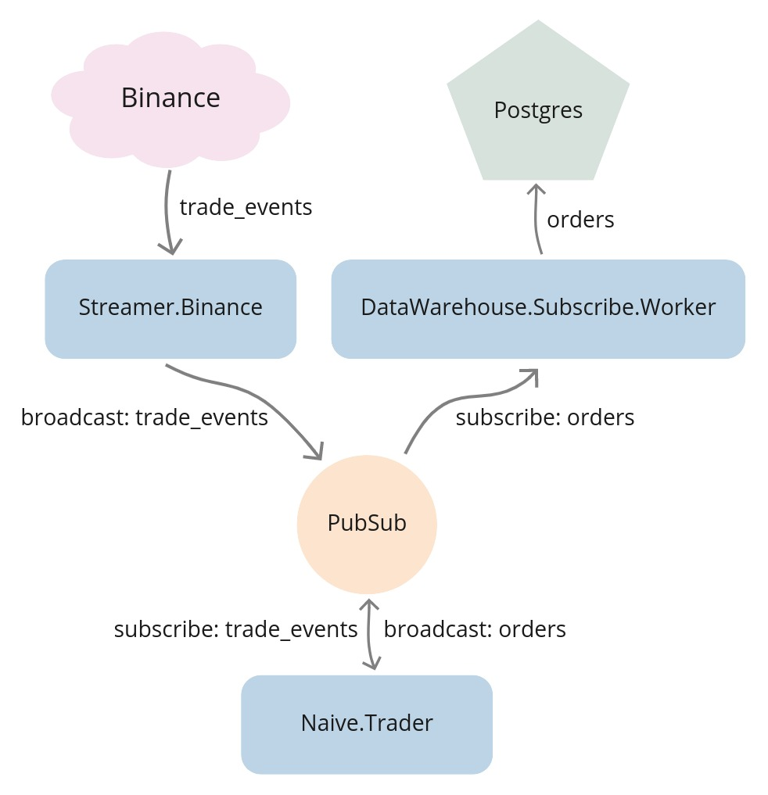
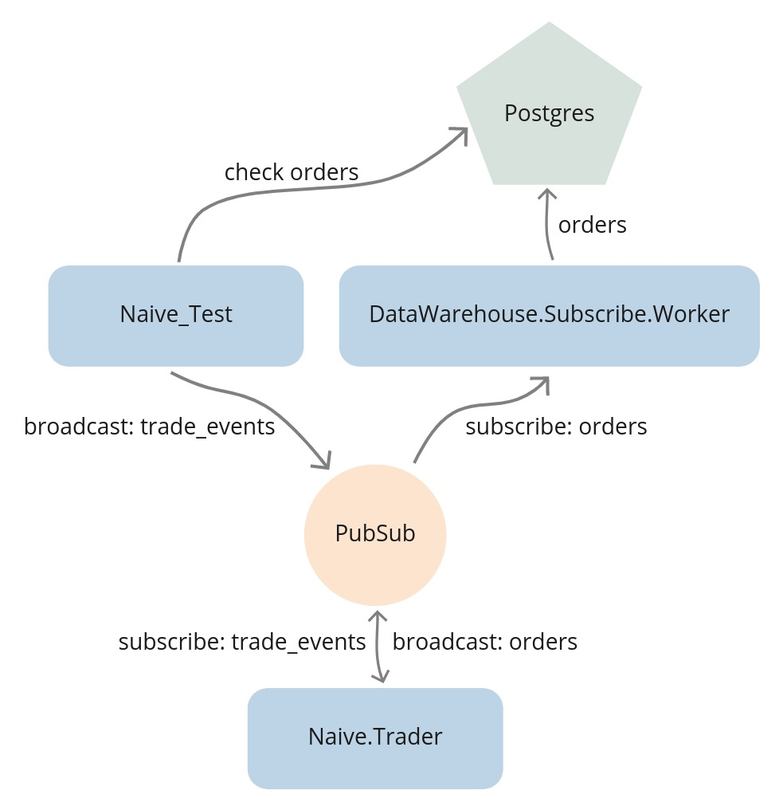
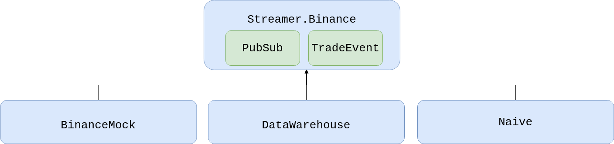
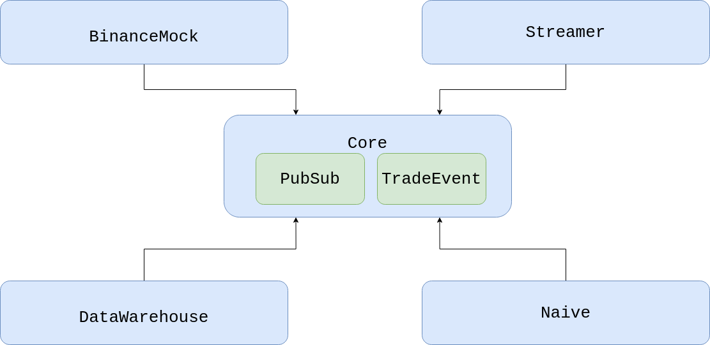

# 端到端测试 {#15-end-to-end-testing}

在上一章中，我们构建了一个回测系统，它会把历史交易事件重新通过我们的交易策略跑一遍。
我们把 20 万+ 条事件跑进系统，看到它生成了数百笔订单。
但我们都是手动验证的——检查数据库表、阅读日志、目测结果。

这种做法的问题在于：它无法扩展。
每次我们重构代码，都得重复同样的人工验证流程。
而手动验证有一个很糟糕的习惯：一旦期限逼近，它就会变成“跳过验证”。

我们需要的是自动化的端到端测试。
我们会广播精心构造的交易事件，并断言数据库里会出现正确的订单。
这个测试会证明我们的交易流程是正常的——从接收事件到挂出订单。

在这个过程中，我们还会偿还一些技术债。
记得我们把 PubSub 和 TradeEvent 放在 `streamer` 应用里吗？
这个捷径马上就会引发依赖环，我们会通过引入一个 `core` 应用来正确地解决它。

## 目标
- 决定要测试的功能
- 实现基础测试
- 引入基于环境的配置文件
- 添加便捷别名
- 把初始 seed 数据缓存到文件里
- 更新 seeding 脚本使用 BinanceMock
- 引入 core 应用

## 决定要测试的功能

我们已经到了一个阶段：交易系统可以正常工作——
但“在我机器上能跑”并不够。
为了确保它在重构之后仍然可用，
我们需要自动化测试。
我们会先写一个端到端测试，确认整个交易流程都正常：事件进入、订单输出、数据落入数据库。

要在这个层级上测试，我们需要把数据库、进程和广播交易事件这几件事协调起来，
并在测试内部广播交易事件，促使交易策略挂出订单。
测试运行后，我们可以通过检查数据库来确认行为是否正确。

这类测试在你的测试套件里应该很少——它们比较脆弱，而且搭建和维护成本都不低。
我的经验法则是：端到端测试只保留给重要的“happy path”。

我们来看看当前系统里的数据流：

```{r, fig.align="center", out.width="100%", echo=FALSE}

```

目前，`Streamer.Binance` 会和 Binance 建立 WebSocket 连接。
它会把进入的交易事件从 JSON 字符串解码出来，然后通过 PubSub（`TRADE_EVENTS:#{symbol}` topics）广播出去。
接着 PubSub 把它们发送给 `Naive.Trader` 进程。随着这些进程挂单（或者订单成交），
它们又会把订单广播到 PubSub（`ORDERS:#{symbol}` topics）。`DataWarehouse.Subscriber.Worker` 进程会订阅
这些广播出来的订单并把它们存到数据库里。

我们可以把这个流程画成这样：

```{r, fig.align="center", out.width="100%", echo=FALSE}

```

为了测试回测/端到端流程，我们可以停止所有 `Streamer.Binance` 进程，并直接从测试里广播交易事件。
然后我们就能微调这些事件里的价格，让它们跑完整个交易循环：

```{r, fig.align="center", out.width="100%", echo=FALSE}

```

这样我们就可以从数据库里取订单，确认交易确实发生过。

## 实现基础测试

我们会把测试放在 `apps/naive/test/naive_test.exs` 文件里的 `NaiveTest` 模块中。
首先，我们需要给要用到的多个模块加 alias，用来初始化数据或确认结果：

```{r, engine = 'elixir', eval = FALSE}
  # /apps/naive/test/naive_test.exs
  ...
  alias DataWarehouse.Schema.Order
  alias Naive.Schema.Settings, as: TradingSettings
  alias Streamer.Binance.TradeEvent

  import Ecto.Query, only: [from: 2]
```

现在我们可以给自动生成的测试加一个 tag：

```{r, engine = 'elixir', eval = FALSE}
  # /apps/naive/test/naive_test.exs
  ...
  @tag integration: true
```

我们会用这个 tag，在运行集成测试时只选这个测试。


第一步是把交易设置更新成能触发交易活动的值：

```{r, engine = 'elixir', eval = FALSE}
  # /apps/naive/test/naive_test.exs
  ...
  test "Naive trader full trade(buy + sell) test" do
    symbol = "XRPUSDT"

    # Step 1 - Update trading settings

    settings = [
      profit_target: 0.001,
      buy_down_interval: 0.0025,
      chunks: 5,
      budget: 100.0
    ]

    {:ok, _} =
      TradingSettings
      |> Naive.Repo.get_by!(symbol: symbol)
      |> Ecto.Changeset.change(settings)
      |> Naive.Repo.update()
```

在更新交易设置后，我们现在可以开始交易了：

```{r, engine = 'elixir', eval = FALSE}
    # /apps/naive/test/naive_test.exs
    # `test` function continued
    ...
    # Step 2 - Start trading on symbol

    Naive.start_trading(symbol)
```


在开始广播事件之前，我们需要确保 `DataWarehouse` 应用会把生成的订单存进数据库：

```{r, engine = 'elixir', eval = FALSE}
    # /apps/naive/test/naive_test.exs
    # `test` function continued
    ...
    # Step 3 - Start storing orders

    DataWarehouse.start_storing("ORDERS", symbol)
    :timer.sleep(5000)
```

另外，正如上面的代码所示，我们需要留出一些时间（上面用了 5 秒）来初始化交易和数据存储进程。

现在我们可以继续广播交易事件了：

```{r, engine = 'elixir', eval = FALSE}
    # /apps/naive/test/naive_test.exs
    # `test` function continued
    ...
    # Step 4 - Broadcast 8 events

    [
      # below event will trigger
      # buy order placed @ 0.4307
      generate_event(1, 0.43183010, "213.10000000"),
      # above the buy price - ignored
      generate_event(2, 0.43183020, "56.10000000"),
      # above the buy price - ignored
      generate_event(3, 0.43183030, "12.10000000"),
      # event at the expected buy price
      # it should trigger fetching the buy order
      # and placing a sell order @ 0.4319
      generate_event(4, 0.4307, "38.92000000"),
      # event below the expected buy price
      generate_event(5, 0.43065, "126.53000000"),
      # event at exact the expected sell price
      # it should trigger fetching the sell order
      # and trader process to exit
      generate_event(6, 0.4319, "62.92640000"),
      # below event will trigger
      # buy order placed @ 0.4309
      generate_event(7, 0.43205, "345.14235000"),
      # above the buy price - ignored
      generate_event(8, 0.43210, "3201.86480000")
    ]
    |> Enum.each(fn event ->
      Phoenix.PubSub.broadcast(
        Streamer.PubSub,
        "TRADE_EVENTS:#{symbol}",
        event
      )

      :timer.sleep(10)
    end)

    :timer.sleep(2000)
```

上面的代码会向 trader 进程订阅的 PubSub topic 广播交易事件。
它应该会在特定价格上触发 3 笔订单。

```{=latex}
\begin{sidequest}
```
```{=html}
<div class="sidequest">
```

**关于测试时序的说明：** 这里我们使用 `:timer.sleep/1` 来给异步进程留出完成工作的时间。
在专业的 CI/CD 环境里，这通常不推荐，因为它会让测试变慢且脆弱（容易 flaky）。
更稳健的做法是让测试进程订阅 PubSub topic，接收“工作完成”的消息，或者使用轮询断言库，等待数据库记录真正出现。

```{=html}
</div>
```
```{=latex}
\end{sidequest}
```

最后一步，我们通过查询数据库来确认结果：

```{r, engine = 'elixir', eval = FALSE}
    # /apps/naive/test/naive_test.exs
    # `test` function continued
    ...
    # Step 5 - Check orders table

    query =
      from(o in Order,
        select: [o.price, o.side, o.status],
        order_by: o.inserted_at,
        where: o.symbol == ^symbol
      )

    [buy_1, sell_1, buy_2] = DataWarehouse.Repo.all(query)

    assert buy_1 == [Decimal.new("0.4307"), "BUY", "FILLED"]
    assert sell_1 == [Decimal.new("0.4319"), "SELL", "FILLED"]
    assert buy_2 == [Decimal.new("0.4309"), "BUY", "NEW"]
```

这样测试函数就完成了。`NaiveTest` 模块里最后还要加一个私有辅助函数，
它会根据传入的值生成交易事件：

```{r, engine = 'elixir', eval = FALSE}
  # /apps/naive/test/naive_test.exs
  ...
  
  defp generate_event(id, price, quantity) do
    %TradeEvent{
      event_type: "trade",
      event_time: 1_000 + id * 10,
      symbol: "XRPUSDT",
      trade_id: 2_000 + id * 10,
      price: price,
      quantity: quantity,
      trade_time: 5_000 + id * 10,
      buyer_market_maker: false
    }
  end
```

这样测试的实现就完成了，但因为我们现在在 `Naive` 应用里使用了 DataWarehouse 的模块，
所以需要把 `data_warehouse` 加到依赖里：

```{r, engine = 'elixir', eval = FALSE}
  # /apps/naive/mix.exs
  defp deps do
    [
      ...
      {:data_warehouse, in_umbrella: true, only: :test},
      ...
```

现在我们可以直接运行新的集成测试，但它会在我们当前的（开发）数据库上执行。
此外，因为在每次测试运行前都得重置这些数据，这还可能导致数据丢失。
为了避免这些问题，我们会为测试单独使用独立数据库。

## 引入基于环境的配置文件

现在，我们的新测试运行在 test 环境里（每次运行 `mix test` 时，`MIX_ENV` 环境变量都会被设成 `"test"`），
但我们并没有利用这一点来给应用配置，比如使用上面提到的测试数据库。

我们应用的配置都放在 `config/config.exs` 文件里。在这个文件中，
我们可以拿到当前环境名，接下来会利用这一点来放一个基于环境的 `import_config/1`：

```{r, engine = 'elixir', eval = FALSE}
# /config/config.exs
# add the below at the end of the file
...
import_config "#{config_env()}.exs"
```


现在我们会创建多个 config 文件，每个环境一个：

* `/config/dev.exs` 用于开发：

```{r, engine = 'elixir', eval = FALSE}
# /config/dev.exs
import Config
```


* `/config/test.exs` 用于未来的“单元”测试：

```{r, engine = 'elixir', eval = FALSE}
# /config/test.exs
import Config
```

* `/config/integration.exs` 用于端到端测试：

```{r, engine = 'elixir', eval = FALSE}
# /config/integration.exs
import Config

config :streamer, Streamer.Repo, database: "streamer_test"

config :naive, Naive.Repo, database: "naive_test"

config :data_warehouse, DataWarehouse.Repo, database: "data_warehouse_test"
```

* `/config/prod.exs` 用于生产：

```{r, engine = 'elixir', eval = FALSE}
# /config/prod.exs
import Config

config :naive,
  binance_client: Binance
```

添加了以上基于环境的配置文件后，我们的测试就会使用 test 数据库。

不过还有一个问题——我们需要在每次测试运行前把这些测试数据库准备好，
而这个过程涉及多个步骤，还是有点麻烦。

## 添加便捷别名

为了尽可能方便地运行新的集成测试，而不用每次都手动做数据库准备工作，
我们会在 `streamer` 和 `naive` 两个应用中都加一些别名，封装数据库 seeding：

```{r, engine = 'elixir', eval = FALSE}
# /apps/naive/mix.exs & /apps/streamer/mix.exs 
  def project do
    [
      ...
      aliases: aliases()
    ]
  end

  defp aliases do
    [
      seed: ["run priv/seed_settings.exs"]
    ]
  end
```

在 umbrella 的主 `mix.exs` 文件里，我们会结合常见的 `ecto` 命令来使用这些别名，比如 `ecto.create` 和 `ecto.migrate`：

```{r, engine = 'elixir', eval = FALSE}
  # /mix.exs 
  def project do
    [
      ...
      aliases: aliases()
    ]
  end

  defp aliases do
    [
      setup: [
        "ecto.drop",
        "ecto.create",
        "ecto.migrate",
        "do --app naive --app streamer cmd mix seed"
      ],
      "test.integration": [
        "setup",
        "test --only integration"
      ]
    ]
  end
```

现在我们可以安全地运行测试了：

```{r, engine = 'bash', eval = FALSE}
$ MIX_ENV=integration mix test.integration
```

等等……为什么在调用这个别名之前，我们要设置 `MIX_ENV`？

正如我前面提到的，`mix test` 命令在调用时会自动把环境设为 `"test"`。
但我们的别名里还包含其他命令，比如 `mix ecto.create`，如果不显式指定环境，
它们就会使用 dev 数据库。这样一来，我们就会先把 dev 数据库（drop、create、migrate、seed）准备好，然后再在 test 数据库上跑测试。

所以现在测试是通过了，但它依赖于提前把数据库准备好，而这又要求我们通过几次对 Binance API 的请求来 seed 数据。

## 把初始 seed 数据缓存到文件里

依赖第三方 API 来 seed 数据库以运行测试，这是一个非常糟糕的主意。
不过我们可以通过把响应 JSON 缓存在文件里来解决。

那这些数据要怎样灌进测试数据库呢？

为了尽量减少改动范围，我们可以修改 `BinanceMock` 模块，让它根据一个标志来决定是否使用缓存数据——
我们先把这个标志加上：

```{r, engine = 'elixir', eval = FALSE}
# /config/config.exs
# add below lines under the `import Config` line 
config :binance_mock,
  use_cached_exchange_info: false
```

```{r, engine = 'elixir', eval = FALSE}
# /config/integration.exs
# add below lines under the `import Config` line 
config :binance_mock,
  use_cached_exchange_info: true
```

可以看到，按环境拆分配置文件非常方便——我们只在测试环境里启用了缓存的 exchange info 数据。

在 `BinanceMock` 模块里，我们现在可以更新 `get_exchange_info/0` 函数，让它根据这个配置值来返回缓存或实时的 exchange info：

```{r, engine = 'elixir', eval = FALSE}
  # /apps/binance_mock/lib/binance_mock.ex
  def get_exchange_info do
    case Application.get_env(:binance_mock, :use_cached_exchange_info) do
      true -> get_cached_exchange_info()
      _ -> Binance.get_exchange_info()
    end
  end

  # add this at the bottom of the module
  defp get_cached_exchange_info do
    {:ok, data} =
      File.cwd!()
      |> Path.split()
      |> Enum.drop(-1)
      |> Kernel.++([
        "binance_mock",
        "test",
        "assets",
        "exchange_info.json"
      ])
      |> Path.join()
      |> File.read()

    {:ok, Jason.decode!(data) |> Binance.ExchangeInfo.new()}
  end
```

因为 `binance_mock` 应用之前还没用过 `jason` 包，所以我们需要把它加到依赖里：

```{r, engine = 'elixir', eval = FALSE}
  # /apps/binance_mock/mix.exs
  defp deps do
    [
      ...
      {:jason, "~> 1.2"},
      ...
```

上面的改动会负责在实时/缓存 exchange info 之间切换，
但我们还需要手动把当前响应保存到文件里（以后作为缓存版本使用）。

让我们打开终端，创建一个新的 `assets` 目录，并获取 exchange info 数据，再序列化成 JSON：

```{r, engine = 'bash', eval = FALSE}
$ mkdir apps/binance_mock/test/assets
$ iex -S mix
....
iex(1)> {:ok, info} = Binance.get_exchange_info()
...
iex(2)> data = info |> Map.from_struct() |> Jason.encode!(pretty: true)
...
iex(3)> File.write("apps/binance_mock/test/assets/exchange_info.json", data)
:ok
```

这样，BinanceMock 就已经可以根据配置来提供缓存/实时响应了。

最后一步，是确保 seeding 也使用 `BinanceMock` 模块，而不是直接使用 `Binance`，
这样才能利用上面的实现。

## 更新 seeding 脚本使用 BinanceMock

`Naive` 应用的 seed settings 脚本（`apps/naive/priv/seed_settings.exs`）本来就已经使用了 `BinanceMock`。

在 `Streamer` 应用（`apps/streamer/priv/seed_settings.exs`）里，我们可以看到脚本使用的是 `Binance` 模块。
所以我们可以把脚本中获取数据的部分改成下面这样：

```{r, engine = 'elixir', eval = FALSE}
# /apps/streamer/priv/seed_settings.exs
...
binance_client = Application.compile_env(:streamer, :binance_client) # <= new

Logger.info("Fetching exchange info from Binance to create streaming settings")

{:ok, %{symbols: symbols}} = binance_client.get_exchange_info() # <= updated
```

我们还需要像对 `naive` 应用那样，把 `streamer` 应用的配置也指向 `BinanceMock`：

```{r, engine = 'elixir', eval = FALSE}
# /config/config.exs
...
config :streamer,
  binance_client: BinanceMock, # <= added
  ecto_repos: [Streamer.Repo]
...
```

```{r, engine = 'elixir', eval = FALSE}
# /config/prod.exs
...
config :streamer,
  binance_client: Binance
```


同时，我们还要把 `Streamer` 应用依赖列表里的 `binance` 换成 `BinanceMock`：

```{r, engine = 'elixir', eval = FALSE}
# /apps/streamer/mix.exs
...
  defp deps do
    [
      {:binance_mock, in_umbrella: true},
      ...
```

此时我们应该已经可以在使用测试数据库和缓存 Binance 响应的情况下运行测试了：

```{r, engine = 'bash', eval = FALSE}
$ MIX_ENV=integration mix test.integration
** (Mix) Could not sort dependencies. There are cycles in the dependency graph
```

这正是我们为过去的偷懒付出的代价。让我解释一下。
当我们刚开始这个项目、通过 PubSub topics 实现通信时，
我们把 PubSub 进程（在监督树里）和 TradeEvent 结构体都放进了 streamer 应用里。
这个决定的连锁效应是：任何想使用 PubSub 或 TradeEvent 结构体的 umbrella 中其他应用，都必须依赖 `streamer` 应用：

```{r, fig.align="center", out.width="100%", echo=FALSE}

```

当我们把 `binance_mock` 应用作为 `streamer` 应用的依赖时，就制造出了一个依赖环。

这在软件工程日常工作中非常常见。一个常见问题（除了给事物命名）就是：东西到底该放在哪儿？比如，PubSub 和 TradeEvent 应该放在 Streamer 应用里吗？还是应该放进 BinanceMock？

我认为它们都不属于那里——`streamer` 和 `binance_mock` 都是 PubSub 和 TradeEvent 的消费者，不是拥有者。

更好的做法，是创建一个新的受监督应用，把 PubSub 挂到它的监督树上，并放置系统级别的结构体（比如 TradeEvent），这样每个应用都可以依赖它，而不是彼此依赖：

```{r, fig.align="center", out.width="100%", echo=FALSE}

```

## 引入 Core 应用

我们先创建一个新应用：

```{r, engine = 'bash', eval = FALSE}
$ cd apps
$ mix new --sup core
...
```

现在我们可以在 `apps/core/lib/core` 目录下创建一个名为 `struct` 的新目录，并把 `streamer` 应用里的 `TradeEvent` 结构体移动过去（同一个终端里或者从 `apps` 目录执行都可以）：

```{r, engine = 'bash', eval = FALSE}
$ mkdir core/lib/core/struct
$ mv streamer/lib/streamer/binance/trade_event.ex core/lib/core/struct
```

接下来我们需要把模块名改成 `Core.Struct.TradeEvent`：

```{r, engine = 'elixir', eval = FALSE}
# /apps/core/lib/core/struct/trade_event.ex
defmodule Core.Struct.TradeEvent do
```

既然我们已经把 `TradeEvent` 结构体移动到了 `Core` 应用里，我们还需要：

* 把所有引用 `Streamer.Binance.TradeEvent` 的地方改成 `Core.Struct.TradeEvent`
* 把 `core` 加到 umbrella 中所有应用的依赖列表里
* 从 umbrella 中所有应用的依赖列表里移除 `streamer`

最后一步，是把 PubSub 进程从 Streamer 应用的监督树中移动到 Core 应用的监督树里。

```{r, engine = 'elixir', eval = FALSE}
# /apps/streamer/lib/streamer/application.ex
  def start(_type, _args) do
    children = [
      ...
      {
        Phoenix.PubSub,
        name: Streamer.PubSub
      }, # ^ remove it from here
      ...
    ]
```

```{r, engine = 'elixir', eval = FALSE}
# /apps/core/lib/core/application.ex
  def start(_type, _args) do
    children = [
      {
        Phoenix.PubSub,
        name: Core.PubSub
      } # ^ add it here
    ]
```

因为我们改变了 PubSub 进程的模块名（从 `Streamer.PubSub` 改成 `Core.PubSub`），
所以我们还需要更新所有引用它的地方，并给 `core` 应用添加 `phoenix_pubsub` 包作为依赖：

```{r, engine = 'elixir', eval = FALSE}
  # /apps/core/mix.exs
  defp deps do
    [
      {:phoenix_pubsub, "~> 2.0"}
    ]
  end
```

现在我们可以运行测试了，它会使用测试数据库和缓存的 exchange info：

```{r, engine = 'bash', eval = FALSE}
$ MIX_ENV=integration mix test.integration
```

我们应该会看到一串 setup 日志，然后出现确认信息：

```{r, engine = 'bash', eval = FALSE}
Finished in 0.03 seconds (0.00s async, 0.03s sync)
1 test, 0 failures, 1 excluded
```

这样端到端测试的实现就收尾了。下一章里，我们会看看如何为交易策略实现单元测试。

这项测试实现带来的额外好处是：我们不再需要记住如何搭建本地环境了，因为现在只需要：

```{r, engine = 'bash', eval = FALSE}
mix setup
```

就行了。

太棒了！ :)

**我们现在已经有了自动化的端到端测试。** 我们完成了这些：

- 创建了一个测试，它会广播交易事件并验证订单是否出现在数据库中
- 配置了基于环境的设置，并使用独立的测试数据库
- 建立了便捷别名（`mix setup`、`mix test.integration`），让测试变得轻松
- 通过提取 PubSub 和 TradeEvent 到新的 `core` 应用，修复了依赖环

关键洞见在于：好的架构会在测试阶段带来回报。
我们的 pub/sub 设计意味着，我们可以注入测试事件，而不必修改生产代码。
而把共享职责提取到 `core` 中，不仅修复了循环依赖，还让系统结构更清晰。

不过端到端测试也有一些缺点：

- 对出问题的地方可见性差——大多数时候我们只会看到错误结果，而不是错误本身
- 需要同步执行——它们依赖数据库，所以不能并行运行
- 有随机性/不稳定性——因为没有反馈循环，我们只能等待一个写死的时间，假定它足够完成初始化/执行——这会随机失败

虽然可以实现一个反馈循环，并把测试放在“sandbox”（事务）里运行，
但这并不值得，因为我们可以把时间投入到编写更可靠的单元测试上。

**那么，下一步是什么？**

说到单元测试——端到端测试很有价值，但代价也很高。
它们慢、脆弱，而且一旦失败，你往往只能猜问题出在哪。

在下一章中，我们会使用 `mox` 库实现真正的单元测试。
我们会 mock 掉 PubSub 和 Binance 这类依赖，单独测试我们的 `Naive.Trader`，
并得到那些运行只需毫秒而不是秒的测试。
反馈循环会足够紧密，让我们真的可以用 TDD。

[Note] 请记得运行 `mix format`，保持代码整洁。

本章的源代码可以在本书的源代码仓库中找到
（分支：
[chapter_15](https://github.com/Cinderella-Man/hands-on-elixir-and-otp-cryptocurrency-trading-bot-source-code/tree/chapter_15)）。
