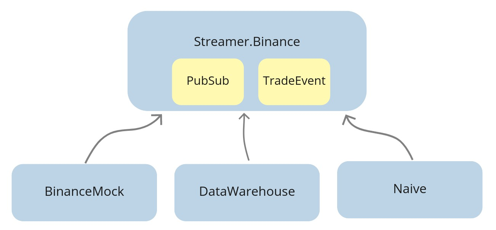

# End-to-end testing

## Objectives
- decide on the tested functionality
- implement basic test
- introduce environment based config files
- add convenience aliases
- cache initial seed data inside a file
- update seeding scripts to use the BinanceMock
- introduce the core application

## Decide on the tested functionality

We've reached the stage where we have a decent solution in place, and to ensure that it's still working correctly after any future refactoring, we will add tests. We will start with the "integration"/"end-to-end"(E2E) test, which will confirm that the whole "trading" works.

To perform tests at this level, we will need to orchestrate databases together with processes and broadcast trade events from within the test to cause our trading strategy to place orders. We will be able to confirm the right behavior by checking the database after running the test.

You should have the **least** amount of this type of test as they are very brittle and require substantial effort to set up and maintain. My personal rule of thumb is that only major "happy paths" should be tested this way.

\newpage

Let's look at the current flow of data through our system:

```{r, fig.align="center", out.width="100%", echo=FALSE}

```

Currently, the `Streamer.Binance` establishes a WebSocket connection with Binance. It decodes the incoming trade events and broadcasts them to PubSub(`TRADE_EVENTS:#{symbol}` topics). PubSub then sends them to the `Naive.Trader` processes. As those processes place orders(or orders get filled), they broadcast orders to the PubSub(`ORDERS:#{symbol}` topics). The `DataWarehouse.Subscriber.Worker` processes subscribe to the broadcasted orders and store them in the database.

\newpage

What we could do is to stop all the `Streamer.Binance` processes and broadcast trade events directly from the test. We would then be able to fine-tune the prices inside those events to run through the full trade cycle:

```{r, fig.align="center", out.width="100%", echo=FALSE}
knitr::include_graphics("images/chapter_16_02_test.png")
```

This would allow us to fetch orders from the database to confirm that trading indeed happened.

## Implement basic test

We will place our test inside the `NaiveTest` module inside the `apps/naive/test/naive_test.exs` file.
First, we will need to alias multiple modules that we will use to either initialize or confirm the results:

```{r, engine = 'elixir', eval = FALSE}
  # /apps/naive/test/naive_test.exs
  ...
  alias DataWarehouse.Schema.Order
  alias Naive.Schema.Settings, as: TradingSettings
  alias Streamer.Binance.TradeEvent

  import Ecto.Query, only: [from: 2]
```

\newpage

Now we can update the generated test to have a tag in front of it:

```{r, engine = 'elixir', eval = FALSE}
  # /apps/naive/test/naive_test.exs
  ...
  @tag integration: true
```

We will use this tag to select only this test when we are running the integration tests.


The first step will be to update the trading settings to values that will cause trading activity:

```{r, engine = 'elixir', eval = FALSE}
  # /apps/naive/test/naive_test.exs
  ...
  test "Naive trader full trade(buy + sell) test" do
    symbol = "XRPUSDT"

    # Step 1 - Update trading settings

    settings = [
      profit_interval: 0.001,
      buy_down_interval: 0.0025,
      chunks: 5,
      budget: 100.0
    ]

    {:ok, _} =
      TradingSettings
      |> Naive.Repo.get_by!(symbol: symbol)
      |> Ecto.Changeset.change(settings)
      |> Naive.Repo.update()
```

As we updated the trading settings, we can now start trading:

```{r, engine = 'elixir', eval = FALSE}
    # /apps/naive/test/naive_test.exs
    # `test` function continued
    ...
    # Step 2 - Start trading on symbol

    Naive.start_trading(symbol)
```

\newpage

Before we start broadcasting events, we need to ensure that the `DataWarehouse` application will store resulting orders into the database:

```{r, engine = 'elixir', eval = FALSE}
    # /apps/naive/test/naive_test.exs
    # `test` function continued
    ...
    # Step 3 - Start storing orders

    DataWarehouse.start_storing("ORDERS", "XRPUSDT")
    :timer.sleep(5000)
```

Additionally, as seen in the above code, we need to allow some time(5 seconds above) to initialize trading and data storing processes.

We can now move on to broadcasting trade events:

```{r, engine = 'elixir', eval = FALSE}
    # /apps/naive/test/naive_test.exs
    # `test` function continued
    ...
    # Step 4 - Broadcast 9 events

    [
      # buy order placed @ 0.4307
      generate_event(1, "0.43183010", "213.10000000"),
      generate_event(2, "0.43183020", "56.10000000"),
      generate_event(3, "0.43183030", "12.10000000"),
      # event at the expected buy price
      generate_event(4, "0.4307", "38.92000000"),
      # event below the expected buy price
      # it should trigger fake fill event for placed buy order
      # and place sell order @ 0.4319
      generate_event(5, "0.43065", "126.53000000"),
      # event below the expected sell price
      generate_event(6, "0.43189", "26.18500000"),
      # event at exact the expected sell price
      generate_event(7, "0.4319", "62.92640000"),
      # event above the expected sell price
      # it should trigger fake fill event for placed sell order
      generate_event(8, "0.43205", "345.14235000"),
      # this one should trigger buy order for a new trader process
      generate_event(9, "0.43210", "3201.86480000")
    ]
    |> Enum.each(fn event ->
      Phoenix.PubSub.broadcast(
        Core.PubSub,
        "TRADE_EVENTS:#{symbol}",
        event
      )

      :timer.sleep(10)
    end)

    :timer.sleep(2000)
```

The above code will broadcast trade events to the PubSub topic that the trader processes are subscribed to.
It should cause 3 orders to be placed at specific prices. In the last step, we will confirm this by querying the database:

```{r, engine = 'elixir', eval = FALSE}
    # /apps/naive/test/naive_test.exs
    # `test` function continued
    ...
    # Step 5 - Check orders table

    query =
      from(o in Order,
        select: [o.price, o.side, o.status],
        order_by: o.inserted_at,
        where: o.symbol == ^symbol
      )

    [buy_1, sell_1, buy_2] = DataWarehouse.Repo.all(query)

    assert buy_1 == ["0.43070000", "BUY", "FILLED"]
    assert sell_1 == ["0.43190000", "SELL", "FILLED"]
    assert buy_2 == ["0.43100000", "BUY", "NEW"]
```


That finishes the test function. The final addition inside the `NaiveTest` module will be to add a private helper function that generates trade event for the passed values:

```{r, engine = 'elixir', eval = FALSE}
  # /apps/naive/test/naive_test.exs
  ...
  
  defp generate_event(id, price, quantity) do
    %TradeEvent{
      event_type: "trade",
      event_time: 1_000 + id * 10,
      symbol: "XRPUSDT",
      trade_id: 2_000 + id * 10,
      price: price,
      quantity: quantity,
      buyer_order_id: 3_000 + id * 10,
      seller_order_id: 4_000 + id * 10,
      trade_time: 5_000 + id * 10,
      buyer_market_maker: false
    }
  end
```

This finishes the implementation of the test, but as we are now using DataWarehouse’s modules inside the Naive application, we need to add `data_warehouse` to the dependencies:

```{r, engine = 'elixir', eval = FALSE}
  # /apps/naive/mix.exs
  defp deps do
    [
      ...
      {:data_warehouse, in_umbrella: true, only: :test},
      ...
```

We could now run our new integration test, but it would be run against our current(development) databases. In addition, as we will need to reset all the data inside them before every test run, it could mean losing data. To avoid all of those problems, we will use separate databases for testing.

## Introduce environment based config files

Currently, our new test is running in the test environment (the `MIX_ENV` environmental variable is set to `"test"` whenever we run `mix test`), but we do not leverage that fact to configure our application for example: to use test databases as mentioned above.

Configuration for our applications lives in `config/config.exs` configuration file. Inside it, we have access to the name of the environment, which we will utilize to place an environment based `import_config/1` function:

```{r, engine = 'elixir', eval = FALSE}
# /config/config.exs
# add the below at the end of the file
...
import_config "#{config_env()}.exs"
```


Now we will create multiple config files, one for each environment:

* `/config/dev.exs` for development:

```{r, engine = 'elixir', eval = FALSE}
# /config/dev.exs
import Config
```

\newpage

* `/config/test.exs` for future "unit" testing:

```{r, engine = 'elixir', eval = FALSE}
# /config/test.exs
import Config
```

* `/config/integration.exs` for end-to-end testing:

```{r, engine = 'elixir', eval = FALSE}
# /config/integration.exs
import Config

config :streamer, Streamer.Repo, database: "streamer_test"

config :naive, Naive.Repo, database: "naive_test"

config :data_warehouse, DataWarehouse.Repo, database: "data_warehouse_test"
```

* `/config/prod.exs` for production:

```{r, engine = 'elixir', eval = FALSE}
# /config/prod.exs
import Config

config :naive,
  binance_client: Binance
```

After adding the above environment-based configuration files, our test will use the test databases.

There's one more remaining problem - we need to set those test databases before each test run, and as this process requires multiple steps, it's a little bit cumbersome.

## Add convenience aliases

To be able to run our new integration test as easily as possible without bothering ourselves with all the database setup, we will introduce aliases in both the `streamer` and `naive` applications that will wrap seeding the databases:

```{r, engine = 'elixir', eval = FALSE}
# /apps/naive/mix.exs & /apps/streamer/mix.exs 
  def project do
    [
      ...
      aliases: aliases()
    ]
  end

  defp aliases do
    [
      seed: ["run priv/seed_settings.exs"]
    ]
  end
```

Inside the main `mix.exs` file of our umbrella, we will use those with usual `ecto`'s commands like `ecto.create` and `ecto.migrate`:

```{r, engine = 'elixir', eval = FALSE}
  # /mix.exs 
  def project do
    [
      ...
      aliases: aliases()
    ]
  end

  defp aliases do
    [
      setup: [
        "ecto.drop",
        "ecto.create",
        "ecto.migrate",
        "cmd --app naive --app streamer mix seed"
      ],
      "test.integration": [
        "setup",
        "test --only integration"
      ]
    ]
  end
```

We can now safely run our test:

```{r, engine = 'bash', eval = FALSE}
$ MIX_ENV=integration mix test.integration
```

Wait... Why do we need to set the `MIX_ENV` before calling our alias?

So, as I mentioned earlier, the `mix test` command automatically assigns the `"test"` environment when called. However, our alias contains other commands like `mix ecto.create`, which without specifying the environment explicitly, would be run using the dev database. So we would set up the dev databases(drop, create, migrate & seed) and then run tests on the test databases.

So our test is now passing, but it relies on the database being setup upfront, which requires seeding using a couple of requests to the Binance API.

## Cache initial seed data inside a file

Relying on the 3rd party API to be able to seed our database to run tests is a horrible idea. However, we can fix that by cache the response JSON in a file.

How will this data be tunneled into the test database?

In the spirit of limiting the change footprint, we could update the `BinanceMock` module to serve the cached data dependent on the flag - let's add that flag first:

```{r, engine = 'elixir', eval = FALSE}
# /config/config.exs
# add below lines under the `import Config` line 
config :binance_mock,
  use_cached_exchange_info: false
```

```{r, engine = 'elixir', eval = FALSE}
# /config/integration.exs
# add below lines under the `import Config` line 
config :binance_mock,
  use_cached_exchange_info: true
```

We can see how convenient it is to have a configuration file per environment - we enabled cached exchange info data only for the test environment.

Inside the `BinanceMock` module, we can now update the `get_exchange_info/0` function to use this configuration value to serve either cached or live exchange info response:

```{r, engine = 'elixir', eval = FALSE}
  # /apps/binance_mock/lib/binance_mock.ex
  def get_exchange_info() do
    case Application.get_env(:binance_mock, :use_cached_exchange_info) do
      true -> get_cached_exchange_info()
      _ -> Binance.get_exchange_info()
    end
  end

  # add this at the bottom of the module
  defp get_cached_exchange_info do
    {:ok, data} =
      File.cwd!()
      |> Path.split()
      |> Enum.drop(-1)
      |> Kernel.++([
        "binance_mock",
        "test",
        "assets",
        "exchange_info.json"
      ])
      |> Path.join()
      |> File.read()

    {:ok, Jason.decode!(data) |> Binance.ExchangeInfo.new()}
  end
```

As the `binance_mock` app wasn't using the `jason` package before, we need to add it to dependencies:

```{r, engine = 'elixir', eval = FALSE}
  # /apps/binance_mock/mix.exs
  defp deps do
    [
      ...
      {:jason, "~> 1.2"},
      ...
```

The above change will take care of flipping between serving the live/cached exchange info data, but we still need to manually save the current response to the file (to be used as a cached version later).


Let's open the IEx terminal to fetch the exchange info data and serialize it to JSON:

```{r, engine = 'bash', eval = FALSE}
$ iex -S mix
iex(1)> Binance.get_exchange_info() |> elem(1) |> Jason.encode!
```

You should get the following error:

```{r, engine = 'bash', eval = FALSE}
... of type Binance.ExchangeInfo (a struct), Jason.Encoder protocol must always be
explicitly implemented.

If you own the struct, you can derive the implementation specifying which fields
should be encoded to JSON:

    @derive {Jason.Encoder, only: [....]}
    defstruct ...

It is also possible to encode all fields, although this should be used carefully
to avoid accidentally leaking private information when new fields are added:

    @derive Jason.Encoder
    defstruct ...

Finally, if you dont own the struct you want to encode to JSON, you may use
Protocol.derive/3 placed outside of any module: 

    Protocol.derive(Jason.Encoder, NameOfTheStruct, only: [...])
    Protocol.derive(Jason.Encoder, NameOfTheStruct)
```

In a nutshell, this means that the `jason` package doesn't know how to encode the `Binance.ExchangeInfo` struct. Ok, as we don't own this struct(it's a part of the `binance` package), we will follow the last suggestion and try to derive the `Jason.Encoder` module for the `Binance.ExchangeInfo` struct:

```{r, engine = 'bash', eval = FALSE}
$ iex -S mix
iex(1)> require Protocol
Protocol
iex(2)> Protocol.derive(Jason.Encoder, Binance.ExchangeInfo)
warning: the Jason.Encoder protocol has already been consolidated, an implementation for
Binance.ExchangeInfo has no effect. If you want to implement protocols after compilation
or during tests, check the "Consolidation" section in the Protocol module documentation
  iex:2: (file)
```

Hmm... This didn't work again. The reason for it is a mechanism called the "Protocol consolidation". Long story short, Elixir at compilation time knows upfront what structs derive which protocols, and to speed things up, it consolidates them at that moment. To avoid this process being run in development, we can modify the main `mix.exs` file to disable it:

```{r, engine = 'elixir', eval = FALSE}
  # /mix.exs 
  def project do
    [
      ...
      consolidate_protocols: Mix.env() == :prod
    ]
  end
```

We should now be able to encode JSON using the `jason` module:

```{r, engine = 'bash', eval = FALSE}
$ mkdir apps/binance_mock/test/assets
$ iex -S mix
iex(1)> require Protocol
Protocol
iex(2)> Protocol.derive(Jason.Encoder, Binance.ExchangeInfo)
:ok
iex(3)> data = Binance.get_exchange_info() |> elem(1) |> Jason.encode!(pretty: true)
...
iex(4)> File.write("apps/binance_mock/test/assets/exchange_info.json", data)
:ok
```

So we have the BinanceMock updated to serve cached/live responses based on the configuration and cached exchange info response.

The last step is to ensure that seeding uses the BinanceMock module instead of using Binance directly to leverage the above implementation.

## Update seeding scripts to use the BinanceMock

The seed settings script for the `Naive` application(apps/naive/priv/seed_settings.exs) already uses the `BinanceMock`.

Inside the `Streamer` application (apps/streamer/priv/seed_settings.exs) we can see that the `Binance` module is getting used. So we can update the fetching part of the script to the following to fix it:

```{r, engine = 'elixir', eval = FALSE}
# /apps/streamer/priv/seed_settings.exs
binance_client = Application.compile_env(:streamer, :binance_client) # <= new

Logger.info("Fetching exchange info from Binance to create streaming settings")

{:ok, %{symbols: symbols}} = binance_client.get_exchange_info() # <= updated
```

We need to update the config to point to the `BinanceMock` for the `streamer` application in the same way as we do for the `naive` application:

```{r, engine = 'elixir', eval = FALSE}
# /config/config.exs
...
config :streamer,
  binance_client: BinanceMock, # <= added
  ecto_repos: [Streamer.Repo]
...
```

```{r, engine = 'elixir', eval = FALSE}
# /config/prod.exs
...
config :streamer,
  binance_client: Binance
```


as well as swap the `binance` to the `BinanceMock` inside the list of dependencies of the `Streamer` app:

```{r, engine = 'elixir', eval = FALSE}
# /apps/streamer/mix.exs
...
  defp deps do
    [
      {:binance_mock, in_umbrella: true},
      ...
```

At this moment, we should be ready to run our test using the test database together with cached Binance response:

```{r, engine = 'bash', eval = FALSE}
$ MIX_ENV=test mix test.integration
** (Mix) Could not sort dependencies. There are cycles in the dependency graph
```

And this is the moment when we will pay for cutting corners in the past. Let me explain. When we started this project, as we implemented communication using the PubSub topics, we put both the `PubSub` process(in the supervision tree) and the `TradeEvent` struct inside the streamer application. The knock-on effect of this decision is that any other app in the umbrella that would like to use either `PubSub` or `TradeEvent` struct needs to depend on the `streamer` application:

```{r, fig.align="center", out.width="100%", echo=FALSE}

```

As we added the `binance_mock` application as a dependency of the streamer application, we created a dependency cycle.

This is quite typical in daily work as a software engineer. One of the common problems(besides naming things) is deciding where things belong. For example, do PubSub and TradeEvent belong in the Streamer app? Or maybe we should put it in the BinanceMock?

I believe that it should be neither of them as those applications use the PubSub and TradeEvent struct. I believe that they should be placed in neither of those applications as those applications are only
using the struct and PubSub process.


What we should do instead is to create a new supervised application where we can attach the PubSub to the supervision tree and hold the system-wide structs(like TradeEvent) so every app can depend on it instead of each other:

```{r, fig.align="center", out.width="100%", echo=FALSE}
knitr::include_graphics("images/chapter_16_04_core.png")
```

\newpage

## Introduce the Core application

Let's start with create a new application:

```{r, engine = 'bash', eval = FALSE}
$ cd apps
$ mix new --sup core
```

We can now create a new directory called `struct` inside the `apps/core/lib/core` directory and move the `TradeEvent` struct from the `streamer` app to it(in the same terminal or from the `apps` directory):

```{r, engine = 'bash', eval = FALSE}
$ mkdir core/lib/core/struct
$ mv streamer/lib/streamer/binance/trade_event.ex core/lib/core/struct
```

Now we need to update the module to `Core.Struct.TradeEvent`:

```{r, engine = 'elixir', eval = FALSE}
# /apps/core/lib/core/struct/trade_event.ex
...
defmodule Core.Struct.TradeEvent do
```

As we moved the `TradeEvent` struct over to the `Core` application, we need to:

* update all places that reference the `Streamer.Binance.TradeEvent` to `Core.Struct.TradeEvent`
* add the `core` to the dependencies lists of all apps in the umbrella
* remove the `streamer` from the dependencies lists of all apps in the umbrella


The final step will be to move the PubSub process from the supervision tree of the Streamer application to the supervision of the Core application.

```{r, engine = 'elixir', eval = FALSE}
# /apps/streamer/lib/streamer/application.ex
  def start(_type, _args) do
    children = [
      ...
      {
        Phoenix.PubSub,
        name: Streamer.PubSub, adapter_name: Phoenix.PubSub.PG2
      }, # ^ remove it from here
      ...
    ]
```

```{r, engine = 'elixir', eval = FALSE}
# /apps/core/lib/core/application.ex
  def start(_type, _args) do
    children = [
      {
        Phoenix.PubSub,
        name: Core.PubSub, adapter_name: Phoenix.PubSub.PG2
      } # ^ add it here
    ]
```

As we changed the module name of the PubSub process(from `Streamer.PubSub` to `Core.PubSub`), we need to update all the places where it's referenced as well as add the `phoenix_pubsub` package to dependencies of the `core` application:

```{r, engine = 'elixir', eval = FALSE}
  # /apps/core/mix.exs
  defp deps do
    [
      {:phoenix_pubsub, "~> 2.0"}
    ]
  end
```

We can now run our test that will use the test database as well as cached exchange info:

```{r, engine = 'bash', eval = FALSE}
$ MIX_ENV=test mix test.integration
```

We should see a lot of setup log followed by a confirmation:

```{r, engine = 'bash', eval = FALSE}
Finished in 0.03 seconds (0.00s async, 0.03s sync)
1 test, 0 failures, 1 excluded
```

This wraps up our implementation of the end-to-end test. In the next chapter, we will see how we would implement a unit test for our trading strategy.

The additional benefit of all the time that we put in the implementation of this test is that we won't need to remember how to set up local environment anymore as it's as simple as:

```{r, engine = 'bash', eval = FALSE}
mix setup
```

Yay! :)


It's worth reiterating the downsides of the end-to-end tests:

* lack of visibility over what's broken - most of the time, we will see the result of error but not the error itself
* requirement of synchronous execution - they rely on the database(s), so they can't be run in parallel
* randomness/flakiness - as there's no feedback loop, we wait for a hardcoded amount of time, that we assume it's enough to finish initialization/execution - this can randomly fail

It's possible to implement a feedback loop and run our tests inside "sandbox" (transaction), but it's not worth it as we can invest that time into developing reliable unit tests.

[Note] Please remember to run the `mix format` to keep things nice and tidy.

The source code for this chapter can be found on [GitHub](https://github.com/Cinderella-Man/hands-on-elixir-and-otp-cryptocurrency-trading-bot-source-code/tree/chapter_16)
