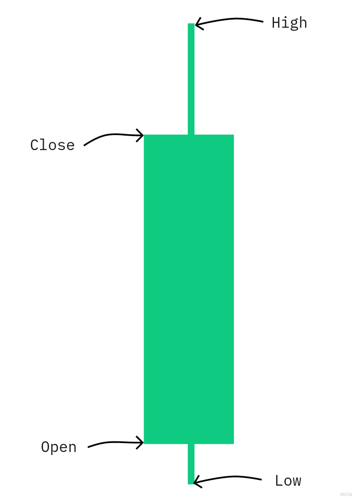
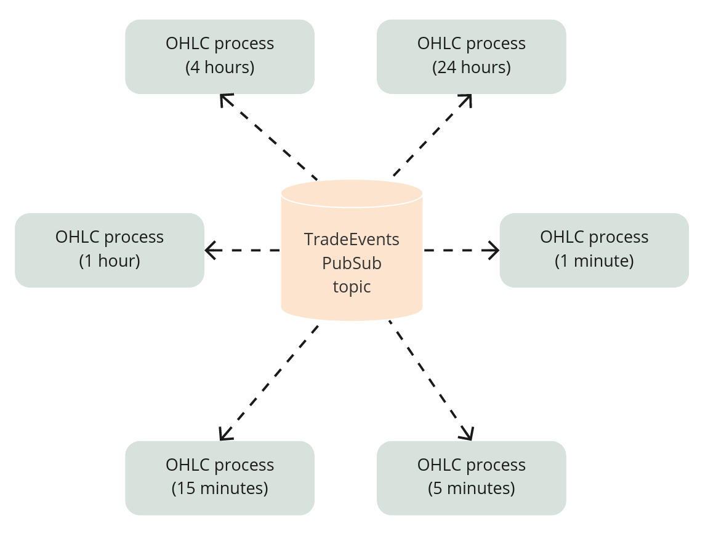

# 习惯用法里的 OTP {#18-idiomatic-elixir}

我们已经把纯逻辑和副作用分开，把交易策略变成了可测试的决策函数。`Naive.Strategy` 模块现在负责“做什么”——计算价格、决定动作。
`Naive.Trader` 负责“怎么做”——调用 API、广播消息、管理状态。

但问题在于：我们一直在把进程往问题上堆，却没有先问自己到底需不需要它们。每个 symbol 都有六个 OHLC worker，每个时间周期一个。每个 trader 都会启动自己的进程。我们还有 leader、symbol supervisor、dynamic supervisor——我们的监督树看起来像一片小森林。

我们这么多进程，是为了并发吗？为了故障隔离吗？还是只是因为我们能这么做？

在本章中，我们会用两种方式构建一个 OHLC（open-high-low-close）指标。第一种方式：每个 symbol 启动六个 GenServer 进程，每个进程跟踪一个不同时间周期。第二种方式：每个 symbol 只用一个进程，通过纯函数处理所有时间周期。

我们会发现，进程很强大，但它们并不是免费的。每一个进程都会带来监督复杂度、PubSub 订阅和消息传递开销。有时候，最简单的解决方案就是更少的进程和更多的纯函数。

在这个过程中，我们会建立一个经验法则：进程应该用于并发和故障隔离，而不是用于代码组织。Elixir 让我们可以低成本地使用进程，但这并不意味着我们应该到处都用它们。

## 目标
- 概念
- 初始实现
- 习惯用法方案

## 概念

在这一章里，我们会看看如何构建一个 OHLC（open-high-low-close）指标。
我们会讨论不同的潜在实现方式，这会成为理解 OTP 框架惯用用法的绝佳例子。

OHLC 指标由四个价格组成，可以用来在图表上画出蜡烛图：

```{r, fig.align="center", out.width="100%", echo=FALSE}

```

OHLC 指标的生成方式，是在特定时间周期（比如 1 分钟）内，收集第一个价格（“open”价格）、最低价（“low”）、最高价（“high”）以及最后一个价格（“close”）。

我们的代码需要能够同时生成多个时间周期的数据——1m、5m、15m、1h、4h 和 24h。

## 初始实现

我们可以让多个 GenServer 进程订阅 PubSub 里的交易事件 topic，每个进程更新自己的 OHLC 数值：

```{r, fig.align="center", out.width="100%", echo=FALSE}

```

我们先在 umbrella 中创建一个名为 `indicator` 的新应用（在终端中运行下面命令）：

```{r, engine = 'bash', eval = FALSE}
$ cd apps 
$ mix new indicator --sup
```

现在我们可以在 `/apps/indicator/lib/indicator` 目录下创建一个新的 `ohlc` 目录，
并在其中创建一个 GenServer 的 `worker.ex` 文件：

```{r, engine = 'elixir', eval = FALSE}
# /apps/indicator/lib/indicator/ohlc/worker.ex
defmodule Indicator.Ohlc.Worker do
  use GenServer

  def start_link({symbol, duration}) do
    GenServer.start_link(__MODULE__, {symbol, duration})
  end

  def init({symbol, duration}) do
    {:ok, {symbol, duration}}
  end
end
```


由于每个 worker 都需要订阅 PubSub 的 `"TRADE_EVENTS:#{symbol}"` topic，我们可以更新 `init/1` 函数来完成这件事：

```{r, engine = 'elixir', eval = FALSE}
# /apps/indicator/lib/indicator/ohlc/worker.ex

  # add those at the top of the worker module
  require Logger

  @logger Application.compile_env(:core, :logger)
  @pubsub_client Application.compile_env(:core, :pubsub_client)

  ...

  # updated `init/1` function
  def init({symbol, duration}) do
    symbol = String.upcase(symbol)

    @logger.info("Initializing a new OHLC worker(#{duration} minutes) for #{symbol}")

    @pubsub_client.subscribe(
      Core.PubSub,
      "TRADE_EVENTS:#{symbol}"
    )

    {:ok, {symbol, duration}}
  end
```

按照 `Naive.Trader` 建立的模式，我们使用模块属性（其值基于配置）而不是写死的模块名。

此外，我们用到了 `Core.PubSub` 和（间接的）`Phoenix.PubSub` 模块，
所以需要把它们加入 `indicator` 应用的依赖列表：

```{r, engine = 'elixir', eval = FALSE}
# /apps/indicator/mix.exs
  defp deps do
    [
      {:core, in_umbrella: true}, # <= added
      {:phoenix_pubsub, "~> 2.0"} # <= added
      ...
```

既然已经订阅了 PubSub，我们就需要提供一个回调来处理进入的交易事件：

```{r, engine = 'elixir', eval = FALSE}
# /apps/indicator/lib/indicator/ohlc/worker.ex
  # add this at the top
  alias Core.Struct.TradeEvent


  def handle_info(%TradeEvent{} = trade_event, ohlc) do
    {:noreply, Indicator.Ohlc.process(ohlc, trade_event)}
  end
```

为了避免把业务逻辑和 GenServer 样板代码混在一起（正如上一章讨论的那样），
我们会把业务逻辑放进一个新模块里。首先，我们需要创建一个新文件 `/apps/indicator/lib/indicator/ohlc.ex`，并在其中定义 `Indicator.Ohlc` 模块：

```{r, engine = 'elixir', eval = FALSE}
# /apps/indicator/lib/indicator/ohlc.ex
defmodule Indicator.Ohlc do

end
```

`Indicator.Ohlc` 模块会定义一个结构体，供 `Indicator.Ohlc.Worker` 作为 state 使用：

```{r, engine = 'elixir', eval = FALSE}
# /apps/indicator/lib/indicator/ohlc.ex
  @enforce_keys [
    :symbol,
    :start_time,
    :duration
  ]
  defstruct [
    :symbol,
    :start_time,
    :duration,
    :open,
    :high,
    :low,
    :close
  ]
```

上面大部分字段都不言自明，只有 `start_time`（Unix 时间戳）和 `duration`（以分钟为单位的时间周期）需要特别说明。

现在我们可以实现 `process/2` 函数了，但我们不会直接从这里开始，而是先从它会依赖的“最底层”函数开始，再一路向上实现。
正如我们在上一章中讨论的，我们会尽量最大化纯代码的比例。

我们可以把最底层函数想象成：把 trade event 的数据和当前 OHLC 数据合并。
可能出现两种情况：

- trade event 的 `trade_time` 在当前 OHLC 时间周期**内**。trade event 的价格会合并到当前 OHLC
- trade event 的 `trade_time` 在当前 OHLC 时间周期**外**。当前的（已经过期的）OHLC 会和基于 trade event 价格生成的新 OHLC 一起返回

实现如下：

```{r, engine = 'elixir', eval = FALSE}
# /apps/indicator/lib/indicator/ohlc.ex
  def merge_price(%__MODULE__{} = ohlc, price, trade_time) do
    if within_current_timeframe(ohlc.start_time, ohlc.duration, trade_time) do
      {nil, %{ohlc | low: min(ohlc.low, price), high: max(ohlc.high, price), close: price}}
    else
      {ohlc, generate_ohlc(ohlc.symbol, ohlc.duration, price, trade_time)}
    end
  end
```

再加上 `within_current_timeframe/3` 和 `generate_ohlc/3` 函数：

```{r, engine = 'elixir', eval = FALSE}
# /apps/indicator/lib/indicator/ohlc.ex
  def within_current_timeframe(start_time, duration, trade_time) do
    end_time = start_time + duration * 60
    trade_time = div(trade_time, 1000)

    start_time <= trade_time && trade_time < end_time
  end
  
  def generate_ohlc(symbol, duration, price, trade_time) do
    start_time = div(div(div(trade_time, 1000), 60), duration) * duration * 60

    %__MODULE__{
      symbol: symbol,
      start_time: start_time,
      duration: duration,
      open: price,
      high: price,
      low: price,
      close: price
    }
  end  
```

沿着调用链往上走，除了把 trade event 的数据合并进 OHLC 数据，我们还需要处理 worker 的初始状态（也就是 `{symbol, duration}` 元组）。
我们来添加一个带两个子句的 `process/2` 函数，分别处理这两种情况：

```{r, engine = 'elixir', eval = FALSE}
# /apps/indicator/lib/indicator/ohlc.ex
  # add the below line at the top of the module
  alias Core.Struct.TradeEvent

  def process(%__MODULE__{} = ohlc, %TradeEvent{} = trade_event) do
    {old_ohlc, new_ohlc} = merge_price(ohlc, trade_event.price, trade_event.trade_time)
    maybe_broadcast(old_ohlc)
    new_ohlc
  end

  def process({symbol, duration}, %TradeEvent{} = trade_event) do
    generate_ohlc(symbol, duration, trade_event.price, trade_event.trade_time)
  end
```

第二个子句负责 OHLC worker 的初始状态（发生在 worker 进程接收到第一条交易事件时——这在它的生命周期里只会发生一次）。

第一个子句负责其他所有交易事件。

这个子句顺序看起来可能有点奇怪，但实际上很合理，因为 Elixir 会从上到下做模式匹配，在我们的例子里，第一个（最上面的）子句会被几乎所有调用匹配到。

### Maybe 函数

回到 `process/2` 函数的第一个子句，它还用到了另一个我们之前没讨论过的 Elixir/Erlang 模式——`maybe_do_x` 函数。

如果传入的 trade event 的 `trade_time` **在**当前 OHLC 的时间周期**之外**，我们希望**广播**当前 OHLC，并返回一个新的 OHLC（基于 trade event 的数据）。
否则（trade event 的 `trade_time` **在**当前 OHLC 时间周期内），trade event 的 `price` 会合并进当前 OHLC，而且**不会**被广播。

这听起来很像 if-else，但大多数时候我们会通过模式匹配来实现：

```{r, engine = 'elixir', eval = FALSE}
# /apps/indicator/lib/indicator/ohlc.ex
 # add below lines at the top of the module
 require Logger

 @pubsub_client Application.compile_env(:core, :pubsub_client)

  defp maybe_broadcast(nil), do: :ok

  defp maybe_broadcast(%__MODULE__{} = ohlc) do
    Logger.debug("Broadcasting OHLC: #{inspect(ohlc)}")

    @pubsub_client.broadcast(
      Core.PubSub,
      "OHLC:#{ohlc.symbol}",
      ohlc
    )
  end
```

通过使用单独的函数，我们避免了在 `process/2` 里写 if-else 分支。
这里的重点不一定是避免 if 语句，而是让代码保持在一致的抽象层级上，这样更容易理解。
在 `process/2` 里，我们只要读函数名就能明白发生了什么——没有“逻辑噪音”。

有人常说“代码应该像写得好的散文”，而 `maybe_do_x` 这类函数就是达成这种“理想状态”的方式之一。

### 测试

此时，我们的代码应该已经能编译，也应该可以开始测试了。
首先，我们把 `/apps/indicator/lib/indicator/ohlc.ex` 里的日志函数改成 `info`，这样我们就能看到哪些 OHLC 结构体被广播了：

```{r, engine = 'elixir', eval = FALSE}
# /apps/indicator/lib/indicator/ohlc.ex
  defp maybe_broadcast(%__MODULE__{} = ohlc) do
    Logger.info("Broadcasting OHLC: #{inspect(ohlc)}")
    ...
  end
```

现在我们可以开始测试：

```{r, engine = 'bash', eval = FALSE}
$ iex -S mix
iex(1)> Streamer.start_streaming("XRPUSDT")
...
iex(2)> Indicator.Ohlc.Worker.start_link({"XRPUSDT", 1})
{:ok, #PID<0.447.0>}
...
22:45:00.335 [debug] Broadcasting OHLC: %Indicator.Ohlc{close: "0.63880000", duration: 1,
high: "0.63890000", low: "0.63840000", open: "0.63860000", start_time: 1644014640,
symbol: "XRPUSDT"}
```

上面的测试确认了，我们可以手动启动一个 OHLC worker，让它在单分钟时间周期上聚合数据。
请记得把 `Indicator.Ohlc.Worker` 模块里的 `maybe_broadcast/1` 中日志函数改回 `debug`（恢复成 `debug/1`）。

### 监督

为了监督多个 `Indicator.Worker`，我们会使用 `DynamicSupervisor`。
我们需要更新 `Indicators` 应用的监督树，加入一个 dynamic supervisor：

```{r, engine = 'elixir', eval = FALSE}
# /apps/indicator/lib/indicator/application.ex
    children = [
      {DynamicSupervisor, strategy: :one_for_one, name: Indicator.DynamicSupervisor}
    ]
```


现在我们可以添加 `aggregate_ohlcs/1` 函数，让它启动所有 worker：

```{r, engine = 'elixir', eval = FALSE}
# /apps/indicator/lib/indicator.ex
  def aggregate_ohlcs(symbol) do
    [1, 5, 15, 60, 4 * 60, 24 * 60]
    |> Enum.each(
      &DynamicSupervisor.start_child(
        Indicator.DynamicSupervisor,
        {Indicator.Ohlc.Worker, {symbol, &1}}
      )
    )
  end
```

现在我们只要调用一个函数，就能启动多个 OHLC worker：

```{r, engine = 'bash', eval = FALSE}
$ iex -S mix
iex(1)> Streamer.start_streaming("XRPUSDT")
...
iex(2)> Indicator.aggregate_ohlcs("XRPUSDT")
{:ok, #PID<0.447.0>}
```

上面的调用会在 `Indicator.DynamicSupervisor` 进程下启动六个 OHLC worker 进程。

我们还可以继续这个练习，加一个 Registry 来允许停止这些指标，再加一个数据库来支持自动启动它们。
这些改进会让 `indicator` 应用和其他应用保持一致，但这不是本章的重点。

## 习惯用法方案

我们这一节要关注的是在方案中**如何使用进程**（这里指 GenServer）。
我们把逻辑拆成了多个进程，每个进程聚合一个时间周期。
这些进程的工作方式都一样：它们订阅 PubSub topic，把进入的数据合并到 OHLC 结构体里，然后在需要时广播出去。
唯一的区别就是它们用于合并数据的时间周期不同。

这个方案看起来非常干净，但我们也在用多个进程去为每个 symbol 聚合数据。
遇到这种情况，我们应该总是问自己：

- 我们真的需要这么多进程吗？
- 我们是在用它们实现并行吗？这有必要吗？
- 我们能不能重组代码，使用更少的进程？

核心思想是尽可能把代码保持简单，只有在绝对需要时才使用进程。

与其让一个 worker 只负责单个时间周期的聚合，不如重构代码，让它负责该 symbol 的所有时间周期。

这样会带来这些好处：

- 合并代码会复杂一点（它需要一次处理多个时间周期）
- PubSub 订阅者数量减少六个（不再是每个 symbol 六个进程，而是一个）
- 广播消息数量可能减少（我们可以把多个 OHLC 结构体打包成一条消息）
- 单个 worker 在出错时可以决定所有当前 OHLC 应该怎么处理，**不需要**额外的 symbol 监督层（比如 `one_for_all`）
- 但它会让同一 symbol 的 OHLC **无法并行**聚合或广播

我们可以看到，基于进程的方案很快就会变得非常复杂（每个 symbol 多个进程、越来越大的监督树、多个订阅、多个消息等等）。

再强调一次——进程**当然**有它们的位置，它们确实是非常强大的工具，但和所有工具一样，责任在我们开发者手里：我们必须聪明地使用它们——它们**不应该**被用于代码组织。

理论讲够了，我们来看看如何更新 `Indicator.Ohlc` 模块，使其一次能够处理多个时间周期。

一开始，我们可能会想更新 `process/2` 函数：

```{r, engine = 'elixir', eval = FALSE}
# /apps/indicator/lib/indicator.ex
  def process([_ | _] = ohlcs, %TradeEvent{} = trade_event) do
    results =
      ohlcs
      |> Enum.map(&merge_price(&1, trade_event.price, trade_event.trade_time))

    results |> Enum.map(&maybe_broadcast(elem(&1, 0)))
    results |> Enum.map(&elem(&1, 1))
  end

  def process(symbol, %TradeEvent{} = trade_event) do
    [1, 5, 15, 60, 4 * 60, 24 * 60]
    |> Enum.map(
      &generate_ohlc(
        symbol,
        &1,
        trade_event.price,
        trade_event.trade_time
      )
    )
  end
```

我们在两个子句里都加了些逻辑。此时看起来也许还不算太糟，
但这正是把更多逻辑和脏代码混在一起的好地方。
这是一个很好的例子，说明我们应该停下来重新思考：怎样才能最大化纯代码的比例。

与其扩展 `process/2` 函数，不如基于 `merge_price/3` 和 `generate_ohlc/4` 函数继续扩展，它们本来就处理单个 OHLC 数据。
我们可以给它们添加复数版本，让它们理解我们现在面对的是多个 OHLC 结构体：

```{r, engine = 'elixir', eval = FALSE}
# /apps/indicator/lib/indicator.ex
  def merge_prices(ohlcs, price, trade_time) do
    results =
      ohlcs
      |> Enum.map(&merge_price(&1, price, trade_time))

    {
      results |> Enum.map(&elem(&1, 0)) |> Enum.filter(& &1),
      results |> Enum.map(&elem(&1, 1))
    }
  end

  def generate_ohlcs(symbol, price, trade_time) do
    [1, 5, 15, 60, 4 * 60, 24 * 60]
    |> Enum.map(
      &generate_ohlc(
        symbol,
        &1,
        price,
        trade_time
      )
    )
  end
```

现在 `process/2` 函数又回到了几乎原来的样子：

```{r, engine = 'elixir', eval = FALSE}
  def process([_ | _] = ohlcs, %TradeEvent{} = trade_event) do
    {old_ohlcs, new_ohlcs} = merge_prices(ohlcs, trade_event.price, trade_event.trade_time)

    old_ohlcs |> Enum.each(&maybe_broadcast/1)
    new_ohlcs
  end

  def process(symbol, %TradeEvent{} = trade_event) do
    generate_ohlcs(symbol, trade_event.price, trade_event.trade_time)
  end
```

通过引入 `merge_prices/3` 和 `generate_ohlcs/3` 函数，我们把脏代码部分保持得很小（它只是为了容纳多个广播而增长了一点点）。
新函数是纯函数，可以很容易测试。

由于我们修改了 `process/2` 函数的接口（去掉了 `duration`），我们还需要更新 `Indicator.Ohlc.Worker` 模块，让它完全不需要知道我们有不同时间周期：

```{r, engine = 'elixir', eval = FALSE}
# /apps/indicator/lib/indicator/ohlc/worker.ex
  def start_link(symbol) do # <= duration removed
    GenServer.start_link(__MODULE__, symbol)  # <= duration removed
  end

  def init(symbol) do  # <= duration removed
    symbol = String.upcase(symbol)

    @logger.debug("Initializing new a OHLC worker for #{symbol}") # <= duration skipped

    ...

    {:ok, symbol}  # <= duration removed
  end
```

最后一步，是把 `Indicator.aggregate_ohlcs/1` 函数简化为只启动一个 OHLC worker：

```{r, engine = 'elixir', eval = FALSE}
# /apps/indicator/lib/indicator.ex
  def aggregate_ohlcs(symbol) do
    DynamicSupervisor.start_child(
      Indicator.DynamicSupervisor,
      {Indicator.Ohlc.Worker, symbol}
    )
  end
```

现在我们可以再次运行下面的命令来测试实现：

```{r, engine = 'bash', eval = FALSE}
$ iex -S mix
iex(1)> Streamer.start_streaming("XRPUSDT")
...
iex(2)> Indicator.Ohlc.Worker.start_link("XRPUSDT")
...
23:23:00.416 [info]  Broadcasting OHLC: %Indicator.Ohlc{close: "0.68230000", duration: 1,
high: "0.68330000", low: "0.68130000", open: "0.68160000", start_time: 1644189720,
symbol: "XRPUSDT"}
```

上面的日志确认我们的 OHLC 聚合逻辑用单个进程运行时也能按预期工作。

## 最后思考

**我们刚刚学会了什么时候该对进程说“不”。** 我们完成了这些：

- 构建了一个 OHLC 指标，每个 symbol 启动六个进程——直接但昂贵
- 把它重构成每个 symbol 只用一个进程，用纯函数处理所有时间周期
- 通过提取复数版纯函数，保持 `process/2` 函数的整洁
- 把 PubSub 订阅数从每个 symbol 六个减少到一个
- 把监督树从每个 symbol 六个 worker 简化成一个

关键洞见是：进程并不是免费的，即使在 Elixir 中也是如此。每个进程都意味着：

- 又一个 PubSub 订阅和消息队列里的消息
- 更多监督复杂度（六个可以独立崩溃的进程）
- 更多消息传递开销（六次广播，而不是一次）
- 没有共享状态（不能一起决定所有时间周期该怎么处理）

单进程版本用一点点合并复杂度，换来了其他所有地方的大幅简化。而且问题在于：合并其实也并不复杂。我们只是创建了 `merge_prices/3` 和 `generate_ohlcs/3`——它们是我们已有函数的复数版本。纯逻辑会自然扩展。

值得注意的是这种方案的取舍：

- 一个进程处理所有时间周期意味着时间周期之间没有并行性——但我们真的需要吗？这里的合并只是 min/max 比较
- `Indicator.Ohlc` 模块里的代码更多了——但它们都是纯代码，很容易测试
- `process/2` 函数现在要处理列表了——但复杂度被转移到了纯函数，而不是副作用里

我们建立的这个模式在生产级 Elixir 系统中随处可见。Phoenix channel 不会针对每种事件类型起一个进程——它们在一个进程里处理所有事件类型。Ecto 也不会针对每个查询启动一个进程——它会池化连接并重复利用它们。

**什么时候该用进程？**

当你需要下面三件事之一时，就该用进程：

1. **并发**——真正并行的工作（我们这里不是——价格更新是顺序进行的）
2. **故障隔离**——一个失败不能拖垮其他进程（按 symbol 隔离也许有意义，但按时间周期就没必要了）
3. **状态隔离**——彼此独立的生命周期（每个 symbol 需要这个，但每个时间周期不需要）

不要把进程用于代码组织。那是模块该做的事。

Kero van Gelder 对 Elixir 生产系统的分析研究发现，生产应用中的进程中位数大约在 200 到 500 之间，而不是 20,000。表现最好的应用会把进程聚焦于并发和状态，而不是结构（来源：ElixirConf 2019 - “The Right Tool for the Job”）。

**那么，下一步是什么？**

OHLC 这个例子干净、简单——是一个完美的学习载体。但我们的 naive 策略更复杂一些。我们有 trader、leader、symbol supervisor，还有整套监督层级。
在下一章里，我们会把这里学到的东西用到 naive 策略本身的重构中。

我们会把每个 symbol 的多个 trader 进程合并成一个。我们会彻底移除 leader 和 symbol supervisor。我们会把 rebuy 逻辑放回它该在的地方——纯策略代码里。结果会更简单、更容易测试，也更容易推理。

[Note] 请记得运行 `mix format`，保持代码整洁。

本章源码可以在本书的源代码仓库中找到
（分支：
[chapter_18](https://github.com/Cinderella-Man/hands-on-elixir-and-otp-cryptocurrency-trading-bot-source-code/tree/chapter_18)）。
