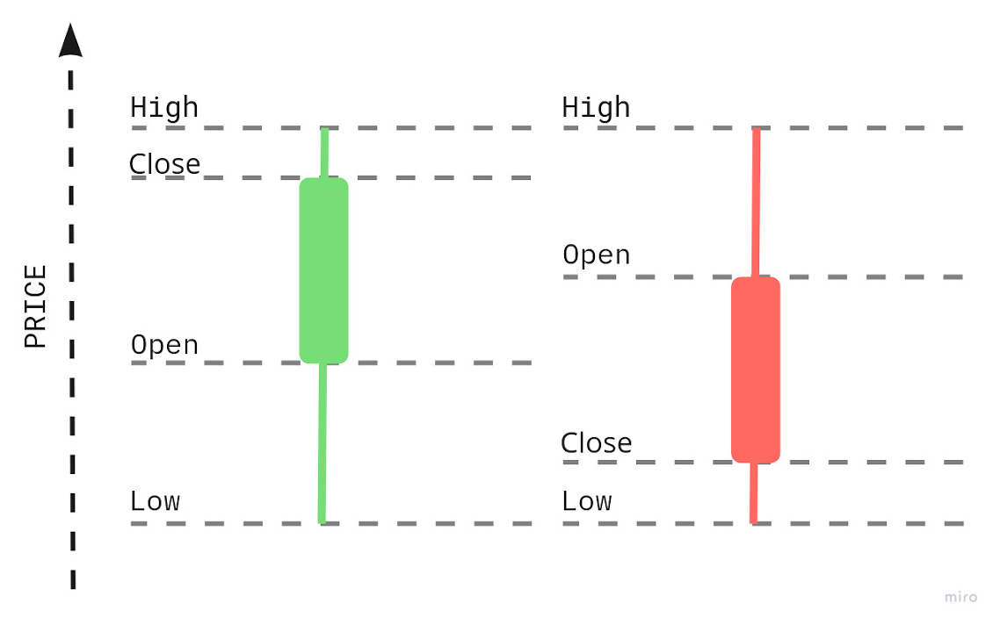

# Idiomatic OTP

## Objectives
- the concept
- initial implementation
- idiomatic solution

## The concept

In this chapter, we will look into building an OHLC(open-high-low-close) indicator. We will discuss different potential implementations, which will give us an excellent example to understand the idiomatic usage of the OTP framework.

The OHLC indicator consists of four prices that could be used to draw a candle on the chart:

```{r, fig.align="center", out.width="100%", echo=FALSE}

```

The OHLC indicators get created by collecting the first price (the "open" price), lowest price(the "low" price), highest price(the "high" price) and the last price(the "close" price) within a specific timeframe like 1 minute. Our code will need to be able to generate those for multiple timeframes at once - 1m, 5m, 15m, 1h, 4h and 24h.

## Initial implementation

What we could do is to have multiple GenServer processes subscribed to the trade events topic in the PubSub where each one would update their own OHLC numbers:

```{r, fig.align="center", out.width="100%", echo=FALSE}
knitr::include_graphics("images/chapter_19_02_multi_workers.jpg")
```

Let's start by creating a new application inside our umbrella called "indicators"(run below inside terminal):

```{r, engine = 'bash', eval = FALSE}
$ cd apps 
$ mix new indicator --sup
```

We can now create a new directory called "ohlc" inside the "/apps/indicator/lib/indicator" directory, where we will create the GenServer "worker.ex" file:

```{r, engine = 'elixir', eval = FALSE}
# /apps/indicator/lib/indicator/ohlc/worker.ex
defmodule Indicator.Ohlc.Worker do
  use GenServer

  def start_link({symbol, duration}) do
    GenServer.start_link(__MODULE__, {symbol, duration})
  end

  def init({symbol, duration}) do
    {:ok, {symbol, duration}}
  end
end
```

\newpage

As each worker will need to subscribe to the PubSub's `"TRADE_EVENTS:#{symbol}"` topic, we can update the `init/1` function to do that:

```{r, engine = 'elixir', eval = FALSE}
# /apps/indicator/lib/indicator/ohlc/worker.ex

  # add those at the top of the worker module
  require Logger

  @logger Application.compile_env(:core, :logger)
  @pubsub_client Application.compile_env(:core, :pubsub_client)

  ...

  # updated `init/1` function
  def init({symbol, duration}) do
    symbol = String.upcase(symbol)

    @logger.info("Initializing a new OHLC worker(#{duration} minutes) for #{symbol}")

    @pubsub_client.subscribe(
      Core.PubSub,
      "TRADE_EVENTS:#{symbol}"
    )

    {:ok, {symbol, duration}}
  end
```

Following the pattern established by the `Naive.Trader`, we use the module's attributes(with values based on the configuration) instead of hardcoded module names.

Additionally, we used the `Core.PubSub` module(and we will use other `core` module's structs down below) so we need to add the `core` application to the dependencies list of the `indicator` application:

```{r, engine = 'elixir', eval = FALSE}
# /apps/indicator/mix.exs
  defp deps do
    [
      {:core, in_umbrella: true} # <= added
      ...
```

As we subscribed to the PubSub, we need to provide a callback that will handle the incoming trade events:

```{r, engine = 'elixir', eval = FALSE}
# /apps/indicator/lib/indicator/ohlc/worker.ex
  # add this at the top
  alias Core.Struct.TradeEvent

  def handle_info(%TradeEvent{} = trade_event, ohlc) do
    {:noreply, Indicator.Ohlc.process(ohlc, trade_event)}
  end
```

To avoid mixing our business logic with the GenServer boilerplate(as discussed in the last chapter), we will place it in a new module. First, we need to create a new file `/apps/indicator/lib/indicator/ohlc.ex` and the `Indicator.Ohlc` module inside it:

```{r, engine = 'elixir', eval = FALSE}
# /apps/indicator/lib/indicator/ohlc.ex
defmodule Indicator.Ohlc do

end
```

The `Indicator.Ohlc` module will define a struct that the `Indicator.Ohlc.Worker` will use as a state:

```{r, engine = 'elixir', eval = FALSE}
# /apps/indicator/lib/indicator/ohlc.ex
  @enforce_keys [
    :symbol,
    :start_time,
    :duration
  ]
  defstruct [
    :symbol,
    :start_time,
    :duration,
    :open,
    :high,
    :low,
    :close
  ]
```

Most of the above are self-descriptive, besides the `start_time`(a Unix timestamp) and the `duration`(the timeframe in minutes).

We can now progress to the implementation of the `process/2` function, but instead of focusing on it, we will start from the "deepest"/"bottom" function that it will rely on and work our way up. As we discussed in the last chapter, we will try to maximize the amount of pure code. 

We can imagine that the bottom function will be involved in merging of the trade event's data with the current OHLC data. Two things can happen, either:

- trade event's `trade_time` is **within** the current OHLC timeframe. Trade event's price will get merged to the current OHLC
- trade event's `trade_time` is **outside** the current OHLC timeframe. The current(now old) OHLC will be returned together with a new OHLC based on the trade event's price

\newpage

Here's the implementation:

```{r, engine = 'elixir', eval = FALSE}
# /apps/indicator/lib/indicator/ohlc.ex
  def merge_price(%__MODULE__{} = ohlc, price, trade_time) do
    if within_current_timeframe(ohlc.start_time, ohlc.duration, trade_time) do
      {nil, %{ohlc | low: min(ohlc.low, price), high: max(ohlc.high, price), close: price}}
    else
      {ohlc, generate_ohlc(ohlc.symbol, ohlc.duration, price, trade_time)}
    end
  end
```

together with the `within_current_timeframe/3` and `generate_ohlc/3` function:

```{r, engine = 'elixir', eval = FALSE}
# /apps/indicator/lib/indicator/ohlc.ex
  def within_current_timeframe(start_time, duration, trade_time) do
    end_time = start_time + duration * 60
    trade_time = div(trade_time, 1000)

    start_time <= trade_time && trade_time < end_time
  end
  
  def generate_ohlc(symbol, duration, price, trade_time) do
    start_time = div(div(div(trade_time, 1000), 60), duration) * duration * 60

    %__MODULE__{
      symbol: symbol,
      start_time: start_time,
      duration: duration,
      open: price,
      high: price,
      low: price,
      close: price
    }
  end  
```

Moving up the call chain, besides merging the trade event's data into OHLC data, we need to deal with the initial state of the worker(the `{symbol, duration}` tuple). Let's add a `process/2` function with two clauses handling each of those cases:

```{r, engine = 'elixir', eval = FALSE}
# /apps/indicator/lib/indicator/ohlc.ex
  # add the below line at the top of the module
  alias Core.Struct.TradeEvent

  def process(%__MODULE__{} = ohlc, %TradeEvent{} = trade_event) do
    {old_ohlc, new_ohlc} = merge_price(ohlc, trade_event.price, trade_event.trade_time)
    maybe_broadcast(old_ohlc)
    new_ohlc
  end

  def process({symbol, duration}, %TradeEvent{} = trade_event) do
    generate_ohlc(symbol, duration, trade_event.price, trade_event.trade_time)
  end
```

The second clause takes care of the initial state of the OHLC worker(happens upon receiving the first trade event - once in the lifetime of the worker process).

The first clause handles all the other trade events.

This order of clauses could appear weird, but it makes a lot of sense as Elixir will try pattern match clauses from the top, and in our case, the first(top) clause will be used for almost all of the calls.

### Maybe functions

Let's get back to the first clause of the `process/2` function as it uses another Elixir/Erlang pattern that we didn't discuss before - the `maybe_do_x` functions.

In case of the incoming trade event's `trade_time` **outside** of the current OHLC's timeframe, we would like to **broadcast** the current OHLC and return a new OHLC(based on the trade event's data). Otherwise(trade event's `trade_time` **within** the current OHLC), the trade event's `price` is merged into the current OHLC, and it's **not** broadcasted.

This sounds very similar to the if-else, but it's most of the time achieved using the pattern matching:

```{r, engine = 'elixir', eval = FALSE}
# /apps/indicator/lib/indicator/ohlc.ex
 # add below lines at the top of the module
 require Logger

 @pubsub_client Application.compile_env(:core, :pubsub_client)

  defp maybe_broadcast(nil), do: :ok

  defp maybe_broadcast(%__MODULE__{} = ohlc) do
    Logger.debug("Broadcasting OHLC: #{inspect(ohlc)}")

    @pubsub_client.broadcast(
      Core.PubSub,
      "OHLC:#{ohlc.symbol}",
      ohlc
    )
  end
```

By using a separate function, we avoided branching using if-else inside the `process/2` function. The idea is not necessarily to avoid if statements but to keep the code at the consistent level of abstraction, so it's easier to understand. Inside the `process/2` function, we can understand what's going on just by reading the function names inside - there's no "logic".

Sometimes people advise that "code should be like well written prose" and `maybe_do_x` functions are one of the ways to achieve this "nirvana" state.

### Testing

At this moment, our code should compile, and we should already be able to test it. First, let's change the logging level to `debug` inside `config/config.exs` to see what OHLC structs got broadcasted:

```{r, engine = 'elixir', eval = FALSE}
# /config/config.exs
config :logger,
  level: :debug # <= updated
```

We can now progress with testing:

```{r, engine = 'bash', eval = FALSE}
$ iex -S mix
iex(1)> Streamer.start_streaming("XRPUSDT")
...
iex(2)> Indicator.Ohlc.Worker.start_link({"XRPUSDT", 1})
{:ok, #PID<0.447.0>}
...
22:45:00.335 [debug] Broadcasting OHLC: %Indicator.Ohlc{close: "0.63880000", duration: 1,
high: "0.63890000", low: "0.63840000", open: "0.63860000", start_time: 1644014640,
symbol: "XRPUSDT"}
```

The above test confirms that we can manually start a single OHLC worker that will aggregate data over a single minute timeframe.

### Supervision 

To supervise multiple `Indicators.Worker`s we will use the `DynamicSupervisor`.
We need to update the Indicators application's supervision tree to start a dynamic supervisor:

```{r, engine = 'elixir', eval = FALSE}
# /apps/indicator/lib/indicator/application.ex
    children = [
      {DynamicSupervisor, strategy: :one_for_one, name: Indicator.DynamicSupervisor}
    ]
```

\newpage

We can now add `aggregate_ohlcs/1` function that will start all workers:

```{r, engine = 'elixir', eval = FALSE}
# /apps/indicator/lib/indicator.ex
  def aggregate_ohlcs(symbol) do
    [1, 5, 15, 60, 4 * 60, 24 * 60]
    |> Enum.each(
      &DynamicSupervisor.start_child(
        Indicator.DynamicSupervisor,
        {Indicator.Ohlc.Worker, {symbol, &1}}
      )
    )
  end
```

We can now start multiple OHLC workers just by running a single function:

```{r, engine = 'bash', eval = FALSE}
$ iex -S mix
iex(1)> Streamer.start_streaming("XRPUSDT")
...
iex(2)> Indicator.aggregate_ohlcs("XRPUSDT")
{:ok, #PID<0.447.0>}
```

The above calls will start six OHLC worker processes supervised under the `Indicator.DynamicSupervisor` process.

We could continue with this exercise, add a Registry to be able to stop the indicators and a database to be able to autostart them. Those improvements would get the "indicators" application in line with the other applications, but that's not the goal of this chapter.

## Idiomatic solution

What we will focus on is the **usage of processes**(in our case the GenServers) in our solution. We've split our logic between multiple processes, each aggregating a single timeframe. All of those processes work in the same way. They subscribe to the PubSub topic, merge the incoming data into OHLC structs, and potentially broadcast them. The only difference is the timeframe that they use for merging data.

The solution feels very clean, but also we are using multiple processes to aggregate data for each symbol. In a situation like this, we should always ask ourselves:

- do we need that many processes?
- are we using them to achieve parallelism? Is it required?
- could we reorganize our code to use fewer processes?

The main idea is to keep our code as simple as possible and only use processes when it's absolutely required.

\newpage

Instead of a single worker being responsible for aggregation within a single timeframe, we could restructure our code to make it responsible for all timeframes of the symbol.

This improvement would:

- make our merging code a little bit complex(it would merge multiple timeframes at once)
- decrease the amount of PubSub subscribers by six (instead of six processes per symbol, we would have just one)
- potentially decrease the amount of broadcasted messages (we could group OHLC structs into a single message)
- allow a single worker single worker to decide what to do with all current OHLCs in case of errors, **without** need for any additional symbol supervision level(like `one_for_all`)
- make it **impossible** to aggregate nor broadcast OHLCS of the same symbol in **parallel**

We can see that the solution based on processes could get really complex really quickly(multiple processes per symbol, growing supervision tree, multiple subscriptions, multiple messages etc).

Just to be clear - processes **do** have their place, they are a really powerful tool, but as with every tool, the responsibility lies on us developers to use them wisely - they **must not** be used for code organization.

Enough theory - let's look into how we could update our `Indicator.Ohlc` module to be able to deal with multiple timeframes at once.

Initially, we could be tempted to update the `process/2` function:

```{r, engine = 'elixir', eval = FALSE}
# /apps/indicator/lib/indicator.ex
  def process([_ | _] = ohlcs, %TradeEvent{} = trade_event) do
    results =
      ohlcs
      |> Enum.map(&merge_price(&1, trade_event.price, trade_event.trade_time))

    results |> Enum.map(&maybe_broadcast(elem(&1, 0)))
    results |> Enum.map(&elem(&1, 1))
  end

  def process(symbol, %TradeEvent{} = trade_event) do
    [1, 5, 15, 60, 4 * 60, 24 * 60]
    |> Enum.map(
      &generate_ohlc(
        symbol,
        &1,
        trade_event.price,
        trade_event.trade_time
      )
    )
  end
```

We added some logic to both clauses. At this moment, it maybe doesn't look that bad, but it's a great place to mix even more logic with dirty code. This is a great example where we should stop and rethink how we could maximize the amount of pure code.

Instead of expanding the `process/2` function, we could built on top of the `merge_price/3` and `generate_ohlc/4` functions, which deal with a single OHLC data. We could add plural versions of those functions that will understand that we now deal with multiple OHLC structs:

```{r, engine = 'elixir', eval = FALSE}
# /apps/indicator/lib/indicator.ex
  def merge_prices(ohlcs, price, trade_time) do
    results =
      ohlcs
      |> Enum.map(&merge_price(&1, price, trade_time))

    {
      results |> Enum.map(&elem(&1, 0)) |> Enum.filter(& &1),
      results |> Enum.map(&elem(&1, 1))
    }
  end

  def generate_ohlcs(symbol, price, trade_time) do
    [1, 5, 15, 60, 4 * 60, 24 * 60]
    |> Enum.map(
      &generate_ohlc(
        symbol,
        &1,
        price,
        trade_time
      )
    )
  end
```

Now the `process/2` function got back to its almost original shape:

```{r, engine = 'elixir', eval = FALSE}
  def process([_ | _] = ohlcs, %TradeEvent{} = trade_event) do
    {old_ohlcs, new_ohlcs} = merge_prices(ohlcs, trade_event.price, trade_event.trade_time)

    old_ohlcs |> Enum.each(&maybe_broadcast/1)
    new_ohlcs
  end

  def process(symbol, %TradeEvent{} = trade_event) do
    generate_ohlcs(symbol, trade_event.price, trade_event.trade_time)
  end
```

By introducing the `merge_prices/3` and `generate_ohlcs/3` functions, we were able to keep the dirty part of our code small(it grew only to accommodate multiple broadcasts). The new functions are pure and can be easily tested.

As we modified the interface of the `process/2` function (by removing the `duration`), we need to update the `Indicator.Ohlc.Worker` module to be blissfully not aware that we have different durations:

```{r, engine = 'elixir', eval = FALSE}
# /apps/indicator/lib/indicator/ohlc/worker.ex
  def start_link(symbol) do # <= duration removed
    GenServer.start_link(__MODULE__, symbol)  # <= duration removed
  end

  def init(symbol) do  # <= duration removed
    symbol = String.upcase(symbol)

    @logger.debug("Initializing new a OHLC worker for #{symbol}") # <= duration skipped

    ...

    {:ok, symbol}  # <= duration removed
  end
```

The final update will be to simplify the `Indicator.aggregate_ohlcs/1` function just to start a single OHLC worker:

```{r, engine = 'elixir', eval = FALSE}
# /apps/indicator/lib/indicator.ex
  def aggregate_ohlcs(symbol) do
    DynamicSupervisor.start_child(
      Indicator.DynamicSupervisor,
      {Indicator.Ohlc.Worker, symbol}
    )
  end
```

We can now test our implementation by running the following once again:

```{r, engine = 'bash', eval = FALSE}
$ iex -S mix
iex(1)> Streamer.start_streaming("XRPUSDT")
...
iex(2)> Indicator.Ohlc.Worker.start_link("XRPUSDT")
...
23:23:00.416 [info]  Broadcasting OHLC: %Indicator.Ohlc{close: "0.68230000", duration: 1,
high: "0.68330000", low: "0.68130000", open: "0.68160000", start_time: 1644189720,
symbol: "XRPUSDT"}
```

The logged message(s) confirms that our OHLC aggregator logic works as expected using a single process.

In the case of the OHLC aggregator, we've seen that there are some trade-off between running multiple processes(simpler code) vs single process(more complex merging) - it could be unclear what's the benefit of limiting the usage of processes(especially that they are "almost free").

I totally understand. Please treat this chapter as an introduction to the idiomatic Elixir. In the next chapter, we will apply this concept when refactoring the Naive trading strategy to see its practical benefits.

[Note] Please remember to run the `mix format` to keep things nice and tidy.

The source code for this chapter can be found on [GitHub](https://github.com/Cinderella-Man/hands-on-elixir-and-otp-cryptocurrency-trading-bot-source-code/tree/chapter_19)
