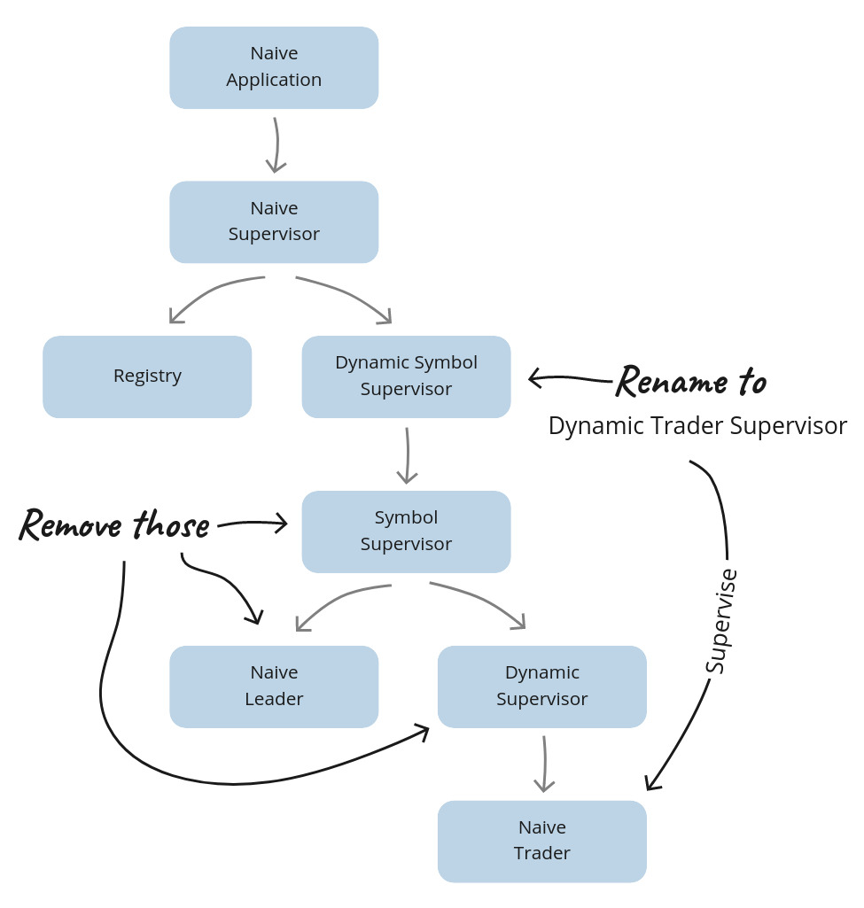

# 惯用式交易策略 {#19-idiomatic-trading-strategy}

在上一章中，我们用 OHLC 指标证明了一件事：进程越少、纯函数越多，系统就越简单。
我们把每个 symbol 的六个 GenServer 进程减少到一个，代码在每一个可衡量的维度上都变得更好了——更少的 PubSub 订阅、更平坦的监督树、更容易测试。

但 OHLC 指标是一个干净、独立的例子。我们的朴素交易策略则完全不是这样。
现在，每个 symbol 都会启动多个 `Trader` 进程，每个进程由一个专门的 `Leader` 管理，全部都包在一个 `SymbolSupervisor` 里。
`Leader` 负责 rebuy、在多个 trader 之间跟踪状态，以及协调 shutdown。
对于一个本质上是顺序决策过程的东西来说，这套机器有点太多了。

在本章中，我们会把同样的原则应用到交易策略本身。
我们会把多个 trader 进程合并成每个 symbol 一个进程。我们会彻底删除 `Leader` 和 `SymbolSupervisor`。
我们会把 rebuy 逻辑和 shutdown 处理移动到它们真正该在的地方：纯策略代码中。

结果会是一个大幅简化的系统。不是因为我们偷工减料，而是因为我们把逻辑放到了真正合理的位置——纯函数里，而不是进程层级里。

## 目标
- 跟随 OHLC 的脚步
- 简化 Naive 监督树
- 支持多个 position
- 改造 “shutdown” 功能
- 更新 Strategy 以处理 rebuy
- 获取活跃 position
- 清理收尾

## 跟随 OHLC 的脚步

OHLC 的重构给了我们一个干净、独立的概念验证。
现在我们会把同样的思路应用到系统中一个更杂乱、联系更紧密的部分。
我们会更新 `Naive.Trader` 进程，让它负责单个 symbol 上的多个交易（从现在开始我们称它们为 “positions”）。
这样一来，每个 symbol 只会有一个 `Naive.Trader` 进程，
而我们会把 `Naive.Leader`（我们会把 rebuy/shutdown 逻辑移到策略中——它本来就应该在那里）和 `Naive.SymbolSupervisor` 都去掉：

```{r, fig.align="center", out.width="100%", echo=FALSE}

```

简化监督层级有很多好处，我们会在重构代码的过程中认真看它们——开始吧。

## 简化 Naive 监督树

从树的最上层开始，我们首先需要更新的是 `Naive.DynamicSymbolSupervisor` 模块。

### `Naive.DynamicTraderSupervisor` 模块

文件名需要更新为 `dynamic_trader_supervisor.ex`，模块名更新为 `Naive.DynamicTraderSupervisor`。

接下来，要把 `@registry` 属性改名为 `:naive_traders`。

最后，把指向 `Naive.SymbolSupervisor` 的 alias 更新为 `Naive.Trader`，并在 `start_child/1` 函数里使用它：

```{r, engine = 'elixir', eval = FALSE}
  # /apps/naive/lib/naive/dynamic_trader_supervisor.ex
  alias Naive.Trader 
  ...
  defp start_child(args) do
    DynamicSupervisor.start_child(
      __MODULE__,
      {Trader, args}
    )
  end
```

### `Naive` 模块

`Naive` 模块高度依赖 `Naive.DynamicSymbolSupervisor`（现在叫 `Naive.DynamicTraderSupervisor`），所以我们需要更新所有对它的引用：

```{r, engine = 'elixir', eval = FALSE}
  # /apps/naive/lib/naive.ex
  alias Naive.DynamicTraderSupervisor
  ...
  |> DynamicTraderSupervisor.start_worker()
  ...
  |> DynamicTraderSupervisor.stop_worker()
  ...
  |> DynamicTraderSupervisor.shutdown_worker()
```

### `Naive.Supervisor` 模块

`Naive.Supervisor` 监督着 `Naive.DynamicSymbolSupervisor`（现在叫 `Naive.DynamicTraderSupervisor`）以及存储 trader PID 的 registry——我们需要把这两处都更新：

```{r, engine = 'elixir', eval = FALSE}
  # /apps/naive/lib/naive/supervisor.ex
  alias Naive.DynamicTraderSupervisor # <= updated

  @registry :naive_traders # <= updated
  ...
    children = [
      {Registry, [keys: :unique, name: @registry]},
      {DynamicTraderSupervisor, []}, # <= updated
      {Task,
       fn ->
         DynamicTraderSupervisor.autostart_workers() # <= updated
       end}
    ]
```

### `Naive.Trader` 模块

最后一个需要更新的模块是 `Naive.Trader`。它需要把进程 PID 注册到 Registry 里：

```{r, engine = 'elixir', eval = FALSE}
  # /apps/naive/lib/naive/trader.ex
  @registry :naive_traders # <= added
  ...
  def start_link(%State{} = state) do
    symbol = String.upcase(state.symbol) # <= updated

    GenServer.start_link(
      __MODULE__,
      state,
      name: via_tuple(symbol)  # <= updated
    )
  end
  ...
  defp via_tuple(symbol) do
    {:via, Registry, {@registry, symbol}}
  end
```

这样监督树的改动就完成了——`Naive.Leader` 和 `Naive.SymbolSupervisor` 已经不再使用。
但此时我们的代码库还不能正常工作，因为我们需要把 `Naive.Leader` 提供的功能
重新补进 `Naive.Trader` 和 `Naive.Strategy` 模块里，接下来我们会处理这个问题。

## 支持多个 position

监督树简化之后，我们就遇到了一个新问题：我们的单个 `Naive.Trader` 进程现在需要管理过去分散在多个进程中的事情。
当前 `Naive.Trader` 里的 `State` 结构体是为单次交易循环准备的——
它根本不知道多个并发 position 是什么。
我们需要两样东西：一个新的 `Naive.Trader` `State`，用于保存 settings 和 position 列表；
以及一个 `Position` 结构体，用来描述每个独立的交易循环是什么样子。
我们先把当前 `Naive.Trader` 里的 `State` 结构体移到 `Naive.Strategy` 里，并把它重命名为 `Position`：


```{r, engine = 'elixir', eval = FALSE}
# /apps/naive/lib/naive/strategy.ex
defmodule Naive.Strategy do
  ...
  defmodule Position do
    @enforce_keys [
	# keys copied from `Naive.Trader.State` struct
    ]
    defstruct [
	# keys copied from `Naive.Trader.State` struct
    ]
  end
```

这会打断 `Naive.Strategy` 里所有对 `Naive.Trader.State` 的引用，我们需要把它们改成 `Position`（并删除 `Naive.Trader.State` 的 alias）：

```{r, engine = 'elixir', eval = FALSE}
  # /apps/naive/lib/naive/strategy.ex
  ...
  def execute(%TradeEvent{} = trade_event, %Position{} = position) do
    generate_decision(trade_event, position)
    |> execute_decision(position)
  end
  ...
  def generate_decision(
        %TradeEvent{
          ...
        },
        %Position{ # <= in all 6 clauses
        ...
  ...

  def generate_decision(%TradeEvent{}, _position) do
    :skip
  end

  defp execute_decision(
    {.... # decision },
    %Position{ # <= updated
      ...
    } = position # <= updated
  ) do
    ...
    new_position = %{position | buy_order: order} # <= updated
    @leader.notify(:trader_state_updated, new_position) # <= updated
    {:ok, new_position} # <^= similar changes in all execute_decision
```

我们先忽略这样一个事实：我们现在还在调用 `@leader`，而且在策略内部仍然只处理单个 position——
这个问题会在下一节修掉。一点一点来；

既然我们已经在把策略改成处理 position，那就顺手更新所有 logger 消息：

```{r, engine = 'elixir', eval = FALSE}
  # /apps/naive/lib/naive/strategy.ex
  defp execute_decision(
         {:place_buy_order, price, quantity},
         ...
  ) do
    @logger.info(
      "Position (#{symbol}/#{id}): " <>
        "Placing a BUY order @ #{price}, quantity: #{quantity}"
    ) # ^ updated message
  ...

  defp execute_decision(
        {:place_sell_order, sell_price},
        ...
  ) ... do
  @logger.info(
    "Position (#{symbol}/#{id}): " <>
      "Placing a SELL order @ #{sell_price}, quantity: #{quantity}"
  ) # ^ updated message
  ...

  defp execute_decision(
         :fetch_buy_order,
         ...
  ) ... do
    @logger.info("Position (#{symbol}/#{id}): The BUY order is now filled")
    ... # ^^^ updated message

  defp execute_decision(
         :exit,
         ...
  ) do
    @logger.info("Position (#{symbol}/#{id}): Trade cycle finished")
    ... # ^^^ updated message

  defp execute_decision(
         :fetch_sell_order,
         ...
  ) do
    @logger.info("Position (#{symbol}/#{id}): The SELL order is now filled")
     ... # ^^^ updated message

  defp execute_decision(
         :rebuy,
         ...
  ) do
    @logger.info("Position (#{symbol}/#{id}): Rebuy triggered")
     ... # ^^^ updated message
```

我们的代码离真正可用还很远，但我们正在逐步把它改造成可以处理多个 position 的样子。

### 初始化

此时，`Naive.Trader` 还期望在启动时注入 `state`（通过 `start_link/1` 函数）。
我们之所以能这样做，是因为 `Naive.Leader` 会先获取 settings，再构建 fresh trader state。

先更新 `Naive.Trader` 的 `State`——现在它会保存 symbol 的 settings（以前由 leader 保存）以及 position 列表（`Naive.Strategy.Position` 结构体的列表）：

```{r, engine = 'elixir', eval = FALSE}
  # /apps/naive/lib/naive/trader.ex
  defmodule State do
    @enforce_keys [:settings, :positions]
    defstruct [:settings, positions: []]
  end
```

接下来我们要更新 `start_link/1` 和 `init/1` 函数，并添加 `handle_continue/2` 回调来获取 settings，
并把它们和一个初始 position 一起存入 state：

```{r, engine = 'elixir', eval = FALSE}
  # /apps/naive/lib/naive/trader.ex
  alias Naive.Strategy
  ...

  def start_link(symbol) do # <= now expecting symbol
    symbol = String.upcase(symbol) # <= updated

    GenServer.start_link(
      __MODULE__,
      symbol,   # <= updated
      name: via_tuple(symbol)
    )
  ...

  def init(symbol) do # <= updated
    @logger.info("Initializing new trader for #{symbol}") # <= updated

    @pubsub_client.subscribe(
      Core.PubSub,
      "TRADE_EVENTS:#{symbol}"
    )

    {:ok, nil, {:continue, {:start_position, symbol}}} # <= updated
  end

  def handle_continue({:start_position, symbol}, _state) do
    settings = Strategy.fetch_symbol_settings(symbol)
    positions = [Strategy.generate_fresh_position(settings)]

    {:noreply, %State{settings: settings, positions: positions}}
  end # ^^^ new function/callback
```

`Naive.Trader` 启动时，会从 `init/1` 返回 `{:continue, ...}` 元组。
这会让 `handle_continue/2` 回调异步执行。
在里面，我们会获取 settings，并把一个新的 position 加入 position 列表——两者都存储在 Trader 的 state 中。

这里有一个需要注意的取舍：把所有 position 合并到一个进程里之后，
我们就失去了每个 position 独立的故障隔离。如果一个 position 的执行崩溃，
同一个 symbol 的所有 position 都会一起倒下。
DynamicSupervisor 会重启 trader，而我们也可以从数据库里恢复 state，
但这和之前相比是另一种故障模式。我们会在最后思考里重新看这个取舍。

**兜了一圈回来了**：注意我们又开始在 Trader 里使用 `handle_continue` 了——
这和第 2 章里我们最开始用的模式一样。但上下文已经变化了：那时每个 Trader 都要自己获取 `tick_size`。
然后在第 5 章里，我们把这个责任移到了 Leader。现在，随着架构简化，
Trader 又一次负责自己的初始化——但这次它要获取的是 settings，并为一个更复杂的交易系统创建 positions。

`handle_continue/2` 回调里原先的两个函数都属于 `Naive.Leader`——我们需要把它们移到 `Naive.Strategy`：

```{r, engine = 'elixir', eval = FALSE}
  # /apps/naive/lib/naive/strategy.ex
  alias Naive.Schema.Settings
  ...
  @repo Application.compile_env(:naive, :repo)
  ...
  def fetch_symbol_settings(symbol) do
    {:ok, exchange_info} = @binance_client.get_exchange_info()
    db_settings = @repo.get_by!(Settings, symbol: symbol)

    merge_filters_into_settings(exchange_info, db_settings, symbol)
  end

  def merge_filters_into_settings(exchange_info, db_settings, symbol) do
    symbol_filters =
      exchange_info
      |> Map.get(:symbols)
      |> Enum.find(&(&1["symbol"] == symbol))
      |> Map.get("filters")

    tick_size =
      symbol_filters
      |> Enum.find(&(&1["filterType"] == "PRICE_FILTER"))
      |> Map.get("tickSize")

    step_size =
      symbol_filters
      |> Enum.find(&(&1["filterType"] == "LOT_SIZE"))
      |> Map.get("stepSize")

    Map.merge(
      %{
        tick_size: tick_size,
        step_size: step_size
      },
      db_settings |> Map.from_struct()
    )
  end

  def generate_fresh_position(settings, id \\ :os.system_time(:millisecond)) do
    %{
      struct(Position, settings)
      | id: id,
        budget: D.div(settings.budget, settings.chunks),
        rebuy_notified: false
    }
  end
```

在上面的代码里，我们修改了 `fetch_symbol_settings/1` 函数，让它先从 Binance 和数据库获取 settings，
然后再继续处理“纯”的那部分。
这个改动让我们在不使用 mock 的情况下，也能轻松测试大部分逻辑。

`generate_fresh_position/2` 以前在 `Naive.Leader` 里叫 `fresh_trader_state/1`。
它会在函数内部基于当前系统时间分配一个 `id`。
这让它稍微难测一点，因为我们没法知道那里应该期待什么值。
现在把 `id` 提到参数里，并在外部赋值当前时间后，我们只需要传入一个虚拟值就能测试它了。

我们现在在 `Naive.Strategy` 中使用了 `@repo`，所以需要把它加到配置文件里（包括测试配置）：

```{r, engine = 'elixir', eval = FALSE}
# /config/config.exs
config :naive,
  ...
  repo: Naive.Repo,
```

```{r, engine = 'elixir', eval = FALSE}
# /config/test.exs
config :naive,
  ...
  repo: Test.Naive.RepoMock
```

### 并行化策略

现在我们可以继续处理策略了，但先更新 `Naive.Trader`，让它把 positions 和 settings 分开传递：

```{r, engine = 'elixir', eval = FALSE}
  # /apps/naive/lib/naive/trader.ex
  def handle_info(%TradeEvent{} = trade_event, %State{} = state) do
    case Naive.Strategy.execute(trade_event, state.positions, state.settings) do # <= updated
      {:ok, updated_positions} -> # <= updated
        {:noreply, %{state | positions: updated_positions}} # <= updated

      :exit ->
        {:stop, :normal, state}
    end
  end
```

我们需要所有 `positions` 来遍历它们，决定并执行相应动作。
`settings` 稍后也会在策略里用到，但我们现在先把它传过去，免得之后来回折腾。

另外，我们还把 `case` 的匹配更新成了：它会期待一个更新后的 position 列表，我们会把这个列表赋给 Trader 的 state。

现在我们可以修改 `Naive.Strategy` 来处理多个 position：

```{r, engine = 'elixir', eval = FALSE}
   # /apps/naive/lib/naive/strategy.ex
  def execute(%TradeEvent{} = trade_event, positions, settings) do
    generate_decisions(positions, [], trade_event, settings)
    |> Enum.map(fn {decision, position} ->
      Task.async(fn -> execute_decision(decision, position, settings) end)
    end)
    |> Task.await_many()
    |> then(&parse_results/1)
  end
```

上面用到的大部分函数我们还要写，但思路已经很清楚了。
我们会把生成出来的每个 decision 映射成异步 task，让它们执行。
然后等待所有 task 完成，再解析结果。

值得注意的是，`Task.async/1` 会把新起的 task 和调用者进程链接起来。
如果任何一个 `execute_decision` 调用崩溃，整个 `Naive.Trader` 进程都会挂掉——
而这正是我们想要的，因为 `Naive.DynamicSupervisor` 会重启它。
如果我们需要让单个 task 独立失败，那就应该改用 `Task.Supervisor.async_nolink/2`。

首先，我们调用一个新的函数 `generate_decisions/4`，它是在现有 `generate_decision/2` 之上的递归函数：

```{r, engine = 'elixir', eval = FALSE}
  # /apps/naive/lib/naive/strategy.ex
  def generate_decisions([], generated_results, _trade_event, _settings) do
    generated_results
  end

  def generate_decisions([position | rest] = positions, generated_results, trade_event, settings) do
    current_positions = positions ++ (generated_results |> Enum.map(&elem(&1, 1)))

    case generate_decision(trade_event, position, current_positions, settings) do
      decision ->
        generate_decisions(
          rest,
          [{decision, position} | generated_results],
          trade_event,
          settings
        )
    end
  end
```

这里我们用了 `case`，而不是简单的变量绑定，因为马上我们就要对 `:exit` 和 `:rebuy` 这样的特定 decision 做模式匹配。

此时，`generate_decisions/4` 看起来可能像一个过度设计的 `Enum.map/2`，
但实际上我们是在为本章后续更新铺路（让剩余功能继续工作）。
关键细节是第 3 行的 `current_positions`——
它把还没处理的 positions 和已经决定好的 positions 合并了起来。
这让每次 `generate_decision/4` 调用都能看到全局视图，
rebuy 逻辑检查当前有多少 position 打开时会用到这个信息。

要注意的是，我们现在向 `generate_decision` 函数传入了四个参数——
我们新增了 `current_positions` 和 `settings`，后续更新会需要它们。
不过目前，我们会把 **所有** `generate_decision/2` 子句都更新成带两个额外参数：

```{r, engine = 'elixir', eval = FALSE}
  # /apps/naive/lib/naive/strategy.ex
  def generate_decision(
        %TradeEvent{...},
        %Position{
          ...
        },
        _positions, # <= add this 7 times
       _settings    # <= add this 7 times
      ) do
```


现在回到主 `execute/3` 函数，我们会调用 `execute_decision/3`，它也需要更新（**所有**子句都要改）：

```{r, engine = 'elixir', eval = FALSE}
  # /apps/naive/lib/naive/strategy.ex
  defp execute_decision(
         {...},
         %Position{
           ...
         } = position,
         _settings  # <= added 7 times
       ) do
```

`execute/3` 调用的最后一个函数是 `parse_results/1`，它会把所有结果聚合成一个 tuple：

```{r, engine = 'elixir', eval = FALSE}
  # /apps/naive/lib/naive/strategy.ex
  def parse_results([_ | _] = results) do
    results
    |> Enum.map(fn {:ok, new_position} -> new_position end)
    |> then(&{:ok, &1})
  end
```

此时我们应该已经可以运行单次交易循环的代码了。
注意，`parse_results/1` 现在只匹配 `{:ok, _}` tuple——
当交易循环完成并返回 `:exit` 时，它会崩溃。我们很快就会修掉这个问题：

```{r, engine = 'bash', eval = FALSE}
$ iex -S mix
...
iex(1)> Naive.start_trading("XRPUSDT")
...
iex(2)> Streamer.start_streaming("XRPUSDT")
21:29:17.998 [info]  Starting streaming XRPUSDT trade events
...
21:29:21.037 [info]  Position (XRPUSDT/1651696014179): Placing a BUY order @ 0.64010000,
quantity: 31.00000000
21:29:21.037 [error] Task #PID<0.10293.0> started from #PID<0.480.0> terminating
** (stop) exited in: GenServer.call(:"Elixir.Naive.Leader-XRPUSDT"...
```

所以现在 trader 会启动并挂出买单，但随后它会尝试把新 state 更新给 leader——
我们可以把 `execute_decision/3` 函数里更新 leader 的逻辑删掉（**所有**子句都要改）：

```{r, engine = 'elixir', eval = FALSE}
    # /apps/naive/lib/naive/strategy.ex
  defp execute_decision(
    ...
       ) do
    ...
    # convert the below:
    new_position = %{position | buy_order: order}
    @leader.notify(:trader_state_updated, new_position)
    {:ok, new_position}
    # to:
    {:ok, %{position | buy_order: order}}
  end
```

对所有 `execute_decision/3` 子句做类似修改，删掉对 `@leader` 的引用——别忘了把这个模块属性也删掉，因为我们已经不需要它了。

一个重要提醒：这些对 `@leader` 的引用里，有一个是通知 rebuy 已经触发的：

```{r, engine = 'elixir', eval = FALSE}
    # /apps/naive/lib/naive/strategy.ex
    @leader.notify(:rebuy_triggered, new_position)
```

这个引用也要一起删掉。rebuy 功能我们会在下一节重新处理。

现在我们可以重新运行代码：

```{r, engine = 'bash', eval = FALSE}
$ iex -S mix
...
iex(1)> Streamer.start_streaming("XRPUSDT")
...
iex(2)> Naive.start_trading("XRPUSDT")
...
21:59:19.836 [info]  Position (XRPUSDT/1651697959836): Placing a BUY order @ 2945.31000000,
quantity: 0.06790000
21:59:46.940 [info]  Position (XRPUSDT/1651697959836): The BUY order is now filled
21:59:46.997 [info]  Position (XRPUSDT/1651697959836): Placing a SELL order @ 2947.66000000,
quantity: 0.06790000
22:00:21.631 [info]  Position (XRPUSDT/1651697959836): The SELL order is now filled
22:00:21.734 [info]  Position (XRPUSDT/1651697959836): Trade cycle finished
22:00:21.737 [error] GenServer {:naive_traders, "XRPUSDT"} terminating
** (FunctionClauseError) no function clause matching in anonymous fn/1 in
Naive.Strategy.parse_results/1
    (naive 0.1.0) lib/naive/strategy.ex:56: anonymous fn(:exit) in
    Naive.Strategy.parse_results/1
```

可以看到，trader 进程现在已经能完整走完整个交易循环，
但在第一轮交易完成后，它没法再启动一个新的 position，因为返回了 `:exit`。

要修复这个问题，我们需要把负责匹配交易循环结束的 `generate_decision/4` 子句，返回 `:finished` 而不是 `:exit`：

```{r, engine = 'elixir', eval = FALSE}
  # /apps/naive/lib/naive/strategy.ex
  def generate_decision(
        %TradeEvent{},
        %Position{
          sell_order: %Binance.OrderResponse{
            status: "FILLED"
          }
        },
        _positions,
        _settings
      ) do
    :finished # <= updated
  end
```

这个 decision 会落到之前返回 `:exit` 的 `execute_decision/3` 子句里，
而这正是导致错误的地方——我们把这个子句移到最后，并把它的主体改成生成 fresh state，而不是返回一个哑 atom：

```{r, engine = 'elixir', eval = FALSE}
  # /apps/naive/lib/naive/strategy.ex
  defp execute_decision(
         :finished, # <= previously :exit; updated
         %Position{
           id: id,
           symbol: symbol
         },
         settings # <= now used
       ) do
    new_position = generate_fresh_position(settings) # <= added

    @logger.info("Position (#{symbol}/#{id}): Trade cycle finished")

    {:ok, new_position} # <= updated
  end
```

此时，我们的 trader 进程应该已经可以连续跑多个交易循环了：

```
$ iex -S mix
...
iex(1)> Streamer.start_streaming("XRPUSDT")
...
iex(2)> Naive.start_trading("XRPUSDT")
...
22:46:46.568 [info]  Position (XRPUSDT/1651697959836): Trade cycle finished
22:46:46.577 [info]  Position (XRPUSDT/1651697959836): Placing a BUY order @ 2945.31000000,
  quantity: 0.06790000
```

到这里，和让 trader / strategy 支持多个 position 直接相关的改动就完成了，
但它还缺少 `Naive.Leader` 之前提供的全部功能。
接下来我们会继续迭代这份代码，把缺失的功能补回来。

## 改造 “shutdown” 功能

以前，shutdown 逻辑散落在 `Naive.Leader` 的多个位置里，比如 rebuy 触发的时候——要确保在 “shutdown” 状态下不会再启动新的 Trader 进程。

现在，我们有机会把 shutdown 功能变成策略的一部分。

我们先从修改 `DynamicTraderSupervisor` 开始，把 `shutdown_worker/1` 函数改成调用 `Naive.Trader`，而不是 `Naive.Leader`：

```{r, engine = 'elixir', eval = FALSE}
  # /apps/naive/lib/naive/dynamic_trader_supervisor.ex
  def shutdown_worker(symbol) when is_binary(symbol) do
    Logger.info("Shutdown of trading on #{symbol} initialized")
    {:ok, settings} = update_status(symbol, "shutdown")
    Trader.notify(:settings_updated, settings) # <= updated
    {:ok, settings}
  end
```

现在，Trader 会负责更新 settings，接下来我们会添加这部分逻辑。不过在此之前，
我们应该把 `update_status/2` 函数移动到 `Naive.Strategy` 里，因为它会被 `DynamicTraderSupervisor` 和 `Naive.Strategy` 两边都用到：

```{r, engine = 'elixir', eval = FALSE}
  # /apps/naive/lib/naive/strategy.ex
  def update_status(symbol, status) # <= updated to public
      when is_binary(symbol) and is_binary(status) do
    @repo.get_by(Settings, symbol: symbol) # <= updated to use @repo
    |> Ecto.Changeset.change(%{status: status})
    |> @repo.update() # <= updated to use @repo
  end
```

现在我们需要更新 `DynamicTraderSupervisor` 模块，让它调用 `Naive.Strategy` 模块里的 `update_status/2`：

```{r, engine = 'elixir', eval = FALSE}
  # /apps/naive/lib/naive/dynamic_trader_supervisor.ex
  alias Naive.Strategy
  ...

  def start_worker(symbol) do
    ...
    Strategy.update_status(symbol, "on") # <= updated
    ..

  def stop_worker(symbol) do
    ...
    Strategy.update_status(symbol, "off") # <= updated
    ...

  def shutdown_worker(symbol) when is_binary(symbol) do
    ...
    {:ok, settings} = Strategy.update_status(symbol, "shutdown") # <= updated
```

### 处理更新后的 settings

现在我们可以继续处理 `Naive.Trader` 模块了，在这里我们需要新增一个 `notify/2` 接口函数：

```{r, engine = 'elixir', eval = FALSE}
  # /apps/naive/lib/naive/trader.ex
  def notify(:settings_updated, settings) do
    call_trader(settings.symbol, {:update_settings, settings})
  end
  ...
  defp call_trader(symbol, data) do
    case Registry.lookup(@registry, symbol) do
      [{pid, _}] ->
        GenServer.call(
          pid,
          data
        )

      _ ->
        Logger.warning("Unable to locate trader process assigned to #{symbol}")
        {:error, :unable_to_locate_trader}
    end
  end
```

`notify/2` 函数是 `Naive.Trader` 模块公共接口的一部分。
它通过 `call_trader/2` 辅助函数，把在 Registry 里查找 Trader 进程以及发起 `GenServer.call` 这件事隐藏起来。
除了“查找”本身是一个需要抽象的实现细节外，
我们在后面还会用到查找 trader PID 的能力，以提供更多功能。

既然我们要向 trader 进程发起调用，就需要加一个回调：

```{r, engine = 'elixir', eval = FALSE}
  # /apps/naive/lib/naive/trader.ex
  def handle_call(
        {:update_settings, new_settings},
        _,
        state
      ) do
    {:reply, :ok, %{state | settings: new_settings}}
  end
```

### 让 `Naive.Strategy` 遵守 “shutdown” 状态

我们已经更新了所有模块，让它们都能更新 `Trader` 进程的 `%State{}` 里的 settings。
这是第一步，但现在我们还需要让策略按正确方式响应。

第一步是更新处理 rebuy 触发的 `generate_decision/4` 子句，把 `settings.status` 考虑进去：

```{r, engine = 'elixir', eval = FALSE}
  # /apps/naive/lib/naive/strategy.ex
  def generate_decision(
        %TradeEvent{
          price: current_price
        },
        %Position{
          buy_order: %Binance.OrderResponse{
            price: buy_price
          },
          rebuy_interval: rebuy_interval,
          rebuy_notified: false
        },
        _positions,
        settings # <= updated
      ) do
    if trigger_rebuy?(buy_price, current_price, rebuy_interval) &&
         settings.status != "shutdown" do # <= updated
      :rebuy
    else
      :skip
    end
  end
```

另一个需要更新的子句，是负责匹配交易循环结束的那个：

```{r, engine = 'elixir', eval = FALSE}
  # /apps/naive/lib/naive/strategy.ex
  def generate_decision(
        %TradeEvent{},
        %Position{
          sell_order: %Binance.OrderResponse{
            status: "FILLED"
          }
        },
        _positions,
        settings # <= updated
      ) do
    if settings.status != "shutdown" do # <= updated
      :finished
    else
      :exit # <= new decision
    end
  end
```

既然我们加了一个新的 `:exit` decision，就需要在 `generate_decisions/4` 里处理它——
它应该把这个 decision 从已生成决策列表中移除：

```{r, engine = 'elixir', eval = FALSE}
  # /apps/naive/lib/naive/strategy.ex
  def generate_decisions([position | rest] = positions, generated_results, trade_event, settings) do
    ...
    case generate_decision(trade_event, position, current_positions, settings) do
      :exit ->
        generate_decisions(rest, generated_results, trade_event, settings)

      decision -> ...
      ...
```

在这个递归函数里，我们把所有最后变成 `:exit` 的 positions 都跳过了。
这会慢慢把 position 列表耗尽，最终变成空列表，这会让 `parse_results/1` 函数失败（因为它要求的是非空列表）。
我们会添加一个新的第一个子句来匹配空的 position 列表，并返回 `:exit` atom：

```{r, engine = 'elixir', eval = FALSE}
  # /apps/naive/lib/naive/strategy.ex
  def parse_results([]) do # <= added clause
    :exit
  end

  def parse_results([_ | _] = results) do
    ...
  end
```

最后，`:exit` atom 会让 `Naive.Trader` 模块停止进程。
最后一步是更新 `Naive.Trader`，在退出进程之前记录日志并把状态更新为 `"off"`：

```{r, engine = 'elixir', eval = FALSE}
  # /apps/naive/lib/naive/trader.ex
  def handle_info(%TradeEvent{} = trade_event, %State{} = state) do
    ...
    case Naive.Strategy.execute(trade_event, state.positions, state.settings) do
      ...
      :exit ->
        {:ok, _settings} = Strategy.update_status(trade_event.symbol, "off")
        Logger.info("Trading for #{trade_event.symbol} stopped")
        {:stop, :normal, state}
```

我们可以通过运行下面的命令来测试：

```{r, engine = 'bash', eval = FALSE}
$ iex -S mix
...
iex(1)> Streamer.start_streaming("XRPUSDT")
...
iex(4)> Naive.start_trading("XRPUSDT")
...
iex(4)> Naive.shutdown_trading("XRPUSDT")
22:35:58.929 [info]  Shutdown of trading on XRPUSDT initialized
23:05:40.068 [info]  Position (XRPUSDT/1651788334058): The SELL order is now filled.
23:05:40.123 [info]  Trading for XRPUSDT stopped
```

这样 shutdown 功能就完成了。如前所述，position 会一个接一个地完成交易循环，
然后整个进程会在最后退出。

## 更新 Strategy 以处理 rebuy

以前，rebuy 功能由 `Trader` 和 `Leader` 共同参与。
现在 `Leader` 已经被移除，这正是把尽可能多的逻辑移进策略里的好机会。

我们先更新负责 rebuy 场景的 `generate_decision/4` 子句。
我们会把当前打开的 position 数量也考虑进去（这以前是在 `Naive.Leader` 里完成的）：

```{r, engine = 'elixir', eval = FALSE}
  # /apps/naive/lib/naive/strategy.ex
  def generate_decision(
        %TradeEvent{
          price: current_price
        },
        %Position{
          buy_order: %Binance.OrderResponse{
            price: buy_price
          },
          rebuy_interval: rebuy_interval,
          rebuy_notified: false
        },
        positions, # <= updated
        settings
      ) do
    if trigger_rebuy?(buy_price, current_price, rebuy_interval) &&
         settings.status != "shutdown" &&
         length(positions) < settings.chunks do # <= added
      :rebuy
    else
      :skip
    end
  end
```

现在我们要处理 `:rebuy` decision（之前我们已经删掉了通知 `Naive.Leader` rebuy 被触发的逻辑）。


在 rebuy 的情况下，我们需要向 positions 列表里再加一个新的 position，这可以通过修改 `generate_decisions/4` 来实现：

```{r, engine = 'elixir', eval = FALSE}
  # /apps/naive/lib/naive/strategy.ex
  def generate_decisions([position | rest] = positions, generated_results, trade_event, settings) do
    ...
    case generate_decision(trade_event, position, current_positions, settings) do
      :exit -> ...
      :rebuy ->
        generate_decisions(
          rest,
          [{:skip, %{position | rebuy_notified: true}}, {:rebuy, position}] ++ generated_results,
          trade_event,
          settings
        ) # ^^^^^ added
      decision -> ...
```

对于 `:rebuy` decision，我们会更新触发 rebuy 的那个 position 的 `rebuy_notified`，
并且再往列表里添加一个带有 `:rebuy` decision 的 position（其实还是同一个触发 rebuy 的 position，但我们后面会把它忽略掉）。

最后一步，是把匹配 `:rebuy` decision 的 `execute_decision/3` 子句改成调用 `generate_fresh_position/1`，记录日志，并返回这个新创建的 position：

```{r, engine = 'elixir', eval = FALSE}
  # /apps/naive/lib/naive/strategy.ex
  defp execute_decision(
         :rebuy,
         %Position{
           id: id,
           symbol: symbol
         }, # <= position removed
         settings # <= updated
       ) do
    new_position = generate_fresh_position(settings) # <= updated

    @logger.info("Position (#{symbol}/#{id}): Rebuy triggered. Starting a new position") # <= updated

    {:ok, new_position} # <= updated
  end
```

我们已经把整个函数体更新了，因为现在它处理的是初始化一个新的 position，
而不只是把原 position 里的 `rebuy_triggered` 标志翻转一下。

现在我们可以运行策略，确认 rebuy 会启动新的 position：

```{r, engine = 'bash', eval = FALSE}
$ iex -S mix
...
iex(1)> Streamer.start_streaming("XRPUSDT")
...
iex(2)> Naive.start_trading("XRPUSDT")
...
18:00:29.872 [info]  Position (XRPUSDT/1651856406828): Rebuy triggered. Starting new position
18:00:29.880 [info]  Position (XRPUSDT/1651856429871): Placing a BUY order @ 13.39510000,
  quantity: 14.93000000
```

上面的输出表明，一个买入 position 可以触发 rebuy，并立即启动一个新的 position，同时又挂出另一笔买单。

此时集成测试应该已经能通过了，但首先我们需要稍微修一下 `Naive.TraderTest`，让测试代码能够编译：

```{r, engine = 'elixir', eval = FALSE}
  # /apps/naive/test/naive/trader_test.exs
  defp dummy_trader_state() do
    %Naive.Strategy.Position{ # <= updated
```

这只是最低限度的修补，因为这个测试实际上跑不起来；
但如果不这样做，Elixir 在编译时就找不到 `State` 结构体里的 `:id` 属性了。
现在我们可以运行集成测试：

```{r, engine = 'bash', eval = FALSE}
$ MIX_ENV=integration mix test.integration
...
Finished in 7.2 seconds (0.00s async, 7.2s sync)
1 tests, 0 failures (1 excluded)
```

太好了！我们已经走到了这样一个阶段：交易策略接管了 `Naive.Leader` 曾经提供的所有功能。

## 获取活跃 positions

以前，我们可以通过查看监督树来判断当前有多少个打开的 position，
但现在只有一个 trader 进程，可能内部持有多个打开的 position。

这其实是件好事——与其从多个进程里拼状态，不如直接从一个地方查询。

为了增强可观测性，我们会给 trader 进程增加一个接口，用来获取它当前打开的 positions。

我们先从接口本身开始。它会接收一个 symbol，以便找到负责这个 symbol 的 trader：

```{r, engine = 'elixir', eval = FALSE}
  # /apps/naive/lib/naive.ex
  alias Naive.Trader
  ...
  def get_positions(symbol) do
    symbol
    |> String.upcase()
    |> Trader.get_positions()
  end
```

现在 trader 的接口函数会把 symbol 通过 `GenServer.call/2` 转发给负责该 symbol 交易的 `Naive.Trader` 进程：

```{r, engine = 'elixir', eval = FALSE}
  # /apps/naive/lib/naive/trader.ex
  def get_positions(symbol) do
    call_trader(symbol, {:get_positions, symbol})
  end
```

由于我们需要在 Registry 里查找 trader 进程的 PID，
这里可以和 `notify/2` 函数一样复用 `call_trader/2` 辅助函数。

消息会发到 Trader 进程里，我们需要添加一个回调，返回当前所有 positions：

```{r, engine = 'elixir', eval = FALSE}
  # /apps/naive/lib/naive/trader.ex
  def handle_call(
        {:get_positions, _symbol},
        _,
        state
      ) do
    {:reply, state.positions, state}
  end
```

现在我们可以通过下面的命令测试获取当前打开的 positions：

```{r, engine = 'bash', eval = FALSE}
$ iex -S mix
...
iex(1)> Streamer.start_streaming("XRPUSDT")
...
iex(2)> Naive.start_trading("XRPUSDT")
...
iex(3)> Naive.get_positions("XRPUSDT")
[
  %Naive.Strategy.Position{
    ...
  },
  %Naive.Strategy.Position{
    ...
  },
  ...
]  
```

我们可以看到，现在我们对正在发生的事情有了更好的整体视图。
以前我们必须去数据库里看，因为状态是分散在多个 Trader 进程之间的。
现在所有东西都在一个地方，这样我们甚至可以把它用在某些前端 dashboard 的初始状态加载上（后续 positions 的更新可以通过监听 PubSub topic，再通过 WebSocket 把 diff 推给浏览器）。

## 清理收尾

让我们清理一下代码库。先删除 `/apps/naive/lib/naive/leader.ex`
和 `/apps/naive/lib/naive/symbol_supervisor.ex`，因为我们已经不再需要它们了。

这会让我们的 mock 出问题，我们需要在 test helper 里更新它们：

```{r, engine = 'elixir', eval = FALSE}
# /apps/naive/test/test_helper.exs
Mox.defmock(Test.Naive.LeaderMock, for: Naive.Leader) # <= remove
```

我们的集成测试现在应该还能再次运行并通过。遗憾的是，单元测试不会如此顺利。
我们会在下一章重新讨论 mock 和单元测试，
再次看看我们应该如何组织代码，才能让它更易测试、也更容易被 mock。

## 最后思考

**我们刚刚把整个监督层压扁了。** 我们完成了这些：

- 把每个 symbol 的多个 Trader 进程合并成一个负责所有 positions 的单进程
- 完全删除了 Leader 进程，把 rebuy 和 shutdown 逻辑移进了纯策略里
- 删除了 SymbolSupervisor——既然不再需要协调多个进程，它也就没用了
- 添加了 `get_positions/1` 接口，用于观察 trader 当前 state
- 把有副作用的代码留在边缘，把核心决策逻辑保持纯净

我们遵循的重构模式值得明确说出来：

1. 把 state 从多个进程移到一个进程里（positions 列表）
2. 把协调逻辑（rebuy、shutdown）从管理进程（Leader）移到纯函数（Strategy）里
3. 在合适的地方用 `Task.async` 并行执行决策，而不是让架构强行决定并行方式

也值得说明我们放弃了什么：

- 单个 trader 的故障隔离——如果某个 position 的执行崩溃，会带倒同一个 symbol 的所有 positions。不过 DynamicSupervisor 会重启 trader，而这些 positions 本来就是短暂的
- 作为协调点的 Leader——但这种协调本身就是因为一开始放了多个进程才产生的人工复杂度
- 每个 symbol 的并行交易循环——但它们其实从来都不是真正并行；它们都依赖同一条价格流

最大的收获不在于我们写了什么代码，而在于我们删除了什么代码。
Leader 模块、SymbolSupervisor、进程间通知系统——全都没了。
连同它们一起消失的，还有一整类 bug：Leader 和 Trader 之间的竞态条件、部分失败后的孤儿进程、状态同步问题。

这种“先合并，再简化”的模式在设计良好的 Elixir 系统里很常见。
OTP 设计里的一个常见错误，是构建反映代码组织方式而不是并发需求的进程层级。
我们的重构就是一个直接纠正这个错误的具体例子。

**那么，下一步是什么？**

我们的策略更干净了，但我们一直把一个测试问题埋在地毯下面。
我们移除了 `@leader` 属性，删除了基于 `Mox` 的 mock，而我们的单元测试需要重新思考。
下一章里，我们会看看如何正确测试那些处于纯逻辑和副作用边界上的代码。
我们会引入抽象层，并探索 `Mox` 的替代方案，避免被迫过早定义 behaviour。

[Note] 请记得运行 `mix format`，保持代码整洁。

本章源码可以在本书的源码仓库中找到
（分支：
[chapter_19](https://github.com/Cinderella-Man/hands-on-elixir-and-otp-cryptocurrency-trading-bot-source-code/tree/chapter_19)）。
