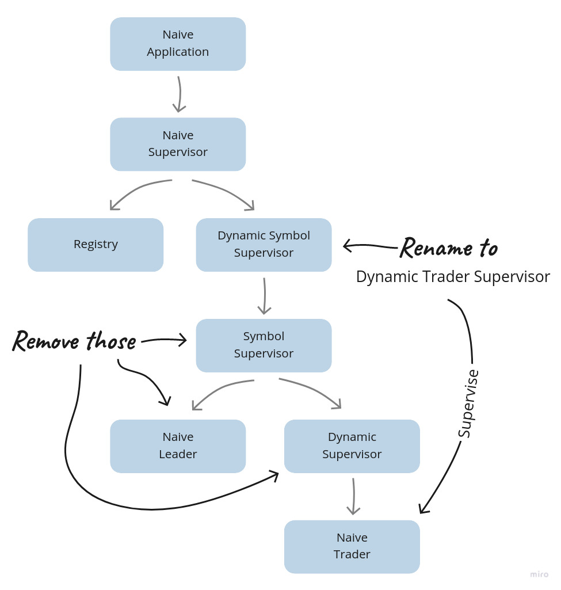

# Idiomatic trading strategy

## Objectives
- Following the OHLC footsteps
- Simplifying the Naive supervision tree
- Supporting multiple positions
- Retrofitting the "shutdown" functionality

## Following the OHLC footsteps

In the last chapter, we looked into the idiomatic Elixir. We refactored our initial implementation of OHLC aggregation to maximise the amount of pure code by limiting the number of processes running per symbol. It was a nice standalone functionality to showcase the concept.

In this chapter, we will look into how could we refactor our naive strategy's code to achieve the same result. At this moment, the naive strategy uses multiple processes per symbol, including  `Trader` processes, dedicated `Leader` and `SymbolSupervisor`. We will update the `Trader` process to be responsible for multiple trades(we will call them "positions" from now on) on a single symbol. This way, we will have a single `Trader` process per symbol as well, as we will get rid of both the `Leader`(we will move rebuy/shutdown logic to our strategy - where it belongs) and the `SymbolSupervisor`: 

```{r, fig.align="center", out.width="100%", echo=FALSE}

```

There are multiple benefits of simplifying the supervision hierarchy, and we will look at them closely as we refactor the code - let's get to it.

## Simplifying the Naive supervision tree

Starting from the top of the tree, the first module we need to update will be the `Naive.DynamicSymbolSupervisor` module.

### The `Naive.DynamicTraderSupervisor` module

The filename needs to be updated to `dynamic_trader_supervisor.ex` and the module name to `Naive.DynamicTraderSupervisor`.

Next, there's the `@registry` attribute that we will rename to `:naive_traders`.

Finally, update the alias to the `Naive.SymbolSupervisor` to the `Naive.Trader` and use it inside the `start_child/1` function:

```{r, engine = 'elixir', eval = FALSE}
  # /apps/naive/lib/naive/dynamic_trader_supervisor.ex
  alias Naive.Trader 
  ...
  defp start_child(args) do
    DynamicSupervisor.start_child(
      __MODULE__,
      {Trader, args}
    )
  end
```

### The `Naive` module

The `Naive` module heavily depends on the `Naive.DynamicSymbolSupervisor`(now `Naive.DynamicTraderSupervisor`), we need to update all the references to it:

```{r, engine = 'elixir', eval = FALSE}
  # /apps/naive/lib/naive.ex
  alias Naive.DynamicTraderSupervisor
  ...
  |> DynamicTraderSupervisor.start_worker()
  ...
  |> DynamicTraderSupervisor.stop_worker()
  ...
  |> DynamicTraderSupervisor.shutdown_worker()
```

### The `Naive.Supervisor` module

The `Naive.Supervisor` supervises the `Naive.DynamicSymbolSupervisor`(now `Naive.DynamicTraderSupervisor`) and the registry that stores the traders' PIDs - we need to update both:

```{r, engine = 'elixir', eval = FALSE}
  # /apps/naive/lib/naive/supervisor.ex
  alias Naive.DynamicTraderSupervisor # <= updated

  @registry :naive_traders # <= updated
  ...
    children = [
      {Registry, [keys: :unique, name: @registry]},
      {DynamicTradersSupervisor, []}, # <= updated
      {Task,
       fn ->
         DynamicTradersSupervisor.autostart_workers() # <= updated
       end}
    ]
```

### The `Naive.Trader` module

The final module to be updated will be the `Naive.Trader`. It needs to support storing it's PID inside the Registry:

```{r, engine = 'elixir', eval = FALSE}
  # /apps/naive/lib/naive/trader.ex
  @registry :naive_traders
  ...
  def start_link(%State{} = state) do
    symbol = String.upcase(state.symbol)

    GenServer.start_link(
      __MODULE__,
      state,
      name: via_tuple(symbol)
    )
  end
  ...
  defp via_tuple(symbol) do
    {:via, Registry, {@registry, symbol}}
  end
```

That finishes the changes to the supervision tree - the `Naive.Leader` and the `Naive.SymbolSupervisor` aren't used anymore. At this moment, our codebase won't work as we need to retrofit the functionality that the `Naive.Leader` was offering into our `Naive.Trader` and `Naive.Strategy` modules, which we will focus on in the next section.

## Supporting multiple positions

The current `State` struct inside the `Naive.Trader` was geared toward a single trade cycle. As we now need to handle multiple positions inside a single `Trader` process, we will need to update this struct. We will start by moving the current `State` struct into the `Naive.Strategy` and renaming it to `Position`:

```{r, engine = 'elixir', eval = FALSE}
# /apps/naive/lib/naive/strategy.ex
defmodule Naive.Strategy do
  ...
  defmodule Position do
    @enforce_keys [
	# keys copied from `Naive.Trader.State` struct
    ]
    defstruct [
	# keys copied from `Naive.Trader.State` struct
    ]
  end
```

This will break all the references to `Naive.Trader.State` inside the `Naive.Strategy`, which we need to update to `Position`(and remove the alias of `Naive.Trader.State`):

```{r, engine = 'elixir', eval = FALSE}
  # /apps/naive/lib/naive/strategy.ex
  ...
  def execute(%TradeEvent{} = trade_event, %Position{} = position do
    generate_decision(trade_event, position)
    |> execute_decision(position)
  end
  ...
  def generate_decision(
        %TradeEvent{
          ...
        },
        %Position{ # <= in all 8 clauses
        ...

  defp execute_decision(
    {.... # decision },
    %Position{
      ...
    } = position
  ) do
    ...
    new_position = %{position | buy_order: order}
    @leader.notify(:trader_state_updated, new_position)
    {:ok, new_position} # <^= similar changes in all execute_decision
```

Please ignore the fact that we are still calling the `@leader` and still dealing with a single position - we will fix that in the following steps. One step at a time ;)

As we are already changing strategy to work with positions, we will update all the logger messages:

```{r, engine = 'elixir', eval = FALSE}
  # /apps/naive/lib/naive/strategy.ex
  defp execute_decision(
         {:place_buy_order, price, quantity},
         ...
  ) do
       ) do
    @logger.info(
      "Position (#{symbol}/#{id}): " <>
        "Placing a BUY order @ #{price}, quantity: #{quantity}"
    ) # ^ updated message
  ...

    defp execute_decision(
         {:place_sell_order, sell_price},
         ...
       ) do
    @logger.info(
      "Position (#{symbol}/#{id}): The BUY order is now filled. " <>
        "Placing a SELL order @ #{sell_price}, quantity: #{quantity}"
    ) # ^ updated message
    ...

  defp execute_decision(
         :fetch_buy_order,
         ...
       ) do
    @logger.info("Position (#{symbol}/#{id}): The BUY order is now partially filled") # <= updated message
    ...

  defp execute_decision(
         :exit,
         ...
       ) do
    @logger.info("Position (#{symbol}/#{id}): Trade cycle finished") # <= updated message
    ...

  defp execute_decision(
         :fetch_sell_order,
         ...
       ) do
    @logger.info("Position (#{symbol}/#{id}): The SELL order is now partially filled")  # <= updated message
     ...

  defp execute_decision(
         :rebuy,
         ...
       ) do
    @logger.info("Position (#{symbol}/#{id}): Rebuy triggered")  # <= updated message
     ...
```

Our code is still far from working, but we are incrementally updating it to work with multiple positions.

### Initialization

At this moment, the `Naive.Trader` expects the `state` to be injected on start (using the `start_link/1` function). We were able to do that because the `Naive.Leader` was fetching the settings and building the fresh trader state.

First, let's update the `State` of the `Naive.Trader` - it will now be responsible for holding the symbol's settings(previously held in the leader) and list of positions(list of the `Naive.Strategy.Position` structs):

```{r, engine = 'elixir', eval = FALSE}
  # /apps/naive/lib/naive/trader.ex
  defmodule State do
    @enforce_keys [:settings, :positions]
    defstruct [:settings, positions: []]
  end
```

Now we need to update the `start_link/1` and `init/1` functions as well as add the `handle_continue/2` callback to fetch settings and store them together with a new position in the state:

```{r, engine = 'elixir', eval = FALSE}
  # /apps/naive/lib/naive/trader.ex
   alias Naive.Strategy
   ...

  def start_link(symbol) do # <= now expecting symbol
    symbol = String.upcase(symbol) # <= updated

    GenServer.start_link(
      __MODULE__,
      symbol,   # <= updated
      name: via_tuple(symbol)
    )
    ...

  def init(symbol) do # <= updated
    @logger.info("Initializing new trader for #{symbol}") # <= updated

    @pubsub_client.subscribe(
      Core.PubSub,
      "TRADE_EVENTS:#{symbol}"
    )

    {:ok, nil, {:continue, {:start_position, symbol}}} # <= updated
  end

  def handle_continue({:start_trader, symbol}, _state) do
    settings = Strategy.fetch_symbol_settings(symbol)
    positions = [Strategy.generate_fresh_position(settings)]

    {:noreply, %State{settings: settings, positions: positions}}
  end # ^^^ new function/callback
```

As the `Naive.Trader` starts, it returns the `{:continue, ...}` tuple from the `init/1` function. This will cause the `handle_continue/2` callback to be called asynchronously. Inside it, we fetch settings and add a single fresh position to the list of positions - both stored in Trader's state.

Both functions inside the `handle_continue/2` callback were part of the `Naive.Leader` - we need to move them across to the `Naive.Strategy`:

```{r, engine = 'elixir', eval = FALSE}
  # /apps/naive/lib/naive/strategy.ex
  alias Naive.Schema.Settings
  ...
  @repo Application.compile_env(:naive, :repo)
  ...
  def fetch_symbol_settings(symbol) do
    exchange_info = @binance_client.get_exchange_info()
    db_settings = @repo.get_by!(Settings, symbol: symbol)

    merge_filters_into_settings(exchange_info, db_settings, symbol)
  end

  def merge_filters_into_settings(exchange_info, db_settings, symbol) do
    symbol_filters =
      exchange_info
      |> elem(1)
      |> Map.get(:symbols)
      |> Enum.find(&(&1["symbol"] == symbol))
      |> Map.get("filters")

    tick_size =
      symbol_filters
      |> Enum.find(&(&1["filterType"] == "PRICE_FILTER"))
      |> Map.get("tickSize")

    step_size =
      symbol_filters
      |> Enum.find(&(&1["filterType"] == "LOT_SIZE"))
      |> Map.get("stepSize")

    Map.merge(
      %{
        tick_size: tick_size,
        step_size: step_size
      },
      db_settings |> Map.from_struct()
    )
  end

  def generate_fresh_position(settings, id \\ :os.system_time(:millisecond)) do
    %{
      struct(Position, settings)
      | id: id,
        budget: D.div(settings.budget, settings.chunks),
        rebuy_notified: false
    }
  end
```

Inside the above code, we modified the `fetch_symbol_settings/1` function to fetch settings from binance and DB first and then progress with the "pure" part. This way, we can easily test most of the logic without using mocks.

The `generate_fresh_position/2` was previously called `fresh_trader_state/1` inside the `Naive.Leader`. It had an `id` assigned inside the function based on the current system time. That made it a bit more difficult to test as we don't know what should we expect there as a value. By moving the `id` to the arguments and assigning the current time there, we are now able to test it by passing our dummy value.

We are now using `@repo` inside the `Naive.Strategy` so we need to add it to configuration files(including test configuration):

```{r, engine = 'elixir', eval = FALSE}
# /config/config.exs
config :naive,
  ...
  repo: Naive.Repo,
```

```{r, engine = 'elixir', eval = FALSE}
# /config/test.exs
config :naive,
  ...
  repo: Test.Naive.RepoMock,
```

### Parallelising the strategy

We can now move on to the strategy, but first, let's update the `Naive.Trader` to pass positions and settings separately:

```{r, engine = 'elixir', eval = FALSE}
  # /apps/naive/lib/naive/trader.ex
  def handle_info(%TradeEvent{} = trade_event, %State{} = state) do
    case Naive.Strategy.execute(trade_event, state.positions, state.settings) do
      {:ok, updated_positions} ->
        {:noreply, %{state | positions: updated_positions}} # <= updated
      :exit -> {:stop, :normal, state}
    end
```

We need all the `positions` to iterate through them, deciding and executing appropriate actions. The `settings` will be used inside strategy later, but we will pass it on now to avoid going back and forward later.

Additionally, we updated the `case` match to expect a list of updated positions which we will assign to the `Trader`'s state.

Now we can modify the `Naive.Strategy` to handle multiple positions:

```{r, engine = 'elixir', eval = FALSE}
   # /apps/naive/lib/naive/strategy.ex
  def execute(%TradeEvent{} = trade_event, positions, settings) do
    generate_decisions(positions, [], trade_event, settings)
    |> Enum.map(fn {decision, position} ->
      Task.async(&execute_decision(decision, position, settings))
    end)
    |> Task.await_many()
    |> then(&parse_results/1)
  end
```

We need to write most of the functions used above, but we can already see the idea. We will map each of the decisions that we generated to async tasks that will execute them. Next, we will wait for all of them to finish and parse the results.

First, we are calling a new function `generate_decisions/4`, which is a recursive function on top of the existing `generate_decision/2`:

```{r, engine = 'elixir', eval = FALSE}
  # /apps/naive/lib/naive/strategy.ex
  def generate_decisions([], generated_results, _trade_event, _settings) do
    generated_results
  end

  def generate_decisions([position | rest] = positions, generated_results, trade_event, settings) do
    current_positions = positions ++ (generated_results |> Enum.map(&elem(&1, 0)))

    case generate_decision(trade_event, position, current_positions, settings) do
      decision ->
        generate_decisions(
          rest,
          [{decision, position} | generated_results],
          trade_event,
          settings
        )
    end
  end
```

At this moment, the `generate_decisions/4` can look like overengineered `Enum.map/2` function, but we are actually preparing the ground for the consequent updates later in this chapter(to get other functionality running).

It's important to note that we are now passing four arguments into the `generate_decision` function - we added `current_positions` and `settings` - those will be required in the further updates as it was mentioned above. At this moment though, we can update the `generate_decision/2` clauses to include two additional arguments to **all** clauses:

```{r, engine = 'elixir', eval = FALSE}
  # /apps/naive/lib/naive/strategy.ex
  def generate_decision(
        %TradeEvent{...},
        %Position{
          ...
        },
        _positions, # <= add this 8 times
       _settings    # <= add this 8 times
      ) do
```

Now back to the main `execute/3` function where we are calling `execute_decision/3`, which we need to update as well(**all** clauses):

```{r, engine = 'elixir', eval = FALSE}
  # /apps/naive/lib/naive/strategy.ex
  defp execute_decision(
         {...},
         %Position{
           ...
         } = position,
         _settings  # <= added 7 times
       ) do
```

The final function that gets called from the `execute/3` function is `parse_results/1`, which will aggregate all the results into a single tuple:

```{r, engine = 'elixir', eval = FALSE}
  # /apps/naive/lib/naive/strategy.ex
  def parse_results([_ | _] = results) do
    results
    |> Enum.map(fn {:ok, new_position} -> new_position end)
    |> then(&{:ok, &1})
  end
```

At this moment, we should be able to run our code:

```{r, engine = 'bash', eval = FALSE}
$ iex -S mix
...
iex(1)> Naive.start_trading("XRPUSDT")
...
iex(2)> Streamer.start_streaming("XRPUSDT")
21:29:17.998 [info]  Starting streaming XRPUSDT trade events
...
21:29:21.037 [info]  Position (XRPUSDT/1651696014179): Placing a BUY order @ 0.64010000, quantity: 31.00000000
21:29:21.037 [error] Task #PID<0.10293.0> started from #PID<0.480.0> terminating
** (stop) exited in: GenServer.call(:"Elixir.Naive.Leader-XRPUSDT"...
```

So we have a trader that start and places a buy order but then it tries to update the leader with it's new state - we can update the `execute_decision/3` function to drop the updates(in **all** of the clauses):

```{r, engine = 'elixir', eval = FALSE}
    # /apps/naive/lib/naive/strategy.ex
  defp execute_decision(
    ...
       ) do
    ...
    # convert the below:
    new_position = %{position | buy_order: order}
    @leader.notify(:trader_state_updated, new_position)
    {:ok, new_position}
    # to:
    {:ok, %{position | buy_order: order}}
  end
```

Apply similar changes to all the clauses of the `execute_decision/3` to get rid of the references to the `@leader` - remember to remove the module's attribute as well, as we won't need it anymore.

Important note - one of those references to the `@leader` will be the notification that rebuy was triggered:

```{r, engine = 'elixir', eval = FALSE}
    # /apps/naive/lib/naive/strategy.ex
    @leader.notify(:rebuy_triggered, new_position)
```

At this moment, remove that reference as well. We will get back to the rebuy functionality in the next section.

We can now rerun our code:

```
$ iex -S mix
...
iex(1)> Streamer.start_streaming("ETHUSDT")
...
iex(2)> Naive.start_trading("ETHUSDT")
...
21:59:19.836 [info]  Position (ETHUSDT/1651697959836): Placing a BUY order @ 2945.31000000, quantity: 0.06790000
 21:59:46.997 [info]  Position (ETHUSDT/1651697959836): The BUY order is now partially filled
 21:59:46.997 [info]  Position (ETHUSDT/1651697959836): The BUY order is now filled. Placing a SELL order @ 2947.66000000, quantity: 0.06790000
 22:00:21.631 [info]  Position (ETHUSDT/1651697959836): The SELL order is now partially filled
 22:00:21.734 [info]  Position (ETHUSDT/1651697959836): Trade cycle finished
22:00:21.737 [error] GenServer {:naive_traders, "ETHUSDT"} terminating
** (FunctionClauseError) no function clause matching in anonymous fn/1 in Naive.Strategy.parse_results/1
    (naive 0.1.0) lib/naive/strategy.ex:56: anonymous fn(:exit) in Naive.Strategy.parse_results/1
```

We can see that our trader process can now go through the whole trade cycle, but it fails to start a new position after the first one returns `:exit`.

To fix this issue, we need to return `:finished` instead of `:exit` from the `generate_decision/3` clause responsible for matching end of the trade cycle:

```{r, engine = 'elixir', eval = FALSE}
  # /apps/naive/lib/naive/strategy.ex
  def generate_decision(
        %TradeEvent{},
        %Position{
          sell_order: %Binance.OrderResponse{
            status: "FILLED"
          }
        },
        _positions,
        _settings
      ) do
    :finished # <= updated
  end
```

This decision will end up inside the `execute_decision/3` where previously we were returning `:exit` atom, which was causing an error - let's move this clause to be the last clause and update its body to generate a fresh state instead of returning a dummy atom:

```{r, engine = 'elixir', eval = FALSE}
  # /apps/naive/lib/naive/strategy.ex
  defp execute_decision(
         :finished, # <= previously :exit; updated
         %Position{
           id: id,
           symbol: symbol
         },
         settings # <= now used
       ) do
    new_position = generate_fresh_position(settings) # <= added

    @logger.info("Position (#{symbol}/#{id}): Trade cycle finished")

    {:ok, new_position} # <= updated
  end
```

At this moment, our trader process should be able to run across multiple trade cycles one after another:

```
$ iex -S mix
...
iex(1)> Streamer.start_streaming("ETHUSDT")
...
iex(2)> Naive.start_trading("ETHUSDT")
...
22:46:46.568 [info]  Position (ETHUSDT/1651697959836): Trade cycle finished
22:46:46.577 [info]  Position (ETHUSDT/1651697959836): Placing a BUY order @ 2945.31000000, quantity: 0.06790000
```

This finishes direct changes related to making the trader/strategy work with multiple positions, but it lacks all the features that the `Naive.Leader` offered. We will now iterate on this code to bring that missing functionality.

## Retrofitting the "shutdown" functionality

Previously, the shutdown logic was scattered around in multiple places inside the `Naive.Leader`, for example, when the rebuy was triggered - making sure that new processes aren't started.

Now, we have an opportunity to make that logic part of our strategy.

We will start by modifying the `DynamicTraderSupervisor` where we will 