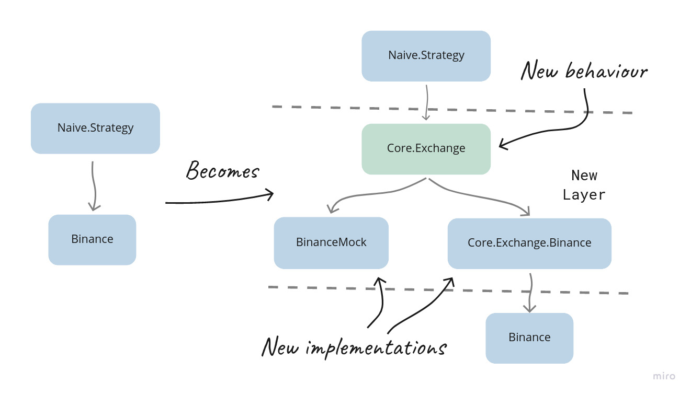

# 抽象层 {#20-layers-of-abstraction}

在上一章中，我们把整层监督结构都压扁了——每个 symbol 一个进程，没有 Leader，也没有 SymbolSupervisor。代码更简单了，策略也更纯粹，交易逻辑回到了它该在的位置。

但我们顺手把一个测试问题埋在了地毯下面。我们的单元测试依赖 `Mox`，这把我们推向了为我们并不控制的第三方包定义 behaviours 的做法。
当时这样做感觉不对，现在依然如此。现在，随着 Leader 消失、`@leader` 属性被移除，我们的 mocking 方案彻底坏掉了。

在本章中，我们会正面处理这个问题。我们会先沿着 `Mox` 路径走到逻辑尽头——构建一个完整的 `Core.Exchange` behaviour、通用结构体以及多个实现——这样我们就能准确理解它最终会走向哪里，以及为什么它的成本高于它的价值。
然后我们会把一切都恢复原状，转而使用一个更轻量的工具：`Mimic` 包。它允许我们直接 mock 模块，而不必强行引入过早的抽象。

这章的结论不会是“`Mox` 坏，`Mimic` 好”。而会是更实用的东西：知道一个抽象是在赚它应得的回报，还是只是在为让测试框架满意而缴纳额外税费。

## 目标
- 承认错误
- 抽象 exchange
- 用 mimic 模拟现实
- 切回属性方案

## 承认错误

总会有那么一个时候，我们需要承认一个在这本书写作过程中悄悄混进来的错误——而且这个错误反复出现了很多次。

当我们使用 `Mox` 包时，我们很失望，因为大多数包都没有提供 behaviours，供我们在测试里使用（用来 mock 实际实现）。

为了修复这一点，我们开始为我们使用的第三方包创建 behaviours，比如 `Binance`，甚至 `Ecto.Repo`。

这种做法感觉很奇怪，而它确实应该让人觉得奇怪，因为这**并不是** Mox 包的预期用法。

相反，我们应该在所用的第三方模块之上再引入一层额外的抽象。一个典型例子，是把和交易所交互这件事抽象成一个 behaviour，并提供不同实现（例如，一个实现可以包装 `Binance` 模块）：

```{r, fig.align="center", out.width="100%", echo=FALSE}

```

在上面的例子中，我们会引入一个新的 behaviour 模块 `Core.Exchange`，它会定义与任何交易所交互的标准方式。由于这是一个通用的 **exchange** behaviour，
它需要接收并返回通用结构体（我们也需要定义这些结构体）。

我们还会创建一个新的 `Core.Exchange.Binance` 模块（包装 `Binance` 模块）并更新 `BinanceMock` 模块。两者都会实现 `Core.Exchange` behaviour。

## 抽象 exchange

首先，我们会先看一下前面提到的 `Mox` 模块的预期用途。

### 定义 `Core.Exchange` behaviour

我们先创建一个新文件 `/apps/core/lib/core/exchange.ex`，并在其中定义一个新模块：

```{r, engine = 'elixir', eval = FALSE}	 
# /apps/core/lib/core/exchange.ex
defmodule Core.Exchange do

end
```

现在，根据我们在 `Naive.Strategy` 中与 `Binance` 模块交互的方式，我们可以定义如下回调函数：

`order_limit_buy/3` - 基本上和 `Binance.order_limit_buy/4` 一样，只是跳过了可选参数

```{r, engine = 'elixir', eval = FALSE}	 
  # /apps/core/lib/core/exchange.ex
  @callback order_limit_buy(symbol :: String.t(), quantity :: number(), price :: number()) ::
              {:ok, Core.Exchange.Order.t()}
              | {:error, any()}
```

`order_limit_sell/3` - 基本上和 `Binance.order_limit_sell/4` 一样，只是跳过了可选参数

```{r, engine = 'elixir', eval = FALSE}	 
  # /apps/core/lib/core/exchange.ex
  @callback order_limit_sell(symbol :: String.t(), quantity :: number(), price :: number()) ::
              {:ok, Core.Exchange.Order.t()}
              | {:error, any()}
```

`get_order/3` - 和 `Binance.get_order/3` 一样

```{r, engine = 'elixir', eval = FALSE}	 
  # /apps/core/lib/core/exchange.ex
  @callback get_order(
              symbol :: String.t(),
              timestamp :: non_neg_integer(),
              order_id :: non_neg_integer()
            ) ::
              {:ok, Core.Exchange.Order.t()}
              | {:error, any()}
```

以上所有回调都依赖 `Core.Exchange.Order` 结构体，我们现在就把它加到 `Core.Exchange` 模块里：

```{r, engine = 'elixir', eval = FALSE}	 
  # /apps/core/lib/core/exchange.ex
  defmodule Order do
    @type t :: %__MODULE__{
            id: non_neg_integer(),
            symbol: String.t(),
            price: number(),
            quantity: number(),
            side: :buy | :sell,
            status: :new | :filled,
            timestamp: non_neg_integer()
          }

    defstruct [:id, :symbol, :price, :quantity, :side, :status, :timestamp]
  end
```

上面的结构体是 `Binance.Order` 结构体的简化版，只保留了我们在策略中用到的字段。

此外，我们在 `Naive.Strategy` 中也会用到 `Binance` 模块来获取 symbol filter（实际上我们会先获取完整 exchange info，再从中取出所需 filter）——
为此我们会创建一个专门表示这些 filter 的结构体：

```{r, engine = 'elixir', eval = FALSE}	 
  # /apps/core/lib/core/exchange.ex
  # add below inside the Core.Exchange module
  defmodule SymbolInfo do
    @type t :: %__MODULE__{
            symbol: String.t(),
            tick_size: number(),
            step_size: number()
          }

    defstruct [:symbol, :tick_size, :step_size]
  end

  @callback fetch_symbol_filters(symbol :: String.t()) ::
              {:ok, Core.Exchange.SymbolInfo.t()}
              | {:error, any()}
```

`Binance` 模块的最后一个用途来自 seed 脚本：我们会获取 exchange info，只是为了得到支持的币种列表。我们会把“获取支持币种列表”也纳入 behaviour：

```{r, engine = 'elixir', eval = FALSE}	 
  # /apps/core/lib/core/exchange.ex
  # add below inside the Core.Exchange module
  @callback fetch_symbols() ::
              {:ok, [String.t()]}
              | {:error, any()}
```

这样 `Core.Exchange` behaviour 的定义就完成了。它应该包含五个回调函数（`fetch_symbols/0`、`fetch_symbol_filters/1`、`get_order/3`、`order_limit_buy/3` 和 `order_limit_sell/3`）以及两个结构体（`Order` 和 `SymbolInfo`）。

### `Core.Exchange.Binance` 模块的实现

既然 behaviour 已经定义好了，我们现在就可以把生产实现（`Binance` 模块）包装到一个实现该 behaviour 的模块里。

我们先在 `apps/core/lib/core` 目录下创建一个名为 `exchange` 的新目录，并在其中创建一个名为 `binance.ex` 的新文件。接着我们会定义一个模块来实现 `Core.Exchange` behaviour：

```{r, engine = 'elixir', eval = FALSE}
# /apps/core/lib/core/exchange/binance.ex
defmodule Core.Exchange.Binance do
  @behaviour Core.Exchange
end
```

现在我们就必须实现 behaviour 定义的所有函数，先从 `fetch_symbols/0` 开始：

```{r, engine = 'elixir', eval = FALSE}
  # /apps/core/lib/core/exchange/binance.ex
  alias Core.Exchange

  @impl Core.Exchange
  def fetch_symbols() do
    case Binance.get_exchange_info() do
      {:ok, %{symbols: symbols}} ->
        symbols
        |> Enum.map(& &1["symbol"])
        |> then(&{:ok, &1})

      error ->
        error
    end
  end
```

可以看到，`case` 语句把对 `Binance` 模块的调用包了起来，
我们要么继续执行后续业务逻辑，要么直接把错误往上传递，这样“消费者”就能决定遇到错误时怎么处理。
在 `Core.Exchange.Binance` 这个模块里，这种模式会在所有函数中出现，因为它本质上就是我们自己的“库”模块。

我们继续实现 behaviour 定义中的剩余函数：

```{r, engine = 'elixir', eval = FALSE}
  # /apps/core/lib/core/exchange/binance.ex
  @impl Core.Exchange
  def fetch_symbol_filters(symbol) do
    case Binance.get_exchange_info() do
      {:ok, exchange_info} -> {:ok, fetch_symbol_filters(symbol, exchange_info)}
      error -> error
    end
  end

  defp fetch_symbol_filters(symbol, exchange_info) do
    symbol_filters =
      exchange_info
      |> Map.get(:symbols)
      |> Enum.find(&(&1["symbol"] == symbol))
      |> Map.get("filters")

    tick_size =
      symbol_filters
      |> Enum.find(&(&1["filterType"] == "PRICE_FILTER"))
      |> Map.get("tickSize")

    step_size =
      symbol_filters
      |> Enum.find(&(&1["filterType"] == "LOT_SIZE"))
      |> Map.get("stepSize")

    %Exchange.SymbolInfo{
      symbol: symbol,
      tick_size: tick_size,
      step_size: step_size
    }
  end
```

`fetch_symbol_filters/1` 函数遵循了前面讨论过的模式。

而 `fetch_symbol_filters/2` 则是 `Naive.Strategy` 模块里 `merge_filters_into_settings/3` 函数的修改版复制，现在返回的是 `Exchange.SymbolInfo` 结构体。

下面还要实现的一个函数是 `get_order/3`：

```{r, engine = 'elixir', eval = FALSE}
  # /apps/core/lib/core/exchange/binance.ex
  @impl Core.Exchange
  def get_order(symbol, timestamp, order_id) do
    case Binance.get_order(symbol, timestamp, order_id) do
      {:ok, %Binance.Order{} = order} ->
        {:ok,
         %Exchange.Order{
           id: order.order_id,
           symbol: order.symbol,
           price: order.price,
           quantity: order.orig_qty,
           side: side_to_atom(order.side),
           status: status_to_atom(order.status),
           timestamp: order.time
         }}

      error ->
        error
    end
  end
  
  defp side_to_atom("BUY"), do: :buy
  defp side_to_atom("SELL"), do: :sell

  defp status_to_atom("NEW"), do: :new
  defp status_to_atom("FILLED"), do: :filled
```

和前面实现的函数一样，`get_order/3` 的实现也把 `Binance` 的函数包进了 `case` 语句里。为了满足 `Core.Exchange` behaviour，它需要返回 `Exchange.Order` 结构体——所以必须做转换。
它还需要在赋值到结构体之前，把字符串形式的 `side` 和 `status` 字段转换成 atom（这就是 `status_to_atom` 和 `side_to_atom` 辅助函数的作用）。

最后两个要实现的函数是 `order_limit_buy/3` 和 `order_limit_sell/3`：

```{r, engine = 'elixir', eval = FALSE}
  # /apps/core/lib/core/exchange/binance.ex
  @impl Core.Exchange
  def order_limit_buy(symbol, quantity, price) do
    case Binance.order_limit_buy(symbol, quantity, price, "GTC") do
      {:ok, %Binance.OrderResponse{} = order} ->
        {:ok,
         %Exchange.Order{
           id: order.order_id,
           price: order.price,
           quantity: order.orig_qty,
           side: :buy,
           status: :new,
           timestamp: order.transact_time
         }}

      error ->
        error
    end
  end

  @impl Core.Exchange
  def order_limit_sell(symbol, quantity, price) do
    case Binance.order_limit_sell(symbol, quantity, price, "GTC") do
      {:ok, %Binance.OrderResponse{} = order} ->
        {:ok,
         %Exchange.Order{
           id: order.order_id,
           price: order.price,
           quantity: order.orig_qty,
           side: :sell,
           status: :new,
           timestamp: order.transact_time
         }}

      error ->
        error
    end
  end
```

这样 `Core.Exchange` behaviour 的第一个实现就完成了。
它会在生产环境中被 `Naive.Strategy` 使用，但在更新它之前，我们先要更新 `core` 应用的依赖，因为现在 `core` 应用内部也在使用 `Binance` 模块：

```{r, engine = 'elixir', eval = FALSE}
  # /apps/core/mix.exs
  defp deps do
    [
      {:binance, "~> 1.0"}, # <= added
      {:phoenix_pubsub, "~> 2.0"}
    ]
  end
```

### 更新 `BinanceMock` 模块以实现 `Core.Exchange` behaviour

`BinanceMock` 模块也必须实现 `Core.Exchange` behaviour。
这样就能（在编译期）保证 `Core.Exchange.Binance` 和 `BinanceMock` 共享一套可供 `Naive.Strategy` 使用的统一接口。

首先，我们先声明 `BinanceMock` 确实实现了 `Core.Exchange` behaviour：

```{r, engine = 'elixir', eval = FALSE}
# /apps/binance_mock/lib/binance_mock.ex
defmodule BinanceMock do
  @behaviour Core.Exchange # <= added
```

接着，我们可以把所有指向 `Binance` 结构体的 alias 都替换成对 `Core.Exchange` 模块的一个 alias：

```{r, engine = 'elixir', eval = FALSE}
  # /apps/binance_mock/lib/binance_mock.ex
  alias Core.Exchange
```

别忘了把所有 `Binance.Order` 的引用都更新成 `Exchange.Order`。

既然 behaviour 现在已经定义在 `Core.Exchange` 模块里，我们可以删除所有 `@type` 和 `@callback` 属性。

接下来，我们会把 `get_exchange_info/0`（以及它的辅助函数 `get_cached_exchange_info/0`）替换成 `fetch_symbols/0` 和 `fetch_symbol_filters/1`（以及它们的辅助函数）：

```{r, engine = 'elixir', eval = FALSE}
  # /apps/binance_mock/lib/binance_mock.ex
  def fetch_symbols() do
    case fetch_exchange_info() do
      {:ok, %{symbols: symbols}} ->
        symbols
        |> Enum.map(& &1["symbol"])
        |> then(&{:ok, &1})

      error ->
        error
    end
  end

  def fetch_symbol_filters(symbol) do
    case fetch_exchange_info() do
      {:ok, exchange_info} ->
        {:ok, fetch_symbol_filters(symbol, exchange_info)}

      error ->
        error
    end
  end

  defp fetch_exchange_info() do
    case Application.get_env(:binance_mock, :use_cached_exchange_info) do
      true ->
        get_cached_exchange_info()

      _ ->
        Binance.get_exchange_info()
    end
  end

  defp get_cached_exchange_info do
    File.cwd!()
    |> Path.split()
    |> Enum.drop(-1)
    |> Kernel.++([
      "binance_mock",
      "test",
      "assets",
      "exchange_info.json"
    ])
    |> Path.join()
    |> File.read()
  end

  defp fetch_symbol_filters(symbol, exchange_info) do
    # <= this is a copy of `Core.Exchange.Binance.fetch_symbol_filters/2` function
  end
```

上面还有几个辅助函数，内容有点长——我们拆开来看。

首先，`fetch_symbols/0` 和 `fetch_symbol_filters/1` 看起来和 `Core.Exchange.Binance` 模块里实现的很像。主要区别是：
我们通过引入 `fetch_exchange_info/0` 支持缓存的 exchange info，它会分支到 `Binance` 模块或 `get_cached_exchange_info/0` 函数。
后者也被更新为返回原始数据，而不是 `Binance.ExchangeInfo` 结构体。

接着是 `get_order/3` 函数——因为它的工作方式和 behaviour 定义一致，我们就保持不变。

最后两个要更新的函数是 `order_limit_buy/4` 和 `order_limit_sell/4`，它们现在会变成三个参数的函数：

```{r, engine = 'elixir', eval = FALSE}
  # /apps/binance_mock/lib/binance_mock.ex
  def order_limit_buy(symbol, quantity, price) do
    order_limit(symbol, quantity, price, "BUY")
  end

  def order_limit_sell(symbol, quantity, price) do
    order_limit(symbol, quantity, price, "SELL")
  end
```

在上面的函数里，我们只是省掉了第四个参数，以满足 behaviour 的要求。

对不同结构体的这些改动，会在 `BinanceMock` 模块的其他部分引发连锁变化：

```{r, engine = 'elixir', eval = FALSE}
  # /apps/binance_mock/lib/binance_mock.ex
  def generate_fake_order(...) do
    ...
    %Exchange.Order{
      id: order_id,
      symbol: symbol,
      price: price,
      quantity: quantity,
      side: side_to_atom(side),
      status: status_to_atom("NEW"),
      timestamp: current_timestamp
    } # <= keys updated & `.new` dropped
  end

  defp side_to_atom("BUY"), do: :buy   # <= added
  defp side_to_atom("SELL"), do: :sell # <= added

  defp status_to_atom("NEW"), do: :new       # <= added
  defp status_to_atom("FILLED"), do: :filled # <= added

  def handle_call(
        {:get_order, symbol, time, order_id},
        ...
  ) do
    ...
      |> Enum.find(
        &(&1.symbol == symbol and
            &1.timestamp == time and # <= field updated
            &1.id == order_id)       # <= field updated
      )
  end

  def handle_info(
      %TradeEvent{} = trade_event,
      ...
  ) do
  ...
    filled_orders =
      ...
      |> Enum.map(&Map.replace!(&1, :status, :filled)) # <= changed to atom
  ...
  end

  defp order_limit(symbol, quantity, price, side) do
    ...
   {:ok, fake_order} # <= no need to convert between structs any more
  end

  # and finally ;)
  # remove the `convert_order_to_order_response/1` function - not required anymore
```

上面的这些改动完成了对 BinanceMock 的修改。这个模块现在已经正确实现了 behaviour。

### 更新 `Naive.Strategy`

接下来，我们把重点转到使用 `Core.Exchange` behaviour 实现的代码——`Naive.Strategy` 模块。

我们先在模块顶部加上对 `Core.Exchange` 的 alias：

```{r, engine = 'elixir', eval = FALSE}
  # /apps/naive/lib/naive/strategy.ex
  alias Core.Exchange
```

接着，我们可以把基于配置的 `@binance_client` 改名为 `@exchange_client`，并在模块里把所有引用都更新掉：

```{r, engine = 'elixir', eval = FALSE}
  # /apps/naive/lib/naive/strategy.ex
  @exchange_client Application.compile_env(:naive, :exchange_client)
```

除此之外，我们现在依赖的是通用结构体，所以需要把所有对 `Binance.OrderResponse` 和 `Binance.Order` 模块的引用都改成 `Exchange.Order`（包括更新字段名）——例如：

```{r, engine = 'elixir', eval = FALSE}
  # /apps/naive/lib/naive/strategy.ex
  # from:
        %Position{
          buy_order: %Binance.OrderResponse{
            order_id: order_id,
            status: "FILLED"
          },
          sell_order: %Binance.OrderResponse{},

  # to:
        %Position{
          buy_order: %Exchange.Order{ # <= struct updated
            id: order_id,   # <= key updated
            status: :filled # <= updated to atom
          },
          sell_order: %Exchange.Order{}
        }

  # rename cheatsheet:
  # order_id to id (do not use "global" file replace)
  # orig_qty to quantity ("global" file replace safe)
  # transact_time to timestamp ("global" file replace safe)
  # "FILLED" to :filled ("global" file replace safe)
```


因为 behaviour 的接口（public functions）和 `Binance` 模块不同，我们需要更新所有简化过的调用：

```{r, engine = 'elixir', eval = FALSE}
  # /apps/naive/lib/naive/strategy.ex
  {:ok, %Exchange.Order{} = order} = @exchange_client.order_limit_buy(symbol, quantity, price)
  ...
  {:ok, %Exchange.Order{} = order} =
      @exchange_client.order_limit_sell(symbol, quantity, sell_price)
```

现在我们只会处理 `Exchange.Order` 结构体，而不再是 `Binance.OrderResponse` 和 `Binance.Order` 这对结构体了。
我们可以把 `broadcast_order/1` 的两个子句合并成一个（并删除 `convert_to_order/1` 函数）：

```{r, engine = 'elixir', eval = FALSE}
  # /apps/naive/lib/naive/strategy.ex
  defp broadcast_order(%Exchange.Order{} = order) do
    @pubsub_client.broadcast(
      Core.PubSub,
      "ORDERS:#{order.symbol}",
      order
    )
  end
```

我们也不再需要把 Order 转成 OrderResponse，所以可以更新获取买单和卖单的分支：

```{r, engine = 'elixir', eval = FALSE}
  # /apps/naive/lib/naive/strategy.ex
  defp execute_decision(
         :fetch_buy_order,
         ...
       ) do
    @logger.info("Position (#{symbol}/#{id}): The BUY order is now filled")

    {:ok, %Exchange.Order{} = current_buy_order} =
      @exchange_client.get_order(
        symbol,
        timestamp,
        order_id
      )

    :ok = broadcast_order(current_buy_order)
    {:ok, %{position | buy_order: current_buy_order}}
  end

  defp execute_decision(
         :fetch_sell_order,
         ...
       ) do
    @logger.info("Position (#{symbol}/#{id}): The SELL order is now filled")

    {:ok, %Exchange.Order{} = current_sell_order} =
      @exchange_client.get_order(
        symbol,
        timestamp,
        order_id
      )

    :ok = broadcast_order(current_sell_order)
    {:ok, %{position | sell_order: current_sell_order}}
  end
```

我们可以把 `convert_order_to_order_response/1` 函数删掉，因为现在已经没有人用它了。

`Naive.Strategy` 模块的最后一个变化，是更新 `fetch_symbol_settings/1` 函数（并删除 `merge_filters_into_settings/3` 函数）：

```{r, engine = 'elixir', eval = FALSE}
  # /apps/naive/lib/naive/strategy.ex
  def fetch_symbol_settings(symbol) do
    {:ok, filters} = @exchange_client.fetch_symbol_filters(symbol)
    db_settings = @repo.get_by!(Settings, symbol: symbol)

    Map.merge(
      filters |> Map.from_struct(),
      db_settings |> Map.from_struct()
    )
  end
```

现在这个函数简洁得多，因为我们使用了作为 `Core.Exchange` behaviour 一部分实现的 `fetch_symbol_filters/1` 函数。

### 更新 seed 脚本

我们使用交易所的其他地方，是 seeding 脚本，也需要更新。先从 `Naive` 应用开始：

```{r, engine = 'elixir', eval = FALSE}
# /apps/naive/priv/seed_settings.exs
exchange_client = Application.compile_env(:naive, :exchange_client)
...
{:ok, symbols} = exchange_client.fetch_symbols()
...
total_count = symbols
  |> Enum.map(&(%{base_settings | symbol: &1}))
```

我们不再使用 `binance_client`，而是改用 `exchange_client`——这和 `Naive.Strategy` 模块中的做法一致。
两个实现都提供 `fetch_symbols/0` 函数，它返回 symbol 列表，因此 `Enum.map/2` 里也要相应调整。

接下来是 `Streamer` 应用的 seeding 脚本（这里我就不逐行列出变化了，因为和 `Naive` 应用里的**完全一样**）。

此时，我们可以调整配置，让 `Naive.Strategy` 正常工作：

```{r, engine = 'elixir', eval = FALSE}
# /config/config.exs
config :streamer,
  exchange_client: BinanceMock, # <= key updated

config :naive,
  exchange_client: BinanceMock, # <= key updated

# /config/prod.exs
config :naive,
  exchange_client: Core.Exchange.Binance # <= key and module updated

config :streamer,
  exchange_client: Core.Exchange.Binance # <= key and module updated

# /config/test.exs
config :naive,
  exchange_client: Test.BinanceMock, # <= key updated
```

### 重构后的手动测试

现在我们可以测试 `Naive.Strategy` 是否工作正常：

```{r, engine = 'bash', eval = FALSE}
$ iex -S mix
...
iex(1)> Streamer.start_streaming("XRPUSDT")
...
iex(2)> Naive.start_trading("XRPUSDT")
...
21:42:12.813 [info] Position (XRPUSDT/1662842530254): Placing a BUY order @ 0.35560000,
quantity: 562.00000000
21:42:15.280 [info] Position (XRPUSDT/1662842530254): The BUY order is now filled
21:42:15.281 [info] Position (XRPUSDT/1662842530254): Placing a SELL order @ 0.35580000,
quantity: 562.00000000
21:42:15.536 [info] Position (XRPUSDT/1662842530254): The SELL order is now filled
21:42:15.593 [info] Position (XRPUSDT/1662842530254): Trade cycle finished
```

上面的输出确认我们通过 `Core.Exchange.Binance` 或 `BinanceMock` 都能完整跑通交易流程。

### 存储数据

既然我们现在使用的是像 `Core.Exchange.Order` 这样的通用结构体，所有和数据存储相关的代码都需要更新。

我们先从 migration 脚本开始，把它改成与我们简化后的数据模型一致：

```{r, engine = 'elixir', eval = FALSE}
  # /apps/data_warehouse/priv/repo/migrations/20210222224522_create_orders.exs
  def change do
    create table(:orders, primary_key: false) do
      add(:id, :bigint, primary_key: true)
      add(:symbol, :text)
      add(:price, :text)
      add(:quantity, :text)
      add(:side, :text)
      add(:status, :text)
      add(:timestamp, :bigint)

      timestamps()
    end
  end
```

很多字段都被删掉或改名了，包括主键。接着我们更新这张表对应的 schema：

```{r, engine = 'elixir', eval = FALSE}
 # /apps/data_warehouse/lib/data_warehouse/schema/order.ex
  @primary_key {:id, :integer, autogenerate: false} # <= column updated

  schema "orders" do
    field(:symbol, :string)
    field(:price, :string)
    field(:quantity, :string)
    field(:side, :string)
    field(:status, :string)
    field(:timestamp, :integer)

    timestamps()
  end
```

schema 已经更新成了新的 `orders` 数据表结构。
现在我们可以继续到 Worker，在这里我们会开始使用基于 `Core.Exchange` 的结构体：

```{r, engine = 'elixir', eval = FALSE}
  # /apps/data_warehouse/lib/data_warehouse/subscriber/worker.ex
  alias Core.Exchange # <= alias added
  ...
  def handle_info(%Exchange.Order{} = order, state) do
    data =
      order
      |> Map.from_struct()
      |> Map.update!(:price, &Float.to_string/1)
      |> Map.merge(%{
        side: atom_to_side(order.side),
        status: atom_to_status(order.status)
      })

    struct(DataWarehouse.Schema.Order, data)
    |> DataWarehouse.Repo.insert(
      on_conflict: :replace_all,
      conflict_target: :id # <= column updated
    )
    ...

  defp atom_to_side(:buy), do: "BUY"
  defp atom_to_side(:sell), do: "SELL"

  defp atom_to_status(:new), do: "NEW"
  defp atom_to_status(:filled), do: "FILLED"
```

`Worker` 现在会匹配 `Core.Exchange.Order` 结构体，而不是之前的 `Binance.Order`。
在这个回调里，我们简化了映射到 schema 结构体的过程，并把冲突目标更新为重命名后的 `id` 列。
最后，我们补上了辅助函数，用来把 `status` 和 `side` 的 atom 转回字符串。

### `Mox` 方案总结

我们还没有更新测试，但先不谈测试，我们先聊聊这个实现。

首先，要强调的是，这套方案需要对系统很多部分做多处修改：从 `Naive` 应用开始，经过 `Streamer`（seeding），最后到 `DataWarehouse` 应用。

更重要的是，我们还必须定义一个 behaviour。它给了我们编译期保证，
但另一方面，我们被迫很早就要定义它。

让我解释一下。

直到现在为止，我们一直只用 `Binance` 模块。
我们没有机会和其他模块/交易所打交道。实际上，我们**并不想**创建一个 `Exchange` 级别的抽象。
我们原本对使用 `Binance` 模块已经很满意，而我们引入 behaviour 只是为了能够在测试中用 `Mox` 包去 mock 它。
这一切看起来像是为了测试而做的重度过度设计。

此外，一旦定义了 behaviour，我们还需要定义依赖于 `Binance` 模块的那些通用结构体。
我们从来没见过其他包里的结构体示例，所以我们只取了策略中正在使用的字段，
以减少未来某个交易所缺少数据的可能性。

这会带来双重连锁反应：数据库里已经缺了有价值的数据，
而未来如果要添加新的交易所，可能还需要更新 behaviour、它已有的实现，以及大多数使用它的代码（比如 `Naive.Strategy`）。

此外，我们还把 `Binance` 的错误消息原封不动地返回给了抽象的使用者（`Naive.Strategy`）。
我们本应把这些错误转换成通用错误，但我们并不了解其他交易所，也不知道它们会抛出什么样的错误。

到了这个阶段，把代码抽象成 behaviour + implementations，显然是一种缺乏依据的过度设计，只会给未来埋雷。

那替代方案是什么？

最先想到的，是找某种“标准”来帮助我们构建 behaviour / 定义结构体。对于加密货币交易所来说，这个标准就是 “CCXT”——一个开源“库”，支持 Python、JavaScript 和 PHP。

我们还可以更进一步，找一个 Elixir 版的 CCXT 实现，叫做 `ccxtex`。它是对 CCXT 的 JavaScript 版本的封装。

使用上面这种方式（无论是 `ccxtex` 包，还是把 `ccxt` 当作“蓝图”），而不是靠我们对交易所有限的了解来自己定义 behaviour，肯定能避免我们不断修改代码。

而这些持续修改，加上我们引入 behaviour 只是为了测试实现，这让 `Mox` 的使用变得非常值得怀疑。

此时的源代码可以在 Github 上找到——
[chapter_20_mox](https://github.com/Cinderella-Man/hands-on-elixir-and-otp-cryptocurrency-trading-bot-source-code/tree/chapter_20_mox)。

我们先停在这里，并回退到 [第 19 章](https://github.com/Cinderella-Man/hands-on-elixir-and-otp-cryptocurrency-trading-bot-source-code/tree/chapter_19) 结束时的源码。
与其继续坚持一个我们还没准备好推进的方向，不如看看别的方法来测试我们的策略。

## 用 Mimic 模拟现实

在一个干净的起点上，我们换一种完全不同的方法。
我们不再为了测试框架而构建 behaviours 和抽象，
而是使用 `Mimic` 包，它允许我们直接 mock 任意模块——不需要 behaviour。

我们先把 `Naive` 应用依赖里的 `mox` 包换成 `mimic` 包：

```{r, engine = 'elixir', eval = FALSE}
  # /apps/naive/mix.exs
  defp deps do
    [
      ...
      {:mimic, "~> 2.0", only: [:test, :integration]},
      ...
    ]
  end
```

别忘了运行 `mix deps.get` 来解析依赖。

### 更新 `Naive.Strategy`

在写新测试之前，我们可以先更新 `Naive.Strategy` 模块。
`mimic` 模块不要求我们通过配置把依赖注入到模块属性里，所以这些属性可以删掉：

```{r, engine = 'elixir', eval = FALSE}
# /apps/naive/lib/naive/strategy.ex
  # remove the below lines
  @binance_client Application.compile_env(:naive, :binance_client)
  @logger Application.compile_env(:core, :logger)
  @pubsub_client Application.compile_env(:core, :pubsub_client)
  @repo Application.compile_env(:naive, :repo)
```

我们会切回之前那种直接使用模块名的方式。
然后把模块里对这些属性的引用，全部替换成对应的硬编码模块名：

```{r, engine = 'elixir', eval = FALSE}
# /apps/naive/lib/naive/strategy.ex
# change @logger to Logger
# change @binance_client to Binance
# change @pubsub_client to Phoenix.PubSub
# change @repo to Repo
```

由于我们现在指向的是 `Repo` 而不是 `Naive.Repo`，
所以需要在模块顶部加一个 alias：

```{r, engine = 'elixir', eval = FALSE}
# /apps/naive/lib/naive/strategy.ex
alias Naive.Repo
```

[注意：到这个时点，我们会把上述修改同时应用到 `Indicator.Ohlc.Worker` 和 `Indicator.Ohlc`（`apps/indicator/lib/indicator/ohlc/worker.ex` 和 `apps/indicator/lib/indicator/ohlc.ex`），以及 `Naive.Trader`（`apps/naive/lib/naive/trader.ex`），这样在下一步清理配置时应用不会坏掉。]


这样，我们就完成了切换到硬编码模块名的工作。既然我们不再基于配置来构建模块，就可以从主 `config.exs` 文件里删掉所有多余的配置键：

```{r, engine = 'elixir', eval = FALSE}
# /config/config.exs
config :core,                   # <= remove
  logger: Logger,               # <= remove
  pubsub_client: Phoenix.PubSub # <= remove

config :streamer,
  binance_client: BinanceMock,  # <= remove
  ...

config :naive,
  binance_client: BinanceMock,  # <= remove
  repo: Naive.Repo,             # <= remove
  ...
```

接下来，我们可以开始弄清楚要怎么测试它。

### 测试 `Naive.Strategy`

首先，我们可以删除现有的单元测试（`apps/naive/test/naive/trader_test.exs`），因为它们已经不适用了。

接着，我们会创建一个新文件 `apps/naive/test/naive/strategy_test.exs`，并写一个测试骨架：

```{r, engine = 'elixir', eval = FALSE}
# /apps/naive/test/naive/strategy_test.exs
defmodule Naive.StrategyTest do
  use ExUnit.Case, async: true
  use Mimic

  alias Core.Struct.TradeEvent
  alias Naive.Strategy

  # we will add our tests here
end
```

由于我们会使用 `mimic` 来 stub 依赖，所以需要在测试模块里 `use` 它。

我们会测试主入口函数 `Naive.Strategy.execute/3`，
先从挂买单的场景开始：

```{r, engine = 'elixir', eval = FALSE}
# /apps/naive/test/naive/strategy_test.exs
  @tag :unit
  test "Strategy places a buy order" do
    # we will put our code here
  end
```

最简单的场景是传入硬编码设置、一个基于这些设置的新 position，以及一个会触发买单的 trade event：

```{r, engine = 'elixir', eval = FALSE}
# /apps/naive/test/naive/strategy_test.exs
  settings = %{
    symbol: "ABC", 	 
    chunks: "5", 	 
    budget: "200", 	 
    buy_down_interval: "0.2",
    profit_target: "0.1",
    rebuy_interval: "0.5",
    tick_size: "0.000001",
    step_size: "0.001",
    status: :on
  }

  {:ok, new_positions} = Naive.Strategy.execute(
    %TradeEvent{
      price: 1.00
    },
    [
      Strategy.generate_fresh_position(settings)
    ],
    settings
  )
```

现在，上面对 `Naive.Strategy.execute/3` 的调用会触发 `Binance.order_limit_buy/4`、
`Phoenix.PubSub.broadcast/3` 和 `Logger.info/1`（这个我们先略过，后面再处理）被调用。
我们需要在调用 `Naive.Strategy.execute/3` 之前，先 mock 这些函数：

```{r, engine = 'elixir', eval = FALSE}
# /apps/naive/test/naive/strategy_test.exs
  expected_order = %Binance.OrderResponse{ 
    client_order_id: "1", 
    executed_qty: "0.000", 
    order_id: "x1", 
    orig_qty: "50.000", 
    price: "0.800000", 
    side: "BUY", 
    status: "NEW", 
    symbol: "ABC"
  }
 
  Binance
  |> stub(
    :order_limit_buy,
    fn "ABC", "50.000", 0.8, "GTC" -> {:ok, expected_order} end 	 
  )

  Phoenix.PubSub
  |> stub(
    :broadcast,
    fn _pubsub, _topic, _message -> :ok end
  )
```

我们可以用上面的 `expected_order` 来断言 `Naive.Strategy.execute/3` 返回了正确的值——
buy_order 字段应该包含和 `expected_order` 相同的数据。我们可以把下面这些断言加到测试末尾：

```{r, engine = 'elixir', eval = FALSE}
# /apps/naive/test/naive/strategy_test.exs
    assert (length new_positions) == 1

    %{buy_order: buy_order} = List.first(new_positions)
    assert buy_order == expected_order
```

这样测试实现就完成了，但在我们能使用 `mimic` 模块之前，还需要准备好可供测试 stub 的模块——下面是 test helper 文件的新内容：

```{r, engine = 'elixir', eval = FALSE}
# /apps/naive/test/test_helper.exs
Application.ensure_all_started(:mimic)

Mimic.copy(Binance)
Mimic.copy(Phoenix.PubSub)

ExUnit.start()
```

我们删除了所有 `mox` 模块的引用，并把它们替换成了 `Mimic.copy/1` 调用。

现在我们可以运行新测试了：

```{r, engine = 'bash', eval = FALSE}
$ mix test.unit
...
21:49:39.737 [info] Position (ABC/1675460979732): Placing a BUY order @ 0.8, quantity: 50.000
.
Finished in 0.2 seconds (0.2s async, 0.00s sync)
1 tests, 0 failures (1 excluded)
```

可以看到，我们成功 mock 了 `Binance` 和 `Phoenix.PubSub` 模块。
同时我们也看到了日志信息——接下来我们会处理它。

### 日志这个必须面对的问题

既然我们又回到了使用 `Logger` 模块，而不是某个假的实现，
测试里又重新出现了日志输出。我们当然可以继续用 `Mimic` 去 mock `Logger` 模块，
但实际上，处理测试中的日志还有更好的办法。

ExUnit 启动时允许我们传入一些选项来修改它的行为。其中一个选项是 `capture_log`，
设为 `true` 时，ExUnit 会隐藏所有日志消息——我们来更新 test helper 脚本，启用这个功能：

```{r, engine = 'elixir', eval = FALSE}
# /apps/naive/test/test_helper.exs
...
ExUnit.start(capture_log: true)
```

我们重新跑一下测试，看看差别：

```{r, engine = 'bash', eval = FALSE}
$ mix test.unit
...
.
Finished in 0.2 seconds (0.2s async, 0.00s sync)
1 tests, 0 failures (1 excluded)
```

可以看到，ExUnit 输出里已经没有日志了。

但如果我们希望断言日志消息呢？以前我们用 `mox` 包时，可以通过 mock 里对日志内容的断言来做到这一点。

ExUnit 也提供了这种场景的辅助函数。
我们会修改测试，把日志捕获进来，并断言它记录了正确的值（0.8 这个价格）：

```{r, engine = 'elixir', eval = FALSE}
# /apps/naive/test/naive/strategy_test.exs
  import ExUnit.CaptureLog # <= import logging capturing functionality
  ...
  test "Strategy places a buy order" do
    ...
    {{:ok, new_positions}, log} =
      with_log(fn ->
        Naive.Strategy.execute(
          %TradeEvent{
            price: 1.00
          },
          [
            Strategy.generate_fresh_position(settings)
          ],
          settings
        )
      end)

    assert log =~ "0.8"
```

在上面的代码里，我们把对 `Naive.Strategy.execute/3` 的调用包进了一个匿名函数，
再把这个匿名函数作为参数传给 `with_log/1`。
`with_log/1` 会返回一个元组，里面包含被调用函数的结果和生成的日志消息。
这样我们就可以断言日志里包含了预期值，从而增强测试。
现在我们可以重新运行单元测试：


```{r, engine = 'bash', eval = FALSE}
$ mix test.unit
...
.
Finished in 0.2 seconds (0.2s async, 0.00s sync)
1 tests, 0 failures (1 excluded)
```

值得注意的是，即使我们在 ExUnit 启动时已经全局启用了 `capture_log`，也依然能够在测试里单独捕获日志。
这给了我们最大的灵活性。默认情况下不会显示任何日志，但只要需要，我们总可以按测试单独捕获它们。

这就完成了单元测试部分。不过如果我们要在本地（或者“生产”）运行代码，或者运行集成测试，这套方案该怎么运作呢？

## 切回属性方案

我们需要一种方式，能在 dev/test/integration 和 prod 环境之间切换 Binance 的实现。

我们不能用 `mimic` 包去切换实现，因为那是“运行中”的模式，不是测试。

请注意，大多数应用并不需要根据环境去改变实现，因为第三方库/包本身通常就会提供开关来启用/禁用功能（比如给新注册用户发邮件）。

我们回到 `Naive.Strategy` 模块，把基于属性的 `@binance_client` 再拿回来：

```{r, engine = 'elixir', eval = FALSE}
# /apps/naive/lib/naive/strategy.ex
  @binance_client Application.compile_env(:naive, :binance_client)
  ...
  @binance_client.order_limit_buy(...)
  ...
  @binance_client.order_limit_sell(...)
  ...
  @binance_client.get_order(...)
  ...
  @binance_client.get_order(...)
  ...
  @binance_client.get_exchange_info(...)
```

我们需要把模块里所有对 `Binance` 模块函数的引用都改回使用 `@binance_client` 属性。

### 配置文件

接下来我们回到配置文件，把 `binance_client` 配置加回来。
和之前一样，我们会让 `BinanceMock` 除了生产环境外都被使用：

```{r, engine = 'elixir', eval = FALSE}
# /config/config.exs
config :streamer,
  binance_client: BinanceMock # <= add

config :naive,
  binance_client: BinanceMock,  # <= add
  leader: Naive.Leader,         # <= remove

# /config/prod.exs
# stays as it was - pointing to the `Binance` module

# /config/test.exs
# remove everything besides the `import`
```

需要理解的是，我们不需要在 test 配置里设置 `binance_client`。
既然现在我们使用的是 `mimic` 包，就可以直接在测试层驱动 mock。

把环境驱动的 `@binance_client` 加回来之后，我们的单元测试现在需要 mock 的不是 `Binance`，而是 `BinanceMock`。
为此，我们需要更新 test helper：

```{r, engine = 'elixir', eval = FALSE}
# /apps/naive/test/test_helper.exs
...
Mimic.copy(BinanceMock) # <= updated from Binance
```

以及单元测试：

```{r, engine = 'elixir', eval = FALSE}
    # /apps/naive/test/naive/strategy_test.exs
    ...
    BinanceMock # <= updated from Binance
    |> stub(
```

之所以要做上面的改动，是因为在 dev 和 integration 环境下我们现在用的是 `BinanceMock`。

应用上述改动后，现在我们可以运行单元测试：

```{r, engine = 'bash', eval = FALSE}
$ mix test.unit
...
.
Finished in 0.2 seconds (0.2s async, 0.00s sync)
1 tests, 0 failures (1 excluded)
```

也可以运行集成测试：

```{r, engine = 'bash', eval = FALSE}
$ MIX_ENV=integration mix test.integration
.
Finished in 7.2 seconds (0.04s async, 7.1s sync)
1 tests, 0 failures (1 excluded)
```

最后，我们还可以运行项目本身：

```{r, engine = 'bash', eval = FALSE}
$ iex -S mix
...
iex(1)> Streamer.start_streaming("XRPUSDT")
...
iex(2)> Naive.start_trading("XRPUSDT")
...
22:57:53.834 [info] Position (XRPUSDT/1675724273832): Placing a BUY order @ 1632.82000000,
quantity: 0.12240000
```

## 最后的思考

**本章我们兜了一个大圈——而这正是重点。** 我们完成了这些内容：

- 构建了完整的 `Core.Exchange` behaviour，包含通用的 `Order` 和 `SymbolInfo` 结构体
- 在 `Core.Exchange.Binance` 和 `BinanceMock` 中都实现了这个 behaviour
- 更新了 `Naive.Strategy`、seeding 脚本和 `DataWarehouse`，让它们使用这个抽象层
- 承认这是一种过早的过度设计，并把它全部回退
- 用 `Mimic` 替换了 `Mox`，这样我们就能在没有 behaviours 的情况下 mock 模块
- 把 `@binance_client` 属性恢复回来，用于按环境切换实现
- 使用 ExUnit 自带的 `capture_log` 和 `with_log/1` 来捕获并断言日志消息

这里值得记住的模式，是“分层决策”本身：

1. 如果你需要在不同环境之间切换实现（dev/test/prod），使用编译期模块属性（`@binance_client`）
2. 如果你需要在测试里 mock 依赖，优先使用 `Mimic` 而不是 `Mox`，除非你本来就有一个自然的 behaviour
3. 如果你真的有同一个概念的多个实现（而不只是为了测试），那就定义一个 behaviour——但要等你至少见过两个真实实现之后再决定

也值得诚实地说说每种方案的取舍：

- **带 behaviours 的 `Mox`** 给你编译期契约保证，但会逼你在还没真正理解领域之前就开始抽象。就我们这个例子而言，我们是基于单一交易所定义了 `Core.Exchange` 结构体——这更像是在猜，而不是在设计
- **`Mimic`** 轻量、对测试友好，但没有编译期安全性。如果真实模块 API 变了，你的 stub 也许会悄悄继续通过，直到它到了生产环境才出问题
- **模块属性** 是最简单的切换机制，但它在编译期求值，这意味着你不能在运行时切换实现

本章最大的教训不是某个特定包本身。
而是时机问题。过早引入的抽象会围绕着尚未验证的假设变得僵化。
我们构建的 `Core.Exchange` behaviour 在结构上是正确的，但在信息上是贫瘠的——
我们从来没见过第二个交易所，所以每个设计决定都只是披着架构外衣的猜测。

**那么，下一步是什么？**

我们现在有了一个干净的测试环境，但其实还没怎么真正用它。
我们的策略里有很多纯逻辑，还没有被测试覆盖。
在下一章里，我们会为 `generate_decision/4` 以及其他纯函数编写测试，
展示当业务逻辑不接触外部世界时，你能轻松拿到多少免费的覆盖率。

[Note] 请记得运行 `mix format`，保持代码整洁。

本章源码可以在本书的源代码仓库中找到
（分支：
[chapter_20](https://github.com/Cinderella-Man/hands-on-elixir-and-otp-cryptocurrency-trading-bot-source-code/tree/chapter_20)）。
