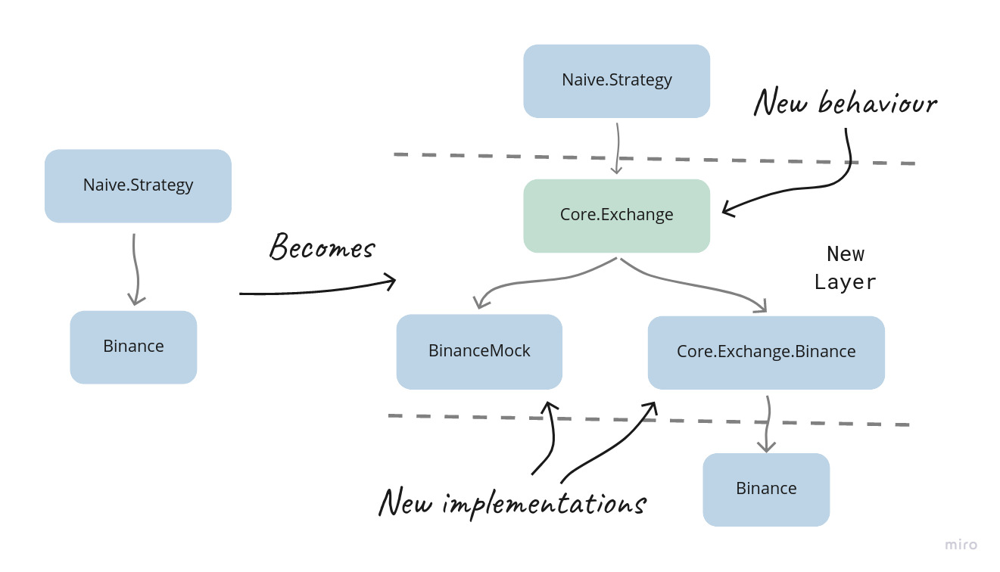

# Layers of abstraction

## Objectives
- admitting the simplification
- abstracting the exchange
- mimicking the reality
- swapping back to attributes

## Admitting the simplification

There comes a time when I need to admit to something that I've learned on the way as I was writing this book and was misused throughout.

When we were using the `Mox` package, we were disappointed that most packages don't provide behaviours we could use in our tests(to mock the actual implementations).

To fix that, we were creating behaviours for 3rd party packages we are using, like `Binance` or even `Ecto.Repo`. This approach felt weird, and it should, as I believe that was **not the intended usage** of the `Mox` package.

\newpage

Instead, we should introduce an additional layer(of abstraction) on top of the 3rd party modules we are using. A typical example could be abstracting dealing with an exchange to an behaviour and providing different implementations(for example, one could be wrapping the `Binance` module):

```{r, fig.align="center", out.width="100%", echo=FALSE}

```

In the example above, we will introduce a new behaviour module called `Core.Exchange` that would define the standard way to interact with any exchange. As this will be a generic **exchange** behaviour, it needs to accept and return generic structs(we will need to define those as well).

We will also create a new `Core.Exchange.Binance` module(wrapping up the `Binance` module) and update the `BinanceMock` module. Both will implement the `Core.Exchange` behaviour.

In this chapter, we will look into the intended way/scenario for using the `Mox` package, its advantages and disadvantages and go beyond and look into alternatives.

## Abstracting the exchange

First, we will look at an intended use case for the `Mox` module, as mentioned above.

### Defining the `Core.Exchange` behaviour

We will start by creating a new file `/apps/core/lib/core/exchange.ex` together with a new module inside it:

```{r, engine = 'elixir', eval = FALSE}	 
# /apps/core/lib/core/exchange.ex
defmodule Core.Exchange do

end
```

\newpage

Now, based on how we currently interact with the `Binance` module inside the `Naive.Strategy`, we can define the following callback functions:

`order_limit_buy/3` - almost the same as the `Binance.order_limit_buy/4`, just skipped the optional argument

```{r, engine = 'elixir', eval = FALSE}	 
  # /apps/core/lib/core/exchange.ex
  @callback order_limit_buy(symbol :: String.t(), quantity :: number(), price :: number()) ::
              {:ok, Core.Exchange.Order.t()}
              | {:error, any()}
```

`order_limit_sell/3` - almost the same as the `Binance.order_limit_sell/4`, just skipped the optional argument

```{r, engine = 'elixir', eval = FALSE}	 
  # /apps/core/lib/core/exchange.ex
  @callback order_limit_sell(symbol :: String.t(), quantity :: number(), price :: number()) ::
              {:ok, Core.Exchange.Order.t()}
              | {:error, any()}
```

`get_order/3` - the same as the `Binance.get_order/3`

```{r, engine = 'elixir', eval = FALSE}	 
  # /apps/core/lib/core/exchange.ex
  @callback get_order(
              symbol :: String.t(),
              timestamp :: non_neg_integer(),
              order_id :: non_neg_integer()
            ) ::
              {:ok, Core.Exchange.Order.t()}
              | {:error, any()}
```

All of the above callbacks rely on the `Core.Exchange.Order` struct, which we will add now inside the `Core.Exchange` module:

```{r, engine = 'elixir', eval = FALSE}	 
  # /apps/core/lib/core/exchange.ex
  defmodule Order do
    @type t :: %__MODULE__{
            id: non_neg_integer(),
            symbol: String.t(),
            price: number(),
            quantity: number(),
            side: :buy | :sell,
            status: :new | :filled,
            timestamp: non_neg_integer()
          }

    defstruct [:id, :symbol, :price, :quantity, :side, :status, :timestamp]
  end
```

The above struct is a simplification of the `Binance.Order` struct limited to just the fields we are using in our strategy.

Additionally, we use the `Binance` module to fetch symbol filters inside the `Naive.Strategy` (we actually fetch the whole exchange info and then dig inside to find our filters) - we will create a dedicated struct for those filters:

```{r, engine = 'elixir', eval = FALSE}
  # /apps/core/lib/core/exchange.ex
  # add below inside the Core.Exchange module
  defmodule SymbolInfo do
    @type t :: %__MODULE__{
            symbol: String.t(),
            tick_size: number(),
            step_size: number()
          }

    defstruct [:symbol, :tick_size, :step_size]
  end

  @callback fetch_symbol_filters(symbol :: String.t()) ::
              {:ok, Core.Exchange.SymbolInfo.t()}
              | {:error, any()}
```

The final usage of the `Binance` module comes from the seed scripts, where we fetch the exchange info just to get the list of the supported currencies. We will make getting a list of supported currencies part of our behaviour:

```{r, engine = 'elixir', eval = FALSE}
  # /apps/core/lib/core/exchange.ex
  # add below inside the Core.Exchange module
  @callback fetch_symbols() ::
              {:ok, [String.t()]}
              | {:error, any()}
```

This finishes the definition of the `Core.Exchange` behaviour. It should consist of five callback functions(
`fetch_symbols/0`, `fetch_symbol_filters/1`, `get_order/3`, `order_limit_buy/3` and `order_limit_sell/3`) together with two structs(`Order` and `SymbolInfo`).

### Implementation of the `Core.Exchange.Binance` module

As we defined the behaviour, we can now wrap the production implementation(the `Binance` module) inside a module that will implement that behaviour.

We will start by creating a new directory called "exchange" inside the `apps/core/lib/core` directory, together with a new file called `binance.ex`. Inside it, we will define a module that will implement the `Core.Exchange` behaviour:

```{r, engine = 'elixir', eval = FALSE}
# /apps/core/lib/core/exchange/binance.ex
defmodule Core.Exchange.Binance do
  @behaviour Core.Exchange
end
```

Now we are obliged to implement all functions defined in the behaviour, starting with the `fetch_symbols/0`:

```{r, engine = 'elixir', eval = FALSE}
  # /apps/core/lib/core/exchange/binance.ex
  alias Core.Exchange

  @impl Core.Exchange
  def fetch_symbols() do
    case Binance.get_exchange_info() do
      {:ok, %{symbols: symbols}} ->
        symbols
        |> Enum.map(& &1["symbol"])
        |> then(&{:ok, &1})

      error ->
        error
    end
  end
```

As we can see - the `case` statement wraps the call to the `Binance` module, and either we evaluate further business logic or forward the error so the "consumer" of our library can decide what to do with the error condition. This pattern will appear in all our functions as the `Core.Exchange.Binance` module is our own "library" module.

Let's continue with implementing the remaining functions defined in the behaviour:

```{r, engine = 'elixir', eval = FALSE}
  # /apps/core/lib/core/exchange/binance.ex
  @impl Core.Exchange
  def fetch_symbol_filters(symbol) do
    case Binance.get_exchange_info() do
      {:ok, exchange_info} -> {:ok, fetch_symbol_filters(symbol, exchange_info)}
      error -> error
    end
  end

  defp fetch_symbol_filters(symbol, exchange_info) do
    symbol_filters =
      exchange_info
      |> Map.get(:symbols)
      |> Enum.find(&(&1["symbol"] == symbol))
      |> Map.get("filters")

    tick_size =
      symbol_filters
      |> Enum.find(&(&1["filterType"] == "PRICE_FILTER"))
      |> Map.get("tickSize")

    step_size =
      symbol_filters
      |> Enum.find(&(&1["filterType"] == "LOT_SIZE"))
      |> Map.get("stepSize")

    %Exchange.SymbolInfo{
      symbol: symbol,
      tick_size: tick_size,
      step_size: step_size
    }
  end
```

The `fetch_symbol_filters/1` function follows the previously discussed pattern. The `fetch_symbol_filters/2`, on the other hand, is a modified copy of the `merge_filters_into_settings/2` function from the `Naive.Strategy` module is now returning the `Exchange.SymbolInfo` struct.

Another function to be implemented to fulfil the behaviour is `get_order/3`:

```{r, engine = 'elixir', eval = FALSE}
  # /apps/core/lib/core/exchange/binance.ex
  @impl Core.Exchange
  def get_order(symbol, timestamp, order_id) do
    case Binance.get_order(symbol, timestamp, order_id) do
      {:ok, %Binance.Order{} = order} ->
        {:ok,
         %Exchange.Order{
           id: order.order_id,
           symbol: order.symbol,
           price: order.price,
           quantity: order.orig_qty,
           side: side_to_atom(order.side),
           status: status_to_atom(order.status),
           timestamp: order.time
         }}

      error ->
        error
    end
  end
  
  defp side_to_atom("BUY"), do: :buy
  defp side_to_atom("SELL"), do: :sell

  defp status_to_atom("NEW"), do: :new
  defp status_to_atom("FILLED"), do: :filled
```

As in the case of the previously implemented functions, the `get_order/3` implementation wraps the `Binance`'s function inside the `case` statement. To satisfy the `Core.Exchange` behaviour, it needs to return the `Exchange.Order` struct - hence the conversion. It also needs to convert the string `side` and `status` fields to atoms before assigning them to the struct(that's the role of the `status_to_atom` and `side_to_atom` helper functions).

The final two functions to be implemented will be the `order_limit_buy/3` and `order_limit_sell/3`:

```{r, engine = 'elixir', eval = FALSE}
  # /apps/core/lib/core/exchange/binance.ex
  @impl Core.Exchange
  def order_limit_buy(symbol, quantity, price) do
    case Binance.order_limit_buy(symbol, quantity, price, "GTC") do
      {:ok, %Binance.OrderResponse{} = order} ->
        {:ok,
         %Exchange.Order{
           id: order.order_id,
           price: order.price,
           quantity: order.orig_qty,
           side: :buy,
           status: :new,
           timestamp: order.transact_time
         }}

      error ->
        error
    end
  end

  @impl Core.Exchange
  def order_limit_sell(symbol, quantity, price) do
    case Binance.order_limit_sell(symbol, quantity, price, "GTC") do
      {:ok, %Binance.OrderResponse{} = order} ->
        {:ok,
         %Exchange.Order{
           id: order.order_id,
           price: order.price,
           quantity: order.orig_qty,
           side: :sell,
           status: :new,
           timestamp: order.transact_time
         }}

      error ->
        error
    end
  end
```

That finishes our first implementation of the `Core.Exchange` behaviour. It will be used in the production by our `Naive.Strategy`, but before we will update it, let's update the `BinanceMock` module to implement the same behaviour for testing/backtesting.

### Updating the `BinanceMock` module to implement the `Core.Exchange` behaviour

The `BinanceMock` module must implement the `Core.Exchange` behaviour. It will (at compile time) guarantee that both `Core.Exchange.Binance` and `BinanceMock` share a common interface that can be used by the `Naive.Strategy`.

First, we will start by declaring that the `BinanceMock` actually implements the `Core.Exchange` behaviour:

```{r, engine = 'elixir', eval = FALSE}
# /apps/binance_mock/lib/binance_mock.ex
defmodule BinanceMock do
  @behaviour Core.Exchange # <= added
```

Next, we can replace all the aliases to the `Binance` structs with a single alias to the `Core.Exchange` module:

```{r, engine = 'elixir', eval = FALSE}
  # /apps/binance_mock/lib/binance_mock.ex
  alias Core.Exchange
```

Don't forget to update all references to the `Binance.Order` with `Exchange.Order` module.

As the behaviour is now defined in the `Core.Exchange` module, we can remove all `@type` and `@callback` attributes.

Moving on, we will replace the `get_exchange_info/0`(together with it's `get_cached_exchange_info/0` helper function) with `fetch_symbols/0` and `fetch_symbol_filters/1`(and their helper functions):

```{r, engine = 'elixir', eval = FALSE}
  # /apps/binance_mock/lib/binance_mock.ex
  def fetch_symbols() do
    case fetch_exchange_info() do
      {:ok, %{symbols: symbols}} ->
        symbols
        |> Enum.map(& &1["symbol"])
        |> then(&{:ok, &1})

      error ->
        error
    end
  end

  def fetch_symbol_filters(symbol) do
    case fetch_exchange_info() do
      {:ok, exchange_info} ->
        {:ok, fetch_symbol_filters(symbol, exchange_info)}

      error ->
        error
    end
  end

  defp fetch_exchange_info() do
    case Application.get_env(:binance_mock, :use_cached_exchange_info) do
      true ->
        get_cached_exchange_info()

      _ ->
        Binance.get_exchange_info()
    end
  end

  defp get_cached_exchange_info do
    File.cwd!()
    |> Path.split()
    |> Enum.drop(-1)
    |> Kernel.++([
      "binance_mock",
      "test",
      "assets",
      "exchange_info.json"
    ])
    |> Path.join()
    |> File.read()
  end

  defp fetch_symbol_filters(symbol, exchange_info) do
    # <= this is a copy of `Core.Exchange.Binance.fetch_symbol_filters/2` function
  end
```

There are a few additional helpers above, and it got a bit long - let's unpack it.

First, both the `fetch_symbols/0` and `fetch_symbol_filters/1` look very similar to the ones we implemented for the `Core.Exchange.Binance` module. The main difference here is that we support cached exchange info by introducing the `fetch_exchange_info/0` function, which branches out to either using the `Binance` module or the `get_cached_exchange_info/0` function. The latter was updated to return the raw data instead of the `Binance.ExchangeInfo` struct.

Next, there's the `get_oder/3` function - as it's working in the same way as per our behaviour, we will leave it as it is.

\newpage

The final two functions to update will be the `order_limit_buy/4` and `order_limit_sell/4`, which will now become three argument functions:

```{r, engine = 'elixir', eval = FALSE}
  # /apps/binance_mock/lib/binance_mock.ex
  def order_limit_buy(symbol, quantity, price) do
    order_limit(symbol, quantity, price, "BUY")
  end

  def order_limit_sell(symbol, quantity, price) do
    order_limit(symbol, quantity, price, "SELL")
  end
```

In the above functions, we simply skipped the fourth arguments to fulfil the behaviour.

The changes to different structs will have a ripple effect in other parts of the BinanceMock module:

```{r, engine = 'elixir', eval = FALSE}
  # /apps/binance_mock/lib/binance_mock.ex
  def generate_fake_order(...) do
    ...
    %Exchange.Order{
      id: order_id,
      symbol: symbol,
      price: price,
      quantity: quantity,
      side: side_to_atom(side),
      status: status_to_atom("NEW"),
      timestamp: current_timestamp
    } # <= keys updated & `.new` dropped
  end

  defp side_to_atom("BUY"), do: :buy   # <= added
  defp side_to_atom("SELL"), do: :sell # <= added

  defp status_to_atom("NEW"), do: :new       # <= added
  defp status_to_atom("FILLED"), do: :filled # <= added

  def handle_call(
        {:get_order, symbol, time, order_id},
        ...
  ) do
    ...
      |> Enum.find(
        &(&1.symbol == symbol and
            &1.timestamp == time and # <= field updated
            &1.id == order_id)       # <= field updated
      )
  end

  def handle_info(
      %TradeEvent{} = trade_event,
      ...
  ) do
  ...
    filled_buy_orders =
      ...
      |> Enum.map(&Map.replace!(&1, :status, :filled)) # <= changed to atom
  ...
    filled_sell_orders =
      ...
      |> Enum.map(&Map.replace!(&1, :status, :filled)) # <= changed to atom
  ...
  end

  defp order_limit(symbol, quantity, price, side) do
    ...
   {:ok, fake_order} # <= no need to convert between structs any more
  end

  # remove the `convert_order_to_order_response/1` function - not required anymore

  # and finally ;)

  defp convert_order_to_event(%Exchange.Order{} = order, time) do
    %TradeEvent{
      event_time: time - 1,
      symbol: order.symbol,
      trade_id: Integer.floor_div(time, 1000),
      price: order.price,
      quantity: order.quantity,  
      buyer_order_id: order.id,
      seller_order_id: order.id,
      trade_time: time - 1,
      buyer_market_maker: false
    } # ^^^^^^= updated mapping
  end
```

The above changes finish the modifications to the BiananceMock. The module now correctly implements the behaviour.

### Updating the `Naive.Strategy`

We can now move on to the code that will use our implementations of the `Core.Exchange` behaviour - the `Naive.Strategy` module.

We will start by adding an alias to the `Core.Exchange` at the top of the module:

```{r, engine = 'elixir', eval = FALSE}
  # /apps/naive/lib/naive/strategy.ex
  alias Core.Exchange
```

Next, we can rename the configuration based `@binance_client` to `@exchange_client` and update references to it throughout the module:

```{r, engine = 'elixir', eval = FALSE}
  # /apps/naive/lib/naive/strategy.ex
  @exchange_client Application.compile_env(:naive, :exchange_client)
```

Besides the above, we are now relying on the generic structs, so we need to update all references to the `Binance.OrderResponse` and `Binance.Order` modules with the `Exchange.Order` (including updating all field names) - for example:

```{r, engine = 'elixir', eval = FALSE}
  # /apps/naive/lib/naive/strategy.ex
  # from:
        %Position{
          buy_order: %Binance.Order{
            order_id: order_id,
            status: "FILLED"
          },
          sell_order: Binance.Order{}
        },

  # to:
        %Position{
          buy_order: %Exchange.Order{ # <= struct updated
            id: order_id,   # <= key updated
            status: :filled # <= updated to atom
          },
          sell_order: %Exchange.Order{}
        }

  # rename cheatsheet:
  # order_id to id (do not use "global" file replace)
  # orig_qty to quantity ("global" file replace safe)
  # transact_time to timestamp ("global" file replace safe)
  # "FILLED" to :filled ("global" file replace safe)
```

\newpage

As the behaviour's interface(public functions) differs from the `Binance` module, we need to update all calls that we simplified:

```{r, engine = 'elixir', eval = FALSE}
  # /apps/naive/lib/naive/strategy.ex
  {:ok, %Exchange.Order{} = order} = @exchange_client.order_limit_buy(symbol, quantity, price)
  ...
  {:ok, %Exchange.Order{} = order} =
      @exchange_client.order_limit_sell(symbol, quantity, sell_price)
```

As of now, we will deal only with the `Exchange.Order` structs instead a pair of `Binance.OrderResponse` and `Binance.Order`, we can simplify the existing two clauses of `broadcast_order/1` into a single one(and remove the `convert_to_order/1` function):

```{r, engine = 'elixir', eval = FALSE}
  # /apps/naive/lib/naive/strategy.ex
  defp broadcast_order(%Exchange.Order{} = order) do
    @pubsub_client.broadcast(
      Core.PubSub,
      "ORDERS:#{order.symbol}",
      order
    )
  end
```

The final change to the `Naive.Strategy` module will be to update the `fetch_symbol_settings/1` function (and remove the `merge_filters_into_settings/3` function):

```{r, engine = 'elixir', eval = FALSE}
  # /apps/naive/lib/naive/strategy.ex
  def fetch_symbol_settings(symbol) do
    {:ok, filters} = @exchange_client.fetch_symbol_filters(symbol)
    db_settings = @repo.get_by!(Settings, symbol: symbol)

    Map.merge(
      filters |> Map.from_struct(),
      db_settings |> Map.from_struct()
    )
  end
```

The function is now much more straightforward as we use the `fetch_symbol_filters/1` function implemented as a part of the `Core.Exchange` behaviour.

\newpage

### Updating the seed scripts

The other places we use the exchange are seed scripts that we need to update. First inside the `Naive` application:

```{r, engine = 'elixir', eval = FALSE}
# /apps/naive/priv/seed_settings.exs
exchange_client = Application.compile_env(:naive, :exchange_client)
...
{:ok, symbols} = exchange_client.fetch_symbols()
...
maps = symbols
  |> Enum.map(&(%{base_settings | symbol: &1}))
```

We no longer use the `binance_client` but `exchange_client` instead - in the same fashion as inside the `Naive.Strategy` module. Both implementations provide the `fetch_symbols/0` function, which returns a list of symbols - hence the change inside the `Enum/2` function.

We will follow up with changes to the seeding script of the `Streamer` application(I will skip listing the changes here as they are  **the same** as in the case of the `Naive` application).

At this moment, we can change the configuration to make the `Naive.Strategy` work:

```{r, engine = 'elixir', eval = FALSE}
# /config/config.ex 
config :streamer,
  exchange_client: BinanceMock, # <= key updated

config :naive,
  exchange_client: BinanceMock, # <= key updated

# /config/prod.exs
config :naive,
  exchange_client: Core.Exchange.Binance # <= key and module updated

config :streamer,
  exchange_client: Core.Exchange.Binance # <= key and module updated

# /config/test.exs
config :naive,
  exchange_client: Test.BinanceMock, # <= key updated
```

\newpage

### Manual testing after the refactoring

We can now test that `Naive.Strategy` works:

```{r, engine = 'bash', eval = FALSE}
$ iex -S mix
...
iex(1)> Streamer.start_streaming("XRPUSDT")
...
iex(2)> Naive.start_trading("XRPUSDT")
...
21:42:12.813 [info]  Position (XRPUSDT/1662842530254): Placing a BUY order @ 0.35560000,
quantity: 562.00000000
21:42:15.280 [info]  Position (XRPUSDT/1662842530254): The BUY order is now partially filled
21:42:15.281 [info]  Position (XRPUSDT/1662842530254): The BUY order is now filled. Placing
a SELL order @ 0.35580000, quantity: 562.00000000
21:42:15.536 [info]  Position (XRPUSDT/1662842530254): The SELL order is now partially
filled
21:42:15.593 [info]  Position (XRPUSDT/1662842530254): Trade cycle finished
```

The above output confirms that we have a full working trading flow using either `Core.Exchange.Binance` or `BinanceMock`. 

### Storing the data

As we are now using generic structs like the `Core.Exchange.Order`, all data storage-related code needs to be updated.

We will start by updating the migration script to store only limited passed data:

```{r, engine = 'elixir', eval = FALSE}
  # /apps/data_warehouse/priv/repo/migrations/20210222224522_create_orders.exs
  def change do
    create table(:orders, primary_key: false) do
      add(:id, :bigint, primary_key: true)
      add(:symbol, :text)
      add(:price, :text)
      add(:quantity, :text)
      add(:side, :text)
      add(:status, :text)
      add(:timestamp, :bigint)

      timestamps()
    end
  end
```

A lot of fields got removed/renamed, including the primary key. We will follow up by updating the schema for that table:

```{r, engine = 'elixir', eval = FALSE}
 # /apps/data_warehouse/lib/data_warehouse/schema/order.ex
  @primary_key {:id, :integer, autogenerate: false} # <= column updated

  schema "orders" do
    field(:symbol, :string)
    field(:price, :string)
    field(:quantity, :string)
    field(:side, :string)
    field(:status, :string)
    field(:timestamp, :integer)

    timestamps()
  end
```

The schema was updated to mirror the new shape of the `orders`  db table.
We can now progress to the Worker, where we will start to use the `Core.Exchange` based structs:

```{r, engine = 'elixir', eval = FALSE}
  # /apps/data_warehouse/lib/data_warehouse/subscriber/worker.ex
  alias Core.Exchange # <= alias added
  ...
  def handle_info(%Exchange.Order{} = order, state) do
    data =
      order
      |> Map.from_struct()
      |> Map.merge(%{
        side: atom_to_side(order.side),
        status: atom_to_status(order.status)
      })

    struct(DataWarehouse.Schema.Order, data)
    |> DataWarehouse.Repo.insert(
      on_conflict: :replace_all,
      conflict_target: :id # <= column updated
    )
    ...

  defp atom_to_side(:buy), do: "BUY"
  defp atom_to_side(:sell), do: "SELL"

  defp atom_to_status(:new), do: "NEW"
  defp atom_to_status(:filled), do: "FILLED"
```

The `Worker` will now pattern matches on the `Core.Exchange.Order` struct instead of `Binance.Order` as before. Inside the callback, we simplified the mapping to the schema struct and updated the conflict to the renamed `id` column. Finally, we added the helper functions to convert `status` and `side` atoms to strings.

### The `Mox` approach summary

We didn't yet look into updating our tests, but instead of focusing on that, we will chat about our implementation.

First, it's worth stressing that it required multiple changes to many parts of the system spanning from the `Naive` application through `Streamer` (seeding) and ending in the `DataWarehouse` application.

More importantly, we needed to define a behaviour. It gives us a compile-time guarantee, but on the other hand, we were pushed to define it very early.

Let me explain.

Up to this moment, we have been using only the `Binance` module. We didn't have an opportunity to work with other modules/exchanges. In fact, we **didn't want to** create an `Exchange` level abstraction. We were happy with using the `Binance` module, and we added the behaviour just to be able to use the `Mox` package to mock it inside our tests. All of this feels like a really heavy over-engineering just to be able to test.

Furthermore, as we defined the behaviour, we needed to define the generic structs that we based on the ones from the `Binance` module. We have never seen examples of structs from other packages, so we took only fields that we are using in our strategy to limit the possibility of missing data from another exchange in the future. The knock-on effect will be that we are already missing valuable data in the database as well as adding any new exchanges in the future may require updates to the behaviour, behaviour's existing implementations and most of the code that uses it (like the `Naive.Strategy`).

Additionally, we returned the `Binance`'s error messages straight to the user of our abstraction(`Naive.Strategy`). We should be converting those to generic errors, but we don't have a clue about other exchanges and the errors they could raise.

At this moment, abstracting our code into behaviour+implementations is uneducated over-engineering and simply asking for troubles in the future.

What's the alternative?

The first thing that comes to mind would be to look for some "standard" that could be leveraged to build our behaviour/define structs. For cryptocurrency exchanges, that will be "CCXT" - it's an open-source "library" available for Python, JavaScript and PHP.

We could look further and look for an Elixir implementation of the CCXT package and find the package named `ccxtex`. It's a wrapper around the JavaScript version of the CCXT package.

Using the above(either the `ccxtex` package or `ccxt` as a "blueprint") instead of trying to figure out our own behaviour based on our limited knowledge about exchanges would most certainly let us avoid continuous updates to our code.

Those updates, coupled with the fact that we would add the behaviour just to be able to test the implementation, put usage of the `Mox` package in serious doubt.

The source code up to this moment can be found at [Github](https://github.com/Cinderella-Man/hands-on-elixir-and-otp-cryptocurrency-trading-bot-source-code/tree/chapter_21_mox)

We will stop here and **revert** to the source code from the end of the [20th chapter](https://github.com/Cinderella-Man/hands-on-elixir-and-otp-cryptocurrency-trading-bot-source-code/tree/chapter_20). Instead of leaving something we are not prepared to continue with, we will look into alternative ways to test our strategy.

## Mimicking the reality

In this section, we will look into using the `Mimic` package to mock the `Binance` module to test our `Naive.Strategy`. The advantage of using the `Mimic` package is that we don't need to define behaviours to mock our modules.

Let's kick this off by swapping the `mox` package to the `mimic` package in the dependencies of the `Naive` application:

```{r, engine = 'elixir', eval = FALSE}
  # /apps/naive/mix.exs
  defp deps do
    [
      ...
      {:mimic, "~> 1.7", only: [:test, :integration]},
      ...
    ]
  end
```

Don't forget to run `mix deps.get` to resolve the dependencies.

### Updating the `Naive.Strategy`

Before we dive into writing new tests, we can update the `Naive.Strategy` module. The `mimic` module doesn't require us to inject dependencies into module attributes based on config, so we can remove them:

```{r, engine = 'elixir', eval = FALSE}
# /apps/naive/lib/naive/strategy.ex
  # remove the below lines
  @binance_client Application.compile_env(:naive, :binance_client)
  @logger Application.compile_env(:core, :logger)
  @pubsub_client Application.compile_env(:core, :pubsub_client)
  @repo Application.compile_env(:naive, :repo)
```

We will switch back to using modules' names as before. We will update all references to attributes throughout the module with corresponding hardcoded module names:

```{r, engine = 'elixir', eval = FALSE}
# /apps/naive/lib/naive/strategy.ex
# change @logger to Logger
# change @binance_client to Binance
# change @pubsub_client to Phoenix.PubSub
# change @repo to Repo
```

As we are pointing to `Repo` instead of `Naive.Repo`, we need to add an alias at the top of the module:

```{r, engine = 'elixir', eval = FALSE}
# /apps/naive/lib/naive/strategy.ex
alias Naive.Repo
```

[Note: At this moment, we will apply the above changes to the `Indicator.Ohlc.Worker` and `Indicator.Ohlc`(
  
`apps/indicator/lib/indicator/ohlc/worker.ex` and `apps/indicator/lib/indicator/ohlc.ex`) to avoid breaking the application when we will clean
up the config in the next step.]

\newpage

That finishes our conversion to hardcoded module names. As we are no longer basing our module on the configuration, we can remove all redundant configuration keys from the main `config.exs` file:

```{r, engine = 'elixir', eval = FALSE}
# /config/config.exs
config :core,                   # <= remove
  logger: Logger,               # <= remove
  pubsub_client: Phoenix.PubSub # <= remove

config :streamer,
  binance_client: BinanceMock,  # <= remove
  ...

config :naive,
  binance_client: BinanceMock,  # <= remove
  repo: Naive.Repo,             # <= remove
  ...
```

 We can now move on to figure out how we are going to test it.

### Testing the `Naive.Strategy`

First, we can remove the existing unit tests(`apps/naive/test/naive/trader_test.exs`) as they are not applicable anymore.

Next, we will create a new file `apps/naive/test/naive/strategy_test.exs` with a skeleton of a test:

```{r, engine = 'elixir', eval = FALSE}
# /apps/naive/test/naive/strategy_test.exs
defmodule Naive.StrategyTest do
  use ExUnit.Case, async: true
  use Mimic

  alias Core.Struct.TradeEvent
  alias Naive.Strategy

  # we will add our tests here
end
```

As we will stub dependencies using `mimic`, we need to `use` it inside the test module.

We will be testing the primary entry function, the `Naive.Strategy.execute/3`, where we will first focus on placing a buy order scenario:

```{r, engine = 'elixir', eval = FALSE}
# /apps/naive/test/naive/strategy_test.exs
  @tag :unit
  test "Strategy places a buy order" do
    # we will put our code here
  end
```

\newpage

The simplest scenario will be to pass hardcoded settings, a fresh position(based on those settings) and a trade event(that will trigger the buy order):

```{r, engine = 'elixir', eval = FALSE}
# /apps/naive/test/naive/strategy_test.exs
  settings = %{
    symbol: "ABC", 	 
    chunks: "5", 	 
    budget: "200", 	 
    buy_down_interval: "0.2",
    profit_interval: "0.1",
    rebuy_interval: "0.5",
    tick_size: "0.000001",
    step_size: "0.001",
    status: :on
  }

  {:ok, new_positions} = Naive.Strategy.execute(
    %TradeEvent{
      price: "1.00000"
    },
    [
      Strategy.generate_fresh_position(settings)
    ],
    settings
  )
```

Now, the above call to the `Naive.Strategy.execute/3` will cause the `Binance.order_limit_buy/4`, `Phoenix.PubSub.brodcast/3` and `Logger.info/1`(we will skip this one and get back to it later) functions to be called. We need to mock those functions at the beginning of our test before calling the `Naive.Strategy.execute/3` function:

```{r, engine = 'elixir', eval = FALSE}
# /apps/naive/test/naive/strategy_test.exs
  expected_order = %Binance.OrderResponse{ 
    client_order_id: "1", 
    executed_qty: "0.000", 
    order_id: "x1", 
    orig_qty: "50.000", 
    price: "0.800000", 
    side: "BUY", 
    status: "NEW", 
    symbol: "ABC"
  }
 
  Binance
  |> stub(
    :order_limit_buy,
    fn "ABC", "50.000", "0.800000", "GTC" -> {:ok, expected_order} end 	 
  )

  Phoenix.PubSub
  |> stub(
    :broadcast,
    fn _pubsub, _topic, _message -> :ok end
  )
```

We can use the `expected_order` above to assert that the `Naive.Strategy.execute/3` returned the correct value - the `buy_order` field should hold the same data as the `expected_order`. We can add the below assertions at the end of the test:

```{r, engine = 'elixir', eval = FALSE}
# /apps/naive/test/naive/strategy_test.exs
    assert (length new_positions) == 1

    %{buy_order: buy_order} = List.first(new_positions)
    assert buy_order == expected_order
```

That finishes the test implementation, but before we will be able to use the `mimic` module, we need to prepare modules so we can stub them inside tests - here are the new contents of the test helper file:

```{r, engine = 'elixir', eval = FALSE}
# /apps/naive/test/test_helper.exs
Application.ensure_all_started(:mimic)

Mimic.copy(Binance)
Mimic.copy(Phoenix.PubSub)

ExUnit.start()
```

We removed all references to the `mox` module and replaced them with calls to the `Mimic.copy/1` function.

We are now ready to run our new test:

```{r, engine = 'bash', eval = FALSE}
$ mix test.unit
...
21:49:39.737 [info] Position (ABC/1675460979732): Placing a BUY order @ 0.800000,
quantity: 50.000
.
Finished in 0.2 seconds (0.2s async, 0.00s sync)
2 tests, 0 failures, 1 excluded
```

As we can see, we successfully mocked the `Binance` and `Phoenix.PubSub` modules. We can also see that we are getting log messages that we will deal with next.

### Logging elephant in the room

As we moved back to using the `Logger` module instead of some dummy implementation, we are now back to square one, seeing logs in our tests. We could go on the route of mocking the `Logger` module using the `Mimic`, but actually, there's a better way to deal with logs in the tests.

As ExUnit starts, it allows us to pass options that will modify its behaviour. One of those is `capture_log`, which, when set to `true`, will cause ExUnit to hide all log messages - let's update the test helper script to enable this feature:

```{r, engine = 'elixir', eval = FALSE}
# /apps/naive/test/test_helper.exs
...
ExUnit.start(capture_log: true)
```

Let's rerun our tests to see the difference:

```{r, engine = 'bash', eval = FALSE}
$ mix test.unit
...
.
Finished in 0.2 seconds (0.2s async, 0.00s sync)
2 tests, 0 failures, 1 excluded
```

We can see that the ExUnit output is now free of any logs.

But what if we would like to assert the logged message? We were able to do that using the `mox` package, as we were mocking and asserting log messages' contents inside those mocks.

ExUnit provides a helper function for that case as well. We will modify our test to capture the log inside it and assert that it logs the correct value (the price of $0.8):

```{r, engine = 'elixir', eval = FALSE}
# /apps/naive/test/naive/strategy_test.exs
  import ExUnit.CaptureLog # <= import logging capturing functionality
  ...
  test "Strategy places a buy order" do
    ...
    {{:ok, new_positions}, log} =
      with_log(fn ->
        Naive.Strategy.execute(
          %TradeEvent{
            price: "1.00000"
          },
          [
            Strategy.generate_fresh_position(settings)
          ],
          settings
        )
      end)

    assert log =~ "0.8"
```

In the above code, we wrapped our call to the `Naive.Strategy.execute/3` into an anonymous function that we passed as an argument to the `with_log/1` function. The `with_log/1` function returns a tuple containing the result of the passed function and the generated log message(s). We can then assert that the logged message contains the expected value, strengthening our test. We can now rerun our unit test:


```{r, engine = 'bash', eval = FALSE}
$ mix test.unit
...
.
Finished in 0.2 seconds (0.2s async, 0.00s sync)
2 tests, 0 failures, 1 excluded
```

It's worth noting that we were able to capture the log message even with global capture_log enabled(inside the test helper when starting ExUnit). This gives us ultimate flexibility. None of the logs are displayed, although whenever we need, we can always capture logs inside test cases on a test-by-tas basis.

That would wrap up the writing unit tests part. But how will this work with running our code locally(or in "production") or running integration tests?

## Swapping back to attributes

We need to have a way to swap Binance's implementation between dev/test/integration and prod environments.

We can't use the `mimic` package to swap the implementation as this is a "running" mode, not some tests.

Please note that most of the applications won't need to change the implementation based on the environment as the 3rd party library/package itself will provide some flags to enable/disable the functionality(like sending emails to newly registered users).

Let's get back to the `Naive.Strategy` module, where we will bring back the attribute-based `@binance_client`:

```{r, engine = 'elixir', eval = FALSE}
# /apps/naive/lib/naive/strategy.ex
  @binance_client Application.compile_env(:naive, :binance_client)
  ...
  @binance_client.order_limit_buy(...)
  ...
  @binance_client.order_limit_sell(...)
  ...
  @binance_client.get_order(...)
  ...
  @binance_client.get_order(...)
  ...
  @binance_client.get_exchange_info(...)
```

We need to update all references to the Binance module's functions to use the `@binance_client` module's attribute.

\newpage

As we are already modifying the `Naive` application, we can follow up by removing the `@logger` and `@pubsub_client` module's attributes in the `Naive.Trader`:

```{r, engine = 'elixir', eval = FALSE}
# /apps/naive/lib/naive/trader.ex
  # remove the below attributes
  @logger Application.compile_env(:core, :logger)
  @pubsub_client Application.compile_env(:core, :pubsub_client)
  ...
  # change @logger to Logger
  # change @pubsub_client to Phoenix.PubSub
```

### Config files

We will now move to config files, where we will re-add the `binance_client` configuration. As previously we will want the `BinanceMock` to be used everywhere besides production:

```{r, engine = 'elixir', eval = FALSE}
# /config/config.exs
config :streamer,
  binance_client: BinanceMock # <= add

config :naive,
  binance_client: BinanceMock,  # <= add
  leader: Naive.Leader,         # <= remove

# /config/prod.exs
# stays as it was - pointing to the `Binance` module

# /config/test.exs
# remove everything besides the `import`
```

It's important to understand that we don't need to configure the `binance_client` inside the test configuration. As we now utilise the `mimic` package, we can drive mocking from the test level.

The knock-on effect of bringing back the environment driven `@binance_client` is that now we will need to mimic the `BinanceMock` module instead of `Binance` for our unit tests. To fix that, we need to update the test helper:

```{r, engine = 'elixir', eval = FALSE}
# /apps/naive/test/test_helper.exs
...
Mimic.copy(BinanceMock) # <= updated from Binance
```

and the unit test:

```{r, engine = 'elixir', eval = FALSE}
    # /apps/naive/test/naive/strategy_test.exs
    ...
    BinanceMock # <= updated from Binance
    |> stub(
```

We needed to change the above as now, in the case of dev and integration, we are using the `BinanceMock`. 

After applying the above changes, we can now run the unit tests:

```{r, engine = 'bash', eval = FALSE}
$ mix test.unit
...
.
Finished in 0.2 seconds (0.2s async, 0.00s sync)
2 tests, 0 failures, 1 excluded
```

As well as run the integration tests:

```{r, engine = 'bash', eval = FALSE}
$ MIX_ENV=integration mix test.integration
.
Finished in 7.2 seconds (0.04s async, 7.1s sync)
2 tests, 0 failures, 1 excluded
```

And finally, we are able to run the project:

```{r, engine = 'bash', eval = FALSE}
$ iex -S mix
...
iex(1)> Streamer.start_streaming("ETHUSDT")
...
iex(2)> Naive.start_trading("ETHUSDT")
...
22:57:53.834 [info] Position (ETHUSDT/1675724273832): Placing a BUY order @ 1632.82000000,
quantity: 0.12240000
```

In this chapter, we've reiterated the ideas behind the `mox` package, highlighting its shortcomings, especially the push to create needless abstractions(behaviours). We then dropped our changes to show the alternative approach using the 'mimic' package, which was way handier and easier to understand. In the end, we realized that to facilitate using different implementations between dev and production, we will need to keep the `@binance_client` attribute.

[Note] Please remember to run the `mix format` to keep things nice and tidy.

The source code for this chapter can be found on [GitHub](https://github.com/Cinderella-Man/hands-on-elixir-and-otp-cryptocurrency-trading-bot-source-code/tree/chapter_21)