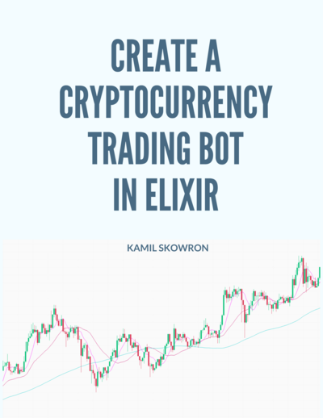

# Welcome 👋

This website is the home of **Create a cryptocurrency trading bot in Elixir** book.

**This book is 75% complete** - chapters 1-15 are finished but I'm planning to add more content in the near future.

Are you looking for a real-world project to gain hands-on experience/solidify your understanding of Elixir/OTP? You are in the right place! We will venture on a journey to create a cryptocurrency trading bot in Elixir. You will be able to see first-hand, how complex systems are designed and developed as we will build them together!

This book is based on [Create a cryptocurrency trading bot in Elixir](https://www.youtube.com/watch?v=wVYIx7M6o28&list=PLxsE19GnjC5Nv1CbeKOiS5YqGqw35aZFJ) video series released on YouTube.

This work is licensed under the Creative Commons Attribution-NonCommercial-ShareAlike 4.0 International [CC BY-NC-SA 4.0](https://creativecommons.org/licenses/by-nc-sa/4.0/).

## Limit of Liability/Disclaimer of Warranty

**THIS BOOK IS NOT FINANCIAL ADVICE**

THE SOFTWARE/BOOK IS PROVIDED "AS IS", WITHOUT WARRANTY OF ANY KIND, EXPRESS OR IMPLIED, INCLUDING BUT NOT LIMITED TO THE WARRANTIES OF MERCHANTABILITY, FITNESS FOR A PARTICULAR PURPOSE AND NONINFRINGEMENT. IN NO EVENT SHALL THE AUTHORS OR COPYRIGHT HOLDERS BE LIABLE FOR ANY CLAIM, DAMAGES OR OTHER LIABILITY, WHETHER IN AN ACTION OF CONTRACT, TORT OR OTHERWISE, ARISING FROM, OUT OF OR IN CONNECTION WITH THE SOFTWARE/BOOK OR THE USE OR OTHER DEALINGS IN THE SOFTWARE/BOOK.

## Contributing / Errata

The book is written using [R Markdown](http://rmarkdown.rstudio.com/)(it's a very similar syntax to the GitHub markdown but supports many more features including code execution, etc.) and converted to final form (for example PDF) using the [bookdown](https://www.bookdown.org/) app. This means that editing a chapter is as simple as editing the markdown for that chapter - there is even an edit button at the top of the page to do exactly that. I would love to follow the standard process of forking, making changes, opening PR, merging, and releasing a new version of the book. I invite people to open issues as well with suggestions.

## Backers

This book was initially published via Leanpub, but to keep it up to date as well as publicly available for people that can't afford to pay for it, it's now available here free of charge.

Knowledge is power and should be shared equally 🙏

**Please consider supporting this book and my other work via the** [**GitHub Sponsors**](https://github.com/sponsors/frathon) **program**(it supports both one-off payments as well as "monthly" plans).
