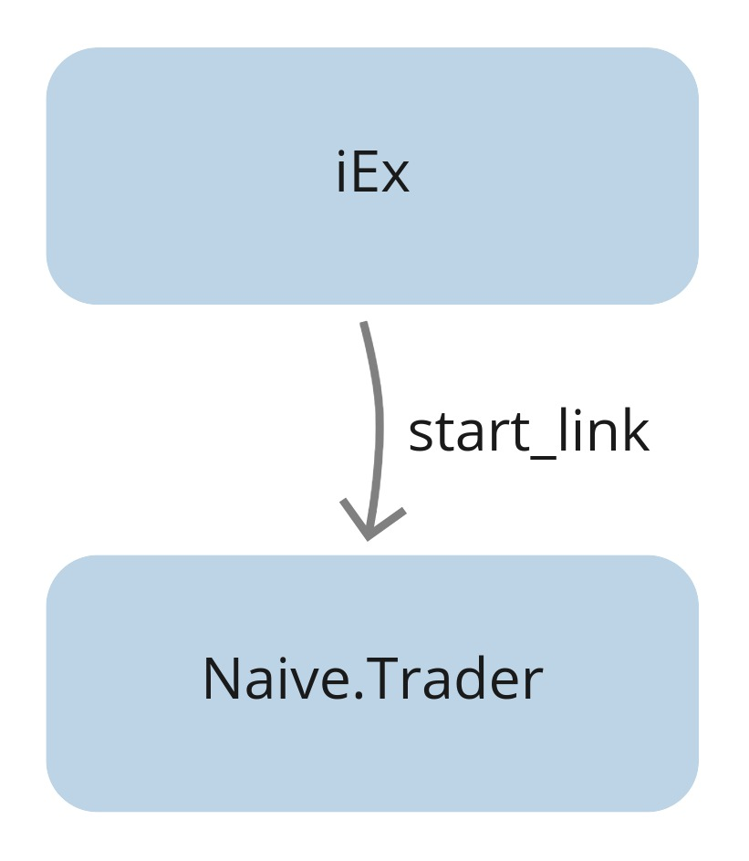
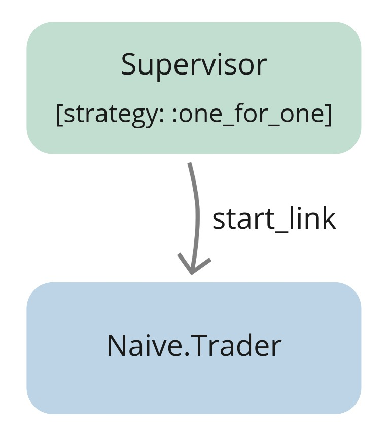
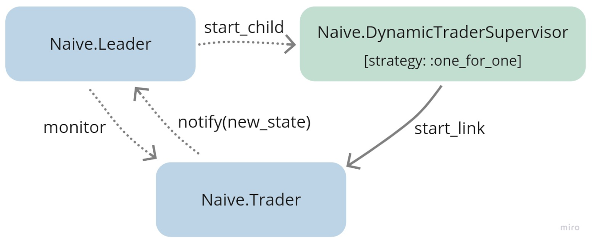

# Enable parallel trading on multiple symbols

## Objectives

- design supervision tree that will allow trading using multiple traders in parallel per symbol
- update application supervisor
- implement `Naive.Server`
- implement `Naive.SymbolSupervisor`

## Introduction - architectural design

In the second chapter we implemented a basic trader which goes through the trading cycle. Inside iEx session we were starting the `Naive.Trader` process using `start_link/1` function:



`GenServer.start_link/3` creates a link between IEx's process and new `Naive.Trader` process. Whenever trader terminates(either finishes the trading cycle or there was an error), new one won't get started as there's no supervision at all.

We can do much better than that with a a little bit of help from Elixir and OTP.

Let's introduce a supervisor above our trader process. It will start a new trader process whenever previous one finished/crashed:



This looks much better but there are few problems with it. So, when the trader will start to place orders it will be in *some* state(it will hold buy/sell orders) that the supervisor won't be aware of. In case of trader crashing, the supervisor will start a new trader *without* any knowledge of possibly placed orders or any other information from the state(it will be started with a "fresh" state).

To fix that we need to keep a copy of the trader's state outside of the trader process - that's why we will introduce a new server called `Naive.Leader` that will keep track of traders' data:



The `Naive.Leader` will become the interface to start new *traders*. It will call the `start_child/1` function of the Supervisor, then consequently `DynamicTraderSupervisor` will call the `start_link/1` function of our `Naive.Trader` module.

We can also see that our `Naive.Trader`'s are now started with the `temporary restart` option. Setting this option will disallow the Supervisor from restarting the traders on its own. The responsibility of restarting traders will now be shifted to the leader. Leader will monitor the traders and restart them to a correct state when any crashes.

As trader state will get updated, it will notify the leader about it's new state to be stored. This way whenever trader would crash, leader will be able to start new trader process with last known state.

This setup will also allow us to start and supervise multiple traders for a single symbol which our naive strategy will require in the future(next chapter).

For each symbol that we will be trading on we need a above trio of services(Leader + DynamicTraderSupervisor + Trader), to effectively initialize(and supervise) them we will add an `Naive.SymbolSupervisor` that will start both `Naive.Leader` and `Naive.Dynamic:


We will need multiple symbol supervisors, one for each symbol that we would like to trade on. As with traders, they will be dynamically started on demand, this should give us a hint that we need another dynamic supervisor that will supervise symbol supervisors and will be direct child of our `Naive.Supervisor`(`Naive.Application` module):


You could ask yourself why we don't need some additional server to track which symbols are traded at the moment (in the same way as `Naive.Leader` tracks `Naive.Trader`s). The answer is that we don't need to track them as we register all `Naive.SymbolSupervisor`s with a name containing symbol that they trade on. This way we will always be able to refer to them by registered name instead of pids/refs.

Here's what happens starting from the top of the graph:
- the `Naive.Application` is our top-level application's supervisor for the `naive` app, it was auto-generated as a part of the `naive` app
- it has a single child `Naive.DynamicSymbolSupervisor`, which has strategy one_for_one and all of it's children are `Naive.SymbolSupervisor`s
- `Naive.SymbolSupervisor` process will start 2 further children: the `Naive.Leader` and `DynamicTraderSupervisor`, both created on init
- the `Naive.Leader` will ask `DynamicTraderSupervisor` to start the `Naive.Trader` child process(es)

This can be a little bit confusing at the moment but it will get a lot easier
as we will write the code. Let's get to it!

### Update application supervisor

Let's start by adding a `Naive.DynamicSymbolSupervisor` and a server to the children list of the `Naive.Application` supervisor:


```elixir
  # /apps/naive/lib/naive/application.ex
  def start(_type, _args) do
    children = [
      {
        DynamicSupervisor,
        strategy: :one_for_one,
        name: Naive.DynamicSymbolSupervisor
      }
    ]

    ...
  end
```

### Add interface method

We will now add an interface method to the `Naive` module that will instruct `Naive.DynamicSymbolSupervisor` to start `Naive.SymbolSupervisor`(to be implemented next) as it's child:


```elixir
  # /apps/naive/lib/naive.ex
  def start_trading(symbol) do
    symbol = String.upcase(symbol)

    {:ok, _pid} =
      DynamicSupervisor.start_child(
        Naive.DynamicSymbolSupervisor,
        {Naive.SymbolSupervisor, symbol}
      )
  end
```

## Implement `Naive.SymbolSupervisor`

Next, time for the `Naive.SymbolSupervisor`, first step will be to create a file called `symbol_supervisor.ex` inside `apps/naive/lib/naive` directory. There's no point of using the [DynamicSupervisor](https://hexdocs.pm/elixir/master/DynamicSupervisor.html), as we know the children that we would like to start automatically on init. This is a full implementation of the supervisor and it's a simple as just listing child processes inside the init function:


```elixir
# /apps/naive/lib/naive/symbol_supervisor.ex
defmodule Naive.SymbolSupervisor do
  use Supervisor

  require Logger

  def start_link(symbol) do
    Supervisor.start_link(
      __MODULE__,
      symbol,
      name: :"#{__MODULE__}-#{symbol}"
    )
  end

  def init(symbol) do
    Logger.info("Starting new supervision tree to trade on #{symbol}")

    Supervisor.init(
      [
        {
          DynamicSupervisor,
          strategy: :one_for_one,
          name: :"Naive.DynamicTraderSupervisor-#{symbol}"
        },
        {Naive.Leader, symbol}
      ],
      strategy: :one_for_all
    )
  end
end
```

It's advised to keep supervisor processes slim.

We registered the `Naive.SymbolSupervisor` processes with names, which will help us understand the supervision tree inside the observer GUI(it will also allow us to stop those supervisors in the future).

As mentioned previously whenever either the `Naive.Leader` or `Naive.DynamicSymbolSupervisor-#{symbol}` would crash we would like to kill the other child process as we won't be able to recover the state - it's just easier to init both again.

## Implement `Naive.Leader`

It's time for the `Naive.Leader` module, again, first step will be to create a file called `leader.ex` inside `apps/naive/lib/naive` directory. At this moment it will be a skeleton GenServer implementation just to get the code to compile:


```elixir
# /apps/naive/lib/naive/leader.ex
defmodule Naive.Leader do
  use GenServer

  def start_link(symbol) do
    GenServer.start_link(
      __MODULE__,
      symbol,
      name: :"#{__MODULE__}-#{symbol}"
    )
  end

  def init(symbol) do
    {:ok, %{symbol: symbol}}
  end
end
```

At this moment we have half of the supervision tree working so we can give it
a spin in iex. Using the observer we will be able to see all processes created when start trading function gets called:


```bash
$ iex -S mix
...
iex(1)> :observer.start()
```

Above function will open a new window looking as follows:


To clearly see the supervision tree we will click on "Applications" tab at the top - the following tree of processes will be shown on the left:


If any other process tree is visible, go to the list on the left and select the `naive` application.

The `Naive.Supervisor` is our `Naive.Application` module(you can confirm that by checking the `name` option send to the `start_link` function inside the module). It start the `Naive.DynamicSymbolSupervisor`.

We can now call the `Naive.start_trading/1` function couple time to see how the tree will look like with additional processes(go back to the `iex` session):


```bash
...
iex(2)> Naive.start_trading("adausdt")
23:14:40.974 [info]  Starting new supervision tree to trade on ADAUSDT
{:ok, #PID<0.340.0>}
iex(3)> Naive.start_trading("xrpusdt")
23:15:12.117 [info]  Starting new supervision tree to trade on XRPUSDT
{:ok, #PID<0.345.0>}
```

We can see that two new branches were created:
- `SymbolSupervisor-ADAUSDT`
- `SymbolSupervisor-XRPUSDT`

Each of them contain a `Naive.Leader` and `DynamicTraderSupervisor`.

### Updating the `leader` module

Let's jump back to extending a leader implementation to get those traders running.

We will introduce a leader's state that will consist of symbol, setting and a list of traders' data. Trader data will hold pid, ref and state of the trader:


```elixir
# /apps/naive/lib/naive/leader.ex
  ...
  alias Naive.Trader

  require Logger

  @binance_client Application.get_env(:naive, :binance_client)

  defmodule State do
    defstruct symbol: nil,
              settings: nil,
              traders: []
  end

  defmodule TraderData do
    defstruct pid: nil,
              ref: nil,
              state: nil
  end
```

We will use a `handle_continue` callback which was introduced in Erlang 21 to
initialize the leader asynchronously. To do that we will return a tuple starting with a `:continue` atom from inside the init function:


```elixir
  # /apps/naive/lib/naive/leader.ex
  def init(symbol) do
    {:ok,
      %State{
          symbol: symbol
      }, {:continue, :start_traders}}
  end
```

The `Naive.Leader` will fetch symbol settings and based on them, it will build the state for traders so they don't need to fetch the same settings again. It will also start as many traders there were set under chunks key in setting:


```elixir
  # /apps/naive/lib/naive/leader.ex
  # below init()
  def handle_continue(:start_traders, %{symbol: symbol} = state) do
    settings = fetch_symbol_settings(symbol)
    trader_state = fresh_trader_state(settings)
    traders = for _i <- 1..settings.chunks,
              do: start_new_trader(trader_state)

    {:noreply, %{state | settings: settings, traders: traders}}
  end
```

Fetching symbol settings will be hardcoded for time being to keep this chapter focused. We will also move the code responsible for fetching tick
size from the `Naive.Trader` to the `Naive.Leader` and hardcode the rest of the values:


```elixir
  # /apps/naive/lib/naive/leader.ex
  defp fetch_symbol_settings(symbol) do
    tick_size = fetch_tick_size(symbol)

    %{
      symbol: symbol,
      chunks: 1,
      # -0.12% for quick testing
      profit_interval: Decimal.new("-0.0012"),
      tick_size: tick_size
    }
  end

  defp fetch_tick_size(symbol) do
    @binance_client.get_exchange_info()
    |> elem(1)
    |> Map.get(:symbols)
    |> Enum.find(&(&1["symbol"] == symbol))
    |> Map.get("filters")
    |> Enum.find(&(&1["filterType"] == "PRICE_FILTER"))
    |> Map.get("tickSize")
    |> Decimal.new()
  end
```

Additionally we need to create a helper method that we used inside the `handle_continue/2` callback called `fresh_trader_state/1`:


```elixir
  # /apps/naive/lib/naive/leader.ex
  # place this one above the `fetch_symbol_settings` function
  defp fresh_trader_state(settings) do
    struct(Trader.State, settings)
  end
```

Starting a new trader isn't any different from the code that we already wrote to start a new `Naive.SymbolSupervisor`. We need to call the `DynamicSupervisor.start_child/2` function and start to monitor the process:


```elixir
  # /apps/naive/lib/naive/leader.ex
  defp start_new_trader(%Trader.State{} = state) do
    {:ok, pid} =
      DynamicSupervisor.start_child(
        :"Naive.DynamicTraderSupervisor-#{state.symbol}",
        {Naive.Trader, state}
      )

    ref = Process.monitor(pid)

    %TraderData{pid: pid, ref: ref, state: state}
  end
```

### Updating the `Naive.Trader` module

Now we can update the `Naive.Trader`, first, we will set restart to be temporary to avoid restarting it by the `Naive.DynamicTraderSupervisor`:


```elixir
# /apps/naive/lib/naive/trader.ex
defmodule Naive.Trader do
  use GenServer, restart: :temporary
  ...
```

Next, we will update `start_link/1` and `init/1` to take the state instead of building it from args:


```elixir
  # /apps/naive/lib/naive/trader.ex
  def start_link(%State{} = state) do
    GenServer.start_link(__MODULE__, state)
  end

  def init(%State{symbol: symbol} = state) do
    symbol = String.upcase(symbol)

    Logger.info("Initializing new trader for symbol(#{symbol})")

    Phoenix.PubSub.subscribe(
      Streamer.PubSub,
      "TRADE_EVENTS:#{symbol}"
    )

    {:ok, state}
  end
```

Next, we need to update two `handle_info/2` callbacks that change the state of the `Naive.Trader` process(when placing buy order and when placing sell order). They will need to notify the `Naive.Leader` that state is changed before returning it:


```elixir
  # /apps/naive/lib/naive/trader.ex
  ...

  def handle_info(
        ...
      ) do
    Logger.info("Placing buy order (#{symbol}@#{price})")
    ...
    new_state = %{state | buy_order: order}
    Naive.Leader.notify(:trader_state_updated, new_state)
    {:noreply, new_state}
  end

  def handle_info(
        ...
      ) do
    ...
    Logger.info("Buy order filled, placing sell order ...")  
    ...

    new_state = %{state | sell_order: order}
    Naive.Leader.notify(:trader_state_updated, new_state)
    {:noreply, new_state}
  end
  ...
```

### Finalizing `Naive.Leader` implementation

Now we need to get back to the `Naive.Leader` where we will implement the notifing logic. We will start with the notify function that will just call the `Naive.Leader` process:


```elixir
  # /apps/naive/lib/naive/leader.ex
  # below init

  def notify(:trader_state_updated, trader_state) do
    GenServer.call(
      :"#{__MODULE__}-#{trader_state.symbol}",
      {:update_trader_state, trader_state}
    )
  end
```

Now, it's time for a callback function that will handle the trader state update. As this is a `handle_call/3` callback we have access to trader pid which sent the notification message. We will try to find that trader in the list of traders. If that's successful we will update the cached state for that
trader locally:


```elixir
  # /apps/naive/lib/naive/leader.ex
  # below handle_continue
  def handle_call(
    {:update_trader_state, new_trader_state},
    {trader_pid, _},
    %{traders: traders} = state
  ) do
    case Enum.find_index(traders, &(&1.pid == trader_pid)) do
      nil ->
        Logger.warn(
          "Tried to update the state of trader that leader is not aware of"
        )
        {:reply, :ok, state}
      
      index ->
        old_trader_data = Enum.at(traders, index)
        new_trader_data = %{old_trader_data | :state => new_trader_state}

        {:reply, :ok, %{state | :traders =>
          List.replace_at(traders, index, new_trader_data)}}
    end
  end
```

Another callback functions that we will need to provide are two `handle_info/2` functions that will handle the trade finished scenario as well as crashed trader.

First, trade finished scenario. As previously, we will try to find the trader data in the traders list. If that's successful, we will start a new trader with fresh state. We will also overwrite existing trader data locally(as pid, ref and state changed):


```elixir
  # /apps/naive/lib/naive/leader.ex
  # below state updated handle_call callback
  def handle_info(
        {:DOWN, _ref, :process, trader_pid, :normal},
        %{traders: traders, symbol: symbol, settings: settings} = state
      ) do
    Logger.info("#{symbol} trader finished trade - restarting")

    case Enum.find_index(traders, &(&1.pid == trader_pid)) do
      nil ->
        Logger.warn(
          "Tried to restart finished #{symbol} " <>
            "trader that leader is not aware of"
        )

        {:noreply, state}

      index ->
        new_trader_data = start_new_trader(fresh_trader_state(settings))
        new_traders = List.replace_at(traders, index, new_trader_data)

        {:noreply, %{state | traders: new_traders}}
    end
  end
```

Here we will assume that whenever the reason that the `Naive.Trader` process died is `:normal` that means that we stopped it after trade cycle finished.

Final callback that we need to provide will handle the scenario where the trader crashed. We would like to find the cached state of the crashed trader and start a new one with the same state and then update the local cache as pid and ref will change for that trader:


```elixir
  # /apps/naive/lib/naive/leader.ex
  # below trade finished handle_info callback
  def handle_info(
        {:DOWN, _ref, :process, trader_pid, _reason},
        %{traders: traders, symbol: symbol} = state
      ) do
    Logger.error("#{symbol} trader died - trying to restart")

    case Enum.find_index(traders, &(&1.pid == trader_pid)) do
      nil ->
        Logger.warn(
          "Tried to restart #{symbol} trader " <>
            "but failed to find its cached state"
        )

        {:noreply, state}

      index ->
        trader_data = Enum.at(traders, index)
        new_trader_data = start_new_trader(trader_data.state)
        new_traders = List.replace_at(traders, index, new_trader_data)

        {:noreply, %{state | traders: new_traders}}
    end
  end
```

### IEx testing

That finishes the implementation part, let's jump into iex session to see how it works.

We will start the observer first, then we will start trading on any valid symbol.

When our trader will start, you should be able to right click and select "Kill process"(leave the reason as kill) and click "OK". At that moment you should see that the PID of the trader changed and we can also see log message from the leader.


```bash
$ iex -S mix
...
iex(1)> :observer.start()             
:ok
iex(2)> Naive.start_trading("xrpusdt")

00:04:35.041 [info]  Starting new supervision tree to trade on XRPUSDT
{:ok, #PID<0.455.0>}
00:04:37.697 [info]  Initializing new trader for XRPUSDT
iex(3)>
00:08:01.476 [error] XRPUSDT trader died - trying to restart
00:08:01.476 [info]  Initializing new trader for XRPUSDT
```

[Note] Please remember to run `mix format` to keep things nice and tidy.

Source code for this chapter can be found at [Github](https://github.com/frathon/create-a-cryptocurrency-trading-bot-in-elixir-source-code/tree/chapter_05)
