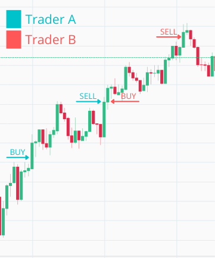
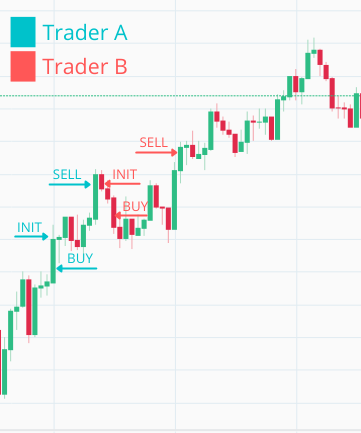

# # Chapter 6 - Introduce a `buy_down_interval` to make a single trader more profitable

## Objectives

- present reasons why to introduce `buy_down_interval`
- add `buy_down interval` to `Naive.Trader`'s state and calculate buy price
- add `buy_down interval` to `Naive.Trader`'s state compiled by the `Naive.Leader`
- manually test the implementation inside iex

## Why we need to buy below the current price? Feature overview



The `Naive.Trader` process(marked in above diagram with blue color) at the arrival of the first trade event, immediately places a buy order at the current price. At the moment when buy order gets filled, it places sell order which later also gets filled.

The Trader A exits and a new trader B is started which again immediately places a buy order *at the same price* as the previous trader just sold. When this gets filled sell order get's placed and loop continues on and on.

We can see that there's a problem here as we just paid a fee twice(once for selling by the Trader A and once for buying by the Trader B) without really gaining anything(the Trader A could just hold the currency and could simply cash in on double profit in this specific situation).

The solution is to be more clever about our buy order's price. The idea is simple, instead of placing a new buy order at the current price(price from the last TradeEvent), we will introduce a `buy_down_interval`:



So every new `Naive.Trader` process as it receives first trade event, trader will take it's price and will calculate an decreased price by using the `buy_down_interval` value(for example 0.005 would be 0.5%) and place a buy order at that calculated price.

When looking at the chart above we can figure out that `buy_down_interval` should never be smaller than double the fee(at the moment of writting transaction fee is 0.1%) that you are paying per transaction.

## `Naive.Trader` implementation

Let's open the `Naive.Trader` module's file(`/apps/naive/lib/naive/trader.ex`) and add `buy_down_interval` to it's state:


```elixir
  # /apps/naive/lib/naive/trader.ex
  ...
  defmodule State do
    @enforce_keys [
      :symbol,
      :buy_down_interval, # <= add this line
      :profit_interval,
      :tick_size
    ]
    defstruct [
      :symbol,
      :buy_order,
      :sell_order,
      :buy_down_interval, # <= add this line
      :profit_interval,
      :tick_size
    ]
  end
  ...
```

Next, we need to update the initial `handle_info/2` callback which places the buy order. We need to retrieve the `buy_down_interval` and the `tick_size` from the `state` of the trader to be able to calculate the buy price. We will put the logic to calculate that price in a separate function at the end of the file:


```elixir
  # /apps/naive/lib/naive/trader.ex
  ...
  def handle_info(
        %TradeEvent{price: price},
        %State{
          symbol: symbol,
          buy_order: nil,
          buy_down_interval: buy_down_interval, # <= add this line
          tick_size: tick_size                  # <= add this line          
        } = state
      ) do
    price = calculate_buy_price(price, buy_down_interval, tick_size)
    # ^ add above call
    ...
```

To calculate the buy price we will use a very similar method to the one used
before to calculate the sell price. First, we will need to cast all variables
into the `Decimal` structs and then, we will simply subtract the `buy_down_interval` of the price from the price. The number that we will end up with won't necessarily be a legal price as every price needs to be divisible by the `tick_size` which we will assure in the last calculation:


```elixir
  # /apps/naive/lib/naive/trader.ex
  ...
  defp calculate_buy_price(price, buy_down_interval, tick_size) do
    current_price = D.new(price)

    # not necessarily legal price
    exact_buy_price =
      D.sub(
        current_price,
        D.mult(current_price, buy_down_interval)
      )

    D.to_float(
      D.mult(
        D.div_int(exact_buy_price, tick_size),
        tick_size
      )
    )
  end
  ...
```

## `Naive.Leader` implementation

Next we need to update the `Naive.Leader` as it needs to add `buy_down_interval` to the `Naive.Trader`'s state:


```elixir
  # /apps/naive/lib/naive/leader.ex
  defp fetch_symbol_settings(symbol) do
    ...

    %{
      chunks: 1,
      buy_down_interval: Decimal.new("0.0001"), # <= add this line
      # -0.12% for quick testing
      profit_interval: Decimal.new("-0.0012"),
      tick_size: tick_size
    }
  end  
  ...
```

### IEx testing

That finishes the `buy_down_interval` implementation, we will jump into iex session to see how it works, but before that for a moment we will change the logging level to `debug` to see current prices:


```elixir
# config/config.exs
...
config :logger,
  level: :debug # <= updated for our manual test
...
```

After starting the streaming we should start seeing log messages with current prices. As we updated our implementation we should place our buy order below current price as it's visible below:


```bash
$ iex -S mix
...
iex(1)> Streamer.start_streaming("FLMUSDT")
{:ok, #PID<0.313.0>}
iex(2)> Naive.start_trading("FLMUSDT")
21:16:14.829 [info]  Starting new supervision tree to trade on FLMUSDT
...
21:16:16.755 [info]  Initializing new trader for FLMUSDT
...
21:16:20.000 [debug] Trade event received FLMUSDT@0.15180000
21:16:20.009 [info]  Placing BUY order for FLMUSDT @ 0.1517, quantity: 100
```

As we can see our `Naive.Trader` process placed an buy order below the current price (based on most recent trade event received)

[Note] Please remember to revert the change to logger level as otherwise there's too much noise in the logs.

[Note 2] Please remember to run `mix format` to keep things nice and tidy.

Source code for this chapter can be found at [Github](https://github.com/frathon/create-a-cryptocurrency-trading-bot-in-elixir-source-code/tree/chapter_06)
