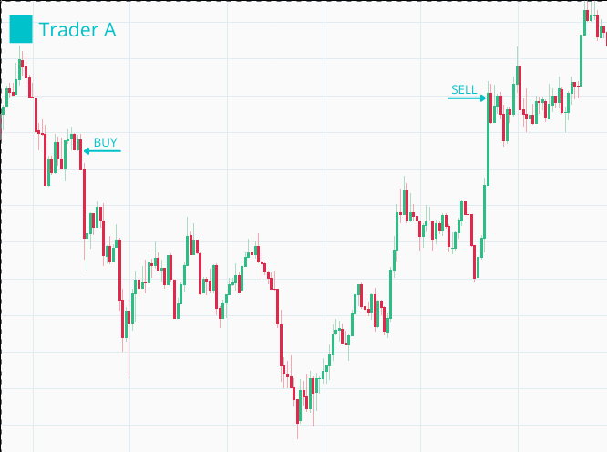
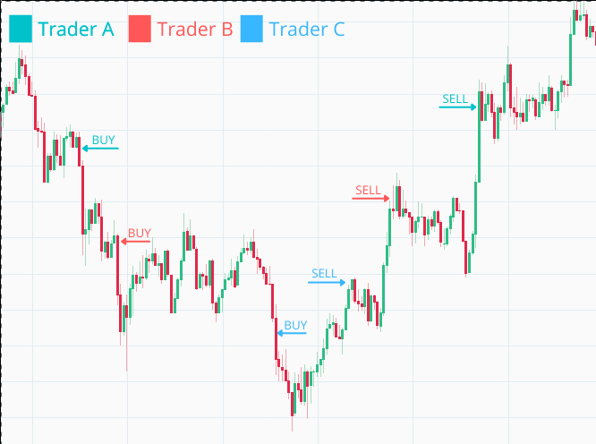

# Run multiple traders in parallel

## Objectives

- describe and design the required functionality
- implement rebuy in the `Naive.Trader`
- implement rebuy in the `Naive.Leader`
- improve logs by assigning ids to traders

## Describe and design the required functionality

At this moment, inside the `Naive.Leader` we have a silly code that
starts all of the traders at the same moment:


```elixir
    # /apps/naive/lib/naive/leader.ex
    ...
    traders =
      for _i <- 1..settings.chunks,
          do: start_new_trader(trader_state)
    ...
```

All the changes we made in this episode will enable us to fix.

Let's say that we placed a buy order that got filled and the price fallen before reaching the sell level. We can see here that we missed a nice opportunity to buy more as price drops and make money as it climbs back:



We will implement additional trade event callback inside the `Naive.Trader` that will keep checking the price after buy order has been filled. Whenever price drops below the `buy_order`'s `price` by `rebuy_interval` we will notify the `Naive.Leader` to start the new `Naive.Trader` process:



The `Naive.Leader` keeps track of how many `Naive.Trader`s are running and needs to honor the number of `chunks` set up in the settings (one chunk == one trader).

To stop the `Naive.Trader`s from continuously notifying about a drop in the price we will also introduce a boolean flag that will track has the `Naive.Leader` been already notified.

## Implement rebuy inside `Naive.Trader`

We will start by adding the `rebuy_interval` and the `rebuy_notified` to trader's state:


```elixir
  # /apps/naive/lib/naive/trader.ex
  ...
  defmodule State do
    @enforce_keys [
      :symbol,
      :budget,
      :buy_down_interval,
      :profit_interval,
      :rebuy_interval, # <= add this field
      :rebuy_notified, # <= add this field
      :tick_size,
      :step_size
    ]
    defstruct [
      :symbol,
      :budget,
      :buy_order,
      :sell_order,
      :buy_down_interval,
      :profit_interval,
      :rebuy_interval, # <= add this field
      :rebuy_notified, # <= add this field
      :tick_size,
      :step_size
    ]
  end
```

Rebuy logic should be placed almost as last callback just before the one that ignores all events. We will need to retrieve the current `price` and `buy_price` and confirm that we didn't notify the leader yet(`rebuy_notified` flag):


```elixir
  # /apps/naive/lib/naive/trader.ex
  ...
  # sell filled callback here
  ...
  def handle_info(
        %TradeEvent{
          price: current_price
        },
        %State{
          symbol: symbol,
          buy_order: %Binance.OrderResponse{
            price: buy_price
          },
          rebuy_interval: rebuy_interval,
          rebuy_notified: false
        } = state
      ) do

  end

  # catch all callback here
```

We need to calculate is the current price below the rebuy interval. If yes we will notify the leader and update the boolean flag. We will abstract calculation to separate function(for readability) that we will write below:


```elixir
    # /apps/naive/lib/naive/trader.ex
    # body of the above callback
    if trigger_rebuy?(buy_price, current_price, rebuy_interval) do
      Logger.info("Rebuy triggered for #{symbol} trader")
      new_state = %{state | rebuy_notified: true}
      Naive.Leader.notify(:rebuy_triggered, new_state)
      {:noreply, new_state}
    else
      {:noreply, state}
    end
```

As mentioned before, we will set the `rebuy_notified` boolean flag to true and notify the leader using the `notify` function with dedicated atom.

At the bottom of the module we need to add `trigger_rebuy?` helper function:


```elixir
  # /apps/naive/lib/naive/trader.ex
  # bottom of the module
  defp trigger_rebuy?(buy_price, current_price, rebuy_interval) do
    current_price = D.new(current_price)
    buy_price = D.new(buy_price)

    rebuy_price =
      D.sub(
        buy_price,
        D.mult(buy_price, rebuy_interval)
      )

    D.lt?(current_price, rebuy_price)
  end
```

## Implement rebuy in the `Naive.Leader`

Moving on to the `Naive.Leader` module, we can get update starting of the traders automatically by the leader to starting just one inside `handle_continue`:


```elixir
  # /apps/naive/lib/naive/leader.ex
  def handle_continue(:start_traders, %{symbol: symbol} = state) do
    ...
    traders = [start_new_trader(trader_state)] # <= updated part

    ...
  end
```

We will need to add a new clause of `notify` function that will handle the rebuy scenario:


```elixir
  # /apps/naive/lib/naive/leader.ex
  # add below current `notify` function
  def notify(:rebuy_triggered, trader_state) do
    GenServer.call(
      :"#{__MODULE__}-#{trader_state.symbol}",
      {:rebuy_triggered, trader_state}
    )
  end
```

We need to add a new `handle_call` function that will start new traders only when there are still chunks available(enforce the maximum number of parallel
traders) - let's start with a header:


```elixir
  # /apps/naive/lib/naive/leader.ex
  # place this one after :update_trader_state handle_call
  def handle_call(
        {:rebuy_triggered, new_trader_state},
        {trader_pid, _},
        %{traders: traders, symbol: symbol, settings: settings} = state
      ) do

  end
```

There are few important details to make note of:
- we need trader's pid to be able to find it details inside the list of traders
- we need settings to cofirm number of chunks to be able to limit maximum number of parallel traders

Moving on to the body of our callback. As with other ones, we will check can we find trader inside list of traders and based on that we will either start another one(if we didn't reach the limit of chunks) or ignore it:


```elixir
    # /apps/naive/lib/naive/leader.ex
    # body of our callback
    case Enum.find_index(traders, &(&1.pid == trader_pid)) do
      nil ->
        Logger.warn("Rebuy triggered by trader that leader is not aware of")
        {:reply, :ok, state}

      index ->
        old_trader_data = Enum.at(traders, index)
        new_trader_data = %{old_trader_data | :state => new_trader_state}
        updated_traders = List.replace_at(traders, index, new_trader_data)

        updated_traders =
          if settings.chunks == length(traders) do
            Logger.info("All traders already started for #{symbol}")
            updated_traders
          else
            Logger.info("Starting new trader for #{symbol}")
            [start_new_trader(fresh_trader_state(settings)) | updated_traders]
          end

        {:reply, :ok, %{state | :traders => updated_traders}}
    end
```

In above code we need to remember to update the state of the trader that triggered the rebuy inside the `traders` list as well as add state of a new trader to that list.

As with other setting we will hardcode the `rebuy_interval`(inside the `fetch_symbol_settings` function) and assign them to
trader's state(inside the `fresh_trader_state` function):


```elixir
  # /apps/naive/lib/naive/leader.ex
  defp fresh_trader_state(settings) do
    %{
      struct(Trader.State, settings)
      | budget: D.div(settings.budget, settings.chunks),
        rebuy_notified: false # <= add this line
    }
  end

  defp fetch_symbol_settings(symbol) do
    ...

    Map.merge(
      %{
        ...
        chunks: 5, # <= update to 5 parallel traders max
        budget: Decimal.new("100"), # <= update this line
        ...
        profit_interval: Decimal.new("-0.0012"),
        rebuy_interval: Decimal.new("0.001") # <= add this line
      },
      symbol_filters
    )
  end
```

We also update the `chunks` and the `budget` to allow our strategy to start up to 5 parallel traders with a budget of 20 USDT each(100/5) as Binance has minimal order requirement at about $15(when using the `BinanceMock` this doesn't really matter).

## Improve logs by assigning ids to traders

The final change will be to add an `id` to trader's state so we can use it inside log messages to give us meaningful data about what's going on(otherwise we won't be able to tell which message was logged by which trader).

First let's add the `id` into the `Naive.Leader`'s fresh_trader_state as it will be defined per trader:


```elixir
  # /apps/naive/lib/naive/leader.ex
  defp fresh_trader_state(settings) do
    %{
      struct(Trader.State, settings)
      | id: :os.system_time(:millisecond), # <= add this line
        budget: D.div(settings.budget, settings.chunks),
        rebuy_notified: false
    }
  end
```

Now we can move on to the `Naive.Trader` and add it to the `%State{}` struct as well as we will modify every callback to include that id inside log messages:


```elixir
  # /apps/naive/lib/naive/trader.ex
  defmodule State do
    @enforce_keys [
      :id,
      ...
    ]
    defstruct [
      :id,
      ...
    ]
  end

  ...

  def init(%State{id: id, symbol: symbol} = state) do
    ...

    Logger.info("Initializing new trader(#{id}) for #{symbol}")

    ...
  end

  def handle_info(
        %TradeEvent{price: price},
        %State{
          id: id,
          ...
        } = state
      ) do
    ...

    Logger.info(
      "The trader(#{id}) is placing a BUY order " <>
        "for #{symbol} @ #{price}, quantity: #{quantity}"
    )

    ...
  end

  def handle_info(
        %TradeEvent{
          buyer_order_id: order_id
        },
        %State{
          id: id,
          ...
        } = state
      ) do
    ...
        Logger.info(
          "The trader(#{id}) is placing a SELL order for " <>
            "#{symbol} @ #{sell_price}, quantity: #{quantity}."
        )
        ...
        Logger.info("Trader's(#{id} #{symbol} BUY order got partially filled")
        ...
  end

  def handle_info(
        %TradeEvent{
          seller_order_id: order_id
        },
        %State{
          id: id,
          ...
        } = state
      ) do
    ...
      Logger.info("Trader(#{id}) finished trade cycle for #{symbol}")
      ...
      Logger.info("Trader's(#{id} #{symbol} SELL order got partially filled")      ...
  end

  def handle_info(
        %TradeEvent{
          price: current_price
        },
        %State{
          id: id,
          ...
        } = state
      ) do
      ...
      Logger.info("Rebuy triggered for #{symbol} by the trader(#{id})")
      ...
  end
```

That finishes the implementation part - we should now be able to test the implementation and see dynamically growing number of traders for our strategy based on price movement.

## Test the implementation

Let's start an iEx the session and open the `:observer`(inside go to "Applications" tab and click on `naive` from the list of the left) so we will be able to see how the number of traders is growing as well as PIDs are changing which means that they are finishing the full trades:


```bash
$ iex -S mix
...
iex(1)> :observer.start()
...
iex(2)> Naive.start_trading("HNTUSDT")
10:22:05.018 [info]  The trader(1616754009963) is placing a BUY order for HNTUSDT @ 8.175, quantity: 2.446
10:22:11.665 [info]  Rebuy triggered for HNTUSDT by the trader(1616754009963)
10:22:11.665 [info]  Starting new trader for HNTUSDT
10:22:11.665 [info]  Initializing new trader(1616754131665) for HNTUSDT
10:22:11.665 [info]  The trader(1616754009963) is placing a SELL order for HNTUSDT @ 8.181, quantity: 2.446.
10:22:11.665 [info]  The trader(1616754131665) is placing a BUY order for HNTUSDT @ 8.157, quantity: 2.451
10:22:58.339 [info]  Trader(1616754009963) finished trade cycle for HNTUSDT
10:22:58.339 [info]  HNTUSDT trader finished trade - restarting
10:22:58.339 [info]  Initializing new trader(1616754178339) for HNTUSDT
10:22:58.339 [info]  The trader(1616754178339) is placing a BUY order for HNTUSDT @ 8.212, quantity: 2.435
10:23:13.232 [info]  Rebuy triggered for HNTUSDT by the trader(1616754178339)
10:23:13.232 [info]  Starting new trader for HNTUSDT
10:23:13.232 [info]  Initializing new trader(1616754193232) for HNTUSDT
10:23:13.232 [info]  The trader(1616754178339) is placing a SELL order for HNTUSDT @ 8.218, quantity: 2.435.
10:23:31.120 [info]  The trader(1616754193232) is placing a BUY order for HNTUSDT @ 8.194, quantity: 2.44
10:23:31.121 [info]  Trader(1616754178339) finished trade cycle for HNTUSDT
10:23:31.122 [info]  HNTUSDT trader finished trade - restarting
10:23:31.122 [info]  Initializing new trader(1616754211122) for HNTUSDT
10:24:31.891 [info]  The trader(1616754211122) is placing a BUY order for HNTUSDT @ 8.198, quantity: 2.439
10:25:24.155 [info]  The trader(1616754211122) is placing a SELL order for HNTUSDT @ 8.204, quantity: 2.439.
10:25:24.155 [info]  The trader(1616754193232) is placing a SELL order for HNTUSDT @ 8.2, quantity: 2.44.
10:25:24.155 [info]  Rebuy triggered for HNTUSDT by the trader(1616754211122)
10:25:24.155 [info]  Starting new trader for HNTUSDT
10:25:24.156 [info]  Initializing new trader(1616754324155) for HNTUSDT
10:25:24.156 [info]  Rebuy triggered for HNTUSDT by the trader(1616754193232)
10:25:24.156 [info]  The trader(1616754324155) is placing a BUY order for HNTUSDT @ 8.183, quantity: 2.444
10:25:24.156 [info]  Starting new trader for HNTUSDT
10:25:24.156 [info]  Initializing new trader(1616754324156) for HNTUSDT 
10:25:24.156 [info]  The trader(1616754324156) is placing a BUY order for HNTUSDT @ 8.176, quantity: 2.446
10:25:24.156 [info]  The trader(1616754324155) is placing a SELL order for HNTUSDT @ 8.189, quantity: 2.444.
10:25:37.527 [info]  Trader(1616754324155) finished trade cycle for HNTUSDT
10:25:37.528 [info]  HNTUSDT trader finished trade - restarting
10:25:37.528 [info]  Initializing new trader(1616754337528) for HNTUSDT
10:25:37.528 [info]  The trader(1616754337528) is placing a BUY order for HNTUSDT @ 8.192, quantity: 2.441
10:25:37.530 [info]  Trader(1616754211122) finished trade cycle for HNTUSDT
10:25:37.530 [info]  Trader(1616754193232) finished trade cycle for HNTUSDT
10:25:37.530 [info]  HNTUSDT trader finished trade - restarting
10:25:37.530 [info]  Initializing new trader(1616754337530) for HNTUSDT
10:25:37.530 [info]  HNTUSDT trader finished trade - restarting
10:25:37.530 [info]  Initializing new trader(1616754337530) for HNTUSDT
10:25:40.015 [info]  Rebuy triggered for HNTUSDT by the trader(1616754337528)
10:25:40.015 [info]  The trader(1616754337530) is placing a BUY order for HNTUSDT @ 8.179, quantity: 2.445
10:25:40.015 [info]  All traders already started for HNTUSDT
```

And our observer shows the following:


We can clearly see that our strategy dynamically scaled from 1 to 5 parallel traders and they were going through different trading steps without any problems - I think that's really cool to see and it wasn't difficult to achieve in Elixir.

[Note] Please remember to run `mix format` to keep things nice and tidy.

Source code for this chapter can be found at [Github](https://github.com/frathon/create-a-cryptocurrency-trading-bot-in-elixir-source-code/tree/chapter_09)
