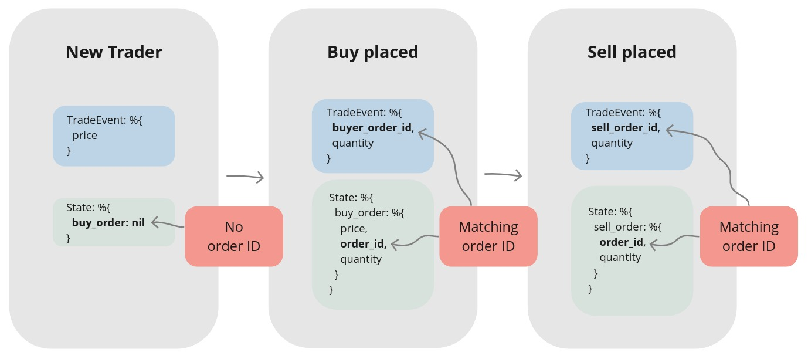
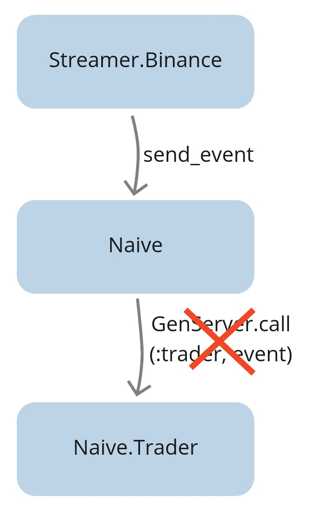
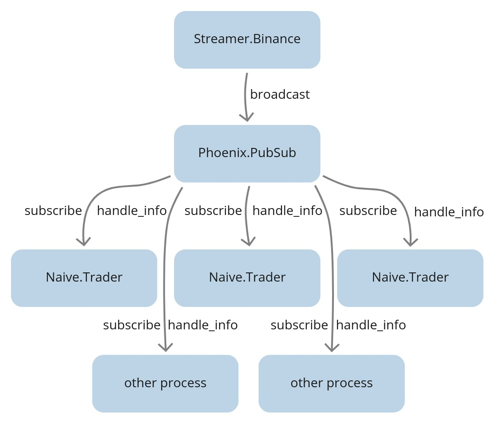
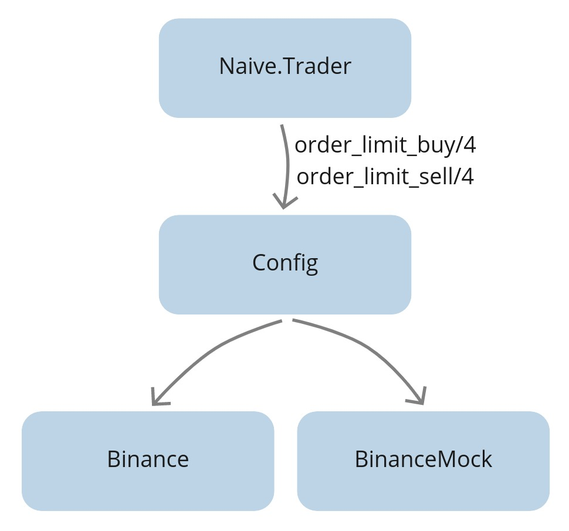
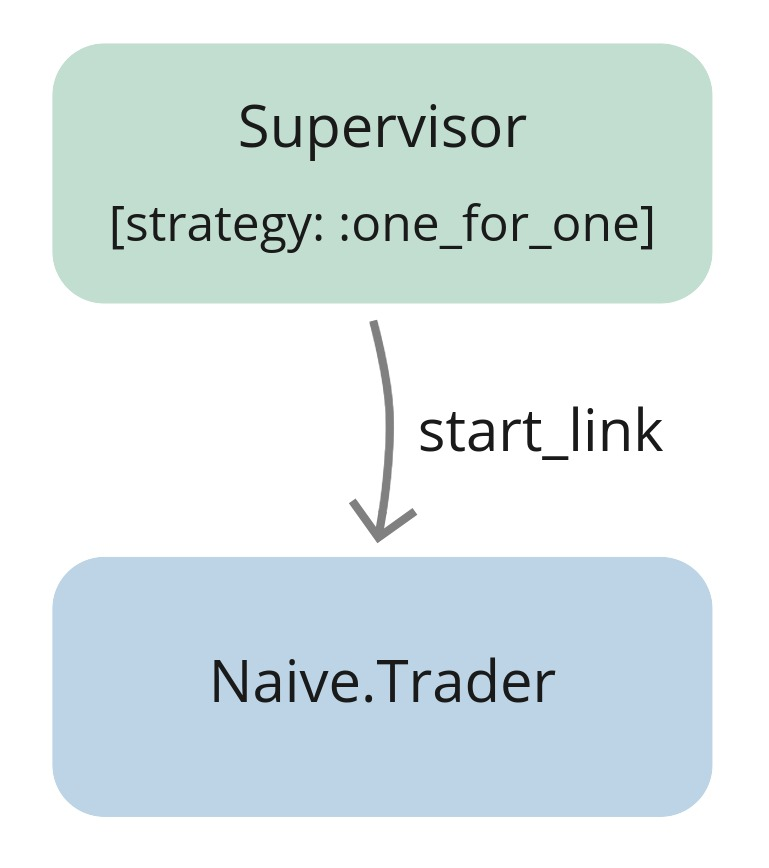
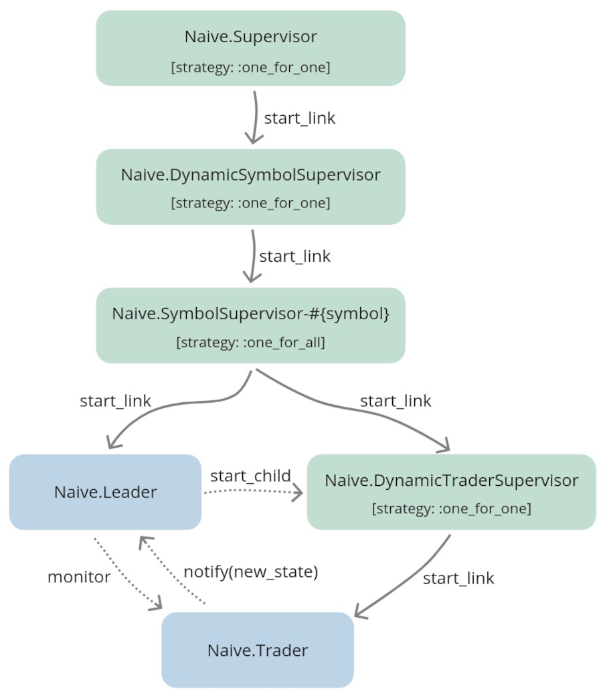
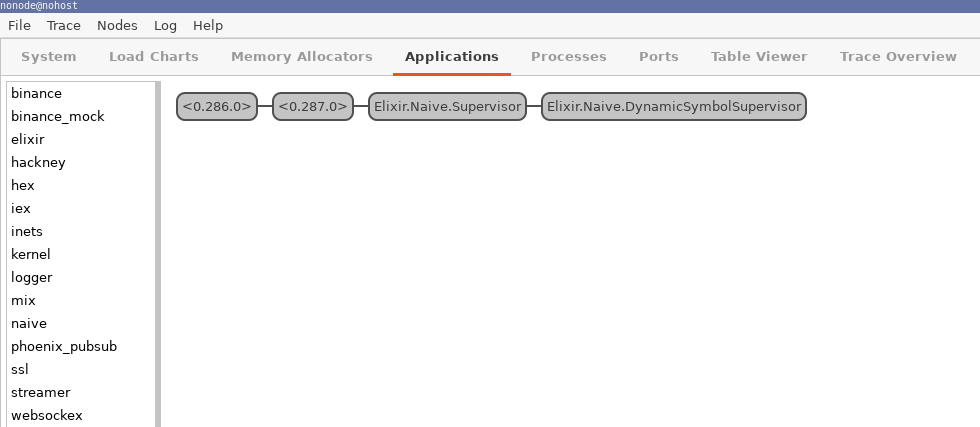
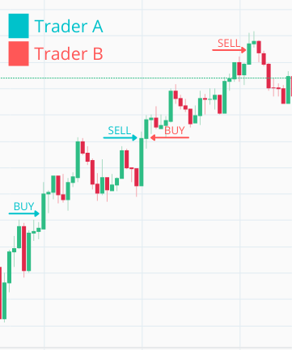
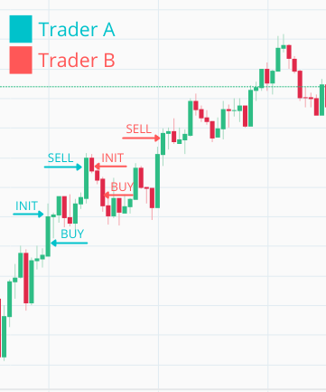

--- 
title: "Hands-on Elixir & OTP: Cryptocurrency trading bot"
author: "Kamil Skowron"
date: "0.6.1"
site: bookdown::bookdown_site
output: bookdown::gitbook
documentclass: book
link-citations: yes
github-repo: Cinderella-Man/hands-on-elixir-and-otp-cryptocurrency-trading-bot
description: ""
graphics: yes
nocite: '@*'
classoption: oneside
geometry: "left=3cm, right=3cm, top=2.5cm, bottom=2.5cm"
twitter-handle: kamilskowron
monofont: Consolas.ttf
---

# Preface {-}

### Want to learn Elixir & OTP by creating a real-world project? {-}


With "Hands-on Elixir & OTP: Cryptocurrency trading bot", you will **gain hands-on experience by writing an exciting software project from scratch.** We will explore all the key abstractions and essential principles through iterative implementation improvements.

We will start by creating a new umbrella application, subscribing to WebSocket streams, implementing a basic trading flow, and focusing on improving it by expanding on the topics like supervision trees, resiliency, refactoring using macros, utilising the Registry, testing and others.

**This book is 95% complete - chapters 1-23 are finished,** and I'll add more content soon. It's also a loosely written representation of the [Hands-on Elixir & OTP: Cryptocurrency trading bot](https://www.youtube.com/watch?v=wVYIx7M6o28&list=PLxsE19GnjC5Nv1CbeKOiS5YqGqw35aZFJ) video course released on YouTube.

This work is licensed under the Creative Commons Attribution-NonCommercial-ShareAlike 4.0 International [CC BY-NC-SA 4.0](https://creativecommons.org/licenses/by-nc-sa/4.0/).

**To get notified about updates** to this book just "watch" the [source code's repository](https://github.com/Cinderella-Man/hands-on-elixir-and-otp-cryptocurrency-trading-bot), and don't forget to leave a star:

```{r, fig.align="center", out.width="60%", echo=FALSE}
knitr::include_graphics("images/watch_book_howto.png")
```

\newpage

## Limit of Liability/Disclaimer of Warranty {-}

**THIS BOOK IS NOT FINANCIAL ADVICE**

THE SOFTWARE/BOOK IS PROVIDED "AS IS", WITHOUT WARRANTY OF ANY KIND, EXPRESS OR IMPLIED, INCLUDING BUT NOT LIMITED TO THE WARRANTIES OF MERCHANTABILITY, FITNESS FOR A PARTICULAR PURPOSE AND NONINFRINGEMENT. IN NO EVENT SHALL THE AUTHORS OR COPYRIGHT HOLDERS BE LIABLE FOR ANY CLAIM, DAMAGES OR OTHER LIABILITY, WHETHER IN AN ACTION OF CONTRACT, TORT OR OTHERWISE, ARISING FROM, OUT OF OR IN CONNECTION WITH THE SOFTWARE/BOOK OR THE USE OR OTHER DEALINGS IN THE SOFTWARE/BOOK.

## PDF & EPUB {-}

To keep this book up to date and publicly available for people who can't afford to pay for it, I've released it in the HTML format free online at [https://www.elixircryptobot.com](https://www.elixircryptobot.com).

The PDF & EPUB formats are available for purchase on [Gumroad](https://gum.co/cSGdY).

## Preface {-}

In recent years [Elixir](https://elixir-lang.org/) programming language gained a lot of interest in the industry.

Its unmatched parallelisation capabilities are unique and powerful, making it a great candidate for highly concurrent systems like the ones trading assets on exchanges.

In this book, we will go through the development process of a cryptocurrency trading bot in Elixir. We will start ground up and chapter by chapter progress with the implementation ending up with a fully-fledged *naive* trading strategy. We will be designing process supervision trees, describing why specific decisions were taken and how will they impact the system going forward.

By any stretch of the imagination, I don't believe that "this is *the only* way"(nor even the best way) to create a cryptocurrency trading bot in Elixir. This book focuses more on building a real-life project and iterating over it, taking decisions on the way as it would happen in a real work environment. Some parts will be "perfect" the first time around, but there are also others, where we will make compromises to "get it to working", and then when the time is right, we will refactor them as we will gain a better understanding of Elixir/OTP and the domain.

## Who this book is for {-}

This book will be an excellent resource for everyone that already knows the basics of Elixir and wants to get a feel of how developing a non-trivial system looks like using it.

Readers do not need deep knowledge about cryptocurrencies to follow along, as I will shy away from crypto/trading jargon as well as will explain it whenever it's unavoidable.

**This is not a book focused on trading strategies, neither it's financial advice to trade at all.** The main focus of this book is to showcase how the implementation of even complex problems can be achieved in Elixir by simple processes working together in an orchestrated manner.

**The strategy described in this book is naive and most probably will lose money**, but that's not the point of this book. **As we will build up the strategy, we will face a spectrum of problems developers face at work. It's a great primer if you want to get your first "project" behind your belt**.

So, if you've already gone through the motions and learned Elixir and OTP but still feel like you need to get your hands dirty with a "real problem" to "make it stick", this book is for you.

## What this book covers {-}

This book is an ongoing project, and at present, it contains the following chapters:

* Chapter 1 - Stream live cryptocurrency prices from the Binance WSS

Stream live cryptocurrency prices (trade events) from the Binance exchange. We will create a new umbrella project and a `streamer` application inside it starting grounds up. The streamer application will use a Websocket client called `WebSockex` to connect with the Binance API and receive a live feed. After receiving the event as a JSON string, we will decode it using the `jason` library and convert it to our data struct. We will see decoded trade events logged to the terminal by the end of the chapter.

* Chapter 2 - Create a naive trading strategy - single trader without supervision

In this chapter, we will create our first *naive* trading strategy. We will generate another application inside our umbrella called `naive`. We will put data streamed to our `streamer` application to good use by sending it over to the `naive` application. We will start with a very basic solution consisting of a single process called `trader` that will utilise the `GenServer` behaviour. It will allow us to go through the complete trading cycle and give us something that "works".

* Chapter 3 - Introduce PubSub as a communication method

To allow our trading strategy to scale to multiple parallel traders, we need to find a way to distribute the latest prices (trade events) to those multiple traders. We will introduce PubSub to broadcast messages from the streamer(s) to the trader(s). PubSub will allow us to break hardcoded references between applications in our umbrella and become a pattern that we will utilise moving forward.

* Chapter 4 - Mock the Binance API

Besides historical prices (trade events), to perform backtesting, we need to be able to mock placing orders and get trade events back as they are filled. In this chapter, we will focus on developing the solution that will allow our traders to "trade" without contacting the Binance exchange(for people without Binance accounts). This will also allow us to backtest our trading strategy.

* Chapter 5 - Enable parallel trading on multiple symbols

Our basic strategy implementation from the last chapter is definitely too basic to be used in a "production environment" - it can't be neither scaled nor it is fault-tolerant. In this chapter, we will upgrade our naive strategy to be more resilient. This will require a supervision tree to be created and will allow us to see different supervision strategies in action and understand the motivation behind using and stacking them.

* Chapter 6 - Introduce a `buy_down_interval` to make a single trader more profitable

At this moment our `Naive.Trader` implementation will blindly place a buy order at the price of the last trade event. Whenever the `Naive.Trader` process will finish trade, a new `Naive.Trader` process will be started and it will end up placing a buy order at the same price as the price of the previous sell order. This will cost us double the fee without gaining any advantage and would cause further complications down the line, so we will introduce a `buy_down_interval` which will allow the `Naive.Trader` processes to place a buy order below the current trade event's price.

* Chapter 7 - Introduce a trader budget and calculating the quantity

Since the second chapter, our `Naive.Trader` processes are placing orders with a hardcoded quantity of 100. In this chapter, we will introduce a budget that will be evenly split between the `Naive.Trader` processes using chunks. We will utilize that budget to calculate quantity (to be able to do that we need to fetch further `step_size` information from the Binance API).

* Chapter 8 - Add support for multiple transactions per order

Our `Naive.Trader` implementation assumes that our orders will be filled within a single transaction, but this isn't always the case. In this chapter, we will discuss how could we implement the support for multiple transactions per order and race conditions that could occur between the bot and the Binance API.

* Chapter 9 - Run multiple traders in parallel

With PubSub, supervision tree, buy down and budget in place we can progress with scaling the number of traders. This will require further improvements to our trading strategy like introducing a `rebuy_interval`. At the end of this chapter, our trading strategy will be able to start and run multiple traders in parallel.

* Chapter 10 - Fine-tune trading strategy per symbol

Currently, the naive strategy works based on settings hardcoded in the `leader` module. To allow for fine-tuning the naive trading strategy per symbol we will introduce a new database together with the table that will store trading settings.

* Chapter 11 - Supervise and autostart streaming

In the last chapter, we introduced a new database inside the `naive` application to store default settings, in this chapter we will do the same for the `streamer` application. Inside the settings, there will be a `status` flag that will allow us to implement the autostarting functionality on initialization using Task abstraction.

* Chapter 12 - Start, stop, shutdown, and autostart trading

To follow up after autostarting streaming we will apply the same trick to the trading supervision tree using Task abstraction. We will need to introduce a new supervision level to achieve the correct supervision strategy.

* Chapter 13 - Abstract duplicated supervision code

As both the `naive` and the `streamer` applications contain almost the same copy-pasted code that allows us to start, stop and autostart workers. We will look into how could we abstract the common parts of that implementation into a single module. We will venture into utilizing the `__using__` macro to get rid of the boilerplate.

* Chapter 14 - Store trade events and orders inside the database

To be able to backtest the trading strategy, we need to have historical prices (trade events) and a list of orders that were placed stored in the database, which will be the focus of this chapter. At this moment, the latest prices (trade events) are broadcasted to PubSub topic and traders are subscribing to it. We will create a new application called `data_warehouse` inside our umbrella that will be responsible for subscribing to the same PubSub topics and storing incoming prices (trade events) in the Postgres database. We will update the `Naive.Trader` module to broadcast orders as traders will place them.

Then we will move on to adding supervision similar to the one from the `naive` and the `streamer` applications but this time we will show how we could avoid using both common module and macros by utilizing the `Registry` module. 

* Chapter 15 - Backtest trading strategy

In this chapter, we will be backtesting our trading strategy by developing a publisher inside the DataWarehouse application. It will stream trade events from the database to broadcast them to the `TRADE_EVENTS:#{symbol}` PubSub topic. It will use the same topic as data would be streamed directly from the Binance. From the trader's perspective, it won't any difference and will cause normal trading activity that will be stored inside the database to be analyzed later.

* Chapter 16 - End-to-end testing

We've reached the stage where we have a decent solution in place, and to ensure that it's still working correctly after any future refactoring, we will add tests. We will start with the "integration"/"end-to-end"(E2E) test, which will confirm that the whole "trading" works. To perform tests at this level, we will need to orchestrate databases together with processes and broadcast trade events from within the test to cause our trading strategy to place orders. We will be able to confirm the right behaviour by checking the database after running the test.

* Chapter 17 - Mox rocks

In the previous chapter, we’ve implemented the end-to-end test that required a lot of prep work, and we were able to see the downsides of this type of tests clearly. This chapter will focus on implementing a more granular test that will utilize the `mox` package to mock out the dependencies of the `Naive.Trader`. We will look into how the Mox works and how we will need to modify our code to use it.

* Chapter 18 - Functional Elixir

In this chapter, we will venture into the functional world by looking at how could we improve our code to push side effects to the edge. We will revise the `Naive.Trader` code to abstract away our strategy code into a new module called `Naive.Strategy`. From this place, we will reorganise the code to maximise the amount of easily testable pure functions. Finally, we will explore hypothetical implementations that will allow us to inject data into function or even manage effects to aid testability. We will compare those to solutions built into Elixir like the `with` statement.

* Chapter 19 - Idiomatic OTP

In the last chapter, we were looking into how we could reorganise *the code* to maximise the amount of pure code. In this chapter, we will look into different ways of implementing the OHLC(open-high-low-close) aggregator, considering similar optimisation but expanding to limit the number of processes to aid testability and maintainability.

* Chapter 20 - Idiomatic trading strategy

We will use the knowledge gained in the last chapter to revise our Naive trading strategy so we will minimise the number of processes required to trade. We will move the functionalities provided by the `Naive.Leader` and the `Naive.SymbolSupervisor` into our strategy, taking care to put as much of it as possible into the pure part. In the end, our `Naive.Trader` will be able to manage multiple positions(trade cycles), and the vast majority of code previously scattered across multiple modules/processes will become easily testable pure functions inside our `Naive.Strategy`.

* Chapter 21 - Layers of abstraction

In this chapter, I acknowledge that the Mox package was misused throughout the book. We will look into the idiomatic way of using it, its consequences, and why you should avoid it. On the other hand, we will check out the `Mimic` package, which does not impact our production system at all. Along the way, we will reconsider how to deal with logging and the usage of module attributes as "dependency injection."

* Chapter 22 - 80/20 win with pure logic

In the 20th chapter, we refactored most of the code inside the Naive strategy, promising ourselves that it would make testing and maintenance easy. In this chapter, we will test that, proving that we are now able to test the vast majority of the system using trivial, easy-to-understand input-output tests.

* Chapter 23 - Back to the Monolith

In this chapter, we will look back at the issues/complexity umbrella applications cause. We will port the whole application to a new Phoenix skeleton, using this opportunity to refactor/merge logic that was previously spread across multiple apps.

## Contributing, Errata and Source code {-}

The book is written using [R Markdown](http://rmarkdown.rstudio.com/)(it's a very similar syntax to the GitHub markdown but supports many more features including code execution, etc.) and converted to final form (for example PDF) using the [bookdown](https://www.bookdown.org/) app. This means that editing a chapter is as simple as editing the markdown source of that chapter.

There are two repositories related to this book(both hosted on Github):

* [source code of the book itself](https://github.com/Cinderella-Man/hands-on-elixir-and-otp-cryptocurrency-trading-bot)
* [code written across the book where the final code of each chapter has its own branch](https://github.com/Cinderella-Man/hands-on-elixir-and-otp-cryptocurrency-trading-bot-source-code)

In regards to contributions - I would love to follow the standard process of forking, making changes, opening PR(please look is there a branch for the next version and point to it instead of `main`), merging, and releasing a new version of the book.

This books has also the **GitHub Discussions** enabled for both the [book's repo](https://github.com/Cinderella-Man/hands-on-elixir-and-otp-cryptocurrency-trading-bot/discussions) as well as [source code's repo](https://github.com/Cinderella-Man/hands-on-elixir-and-otp-cryptocurrency-trading-bot-source-code/discussions), please feel welcome to start any discussions related to book there. 

```{r include=FALSE}
# automatically create a bib database for R packages
knitr::write_bib(c(
  .packages(), 'bookdown', 'knitr', 'rmarkdown'
), 'packages.bib')
```

<!--chapter:end:index.Rmd-->

# Stream live cryptocurrency prices from the Binance WSS

## Objectives

- create a new umbrella app
- create a supervised application inside an umbrella
- connect to Binance's WebSocket Stream using the WebSockex module
- define a TradeEvent struct that will hold incoming data
- decode incoming events using the Jason module

## Create a new umbrella app

As we are starting from scratch, we need to create a new umbrella project:

```{r, engine = 'bash', eval = FALSE}
mix new hedgehog --umbrella
```

## Create a supervised application inside an umbrella

We can now proceed with creating a new supervised application called `streamer` inside our umbrella:

```{r, engine = 'bash', eval = FALSE}
cd hedgehog/apps
mix new streamer --sup
```

## Connect to Binance's WebSocket Stream using the WebSockex module

To establish a connection to Binance API's stream, we will need to use a WebSocket client. The module that we will use is called [WebSockex](https://github.com/Azolo/websockex). Scrolling down to the `Installation` section inside the module's readme on Github, we are instructed what dependency we need to add to our project.

We will append `:websockex` to the `deps` function inside the `mix.exs` file of the `streamer` application:

```{r, engine = 'elixir', eval = FALSE}
  # /apps/streamer/mix.exs
  defp deps do
    [
      {:websockex, "~> 0.4"}
    ]
  end
```

As we added a dependency to our project, we need to fetch it using `mix deps.get`.

We can now progress with creating a module that will be responsible for streaming. We will create a new file called `binance.ex` inside the `apps/streamer/lib/streamer` directory.

From the readme of [WebSockex](https://github.com/Azolo/websockex) module, we can see that to use it we need to create a module that will implement the `WebSockex` behavior:

```{r, engine = 'elixir', eval = FALSE}
# WebSockex's readme
defmodule WebSocketExample do
  use WebSockex

  def start_link(url, state) do
    WebSockex.start_link(url, __MODULE__, state)
  end

  def handle_frame({type, msg}, state) do
    IO.puts "Received Message - Type: #{inspect type} -- Message: #{inspect msg}"
    {:ok, state}
  end

  def handle_cast({:send, {type, msg} = frame}, state) do
    IO.puts "Sending #{type} frame with payload: #{msg}"
    {:reply, frame, state}
  end
end
```

We will copy the whole code above across to our new `binance.ex` file.

\newpage

The first step will be to update the module name to match our file name:

```{r, engine = 'elixir', eval = FALSE}
# /apps/streamer/lib/streamer/binance.ex
defmodule Streamer.Binance do
```

In the spirit of keeping things tidy - we will now remove the `handle_cast/2` function (the last function in our module) as we won't be sending any messages back to Binance via WebSocket (to place orders etc - Binance provides a REST API which we will use in the next chapter).

Next, let's look up what URL should we use to connect to Binance's API. Binance has a separate WSS (Web Socket Streams) documentation at [Github](https://github.com/binance/binance-spot-api-docs/blob/master/web-socket-streams.md).

Scrolling down we can see the `General WSS information` section where 3 important pieces of information are listed:

* The base endpoint is: `wss://stream.binance.com:9443`
* Raw streams are accessed at `/ws/<streamName>`
* All symbols for streams are *lowercase*

We can see that the full endpoint for raw streams(we will be using a "raw" stream) will be `wss://stream.binance.com:9443/ws/` with stream name at the end (together with lowercased symbol).

Note: In the context of Binance API, "raw" means that no aggregation was performed before broadcasting the data on WebSocket.

Let's introduce a module attribute that will hold the full raw stream endpoint which will be used across the module:

```{r, engine = 'elixir', eval = FALSE}
# /apps/streamer/lib/streamer/binance.ex
@stream_endpoint "wss://stream.binance.com:9443/ws/"
```

Now back in [Binance's WSS documentation](https://github.com/binance/binance-spot-api-docs/blob/master/web-socket-streams.md) we need to search for "Trade Streams". "trade" in the context of this documentation means an exchange of assets(coins/tokens) by two sides (buyer and seller). Our future trading strategy will be interested in the "latest price" which is simply the last trade event's price.

We can see that docs are pointing to the following stream name:

```
Stream Name: <symbol>@trade
```

Together, our full URL looks like: "wss://stream.binance.com:9443/ws/<symbol>@trade".
To give a concrete example: the raw trade events stream URL for symbol XRPUSDT is:
"wss://stream.binance.com:9443/ws/xrpusdt@trade" (remember that symbols need to be lowercased, otherwise no trade events will get streamed - there's *no* error).

\newpage

Back to the IDE, we will now modify the `start_link/2` function to use Binance API's URL:

```{r, engine = 'elixir', eval = FALSE}
  # /apps/streamer/lib/streamer/binance.ex
  def start_link(symbol) do
    symbol = String.downcase(symbol)

    WebSockex.start_link(
      "#{@stream_endpoint}#{symbol}@trade",
      __MODULE__,
      nil
    )
  end
```

Instead of passing an URL, we modified the function to accept a `symbol`, downcase it and use it together with the module's `@stream_endpoint` attribute to build a full URL.

At this moment streaming of trade events already works which we can test using `iex`:

```{r, engine = 'bash', eval = FALSE}
$ iex -S mix
...
iex(1)> Streamer.Binance.start_link("xrpusdt")
{:ok, #PID<0.335.0>}
Received Message - Type: :text -- Message: "{\"e\":\"trade\", \"E\":1603226394741,
  \"s\":\"XRPUSDT\",\"t\":74608889,\"p\":\"0.24373000\",\"q\":\"200.00000000\",
  \"b\":948244411,\"a\":948244502,\"T\":1603226394739,\"m\":true,\"M\":true}"
```

We can see the messages logged above because we copied the sample implementation from [WebSockex's readme](https://github.com/Azolo/websockex) where `handle_frame/2` function uses `IO.puts/1` to print out all incoming data. The lesson here is that every incoming message from Binance will cause the `handle_frame/2` callback to be called with the message and the process' state.

Just for reference, our module should look currently as follows:

```{r, engine = 'elixir', eval = FALSE}
# /apps/streamer/lib/streamer/binance.ex
defmodule Streamer.Binance do
  use WebSockex

  @stream_endpoint "wss://stream.binance.com:9443/ws/"

  def start_link(symbol) do
    symbol = String.downcase(symbol)

    WebSockex.start_link(
      "#{@stream_endpoint}#{symbol}@trade",
      __MODULE__,
      nil
    )
  end

  def handle_frame({type, msg}, state) do
    IO.puts "Received Message - Type: #{inspect type} -- Message: #{inspect msg}"
    {:ok, state}
  end
end
```

## Decode incoming events using the Jason module

Currently, all incoming data from WebSocket is encoded as a JSON. To decode JSON we will use the [jason](https://github.com/michalmuskala/jason) module.

Scrolling down to the `Installation` section inside the module's readme, we can see that we need to add it to the dependencies and we can start to use it right away.

Let's open the `mix.exs` file of the `streamer` application and append the `:jason` dependency to the list inside `deps` function:

```{r, engine = 'elixir', eval = FALSE}
  # /apps/streamer/mix.exs
  defp deps do
    [
      {:jason, "~> 1.2"},
      {:websockex, "~> 0.4"}
    ]
  end
```

As previously, don't forget to run `mix deps.get` to fetch the new dependency.

Looking through the documentation of the Jason module we can see `encode!/2` and `decode!/2` functions, both of them have exclamation marks which indicate that they will throw an error whenever they will be unable to successfully encode or decode the passed value.

This is less than perfect for our use case as we would like to handle those errors in our own way(technically we could just use try/rescue but as we will find out both `encode/2` and `decode/2` are available).

We will go a little bit off-topic but I would highly recommend those sorts of journeys around somebody's code. Let's look inside the [Jason](https://github.com/michalmuskala/jason/blob/master/lib/jason.ex) module. Scrolling down in search of `decode/2` (without the exclamation mark) we can see it about line 54:

```{r, engine = 'elixir', eval = FALSE}
  # /lib/jason.ex
  def decode(input, opts \\ []) do
    input = IO.iodata_to_binary(input)
    Decoder.parse(input, format_decode_opts(opts))
  end
```

\newpage

It looks like it uses the `parse/2` function of a `Decoder` module, let's scroll back up and check where it's coming from. At line 6:

```{r, engine = 'elixir', eval = FALSE}
# /lib/jason.ex
alias Jason.{Encode, Decoder, DecodeError, EncodeError, Formatter}
```

we can see that `Decoder` is an alias of the [`Jason.Decoder`](https://github.com/michalmuskala/jason/blob/master/lib/decoder.ex). Scrolling down to the `Jason.Decoder` module we will find a `parse/2` function about line 43:

```{r, engine = 'elixir', eval = FALSE}
  # /lib/decoder.ex
  def parse(data, opts) when is_binary(data) do
    key_decode = key_decode_function(opts)
    string_decode = string_decode_function(opts)
    try do
      value(data, data, 0, [@terminate], key_decode, string_decode)
    catch
      {:position, position} ->
        {:error, %DecodeError{position: position, data: data}}
      {:token, token, position} ->
        {:error, %DecodeError{token: token, position: position, data: data}}
    else
      value ->
        {:ok, value}
    end
  end
```

Based on the result of decoding it will either return `{:ok, value}` or `{:error, %Decode.Error{...}}` we can confirm that by digging through documentation of the module on the [hexdocs](https://hexdocs.pm/jason/Jason.html#decode/2).

Once again, the point of this lengthy investigation was to show that Elixir code is readable and easy to understand so don't be thrown off when documentation is a little bit light, quite opposite, contribute to docs and code as you gain a better understanding of the codebase.

We can now get back to our `Streamer.Binance` module and modify the `handle_frame/2` function to decode the incoming JSON message. Based on the result of `Jason.decode/2` we will either call the `process_event/2` function or log an error. Here's the new version of the `handle_frame/2` function:

```{r, engine = 'elixir', eval = FALSE}
  # /apps/streamer/lib/streamer/binance.ex
  def handle_frame({_type, msg}, state) do
    case Jason.decode(msg) do
      {:ok, event} -> process_event(event)
      {:error, _} -> Logger.error("Unable to parse msg: #{msg}")
    end

    {:ok, state}
  end
```

Please make note that `type` is now prefixed with an underscore as we aren't using it at the moment.

The second important thing to note is that we are using `Logger` so it needs to be `require`d at the beginning of the module:

```{r, engine = 'elixir', eval = FALSE}
  # /apps/streamer/lib/streamer/binance.ex
  require Logger
```

Before implementing the `process_event/2` function we need to create a structure that will hold the incoming trade event's data.

Let's create a new directory called `binance` inside the `apps/streamer/lib/streamer/` and a new file called `trade_event.ex` inside it.

Our new module will hold all the trade event's information but we will also use readable field names(you will see the incoming data below). We can start by writing a skeleton module code:

```{r, engine = 'elixir', eval = FALSE}
# /apps/streamer/lib/streamer/binance/trade_event.ex
defmodule Streamer.Binance.TradeEvent do
  defstruct []
end
```

We can refer to [Binance's docs](https://github.com/binance/binance-spot-api-docs/blob/master/web-socket-streams.md#trade-streams) to get a list of fields:

```
{
  "e": "trade",     // Event type
  "E": 123456789,   // Event time
  "s": "BNBUSDT",   // Symbol
  "t": 12345,       // Trade ID
  "p": "0.001",     // Price
  "q": "100",       // Quantity
  "b": 88,          // Buyer order ID
  "a": 50,          // Seller order ID
  "T": 123456785,   // Trade time
  "m": true,        // Is the buyer the market maker?
  "M": true         // Ignore
}
```

Let's copy them across and convert the comments to update the `defstruct` inside the    
`Streamer.Binance.TradeEvent` module's struct to following:

```{r, engine = 'elixir', eval = FALSE}
  # /apps/streamer/lib/streamer/binance/trade_event.ex
  defstruct [
    :event_type,
    :event_time,
    :symbol,
    :trade_id,
    :price,
    :quantity,
    :buyer_order_id,
    :seller_order_id,
    :trade_time,
    :buyer_market_maker
  ]
```

That's all for this struct, we can now get back to implementing the `process_event/2` function inside the `Streamer.Binance` module. We will map every field of the response map to the `%Streamer.Binance.TradeEvent` struct. A useful trick here would be to copy the list of fields once again from the struct and assign the incoming fields one by one.
Inside the header of the function, we will pattern match on event type(a field called "e" in the message) to confirm that indeed we received a trade event). In the end, the `process_event/2` function should look as follows:

```{r, engine = 'elixir', eval = FALSE}
  # /apps/streamer/lib/streamer/binance.ex
  defp process_event(%{"e" => "trade"} = event) do
    trade_event = %Streamer.Binance.TradeEvent{
      :event_type => event["e"],
      :event_time => event["E"],
      :symbol => event["s"],
      :trade_id => event["t"],
      :price => event["p"],
      :quantity => event["q"],
      :buyer_order_id => event["b"],
      :seller_order_id => event["a"],
      :trade_time => event["T"],
      :buyer_market_maker => event["m"]
    }

    Logger.debug(
      "Trade event received " <>
        "#{trade_event.symbol}@#{trade_event.price}"
    )
  end
```

We added the `Logger.debug/2` function to be able to see logs of incoming trade events.

\newpage

Lastly, before testing our implementation, let's add a nice interface to our `streamer` application that allows starting streaming:

```{r, engine = 'elixir', eval = FALSE}
# /apps/streamer/lib/streamer.ex
defmodule Streamer do
  @moduledoc """
  Documentation for `Streamer`.
  """

  def start_streaming(symbol) do
    Streamer.Binance.start_link(symbol)
  end
end
```

The final version of the `Streamer.Binance` module should look like [this](https://github.com/Cinderella-Man/hands-on-elixir-and-otp-cryptocurrency-trading-bot-source-code/blob/chapter_01/apps/streamer/lib/streamer/binance.ex).

The last step will be to add the `Logger` configuration into the main `config/config.exs` file. We will set the `Logger` level to `:debug` for a moment to be able to see incoming trade events:

```{r, engine = 'elixir', eval = FALSE}
# /config/config.exs
config :logger,
  level: :debug
```

This finishes the implementation part of this chapter, we can now give our implementation a whirl using `iex`:

```{r, engine = 'bash', eval = FALSE}
$ iex -S mix
...
iex(1)> Streamer.start_streaming("xrpusdt")
{:ok, #PID<0.251.0>}
23:14:32.217 [debug] Trade event received XRPUSDT@0.25604000
23:14:33.381 [debug] Trade event received XRPUSDT@0.25604000
23:14:35.380 [debug] Trade event received XRPUSDT@0.25605000
23:14:36.386 [debug] Trade event received XRPUSDT@0.25606000
```

As we can see, the streamer is establishing a WebSocket connection with Binance's API and its receiving trade events. It decodes them from JSON to `%Streamer.Binance.TradeEvent` struct and logs a compiled message. Also, our interface hides implementation details from the "user" of our application.

We will now flip the `Logger` level back to `info` so the output won't every incoming trade event:

```{r, engine = 'elixir', eval = FALSE}
# /config/config.exs
config :logger,
  level: :info
```

[Note] Please remember to run the `mix format` to keep things nice and tidy.

The source code for this chapter can be found on [GitHub](https://github.com/Cinderella-Man/hands-on-elixir-and-otp-cryptocurrency-trading-bot-source-code/tree/chapter_01)

<!--chapter:end:01-stream-crypto-prices.Rmd-->

# Create a naive trading strategy - a single trader process without supervision

## Objectives

- create another supervised application inside the umbrella to store our trading strategy
- define callbacks for events depending on the state of the trader
- push events from the streamer app to the naive app

## Initialisation

To develop our *naive* strategy, we need to create a new supervised application inside our umbrella project:

```{r, engine = 'bash', eval = FALSE}
cd apps
mix new naive --sup
```

We can now focus on creating a `trader` abstraction inside that newly created application. First we need to create a new file called `trader.ex` inside `apps/naive/lib/naive/`.

Let's start with a skeleton of a GenServer:

```{r, engine = 'elixir', eval = FALSE}
# /apps/naive/lib/naive/trader.ex
defmodule Naive.Trader do
  use GenServer

  require Logger

  def start_link(args) do
    GenServer.start_link(__MODULE__, args, name: :trader)
  end

  def init(args) do
    {:ok, args}
  end
end
```

Our module uses the [GenServer](https://hexdocs.pm/elixir/master/GenServer.html#content) behavior and to fulfill its "contract", we need to implement the `init/1` function. The `start_link/1` function is a convention and it allows us to register the process with a name(it's a default function that the `Supervisor` will use when starting the Trader). We also add a `require Logger` as we will keep on logging across the module.

Next, let's model the state of our server:

```{r, engine = 'elixir', eval = FALSE}
  # /apps/naive/lib/naive/trader.ex
  defmodule State do
    @enforce_keys [:symbol, :profit_interval, :tick_size]
    defstruct [
      :symbol,
      :buy_order,
      :sell_order,
      :profit_interval,
      :tick_size
    ]
  end
```

Our trader needs to know:

- what symbol does it need to trade ("symbol" here is a pair of assets for example "XRPUSDT", which is XRP to/from USDT)
- placed buy order (if any)
- placed sell order (if any)
- profit interval (what net profit % we would like to achieve when buying and selling an asset - single trade cycle)
- tick_size (yes, I know, jargon warning. We can't ignore it here as it needs to be fetched from Binance and it's used to calculate a valid price. Tick size differs between symbols and it is the smallest acceptable price movement up or down. For example in the physical world tick size for USD is a single cent, you can't sell something for $1.234, it's either $1.23 or $1.24 (a single cent difference between those is the tick size) - more info [here](https://www.investopedia.com/terms/t/tick.asp).

Our strategy won't work without symbol, profit_interval nor tick_size so we added them to the `@enforce_keys` attribute. This will ensure that we won't create an invalid `%State{}` without those values.

\newpage

As now we know that our GenServer will need to receive those details via args, we can update pattern matching in `start_link/1` and `init/1` functions to confirm that passed values are indeed maps:

```{r, engine = 'elixir', eval = FALSE}
  # /apps/naive/lib/naive/trader.ex
  def start_link(%{} = args) do
    ...
  end

  def init(%{symbol: symbol, profit_interval: profit_interval}) do
    ...
  end
```

As we are already in the `init/1` function we will need to modify it to fetch the `tick_size` for the passed symbol and initialize a fresh state:

```{r, engine = 'elixir', eval = FALSE}
  # /apps/naive/lib/naive/trader.ex
  def init(%{symbol: symbol, profit_interval: profit_interval}) do
    symbol = String.upcase(symbol)

    Logger.info("Initializing new trader for #{symbol}")

    tick_size = fetch_tick_size(symbol)

    {:ok,
     %State{
       symbol: symbol,
       profit_interval: profit_interval,
       tick_size: tick_size
     }}
  end
```

We are uppercasing the symbol above as Binance's REST API only accepts uppercased symbols.

It's time to connect to Binance's REST API. The easiest way to do that will be to use the [binance](https://github.com/dvcrn/binance.ex) module.

As previously, looking through the module's docs on Github, we can see the `Installation` section. We will follow the steps mentioned there, starting from adding `binance` to the deps in `/apps/naive/mix.exs`:

```{r, engine = 'elixir', eval = FALSE}
  # /apps/naive/mix.ex
  defp deps do
    [
      {:binance, "~> 1.0"},
      {:decimal, "~> 2.0"},
      {:streamer, in_umbrella: true}
    ]
  end
```

Besides adding the `:binance` module, we also added `:decimal` and the `:streamer`. The [decimal](https://github.com/ericmj/decimal) module will help us to calculate the buy and sell prices (without the decimal module we will face problems with the precision). Lastly, we need to include the `:streamer` application(created in the first chapter) as we will use the `%Streamer.Binance.TradeEvent{}` struct inside the naive application.

We need to run `mix deps.get` to install our new deps.

We can now get back to the `trader` module and focus on fetching the tick size from Binance:

```{r, engine = 'elixir', eval = FALSE}
  # /apps/naive/lib/naive/trader.ex
  defp fetch_tick_size(symbol) do
    Binance.get_exchange_info()
    |> elem(1)
    |> Map.get(:symbols)
    |> Enum.find(&(&1["symbol"] == symbol))
    |> Map.get("filters")
    |> Enum.find(&(&1["filterType"] == "PRICE_FILTER"))
    |> Map.get("tickSize")
  end
```

We are using `get_exchange_info/0` to fetch the list of symbols, which we will filter out to find the symbol that we are requested to trade. Tick size is defined as a `PRICE_FILTER` filter. Here's the [link](https://github.com/binance/binance-spot-api-docs/blob/master/rest-api.md#exchange-information) to the documentation listing all keys in the result. In a nutshell, that's how the important parts of the result look like:

```
{:ok, %{
  ...
  symbols: [
    %{
      "symbol": "ETHUSDT",
      ...
      "filters": [
        ...
        %{"filterType: "PRICE_FILTER", "tickSize": tickSize, ...}
      ],
      ...
    }
  ]
}}
```

\newpage

## How trading strategy will work?

Our trader process has an internal state that will serve as an indicator of its step in the trade cycle. The following diagram shows 3 possible trader states that trader will progress through from left to right:

```{r, fig.align="center", out.width="140%", out.height="30%", echo=FALSE}

```

Our trader will be receiving trade events sequentially and take decisions
based on its own state and trade event's contents.

We will focus on a trader in 3 different states:

* a new trader without any orders
* a trader with a buy order placed
* a trader with a sell order placed.

**First state - A new trader**

The trader doesn't have any open orders which we can confirm by pattern matching on the `buy_order` field from its state. From the incoming event, we can grab
the current price which we will use in the buy order that the trader will place.

**Second state - Buy order placed**

After placing a buy order, the trader's buy order will be pattern matched against
the incoming events' data to confirm the order got filled, otherwise ignoring it.
When a trade event matching the order id of the trader's buy order will arrive, it means that the buy order got filled(simplification - our order could be filled in two or more transactions but implementation in this chapter won't cater for this case, it will always assume that it got filled in a single transaction) and the trader can now place the sell order based on the expected profit and the buy_price.

**Third state - Sell order placed**

Finally, in a very similar fashion to the previous state, the trader will be pattern matching to confirm that the incoming event has filled his sell order(matching order id), otherwise ignore it.
When a trade event matching the order id of trader's sell order will arrive, which means that the sell order got filled(simplification as described above) and the full trade cycle has ended and the trader can now exit.

### Implementation of the first scenario

Enough theory :) back to the editor, we will implement the first scenario. Before doing that let's alias Streamer's TradeEvent struct as we will rely on it heavily in pattern matching.

```{r, engine = 'elixir', eval = FALSE}
  # /apps/naive/lib/naive/trader.ex
  alias Streamer.Binance.TradeEvent
```

We are also aliasing the `%Streamer.Binance.TradeEvent{}` struct as we will rely on it heavily in pattern matching.


To confirm that we are dealing with a "new" trader, we will pattern match on `buy_order: nil` from its state:

```{r, engine = 'elixir', eval = FALSE}
  # /apps/naive/lib/naive/trader.ex
  def handle_cast(
        %TradeEvent{price: price},
        %State{symbol: symbol, buy_order: nil} = state
      ) do
    quantity = "100" # <= Hardcoded until chapter 7

    Logger.info("Placing BUY order for #{symbol} @ #{price}, quantity: #{quantity}")

    {:ok, %Binance.OrderResponse{} = order} =
      Binance.order_limit_buy(symbol, quantity, price, "GTC")

    {:noreply, %{state | buy_order: order}}
  end
```

For the time being, we will keep the quantity hardcoded as this chapter will
get really long otherwise - don't worry, we will refactor this in one of the next chapters.

After confirming that we deal with the "new" trader(by pattern matching on the `buy_order` field from the state), we can safely progress to placing a new buy order. We just need to remember to return the updated state as otherwise, the trader will go on a shopping spree, as every next incoming event will cause further buy orders(the above pattern match will continue to be successful).

### Implementation of the second scenario

With that out of the way, we can now move on to monitoring for an event that matches our buy order id and quantity to confirm that our buy order got filled:

```{r, engine = 'elixir', eval = FALSE}
  # /apps/naive/lib/naive/trader.ex
  def handle_cast(
        %TradeEvent{
          buyer_order_id: order_id,
          quantity: quantity
        },
        %State{
          symbol: symbol,
          buy_order: %Binance.OrderResponse{
            price: buy_price,
            order_id: order_id,
            orig_qty: quantity
          },
          profit_interval: profit_interval,
          tick_size: tick_size
        } = state
      ) do
    sell_price = calculate_sell_price(buy_price, profit_interval, tick_size)

    Logger.info(
      "Buy order filled, placing SELL order for " <>
        "#{symbol} @ #{sell_price}), quantity: #{quantity}"
    )

    {:ok, %Binance.OrderResponse{} = order} =
      Binance.order_limit_sell(symbol, quantity, sell_price, "GTC")

    {:noreply, %{state | sell_order: order}}
  end
```

We will implement calculating sell price in a separate function based on buy price, profit interval, and tick_size.

Our pattern match will confirm that indeed our buy order got filled(order_id and quantity matches) so we can now proceed with placing a sell order using calculated sell price and quantity retrieved from the buy order.
Again, don't forget to return the updated state as otherwise, the trader will keep on placing sell orders for every incoming event.

To calculate the sell price we will need to use precise math and that will require a custom module. We will use the [Decimal](https://github.com/ericmj/decimal) module, so first, let's alias it at the top of the file:

```{r, engine = 'elixir', eval = FALSE}
# /apps/naive/lib/naive/trader.ex
alias Decimal, as: D
```

Now to calculate the correct sell price, we can use the following formula which gets me pretty close to expected value:

```{r, engine = 'elixir', eval = FALSE}
  # /apps/naive/lib/naive/trader.ex
  defp calculate_sell_price(buy_price, profit_interval, tick_size) do
    fee = "1.001"

    original_price = D.mult(buy_price, fee)

    net_target_price =
      D.mult(
        original_price,
        D.add("1.0", profit_interval)
      )

    gross_target_price = D.mult(net_target_price, fee)

    D.to_string(
      D.mult(
        D.div_int(gross_target_price, tick_size),
        tick_size
      ),
      :normal
    )
  end
```

First, we will hardcode the fee to 0.1% which we will refactor in one of the future chapters.

We started by calculating the `original_price` which is the buy price together with the fee that we paid on top of it.

Next, we enlarge the originally paid price by profit interval to get `net_target_price`.

As we will be charged a fee for selling, we need to add the fee again on top of the net target sell price(we will call this amount the `gross_target_price`).

Next, we will use the tick size as Binance won't accept any prices that aren't divisible by the symbols' tick sizes so we need to "normalize" them on our side.

### Implementation of the third scenario

Getting back to handling incoming events, we can now add a clause for a trader that wants to confirm that his sell order was filled:

```{r, engine = 'elixir', eval = FALSE}
  # /apps/naive/lib/naive/trader.ex
  def handle_cast(
        %TradeEvent{
          seller_order_id: order_id,
          quantity: quantity
        },
        %State{
          sell_order: %Binance.OrderResponse{
            order_id: order_id,
            orig_qty: quantity
          }
        } = state
      ) do
    Logger.info("Trade finished, trader will now exit")
    {:stop, :normal, state}
  end
```

When the sell order was successfully filled(confirmed by pattern matching above), there's nothing else to do for the trader, so it can return a tuple with `:stop` atom which will cause the trader process to terminate.

### Implementation fallback scenario

A final callback function that we will need to implement will just ignore all
incoming events as they were not matched by any of the previous pattern matches:

```{r, engine = 'elixir', eval = FALSE}
  # /apps/naive/lib/naive/trader.ex
  def handle_cast(%TradeEvent{}, state) do
    {:noreply, state}
  end
```

We need this callback for cases where our trader has an "open" order(not yet filled) and the incoming event has nothing to do with it, so it needs to be ignored.

### Updating the Naive interface

Now we will update an interface of our `naive` application by modifying the Naive module to allow to send an event to the trader:

```{r, engine = 'elixir', eval = FALSE}
# /apps/naive/lib/naive.ex
defmodule Naive do
  @moduledoc """
  Documentation for `Naive`.
  """
  alias Streamer.Binance.TradeEvent

  def send_event(%TradeEvent{} = event) do
    GenServer.cast(:trader, event)
  end
end
```

We will use the fact that we have registered our trader process with a name to be able to cast a message to it.

\newpage

### Updating streamer app

To glue our apps together for the time and keep things simple in this chapter we will modify the streamer process to simply call our new `Naive` interface directly by appending the following function call at the end of the `process_event/1` function inside the `Streamer.Binance` module:

```{r, engine = 'elixir', eval = FALSE}
  # /apps/streamer/lib/streamer/binance.ex
  defp process_event(%{"e" => "trade"} = event) do
    ...
    Naive.send_event(trade_event)
  end
```

This creates a two-way link between the streamer and the naive app. In the next chapter, we will fix that as in the perfect world those apps shouldn't even be aware of existence of each other.

### Access details to Binance

Inside the config of our umbrella project we create a new file `config/secrets.exs`. We will use this for our Binance account access details.

```{r, engine = 'elixir', eval = FALSE}
# /config/secrets.exs
import Config

config :binance,
  api_key: "YOUR-API-KEY-HERE",
  secret_key: "YOUR-SECRET-KEY-HERE"
```

We don't want to check this file in, so we add it to our `.gitignore`:

```{r, engine = 'bash', eval = FALSE}
# .gitignore
config/secrets.exs
```

Finally, we update our main config file to include it using [import_config](https://hexdocs.pm/elixir/master/Config.html#import_config/1):

```{r, engine = 'elixir', eval = FALSE}
# /config/config.exs

# Import secrets file with Binance keys if it exists
if File.exists?("config/secrets.exs") do
  import_config("secrets.exs")
end
```

*Important note*: To be able to run the below test and perform real trades, a Binance account is required with a balance of at least 20 USDT. In the 4th chapter, we will focus on creating a `BinanceMock` that will allow us to run our bot *without* the requirement for a real Binance account. You don't need to test run it now if you don't need/want to have an account.

### Test run

Now it's time to give our implementation a run for its money. Once again, to be able to do that you will need to have at least 20 USDT tokens in your Binance's wallet and you will lose just under 0.5% of your USDTs(as "expected profit" is below 0 to quickly showcase the full trade cycle) in the following test:

```{r, engine = 'bash', eval = FALSE}
$ iex -S mix
...
iex(1)> Naive.Trader.start_link(%{symbol: "XRPUSDT", profit_interval: "-0.01"})
13:45:30.648 [info] Initializing new trader for XRPUSDT
{:ok, #PID<0.355.0>}
iex(2)> Streamer.start_streaming("xrpusdt")
{:ok, #PID<0.372.0>}
iex(3)>
13:45:32.561 [info] Placing BUY order for XRPUSDT @ 0.25979000, quantity: 100
13:45:32.831 [info] Buy order filled, placing SELL order for XRPUSDT @ 0.2577, quantity: 100
13:45:33.094 [info] Trade finished, trader will now exit
```

After starting the IEx session, start the trader process with a map containing the symbol and profit interval. To be able to quickly test the full trade cycle we will pass a sub-zero profit interval instead of waiting for the price increase.

Next, we will start streaming on the same symbol, please be aware that this will cause an immediate reaction in the trader process.

We can see that our trader placed a buy order at 25.979c per XRP, it was filled in under 300ms, so then the trader placed a sell order at ~25.77c
which was also filled in under 300ms. This way the trader finished the trade
cycle and the process can terminate.

That's it. **Congratulations!** You just made your first algorithmic trade and you should be proud of that! In the process of creating that algorithm, we touched on multiple topics including GenServer and depending on its state and external data (trade events) to perform different actions - this is a very common workflow that Elixir engineers are following and it's great to see it in action.

[Note] Please remember to run the `mix format` to keep things nice and tidy.

The source code for this chapter can be found on [GitHub](https://github.com/Cinderella-Man/hands-on-elixir-and-otp-cryptocurrency-trading-bot-source-code/tree/chapter_02)

<!--chapter:end:02-create-trading-strategy.Rmd-->

# Introduce PubSub as a communication method

## Objectives

- consider reasons why introducing a PubSub communication would be beneficial
- implement the PubSub communication between the `Streamer.Binance` and the `Naive.Trader`(s)

## Design

First, let's look at the current situation:

```{r, fig.align="center", out.width="30%", echo=FALSE}
knitr::include_graphics("images/chapter_03_01_current_situation.png")
```

We started with the Binance streamer calling the `send_event/1` function on the `Naive` module. The `Naive` module then calls the trader process using the GenServer's `cast/2` function(via its registered name).

\newpage

The next step in the process of extending our trading strategy will be to scale it to run multiple `Naive.Trader` processes in parallel. To be able to do that we will need to remove the option to register the `trader` process with a name(as only one process can be registered under a single name).

```{r, fig.align="center", out.width="30%", echo=FALSE}

```

The second issue with that design was the fact that the `Streamer` needs to be aware of all processes that are interested in the streamed data and explicitly push that information to them.

To fix those issues we will invert the design and introduce a PubSub mechanism:

```{r, fig.align="center", out.width="25%", echo=FALSE}
knitr::include_graphics("images/chapter_03_03_phoenix_pubsub.png")
```

The streamer will broadcast trade events to the PubSub topic and whatever is interested in that data, can subscribe to the topic and it will receive the broadcasted messages.
There's no coupling between the `Streamer` and `Naive` app anymore.

\newpage

We can now introduce multiple traders that will subscribe to the topic and they will receive messages from the PubSub:

```{r, fig.align="center", out.width="100%", out.height="35%", echo=FALSE}
knitr::include_graphics("images/chapter_03_04_naive_trader_group.png")
```

Going even further down the line we can picture that system could consist of other processes interested in the streamed data. An example of those could be a process that will save all streamed information to the database to be utilized in backtesting later on:

```{r, fig.align="center", out.width="100%", out.height="45%", echo=FALSE}

```

\newpage

## Implementation

We will start by adding a [`Phoenix.PubSub`](https://github.com/phoenixframework/phoenix_pubsub) library to both `Streamer` and `Naive` app(as both will be using it, `Streamer` app as a broadcaster and `Naive` app as a subscriber).

Scrolling down through its readme on GitHub we can see that we need to add `:phoenix_pubsub` to list of dependencies:

```{r, engine = 'elixir', eval = FALSE}
# /apps/streamer/mix.exs & /apps/naive/mix.exs
  defp deps do
    [
      ...
      {:phoenix_pubsub, "~> 2.0"},
      ...
    ]
  end
```

Remember to place it so the list will keep alphabetical order. The second step in the readme says that we need to add PubSub as a child of our app. We need to decide where we will put it, `Streamer` sounds like a good starting point. We will modify the `/apps/streamer/lib/streamer/application.ex` module by appending the PubSub to it:

```{r, engine = 'elixir', eval = FALSE}
# /apps/streamer/lib/streamer/application.ex
  def start(_type, _args) do
    children = [
      {
        Phoenix.PubSub,
        name: Streamer.PubSub, adapter_name: Phoenix.PubSub.PG2
      }
    ]
    ...
  end
```

We will add the `:adapter_name` option to instruct PubSub to use [`pg`](http://erlang.org/doc/man/pg.html) adapter, which will give us distributed process groups.

We will now modify the streamer to broadcast a message to PubSub topic instead of using the `Naive` module's function:

```{r, engine = 'elixir', eval = FALSE}
# /apps/streamer/lib/streamer/binance.ex
  defp process_event(...) do
    ...
    Phoenix.PubSub.broadcast(
      Streamer.PubSub,
      "TRADE_EVENTS:#{trade_event.symbol}",
      trade_event
    )
  end
```

\newpage

Inside the trader on init we need to subscribe to the "TRADE_EVENTS" PubSub channel:

```{r, engine = 'elixir', eval = FALSE}
# /apps/naive/lib/naive/trader.ex
  def init(...) do
    ...
    Phoenix.PubSub.subscribe(
      Streamer.PubSub,
      "TRADE_EVENTS:#{symbol}"
    )
    ...
  end
```

Next, we need to convert all `handle_cast` callbacks to `handle_info` inside our `Trader` module as PubSub doesn't use `GenServer.cast/2` to send messages over to subscribers.

The final change will be to remove the `send_event` function from the `Naive`
module as it's no longer required.

Our update is now finished so we can start an iex session to see how it works.

First, we will start a streamer process that will broadcast messages
to PubSub. Next, we will start trading on the same symbol. On init, the trader will subscribe to a PubSub channel and it will make a full trade cycle.

```{r, engine = 'bash', eval = FALSE}
$ iex -S mix
...
iex(1)> Streamer.start_streaming("xrpusdt")
{:ok, #PID<0.483.0>}
iex(2)> Naive.Trader.start_link(%{symbol: "XRPUSDT", profit_interval: "-0.01"})
23:46:37.482 [info]  Initializing new trader for XRPUSDT
{:ok, #PID<0.474.0>}
23:46:55.179 [info]  Placing BUY order for XRPUSDT @ 0.29462000, quantity: 100
23:46:55.783 [info]  Buy order filled, placing SELL order for XRPUSDT @ 0.29225),
quantity: 100.00000000
23:46:56.029 [info]  Trade finished, trader will now exit
```

This shows that the new trader process successfully subscribed to the PubSub, received the broadcasted messages, placed buy/sell orders, and terminated after the full trade cycle finished.

[Note] Please remember to run the `mix format` to keep things nice and tidy.

The source code for this chapter can be found on [GitHub](https://github.com/Cinderella-Man/hands-on-elixir-and-otp-cryptocurrency-trading-bot-source-code/tree/chapter_03)

<!--chapter:end:03-introduce-pubsub.Rmd-->

# Mock the Binance API

## Objectives

- design the binance mock application
- create a new app
- implement getting exchange info
- implement placing buy and sell orders
- implement callback for incoming trade events
- upgrade trader and config
- test the implementation

## Design

First, let's start with the current state:

```{r, fig.align="center", out.width="30%", echo=FALSE}
knitr::include_graphics("images/chapter_04_01_current_state.png")
```

Currently, our trader is using the `Binance` module to place buy/sell
orders and get exchange info.
The `get_exchange_info/0` function doesn't require a Binance account as it's publicly available information so we can call the `Binance` lib directly from our module.
The remaining ones(buying/selling) require a `Binance` account and some coins/tokens inside its wallet. We need to mock those inside our module.

\newpage

We will update the trader to fetch the Binance's module name from the config:

```{r, fig.align="center", out.width="80%", echo=FALSE}

```

We will set up a config so it points to the Binance client to be used - either Binance or BinanceMock. Regards the BinanceMock itself it will have the same interface as the Binance module.
It will need to store both buy and sell orders and it will allow us to retrieve them. That will cover the REST functions but Binance also streams back trade events for those orders as they get filled, that's why BinanceMock will also need to broadcast fake events to the "TRADE_EVENTS:#{symbol}" PubSub topic so the trader will pick them up:


```{r, fig.align="center", out.width="80%", echo=FALSE}
knitr::include_graphics("images/chapter_04_03_proposal_pubsub.png")
```

\newpage

When exactly should we broadcast those fake trade events? Well, the best thing
that we can do is make the `BinanceMock` process subscribe to the trade events stream and try to broadcast fake trade events whenever the price of orders would be matched:


```{r, fig.align="center", out.width="70%", echo=FALSE}
knitr::include_graphics("images/chapter_04_04_explenation.png")
```

Starting from the arrow on the left, our naive strategy will place an order at the current price.
In this hypotetical scenario, the price raised for a moment after placing the buy order, so BinanceMock will keep on waiting until a trade event will get broadcasted from the PubSub with a price *below* the buy order's price. At that moment BinanceMock will generate a fake trade event and broadcast it to the same PubSub topic.
The trader will get that event and assume that it came from the Binance and that the buy order got filled so it will place a sell order.
Similar to the buy order, BinanceMock will keep on waiting until a trade event will get broadcasted from the PubSub with the price *above* the sell order's price. At that moment BinanceMock will generate a fake trade event and broadcast it to the same PubSub topic.

Enough theory for now, let's get our hands dirty with some coding.

## Create "BinanceMock" app

We will start by creating a new supervised app called `BinanceMock`:

```{r, engine = 'bash', eval = FALSE}
$ cd apps
$ mix new binance_mock --sup
```

The next step will be to update the `BinanceMock` module to be a GenServer. 

We will utilize:

* the `Decimal` module for comparing the prices
* the `Logger` module to log

\newpage

As well as we will define internal `%State{}` struct that will hold:

* map called `order_books` for each traded symbol
* list of symbols that mock subscribed to
* last generated id - for consistent generating of unique ids for fake trade events

`order_books` map will consist of `:"#{symbol}` => `%OrderBook{}`. We will define the `%OrderBook{}` struct as 3 lists `buy_side`, `sell_side` and `historical`:

```{r, engine = 'elixir', eval = FALSE}
# /apps/binance_mock/lib/binance_mock.ex
defmodule BinanceMock do
  use GenServer

  alias Decimal, as: D
  alias Streamer.Binance.TradeEvent

  require Logger

  defmodule State do
    defstruct order_books: %{}, subscriptions: [], fake_order_id: 1
  end

  defmodule OrderBook do
    defstruct buy_side: [], sell_side: [], historical: []
  end  

  def start_link(_args) do
    GenServer.start_link(__MODULE__, nil, name: __MODULE__)
  end

  def init(_args) do
    {:ok, %State{}}
  end
end
```

## Implement getting exchange info

As it was mentioned before, to retrieve exchange info we can just call Binance's function directly as its publicly available information:

```{r, engine = 'elixir', eval = FALSE}
# /apps/binance_mock/lib/binance_mock.ex
  def get_exchange_info do
    Binance.get_exchange_info()
  end
```

\newpage

## Implement placing buy and sell orders

For buy and sell limit orders we will write a helper function as the logic is
the same for both order sides:

```{r, engine = 'elixir', eval = FALSE}
# /apps/binance_mock/lib/binance_mock.ex
  def order_limit_buy(symbol, quantity, price, "GTC") do
    order_limit(symbol, quantity, price, "BUY")
  end

  def order_limit_sell(symbol, quantity, price, "GTC") do
    order_limit(symbol, quantity, price, "SELL")
  end
```

The "order_limit" helper function will:

* generate a fake order based on symbol, quantity, price, and side
* cast a message to the BinanceMock process to add the fake order
* return with a tuple with `%OrderResponse{}` struct to be consistent with the Binance module:

```{r, engine = 'elixir', eval = FALSE}
# /apps/binance_mock/lib/binance_mock.ex
  defp order_limit(symbol, quantity, price, side) do
    %Binance.Order{} =
      fake_order =
      generate_fake_order(
        symbol,
        quantity,
        price,
        side
      )

    GenServer.cast(
      __MODULE__,
      {:add_order, fake_order}
    )

    {:ok, convert_order_to_order_response(fake_order)}
  end
```

\newpage

We can now move on to implementing the `handle_cast/2` callback to `:add_order` to the order book for the symbol from the order.
It needs to subscribe to the `TRADE_EVENTS:#{symbol}` topic for the symbol from the order and add the order to the correct order book:

```{r, engine = 'elixir', eval = FALSE}
# /apps/binance_mock/lib/binance_mock.ex
  def handle_cast(
        {:add_order, %Binance.Order{symbol: symbol} = order},
        %State{
          order_books: order_books,
          subscriptions: subscriptions
        } = state
      ) do
    new_subscriptions = subscribe_to_topic(symbol, subscriptions)
    updated_order_books = add_order(order, order_books)

    {
      :noreply,
      %{
        state
        | order_books: updated_order_books,
          subscriptions: new_subscriptions
      }
    }
  end
```

We will start with the implementation of the `subscribe_to_topic/2` function. We need to make sure that the symbol is uppercased as well as check have we already subscribed to that topic. Otherwise, we can safely use the PubSub module to subscribe to the `TRADE_EVENTS:#{symbol}` topic for this symbol.
We need to remember to append the symbol to the list of subscription and return the updated list:

```{r, engine = 'elixir', eval = FALSE}
# /apps/binance_mock/lib/binance_mock.ex
  defp subscribe_to_topic(symbol, subscriptions) do
    symbol = String.upcase(symbol)
    stream_name = "TRADE_EVENTS:#{symbol}"

    case Enum.member?(subscriptions, symbol) do
      false ->
        Logger.debug("BinanceMock subscribing to #{stream_name}")

        Phoenix.PubSub.subscribe(
          Streamer.PubSub,
          stream_name
        )

        [symbol | subscriptions]

      _ ->
        subscriptions
    end
  end
```

Next, time for implementation of the `add_order` function. First, we need to get the order book for the symbol of the order. Depends on the side of the order we will update either the `buy_side` or `sell_side` list remembering that both sides are sorted. We are sorting them so we can easily grab all orders that should be filled whenever trade event arrived, this will become clearer as we will write a handle callback for incoming trade events:

```{r, engine = 'elixir', eval = FALSE}
# /apps/binance_mock/lib/binance_mock.ex
  defp add_order(
         %Binance.Order{symbol: symbol} = order,
         order_books
       ) do
    order_book =
      Map.get(
        order_books,
        :"#{symbol}",
        %OrderBook{}
      )

    order_book =
      if order.side == "SELL" do
        Map.replace!(
          order_book,
          :sell_side,
          [order | order_book.sell_side]
          |> Enum.sort(&D.lt?(&1.price, &2.price))
        )
      else
        Map.replace!(
          order_book,
          :buy_side,
          [order | order_book.buy_side]
          |> Enum.sort(&D.gt?(&1.price, &2.price))
        )
      end

    Map.put(order_books, :"#{symbol}", order_book)
  end
```

Now we need to follow up and implement the functions that we referred to
previously - those are `generate_fake_order` and `convert_order_to_order_response`.

Starting with the `generate_fake_orders`, it's a function that takes a symbol, quantity, price, and side and based on those values returns a `Binance.Order` struct. To return the struct we will need to generate a unique id for each faked order - this is where `fake_order_id` will be used(callback implemented later). This way we will be able to run tests multiple times using the BinanceMock and always get the same ids:

```{r, engine = 'elixir', eval = FALSE}
# /apps/binance_mock/lib/binance_mock.ex
  defp generate_fake_order(symbol, quantity, price, side)
      when is_binary(symbol) and
             is_binary(quantity) and
             is_binary(price) and
             (side == "BUY" or side == "SELL") do
    current_timestamp = :os.system_time(:millisecond)
    order_id = GenServer.call(__MODULE__, :generate_id)
    client_order_id = :crypto.hash(:md5, "#{order_id}") |> Base.encode16()

    Binance.Order.new(%{
      symbol: symbol,
      order_id: order_id,
      client_order_id: client_order_id,
      price: price,
      orig_qty: quantity,
      executed_qty: "0.00000000",
      cummulative_quote_qty: "0.00000000",
      status: "NEW",
      time_in_force: "GTC",
      type: "LIMIT",
      side: side,
      stop_price: "0.00000000",
      iceberg_qty: "0.00000000",
      time: current_timestamp,
      update_time: current_timestamp,
      is_working: true
    })
  end
```

\newpage

We can now focus on converting the `Binance.Order` to the `Binance.OrderResponse` struct. As `Binance.Order` struct contains almost all of the same fields that the `Binance.OrderResponse` struct, we can use `struct` function without exclamation mark to ignore all additional fields. The only field that has a different name is `transact_time` field which is called `time` in the `Binance.Order` struct - we can fix that separately:

```{r, engine = 'elixir', eval = FALSE}
# /apps/binance_mock/lib/binance_mock.ex
  defp convert_order_to_order_response(%Binance.Order{} = order) do
    %{
      struct(
        Binance.OrderResponse,
        order |> Map.to_list()
      )
      | transact_time: order.time
    }
  end
```

The last function to finish support for placing buy and sell orders is to add a callback that will iterate the fake order id and return it:

```{r, engine = 'elixir', eval = FALSE}
# /apps/binance_mock/lib/binance_mock.ex
  def handle_call(
        :generate_id,
        _from,
        %State{fake_order_id: id} = state
      ) do
    {:reply, id + 1, %{state | fake_order_id: id + 1}}
  end
```

## Implement order retrival

We can now move on to retrieving the orders. First, we need to add an interface function that will call our BinanceMock GenServer:

```{r, engine = 'elixir', eval = FALSE}
# /apps/binance_mock/lib/binance_mock.ex
  def get_order(symbol, time, order_id) do
    GenServer.call(
      __MODULE__,
      {:get_order, symbol, time, order_id}
    )
  end
```

\newpage

The callback itself is pretty straightforward. We will need to get an order book for the passed symbol. As we don't know the order's side, we will concat all 3 lists(buy_side, sell_side, and historical) and try to find an order that will
match passed symbol, time, and order_id:

```{r, engine = 'elixir', eval = FALSE}
# /apps/binance_mock/lib/binance_mock.ex
  def handle_call(
        {:get_order, symbol, time, order_id},
        _from,
        %State{order_books: order_books} = state
      ) do
    order_book =
      Map.get(
        order_books,
        :"#{symbol}",
        %OrderBook{}
      )

    result =
      (order_book.buy_side ++
         order_book.sell_side ++
         order_book.historical)
      |> Enum.find(
        &(&1.symbol == symbol and
            &1.time == time and
            &1.order_id == order_id)
      )

    {:reply, {:ok, result}, state}
  end
```

## Implement callback for incoming trade events

Finally, we need to handle incoming trade events(streamed from the PubSub topic). We need to implement a callback that will:

* get the order book for the symbol from the trade event
* use the `take_while/2` function on the buy orders with prices that are *greater* than the current price - we can update their status to filled.
* use the `take_while/2` function again, this time to sell orders with prices *less* than the current price, we will also update their statuses to filled.
* concat both lists of filled orders, convert them to trade events, and broadcast them to the PubSub's TRADE_EVENTS topic.
* remove the filled orders from buy and sell lists and put them into the historical list.

Here we can clearly see the benefit of sorting the lists, we can use functions like `take_while/2` and `drop/2` instead of `filter/2`
and `reject/2`(later ones will go through whole lists which could become a bottleneck when multiple open orders would be active):

```{r, engine = 'elixir', eval = FALSE}
# /apps/binance_mock/lib/binance_mock.ex
  def handle_info(
        %TradeEvent{} = trade_event,
        %{order_books: order_books} = state
      ) do
    order_book =
      Map.get(
        order_books,
        :"#{trade_event.symbol}",
        %OrderBook{}
      )

    filled_buy_orders =
      order_book.buy_side
      |> Enum.take_while(&D.lt?(trade_event.price, &1.price))
      |> Enum.map(&Map.replace!(&1, :status, "FILLED"))

    filled_sell_orders =
      order_book.sell_side
      |> Enum.take_while(&D.gt?(trade_event.price, &1.price))
      |> Enum.map(&Map.replace!(&1, :status, "FILLED"))

    (filled_buy_orders ++ filled_sell_orders)
    |> Enum.map(&convert_order_to_event(&1, trade_event.event_time))
    |> Enum.each(&broadcast_trade_event/1)

    remaining_buy_orders =
      order_book.buy_side
      |> Enum.drop(length(filled_buy_orders))

    remaining_sell_orders =
      order_book.sell_side
      |> Enum.drop(length(filled_sell_orders))

    order_books =
      Map.replace!(
        order_books,
        :"#{trade_event.symbol}",
        %{
          buy_side: remaining_buy_orders,
          sell_side: remaining_sell_orders,
          historical:
            filled_buy_orders ++
              filled_sell_orders ++
              order_book.historical
        }
      )

    {:noreply, %{state | order_books: order_books}}
  end
```

Inside the callback we referred to two new functions that we will implement now(`convert_order_to_event` and `broadcast_trade_event`).

Starting with the `convert_order_to_event` function, it will simply return a new `Streamer.Binance.TradeEvent` struct filled with data. An interesting thing to observe here is that again all values are predictable and function will return the same values for the same input - this will become beneficial for backtesting over and over again and comparing the behavior between runs:

```{r, engine = 'elixir', eval = FALSE}
# /apps/binance_mock/lib/binance_mock.ex
  defp convert_order_to_event(%Binance.Order{} = order, time) do
    %TradeEvent{
      event_type: order.type,
      event_time: time - 1,
      symbol: order.symbol,
      trade_id: Integer.floor_div(time, 1000),
      price: order.price,
      quantity: order.orig_qty,
      buyer_order_id: order.order_id,
      seller_order_id: order.order_id,
      trade_time: time - 1,
      buyer_market_maker: false
    }
  end
```

Broadcasting trade events to PubSub will be the last function that will finish
the implementation of `BinanceMock` for now. It's safe to assume that the incoming
symbol will be uppercased as it comes from the exchange (the symbol is part of the topic name which is case-sensitive):

```{r, engine = 'elixir', eval = FALSE}
# /apps/binance_mock/lib/binance_mock.ex
  defp broadcast_trade_event(%Streamer.Binance.TradeEvent{} = trade_event) do
    Phoenix.PubSub.broadcast(
      Streamer.PubSub,
      "TRADE_EVENTS:#{trade_event.symbol}",
      trade_event
    )
  end
```

That finishes the `BinanceMock` implementation. Now, we need to add it to
the children list of the application so it starts automatically:

```{r, engine = 'elixir', eval = FALSE}
# /apps/binance_mock/lib/binance_mock/application.ex
...
  def start(_type, _args) do
    children = [
      {BinanceMock, []}
    ]
    ...
  end
end
```

## Upgrade trader and config

We can move on to the `Naive.Trader` module where we will add an attribute that will point to the Binance client dictated by config:

```{r, engine = 'elixir', eval = FALSE}
  # /apps/naive/lib/naive/trader.ex
  @binance_client Application.compile_env(:naive, :binance_client)
```

We need to replace all direct calls to the `Binance` module for calls to the `@binance_client` attribute inside the `Naive.Trader`:

```{r, engine = 'elixir', eval = FALSE}
# /apps/naive/lib/naive/trader.ex

...
  @binance_client.order_limit_buy(
...
  @binance_client.order_limit_sell
...
  @binance_client.get_exchange_info()
...
```

\newpage

As the `Naive.Trader` is now relying on the config to specify which Binance client should they use, we need to add it to the config:

```{r, engine = 'elixir', eval = FALSE}
# /config/config.exs

config :naive,
  binance_client: BinanceMock
```

The last modification to our system will be to modify the `mix.exs` of the `binance_mock` app to list all deps required for it to work:

```{r, engine = 'elixir', eval = FALSE}
# /apps/binance_mock/mix.exs
...
  defp deps do
    [
      {:binance, "~> 1.0"},
      {:decimal, "~> 2.0"},
      {:phoenix_pubsub, "~> 2.0"},
      {:streamer, in_umbrella: true}
    ]
  end
...
```

We also add `:binance_mock` to the list of deps of the `naive` app(as the Naive app will use either `Binance` or `BinanceMock` to "trade"):

```{r, engine = 'elixir', eval = FALSE}
# /apps/naive/mix.exs
...
  defp deps do
    [
      ...
      {:binance_mock, in_umbrella: true}
      ...
    ]
  end
...
```

\newpage

## Test the implementation

We can now see the BinanceMock in action. First, we will start an iex session and double-check that the BinanceMock process is alive.

```{r, engine = 'bash', eval = FALSE}
$ iex -S mix
...
iex(1)> Process.whereis(BinanceMock)
#PID<0.320.0> # <- confirms that BinanceMock process is alive
iex(2)> Streamer.start_streaming("xrpusdt")
{:ok, #PID<0.332.0>}
iex(3)> Naive.Trader.start_link(
%{symbol: "XRPUSDT", profit_interval: "-0.001"}
)
00:19:39.232 [info]  Initializing new trader for XRPUSDT
{:ok, #PID<0.318.0>}
00:19:40.826 [info]  Placing BUY order for XRPUSDT @ 0.29520000, quantity: 100
00:19:44.569 [info]  Buy order filled, placing SELL order for XRPUSDT @ 0.29549),
quantity: 100.0
00:20:09.391 [info]  Trade finished, trader will now exit
```

As config already points to it so we can continue as previously by starting the streaming and trading on the symbol. The trader is using the `BinanceMock` and it looks like everything works as it would be dealing with a real exchange.

[Note] Please remember to run the `mix format` to keep things nice and tidy.

The source code for this chapter can be found on [GitHub](https://github.com/Cinderella-Man/hands-on-elixir-and-otp-cryptocurrency-trading-bot-source-code/tree/chapter_04)

<!--chapter:end:04-mock-binance-api.Rmd-->

# Enable parallel trading on multiple symbols

## Objectives

- design supervision tree that will allow trading using multiple traders in parallel per symbol
- update application supervisor
- implement `Naive.Server`
- implement `Naive.SymbolSupervisor`

## Introduction - architectural design

In the second chapter, we implemented a basic trader which goes through the trading cycle. Inside the iEx session, we were starting the `Naive.Trader` process using the `start_link/1` function:

```{r, fig.align="center", out.width="25%", echo=FALSE}
knitr::include_graphics("images/chapter_05_01_current_state.png")
```

The `GenServer.start_link/3` creates a link between IEx's process and new `Naive.Trader` process. Whenever a trader process terminates(either finishes the trading cycle or there was an error), a new one won't get started as there's no supervision at all.

We can do much better than that with a little bit of help from Elixir and OTP.

\newpage

Let's introduce a supervisor above our trader process. It will start a new trader process whenever the previous one finished/crashed:

```{r, fig.align="center", out.width="25%", echo=FALSE}

```

This looks much better but there are few problems with it. So, when the trader will start to place orders it will be in *some* state(it will hold buy/sell orders) that the supervisor won't be aware of. In case of trader crashing, the supervisor will start a new trader *without* any knowledge of possibly placed orders or any other information from the state(it will be started with a "fresh" state).

To fix that we need to keep a copy of the trader's state outside of the trader process - that's why we will introduce a new server called `Naive.Leader` that will keep track of traders' data:

```{r, fig.align="center", out.width="70%", echo=FALSE}
knitr::include_graphics("images/chapter_05_03_leader_added.png")
```

The `Naive.Leader` will become the interface to start new *traders*. It will call the `start_child/1` function of the Supervisor, then consequently `DynamicTraderSupervisor` will call the `start_link/1` function of our `Naive.Trader` module.

We can also see that our `Naive.Trader`'s are now started with the `temporary restart` option. Setting this option will disallow the Supervisor from restarting the traders on its own. The responsibility of restarting traders will now be shifted to the leader. The leader will monitor the traders and restart them to a correct state when any crashes.

As trader state will get updated, it will notify the leader about its new state to be stored. This way whenever a trader process would crash, the leader will be able to start a new trader process with the last known state.

This setup will also allow us to start and supervise multiple traders for a single symbol which our naive strategy will require in the future(next chapter).

\newpage

For each symbol that we will be trading on we need the above trio of services(Leader + DynamicTraderSupervisor + Trader), to effectively initialize(and supervise) them we will add an `Naive.SymbolSupervisor` that will start both `Naive.Leader` and `Naive.Dynamic`:

```{r, fig.align="center", out.width="40%", echo=FALSE}
knitr::include_graphics("images/chapter_05_04_symbol_sup.png")
```


We will need multiple symbol supervisors, one for each symbol that we would like to trade on. As with traders, they will be dynamically started on demand, this should give us a hint that we need another dynamic supervisor that will supervise symbol supervisors and will be the direct child of our `Naive.Supervisor`(`Naive.Application` module):

```{r, fig.align="center", out.width="70%", echo=FALSE}

```

You could ask yourself why we don't need some additional server to track which symbols are traded at the moment (in the same way as `Naive.Leader` tracks `Naive.Trader`s). The answer is that we don't need to track them as we register all `Naive.SymbolSupervisor`s with a name containing a symbol that they trade on. This way we will always be able to refer to them by registered name instead of PIDs/refs.

Here's what happens starting from the top of the graph:

* the `Naive.Application` is our top-level application's supervisor for the `naive` app, it was auto-generated as a part of the `naive` app
* it has a single child `Naive.DynamicSymbolSupervisor`, which has strategy one_for_one and all of its children are `Naive.SymbolSupervisor`s
* `Naive.SymbolSupervisor` process will start two further children: the `Naive.Leader` and `DynamicTraderSupervisor`, both created on init
* the `Naive.Leader` will ask `DynamicTraderSupervisor` to start the `Naive.Trader` child process(es)

This can be a little bit confusing at the moment but it will get a lot easier
as we will write the code. Let's get to it!

### Update application supervisor

Let's start by adding a `Naive.DynamicSymbolSupervisor` and a server to the children list of the `Naive.Application` supervisor:

```{r, engine = 'elixir', eval = FALSE}
  # /apps/naive/lib/naive/application.ex
  def start(_type, _args) do
    children = [
      {
        DynamicSupervisor,
        strategy: :one_for_one,
        name: Naive.DynamicSymbolSupervisor
      }
    ]

    ...
  end
```

### Add interface method

We will now add an interface method to the `Naive` module that will instruct                            
`Naive.DynamicSymbolSupervisor` to start `Naive.SymbolSupervisor`(to be implemented next) as its child:

```{r, engine = 'elixir', eval = FALSE}
  # /apps/naive/lib/naive.ex
  def start_trading(symbol) do
    symbol = String.upcase(symbol)

    {:ok, _pid} =
      DynamicSupervisor.start_child(
        Naive.DynamicSymbolSupervisor,
        {Naive.SymbolSupervisor, symbol}
      )
  end
```

## Implement `Naive.SymbolSupervisor`

Next, time for the `Naive.SymbolSupervisor`, the first step will be to create a file called `symbol_supervisor.ex` inside `apps/naive/lib/naive` directory. There's no point in using the [DynamicSupervisor](https://hexdocs.pm/elixir/master/DynamicSupervisor.html), as we know the children that we would like to start automatically on init. This is a full implementation of the supervisor and it's a simple as just listing child processes inside the init function:

```{r, engine = 'elixir', eval = FALSE}
# /apps/naive/lib/naive/symbol_supervisor.ex
defmodule Naive.SymbolSupervisor do
  use Supervisor

  require Logger

  def start_link(symbol) do
    Supervisor.start_link(
      __MODULE__,
      symbol,
      name: :"#{__MODULE__}-#{symbol}"
    )
  end

  def init(symbol) do
    Logger.info("Starting new supervision tree to trade on #{symbol}")

    Supervisor.init(
      [
        {
          DynamicSupervisor,
          strategy: :one_for_one,
          name: :"Naive.DynamicTraderSupervisor-#{symbol}"
        },
        {Naive.Leader, symbol}
      ],
      strategy: :one_for_all
    )
  end
end
```

It's advised to keep supervisor processes slim.

We registered the `Naive.SymbolSupervisor` processes with names, which will help us understand the supervision tree inside the observer GUI(it will also allow us to stop those supervisors in the future).

\newpage

As mentioned previously whenever either the `Naive.Leader` or `Naive.DynamicSymbolSupervisor-#{symbol}` would crash we would like to kill the other child process as we won't be able to recover the state - it's just easier to init both again.

## Implement `Naive.Leader`

It's time for the `Naive.Leader` module, again, the first step will be to create a file called the `leader.ex` inside `apps/naive/lib/naive` directory. At this moment it will be a skeleton GenServer implementation just to get the code to compile:

```{r, engine = 'elixir', eval = FALSE}
# /apps/naive/lib/naive/leader.ex
defmodule Naive.Leader do
  use GenServer

  def start_link(symbol) do
    GenServer.start_link(
      __MODULE__,
      symbol,
      name: :"#{__MODULE__}-#{symbol}"
    )
  end

  def init(symbol) do
    {:ok, %{symbol: symbol}}
  end
end
```

At this moment we have half of the supervision tree working so we can give it
a spin in iex. Using the observer we will be able to see all processes created when the `start_trading/1` function gets called:

```{r, engine = 'bash', eval = FALSE}
$ iex -S mix
...
iex(1)> :observer.start()
```

\newpage

The above function will open a new window looking as follows:

```{r, fig.align="center", out.width="100%", echo=FALSE}
knitr::include_graphics("images/chapter_05_06_new_observer.png")
```

To clearly see the supervision tree we will click on the "Applications" tab at the top - the following tree of processes will be shown on the left:

```{r, fig.align="center", out.width="100%", echo=FALSE}

```

If any other process tree is visible, go to the list on the left and select the `naive` application.

The `Naive.Supervisor` is our `Naive.Application` module(you can confirm that by checking the `name` option send to the `start_link` function inside the module). It starts the `Naive.DynamicSymbolSupervisor`.

We can now call the `Naive.start_trading/1` function couple time to see how the tree will look like with additional processes(go back to the `iex` session):

```{r, engine = 'bash', eval = FALSE}
...
iex(2)> Naive.start_trading("adausdt")
23:14:40.974 [info]  Starting new supervision tree to trade on ADAUSDT
{:ok, #PID<0.340.0>}
iex(3)> Naive.start_trading("xrpusdt")
23:15:12.117 [info]  Starting new supervision tree to trade on XRPUSDT
{:ok, #PID<0.345.0>}
```

We can see that two new branches were created:

* `SymbolSupervisor-ADAUSDT`
* `SymbolSupervisor-XRPUSDT`

Each of them contains a `Naive.Leader` and `DynamicTraderSupervisor`.

### Updating the `leader` module

Let's jump back to extending a leader implementation to get those traders running.

We will introduce a leader's state that will consist of a symbol, setting, and a list of traders' data. Trader data will hold PID, ref, and state of the trader:

```{r, engine = 'elixir', eval = FALSE}
# /apps/naive/lib/naive/leader.ex
  ...
  alias Naive.Trader

  require Logger

  @binance_client Application.compile_env(:naive, :binance_client)

  defmodule State do
    defstruct symbol: nil,
              settings: nil,
              traders: []
  end

  defmodule TraderData do
    defstruct pid: nil,
              ref: nil,
              state: nil
  end
```

We will use a `handle_continue` callback which was introduced in Erlang 21 to
initialize the leader asynchronously. To do that we will return a tuple starting with a `:continue` atom from inside the init function:

```{r, engine = 'elixir', eval = FALSE}
  # /apps/naive/lib/naive/leader.ex
  def init(symbol) do
    {:ok,
      %State{
          symbol: symbol
      }, {:continue, :start_traders}}
  end
```

The `Naive.Leader` will fetch symbol settings and based on them, it will build the state for traders so they don't need to fetch the same settings again. It will also start as many traders there were set under chunks key in setting:

```{r, engine = 'elixir', eval = FALSE}
  # /apps/naive/lib/naive/leader.ex
  # below init()
  def handle_continue(:start_traders, %{symbol: symbol} = state) do
    settings = fetch_symbol_settings(symbol)
    trader_state = fresh_trader_state(settings)
    traders = for _i <- 1..settings.chunks,
              do: start_new_trader(trader_state)

    {:noreply, %{state | settings: settings, traders: traders}}
  end
```

Fetching symbol settings will be hardcoded for time being to keep this chapter focused. We will also move the code responsible for fetching tick
size from the `Naive.Trader` to the `Naive.Leader` and hardcode the rest of the values:

```{r, engine = 'elixir', eval = FALSE}
  # /apps/naive/lib/naive/leader.ex
  defp fetch_symbol_settings(symbol) do
    tick_size = fetch_tick_size(symbol)

    %{
      symbol: symbol,
      chunks: 1,
      # -0.12% for quick testing
      profit_interval: "-0.0012",
      tick_size: tick_size
    }
  end

  defp fetch_tick_size(symbol) do
    @binance_client.get_exchange_info()
    |> elem(1)
    |> Map.get(:symbols)
    |> Enum.find(&(&1["symbol"] == symbol))
    |> Map.get("filters")
    |> Enum.find(&(&1["filterType"] == "PRICE_FILTER"))
    |> Map.get("tickSize")
  end
```

\newpage

Additionally, we need to create a helper method that we used inside the `handle_continue/2` callback called `fresh_trader_state/1`:

```{r, engine = 'elixir', eval = FALSE}
  # /apps/naive/lib/naive/leader.ex
  # place this one above the `fetch_symbol_settings` function
  defp fresh_trader_state(settings) do
    struct(Trader.State, settings)
  end
```

Starting a new trader isn't any different from the code that we already wrote to start a new `Naive.SymbolSupervisor`. We need to call the `DynamicSupervisor.start_child/2` function and start to monitor the process:

```{r, engine = 'elixir', eval = FALSE}
  # /apps/naive/lib/naive/leader.ex
  defp start_new_trader(%Trader.State{} = state) do
    {:ok, pid} =
      DynamicSupervisor.start_child(
        :"Naive.DynamicTraderSupervisor-#{state.symbol}",
        {Naive.Trader, state}
      )

    ref = Process.monitor(pid)

    %TraderData{pid: pid, ref: ref, state: state}
  end
```

### Updating the `Naive.Trader` module

Now we can update the `Naive.Trader`, first, we will set restart to be temporary to avoid restarting it by the `Naive.DynamicTraderSupervisor`:

```{r, engine = 'elixir', eval = FALSE}
# /apps/naive/lib/naive/trader.ex
defmodule Naive.Trader do
  use GenServer, restart: :temporary
  ...
```

Next, we will update the `start_link/1` and `init/1` functions to take the state instead of building it from args:

```{r, engine = 'elixir', eval = FALSE}
  # /apps/naive/lib/naive/trader.ex
  def start_link(%State{} = state) do
    GenServer.start_link(__MODULE__, state)
  end

  def init(%State{symbol: symbol} = state) do
    symbol = String.upcase(symbol)

    Logger.info("Initializing new trader for symbol(#{symbol})")

    Phoenix.PubSub.subscribe(
      Streamer.PubSub,
      "TRADE_EVENTS:#{symbol}"
    )

    {:ok, state}
  end
```

Next, we need to update two `handle_info/2` callbacks that change the state of the `Naive.Trader` process(when placing buy order and when placing sell order). They will need to notify the `Naive.Leader` that the state is changed before returning it:

```{r, engine = 'elixir', eval = FALSE}
  # /apps/naive/lib/naive/trader.ex
  ...

  def handle_info(
        ...
      ) do
    Logger.info("Placing buy order (#{symbol}@#{price})")
    ...
    new_state = %{state | buy_order: order}
    Naive.Leader.notify(:trader_state_updated, new_state)
    {:noreply, new_state}
  end

  def handle_info(
        ...
      ) do
    ...
    Logger.info("Buy order filled, placing sell order ...")  
    ...

    new_state = %{state | sell_order: order}
    Naive.Leader.notify(:trader_state_updated, new_state)
    {:noreply, new_state}
  end
  ...
```

### Finalizing `Naive.Leader` implementation

Now we need to get back to the `Naive.Leader` where we will implement the notifying logic. We will start with the notify function that will just call the `Naive.Leader` process:

```{r, engine = 'elixir', eval = FALSE}
  # /apps/naive/lib/naive/leader.ex
  # below init

  def notify(:trader_state_updated, trader_state) do
    GenServer.call(
      :"#{__MODULE__}-#{trader_state.symbol}",
      {:update_trader_state, trader_state}
    )
  end
```

Now, it's time for a callback function that will handle the trader state update. As this is a `handle_call/3` callback we have access to the trader PID which sent the notification message. We will try to find that trader in the list of traders. If that's successful we will update the cached state for that
trader locally:

```{r, engine = 'elixir', eval = FALSE}
  # /apps/naive/lib/naive/leader.ex
  # below handle_continue
  def handle_call(
    {:update_trader_state, new_trader_state},
    {trader_pid, _},
    %{traders: traders} = state
  ) do
    case Enum.find_index(traders, &(&1.pid == trader_pid)) do
      nil ->
        Logger.warning(
          "Tried to update the state of trader that leader is not aware of"
        )
        {:reply, :ok, state}
      
      index ->
        old_trader_data = Enum.at(traders, index)
        new_trader_data = %{old_trader_data | :state => new_trader_state}

        {:reply, :ok, %{state | :traders =>
          List.replace_at(traders, index, new_trader_data)}}
    end
  end
```

Another callback functions that we will need to provide are two `handle_info/2` functions that will handle the trade finished scenario as well as crashed trader.

\newpage

First, trade finished scenario. As previously, we will try to find the trader data in the traders list. If that's successful, we will start a new trader with a fresh state. We will also overwrite existing trader data locally(as PID, ref, and state changed):

```{r, engine = 'elixir', eval = FALSE}
  # /apps/naive/lib/naive/leader.ex
  # below state updated handle_call callback
  def handle_info(
        {:DOWN, _ref, :process, trader_pid, :normal},
        %{traders: traders, symbol: symbol, settings: settings} = state
      ) do
    Logger.info("#{symbol} trader finished trade - restarting")

    case Enum.find_index(traders, &(&1.pid == trader_pid)) do
      nil ->
        Logger.warning(
          "Tried to restart finished #{symbol} " <>
            "trader that leader is not aware of"
        )

        {:noreply, state}

      index ->
        new_trader_data = start_new_trader(fresh_trader_state(settings))
        new_traders = List.replace_at(traders, index, new_trader_data)

        {:noreply, %{state | traders: new_traders}}
    end
  end
```

Here we will assume that whenever the reason that the `Naive.Trader` process died is `:normal` that means that we stopped it after trade cycle finished.

The final callback that we need to provide will handle the scenario where the trader crashed. We would like to find the cached state of the crashed trader and start a new one with the same state and then update the local cache as PID and ref will change for that trader:

```{r, engine = 'elixir', eval = FALSE}
  # /apps/naive/lib/naive/leader.ex
  # below trade finished handle_info callback
  def handle_info(
        {:DOWN, _ref, :process, trader_pid, reason},
        %{traders: traders, symbol: symbol} = state
      ) do
    Logger.error("#{symbol} trader died - reason #{reason} - trying to restart")

    case Enum.find_index(traders, &(&1.pid == trader_pid)) do
      nil ->
        Logger.warning(
          "Tried to restart #{symbol} trader " <>
            "but failed to find its cached state"
        )

        {:noreply, state}

      index ->
        trader_data = Enum.at(traders, index)
        new_trader_data = start_new_trader(trader_data.state)
        new_traders = List.replace_at(traders, index, new_trader_data)

        {:noreply, %{state | traders: new_traders}}
    end
  end
```

### IEx testing

That finishes the implementation part, let's jump into the IEx session to see how it works.

We will start the observer first, then we will start trading on any valid symbol.

When our trader will start, you should be able to right-click and select "Kill process"(leave the reason as kill) and click "OK". At that moment you should see that the PID of the trader changed and we can also see a log message from the leader.

```{r, engine = 'bash', eval = FALSE}
$ iex -S mix
...
iex(1)> :observer.start()             
:ok
iex(2)> Naive.start_trading("xrpusdt")

00:04:35.041 [info]  Starting new supervision tree to trade on XRPUSDT
{:ok, #PID<0.455.0>}
00:04:37.697 [info]  Initializing new trader for XRPUSDT
iex(3)>
00:08:01.476 [error] XRPUSDT trader died - trying to restart
00:08:01.476 [info]  Initializing new trader for XRPUSDT
```

[Note] Please remember to run the `mix format` to keep things nice and tidy.

The source code for this chapter can be found on [GitHub](https://github.com/Cinderella-Man/hands-on-elixir-and-otp-cryptocurrency-trading-bot-source-code/tree/chapter_05)

<!--chapter:end:05-enable-parallel-trading.Rmd-->

# Introduce a `buy_down_interval` to make a single trader more profitable

## Objectives

- present reasons why to introduce `buy_down_interval`
- add `buy_down interval` to `Naive.Trader`'s state and calculate buy price
- add `buy_down interval` to `Naive.Trader`'s state compiled by the `Naive.Leader`
- manually test the implementation inside iex

## Why we need to buy below the current price? Feature overview

```{r, fig.align="center", out.width="50%", echo=FALSE}

```

The `Naive.Trader` process(marked in above diagram with blue color) at the arrival of the first trade event, immediately places a buy order at the current price. At the moment when the buy order gets filled, it places the sell order which later also gets filled.

The Trader A exits and a new trader B is started which again immediately places a buy order *at the same price* as the previous trader just sold. When this gets filled sell order gets placed and the loop continues on and on.

We can see that there's a problem here as we just paid a fee twice(once for selling by the Trader A and once for buying by the Trader B) without really gaining anything(the Trader A could just hold the currency and could simply cash in on double profit in this specific situation).

\newpage

The solution is to be more clever about our buy order's price. The idea is simple, instead of placing a new buy order at the current price(price from the last TradeEvent), we will introduce a `buy_down_interval`:

```{r, fig.align="center", out.width="50%", echo=FALSE}

```

So every new `Naive.Trader` process as it receives the first trade event, the trader will take its price and will calculate a decreased price by using the `buy_down_interval` value(for example 0.005 would be 0.5%) and place a buy order at that calculated price.

When looking at the chart above we can figure out that `buy_down_interval` should never be smaller than double the fee(at the moment of writing transaction fee is 0.1%) that you are paying per transaction.


## `Naive.Trader` implementation

Let's open the `Naive.Trader` module's file(`/apps/naive/lib/naive/trader.ex`) and add `buy_down_interval` to its state:

```{r, engine = 'elixir', eval = FALSE}
  # /apps/naive/lib/naive/trader.ex
  ...
  defmodule State do
    @enforce_keys [
      :symbol,
      :buy_down_interval, # <= add this line
      :profit_interval,
      :tick_size
    ]
    defstruct [
      :symbol,
      :buy_order,
      :sell_order,
      :buy_down_interval, # <= add this line
      :profit_interval,
      :tick_size
    ]
  end
  ...
```

Next, we need to update the initial `handle_info/2` callback which places the buy order. We need to retrieve the `buy_down_interval` and the `tick_size` from the `state` of the trader to be able to calculate the buy price. We will put the logic to calculate that price in a separate function at the end of the file:

```{r, engine = 'elixir', eval = FALSE}
  # /apps/naive/lib/naive/trader.ex
  ...
  def handle_info(
        %TradeEvent{price: price},
        %State{
          symbol: symbol,
          buy_order: nil,
          buy_down_interval: buy_down_interval, # <= add this line
          tick_size: tick_size                  # <= add this line          
        } = state
      ) do
    price = calculate_buy_price(price, buy_down_interval, tick_size)
    # ^ add above call
    ...
```

To calculate the buy price we will use a very similar method to the one used
before to calculate the sell price. First, we will need to cast all variables
into the `Decimal` structs and then, we will simply subtract the `buy_down_interval` of the price from the price. The number that we will end up with won't necessarily be a legal price as every price needs to be divisible by the `tick_size` which we will assure in the last calculation:

```{r, engine = 'elixir', eval = FALSE}
  # /apps/naive/lib/naive/trader.ex
  ...
  defp calculate_buy_price(current_price, buy_down_interval, tick_size) do
    # not necessarily legal price
    exact_buy_price =
      D.sub(
        current_price,
        D.mult(current_price, buy_down_interval)
      )

    D.to_string(
      D.mult(
        D.div_int(exact_buy_price, tick_size),
        tick_size
      ),
      :normal
    )
  end
  ...
```

## `Naive.Leader` implementation

Next, we need to update the `Naive.Leader` as it needs to add `buy_down_interval` to the `Naive.Trader`'s state:

```{r, engine = 'elixir', eval = FALSE}
  # /apps/naive/lib/naive/leader.ex
  defp fetch_symbol_settings(symbol) do
    ...

    %{
      symbol: symbol,
      chunks: 1,
      # 0.01% for quick testing
      buy_down_interval: "0.0001", # <= add this line
      # -0.12% for quick testing
      profit_interval: "-0.0012",
      tick_size: tick_size
    }
  end  
  ...
```


### IEx testing

That finishes the `buy_down_interval` implementation, we will jump into the IEx session to see how it works, but before that, for a moment we will change the logging level to `debug` to see current prices:

```{r, engine = 'elixir', eval = FALSE}
# config/config.exs
...
config :logger,
  level: :debug # <= updated for our manual test
...
```

\newpage

After starting the streaming we should start seeing log messages with current prices. As we updated our implementation we should place our buy order below the current price as it's visible below:

```{r, engine = 'bash', eval = FALSE}
$ iex -S mix
...
iex(1)> Streamer.start_streaming("FLMUSDT")
{:ok, #PID<0.313.0>}
iex(2)> Naive.start_trading("FLMUSDT")
21:16:14.829 [info]  Starting new supervision tree to trade on FLMUSDT
...
21:16:16.755 [info]  Initializing new trader for FLMUSDT
...
21:16:20.000 [debug] Trade event received FLMUSDT@0.15180000
21:16:20.009 [info]  Placing BUY order for FLMUSDT @ 0.1517, quantity: 100
```

As we can see our `Naive.Trader` process placed a buy order below the current price (based on the most recent trade event received)

[Note] Please remember to revert the change to logger level as otherwise there's too much noise in the logs.

[Note 2] Please remember to run the `mix format` to keep things nice and tidy.

The source code for this chapter can be found on [GitHub](https://github.com/Cinderella-Man/hands-on-elixir-and-otp-cryptocurrency-trading-bot-source-code/tree/chapter_06)

<!--chapter:end:06-introduce-buydown-interval.Rmd-->

# Introduce a trader budget and calculating the quantity

## Objectives

- fetch step_size
- append budget and step_size to the `Trader`'s state compiled by the `Leader`
- append budget and step_size to the `Trader`'s state
- calculate quantity

## Fetch `step_size`

In the 2nd chapter we hardcoded `quantity` to 100, it's time to refactor that. We will need `step_size` information from the Binance which we are
already retrieving together with `tick_size` in the `exchangeInfo` call(but not getting it out from the response). So we will rename the `fetch_tick_size/1` function to `fetch_symbol_filters/1` which will allow us to return multiple filters(`tick_size` and `step_size`) from that function.

```{r, engine = 'elixir', eval = FALSE}
  # /apps/naive/lib/naive/leader.ex
  ...
  defp fetch_symbol_settings(symbol) do
    symbol_filters = fetch_symbol_filters(symbol) # <= updated fetch_tick_size
    
    Map.merge(
      %{
        symbol: symbol,
        chunks: 1,
        budget: 20,
        # -0.01% for quick testing
        buy_down_interval: "0.0001",
        # -0.12% for quick testing
        profit_interval: "-0.0012"
      },
      symbol_filters
    )
  end

  defp fetch_symbol_filters(symbol) do  # <= updated fetch_tick_size
    symbol_filters =
      @binance_client.get_exchange_info()
      |> elem(1)
      |> Map.get(:symbols)
      |> Enum.find(&(&1["symbol"] == symbol))
      |> Map.get("filters")

    tick_size =
      symbol_filters
      |> Enum.find(&(&1["filterType"] == "PRICE_FILTER"))
      |> Map.get("tickSize")

    step_size =
      symbol_filters
      |> Enum.find(&(&1["filterType"] == "LOT_SIZE"))
      |> Map.get("stepSize")

    %{
      tick_size: tick_size,
      step_size: step_size
    }
  end
```

Instead of reassigning the filters one by one into the settings, we will merge them together(#1). Additionally, we will introduce a `budget`(#2) which will be shared across all traders of the symbol. Also, we don't need to assign `tick_size` here as it's part of the settings that are merged.

\newpage

## Append `budget` and `step_size` to the `Trader`'s state inside the `Leader` 

The `budget` needs to be added to the `%State{}`(`step_size` will be automatically passed on by `struct/2`) of the trader inside `fresh_trader_state/1`(where we initialize the state of traders). Before we will assign it we need to divide it by the number of chunks as each trader gets only a chunk of the budget:

```{r, engine = 'elixir', eval = FALSE}
  # /apps/naive/lib/naive/leader.ex
  defp fresh_trader_state(settings) do
    %{
      struct(Trader.State, settings)
      | budget: D.div(settings.budget, settings.chunks)
    }
  end
```

In the code above we are using the `Decimal` module(aliased as `D`) to calculate the budget - we need to alias it at the top of `Naive.Leader`'s file: 

```{r, engine = 'elixir', eval = FALSE}
# /apps/naive/lib/naive/leader.ex
defmodule Naive.Leader do
  use GenServer

  alias Decimal, as: D # <= add this line
  alias Naive.Trader
  ...
```

## Append `budget` and `step_size` to the `Trader`'s state

We need to add both `budget` and `step_size` to the `Naive.Trader`'s state struct:

```{r, engine = 'elixir', eval = FALSE}
  # /apps/naive/lib/naive/trader.ex
  ...
  defmodule State do
    @enforce_keys [
      :symbol,
      :budget, # <= add this line
      :buy_down_interval,
      :profit_interval,
      :tick_size,
      :step_size # <= add this line and comma above
    ]
    defstruct [
      :symbol,
      :budget, # <= add this line
      :buy_order,
      :sell_order,
      :buy_down_interval,
      :profit_interval,
      :tick_size,
      :step_size # <= add this line and comma above
    ]
  end
  ...
```

## Calculate quantity

Jumping back to the `handle_info/2` where the `Naive.Trader` places a buy order, we need to pattern match on the `step_size` and `budget` then we will be able to swap hardcoded quantity with the result of calling the `calculate_quantity/3` function:

```{r, engine = 'elixir', eval = FALSE}
  # /apps/naive/lib/naive/trader.ex
  ...
  def handle_info(
        %TradeEvent{price: price},
        %State{
          symbol: symbol,
          budget: budget, # <= add this line
          buy_order: nil,
          buy_down_interval: buy_down_interval,
          tick_size: tick_size,
          step_size: step_size # <= add this line
        } = state
      ) do
    ...
    quantity = calculate_quantity(budget, price, step_size)
    ...
```

To calculate quantity we will just divide the `budget` by the `price` with a caveat that it's possible (as with calculating the price) that it's not a legal quantity value as it needs to be divisible by `step_size`:

```{r, engine = 'elixir', eval = FALSE}
  # /apps/naive/lib/naive/trader.ex
  # add below at the bottom of the file
  ...
  defp calculate_quantity(budget, price, step_size) do
    # not necessarily legal quantity
    exact_target_quantity = D.div(budget, price)

    D.to_string(
      D.mult(
        D.div_int(exact_target_quantity, step_size),
        step_size
      ),
      :normal
    )
  end
```

### IEx testing

That finishes the `quantity`(and `budget`) implementation, we will jump into the IEx session to see how it works.

First, start the streaming and trading on the same symbol and a moment later you should see a variable amount of quantity that more or less uses the full allowed budget:

```{r, engine = 'bash', eval = FALSE}
$ iex -S mix
...
iex(1)> Streamer.start_streaming("XRPUSDT")
{:ok, #PID<0.313.0>}
iex(2)> Naive.start_trading("XRPUSDT")
21:16:14.829 [info]  Starting new supervision tree to trade on XRPUSDT
21:16:16.755 [info]  Initializing new trader for XRPUSDT
21:16:20.009 [info]  Placing BUY order for XRPUSDT @ 0.29506, quantity: 67.7
21:16:23.456 [info]  Buy order filled, placing SELL order for XRPUSDT @ 0.29529,
quantity: 67.7
```

As we can see our `Naive.Trader` process is now buying and selling based on passed budget.

[Note] Please remember to run the `mix format` to keep things nice and tidy.

The source code for this chapter can be found on [GitHub](https://github.com/Cinderella-Man/hands-on-elixir-and-otp-cryptocurrency-trading-bot-source-code/tree/chapter_07)

<!--chapter:end:07-introduce-budget-and-quantity.Rmd-->

# Add support for multiple transactions per order

## Objectives

- describe the issue with the current implementation
- improve buy order filled callback
- implement buy order "filled" callback
- improve sell order callback

## The issue with the current implementation

Currently, `Naive.Trader` process is placing a buy order and it's assuming that it will be filled by a *single* opposite sell order(we are pattern matching on quantity to confirm that):

```{r, fig.align="center", out.width="80%", echo=FALSE}
knitr::include_graphics("images/chapter_08_01_single_transaction.png")
```

Here we can see our buy order for 1000 units(on the left) and other trader's sell order(on the right) for 1000 units. This(order fully filled in a single transaction) is a case most of the time but it's not ALWAYS the case.

\newpage

Sometimes our order will be filled by two or more transactions:

```{r, fig.align="center", out.width="80%", echo=FALSE}
knitr::include_graphics("images/chapter_08_02_multiple_transactions_per_order.png")
```

The easiest and the safest way to check has this event filled our order fully is to fetch our order again from Binance at the moment when trade event filling our order arrives.

The problem with this approach is that sometimes we will run into a race condition:

```{r, fig.align="center", out.width="100%", out.height="55%", echo=FALSE}
knitr::include_graphics("images/chapter_08_03_race_condition_timeline.png")
```

From the left, first, we are sending a buy order for quantity 1000 to the Binance. It hangs for a while until it gets filled by 2 transactions that happened very quickly. Quickly enough for us to receive both messages almost in the same moment.

When our bot will handle the first one it will fetch the buy order which is already filled. It will cause the trader to place a sell order but then there's another trade event waiting in the message box. It will be handled by another callback that will again fetch the order and place another sell order to be placed and that's obviously not correct.

What we need to do is to update the status of the buy order after the first fetch(if it's filled) so when the second trade event arrives we will ignore it(this will require an additional callback).

The same issue will appear when placing a sell order and dealing with multiple simultaneous transactions.


## Improve buy order filled callback

First, we need to modify the callback which monitors incoming trade events for ones filling its buy order and then places sell order. We need to remove pattern matching assuming that a single trade event will fill our buy order - we need to drop quantity check as well as add:

```{r, engine = 'elixir', eval = FALSE}
  # /apps/naive/lib/naive/trader.ex
  def handle_info(
        %TradeEvent{
          buyer_order_id: order_id # <= quantity got removed from here
        },
        %State{
          symbol: symbol,
          buy_order:
            %Binance.OrderResponse{
              price: buy_price,
              order_id: order_id,
              orig_qty: quantity,
              transact_time: timestamp # <= timestamp added to query order
            } = buy_order, # <= buy order to update it
          profit_interval: profit_interval,
          tick_size: tick_size
        } = state
      ) do
```

\newpage

Now we can fetch our buy order to check is it already filled. We will get the `Binance.Order` struct instead of the `Binance.OrderResponse` that we normally deal with. At this moment we will simply update our `Binance.OrderResponse` struct from the state:

```{r, engine = 'elixir', eval = FALSE}
  # /apps/naive/lib/naive/trader.ex
  # inside the same callback
  def handle_info(
      ...
      ) do
    {:ok, %Binance.Order{} = current_buy_order} =
      @binance_client.get_order(
        symbol,
        timestamp,
        order_id
      )
    
    buy_order = %{buy_order | status: current_buy_order.status}
    ...
```

The rest of the logic inside this callback will depend on the `status` of the buy order. If our buy order is "filled" we would like to follow the existing logic but also update the `buy_order` field inside the state of the trader process. On the other hand, if our order is not yet filled the only thing to do is to update the `buy_order` field inside the state of the Trader process.

Here's an updated body below the above changes(few variables got renamed for clarity as we are now fetching the order):

```{r, engine = 'elixir', eval = FALSE}
  # /apps/naive/lib/naive/trader.ex
  # inside the same callback
  buy_order = ....

    {:ok, new_state} =
      if buy_order.status == "FILLED" do
        sell_price = calculate_sell_price(buy_price, profit_interval, tick_size)

        Logger.info(
          "Buy order filled, placing SELL order for " <>
            "#{symbol} @ #{sell_price}, quantity: #{quantity}"
        )

        {:ok, %Binance.OrderResponse{} = order} =
          @binance_client.order_limit_sell(symbol, quantity, sell_price, "GTC")

        {:ok, %{state | buy_order: buy_order, sell_order: order}}
      else
        Logger.info("Buy order partially filled")
        {:ok, %{state | buy_order: buy_order}}
      end

    Naive.Leader.notify(:trader_state_updated, new_state)
    {:noreply, new_state}
  end
```

As we are branching our logic and both paths are updating the state, we will return it together with an `:ok` atom to be able to pattern match it and assign it as a new state.

## Implement buy order "filled" callback

The above callback covers the case where we will get multiple transactions filling our buy order. We aren't yet covering for the race condition described at the beginning of this chapter. When another trade event matching  `buyer_order_id` would arrive, the above callback would be used and another sell order would be placed. To avoid that we need to add a new callback *ABOVE* the one that we just edited that will match `buyer_order_id` together with "filled" `status` and it will simply ignore that trade event as we know that sell event needed to be placed by previous trade event:

```{r, engine = 'elixir', eval = FALSE}
  # /apps/naive/lib/naive/trader.ex
  # place this callback ABOVE callback from previous section
  def handle_info(
        %TradeEvent{
          buyer_order_id: order_id
        },
        %State{
          buy_order: %Binance.OrderResponse{
            order_id: order_id, # <= confirms that it's event for buy order
            status: "FILLED" # <= confirms buy order filled
          },
          sell_order: %Binance.OrderResponse{} # <= confirms sell order placed
        } = state
      ) do
    {:noreply, state}
  end
```

## Improve sell order callback

Let's move on to the callback where the trader receives a trade event matching the sell order's id (about line 135 inside the `Naive.Trader` module).

\newpage

We need to modify the header of our callback in the following ways:

* drop both pattern matches on `quantity` as we already know that trade event could partially fill our order (#1)
* get `symbol` out of state (#2)
* get `transact_time` out of the `sell_order` (used to fetch `get_order`) (#3)
* assign `sell_order` to a variable (#4)

```{r, engine = 'elixir', eval = FALSE}
  # /apps/naive/lib/naive/trader.ex
  def handle_info(
        %TradeEvent{
          seller_order_id: order_id # `quantity` check removed below (#1)
        },
        %State{
          symbol: symbol, (#2)
          sell_order:
            %Binance.OrderResponse{
              order_id: order_id,
              transact_time: timestamp # `transact_time` to `get_order` (#3)
            } = sell_order # to update order (#4)
        } = state
      ) do
```


Moving to the body of the function, we need to:

* fetch current state of our sell order
* update `status` of our `sell_order` from Trader's state
* branch out the logic based on `status` of the `sell_order`:
  
  - log and return the `:stop` atom to stop the GenServer
  
  or
  
  - update the state with new `sell_order` and continue

Here's the full body of our callback:

```{r, engine = 'elixir', eval = FALSE}
    # /apps/naive/lib/naive/trader.ex
    # inside the callabck
    {:ok, %Binance.Order{} = current_sell_order} =
      @binance_client.get_order(
        symbol,
        timestamp,
        order_id
      )

    sell_order = %{sell_order | status: current_sell_order.status}

    if sell_order.status == "FILLED" do
      Logger.info("Trade finished, trader will now exit")
      {:stop, :normal, state}
    else
      Logger.info("Sell order partially filled")
      new_state = %{state | sell_order: sell_order}
      Naive.Leader.notify(:trader_state_updated, new_state)
      {:noreply, new_state}
    end
```

## Test the implementation

Testing this feature is a bit tricky as it requires trading on real Binance exchange(as our BinanceMock always fills orders with a single transaction) as well as race condition to happen :) Not that easy but even without race condition we should still test that code works as expected with BinanceMock:

```{r, engine = 'bash', eval = FALSE}
$ iex -S mix
...
iex(1)> Naive.start_trading("XRPUSDT")
23:27:35.977 [info]  Starting new supervision tree to trade on XRPUSDT
{:ok, #PID<0.331.0>}
23:27:39.073 [info]  Initializing new trader for XRPUSDT
iex(2)> Streamer.start_streaming("XRPUSDT")
{:ok, #PID<0.345.0>}
23:31:57.044 [info]  Initializing new trader for XRPUSDT
23:31:57.888 [info]  Placing BUY order for XRPUSDT @ 0.28031, quantity: 71.3
23:32:01.023 [info]  Buy order filled, placing SELL order for XRPUSDT @ 0.28053,
quantity: 71.30000000
23:33:08.865 [info]  Trade finished, trader will now exit
23:33:08.865 [info]  XRPUSDT Trader finished - restarting
```

[Note] Please remember to run the `mix format` to keep things nice and tidy.

The source code for this chapter can be found on [GitHub](https://github.com/Cinderella-Man/hands-on-elixir-and-otp-cryptocurrency-trading-bot-source-code/tree/chapter_08)

<!--chapter:end:08-support-multiple-transactions-per-order.Rmd-->

# Run multiple traders in parallel

## Objectives

- describe and design the required functionality
- implement rebuy in the `Naive.Trader`
- implement rebuy in the `Naive.Leader`
- improve logs by assigning ids to traders

## Describe and design the required functionality

At this moment, inside the `Naive.Leader` we have a silly code that starts all of the traders at the same moment:

```{r, engine = 'elixir', eval = FALSE}
    # /apps/naive/lib/naive/leader.ex
    ...
    traders =
      for _i <- 1..settings.chunks,
          do: start_new_trader(trader_state)
    ...
```

All the changes we made in this episode will enable us to fix this.

\newpage

Let's say that we placed a buy order that got filled and the price has fallen before reaching the sell level. We can see here that we missed a nice opportunity to buy more as price drops and make money as it climbs back:

```{r, fig.align="center", out.height="20%", echo=FALSE}
knitr::include_graphics("images/chapter_09_01_single_trader.png")
```

We will implement an additional trade event callback inside the `Naive.Trader` that will keep checking the price after the buy order has been filled. Whenever a price drops below the `buy_order`'s `price` by `rebuy_interval` we will notify the `Naive.Leader` to start the new `Naive.Trader` process:

```{r, fig.align="center", out.height="20%", echo=FALSE}
knitr::include_graphics("images/chapter_09_02_multi_traders.png")
```

The `Naive.Leader` keeps track of how many `Naive.Trader`s are running and needs to honor the number of `chunks` set up in the settings (one chunk == one trader).

To stop the `Naive.Trader`s from continuously notifying about a drop in the price we will also introduce a boolean flag that will track has the `Naive.Leader` been already notified.

## Implement rebuy inside `Naive.Trader`

We will start by adding the `rebuy_interval` and the `rebuy_notified` to the trader's state:

```{r, engine = 'elixir', eval = FALSE}
  # /apps/naive/lib/naive/trader.ex
  ...
  defmodule State do
    @enforce_keys [
      :symbol,
      :budget,
      :buy_down_interval,
      :profit_interval,
      :rebuy_interval, # <= add this field
      :rebuy_notified, # <= add this field
      :tick_size,
      :step_size
    ]
    defstruct [
      :symbol,
      :budget,
      :buy_order,
      :sell_order,
      :buy_down_interval,
      :profit_interval,
      :rebuy_interval, # <= add this field
      :rebuy_notified, # <= add this field
      :tick_size,
      :step_size
    ]
  end
```

Rebuy logic should be placed almost as the last callback just before the one that ignores all events. We will need to retrieve the current `price` and `buy_price` and confirm that we didn't notify the leader yet(`rebuy_notified` flag):

```{r, engine = 'elixir', eval = FALSE}
  # /apps/naive/lib/naive/trader.ex
  ...
  # sell filled callback here
  ...
  def handle_info(
        %TradeEvent{
          price: current_price
        },
        %State{
          symbol: symbol,
          buy_order: %Binance.OrderResponse{
            price: buy_price
          },
          rebuy_interval: rebuy_interval,
          rebuy_notified: false
        } = state
      ) do

  end
  # catch all callback here
```

We need to calculate is the current price below the rebuy interval. If yes we will notify the leader and update the boolean flag. We will abstract calculation to separate function(for readability) that we will write below:

```{r, engine = 'elixir', eval = FALSE}
    # /apps/naive/lib/naive/trader.ex
    # body of the above callback
    if trigger_rebuy?(buy_price, current_price, rebuy_interval) do
      Logger.info("Rebuy triggered for #{symbol} trader")
      new_state = %{state | rebuy_notified: true}
      Naive.Leader.notify(:rebuy_triggered, new_state)
      {:noreply, new_state}
    else
      {:noreply, state}
    end
```

As mentioned before, we will set the `rebuy_notified` boolean flag to true and notify the leader using the `notify` function with the dedicated atom.

At the bottom of the module we need to add the `trigger_rebuy?` helper function:

```{r, engine = 'elixir', eval = FALSE}
  # /apps/naive/lib/naive/trader.ex
  # bottom of the module
  defp trigger_rebuy?(buy_price, current_price, rebuy_interval) do
    rebuy_price =
      D.sub(
        buy_price,
        D.mult(buy_price, rebuy_interval)
      )

    D.lt?(current_price, rebuy_price)
  end
```

## Implement rebuy in the `Naive.Leader`

Moving on to the `Naive.Leader` module, we can get update starting of the traders automatically by the leader to starting just one inside `handle_continue`:

```{r, engine = 'elixir', eval = FALSE}
  # /apps/naive/lib/naive/leader.ex
  def handle_continue(:start_traders, %{symbol: symbol} = state) do
    ...
    traders = [start_new_trader(trader_state)] # <= updated part

    ...
  end
```

We will need to add a new clause of the `notify` function that will handle the rebuy scenario:

```{r, engine = 'elixir', eval = FALSE}
  # /apps/naive/lib/naive/leader.ex
  # add below current `notify` function
  def notify(:rebuy_triggered, trader_state) do
    GenServer.call(
      :"#{__MODULE__}-#{trader_state.symbol}",
      {:rebuy_triggered, trader_state}
    )
  end
```

We need to add a new `handle_call` function that will start new traders only when there are still chunks available(enforce the maximum number of parallel traders) - let's start with a header:

```{r, engine = 'elixir', eval = FALSE}
  # /apps/naive/lib/naive/leader.ex
  # place this one after :update_trader_state handle_call
  def handle_call(
        {:rebuy_triggered, new_trader_state},
        {trader_pid, _},
        %{traders: traders, symbol: symbol, settings: settings} = state
      ) do

  end
```

There are few important details to make note of:

* we need the trader's PID to be able to find it details inside the list of traders
* we need settings to confirm the number of chunks to be able to limit the maximum number of parallel traders


Moving on to the body of our callback. As with other ones, we will check can we find a trader inside the list of traders, and based on that we will either start another one(if we didn't reach the limit of chunks) or ignore it:

```{r, engine = 'elixir', eval = FALSE}
    # /apps/naive/lib/naive/leader.ex
    # body of our callback
    case Enum.find_index(traders, &(&1.pid == trader_pid)) do
      nil ->
        Logger.warning("Rebuy triggered by trader that leader is not aware of")
        {:reply, :ok, state}

      index ->
        old_trader_data = Enum.at(traders, index)
        new_trader_data = %{old_trader_data | :state => new_trader_state}
        updated_traders = List.replace_at(traders, index, new_trader_data)

        updated_traders =
          if settings.chunks == length(traders) do
            Logger.info("All traders already started for #{symbol}")
            updated_traders
          else
            Logger.info("Starting new trader for #{symbol}")
            [start_new_trader(fresh_trader_state(settings)) | updated_traders]
          end

        {:reply, :ok, %{state | :traders => updated_traders}}
    end
```

In the above code, we need to remember to update the state of the trader that triggered the rebuy inside the `traders` list as well as add the state of a new trader to that list.

As with other setting we will hardcode the `rebuy_interval`(inside the `fetch_symbol_settings` function) and assign them to
trader's state(inside the `fresh_trader_state` function):

```{r, engine = 'elixir', eval = FALSE}
  # /apps/naive/lib/naive/leader.ex
  defp fresh_trader_state(settings) do
    %{
      struct(Trader.State, settings)
      | budget: D.div(settings.budget, settings.chunks),
        rebuy_notified: false # <= add this line
    }
  end

  defp fetch_symbol_settings(symbol) do
    ...

    Map.merge(
      %{
        ...
        chunks: 5, # <= update to 5 parallel traders max
        budget: 100, # <= update this line
        ...
        profit_interval: "-0.0012",
        rebuy_interval: "0.001" # <= add this line
      },
      symbol_filters
    )
  end
```

We also update the `chunks` and the `budget` to allow our strategy to start up to 5 parallel traders with a budget of 20 USDT each(100/5) as Binance has minimal order requirement at about $15(when using the `BinanceMock` this doesn't really matter).

## Improve logs by assigning ids to traders

The final change will be to add an `id` to the trader's state so we can use it inside log messages to give us meaningful data about what's going on(otherwise we won't be able to tell which message was logged by which trader).

First, let's add the `id` into the `Naive.Leader`'s fresh_trader_state as it will be defined per trader:

```{r, engine = 'elixir', eval = FALSE}
  # /apps/naive/lib/naive/leader.ex
  defp fresh_trader_state(settings) do
    %{
      struct(Trader.State, settings)
      | id: :os.system_time(:millisecond), # <= add this line
        budget: D.div(settings.budget, settings.chunks),
        rebuy_notified: false
    }
  end
```

Now we can move on to the `Naive.Trader` and add it to the `%State{}` struct as well as we will modify every callback to include that id inside log messages:

```{r, engine = 'elixir', eval = FALSE}
  # /apps/naive/lib/naive/trader.ex
  defmodule State do
    @enforce_keys [
      :id,
      ...
    ]
    defstruct [
      :id,
      ...
    ]
  end

  ...

  def init(%State{id: id, symbol: symbol} = state) do
    ...

    Logger.info("Initializing new trader(#{id}) for #{symbol}")

    ...
  end

  def handle_info(
        %TradeEvent{price: price},
        %State{
          id: id,
          ...
        } = state
      ) do
    ...

    Logger.info(
      "The trader(#{id}) is placing a BUY order " <>
        "for #{symbol} @ #{price}, quantity: #{quantity}"
    )

    ...
  end

  def handle_info(
        %TradeEvent{
          buyer_order_id: order_id
        },
        %State{
          id: id,
          ...
        } = state
      ) do
    ...
        Logger.info(
          "The trader(#{id}) is placing a SELL order for " <>
            "#{symbol} @ #{sell_price}, quantity: #{quantity}."
        )
        ...
        Logger.info("Trader's(#{id} #{symbol} BUY order got partially filled")
        ...
  end

  def handle_info(
        %TradeEvent{
          seller_order_id: order_id
        },
        %State{
          id: id,
          ...
        } = state
      ) do
    ...
      Logger.info("Trader(#{id}) finished trade cycle for #{symbol}")
      ...
      Logger.info("Trader's(#{id} #{symbol} SELL order got partially filled")
      ...
  end

  def handle_info(
        %TradeEvent{
          price: current_price
        },
        %State{
          id: id,
          ...
        } = state
      ) do
      ...
      Logger.info("Rebuy triggered for #{symbol} by the trader(#{id})")
      ...
  end
```

That finishes the implementation part - we should now be able to test the implementation and see a dynamically growing number of traders for our strategy based on price movement.

## Test the implementation

Let's start an iEx session and open the `:observer`(inside go to "Applications" tab and click on `naive` from the list of the left) so we will be able to see how the number of traders is growing as well as PIDs are changing which means that they are finishing the full trades:

```{r, engine = 'bash', eval = FALSE}
$ iex -S mix
...
iex(1)> :observer.start()
...
iex(2)> Naive.start_trading("HNTUSDT")
10:22:05.018 [info]  The trader(1616754009963) is placing a BUY order for HNTUSDT @ 8.175,
quantity: 2.446
10:22:11.665 [info]  Rebuy triggered for HNTUSDT by the trader(1616754009963)
10:22:11.665 [info]  Starting new trader for HNTUSDT
10:22:11.665 [info]  Initializing new trader(1616754131665) for HNTUSDT
10:22:11.665 [info]  The trader(1616754009963) is placing a SELL order for HNTUSDT @ 8.181,
quantity: 2.446.
10:22:11.665 [info]  The trader(1616754131665) is placing a BUY order for HNTUSDT @ 8.157,
quantity: 2.451
10:22:58.339 [info]  Trader(1616754009963) finished trade cycle for HNTUSDT
10:22:58.339 [info]  HNTUSDT trader finished trade - restarting
10:22:58.339 [info]  Initializing new trader(1616754178339) for HNTUSDT
10:22:58.339 [info]  The trader(1616754178339) is placing a BUY order for HNTUSDT @ 8.212,
quantity: 2.435
10:23:13.232 [info]  Rebuy triggered for HNTUSDT by the trader(1616754178339)
10:23:13.232 [info]  Starting new trader for HNTUSDT
10:23:13.232 [info]  Initializing new trader(1616754193232) for HNTUSDT
10:23:13.232 [info]  The trader(1616754178339) is placing a SELL order for HNTUSDT @ 8.218,
quantity: 2.435.
10:23:31.120 [info]  The trader(1616754193232) is placing a BUY order for HNTUSDT @ 8.194,
quantity: 2.44
10:23:31.121 [info]  Trader(1616754178339) finished trade cycle for HNTUSDT
10:23:31.122 [info]  HNTUSDT trader finished trade - restarting
10:23:31.122 [info]  Initializing new trader(1616754211122) for HNTUSDT
10:24:31.891 [info]  The trader(1616754211122) is placing a BUY order for HNTUSDT @ 8.198,
quantity: 2.439
10:25:24.155 [info]  The trader(1616754211122) is placing a SELL order for HNTUSDT @ 8.204,
quantity: 2.439.
10:25:24.155 [info]  The trader(1616754193232) is placing a SELL order for HNTUSDT @ 8.2,
quantity: 2.44.
10:25:24.155 [info]  Rebuy triggered for HNTUSDT by the trader(1616754211122)
10:25:24.155 [info]  Starting new trader for HNTUSDT
10:25:24.156 [info]  Initializing new trader(1616754324155) for HNTUSDT
10:25:24.156 [info]  Rebuy triggered for HNTUSDT by the trader(1616754193232)
10:25:24.156 [info]  The trader(1616754324155) is placing a BUY order for HNTUSDT @ 8.183,
quantity: 2.444
10:25:24.156 [info]  Starting new trader for HNTUSDT
10:25:24.156 [info]  Initializing new trader(1616754324156) for HNTUSDT 
10:25:24.156 [info]  The trader(1616754324156) is placing a BUY order for HNTUSDT @ 8.176,
quantity: 2.446
10:25:24.156 [info]  The trader(1616754324155) is placing a SELL order for HNTUSDT @ 8.189,
quantity: 2.444.
10:25:37.527 [info]  Trader(1616754324155) finished trade cycle for HNTUSDT
10:25:37.528 [info]  HNTUSDT trader finished trade - restarting
10:25:37.528 [info]  Initializing new trader(1616754337528) for HNTUSDT
10:25:37.528 [info]  The trader(1616754337528) is placing a BUY order for HNTUSDT @ 8.192,
quantity: 2.441
10:25:37.530 [info]  Trader(1616754211122) finished trade cycle for HNTUSDT
10:25:37.530 [info]  Trader(1616754193232) finished trade cycle for HNTUSDT
10:25:37.530 [info]  HNTUSDT trader finished trade - restarting
10:25:37.530 [info]  Initializing new trader(1616754337530) for HNTUSDT
10:25:37.530 [info]  HNTUSDT trader finished trade - restarting
10:25:37.530 [info]  Initializing new trader(1616754337530) for HNTUSDT
10:25:40.015 [info]  Rebuy triggered for HNTUSDT by the trader(1616754337528)
10:25:40.015 [info]  The trader(1616754337530) is placing a BUY order for HNTUSDT @ 8.179,
quantity: 2.445
10:25:40.015 [info]  All traders already started for HNTUSDT
```

And our observer shows the following:

```{r, fig.align="center", out.width="100%", echo=FALSE}
knitr::include_graphics("images/chapter_09_supervision_tree.png")
```

We can clearly see that our strategy dynamically scaled from 1 to 5 parallel traders and they were going through different trading steps without any problems - I think that's really cool to see and it wasn't difficult to achieve in Elixir.

[Note] Please remember to run the `mix format` to keep things nice and tidy.

The source code for this chapter can be found on [GitHub](https://github.com/Cinderella-Man/hands-on-elixir-and-otp-cryptocurrency-trading-bot-source-code/tree/chapter_09)

<!--chapter:end:09-run-multiple-parallel-traders.Rmd-->

# Fine-tune trading strategy per symbol

## Objectives

- describe and design the required functionality
- add docker to project
- set up `ecto` inside the `naive` app
- create and migrate the DB
- seed symbols' settings
- update the `Naive.Leader` to fetch settings

## Describe and design the required functionality

At this moment the settings of our naive strategy are hardcoded inside the `Naive.Leader`:

```{r, engine = 'elixir', eval = FALSE}
  # /apps/naive/lib/naive/leader.ex
  ...
  defp fetch_symbol_settings(symbol) do
    symbol_filters = fetch_symbol_filters(symbol)

    Map.merge(
      %{
        symbol: symbol,              # <=
        chunks: 5,                   # <=
        budget: 100,                 # <=
        # -0.01% for quick testing   # <=
        buy_down_interval: "0.0001", # <= all of those settings
        # -0.12% for quick testing   # <=
        profit_interval: "-0.0012",  # <=
        rebuy_interval: "0.001"      # <=
      },
      symbol_filters
    )
  end
  ...
```

The problem about those is that they are hardcoded and there's no flexibility to define them per symbol at the moment.

In this chapter, we will move them out from this file into the Postgres database.

## Add docker to project

The requirements for this section are `docker` and `docker-compose` installed in your system.

Inside the main directory of our project create a new file called `docker-compose.yml` and fill it with the below details:

```{r, engine = 'yaml', eval = FALSE}
# /docker-compose.yml
version: "3.2"
services:
  db:
    image: postgres:latest
    restart: always
    environment:
      POSTGRES_PASSWORD: "hedgehogSecretPassword"
    ports:
      - 5432:5432
    volumes:
      - ../postgres-data:/var/lib/postgresql/data
```

If you are new to docker here's the gist of what the above will do:

- it will start a single service called "db"
- "db" service will use the `latest` version of the `postgres` (image) inside the docker container (`latest` version as tagged per https://hub.docker.com/_/postgres/)
- we map TCP port 5432 in the container to port 5432 on the Docker host(format container_port:hosts_port)
- we set up environmental variable inside the docker container that will be used by the Postgres app as a password for the default (`postgres`) user
- `volumes` option maps the directory from inside of the container to the host. This way we will keep the state of the database between restarts.

\newpage

We can now start the service using `docker-compose`:

```{r, engine = 'bash', eval = FALSE}
$ docker-compose up -d
Creating hedgehog_db_1 ... done
```

To validate that it works we can run:

```{r, engine = 'bash', eval = FALSE}
$ docker ps -a
CONTAINER ID   IMAGE             COMMAND                  CREATED         STATUS
PORTS                    NAMES
98558827b80b   postgres:latest   "docker-entrypoint.sh"   4 seconds ago   Up 4 seconds
0.0.0.0:5432->5432/tcp   hedgehog_db_1
```


## Set up `ecto` inside the `naive` app

Let's start by adding database access to the `naive` application. The first step is to add the [Ecto](https://github.com/elixir-ecto/ecto) module together with the [Postgrex](https://github.com/elixir-ecto/postgrex) ecto's driver package to the `deps` function inside the `mix.exs` file. As we are going to use Enums inside Postgres, we need to add the [EctoEnum](https://github.com/gjaldon/ecto_enum) module as well:

```{r, engine = 'elixir', eval = FALSE}
  # /apps/naive/mix.exs
  defp deps do
    [
      {:binance, "~> 1.0"},
      {:binance_mock, in_umbrella: true},
      {:decimal, "~> 2.0"},
      {:ecto_sql, "~> 3.0"},     # <= New line
      {:ecto_enum, "~> 1.4"},    # <= New line
      {:phoenix_pubsub, "~> 2.0"},
      {:postgrex, ">= 0.0.0"},   # <= New line
      {:streamer, in_umbrella: true}
    ]
  end
```

Remember about installing those deps using:

```{r, engine = 'bash', eval = FALSE}
$ mix deps.get
```

We can now use the ecto generator to add an the ecto repository to the Naive application:

```{r, eval = FALSE}
$ cd apps/naive
$ mix ecto.gen.repo -r Naive.Repo
* creating lib/naive
* creating lib/naive/repo.ex
* updating ../../config/config.exs
Don't forget to add your new repo to your supervision tree
(typically in lib/naive/application.ex):

    {Naive.Repo, []}

And to add it to the list of Ecto repositories in your
configuration files (so Ecto tasks work as expected):

    config :naive,
      ecto_repos: [Naive.Repo]
```

Back to the IDE, the generator updated our `config/config.exs` file with the default access details to the database, we need to modify them to point to our Postgres docker instance as well as add a list of ecto repositories for our naive app (as per instruction above):

```{r, engine = 'elixir', eval = FALSE}
# /config/config.exs
config :naive,                # <= added line
  ecto_repos: [Naive.Repo],   # <= added line
  binance_client: BinanceMock # <= merged from existing config

config :naive, Naive.Repo,
  database: "naive",                  # <= updated
  username: "postgres",               # <= updated
  password: "hedgehogSecretPassword", # <= updated
  hostname: "localhost"
```

Here we can use `localhost` as inside the `docker-compose.yml` file we defined port forwarding from the container to the host(Postgres is available at localhost:5432). We also merged the existing `binance_client` setting together with the new `ecto_repos` setting.

The last step to be able to communicate with the database using `Ecto` will be to add the `Naive.Repo` module(created by generator) to the children list of the `Naive.Application`:

```{r, engine = 'elixir', eval = FALSE}
# /apps/naive/lib/naive/application.ex
...
  def start(_type, _args) do
    children = [
      {Naive.Repo, []}, # <= added line
      {
        DynamicSupervisor,
        strategy: :one_for_one, name: Naive.DynamicSymbolSupervisor
      }
    ]
    ...
```

## Create and migrate the DB

We can now create a new naive database using the `mix` tool, after that we will be able to generate a migration file that will create the `settings` table:

```{r, engine = 'bash', eval = FALSE}
$ mix ecto.create -r Naive.Repo
The database for Naive.Repo has been created
$ cd apps/naive
$ mix ecto.gen.migration create_settings
* creating priv/repo/migrations
* creating priv/repo/migrations/20210202223209_create_settings.exs
```

We can now copy the current hardcoded settings from the `Naive.Leader` module and use them as a column list of our new `settings` table. All of the below alterations need to be done inside the `change` function of our migration file:

```{r, engine = 'elixir', eval = FALSE}
# /apps/naive/priv/repo/migrations/20210202223209_create_settings.exs
...
  def change do
    create table(:settings) do
      add(:symbol, :text, null: false)
      add(:chunks, :integer, null: false)
      add(:budget, :decimal, null: false)
      add(:buy_down_interval, :decimal, null: false)
      add(:profit_interval, :decimal, null: false)
      add(:rebuy_interval, :decimal, null: false)
    end
  end
```

At this moment we just copied the settings and converted them to columns using the `add` function. We need now to take care of the `id` column. We need to pass `primary_key: false` to the `create table` macro to stop it from creating the default integer-based `id` column. Instead of that we will define the `id` column ourselves with `:uuid` type and pass a flag that will indicate that it's the primary key of the `settings` table:

```{r, engine = 'elixir', eval = FALSE}
# /apps/naive/priv/repo/migrations/20210202223209_create_settings.exs
...
    create table(:settings, primary_key: false) do
      add(:id, :uuid, primary_key: true)
      ...
```

\newpage

We will also add create and update timestamps that come as a bundle when using the `timestamps()` function inside the `create table` macro:

```{r, engine = 'elixir', eval = FALSE}
# /apps/naive/priv/repo/migrations/20210202223209_create_settings.exs
...
    create table(...) do
      ...

      timestamps() # <= both create and update timestamps
    end
    ...
```

We will add a unique index on the symbol column to avoid any possible duplicates:

```{r, engine = 'elixir', eval = FALSE}
# /apps/naive/priv/repo/migrations/20210202223209_create_settings.exs
...
    create table(...) do
      ...
    end

    create(unique_index(:settings, [:symbol]))
  end
...
```

We will now add the `status` field which will be an Enum. It will be defined inside a separate file and `alias`'ed from our migration, this way we will be able to use it from within the migration and the inside the `lib` code. First, we will apply changes to our migration and then we will move on to creating the Enum module.
Here's the full implementation of migration for reference:

```{r, engine = 'elixir', eval = FALSE}
# /apps/naive/priv/repo/migrations/20210202223209_create_settings.exs
defmodule Naive.Repo.Migrations.CreateSettings do
  use Ecto.Migration

  alias Naive.Schema.TradingStatusEnum

  def change do
    TradingStatusEnum.create_type()

    create table(:settings, primary_key: false) do
      add(:id, :uuid, primary_key: true)
      add(:symbol, :text, null: false)
      add(:chunks, :integer, null: false)
      add(:budget, :decimal, null: false)
      add(:buy_down_interval, :decimal, null: false)
      add(:profit_interval, :decimal, null: false)
      add(:rebuy_interval, :decimal, null: false)
      add(:status, TradingStatusEnum.type(), default: "off", null: false)

      timestamps()
    end

    create(unique_index(:settings, [:symbol]))
  end
end
```

That finishes our work on the migration file. We will now focus on `TradingStatusEnum` implementation. First, we need to create a `schema` directory inside the `apps/naive/lib/naive` directory and file called `trading_status_enum.ex` and place below logic (defining the enum) in it:

```{r, engine = 'elixir', eval = FALSE}
# /apps/naive/lib/naive/schema/trading_status_enum.ex
import EctoEnum

defenum(Naive.Schema.TradingStatusEnum, :trading_status, [:on, :off])
```

We used the `defenum` macro from the `ecto_enum` module to define our enum. It's interesting to point out that we didn't need to define a new module as `defenum` macro takes care of that for us.

Let's run the migration to create the table, unique index, and the enum:

```{r, engine = 'bash', eval = FALSE}
$ mix ecto.migrate
00:51:16.757 [info]  == Running 20210202223209 Naive.Repo.Migrations.CreateSettings.change/0
forward
00:51:16.759 [info]  execute "CREATE TYPE public.trading_status AS ENUM ('on', 'off')"
00:51:16.760 [info]  create table settings
00:51:16.820 [info]  create index settings_symbol_index
00:51:16.829 [info]  == Migrated 20210202223209 in 0.0s
```

We can now create a schema file for the `settings` table so inside the `/apps/naive/lib/naive/schema` create a file called `settings.ex`. We will start with a skeleton implementation of schema file together with the copied list of columns from the migration and convert to `ecto`'s types using it's [docs](https://hexdocs.pm/ecto/Ecto.Schema.html#module-primitive-types):

```{r, engine = 'elixir', eval = FALSE}
# /apps/naive/lib/naive/schema/settings.ex
defmodule Naive.Schema.Settings do
  use Ecto.Schema

  alias Naive.Schema.TradingStatusEnum

  @primary_key {:id, :binary_id, autogenerate: true}

  schema "settings" do
    field(:symbol, :string)
    field(:chunks, :integer)
    field(:budget, :decimal)
    field(:buy_down_interval, :decimal)
    field(:profit_interval, :decimal)
    field(:rebuy_interval, :decimal)
    field(:status, TradingStatusEnum)

    timestamps()
  end
end
```

## Seed symbols' settings

So we have all the pieces of implementation to be able to create DB, migrate the `settings` table, and query it using Ecto. To be able to drop the hardcoded settings from the `Naive.Leader` we will need to fill our database with the "default" setting for each symbol. To achieve that we will define default settings inside the `config/config.exs` file and we will create a seed script that will fetch all pairs from Binance and insert a new config row inside DB for each one.

Let's start by adding those default values to the config file(we will merge them into the structure defining `binance_client` and `ecto_repos`):

```{r, engine = 'elixir', eval = FALSE}
# config/config.exs
config :naive,
  ecto_repos: [Naive.Repo],
  binance_client: BinanceMock,
  trading: %{
    defaults: %{
      chunks: 5,
      budget: 1000,
      buy_down_interval: "0.0001",
      profit_interval: "-0.0012",
      rebuy_interval: "0.001"
    }
  }
```

\newpage

Moving on to the seeding script, we need to create a new file called `seed_settings.exs` inside the                           
`/apps/naive/lib/naive/priv/` directory. Let's start by aliasing the required modules and requiring the `Logger`:

```{r, engine = 'elixir', eval = FALSE}
# /apps/naive/priv/seed_settings.exs
require Logger

alias Naive.Repo
alias Naive.Schema.Settings
```

Next, we will get the Binance client from the config:

```{r, engine = 'elixir', eval = FALSE}
# /apps/naive/priv/seed_settings.exs
...
binance_client = Application.compile_env(:naive, :binance_client)
```


Now, it's time to fetch all the symbols(pairs) that Binance supports:

```{r, engine = 'elixir', eval = FALSE}
# /apps/naive/priv/seed_settings.exs
...
Logger.info("Fetching exchange info from Binance to create trading settings")

{:ok, %{symbols: symbols}} = binance_client.get_exchange_info()
```

Now we need to fetch default trading settings from the config file as well as the current timestamp:

```{r, engine = 'elixir', eval = FALSE}
# /apps/naive/priv/seed_settings.exs
...
%{
  chunks: chunks,
  budget: budget,
  buy_down_interval: buy_down_interval,
  profit_interval: profit_interval,
  rebuy_interval: rebuy_interval
} = Application.compile_env(:naive, :trading).defaults

timestamp = NaiveDateTime.utc_now()
  |> NaiveDateTime.truncate(:second)
```

We will use the default settings for all rows to be able to insert data into the database. Normally we wouldn't need to set `inserted_at` and `updated_at` fields as Ecto would generate those values for us when using `Repo.insert/2` but we won't be able to use this functionality as it takes a *single* record at the time. We will be using `Repo.insert_all/3` which is a bit more low-level function without those nice features like filling timestamps(sadly). Just to be crystal clear - `Repo.insert/2` takes *at least a couple of seconds*(on my machine) for 1000+ symbols currently supported by Binance, on the other hand `Repo.insert_all/3`, will insert all of them in a couple of hundred milliseconds.

As our structs will differ by only the `symbol` column we can first create a full struct that will serve as a template:

```{r, engine = 'elixir', eval = FALSE}
# /apps/naive/priv/seed_settings.exs
...
base_settings = %{
  symbol: "",
  chunks: chunks,
  budget: Decimal.new(budget),
  buy_down_interval: Decimal.new(buy_down_interval),
  profit_interval: Decimal.new(profit_interval),
  rebuy_interval: Decimal.new(rebuy_interval),
  status: "off",
  inserted_at: timestamp,
  updated_at: timestamp
}
```


We will now map each of the retrieved symbols and inject them to the `base_settings` structs and pushing all of those to the `Repo.insert_all/3` function:

```{r, engine = 'elixir', eval = FALSE}
# /apps/naive/priv/seed_settings.exs
...
Logger.info("Inserting default settings for symbols")

maps = symbols
  |> Enum.map(&(%{base_settings | symbol: &1["symbol"]}))

{count, nil} = Repo.insert_all(Settings, maps)

Logger.info("Inserted settings for #{count} symbols")
```

## Update the `Naive.Leader` to fetch settings

The final step will be to update the `Naive.Leader` to fetch the settings from the database. At the top of the module add the following:

```{r, engine = 'elixir', eval = FALSE}
# /apps/naive/lib/naive/leader.ex
  ...
  alias Naive.Repo
  alias Naive.Schema.Settings
  ...
```

Now we need to modify the `fetch_symbol_settings/1` to fetch settings from DB instead of the hardcoded map. We will use `Repo.get_by!/3` as we are unable to trade without settings. The second trick used here is `Map.from_struct/1` that is required here as otherwise result would become the `Naive.Schema.Settings` struct(this would cause problems further down the line as we are iterating on the returned map and would get the `protocol Enumerable not implemented for %Naive.Schema.Settings` error):

```{r, engine = 'elixir', eval = FALSE}
# /apps/naive/lib/naive/leader.ex
  ...
  defp fetch_symbol_settings(symbol) do
    symbol_filters = fetch_symbol_filters(symbol)
    settings = Repo.get_by!(Settings, symbol: symbol)

    Map.merge(
      symbol_filters,
      settings |> Map.from_struct()
    )
  end
  ...
```

We can now run the seeding script to fill our database with the default settings:

```{r, engine = 'bash', eval = FALSE}
$ cd apps/naive
$ mix run priv/seed_settings.exs
18:52:29.341 [info]  Fetching exchange info from Binance to create trading settings
18:52:31.571 [info]  Inserting default settings for symbols
18:52:31.645 [info]  Inserted settings for 1276 symbols
```

We can verify that records were indeed inserted into the database by connecting to it using the `psql` application:

```{r, engine = 'bash', eval = FALSE}
$ psql -Upostgres -hlocalhost
Password for user postgres: # <= use 'postgres' password here
...
postgres=# \c naive
You are now connected to database "naive" as user "postgres".
naive=# \x
Expanded display is on.
naive=# SELECT * FROM settings;
-[ RECORD 1 ]-----+-------------------------------------
id                | 159c8f32-d571-47b2-b9d7-38bb42868043
symbol            | ETHUSDT
chunks            | 5
budget            | 1000
buy_down_interval | 0.0001
profit_interval   | -0.0012
rebuy_interval    | 0.001
status            | off
inserted_at       | 2021-02-02 18:52:31
updated_at        | 2021-02-02 18:52:31

# press arrows to scroll, otherwise press `q`

naive=# SELECT COUNT(*) FROM settings;
-[ RECORD 1 ]
count | 1276

naive=# \q # <= to close the `psql`
```

That confirms that there are 1276 settings inside the database that will allow us to continue trading which we can check by running our app inside the IEx(from the main project's directory):

```{r, engine = 'bash', eval = FALSE}
$ iex -S mix
...
iex(1)> Naive.start_trading("NEOUSDT")
19:20:02.936 [info]  Starting new supervision tree to trade on NEOUSDT
{:ok, #PID<0.378.0>}
19:20:04.584 [info]  Initializing new trader(1612293637000) for NEOUSDT
```

The above log messages confirm that the `Naive.Leader` was able to fetch settings from the database that were later put into the `Naive.Trader`'s state and passed to it.

[Note] Please remember to run the `mix format` to keep things nice and tidy.

The source code for this chapter can be found on [GitHub](https://github.com/Cinderella-Man/hands-on-elixir-and-otp-cryptocurrency-trading-bot-source-code/tree/chapter_10)

<!--chapter:end:10-fine-tune-trading-strategy.Rmd-->

# Supervise and autostart streaming

## Objectives

- describe and design the required functionality
- register the `Streamer.Binance` processes with names
- set up `ecto` inside the `streamer` app
- create and migrate the db
- seed default settings
- implement the supervision tree and start streaming functionality
- implement the stop functionality
- implement the autostart streaming functionality
- test the implementation

## Describe and design the required functionality

At this moment there's no supervision around the streamer processes, whenever an error would occur inside the `Streamer.Binance` process, it will die and never come back up.

That's less than perfect, but we can use supervisors to the rescue.

We will create a new `Streamer.DynamicStreamerSupervisor` module inside our `streamer` application that will supervise the `Streamer.Binance` processes.

Next, we will consider a list of functionalities that we would like it to provide:

- start streaming. This will require a new `Streamer.Binance` process started under the                           
`Streamer.DynamicStreamerSupervisor`. We will put logic responsible for starting that process inside the `Streamer.DynamicStreamerSupervisor` module.
- stop streaming. To be able to stop the `Streamer.Binance` process streaming on a specific symbol, we will need to know that process' PID based only on symbol string(ie. "ETHUSDT"). To make that possible, we will need to register every `Streamer.Binance` process with a name that we will be able to "reverse-engineer" based only on symbol string for example: `:"#{__MODULE__}-#{symbol}"`
- autostart streaming. At the start of streaming on a symbol, we should persist that action as a symbol's streaming setting inside the database. We will need to generate a new Ecto.Repo, configure, create and migrate DB (just like in the last chapter for the `naive` app) to be able to retrieve that list. We will write a logic that will fetch settings of the symbols, autostart the ones that are enabled and place all that logic inside the `Streamer.DynamicStreamerSupervisor` module. We will introduce a [Task](https://hexdocs.pm/elixir/master/Task.html) child process that will utilize the logic from the `Streamer.DynamicStreamerSupervisor` to fetch those enabled symbols and start `Streamer.Binance` processes on startup - we will describe all of this separately in its section in this chapter.

## Register the `Streamer.Binance` processes with names

To be able to perform start/stop streaming on a symbol we will first need to be able to figure out the PID of the `Streamer.Binance` process that is streaming that symbol.

The first change that we need to apply will be to register `Streamer.Binance` processes with names by passing the 4th argument to the `WebSockex.start_link/4` function:

```{r, engine = 'elixir', eval = FALSE}
  # /apps/streamer/lib/streamer/binance.ex
  def start_link(symbol) do
    Logger.info(
      "Binance streamer is connecting to websocket " <>
        "stream for #{symbol} trade events"
    )

    WebSockex.start_link(
      "#{@stream_endpoint}#{String.downcase(symbol)}@trade", # <= lowercase symbol
      __MODULE__,
      nil,
      name: :"#{__MODULE__}-#{symbol}" # <= uppercase symbol
    )
  end
```

Few things worth mention here:

- we are getting the uppercase symbol but inside the URL we need to use a lowercase symbol so we will introduce a new separate variable to be used in the URL
- we are registering the process using the uppercase symbol so the name will remain consistent with the `naive` application's processes
- to register process we are sending keyword list as the 4th argument to custom `start_link/4` function of `WebSockex` module ([link to source](https://github.com/Azolo/websockex/blob/master/lib/websockex.ex#L376) - again, no need to be afraid of reading the source code in Elixir, that's the beauty of it)

## Set up `ecto` inside the `streamer` app

In the same fashion as in the last chapter, we will need to set up the database inside the `streamer` app. We will use the same Postgres server(docker container) that we've set up inside docker in the last chapter, just a separate database, so there's no need to update the `docker-compose.yml` file.

As previously the first step will be to add the `ecto` modules and Postgres related packages into `deps` inside the `mix.exs` file of the `streamer` app. Additionally, we will add the `binance` module that we will use to fetch all symbols supported by the exchange(to generate default settings as we've done for the `naive` application. We are unable to use the `BinanceMock` as this will cause the circular dependency [Binance Mock depends on the streamer app]):

```{r, engine = 'elixir', eval = FALSE}
  # /apps/streamer/mix.exs
  ...
  defp deps do
    [
      {:binance, "~> 1.0"},    # <= used to retrieve symbols list(exchangeInfo)
      {:ecto_sql, "~> 3.0"},   # <= added dependency
      {:ecto_enum, "~> 1.4"},  # <= added dependency
      {:jason, "~> 1.2"},
      {:phoenix_pubsub, "~> 2.0"},
      {:postgrex, ">= 0.0.0"}, # <= added dependency
      {:websockex, "~> 0.4"}
    ]
  end
```

Run `mix deps.get` to install new dependencies.

We can now use `ecto` generator to add an `ecto` repository to the Streamer application:

```{r, engine = 'bash', eval = FALSE}
$ cd apps/streamer
$ mix ecto.gen.repo -r Streamer.Repo
* creating lib/streamer
* creating lib/streamer/repo.ex
* updating ../../config/config.exs
...
```

Update the config to match access details to Postgres' docker instance:

```{r, engine = 'elixir', eval = FALSE}
# /config/config.exs
config :streamer,             # <= added line 
  ecto_repos: [Streamer.Repo] # <= added line

config :streamer, Streamer.Repo,
  database: "streamer",               # <= database updated 
  username: "postgres",               # <= username updated
  password: "hedgehogSecretPassword", # <= password updated
  hostname: "localhost"
```

The last step will be to update the `children` list of the `Streamer.Application` module:

```{r, engine = 'elixir', eval = FALSE}
# /apps/streamer/lib/streamer/application.ex
...
  def start(_type, _args) do
    children = [
      {Streamer.Repo, []}, # <= repo added
      {
        Phoenix.PubSub,
        name: Streamer.PubSub, adapter_name: Phoenix.PubSub.PG2
      }
    ]
    ...
```

## Create and migrate the db

We can now create a new streamer database using the `mix` tool, after that we will be able to generate a migration file that will create the `settings` table:

```{r, engine = 'bash', eval = FALSE}
$ mix ecto.create -r Streamer.Repo
The database for Streamer.Repo has been created
$ cd apps/streamer
$ mix ecto.gen.migration create_settings
* creating priv/repo/migrations
* creating priv/repo/migrations/20210203184805_create_settings.exs
```

We can safely start just with `id`, `symbol` and `status` columns, where the last one will follow the same enum idea from the previous chapter:

```{r, engine = 'elixir', eval = FALSE}
# /apps/streamer/priv/repo/migrations/20210203184805_create_settings.exs
defmodule Streamer.Repo.Migrations.CreateSettings do
  use Ecto.Migration

  alias Streamer.Schema.StreamingStatusEnum

  def change do
    StreamingStatusEnum.create_type()

    create table(:settings, primary_key: false) do
      add(:id, :uuid, primary_key: true)
      add(:symbol, :text, null: false)
      add(:status, StreamingStatusEnum.type(), default: "off", null: false)
      
      timestamps()
    end

    create(unique_index(:settings, [:symbol]))
  end
end
```

That finishes our work on the migration file, we need to add the `StreamingStatusEnum` in the same way as in the last chapter (create a `schema` directory inside the `apps/streamer/lib/streamer` directory and a new  file called `streaming_status_enum.ex` and place below logic (defining the enum) in it:

```{r, engine = 'elixir', eval = FALSE}
# /apps/streamer/lib/streamer/schema/streaming_status_enum.ex
import EctoEnum

defenum(Streamer.Schema.StreamingStatusEnum, :streaming_status, [:on, :off])
```

Let's run the migration to create the table, unique index, and the enum:

```{r, engine = 'bash', eval = FALSE}
$ mix ecto.migrate
21:31:56.850 [info]  == Running 20210203184805
Streamer.Repo.Migrations.CreateSettings.change/0 forward
21:31:56.850 [info]  execute "CREATE TYPE public.streaming_status AS ENUM ('on', 'off')"
21:31:56.851 [info]  create table settings
21:31:56.912 [info]  create index settings_symbol_index
21:31:56.932 [info]  == Migrated 20210203184805 in 0.0s
```

We can now create a schema file for the `settings` table. Inside the                                  
`/apps/streamer/lib/streamer/schema` directory create a file called `settings.ex`:

```{r, engine = 'elixir', eval = FALSE}
# /apps/streamer/lib/streamer/schema/settings.ex
defmodule Streamer.Schema.Settings do
  use Ecto.Schema

  alias Streamer.Schema.StreamingStatusEnum

  @primary_key {:id, :binary_id, autogenerate: true}

  schema "settings" do
    field(:symbol, :string)
    field(:status, StreamingStatusEnum)

    timestamps()
  end
end
```

We are now ready to query the table but first, we need to insert the default settings into the database.

## Seed default settings

As with the settings inside the `naive` application, we will fetch all symbols from binance and bulk insert them into the database.

First let's create a new file called `seed_settings.exs` inside the `apps/streamer/priv` directory. As this file is nearly the same as the one from the last chapter I will skip the lengthy explanation - this is the script:

```{r, engine = 'elixir', eval = FALSE}
# /apps/streamer/priv/seed_settings.exs
require Logger

alias Streamer.Repo
alias Streamer.Schema.Settings

Logger.info("Fetching exchange info from Binance to create streaming settings")

{:ok, %{symbols: symbols}} = Binance.get_exchange_info()

timestamp = NaiveDateTime.utc_now()
  |> NaiveDateTime.truncate(:second)

base_settings = %{
  symbol: "",
  status: "off",
  inserted_at: timestamp,
  updated_at: timestamp
}

Logger.info("Inserting default settings for symbols")

maps = symbols
  |> Enum.map(&(%{base_settings | symbol: &1["symbol"]}))

{count, nil} = Repo.insert_all(Settings, maps)

Logger.info("Inserted settings for #{count} symbols")
```

Don't forget to run the seeding script before progressing forward:

```{r, engine = 'bash', eval = FALSE}
$ cd apps/streamer
$ mix run priv/seed_settings.exs
22:03:46.675 [info]  Fetching exchange info from Binance to create streaming settings
22:03:51.386 [info]  Inserting default settings for symbols
22:03:51.448 [info]  Inserted settings for 1277 symbols
```

## Implement the supervision tree and start streaming functionality

Let's start by creating a new file called `dynamic_streamer_supervisor.ex` inside the                          
`/apps/streamer/lib/streamer` directory. Let's start with a default implementation from the [docs](https://hexdocs.pm/elixir/master/DynamicSupervisor.html#module-module-based-supervisors) (updated with correct module and process names):

```{r, engine = 'elixir', eval = FALSE}
# /apps/streamer/lib/streamer/dynamic_streamer_supervisor.ex
defmodule Streamer.DynamicStreamerSupervisor do
  use DynamicSupervisor

  def start_link(init_arg) do
    DynamicSupervisor.start_link(__MODULE__, init_arg, name: __MODULE__)
  end

  def init(_init_arg) do
    DynamicSupervisor.init(strategy: :one_for_one)
  end
end
```

Next, we will add the `start_streaming/1` function at the bottom of the                     
`Streamer.DynamicStreamerSupervisor` module:

```{r, engine = 'elixir', eval = FALSE}
# /apps/streamer/lib/streamer/dynamic_streamer_supervisor.ex
  ...
  def start_streaming(symbol) when is_binary(symbol) do
    case get_pid(symbol) do
      nil ->
        Logger.info("Starting streaming on #{symbol}")
        {:ok, _settings} = update_streaming_status(symbol, "on")
        {:ok, _pid} = start_streamer(symbol)

      pid ->
        Logger.warning("Streaming on #{symbol} already started")
        {:ok, _settings} = update_streaming_status(symbol, "on")
        {:ok, pid}
    end
  end
```

To unpack above - we are checking is there a streamer process already running for the passed symbol and based on the result of that check, we either start the new streaming process(and update the symbol's settings) or just update the symbol's settings.

Inside the `start_streaming/1` function, we are using 3 helper functions that we need to add at the bottom of the file:

```{r, engine = 'elixir', eval = FALSE}
# /apps/streamer/lib/streamer/dynamic_streamer_supervisor.ex
  defp get_pid(symbol) do
    Process.whereis(:"Elixir.Streamer.Binance-#{symbol}")
  end

  defp update_streaming_status(symbol, status)
       when is_binary(symbol) and is_binary(status) do
    Repo.get_by(Settings, symbol: symbol)
    |> Ecto.Changeset.change(%{status: status})
    |> Repo.update()
  end

  defp start_streamer(symbol) do
    DynamicSupervisor.start_child(
      Streamer.DynamicStreamerSupervisor,
      {Streamer.Binance, symbol}
    )
  end
```

The above functions are quite self-explanatory, `get_pid/1` is a convenience wrapper,                  
`update_streaming_status/2` will update the status field for the passed symbol, `start_streamer/1` will instruct the `Streamer.DynamicStreamerSupervisor` to start a new `Streamer.Binance` process with symbol passed as the first argument.

The last step to get the above function to work(and future ones in this module) would be to add a `require`, an `import`, and a few `alias`es at the top of the module:

```{r, engine = 'elixir', eval = FALSE}
# /apps/streamer/lib/streamer/dynamic_streamer_supervisor.ex
  require Logger

  import Ecto.Query, only: [from: 2]

  alias Streamer.Repo
  alias Streamer.Schema.Settings
```

\newpage

As we added a new `start_streaming/1` logic inside the `Streamer.DynamicStreamerSupervisor`, we need to replace the `start_streaming/1` implementation inside the `Streamer` module:

```{r, engine = 'elixir', eval = FALSE}
# /apps/streamer/lib/streamer.ex
  ...
  alias Streamer.DynamicStreamerSupervisor

  def start_streaming(symbol) do
    symbol
    |> String.upcase()
    |> DynamicStreamerSupervisor.start_streaming()
  end
```

As we don't need to put any logic inside the `Streamer.start_streaming/1` function, we can just delegate the call straight to the `Streamer.DynamicStreamerSupervisor` module.

The last step will be to append the `Streamer.DynamicStreamSupervisor` to the `children` list of the `Streamer.Application`:

```{r, engine = 'elixir', eval = FALSE}
  # /apps/streamer/lib/streamer/application.ex
  def start(_type, _args) do
    children = [
      ...
      {Streamer.DynamicStreamerSupervisor, []}
    ]
```

At this moment our supervision tree already works and all streamer processes are being monitored by the `Streamer.DynamicStreamerSupervisor`:

```{r, fig.align="center", out.width="100%", echo=FALSE}
knitr::include_graphics("images/chapter_11_03_first_sup_tree.png")
```

## Implement the stop functionality

As we can see, we are now registering the `Streamer.Binance` processes with names that contain their symbols. We will be able to retrieve PIDs of those registered processes just by simply passing the symbol string(ie. "ETHUSDT") into `get_pid/1`, which will allow us to then request termination of those processes by the `Streamer.DynamicStreamerSupervisor`.

Let's write a `stop_streaming/1` logic inside the `Streamer.DynamicStreamerSupervisor` module(put it above first private function):

```{r, engine = 'elixir', eval = FALSE}
  # /apps/streamer/lib/streamer/dynamic_streamer_supervisor.ex
  def stop_streaming(symbol) when is_binary(symbol) do
    case get_pid(symbol) do
      nil ->
        Logger.warning("Streaming on #{symbol} already stopped")
        {:ok, _settings} = update_streaming_status(symbol, "off")

      pid ->
        Logger.info("Stopping streaming on #{symbol}")

        :ok =
          DynamicSupervisor.terminate_child(
            Streamer.DynamicStreamerSupervisor,
            pid
          )

        {:ok, _settings} = update_streaming_status(symbol, "off")
    end
  end
```

`stop_streaming/1` looks very similar to `start_streaming/1`, we are checking is there already a `Streamer.Binance` process registered for that symbol, and we either ask the                       
`Streamer.DynamicStreamerSupervisor` to terminate it for us (using the                        
`DynamicSupervisor.terminate_child/2` function + update the status) or just update the status to be `off`.

We need to update the `Streamer` module to provide the interface to stop streaming on a symbol:

```{r, engine = 'elixir', eval = FALSE}
# /apps/streamer/lib/streamer.ex
  ...
  def stop_streaming(symbol) do
    symbol
    |> String.upcase()
    |> DynamicStreamerSupervisor.stop_streaming()
  end
  ...
```

## Implement the autostart streaming functionality

Currently, whenever we will shutdown the elixir app, settings persist in the database but streamers are not started on the next init.

To fix this, we will add `autostart_streaming/0` inside the `Streamer.DynamicStreamerSupervisor`.

Note: It very important to differentiate between module and process. We will put our autostarting logic inside the *module* but the `Streamer.DynamicStreamerSupervisor` *process* won't run it.

We will introduce a new [Task](https://hexdocs.pm/elixir/master/Task.html) process that will execute all the autostarting logic.

That will cover the problem of the Supervisor executing too much business logic (as the Task will execute it), but how will we supervise them together?
At init both will start, the `Streamer.DynamicStreamerSupervisor` first, and then Task will ask it to start multiple children and that will work fine. The problem occurs when the `Streamer.DynamicStreamerSupervisor` would die because of any reason. Currently, it's supervised using the `one_for_one` strategy(and the `Task` would be as well) which means that it will get started again by the `Streamer.Application` process but at that moment the "autostarting" `Task` won't be there anymore to start streaming on all enabled symbols.

We can clearly see that whenever the `Streamer.DynamicStreamerSupervisor` will die it needs to be started again *together* with the "autostart" `Task` and this won't fit our current `Streamer.Application`'s strategy.

In cases like those, a new level of supervision needs to be introduced that will have a different supervision strategy for those "coupled" processes. We will rename the process name of the `Streamer.Application` (which is currently registered as `Streamer.Supervisor`) to `Streamer.Application`. Then we will introduce the new `Streamer.Supervisor` module and register it under the same name. We will attach both `Streamer.DynamicStreamerSupervisor` and Task to the `Streamer.Supervisor` and assign it with the `rest_for_one` strategy  which will restart the Task whenever           
`Streamer.DynamicStreamerSupervisor` would die:

```{r, fig.align="center", out.width="100%", out.height="50%", echo=FALSE}
knitr::include_graphics("images/chapter_11_04_new_sup_tree.png")
```

Let's start by creating the `autostart_streaming/0` functionality inside the                         
`Streamer.DynamicStreamerSupervisor`:

```{r, engine = 'elixir', eval = FALSE}
  # /apps/streamer/lib/streamer/dynamic_streamer_supervisor.ex

  # add below after the `init/1` function
  def autostart_streaming do
    fetch_symbols_to_stream()
    |> Enum.map(&start_streaming/1)
  end

  # and this at the end of the module
  defp fetch_symbols_to_stream do
    Repo.all(
      from(s in Settings,
        where: s.status == "on",
        select: s.symbol
      )
    )
  end
```

`autostart_streaming/0` function fetches all symbols from the `settings` table with `status == "on"` then it passes them one by one into the `start_streaming/1` function using `Enum.map/2`.

We can now focus on referring to the above autostarting logic inside the new supervisor that we will create now. Let's start by creating a new file called `supervisor.ex` inside the `/apps/streamer/lib/streamer/` directory and fill it with default [Supervisor](https://hexdocs.pm/elixir/master/Supervisor.html#module-module-based-supervisors) implementation:

```{r, engine = 'elixir', eval = FALSE}
# /apps/streamer/lib/streamer/supervisor.ex
defmodule Streamer.Supervisor do # <= updated module name
  use Supervisor

  def start_link(init_arg) do
    Supervisor.start_link(__MODULE__, init_arg, name: __MODULE__)
  end

  def init(_init_arg) do
    children = [

    ]

    Supervisor.init(children, strategy: :one_for_one)
  end
end
```

We can now update the strategy to `rest_for_one`:

```{r, engine = 'elixir', eval = FALSE}
# /apps/streamer/lib/streamer/supervisor.ex
  def init(_init_arg) do
    ...
    Supervisor.init(children, strategy: :rest_for_one) # <= strategy updated
  end
```

The last step inside our new supervisor will be to add 2 children: `Streamer.DynamicStreamerSupervisor` and `Task` (that will autostart the symbol streamers):

```{r, engine = 'elixir', eval = FALSE}
# /apps/streamer/lib/streamer/supervisor.ex
  def init(_init_arg) do
    children = [
      {Streamer.DynamicStreamerSupervisor, []},
      {Task,
       fn ->
         Streamer.DynamicStreamerSupervisor.autostart_streaming()
       end}
    ]
    ...
  end
```

The final update in this chapter will be to replace the `Streamer.DynamicStreamerSupervisor` as one of the children inside the `Streamer.Application` module and update the name that the application process registers under:

```{r, engine = 'elixir', eval = FALSE}
# /apps/streamer/lib/streamer/application.ex
    ...
    children = [
      {Streamer.Repo, []},
      {
        Phoenix.PubSub,
        name: Streamer.PubSub, adapter_name: Phoenix.PubSub.PG2
      },
      {Streamer.Supervisor, []} # <= updated supervisor
    ]

    opts = [strategy: :one_for_one, name: Streamer.Application] # <= updated name
    ...
```


## Test the implementation

Let's start an IEx session and call the `start_streaming/1` function twice for two different symbols and then exit using double Ctrl+c:

```{r, engine = 'bash', eval = FALSE}
$ iex -S mix
...
iex(1)> Streamer.start_streaming("ethusdt")
18:51:39.809 [info]  Starting streaming on ETHUSDT
{:ok, #PID<0.370.0>}
iex(2)> Streamer.start_streaming("neousdt")
18:51:47.288 [info]  Starting streaming on NEOUSDT
{:ok, #PID<0.377.0>}
```

Now, open a *new* IEx session and look at the output:

```{r, engine = 'bash', eval = FALSE}
$ iex -S mix
...
iex(1)> 
18:53:48.920 [info]  Starting streaming on ETHUSDT
18:53:50.306 [info]  Starting streaming on NEOUSDT
```

We can also confirm that streamer processes are there by using `:observer.start()`:

```{r, fig.align="center", out.width="100%", echo=FALSE}
knitr::include_graphics("images/chapter_11_05_finished_tree.png")
```

Inside the same `iex` session run the following:

```{r, engine = 'bash', eval = FALSE}
iex(5)> Streamer.stop_streaming("neousdt") 
18:57:37.205 [info]  Stopping streaming on NEOUSDT
{:ok,
 %Streamer.Schema.Settings{
   ...
 }}
iex(6)> Streamer.stop_streaming("ethusdt")
18:57:51.553 [info]  Stopping streaming on ETHUSDT
{:ok,
 %Streamer.Schema.Settings{
   ...
 }}
```

Stop the IEx session and start a new one - streamers shouldn't be autostarted anymore.

[Note] Please remember to run the `mix format` to keep things nice and tidy.

The source code for this chapter can be found on [GitHub](https://github.com/Cinderella-Man/hands-on-elixir-and-otp-cryptocurrency-trading-bot-source-code/tree/chapter_11)

<!--chapter:end:11-supervise-and-autostart-streaming.Rmd-->

# Start, stop, shutdown and autostart trading

## Objectives
- describe and design the required functionality
- (re-)implement the start trading functionality
- implement the stop trading functionality
- implement the autostart trading functionality
- implement the shutdown trading functionality
- test the implementation

## Describe and design the required functionality

In the 10th chapter, we've introduced the Postgres database inside the `naive` application together with the settings per symbol.

In this chapter, we will progress forward to provide additional trading functionality that will be similar to the functionality implemented in the last chapter for the `streaming` application:

* **stop trading** - as the `Naive.SymbolSupervisor` processes are registered with names that can be easily reverse engineered, we should be able to utilize the `Process.where_is/1` function to retrieve the PIDs and instruct the `Naive.DynamicSymbolSupervisor` to terminate those child processes. Again, we need to put that logic somewhere so we will implement the `Naive.DynamicSymbolSupervisor` as a full module using the `DynamicSupervisor` behavior.
* **start_trading** - as our `Naive.DynamicSymbolSupervisor` will now be a module we will be able to remove the `start_trading/1` implementation from the `Naive` module and reimplement it inside the `Naive.DynamicSymbolSupervisor` module. It will follow the same pattern of checking for PID, starting the `Naive.SymbolSupervisor` process and flipping the `status` flag inside the `settings` table's row for that symbol.
* **shutdown trading** - sometimes abruptly stopping trading won't be the best solution, it would be better to allow the `Naive.Trader` processes to finish their ongoing trades. To be able to do that we will need to inform the `Naive.Leader` process assigned to the symbol that the settings for that symbol have been updated and that should cause the `Naive.Leader` process to withhold starting new `Naive.Trader` processes and terminate the whole tree when the last trader will finish.
* **autostart trading** - this will be a very similar implementation to the one from the last chapter. It will require introducing a new supervisor(we will follow the same naming convention: rename `Naive.Application`'s registered process name to `Naive.Application`, create a new supervisor called `Naive.Supervisor`) and utilize the `Task` process to execute the autostarting logic.


```{r, fig.align="center", out.height="50%", out.width="100%", echo=FALSE}
knitr::include_graphics("images/chapter_12_02_sup_diagram.png")
```

## (Re-)Implement the start trading functionality

To (re-)implement the `start_trading/1` functionality we will need to create a new file called                        
`dynamic_symbol_supervisor.ex` inside the `/apps/naive/lib/naive` directory that will use the                            
`DynamicSupervisor` behavior. Previously we have been using default `DynamicSupervisor` implementation(one of the children of the `Naive.Application` - to be substituted with the below module):

```{r, engine = 'elixir', eval = FALSE}
# /apps/naive/lib/naive/dynamic_symbol_supervisor.ex
defmodule Naive.DynamicSymbolSupervisor do # <= module updated
  use DynamicSupervisor

  require Logger # <= Logger added

  import Ecto.Query, only: [from: 2] # <= added for querying

  alias Naive.Repo             # <= added for querying/updating
  alias Naive.Schema.Settings  # <= added for querying/updating

  def start_link(init_arg) do
    DynamicSupervisor.start_link(__MODULE__, init_arg, name: __MODULE__)
  end

  def init(_init_arg) do
    DynamicSupervisor.init(strategy: :one_for_one)
  end
end
```

The above code is a default implementation from the [DynamicSupervisor docs](https://hexdocs.pm/elixir/master/DynamicSupervisor.html#module-module-based-supervisors) with some additional imports, require and aliases as we will use them in this chapter.

Our `start_trading/1` implementation is almost the same as one for the `streamer` application from the last chapter:

```{r, engine = 'elixir', eval = FALSE}
# /apps/naive/lib/naive/dynamic_symbol_supervisor.ex
  ...
  def start_trading(symbol) when is_binary(symbol) do
    symbol = String.upcase(symbol)
    
    case get_pid(symbol) do
      nil ->
        Logger.info("Starting trading of #{symbol}")
        {:ok, _settings} = update_trading_status(symbol, "on")
        {:ok, _pid} = start_symbol_supervisor(symbol)

      pid ->
        Logger.warning("Trading on #{symbol} already started")
        {:ok, _settings} = update_trading_status(symbol, "on")
        {:ok, pid}
    end
  end
  ...
```

\newpage

together with additional helper functions:

```{r, engine = 'elixir', eval = FALSE}
# /apps/naive/lib/naive/dynamic_symbol_supervisor.ex
  defp get_pid(symbol) do
    Process.whereis(:"Elixir.Naive.SymbolSupervisor-#{symbol}")
  end

  defp update_trading_status(symbol, status)
       when is_binary(symbol) and is_binary(status) do
    Repo.get_by(Settings, symbol: symbol)
    |> Ecto.Changeset.change(%{status: status})
    |> Repo.update()
  end

  defp start_symbol_supervisor(symbol) do
    DynamicSupervisor.start_child(
      Naive.DynamicSymbolSupervisor,
      {Naive.SymbolSupervisor, symbol}
    )
  end
```

Both implementation and helper functions are almost the same as the ones inside the `naive` application. It could be tempting to abstract some of the logic away but remember that we should treat all applications in our umbrella project as standalone services that should not share any code if possible(we broke that rule for the `TradeEvent` struct from the `streamer` app but we could easily just make a lib with that struct that would be shared between two applications). I would shy away from sharing any business logic between applications in the umbrella project.

There are two additional places where we need to make updates to get our `start_trading/1` to work again:

* we need to update the `children` list inside the `Naive.Application`:

```{r, engine = 'elixir', eval = FALSE}
# /apps/naive/lib/naive/application.ex
    ...
    children = [
      {Naive.Repo, []},
      {Naive.DynamicSymbolSupervisor, []} # <= replacement of DynamicSupervisor
    ]
```

* we need to replace the `start_trading/1` implementation inside the `Naive` module to `defdelegate` macro(as we don't have any logic to run there):

```{r, engine = 'elixir', eval = FALSE}
# /apps/naive/lib/naive.ex
...
  alias Naive.DynamicSymbolSupervisor

  defdelegate start_trading(symbol), to: DynamicSymbolSupervisor
...
```

At this moment we are again able to use the `Naive.start_trading/1` function to start trading on a symbol (behind the scenes it will use logic from the new `Naive.DynamicSymbolSupervisor` module).

## Implement the stop trading functionality

Stop trading will require a change in two places, first inside the `Naive.DynamicSymbolSupervisor` where we will place the termination logic:

```{r, engine = 'elixir', eval = FALSE}
# /apps/naive/lib/naive/dynamic_symbol_supervisor.ex
  ...
  def stop_trading(symbol) when is_binary(symbol) do
    symbol = String.upcase(symbol)

    case get_pid(symbol) do
      nil ->
        Logger.warning("Trading on #{symbol} already stopped")
        {:ok, _settings} = update_trading_status(symbol, "off")

      pid ->
        Logger.info("Stopping trading of #{symbol}")

        :ok =
          DynamicSupervisor.terminate_child(
            Naive.DynamicSymbolSupervisor,
            pid
          )

        {:ok, _settings} = update_trading_status(symbol, "off")
    end
  end
  ...
```

The second change we need to make is to create a forwarding interface using `defdelegate` inside the `Naive` module:

```{r, engine = 'elixir', eval = FALSE}
# /apps/naive/lib/naive.ex
  ...
  defdelegate stop_trading(symbol), to: DynamicSymbolSupervisor
  ...
```

That pretty much finishes the `stop_trading/1` functionality. We are now able to start and stop(what was previously not available) trading on a symbol.

## Implement the autostart trading functionality

To implement the autostarting we will need to (in a similar fashion as in the last chapter) add a new supervision level that will be dedicated to supervising the `Naive.DynamicSymbolSupervisor` and the "autostarting" `Task`.

Let's create a new file called `supervisor.ex` inside the `/apps/naive/lib/naive` directory and (as in the last chapter) we will add the `Naive.DynamicSymbolSupervisor` and the `Task` to its children list. We will also update the supervision strategy to `:rest_for_one`:

```{r, engine = 'elixir', eval = FALSE}
# /apps/naive/lib/naive/supervisor.ex
defmodule Naive.Supervisor do
  use Supervisor

  def start_link(init_arg) do
    Supervisor.start_link(__MODULE__, init_arg, name: __MODULE__)
  end

  def init(_init_arg) do
    children = [
      {Naive.DynamicSymbolSupervisor, []},                 # <= added
      {Task,                                               # <= added
       fn ->                                               # <= added
         Naive.DynamicSymbolSupervisor.autostart_trading() # <= added
       end}                                                # <= added
    ]

    Supervisor.init(children, strategy: :rest_for_one) # <= strategy updated
  end
end
```

Now we need to swap the `Naive.DynamicSymbolSupervisor` to `Naive.Supervisor` in the `children` list of the `Naive.Application`, as well as update the registered process' name of the `Naive.Application`:

```{r, engine = 'elixir', eval = FALSE}
# /apps/naive/lib/naive/application.ex
  ...
  def start(_type, _args) do
    children = [
      {Naive.Repo, []},
      {Naive.Supervisor, []} # <= replacement for DynamicSymbolSupervisor
    ]

    opts = [strategy: :one_for_one, name: Naive.Application] # <= name updated
```

\newpage

Finally, we need to implement `autostart_trading/0` inside the `Naive.DynamicSymbolSupervisor` module as our new `Task` refers to it:

```{r, engine = 'elixir', eval = FALSE}
# /apps/naive/lib/naive/dynamic_symbol_supervisor.ex
  ...
  # add the below function after the `init/1` function
  def autostart_trading do
    fetch_symbols_to_trade()
    |> Enum.map(&start_trading/1)
  end
 
  ...

  # and this helper at the end of the module
  defp fetch_symbols_to_trade do
    Repo.all(
      from(s in Settings,
        where: s.status == "on",
        select: s.symbol
      )
    )
  end
  ...
```

Those are the same (excluding updated function names) as inside the `streamer` application. We are fetching enabled symbols and starting new `Naive.SymbolSupervisor` processes for each one.

At this moment we can already see our implementation in action:

```{r, fig.align="center", out.width="100%", echo=FALSE}
knitr::include_graphics("images/chapter_12_01_autostarting_sup_tree.png")
```


At this moment we are able to test the current implementation inside the IEx:

```{r, engine = 'bash', eval = FALSE}
$ iex -S mix
...
iex(1)> Naive.start_trading("ethusdt")
21:35:30.207 [info]  Starting trading of ETHUSDT
21:35:30.261 [info]  Starting new supervision tree to trade on ETHUSDT
{:ok, #PID<0.372.0>}
21:35:33.344 [info]  Initializing new trader(1612647333342) for ETHUSDT
iex(3)> Naive.start_trading("neousdt")    
21:35:54.128 [info]  Starting trading of NEOUSDT
21:35:54.169 [info]  Starting new supervision tree to trade on NEOUSDT
{:ok, #PID<0.383.0>}
21:35:56.007 [info]  Initializing new trader(1612647356007) for NEOUSDT
21:38:07.699 [info]  Stopping trading of NEOUSDT
{:ok,
 %Naive.Schema.Settings{
     ...
 }}
```

We can now exit the IEx and start a new one:

```{r, engine = 'bash', eval = FALSE}
$ iex -S mix
...
21:39:16.894 [info]  Starting trading of ETHUSDT
21:39:16.938 [info]  Starting new supervision tree to trade on ETHUSDT
21:39:18.786 [info]  Initializing new trader(1612647558784) for ETHUSDT
iex(1)>
```

The above logs confirm that the `naive` application autostarts the previously enabled symbols(using the `start_trading/1` function) as well as `stop_trading/1` updates the status inside the database (so the symbol isn't autostarted at the next initialization).

## Implement the shutdown trading functionality

Last but not least, we will move on to the `shutdown_trading/1` functionality. Let's start with the simplest part which is delegating the function call to the `Naive.DynamicSymbolSupervisor` module from the `Naive` module(interface):

```{r, engine = 'elixir', eval = FALSE}
  # /apps/naive/lib/naive.ex
  ...
  defdelegate shutdown_trading(symbol), to: DynamicSymbolSupervisor
  ...
```


Next, we will create a `shutdown_trading/1` function inside the `Naive.DynamicSymbolSupervisor` module where we will check is there any trading going on for that symbol(the same as for start/stop), and in case of trading happening we will inform the `Naive.Leader` process handling that symbol that settings have been updated:

```{r, engine = 'elixir', eval = FALSE}
# /apps/naive/lib/naive/dynamic_symbol_supervisor.ex
  ...
  def shutdown_trading(symbol) when is_binary(symbol) do
    symbol = String.upcase(symbol)

    case get_pid(symbol) do
      nil ->
        Logger.warning("Trading on #{symbol} already stopped")
        {:ok, _settings} = update_trading_status(symbol, "off")

      _pid ->
        Logger.info("Shutdown of trading on #{symbol} initialized")
        {:ok, settings} = update_trading_status(symbol, "shutdown")
        Naive.Leader.notify(:settings_updated, settings)
        {:ok, settings}
    end
  end
  ...
```

The crucial part of the implementation above is the `notify(:settings_updated, settings)` where we inform the `Naive.Leader` process that it needs to update trading settings.

Currently, the `Naive.Leader` module does *not* support updating the settings after startup - let's add a new interface function together with a callback function that will handle settings updating:

```{r, engine = 'elixir', eval = FALSE}
# /apps/naive/lib/naive/leader.ex
  ...
  # add the below function as the last clause of the `notify` function
  def notify(:settings_updated, settings) do
    GenServer.call(
      :"#{__MODULE__}-#{settings.symbol}",
      {:update_settings, settings}
    )
  end

  # add the below handler function as the last clause of `handle_call` function
  def handle_call(
        {:update_settings, new_settings},
        _,
        state
      ) do
    {:reply, :ok, %{state | settings: new_settings}}
  end
```

Ok, we have a way to update the settings of the `Naive.Leader` process "on the go" but what effects should the `shutdown` state have on the `Naive.Leader`'s actions?

There are two places that require modification:

* whenever the `Naive.Trader` process will finish the trade cycle, `Naive.Leader` process should *not* start a new one, as well as check, was that the last trader process and if that was the case it needs to call the `Naive.stop_trading/1` function with its symbol to terminate whole supervision tree for that symbol
* whenever the `Naive.Leader` process will receive a `rebuy` notification, it should just ignore it when the symbol is in the `shutdown` state.

Let's look at the updated implementation of the "end of trade" handler:

```{r, engine = 'elixir', eval = FALSE}
# /apps/naive/lib/naive/leader.ex
  ...
  def handle_info(
        {:DOWN, _ref, :process, trader_pid, :normal},
        %{traders: traders, symbol: symbol, settings: settings} = state
      ) do
    Logger.info("#{symbol} trader finished trade - restarting")

    case Enum.find_index(traders, &(&1.pid == trader_pid)) do
      nil ->
        Logger.warning(
          "Tried to restart finished #{symbol} " <>
            "trader that leader is not aware of"
        )

        if settings.status == "shutdown" and traders == [] do # <= additional check
          Naive.stop_trading(state.symbol)
        end

        {:noreply, state}

      index ->
        new_traders =
          if settings.status == "shutdown" do # <= refactored code
            Logger.warning(
              "The leader won't start a new trader on #{symbol} " <>
                "as symbol is in the 'shutdown' state"
            )
            
            if length(traders) == 1 do
              Naive.stop_trading(state.symbol)
            end
            
            List.delete_at(traders, index)
          else
            new_trader_data = start_new_trader(fresh_trader_state(settings))
            List.replace_at(traders, index, new_trader_data)
          end

        {:noreply, %{state | traders: new_traders}}
    end
  end
  ...
```

As visible in the above code, whenever the `Naive.Trader` process will finish the trade cycle, the `Naive.Leader` process will check can it find a record of that trader in its state (no changes here). We will modify the callback so the leader process will check the `settings.status`. In the `shutdown` status it checks wheater it was the last trader in the `traders` list, to terminate the whole tree at that time(using the `Naive.stop_trading/1` function).

The second callback that we need to modify is the `rebuy` triggered:

```{r, engine = 'elixir', eval = FALSE}
# /apps/naive/lib/naive/leader.ex
  ...
  def handle_call(
        {:rebuy_triggered, new_trader_state},
        {trader_pid, _},
        %{traders: traders, symbol: symbol, settings: settings} = state
      ) do
    case Enum.find_index(traders, &(&1.pid == trader_pid)) do
      nil ->
        Logger.warning("Rebuy triggered by trader that leader is not aware of")
        {:reply, :ok, state}

      index ->
        old_trader_data = Enum.at(traders, index)
        new_trader_data = %{old_trader_data | :state => new_trader_state}
        updated_traders = List.replace_at(traders, index, new_trader_data)

        updated_traders =
          if settings.chunks == length(traders) do
            Logger.info("All traders already started for #{symbol}")
            updated_traders
          else
            if settings.status == "shutdown" do
              Logger.warning(
                "The leader won't start a new trader on #{symbol} " <>
                  "as symbol is in the 'shutdown' state"
              )

              updated_traders
            else
              Logger.info("Starting new trader for #{symbol}")
              [start_new_trader(fresh_trader_state(settings)) | updated_traders]
            end
          end

        {:reply, :ok, %{state | :traders => updated_traders}}
    end
  end
  ...
```

In the above `rebuy_triggered` handler function we added branching on the `settings.status` and we simply ignore the rebuy notification when the symbol is in the `shutdown` status.

The final change will be to create a new migration that will update the `TradingStatusEnum` to have a `shutdown` option:

```{r, engine = 'bash', eval = FALSE}
$ cd apps/naive 
$ mix ecto.gen.migration update_trading_status
* creating priv/repo/migrations/20210205232303_update_trading_status.exs
```


Inside the generated migration file we need to excute a raw SQL command:

```{r, engine = 'elixir', eval = FALSE}
# /apps/naive/priv/repo/migrations/20210205232303_update_trading_status.exs
defmodule Naive.Repo.Migrations.UpdateTradingStatus do
  use Ecto.Migration

  @disable_ddl_transaction true

  def change do
    Ecto.Migration.execute "ALTER TYPE trading_status ADD VALUE IF NOT EXISTS 'shutdown'"
  end
end
```

We need to apply the same change to the `Naive.Schema.TradingStatusEnum`:

```{r, engine = 'elixir', eval = FALSE}
# /apps/naive/lib/naive/schema/trading_status_enum.ex
import EctoEnum

defenum(Naive.Schema.TradingStatusEnum, :trading_status, [:on, :off, :shutdown])
```

Don't forget to run `mix ecto.migrate` to run the new migration.

We can now test the `shutdown_trading/1` functionality inside the IEx:

```{r, engine = 'bash', eval = FALSE}
$ iex -S mix
...
iex(1)> Streamer.start_streaming("ethusdt")
21:46:26.651 [info]  Starting streaming on ETHUSDT
{:ok, #PID<0.372.0>}
iex(2)> Naive.start_trading("ethusdt")     
21:46:42.830 [info]  Starting trading of ETHUSDT
21:46:42.867 [info]  Starting new supervision tree to trade on ETHUSDT
{:ok, #PID<0.379.0>}
21:46:44.816 [info]  Initializing new trader(1612648004814) for ETHUSDT
...
21:47:52.448 [info]  Rebuy triggered for ETHUSDT by the trader(1612648004814)
...
21:49:58.900 [info]  Rebuy triggered for ETHUSDT by the trader(1612648089409)
...
21:50:58.927 [info]  Rebuy triggered for ETHUSDT by the trader(1612648198900)
...
21:53:27.202 [info]  Rebuy triggered for ETHUSDT by the trader(1612648326215)
21:53:27.250 [info]  Rebuy triggered for ETHUSDT by the trader(1612648325512)
21:53:27.250 [info]  All traders already started for ETHUSDT

# at this moment we have 5 `Naive.Trader` processes trading in parallel

iex(4)> Naive.shutdown_trading("ethusdt")
21:55:01.556 [info]  Shutdown of trading on ETHUSDT initialized
{:ok,
 %Naive.Schema.Settings{
     ...
 }}
...
22:06:58.855 [info]  Trader(1612648407202) finished trade cycle for ETHUSDT
22:06:58.855 [info]  ETHUSDT trader finished trade - restarting
22:06:58.855 [warn]  The leader won't start a new trader on ETHUSDTas symbol is in
shutdown state
22:07:50.768 [info]  Trader(1612648325512) finished trade cycle for ETHUSDT
22:07:50.768 [info]  ETHUSDT trader finished trade - restarting
22:07:50.768 [warn]  The leader won't start a new trader on ETHUSDTas symbol is in
shutdown state
22:07:50.857 [info]  Trader(1612648326215) finished trade cycle for ETHUSDT
22:07:50.857 [info]  ETHUSDT trader finished trade - restarting
22:07:50.857 [warn]  The leader won't start a new trader on ETHUSDTas symbol is in
shutdown state
22:07:51.079 [info]  Trader(1612648089409) finished trade cycle for ETHUSDT
22:07:51.079 [info]  ETHUSDT trader finished trade - restarting
22:07:51.079 [warn]  The leader won't start a new trader on ETHUSDTas symbol is in
shutdown state
22:08:05.401 [info]  Trader(1612648004814) finished trade cycle for ETHUSDT
22:08:05.401 [info]  ETHUSDT trader finished trade - restarting
22:08:05.401 [warn]  The leader won't start a new trader on ETHUSDTas symbol is in
shutdown state
22:08:05.401 [info]  Stopping trading of ETHUSDT
```

As we can see from the logs above, our `naive` strategy grown from 1 to 5 `Naive.Trader` processes running in parallel, then we called the `shutdown_trading/1` function. In the `shutdown` status, the `Naive.Leader` process ignored `rebuy` notifications and wasn't starting any new `Naive.Trader` processes as the old ones were finishing. At the moment when the last `Naive.Trader` process finished the trade cycle, the `Naive.Leader` called `stop_trading/1` on "it's" symbol, terminating the whole supervision tree for that symbol.

[Note] Please remember to run the `mix format` to keep things nice and tidy.

The source code for this chapter can be found on [GitHub](https://github.com/Cinderella-Man/hands-on-elixir-and-otp-cryptocurrency-trading-bot-source-code/tree/chapter_12)

<!--chapter:end:12-start-stop-and-autostart-trading.Rmd-->

# Abstract duplicated supervision code

## Objectives
- overview of requirements
- pseudo generalize `Core.ServiceSupervisor` module
- utilize pseudo generalized code inside the `Naive.DynamicSymbolSupervisor`
- implement a truly generic `Core.ServiceSupervisor`
- use the `Core.ServiceSupervisor` module inside the `streamer` application

## Overview of requirements

In the last few chapters, we went through adding and modifying the dynamic supervision tree around the `naive` and `streamer` applications' workers. Initially, we just copied the implementation from the `streamer` application to the `naive` application (with a few minor tweaks like log messages). That wasn't the most sophisticated solution and we will address this copy-paste pattern in this chapter.

We will write an "extension" of the `DynamicSupervisor` that allows to start, stop and autostart workers. Just to keep things simple we will create a new application inside our umbrella project where we will place the logic. This will save us from creating a new repo for time being.

Our new `Core.ServiceSupervisor` module will hold all the logic responsible for starting, stopping, and autostarting worker processes. To limit the boilerplate inside the implementation modules (like `Naive.DynamicSymbolSupervisor` or `Streamer.DynamicStreamerSupervisor`) we will utilize the `use` macro that will dynamically generate low-level wiring for us.

\newpage

## Pseudo generalize Core.ServiceSupervisor module

Let's start by creating a new *non-supervised* application called `core` inside our umbrella project. At this moment our "abstraction code" will sit inside it just to keep things simple as otherwise, we would need to create a new repo and jump between codebases which we will avoid for time being:

```{r, engine = 'bash', eval = FALSE}
$ cd apps
$ mix new core
* creating README.md
* creating .formatter.exs
* creating .gitignore
* creating mix.exs
* creating lib
* creating lib/core.ex
* creating test
* creating test/test_helper.exs
* creating test/core_test.exs
...
```

We can now create a new directory called `core` inside the `apps/core/lib` directory and a new file called `service_supervisor.ex` inside it where we will put all abstracted starting/stopping/autostarting logic.

Let's start with an empty module:

```{r, engine = 'elixir', eval = FALSE}
# /apps/core/lib/core/service_supervisor.ex
defmodule Core.ServiceSupervisor do

end
```

The first step in our refactoring process will be to move(cut) all of the functions from the `Naive.DynamicSymbolSupervisor` (excluding the `start_link/1`, `init/1` and `shutdown_trading/1`) and put them inside the `Core.ServiceSupervisor` module which should look as follows:

```{r, engine = 'elixir', eval = FALSE}
# /apps/core/lib/core/service_supervisor.ex
defmodule Core.ServiceSupervisor do

  def autostart_trading do
    ...
  end

  def start_trading(symbol) when is_binary(symbol) do
    ...
  end

  def stop_trading(symbol) when is_binary(symbol) do
    ...
  end

  defp get_pid(symbol) do
    ...
  end

  defp update_trading_status(symbol, status)
       when is_binary(symbol) and is_binary(status) do
    ...
  end

  defp start_symbol_supervisor(symbol) do
    ...
  end

  defp fetch_symbols_to_trade do
    ...
  end
end
```

All of the above code is `trading` related - we need to rename functions/logs to be more generic.

Starting with `autostart_trading/0` we can rename it to `autostart_workers/0`:

```{r, engine = 'elixir', eval = FALSE}
  # /apps/core/lib/core/service_supervisor.ex
  ...
  def autostart_workers do       # <= updated function name
    fetch_symbols_to_start()     # <= updated function name
    |> Enum.map(&start_worker/1) # <= updated function name
  end
  ...
```

As we updated two functions inside the `autostart_workers/0` we need to update their implementations.

The `start_trading/1` will become `start_worker/1`, internally we will inline the                      
`start_symbol_supervisor/1` function(move it's contents inside the `start_worker/1` function and remove the `start_symbol_supervisor/1` function) as it's used just once inside this module as well as `update_trading_status/2` need to be renamed to `update_status/2`.

The `fetch_symbols_to_trade/0` will get updated to `fetch_symbols_to_start/0`:

```{r, engine = 'elixir', eval = FALSE}
  # /apps/core/lib/core/service_supervisor.ex
  def start_worker(symbol) when is_binary(symbol) do # <= updated name
    case get_pid(symbol) do
      nil ->
        Logger.info("Starting trading of #{symbol}")
        {:ok, _settings} = update_status(symbol, "on") # <= updated name

        {:ok, _pid} =
          DynamicSupervisor.start_child(
            Naive.DynamicSymbolSupervisor,
            {Naive.SymbolSupervisor, symbol}
          )  # ^^^^^^ inlined `start_symbol_supervisor/1`

      pid ->
        Logger.warning("Trading on #{symbol} already started")
        {:ok, _settings} = update_status(symbol, "on") # <= updated name
        {:ok, pid}
    end
  end

  ...

  defp fetch_symbols_to_start do # <= updated name
    ...
  end  
```

Inside the above code we updated the `update_trading_status/2` call to `update_status/2` so we need to update the function header to match:

```{r, engine = 'elixir', eval = FALSE}
  # /apps/core/lib/core/service_supervisor.ex
  defp update_status(symbol, status) # <= updated name
      when is_binary(symbol) and is_binary(status) do
     ...
  end
```

Last function to rename in this module will be the `stop_trading/1` to `stop_worker/1`, we also need to update calls to `update_trading_status/2` to `update_status/2` as it was renamed:

```{r, engine = 'elixir', eval = FALSE}
  # /apps/core/lib/core/service_supervisor.ex
  def stop_worker(symbol) when is_binary(symbol) do # <= updated name
    case get_pid(symbol) do
      nil ->
        Logger.warning("Trading on #{symbol} already stopped")
        {:ok, _settings} = update_status(symbol, "off") # <= updated name

      pid ->
        Logger.info("Stopping trading of #{symbol}")

        :ok =
          DynamicSupervisor.terminate_child(
            Naive.DynamicSymbolSupervisor,
            pid
          )

        {:ok, _settings} = update_status(symbol, "off") # <= updated name
    end
  end
```

At this moment we have a pseudo-generic implementation of `start_worker/1` and `stop_worker/1` inside the `Core.ServiceSupervisor` module. Function names are generic but they still refer to `Repo`, `Settings`, and other modules specific to the `naive` app's implementation. We are probably in a worse situation than we have been before starting this refactoring ;) but don't fear this was just the first step on the way to abstract away that starting, stopping, and autostarting code.

## Utilize pseudo generalized code inside the Naive DynamicSymbolSupervisor

Before we will jump back to the `naive`'s application modules we need to add the `core` application the dependencies of the `naive` application:

```{r, engine = 'elixir', eval = FALSE}
  # /apps/naive/mix.exs
  defp deps do
    [
      {:binance, "~> 1.0"},
      {:binance_mock, in_umbrella: true},
      {:core, in_umbrella: true}, # <= core dep added 
      ....
```

Let's get back to the `Naive.DynamicSymbolSupervisor` where we expect functions that we just cut out to exist like `start_trading/1` or `stop_trading/1`.


Let's reimplement more generic versions of those functions as just simple calls to the                       
`Core.ServiceSupervisor` module:

```{r, engine = 'elixir', eval = FALSE}
  # /apps/naive/lib/naive/dynamic_symbol_supervisor.ex
  ...
  def autostart_workers do
    Core.ServiceSupervisor.autostart_workers()
  end

  def start_worker(symbol) do
    Core.ServiceSupervisor.start_worker(symbol)
  end

  def stop_worker(symbol) do
    Core.ServiceSupervisor.stop_worker(symbol)
  end
```

We also need to update the `shutdown_trading/1` function as we removed all the private functions that it relies on:

```{r, engine = 'elixir', eval = FALSE}
  # /apps/naive/lib/naive/dynamic_symbol_supervisor.ex
  def shutdown_worker(symbol) when is_binary(symbol) do # <= updated name
    case Core.ServiceSupervisor.get_pid(symbol) do      # <= module added
      nil ->
        Logger.warning("Trading on #{symbol} already stopped")
        {:ok, _settings} = Core.ServiceSupervisor.update_status(symbol, "off")
                                                # ^^^ updated name + module

      _pid ->
        Logger.info("Shutdown of trading on #{symbol} initialized")
        {:ok, settings} = Core.ServiceSupervisor.update_status(symbol, "shutdown")
                                                # ^^^ updated name + module
        Naive.Leader.notify(:settings_updated, settings)
        {:ok, settings}
    end
  end
```

As we were moving all the private helper functions we didn't make them public so the                  
`Naive.DynamicSymbolSupervisor` module can use them - we will fix that now together with temporary aliases/require/imports at the top of the `Core.ServiceSupervisor`:

```{r, engine = 'elixir', eval = FALSE}
# /apps/core/lib/core/service_supervisor.ex
defmodule Core.ServiceSupervisor do

  require Logger                     # <= added require

  import Ecto.Query, only: [from: 2] # <= added import

  alias Naive.Repo                   # <= added alias
  alias Naive.Schema.Settings        # <= added alias

  ...

  def get_pid(symbol) do # <= updated from private to public
    ...
  end

  def update_status(symbol, status) # <= updated from private to public
      when is_binary(symbol) and is_binary(status) do
    ...
  end
```

As `fetch_symbols_to_start/0` is only used internally by the `Core.ServiceSupervisor` module itself, we don't need to make it public.

We can also remove the `alias`es and `import` from the `Naive.DynamicSymbolSupervisor` as it won't need them anymore.

The next step will be to add `ecto` to the deps of the `core` application as it will make db queries now:

```{r, engine = 'elixir', eval = FALSE}
  # /apps/core/mix.exs
  defp deps do
    [
      {:ecto_sql, "~> 3.0"}
    ]
  end
```

As we modified the interface of the `Naive.DynamicSymbolSupervisor` (for example renamed `start_trading/1` to `start_worker/1` and others) we need to modify the `Naive.Supervisor`'s children list - more specifically the Task process:

```{r, engine = 'elixir', eval = FALSE}
# /apps/naive/lib/naive/supervisor.ex
      ...
      {Task,
       fn ->
         Naive.DynamicSymbolSupervisor.autostart_workers() # <= func name updated
       end}
       ...
```

The last step will be to update the interface of the `naive` application:

```{r, engine = 'elixir', eval = FALSE}
# /apps/naive/lib/naive.ex
  alias Naive.DynamicSymbolSupervisor

  def start_trading(symbol) do
    symbol
    |> String.upcase()
    |> DynamicSymbolSupervisor.start_worker()
  end

  def stop_trading(symbol) do
    symbol
    |> String.upcase()
    |> DynamicSymbolSupervisor.stop_worker()
  end

  def shutdown_trading(symbol) do
    symbol
    |> String.upcase()
    |> DynamicSymbolSupervisor.shutdown_worker()
  end
```

Believe it or not, but at this moment(ignoring all of the warnings because we created a circular dependency between the `core` and the `naive` applications - which we will fix in the next steps) our application *runs* just fine! We are able to start and stop trading, autostarting works as well.

## Implement a truly generic `Core.ServiceSupervisor`

Ok. Why did we even do this? What we are aiming for is a separation between the interface of our `Naive.DynamicSymbolSupervisor` module (like `start_worker/1`, `autostart_workers/0` and `stop_worker/1`) and the implementation which is now placed inside the `Core.ServiceSupervisor` module.

That's all nice and to-some-extent understandable but `Core.ServiceSupervisor` module is *not* a generic module. We can't use it inside the `streaming` application to supervise the `Streamer.Binance` processes.

So, what's the point? Well, we can make it even more generic!

### First path starting with the `fetch_symbols_to_start/0` function

Moving on to full generalization of the `Core.ServiceSupervisor` module. We will start with the helper functions first as they are the ones doing the work and they need to be truly generalized first:

```{r, engine = 'elixir', eval = FALSE}
  # /apps/core/lib/core/service_supervisor.ex
  def fetch_symbols_to_start do
    Repo.all(
      from(s in Settings,
        where: s.status == "on",
        select: s.symbol
      )
    )
  end
```

The `fetch_symbols_to_start/0` function uses `Repo` and `Settings` that are aliased at the top of the                    
`Core.ServiceSupervisor` module. This just won't work with any other applications as Streamer will require its own `Repo` and `Settings` modules etc.

To fix that we will *pass* both `repo` and `schema` as arguments to the `fetch_symbols_to_start/0` function which will become `fetch_symbols_to_start/2`:

```{r, engine = 'elixir', eval = FALSE}
  # /apps/core/lib/core/service_supervisor.ex
  def fetch_symbols_to_start(repo, schema) do # <= args added
    repo.all( # <= lowercase `repo` is an argument not aliased module
      from(s in schema, # <= settings schema module passed as arg
        where: s.status == "on",
        select: s.symbol
      )
    )
  end
```

This will have a knock-on effect on any functions that are using `fetch_symbols_to_start/0` - now they need to use `fetch_symbols_to_start/2` and pass appropriate `Repo` and `Schema` modules.

So, the `fetch_symbols_to_start/0` is referenced by the `autostart_workers/0` - we will need to modify it to pass the repo and schema to the `fetch_symbols_to_start/2` and as it's inside the `Core.ServiceSupervisor` module it needs to get them passed as arguments:

```{r, engine = 'elixir', eval = FALSE}
  # /apps/core/lib/core/service_supervisor.ex
  def autostart_workers(repo, schema) do # <= args added
    fetch_symbols_to_start(repo, schema) # <= args passed
    |> Enum.map(&start_worker/1)
  end
```

Going even further down the line, `autostart_workers/0` is referenced by the `autostart_workers/0` inside the `Naive.DynamicSymbolSupervisor` module. As this module is (`naive`) application-specific, it is a place where `repo` and `schema` are known from the context - for the `naive` application `repo` is the `Naive.Repo` module and `schema` is the `Naive.Schema.Settings` module:

```{r, engine = 'elixir', eval = FALSE}
  # /apps/naive/lib/naive/dynamic_symbol_supervisor.ex
  ...
  def autostart_workers do
    Core.ServiceSupervisor.autostart_workers(
      Naive.Repo,           # <= new value passed
      Naive.Schema.Settings # <= new value passed
    )
  end
```

This finishes the first of multiple paths that we need to follow to fully refactor the `Core.ServiceSupervisor` module.

\newpage

### Second path starting with the `update_status/2`

Let's don't waste time and start from the other helper function inside the `Core.ServiceSupervisor` module. This time we will make the `update_status/2` function fully generic:

```{r, engine = 'elixir', eval = FALSE}
  # /apps/core/lib/core/service_supervisor.ex
  def update_status(symbol, status, repo, schema) # <= args added
      when is_binary(symbol) and is_binary(status) do
    repo.get_by(schema, symbol: symbol) # <= using dynamic repo and schema modules
    |> Ecto.Changeset.change(%{status: status})
    |> repo.update() # <= using dynamic repo module
  end
```

As previously we added `repo` and `schema` as arguments and modified the body of the function to utilize them instead of hardcoded modules (aliased at the top of the `Core.ServiceSupervisor` module).

In the same fashion as previously, we need to check "who" is using the `update_status/2` and update those calls to `update_status/4`.


The function is used inside the `start_worker/1` and the `stop_worker/1` inside the                     
`Core.ServiceSupervisor` module so as previously we need to bubble them up(pass via arguments to both `start_worker/1` and `stop_worker/1` functions):

```{r, engine = 'elixir', eval = FALSE}
  # /apps/core/lib/core/service_supervisor.ex
  def start_worker(symbol, repo, schema) when is_binary(symbol) do # <= new args
    ...
        {:ok, _settings} = update_status(symbol, "on", repo, schema) # <= args passed
    ...
        {:ok, _settings} = update_status(symbol, "on", repo, schema) # <= args passed
    ...
  end

  def stop_worker(symbol, repo, schema) when is_binary(symbol) do # <= new args
    ...
        {:ok, _settings} = update_status(symbol, "off", repo, schema) # <= args passed
    ...
        {:ok, _settings} = update_status(symbol, "off", repo, schema) # <= args passed
    ...
  end
```

As we modified both `start_worker/1` and `stop_worker/1` by adding two additional arguments we need to update all references to them and here is where things branch out a bit.

\newpage

We will start with `start_worker/1` function (which is now `start_worker/3`) - it's used by the `autostart_workers/2` inside `Core.ServiceSupervisor` module. The `autostart_workers/2` function already has `repo` and `schema` so we can just pass them to the `start_worker/3`:

```{r, engine = 'elixir', eval = FALSE}
  # /apps/core/lib/core/service_supervisor.ex
  def autostart_workers(repo, schema) do
    fetch_symbols_to_start(repo, schema)
    |> Enum.map(&start_worker(&1, repo, schema)) # <= args passed
  end
```

Both the `start_worker/3` and the `stop_worker/3` function are used by the functions inside the `Naive.DynamicSymbolSupervisor` module. We need to pass the `Repo` and `Schema` in the same fashion as previously with the `autostart_workers/2` function:

```{r, engine = 'elixir', eval = FALSE}
  # /apps/naive/lib/naive/dynamic_symbol_supervisor.ex
  def start_worker(symbol) do
    Core.ServiceSupervisor.start_worker(
      symbol,
      Naive.Repo,            # <= new arg passed
      Naive.Schema.Settings  # <= new arg passed
    )
  end

  def stop_worker(symbol) do
    Core.ServiceSupervisor.stop_worker(
      symbol,
      Naive.Repo,           # <= new arg passed
      Naive.Schema.Settings # <= new arg passed
    )
  end
```

At this moment there's no code inside the `Core.ServiceSupervisor` module referencing the `alias`ed `Repo` nor `Schema` modules so we can safely remove both aliases - definitely, we are moving in the right direction!

Btw. Our project still works at this stage, we can start/stop trading and it autostarts trading.

### Third path starting with the `get_pid/1` function

Starting again from the most nested helper function - this time the `get_pid/1`:

```{r, engine = 'elixir', eval = FALSE}
  # /apps/core/lib/core/service_supervisor.ex
  def get_pid(symbol) do
    Process.whereis(:"Elixir.Naive.SymbolSupervisor-#{symbol}")
  end  
```

We can see that it has a hardcoded `Naive.SymbolSupervisor` worker module - we need to make this part dynamic by using the `worker_module` argument:

```{r, engine = 'elixir', eval = FALSE}
  # /apps/core/lib/core/service_supervisor.ex
  def get_pid(worker_module, symbol) do  # <= arg added
    Process.whereis(:"#{worker_module}-#{symbol}") # <= arg used
  end
```

Moving up to functions that are referencing the `get_pid/1` function, those will be the `start_worker/3` and the `stop_worker/3` function. 

As those are the two last functions to be updated, we will look into them more closely to finish our refactoring in this 3rd run. At this moment both need to add `worker_module` as both are calling the `get_pid/2` function. Looking at both function we can see two other hardcoded details:

- inside log message there are words "trading" - we can replace them so we will utilize the `worker_module` and `symbol` arguments
- there are two references to the `Naive.DynamicSymbolSupervisor` which we will replace with the `module` argument
- there is one more reference to the `Naive.SymbolSupervisor` module which we will replace with the `worker_module` argument

Let's look at updated functions:

```{r, engine = 'elixir', eval = FALSE}
  # /apps/core/lib/core/service_supervisor.ex
  # module and worker_module args added vvvv
  def start_worker(symbol, repo, schema, module, worker_module)
      when is_binary(symbol) do
    case get_pid(worker_module, symbol) do # <= worker_module passed
      nil ->
        Logger.info("Starting #{worker_module} worker for #{symbol}")
                      # ^^^ dynamic text
        {:ok, _settings} = update_status(symbol, "on", repo, schema)
        {:ok, _pid} = DynamicSupervisor.start_child(module, {worker_module, symbol})
                                                              # ^^^ args used

      pid ->
        Logger.warning("#{worker_module} worker for #{symbol} already started")
                        # ^^^ dynamic text
        {:ok, _settings} = update_status(symbol, "on", repo, schema)
        {:ok, pid}
    end
  end

  # module and worker_module added as args vvvv
  def stop_worker(symbol, repo, schema, module, worker_module)
      when is_binary(symbol) do
    case get_pid(worker_module, symbol) do # <= worker_module passed
      nil ->
        Logger.warning("#{worker_module} worker for #{symbol} already stopped")
                             # ^^^ dynamic text
        {:ok, _settings} = update_status(symbol, "off", repo, schema)

      pid ->
        Logger.info("Stopping #{worker_module} worker for #{symbol}")
                             # ^^^ dynamic text
        :ok = DynamicSupervisor.terminate_child(module, pid) # <= arg used
        {:ok, _settings} = update_status(symbol, "off", repo, schema)
    end
  end
```

Inside both the `start_worker/5` and the `stop_worker/5` functions we modified:

- `get_pid/1` to pass the `worker_module`
- `Logger`'s messages to use the `worker_module` and `symbol`
- `DynamicSupervisor`'s functions to use the `module` and the `worker_module`

Again, as we modified `start_worker/5` we need to make the last change inside the                                
`Core.ServiceSupervisor` module - `autostart_workers/2` uses the `start_worker/5` function:

```{r, engine = 'elixir', eval = FALSE}
  # /apps/core/lib/core/service_supervisor.ex
  def autostart_workers(repo, schema, module, worker_module) do # <= args added
    fetch_symbols_to_start(repo, schema)
    |> Enum.map(&start_worker(&1, repo, schema, module, worker_module)) # <= args added
  end
```

Just for reference - the final function headers look as following:

```{r, engine = 'elixir', eval = FALSE}
  # /apps/core/lib/core/service_supervisor.ex
defmodule Core.ServiceSupervisor do
  def autostart_workers(repo, schema, module, worker_module) do
    ...
  end

  def start_worker(symbol, repo, schema, module, worker_module)
      when is_binary(symbol) do
    ...
  end

  def stop_worker(symbol, repo, schema, module, worker_module)
      when is_binary(symbol) do
    ...
  end

  def get_pid(worker_module, symbol) do
    ...
  end

  def update_status(symbol, status, repo, schema)
      when is_binary(symbol) and is_binary(status) do
    ...
  end

  def fetch_symbols_to_start(repo, schema) do
    ...
  end
end
```

That finishes the 3rd round of updates inside the `Core.ServiceSupervisor` module, now we need to update the `Naive.DynamicSymbolSupervisor` module to use updated functions(and pass required arguments):

```{r, engine = 'elixir', eval = FALSE}
  # /apps/naive/lib/naive/dynamic_symbol_supervisor.ex
  ...
  def autostart_workers do
    Core.ServiceSupervisor.autostart_workers(
      Naive.Repo,
      Naive.Schema.Settings,
      __MODULE__,             # <= added arg
      Naive.SymbolSupervisor  # <= added arg
    )
  end

  def start_worker(symbol) do
    Core.ServiceSupervisor.start_worker(
      symbol,
      Naive.Repo,
      Naive.Schema.Settings,
      __MODULE__,             # <= added arg
      Naive.SymbolSupervisor  # <= added arg
    )
  end

  def stop_worker(symbol) do
    Core.ServiceSupervisor.stop_worker(
      symbol,
      Naive.Repo,
      Naive.Schema.Settings,
      __MODULE__,             # <= added arg
      Naive.SymbolSupervisor  # <= added arg
    )
  end

  def shutdown_worker(symbol) when is_binary(symbol) do
    case Core.ServiceSupervisor.get_pid(Naive.SymbolSupervisor, symbol) do # <= arg added
      nil ->
        Logger.warning("#{Naive.SymbolSupervisor} worker for #{symbol} already stopped")
                                                              # ^^^ updated

        {:ok, _settings} =
          Core.ServiceSupervisor.update_status(
            symbol,
            "off",
            Naive.Repo,
            Naive.Schema.Settings
          ) # ^^^ args added

      _pid ->
        Logger.info(
          "Initializing shutdown of #{Naive.SymbolSupervisor} worker for #{symbol}"
        )                                     # ^^^ updated

        {:ok, settings} =
          Core.ServiceSupervisor.update_status(
            symbol,
            "shutdown",
            Naive.Repo,
            Naive.Schema.Settings
          ) # ^^^ additional args passed

        Naive.Leader.notify(:settings_updated, settings)
        {:ok, settings}
    end
  end
```

We needed to update referrences inside the `shutdown_trading/1` function as well, as it calls `get_pid/2` and `update_status/4` functions.

We are now done with refactoring the `Core.ServiceSupervisor` module, it's completely generic and can be used inside both `streamer` and the `naive` applications.

At this moment to use the `Core.ServiceSupervisor` module we need to write interface functions in our supervisors and pass multiple arguments in each one - again, would need to use of copies those functions inside `streamer` and `naive` application. In the next section we will look into how could we leverage Elixir [macros](https://elixir-lang.org/getting-started/meta/macros.html) to remove that boilerplate.


## Remove boilerplate using `use` macro

Elixir provides a way to `use` other modules. Idea is that inside the `Naive.DynamicSymbolSupervisor` module we are `use`ing the `DynamicSupervisor` module currently but we could use `Core.ServiceSupervisor`:

```{r, engine = 'elixir', eval = FALSE}
# /apps/naive/lib/naive/dynamic_symbol_supervisor.ex
defmodule Naive.DynamicSymbolSupervisor do
  use Core.ServiceSupervisor
```


To be able to `use` the `Core.ServiceSupervisor` module it needs to provide the `__using__/1` macro. As the simplest content of that macro, we can use here would be just to use the `DynamicSupervisor` inside:

```{r, engine = 'elixir', eval = FALSE}
  # /apps/core/lib/core/service_supervisor.ex
  defmacro __using__(opts) do
    IO.inspect(opts)
    quote location: :keep do
      use DynamicSupervisor
    end
  end
```

How does this work? As an oversimplification, you can think about it as Elixir will look through the contents of `quote`'s body(everything between `quote ... do` and `end`) in search for the `unquote` function which can inject dynamic content. All of this will become much clearer as we will go through the first example but the important part is that after executing any potential `unquote`s inside the `quote`'s body, Elixir will grab that code as it would be just part of code and place it inside the `Naive.DynamicSymbolSupervisor` module at compile time(we will also see the result of `IO.inspect/1` at compilation).

At this moment(after swapping to `use Core.ServiceSupervisor`) our code still works and it's exactly as we would simply have `use DynamicSupervisor` inside the `Naive.DynamicSymbolSupervisor` module - as at compilation, it will be swapped to it either way(as per contents of the `__using__/1` macro).

As the `autostart_workers/0` function is a part of the boilerplate, we will move it from the `Naive.DynamicSymbolSupervisor` module to the `Core.ServiceSupervisor` module inside the `__using__/1` macro. 

Ok, but it has all of those other `naive` application-specific arguments - where will we get those?

\newpage

That's what that `opts` argument is for inside the `__using__/1` macro. When we call                            
`use Core.ServiceSupervisor` we can pass an additional keyword list which will contain all `naive` application-specific details:

```{r, engine = 'elixir', eval = FALSE}
# /apps/naive/lib/naive/dynamic_symbol_supervisor.ex
defmodule Naive.DynamicSymbolSupervisor do
  use Core.ServiceSupervisor,
    repo: Naive.Repo,
    schema: Naive.Schema.Settings,
    module: __MODULE__,
    worker_module: Naive.SymbolSupervisor
```

We can now update the `__using__/1` macro to assign all of those details to variables(instead of using `IO.inspect/1`):

```{r, engine = 'elixir', eval = FALSE}
  # /apps/core/lib/core/service_supervisor.ex
  defmacro __using__(opts) do
    {:ok, repo} = Keyword.fetch(opts, :repo)
    {:ok, schema} = Keyword.fetch(opts, :schema)
    {:ok, module} = Keyword.fetch(opts, :module)
    {:ok, worker_module} = Keyword.fetch(opts, :worker_module)
    ...
```

At this moment we can use those *dynamic* values to generate code that will be specific to the implementation module for example `autostart_workers/0` that we moved from the `Naive.DynamicSymbolSupervisor` module and will need to have different values passed to it(like `Streamer.Binance` as `worker_module`) for the `streamer` application. We can see that it requires inserting those dynamic values inside the `autstart_workers/0` but how to dynamically inject arguments - `unquote` to the rescue. When we will update the `autostart_workers/0` function from:

```{r, engine = 'elixir', eval = FALSE}
      # sample moved code from the `Naive.DynamicSymbolSupervisor` module
      def autostart_workers do
          Core.ServiceSupervisor.autostart_workers(
          Naive.Repo,
          Naive.Schema.Settings,
          __MODULE__,
          Naive.SymbolSupervisor
        )
      end
```

to:

```{r, engine = 'elixir', eval = FALSE}
      # updated code that will become part of the `__using__/1` macro
      def autostart_workers do
        Core.ServiceSupervisor.autostart_workers(
          unquote(repo),
          unquote(schema),
          unquote(module),
          unquote(worker_module)
        )
      end
```

At the end, generated code that will be "pasted" to the `Naive.DynamicSymbolSupervisor` module at compile time will be:

```{r, engine = 'elixir', eval = FALSE}
    # compiled code attached to the `Naive.DynamicSymbolSupervisor` module
    def autostart_workers do
      Core.ServiceSupervisor.autostart_workers(
        Naive.Repo,
        Naive.Schema.Settings,
        Naive.DynamicSymbolSupervisor,
        Naive.SymbolSupervisor
      )
    end
```

This way we can dynamically create functions for any application(for the `streamer` application, it will generate function call with the `Streamer.Repo`, `Streamer.Schema.Settings` args, etc).

We can apply that to all of the passed variables inside the `autostart_workers/0` function - just for reference full macro will look as follows:


```{r, engine = 'elixir', eval = FALSE}
  # /apps/core/lib/core/service_supervisor.ex
  defmacro __using__(opts) do
    {:ok, repo} = Keyword.fetch(opts, :repo)
    {:ok, schema} = Keyword.fetch(opts, :schema)
    {:ok, module} = Keyword.fetch(opts, :module)
    {:ok, worker_module} = Keyword.fetch(opts, :worker_module)

    quote location: :keep do
      use DynamicSupervisor

      def autostart_workers do
        Core.ServiceSupervisor.autostart_workers(
          unquote(repo),
          unquote(schema),
          unquote(module),
          unquote(worker_module)
        )
      end
    end
  end
```

You can think about the above macro that it will substitute the `unquote(..)` parts with passed values and then it will grab the whole contents between `quote ... do` and `end` and it will paste it to the `Naive.DynamicSymbolSupervisor` module at compile-time - we can visualize generated/"pasted" code as:

```{r, engine = 'elixir', eval = FALSE}
  # generated by the `__using__/1` macro injected into the `Naive.DynamicSymbolSupervisor`
  use DynamicSupervisor

  def autostart_workers do
    Core.ServiceSupervisor.autostart_workers(
      Naive.Repo,
      Naive.Schema.Settings,
      Naive.DynamicSymbolSupervisor,
      Naive.SymbolSupervisor
    )
  end
```

This is exactly the code that we had before inside the `Naive.DynamicSymbolSupervisor` module but now it's stored away inside the `Core.ServiceSupervisor`'s `__using__/1` macro and it doesn't need to be implemented/copied across twice into two apps anymore.

We can now follow the same principle and move `start_worker/1` and `stop_worker/1` from the                     
`Naive.DynamicSymbolSupervisor` module into `__using__/1` macro inside the `Core.ServiceSupervisor` module:

```{r, engine = 'elixir', eval = FALSE}
      # /apps/core/lib/core/service_supervisor.ex
      # append the below before the end of the __using__/1 macro
      def start_worker(symbol) do
        Core.ServiceSupervisor.start_worker(
          symbol, # <= this needs to stay as variable
          unquote(repo),
          unquote(schema),
          unquote(module), 
          unquote(worker_module)
        )
      end

      def stop_worker(symbol) do
        Core.ServiceSupervisor.stop_worker(
          symbol, # <= this needs to stay as variable
          unquote(repo),
          unquote(schema),
          unquote(module),
          unquote(worker_module)
        )
      end
```

Here we have an example of an execution time variable called `symbol` that we should *not* `unquote` as it will be different per function call (source code should have `symbol` variable there not for example `"NEOUSDT"`).

At this moment the `Naive.DynamicSymbolSupervisor` consists of only `start_link/1`, `init/1` and                          
`shutdown_worker/1`, it's under 50 lines of code and works exactly as before refactoring. All of the boilerplate was moved to the `Core.ServiceSupervisor` module.

We left the `shutdown_worker/1` function as it's specific to the `naive` application, but inside it, we utilize both the `get_pid/2` and the `update_status/4` functions where we are passing the `naive` application-specific variables(like `Naive.Repo`).

To make things even nicer we can create convenience wrappers for those two functions inside the `__using__/1` macro:

```{r, engine = 'elixir', eval = FALSE}
      # /apps/core/lib/core/service_supervisor.ex
      # add below at the end of `quote` block inside `__using__/1`
      defp get_pid(symbol) do
        Core.ServiceSupervisor.get_pid(
          unquote(worker_module),
          symbol
        )
      end

      defp update_status(symbol, status) do
        Core.ServiceSupervisor.update_status(
          symbol,
          status,
          unquote(repo),
          unquote(schema)
        )
      end
```

As those will get compiled and "pasted" into the `Naive.DynamicSymbolSupervisor` module we can utilize them inside the `shutdown_worker/1` function as they would be much simpler naive application-specific local functions:

```{r, engine = 'elixir', eval = FALSE}
  # /apps/naive/lib/naive/dynamic_symbol_supervisor.ex
  def shutdown_worker(symbol) when is_binary(symbol) do
    case get_pid(symbol) do # <= macro provided function
      nil ->
        Logger.warning("#{Naive.SymbolSupervisor} worker for #{symbol} already stopped")
        {:ok, _settings} = update_status(symbol, "off") # <= macro provided function

      _pid ->
        Logger.info(
          "Initializing shutdown of #{Naive.SymbolSupervisor} worker for #{symbol}"
        )
        {:ok, settings} = update_status(symbol, "shutdown") # <= macro provided function
        Naive.Leader.notify(:settings_updated, settings)
        {:ok, settings}
    end
  end
```

And now, a very last change - I promise ;) Both the `start_link/1` and the `init/1` functions are still referencing the `DynamicSupervisor` module which could be a little bit confusing - let's swap those calls to use the `Core.ServiceSupervisor` module (both to not confuse people and be consistent with the `use` macro):

```{r, engine = 'elixir', eval = FALSE}
  # /apps/naive/lib/naive/dynamic_symbol_supervisor.ex
  def start_link(init_arg) do
    Core.ServiceSupervisor.start_link(__MODULE__, init_arg, name: __MODULE__)
  end

  def init(_init_arg) do
    Core.ServiceSupervisor.init(strategy: :one_for_one)
  end
```

As we don't want/need to do anything different inside the `Core.ServiceSupervisor` module than the `DynamicSupervisor` is doing we can just delegate both of those inside the `Core.ServiceSupervisor` module:

```{r, engine = 'elixir', eval = FALSE}
  # /apps/core/lib/core/service_supervisor.ex
  defdelegate start_link(module, args, opts), to: DynamicSupervisor
  defdelegate init(opts), to: DynamicSupervisor
```

That finishes our refactoring of both the `Naive.DynamicSymbolSupervisor` and the                           
`Core.ServiceSupervisor` modules.

We can test to confirm that everything works as expected:

```{r, engine = 'bash', eval = FALSE}
$ iex -S mix
iex(1)> Naive.start_trading("NEOUSDT")    
21:42:37.741 [info]  Starting Elixir.Naive.SymbolSupervisor worker for NEOUSDT
21:42:37.768 [info]  Starting new supervision tree to trade on NEOUSDT
{:ok, #PID<0.464.0>}
21:42:39.455 [info]  Initializing new trader(1614462159452) for NEOUSDT
iex(2)> Naive.stop_trading("NEOUSDT") 
21:43:08.362 [info]  Stopping Elixir.Naive.SymbolSupervisor worker for NEOUSDT
{:ok,
 %Naive.Schema.Settings{
   ...
 }}
iex(3)> Naive.start_trading("HNTUSDT")
21:44:08.689 [info]  Starting Elixir.Naive.SymbolSupervisor worker for HNTUSDT
21:44:08.723 [info]  Starting new supervision tree to trade on HNTUSDT
{:ok, #PID<0.475.0>}
21:44:11.182 [info]  Initializing new trader(1614462251182) for HNTUSDT
BREAK: (a)bort (A)bort with dump (c)ontinue (p)roc info (i)nfo
       (l)oaded (v)ersion (k)ill (D)b-tables (d)istribution
$ iex -S mix
21:47:22.119 [info]  Starting Elixir.Naive.SymbolSupervisor worker for HNTUSDT
21:47:22.161 [info]  Starting new supervision tree to trade on HNTUSDT
21:47:24.213 [info]  Initializing new trader(1614462444212) for HNTUSDT
iex(1)> Naive.shutdown_trading("HNTUSDT")
21:48:42.003 [info]  Initializing shutdown of Elixir.Naive.SymbolSupervisor worker for
HNTUSDT
{:ok,
 %Naive.Schema.Settings{
   ...
 }}
```

The above test confirms that we can start, stop, and shut down trading on a symbol as well as autostarting of trading works.

## Use the `Core.ServiceSupervisor` module inside the `streamer` application

As we are happy with the implementation of the `Core.ServiceSupervisor` module we can upgrade the `streamer` application to use it.

We need to start with adding the `core` application to the list of dependencies of the `streamer` application:

```{r, engine = 'elixir', eval = FALSE}
# /apps/streamer/mix.exs
  defp deps do
    [
      {:binance, "~> 1.0"},
      {:core, in_umbrella: true}, # <= core added to deps
      ...
```

\newpage

We can now move on to the `Streamer.DynamicStreamerSupervisor` where we will remove everything (really everything including `import`s, `alias`es and even `require`) beside the `start_link/1` and the `init/1`. As with the `Naive.DynamicSymbolSupervisor` we will `use` the `Core.ServiceSupervisor` and pass all required options - *full* implementation of the `Streamer.DynamicStreamerSupervisor` module should look as follows:

```{r, engine = 'elixir', eval = FALSE}
# /apps/streamer/lib/streamer/dynamic_streamer_supervisor.ex
defmodule Streamer.DynamicStreamerSupervisor do
  use Core.ServiceSupervisor,
    repo: Streamer.Repo,
    schema: Streamer.Schema.Settings,
    module: __MODULE__,
    worker_module: Streamer.Binance

  def start_link(init_arg) do
    Core.ServiceSupervisor.start_link(__MODULE__, init_arg, name: __MODULE__)
  end

  def init(_init_arg) do
    Core.ServiceSupervisor.init(strategy: :one_for_one)
  end
end
```

Not much to add here - we are `use`ing the `Core.ServiceSupervisor` module and passing options to it so it can macro generates `streamer` application-specific wrappers(like `start_worker/1` or `stop_worker/1` with required repo, schema, etc) around generic logic from the `Core.ServiceSupervisor` module.

Using the `Core.Servicesupervisor` module will have an impact on the interface of the                         
`Streamer.DynamicStreamerSupervisor` as it will now provide functions like `start_worker/1` instead of `start_streaming/1` etc.

As with the `naive` application, we need to update the Task function inside the `Streamer.Supervisor` module:

```{r, engine = 'elixir', eval = FALSE}
# /apps/streamer/lib/streamer/supervisor.ex
      ...
      {Task,
       fn ->
         Streamer.DynamicStreamerSupervisor.autostart_workers()
       end}
      ...
```

\newpage

As well as main `Streamer` module needs to forward calls instead of delegating:

```{r, engine = 'elixir', eval = FALSE}
  # /apps/streamer/lib/streamer.ex
  alias Streamer.DynamicStreamerSupervisor

  def start_streaming(symbol) do
    symbol
    |> String.upcase()
    |> DynamicStreamerSupervisor.start_worker()
  end

  def stop_streaming(symbol) do
    symbol
    |> String.upcase()
    |> DynamicStreamerSupervisor.stop_worker()
  end
```

We can run a quick test to confirm that indeed everything works as expected:

```{r, engine = 'bash', eval = FALSE}
$ iex -S mix
iex(1)> Streamer.start_streaming("NEOUSDT")
22:10:38.813 [info]  Starting Elixir.Streamer.Binance worker for NEOUSDT
{:ok, #PID<0.465.0>}
iex(2)> Streamer.stop_streaming("NEOUSDT")
22:10:48.212 [info]  Stopping Elixir.Streamer.Binance worker for NEOUSDT
{:ok,
 %Streamer.Schema.Settings{
   __meta__: #Ecto.Schema.Metadata<:loaded, "settings">,
   id: "db8c9429-2356-4243-a08f-0d0e89b74986",
   inserted_at: ~N[2021-02-25 22:15:16],
   status: "off",
   symbol: "NEOUSDT",
   updated_at: ~N[2021-02-27 22:10:48]
 }}
iex(3)> Streamer.start_streaming("LTCUSDT") 
22:26:03.361 [info]  Starting Elixir.Streamer.Binance worker for LTCUSDT
{:ok, #PID<0.490.0>}
BREAK: (a)bort (A)bort with dump (c)ontinue (p)roc info (i)nfo
       (l)oaded (v)ersion (k)ill (D)b-tables (d)istribution
^C
$ iex -S mix
...
22:26:30.775 [info]  Starting Elixir.Streamer.Binance worker for LTCUSDT
```

This finishes the implementation for both the `streamer` and the `naive` application. We are generating dynamic functions(metaprogramming) using Elixir macros which is a cool exercise to go through and feels like superpowers ;)

[Note] Please remember to run the `mix format` to keep things nice and tidy.

The source code for this chapter can be found on [GitHub](https://github.com/Cinderella-Man/hands-on-elixir-and-otp-cryptocurrency-trading-bot-source-code/tree/chapter_13)

<!--chapter:end:13-abstract-duplicated-code-using-macros.Rmd-->

# Store trade events and orders inside the database

## Objectives
- overview of requirements
- create a new `data_warehouse` application in the umbrella
- connect to the database using Ecto
- store trade events' data
- store orders' data
- implement supervision

## Overview of requirements

In the next chapter, we will move on to testing our strategy against historical data(aka backtesting - I will explain that process in the next chapter). What we need to have in place before we will be able to do that is both trade events and orders stored in the database.

Starting with the trade events. The `streamer` application could store trade events from Binance inside its database but how would that work if we would like to introduce another source of non-streamed trade events(ie. flat files, HTTP polling). It would be better if the `Streamer.Binance` process would keep on streaming those trade events as it is and we would create a new application that would subscribe to the existing `TRADE_EVENTS:#{symbol}` topic and store them in the database.

A similar idea applies to the orders' data. At this moment the `naive` application uses the Binance module to place orders. We could store them inside the `naive` application's database but how would that work if we would like to introduce another trading strategy. Holding data in separate databases for each strategy would cause further complications in future reporting, auditing, etc.

To store trade events' and orders' data we will create a new application called `data_warehouse` inside our umbrella project. It will subscribe to a `TRADE_EVENTS:#{symbol}` stream as well as `ORDERS:#{symbol}` stream, convert broadcasted data to its own representations(structs) and store it inside the database.

Trade events are already broadcasted to the PubSub topic, orders on the other hand aren't. We will need to modify the `Naive.Trader` module to broadcast the new and updated orders to the `ORDERS:#{symbol}` topic.

After implementing the basic worker that will store the incoming data(trade events and orders) inside the database, we will look into adding a supervision tree utilizing [Elixir Registry](https://hexdocs.pm/elixir/master/Registry.html). It will allow us to skip registering every worker with a unique atom and will offer an easy lookup to fetch PIDs instead.

## Create a new `data_warehouse` application in the umbrella

Let's start by creating a new application called `data_warehouse` inside our umbrella:

```{r, engine = 'bash', eval = FALSE}
$ cd apps
$ mix new data_warehouse --sup
* creating README.md
* creating .formatter.exs
* creating .gitignore
* creating mix.exs
* creating lib
* creating lib/data_warehouse.ex
* creating lib/data_warehouse/application.ex
* creating test
* creating test/test_helper.exs
* creating test/data_warehouse_test.exs
...
```

## Connect to the database using Ecto

We can now follow similar steps as previously and add required dependencies (like the `ecto`) to its `deps` by modifying its `mix.exs` file:

```{r, engine = 'elixir', eval = FALSE}
  # /apps/data_warehouse/mix.exs
  defp deps do
    [
      {:binance, "~> 1.0"},
      {:ecto_sql, "~> 3.0"},
      {:ecto_enum, "~> 1.4"},
      {:phoenix_pubsub, "~> 2.0"},
      {:postgrex, ">= 0.0.0"},
      {:streamer, in_umbrella: true}
    ]
  end
```

Additionally, we added the `phoenix_pubsub`(to subscribe to the PubSub topic), the `streamer` application(to use its `Streamer.Binance.TradeEvent` struct) and the `binance` package(to pattern match it's structs).

We can now jump back to the terminal to install added dependencies and generate a new `Ecto.Repo` module:

```{r, engine = 'bash', eval = FALSE}
$ mix deps.get
  ...
$ cd apps/data_warehouse 
$ mix ecto.gen.repo -r DataWarehouse.Repo
* creating lib/data_warehouse
* creating lib/data_warehouse/repo.ex
* updating ../../config/config.exs
```

Before we will be able to create migrations that will create our tables we need to update the generated configuration inside the `config/config.exs` file:

```{r, engine = 'elixir', eval = FALSE}
# /config/config.exs
...
config :data_warehouse,            # <= added line
  ecto_repos: [DataWarehouse.Repo] # <= added line

config :data_warehouse, DataWarehouse.Repo,
  database: "data_warehouse",         # <= updated line
  username: "postgres",               # <= updated line
  password: "hedgehogSecretPassword", # <= updated line
  hostname: "localhost"
...
```

and add the `DataWarehouse.Repo` module to the children list of the `DataWarehouse.Application`'s process:

```{r, engine = 'elixir', eval = FALSE}
    # /apps/data_warehouse/lib/data_warehouse/application.ex
    ...
    children = [
      {DataWarehouse.Repo, []}
    ]
    ...
```

The last step will be to create a database by running `mix ecto.create -r DataWarehouse.Repo` command.

This ends up the setup of the `Ecto` - we can now move on to the implementation of storing the orders and the trade events.

\newpage

## Store trade events' data

The first step to store trade events inside the database will be to create a table that will hold our data. We will start by creating the migration:

```{r, engine = 'elixir', eval = FALSE}
$ cd apps/data_warehouse
$ mix ecto.gen.migration create_trade_events
* creating priv/repo/migrations
* creating priv/repo/migrations/20210222224514_create_trade_events.exs
```

The `Streamer.Binance.TradeEvent` struct will serve as a list of columns for our new `trade_events` table. Here's the full implementation of our migration:

```{r, engine = 'elixir', eval = FALSE}
# /apps/data_warehouse/priv/repo/migrations/20210222224514_create_trade_events.exs
defmodule DataWarehouse.Repo.Migrations.CreateTradeEvents do
  use Ecto.Migration

  def change do
    create table(:trade_events, primary_key: false) do
      add(:id, :uuid, primary_key: true)
      add(:event_type, :text)
      add(:event_time, :bigint)
      add(:symbol, :text)
      add(:trade_id, :integer)
      add(:price, :text)
      add(:quantity, :text)
      add(:buyer_order_id, :bigint)
      add(:seller_order_id, :bigint)
      add(:trade_time, :bigint)
      add(:buyer_market_maker, :bool)

      timestamps()
    end
  end
end
```

We added the additional `id` field to easily identify each trade event and our timestamps for monitoring.

Let's run the migration so it will create a new `trade_events` table for us:

```{r, engine = 'elixir', eval = FALSE}
$ mix ecto.migrate
```

\newpage

The next step will be to create a new directory called `schema` inside the                              
`apps/data_warehouse/lib/data_warehouse` directory. Inside it, we need to create a new schema file called `trade_event.ex`. We can copy across the same columns from the migration straight to schema:

```{r, engine = 'elixir', eval = FALSE}
# /apps/data_warehouse/lib/data_warehouse/schema/trade_event.ex
defmodule DataWarehouse.Schema.TradeEvent do
  use Ecto.Schema

  @primary_key {:id, :binary_id, autogenerate: true}

  schema "trade_events" do
    field(:event_type, :string)
    field(:event_time, :integer)
    field(:symbol, :string)
    field(:trade_id, :integer)
    field(:price, :string)
    field(:quantity, :string)
    field(:buyer_order_id, :integer)
    field(:seller_order_id, :integer)
    field(:trade_time, :integer)
    field(:buyer_market_maker, :boolean)

    timestamps()
  end
end
```

At this moment we should be able to execute crud(create, read[select], update, delete) operations over the table using the above struct.

Currently, we can already store the trade events' data inside the database so we can move on to collecting it. Trade events are getting broadcasted by the `Streamer.Binance` process here:

```{r, engine = 'elixir', eval = FALSE}
    # /apps/streamer/lib/streamer/binance.ex
    ...
    Phoenix.PubSub.broadcast(
      Streamer.PubSub,
      "TRADE_EVENTS:#{trade_event.symbol}",
      trade_event
    )
    ...
```

We will implement a `subscriber` process that will be given a PubSub topic and will store incoming data inside the database.

\newpage

Let's start by creating a new folder called `subscriber` inside the                              
`apps/data_warehouse/lib/data_warehouse` directory together with a new file called `worker.ex` inside it:

```{r, engine = 'elixir', eval = FALSE}
# /apps/data_warehouse/lib/data_warehouse/subscriber/worker.ex
defmodule DataWarehouse.Subscriber.Worker do
  use GenServer

  require Logger

  defmodule State do
    @enforce_keys [:topic]
    defstruct [:topic]
  end

  def start_link(topic) do
    GenServer.start_link(
      __MODULE__,
      topic,
      name: :"#{__MODULE__}-#{topic}"
    )
  end

  def init(topic) do
    {:ok,
     %State{
       topic: topic
     }}
  end
end
```

At this moment it's just a box standard implementation of the `GenServer` with a state struct containing a single key(`:topic`). We need to update the `init/1` function to subscribe to the PubSub topic:

```{r, engine = 'elixir', eval = FALSE}
# /apps/data_warehouse/lib/data_warehouse/subscriber/worker.ex
  def init(topic) do
    Logger.info("DataWarehouse worker is subscribing to #{topic}")

    Phoenix.PubSub.subscribe(
      Streamer.PubSub,
      topic
    )
    ...
```

\newpage

Next, we need to add a handler for received messages:

```{r, engine = 'elixir', eval = FALSE}
# /apps/data_warehouse/lib/data_warehouse/subscriber/worker.ex
  def handle_info(%Streamer.Binance.TradeEvent{} = trade_event, state) do
    opts =
      trade_event
      |> Map.from_struct()

    struct!(DataWarehouse.Schema.TradeEvent, opts)
    |> DataWarehouse.Repo.insert()

    {:noreply, state}
  end
```

As we did in the case of the `Naive.Trader`, all incoming messages trigger a `handle_info/2` callback with the contents of the message and the current state of the subscriber worker. We just convert that incoming trade event to a map and then that map to the `TradeEvent` struct that gets inserted into the database.

This finishes storing of trade events implementation which we can test by in the interactive shell by running:

```{r, engine = 'bash', eval = FALSE}
$ iex -S mix
...
iex(1)> Streamer.start_streaming("XRPUSDT")
00:48:30.147 [info]  Starting Elixir.Streamer.Binance worker for XRPUSDT
{:ok, #PID<0.395.0>}
iex(2)> DataWarehouse.Subscriber.Worker.start_link("TRADE_EVENTS:XRPUSDT")
00:49:48.204 [info]  DataWarehouse worker is subscribing to TRADE_EVENTS:XRPUSDT
{:ok, #PID<0.405.0>}
```

After a couple of minutes we can check the database using `psql`:

```{r, engine = 'bash', eval = FALSE}
$ psql -Upostgres -h127.0.0.1
Password for user postgres:
...
postgres=# \c data_warehouse;
You are now connected to database "data_warehouse" as user "postgres".
data_warehouse=# \x
Expanded display is on.
data_warehouse=# SELECT * FROM trade_events;
-[ RECORD 1 ]------+-------------------------------------
id                 | f6eae686-946a-4e34-9c33-c7034c2cad5d
event_type         | trade
event_time         | 1614041388236
symbol             | XRPUSDT
trade_id           | 152765072
price              | 0.56554000
quantity           | 1199.10000000
buyer_order_id     | 1762454848
seller_order_id    | 1762454775
trade_time         | 1614041388235
buyer_market_maker | f
inserted_at        | 2021-02-23 00:49:48
...
```

As we can see in the above output, trade events are now getting stored inside the database.

## Store orders' data

In the same fashion as with trade events' data above, to store orders data we will create an `orders` table inside a new migration:

```{r, engine = 'elixir', eval = FALSE}
$ cd apps/data_warehouse
$ mix ecto.gen.migration create_orders
* creating priv/repo/migrations/20210222224522_create_orders.exs
```

The list of columns for this table will be a copy of [`Binance.Order`](https://github.com/dvcrn/binance.ex/blob/master/lib/binance/order.ex) struct returned from the Binance exchange:

```{r, engine = 'elixir', eval = FALSE}
# /apps/data_warehouse/priv/repo/migrations/20210222224522_create_orders.exs
defmodule DataWarehouse.Repo.Migrations.CreateOrders do
  use Ecto.Migration

  def change do
    create table(:orders, primary_key: false) do
      add(:order_id, :bigint, primary_key: true)
      add(:client_order_id, :text)
      add(:symbol, :text)
      add(:price, :text)
      add(:original_quantity, :text)
      add(:executed_quantity, :text)
      add(:cummulative_quote_quantity, :text)
      add(:status, :text)
      add(:time_in_force, :text)
      add(:type, :text)
      add(:side, :text)
      add(:stop_price, :text)
      add(:iceberg_quantity, :text)
      add(:time, :bigint)
      add(:update_time, :bigint)

      timestamps()
    end
  end
end
```

We updated all of the shortened names like `orig_qty` to full names like `original_quantity`.


Let's run the migration so it will create a new `orders` table for us:

```{r, engine = 'bash', eval = FALSE}
$ mix ecto.migrate
```

We can copy the above fields list to create a schema module. First, let's create a new file called `order.ex` inside the `apps/data_warehouse/lib/data_warehouse/schema` directory:

```{r, engine = 'elixir', eval = FALSE}
# /apps/data_warehouse/lib/data_warehouse/schema/order.ex
defmodule DataWarehouse.Schema.Order do
  use Ecto.Schema

  @primary_key {:order_id, :integer, autogenerate: false}

  schema "orders" do
    field(:client_order_id, :string)
    field(:symbol, :string)
    field(:price, :string)
    field(:original_quantity, :string)
    field(:executed_quantity, :string)
    field(:cummulative_quote_quantity, :string)
    field(:status, :string)
    field(:time_in_force, :string)
    field(:type, :string)
    field(:side, :string)
    field(:stop_price, :string)
    field(:iceberg_quantity, :string)
    field(:time, :integer)
    field(:update_time, :integer)

    timestamps()
  end
end
```

\newpage

We can now add a handler to our `DataWarehouse.Subscriber.Worker` that will convert the `Binance.Order` struct to `DataWarehouse.Schema.Order` and store data inside the database:

```{r, engine = 'elixir', eval = FALSE}
# /apps/data_warehouse/lib/data_warehouse/subscriber/worker.ex
  def handle_info(%Binance.Order{} = order, state) do
    data =
      order
      |> Map.from_struct()

    struct(DataWarehouse.Schema.Order, data)
    |> Map.merge(%{
      original_quantity: order.orig_qty,
      executed_quantity: order.executed_qty,
      cummulative_quote_quantity: order.cummulative_quote_qty,
      iceberg_quantity: order.iceberg_qty
    })
    |> DataWarehouse.Repo.insert(
      on_conflict: :replace_all,
      conflict_target: :order_id
    )

    {:noreply, state}
  end
  ...
```

In the above code, we are copying the matching fields using the `struct/2` function but all other fields that aren't 1 to 1 between two structs won't be copied, so we need to merge them in the second step(using the `Map.merge/2` function). We are also using the `on_conflict: :replace_all` option to make the `insert/2` function act as it would be `upsert/2`(to avoid writing separate logic for inserting and updating the orders).

Having all of this in place we will now be able to store broadcasted orders' data in the database but there's nothing actually broadcasting them.

We need to modify the `Naive.Trader` module to broadcast the `Binance.Order` whenever it places buy/sell orders or fetches them again:

```{r, engine = 'elixir', eval = FALSE}
    # /apps/naive/lib/naive/trader.ex
    ...
    # inside placing initial buy order callback
    {:ok, %Binance.OrderResponse{} = order} =
      @binance_client.order_limit_buy(symbol, quantity, price, "GTC")

    :ok = broadcast_order(order)
    ...

    # inside buy order (partially) filled callback
    {:ok, %Binance.Order{} = current_buy_order} =
      @binance_client.get_order(
        symbol,
        timestamp,
        order_id
      )

    :ok = broadcast_order(current_buy_order)
    ...

        # inside the same callback in case of buy order filled
        {:ok, %Binance.OrderResponse{} = order} =
          @binance_client.order_limit_sell(symbol, quantity, sell_price, "GTC")
        
        :ok = broadcast_order(order)
    ...

    # inside sell order (partially) filled callback
    {:ok, %Binance.Order{} = current_sell_order} =
      @binance_client.get_order(
        symbol,
        timestamp,
        order_id
      )
    
    :ok = broadcast_order(current_sell_order)
    ...
```

Above 4 places send both the `Binance.OrderResponse` and the `Binance.Order` structs - our `broadcast_order/1` function needs to be able to handle them both. Add the following at the bottom of the `Naive.Trader` module:

```{r, engine = 'elixir', eval = FALSE}
  # /apps/naive/lib/naive/trader.ex
  defp broadcast_order(%Binance.OrderResponse{} = response) do
    response
    |> convert_to_order()
    |> broadcast_order()
  end

  defp broadcast_order(%Binance.Order{} = order) do
    Phoenix.PubSub.broadcast(
      Streamer.PubSub,
      "ORDERS:#{order.symbol}",
      order
    )
  end

  defp convert_to_order(%Binance.OrderResponse{} = response) do
    data =
      response
      |> Map.from_struct()

    struct(Binance.Order, data)
    |> Map.merge(%{
      cummulative_quote_qty: "0.00000000",
      stop_price: "0.00000000",
      iceberg_qty: "0.00000000",
      is_working: true
    })
  end
```

As `DataWarehouse.Subscriber.Worker` process expects only the `Binance.Order` structs to be broadcasted, we first check is it the `Binance.OrderResponse` struct and convert the passed value to the `Binance.Order` struct (if that's the case) and only then broadcast it to the PubSub topic.

The converting logic as previously uses the `struct/2` function but it also merges in default values that are missing from the much smaller `Binance.OrderResponse` struct(with comparison to the `Binance.Order`).

At this moment we will be able to store orders inside the database and we can check that by running:

```{r, engine = 'bash', eval = FALSE}
$ iex -S mix
...
iex(1)> DataWarehouse.Subscriber.Worker.start_link("ORDERS:NEOUSDT")
22:37:43.043 [info]  DataWarehouse worker is subscribing to ORDERS:XRPUSDT
{:ok, #PID<0.400.0>}
iex(2)> Naive.start_trading("NEOUSDT")
22:38:39.741 [info]  Starting Elixir.Naive.SymbolSupervisor worker for NEOUSDT
22:38:39.832 [info]  Starting new supervision tree to trade on NEOUSDT
{:ok, #PID<0.402.0>}
22:38:41.654 [info]  Initializing new trader(1614119921653) for NEOUSDT
iex(3)> Streamer.start_streaming("NEOUSDT")
22:39:23.786 [info]  Starting Elixir.Streamer.Binance worker for NEOUSDT
{:ok, #PID<0.412.0>}
22:39:27.187 [info]  The trader(1614119921653) is placing a BUY order for NEOUSDT @ 37.549,
quantity: 5.326
22:39:27.449 [info]  The trader(1614119921653) is placing a SELL order for NEOUSDT @ 37.578,
quantity: 5.326.
```

\newpage

At this moment inside the DataWarehouse's database we should see orders:

```{r, engine = 'bash', eval = FALSE}
$ psql -Upostgres -h127.0.0.1
Password for user postgres: 
...
postgres=# \c data_warehouse;
You are now connected to database "data_warehouse" as user "postgres".
data_warehouse=# \x
Expanded display is on.
data_warehouse=# SELECT * FROM orders;
-[ RECORD 1 ]--------------+---------------------------------
order_id                   | 1
client_order_id            | C81E728D9D4C2F636F067F89CC14862C
symbol                     | NEOUSDT
price                      | 38.16
original_quantity          | 5.241
executed_quantity          | 0.00000000
cummulative_quote_quantity | 0.00000000
status                     | FILLED
time_in_force              | GTC
type                       | LIMIT
side                       | BUY
stop_price                 | 0.00000000
iceberg_quantity           | 0.00000000
time                       | 1614120906320
update_time                | 1614120906320
inserted_at                | 2021-02-23 22:55:10
updated_at                 | 2021-02-23 22:55:10
-[ RECORD 2 ]--------------+---------------------------------
order_id                   | 2
client_order_id            | ECCBC87E4B5CE2FE28308FD9F2A7BAF3
symbol                     | NEOUSDT
price                      | 38.19
original_quantity          | 5.241
executed_quantity          | 0.00000000
cummulative_quote_quantity | 0.00000000
status                     | NEW
time_in_force              | GTC
type                       | LIMIT
side                       | SELL
stop_price                 | 0.00000000
iceberg_quantity           | 0.00000000
time                       | 
update_time                | 
inserted_at                | 2021-02-23 22:55:10
updated_at                 | 2021-02-23 22:55:10
```

The first record above got inserted and updated as its state is "FILLED", the second one wasn't updated yet as it's still in "NEW" state - that confirms that the upsert trick works.

That finishes the implementation of storing orders inside the database.

## Implement supervision

Currently, we have a `DataWarehouse.Subscriber.Worker` process that will take care of storing data into the database, but sadly if anything will go wrong inside our worker and it will crash there's no supervision in place to restart it.

The supervision tree for the `data_warehouse` application will be similar to ones from the `naive` and `streamer` apps but different enough to *not* use the `Core.ServiceSupervisor` abstraction.

For example, it doesn't use the `symbol` column, it works based on the `topic` column. This would require changes to the `Core.ServiceSupervisor`'s functions like `update_status/4` or `fetch_symbols_to_start/2`, we could update them to accept column name but that would need to be passed through other functions. We can see that this is probably not the best approach and the further we will get the more complex it will become. The second issue would be that we are registering all processes with names and that can be problematic as the list of processes will start to grow(as we can imagine in the case of the `data_warehouse` application).

The better approach would be to mix the [DynamicSupervisor](https://hexdocs.pm/elixir/master/DynamicSupervisor.html) together with [Registry](https://hexdocs.pm/elixir/master/Registry.html).  

The `DynamicSupervisor` will supervise the `Subscriber.Worker`s and instead of keeping track of them by registering them using atoms we will start them `:via` Elixir `Registry`.

We will add all functionality that we implemented for `naive` and `streamer` applications. We will provide the functions to start and stop storing data on passed PubSub topics as well as store those topics inside the database so storing will be autostarted.

### Create `subscriber_settings` table

To provide autostarting function we need to create a new migration that will create the `subscriber_settings` table:

```{r, engine = 'bash', eval = FALSE}
$ cd apps/data_warehouse
$ mix ecto.gen.migration create_subscriber_settings
* creating priv/repo/migrations/20210227230123_create_subscriber_settings.exs
```

\newpage

At this moment we can copy the code to create the `settings` table(enum and index as well) from the `streamer` application and tweak it to fit the `data_warehouse` application. So the first important change (besides updating namespaces from `Streamer` to `DataWarehouse`) will be to make a note that we have a setting per topic - not per symbol as for the `naive` and `streamer` applications:

```{r, engine = 'elixir', eval = FALSE}
# /apps/data_warehouse/priv/repo/migrations/20210227230123_create_subscriber_settings.exs
defmodule DataWarehouse.Repo.Migrations.CreateSubscriberSettings do
  use Ecto.Migration

  alias DataWarehouse.Schema.SubscriberStatusEnum

  def change do
    SubscriberStatusEnum.create_type()

    create table(:subscriber_settings, primary_key: false) do
      add(:id, :uuid, primary_key: true)
      add(:topic, :text, null: false)
      add(:status, SubscriberStatusEnum.type(), default: "off", null: false)
      
      timestamps()
    end

    create(unique_index(:subscriber_settings, [:topic]))
  end
end
```

Both schema and enum will be almost identical to the ones from the `streamer` application - we can simply copy those files and apply basic tweaks like updating the namespace:

```{r, engine = 'bash', eval = FALSE}
$ cp apps/streamer/lib/streamer/schema/settings.ex \
apps/data_warehouse/lib/data_warehouse/schema/subscriber_settings.ex
$ cp apps/streamer/lib/streamer/schema/streaming_status_enum.ex \
apps/data_warehouse/lib/data_warehouse/schema/subscriber_status_enum.ex
```

Remember about updating the `symbol` column to `topic` as well as table name inside the

`DataWarehouse.Schema.SubscriberSettings`:

```{r, engine = 'elixir', eval = FALSE}
# /apps/data_warehouse/lib/data_warehouse/schema/subscriber_settings.ex
defmodule DataWarehouse.Schema.SubscriberSettings do
  use Ecto.Schema

  alias DataWarehouse.Schema.SubscriberStatusEnum

  @primary_key {:id, :binary_id, autogenerate: true}

  schema "subscriber_settings" do
    field(:topic, :string)
    field(:status, SubscriberStatusEnum)

    timestamps()
  end
end
```

Inside `apps/data_warehouse/lib/data_warehouse/schema/subscriber_status_enum.ex` we need to swap references of `Streamer` to `DataWarehouse` and references of `StreamingStatusEnum` to `SubscriberStatusEnum`:

```{r, engine = 'elixir', eval = FALSE}
# /apps/data_warehouse/lib/data_warehouse/schema/subscriber_status_enum.ex
import EctoEnum

defenum(DataWarehouse.Schema.SubscriberStatusEnum, :subscriber_status, [:on, :off])
```

Don't forget to run the migration:

```{r, engine = 'bash', eval = FALSE}
$ mix ecto.migrate
```

At this moment we have all pieces in place to execute queries on our new table. In this place, we can think about the seeding script. For the `data_warehouse` specifically, we won't need to provide that script as we don't know in advance what topic names we will use. Instead of seeding settings in advance, our code will "upsert"(using `insert` function) settings when `start_storing/1` or `stop_storing/1` are called.

### Redesign supervision using Registry

We can now focus on drafting a supervision tree for the `data_warehouse` application. At this moment we have only the `DataWarehouse.Subscriber.Worker` and the `DataWarehouse.Application` modules.

As it was with the case of `naive` and `streamer` applications, we will need an additional level of supervision to cater for "autostarting" `Task` as well as, in the case of the `data_warehouse` application the `Registry`.

\newpage

The full supervision tree will look as follows:

```{r, fig.align="center", out.width="100%", out.height="40%", echo=FALSE}
knitr::include_graphics("images/chapter_14_01_sup_diagram.png")
```

Everything looks very similar to the supervision tree that we created in the `streamer` and the `naive` applications but there's an additional `Registry` that is supervised by the `SubscriberSupervisior` process.

The idea is that inside the `Worker` module's `start_link/1` we will register worker processes using [:via](https://hexdocs.pm/elixir/master/GenServer.html#module-name-registration) tuple. Internally, GenServer will utilize `Registry`'s functions like `register_name/2` to add process to the registry under the `topic` string. This way we will be able to retrieve PIDs assigned to topics using those topic strings instead of registering each worker process with an atom name.

Just as previously the `DynamicSupervisor` will be in charge of supervising the `Worker` processes and it won't be even aware that we are using the `Registry` to keep track of `topic => PID` association.

### Create the `DataWarehouse.Subscriber.DynamicSupervisor` module

Let's start by creating a new file called `dynamic_supervisor.ex` inside the                                  
`apps/data_warehouse/lib/data_warehouse/subscriber` directory and put default dynamic supervisor implementation inside:

```{r, engine = 'elixir', eval = FALSE}
# /apps/data_warehouse/lib/data_warehouse/subscriber/dynamic_supervisor.ex
defmodule DataWarehouse.Subscriber.DynamicSupervisor do
  use DynamicSupervisor

  def start_link(_arg) do
    DynamicSupervisor.start_link(__MODULE__, [], name: __MODULE__)
  end

  def init(_arg) do
    DynamicSupervisor.init(strategy: :one_for_one)
  end
end
```

As we will put all our logic related to autostarting, starting and stopping inside this module we can already add aliases, import and require:

```{r, engine = 'elixir', eval = FALSE}
# /apps/data_warehouse/lib/data_warehouse/subscriber/dynamic_supervisor.ex
  require Logger

  alias DataWarehouse.Repo
  alias DataWarehouse.Schema.SubscriberSettings
  alias DataWarehouse.Subscriber.Worker

  import Ecto.Query, only: [from: 2]

  @registry :subscriber_workers
```

Additionally, we added the `@registry` module attribute that we will use to retrieve PID for the specific topic.

We can move on to implementing `autostart_workers/0` which will look very similar to the ones that we implemented in the `streamer` and the `naive` applications:

```{r, engine = 'elixir', eval = FALSE}
  # /apps/data_warehouse/lib/data_warehouse/subscriber/dynamic_supervisor.ex
  ...
  def autostart_workers do
    Repo.all(
      from(s in SubscriberSettings,
        where: s.status == "on",
        select: s.topic
      )
    )
    |> Enum.map(&start_child/1)
  end

  defp start_child(args) do
    DynamicSupervisor.start_child(
      __MODULE__,
      {Worker, args}
    )
  end
```

We can see that we are querying the database for a list of `topic`s(not symbols) and we are calling `start_child/2` for each result.


The `start_worker/1` is where the `Registry` will shine as we won't need to check is there already a process running for that topic - we can leave that check to the `Registry`. If there's a process already running for that topic it will just return a tuple starting with `:error` atom:

```{r, engine = 'elixir', eval = FALSE}
  # /apps/data_warehouse/lib/data_warehouse/subscriber/dynamic_supervisor.ex
  ...
  def start_worker(topic) do
    Logger.info("Starting storing data from #{topic} topic")
    update_status(topic, "on")
    start_child(topic)
  end
  ...
  defp update_status(topic, status)
       when is_binary(topic) and is_binary(status) do
    %SubscriberSettings{
      topic: topic,
      status: status
    }
    |> Repo.insert(
      on_conflict: :replace_all,
      conflict_target: :topic
    )
  end
```

As we are not seeding the database with the default settings we will use the `insert/2` function with options(as previously) to make it work as it would be an "upsert" function.

Last function in this module will be `stop_worker/1` which uses private `stop_child/1` function. The `stop_child/1` function shows how to retrieve `PID` of the process assigned to the passed `topic`:

```{r, engine = 'elixir', eval = FALSE}
  # /apps/data_warehouse/lib/data_warehouse/subscriber/dynamic_supervisor.ex
  ...
  def stop_worker(topic) do
    Logger.info("Stopping storing data from #{topic} topic")
    update_status(topic, "off")
    stop_child(topic)
  end
  ...
  defp stop_child(args) do
    case Registry.lookup(@registry, args) do
      [{pid, _}] -> DynamicSupervisor.terminate_child(__MODULE__, pid)
      _ -> Logger.warning("Unable to locate process assigned to #{inspect(args)}")
    end
  end
```

That is a full implementation of the `DataWarehouse.Subscriber.DynamicSupervisor` module and it's almost as slim as one from the last chapter where we leveraged macros to achieve that lightness. Using the `Registry` is the preferred way to manage a list of identifiable processes. We won't run into an issue of overusing the atoms(as they are not garbage collected, we could hit that limit sooner or later).


### Register Worker processes using :via

The above `DynamicSupervisor` module assumes that Workers are registered inside the `Registry` - to make this happen we will need to update the `start_link/1` function of the                   
`DataWarehouse.Subscriber.Worker` module:

```{r, engine = 'elixir', eval = FALSE}
  # /apps/data_warehouse/lib/data_warehouse/subscriber/worker.ex
  ...
  def start_link(topic) do
    GenServer.start_link(
      __MODULE__,
      topic,
      name: via_tuple(topic)
    )
  end
  ...
  defp via_tuple(topic) do
    {:via, Registry, {:subscriber_workers, topic}}
  end
  ...    
```

Passing the `:name` option to the `GenServer`'s `start_link/3` function we instruct it to utilize the `Registry` module to register processes under topic names.

### Create a new supervision level for Registry, Task and the DynamicSupervisor

We have the lowest level modules - the `Worker` and the `DynamicSupervisor` implemented - time to add a new `Supervisor` that will start the `Registry`, the `DynamicSupervisor`, and the autostart storing `Task`. First create a new file called `subscriber_supervisor.ex` inside the `apps/data_warehouse/lib/data_warehouse` directory:

```{r, engine = 'elixir', eval = FALSE}
# /apps/data_warehouse/lib/data_warehouse/subscriber_supervisor.ex
defmodule DataWarehouse.SubscriberSupervisor do
  use Supervisor

  alias DataWarehouse.Subscriber.DynamicSupervisor

  @registry :subscriber_workers

  def start_link(_args) do
    Supervisor.start_link(__MODULE__, [], name: __MODULE__)
  end

  def init(_args) do
    children = [
      {Registry, [keys: :unique, name: @registry]},
      {DynamicSupervisor, []},
      {Task,
       fn ->
         DynamicSupervisor.autostart_workers()
       end}
    ]

    Supervisor.init(children, strategy: :rest_for_one)
  end
end
```

The important part here will be to match the `Registry` name to the one defined inside the `DynamicSupervisor` and the `Worker` modules.

### Link the `SubscriberSupervisor` to the `Application`

We need to update the `DataWarehouse.Application` module to start our new                          
`DataWarehouse.SubscriberSupervisor` process as well as register itself under name matching to its module(just for consistency with other applications):

```{r, engine = 'elixir', eval = FALSE}
  # /apps/data_warehouse/lib/data_warehouse/application.ex
  ...
  def start(_type, _args) do
    children = [
      {DataWarehouse.Repo, []},
      {DataWarehouse.SubscriberSupervisor, []} # <= new module added
    ]

    # See https://hexdocs.pm/elixir/Supervisor.html
    # for other strategies and supported options
    opts = [strategy: :one_for_one, name: __MODULE__] # <= name updated
    Supervisor.start_link(children, opts)
  end
  ...
```

### Add interface

The final step will be to add an interface to the `DataWarehouse` application to start and stop storing:

```{r, engine = 'elixir', eval = FALSE}
  # /apps/data_warehouse/lib/data_warehouse.ex
  alias DataWarehouse.Subscriber.DynamicSupervisor

  def start_storing(stream, symbol) do
    to_topic(stream, symbol)
    |> DynamicSupervisor.start_worker()
  end

  def stop_storing(stream, symbol) do
    to_topic(stream, symbol)
    |> DynamicSupervisor.stop_worker()
  end

  defp to_topic(stream, symbol) do
    [stream, symbol]
    |> Enum.map(&String.upcase/1)
    |> Enum.join(":")
  end
```

Inside the above functions, we are just doing a couple of sanity checks on the case of the passed arguments assuming that both topics and stream are uppercase.

### Test

The interface above was the last step in our implementation, we can now test that all works as expected:

```{r, engine = 'bash', eval = FALSE}
$ iex -S mix
...
iex(1)> DataWarehouse.start_storing("TRADE_EVENTS", "NEOUSDT")
19:34:00.740 [info]  Starting storing data from TRADE_EVENTS:NEOUSDT topic
19:34:00.847 [info]  DataWarehouse worker is subscribing to TRADE_EVENTS:NEOUSDT
{:ok, #PID<0.429.0>}
iex(2)> DataWarehouse.start_storing("TRADE_EVENTS", "NEOUSDT")
19:34:04.753 [info]  Starting storing data from TRADE_EVENTS:NEOUSDT topic
{:error, {:already_started, #PID<0.459.0>}}
iex(3)> DataWarehouse.start_storing("ORDERS", "NEOUSDT")
19:34:09.386 [info]  Starting storing data from ORDERS:NEOUSDT topic
19:34:09.403 [info]  DataWarehouse worker is subscribing to ORDERS:NEOUSDT
{:ok, #PID<0.431.0>}
BREAK: (a)bort (A)bort with dump (c)ontinue (p)roc info (i)nfo
       (l)oaded (v)ersion (k)ill (D)b-tables (d)istribution
^C%
$ iex -S mix
...
19:35:30.058 [info]  DataWarehouse worker is subscribing to TRADE_EVENTS:NEOUSDT
19:35:30.062 [info]  DataWarehouse worker is subscribing to ORDERS:NEOUSDT
# autostart works ^^^
iex(1)> Naive.start_trading("NEOUSDT")
19:36:45.316 [info]  Starting Elixir.Naive.SymbolSupervisor worker for NEOUSDT
19:36:45.417 [info]  Starting new supervision tree to trade on NEOUSDT
{:ok, #PID<0.419.0>}
iex(3)> 
19:36:47.484 [info]  Initializing new trader(1615221407466) for NEOUSDT
iex(2)> Streamer.start_streaming("NEOUSDT")
16:37:39.660 [info]  Starting Elixir.Streamer.Binance worker for NEOUSDT
{:ok, #PID<0.428.0>}
...
iex(3)> DataWarehouse.stop_storing("trade_events", "NEOUSDT")
19:39:26.398 [info]  Stopping storing data from trade_events:NEOUSDT topic
:ok
iex(4)> DataWarehouse.stop_storing("trade_events", "NEOUSDT")
19:39:28.151 [info]  Stopping storing data from trade_events:NEOUSDT topic
19:39:28.160 [warn]  Unable to locate process assigned to "trade_events:NEOUSDT"
:ok
iex(5)> [{pid, nil}] = Registry.lookup(:subscriber_workers, "ORDERS:NEOUSDT")
[{#PID<0.417.0>, nil}]
iex(6)> Process.exit(pid, :crash)
true
16:43:40.812 [info]  DataWarehouse worker is subscribing to ORDERS:NEOUSDT
```

As we can see even this simple implementation handles starting, autostarting, and stopping. It also gracefully handles starting workers when one is already running as well as stopping when there none running.

As a challenge, you could update the `naive` and the `streamer` application to use the `Registry` and remove `Core.ServiceSupervisor` module as it was superseded by the above solution - here's the [link to PR](https://github.com/Cinderella-Man/hands-on-elixir-and-otp-cryptocurrency-trading-bot-source-code/pull/7)(pull request) that sums up the required changes.

[Note] Please remember to run the `mix format` to keep things nice and tidy.

The source code for this chapter can be found on [GitHub](https://github.com/Cinderella-Man/hands-on-elixir-and-otp-cryptocurrency-trading-bot-source-code/tree/chapter_14)

<!--chapter:end:14-store-trade-events-and-orders.Rmd-->

# Backtest trading strategy

## Objectives
- overview of requirements
- implement the storing task
- test the backtesting

## Overview of requirements

In the last chapter, we started storing trade events and orders in the database which will be crucial for backtesting, which we will focus on in this chapter.

Backtesting is a procedure of running historical data through the system and observing how our strategy would perform as if we would run it "in the past". Backtesting works on assumption that the market will behave in a similar fashion in the future as it was in the past.

\newpage

At this moment we are receiving the trade events from the Binance through WebSocket. The `Streamer.Binance` process is handling those messages by parsing them from JSON string to map, then converting them to structs and broadcasting them to the `TRADE_EVENTS:#{symbol}` PubSub topic. The `Naive.Trader` subscribes to the `TRADE_EVENTS:#{symbol}` topic and takes decisions based on incoming data. As it places buy and sell orders it broadcasts them to the `ORDERS:#{symbol}` PubSub topic. The `DataWarehouse.Subscriber.Worker` processes subscribe to both trade events and orders topics and store incoming data inside the database.

We can visualize this flow like that:

```{r, fig.align="center", out.width="100%", out.height="60%", echo=FALSE}
knitr::include_graphics("images/chapter_14_02_current_pubsub.png")
```

\newpage

To backtest we can substitute the `Streamer.Binance` process with a `Task` that will `stream` trade events' data from the database and broadcasts it to the `TRADE_EVENTS:#{symbol}` PubSub topic(the same topic as the `Streamer.Binance` process).

From the perspective of the `Naive.Trader` it *does not* make any difference who is broadcasting those trade events. This should be a clear indication of the value of publish/subscribe model that we implemented from the beginning. It allows us to swap producer and consumers freely to backtest our trading strategies:

```{r, fig.align="center", out.width="100%", out.height="60%", echo=FALSE}
knitr::include_graphics("images/chapter_14_03_backtest_pubsub.png")
```

\newpage

## Implement the storing task

We will start by creating a new file called `publisher.ex` inside the                        
`apps/data_warehouse/lib/data_warehouse` directory. We will start by implementing the basic `Task` behavior:

```{r, engine = 'elixir', eval = FALSE}
# /apps/data_warehouse/lib/data_warehouse/publisher.ex
defmodule DataWarehouse.Publisher do
  use Task

  def start_link(arg) do
    Task.start_link(__MODULE__, :run, [arg])
  end

  def run(arg) do
    # ...
  end
end
```

To be able to query the database we will import `Ecto` and require `Logger` for logging:

```{r, engine = 'elixir', eval = FALSE}
  # /apps/data_warehouse/lib/data_warehouse/publisher.ex
  ...
  import Ecto.Query, only: [from: 2]

  require Logger
  ...
```

We can now modify the `run/1` function to expect specific `type`, `symbol`, `from`, `to` and `interval`:

```{r, engine = 'elixir', eval = FALSE}
  # /apps/data_warehouse/lib/data_warehouse/publisher.ex  
  ...
  def run(%{
        type: :trade_events,
        symbol: symbol,
        from: from,
        to: to,
        interval: interval
      }) do
    ...  
```

\newpage

Inside the body of the `run/1` function, first, we will convert `from` and `to` Unix timestamps by using private helper functions as well as make sure that the passed symbol is uppercase:

```{r, engine = 'elixir', eval = FALSE}
  # /apps/data_warehouse/lib/data_warehouse/publisher.ex  
  ...
  def run(%{
        ...
      }) do
    symbol = String.upcase(symbol)

    from_ts =
      "#{from}T00:00:00.000Z"
      |> convert_to_ms()

    to_ts =
      "#{to}T23:59:59.000Z"
      |> convert_to_ms()
  end
  ...
  defp convert_to_ms(iso8601DateString) do
    iso8601DateString
    |> NaiveDateTime.from_iso8601!()
    |> DateTime.from_naive!("Etc/UTC")
    |> DateTime.to_unix()
    |> Kernel.*(1000)
  end
```

Next, we will select data from the database but because of possibly hundreds of thousands of rows being selected and because we are broadcasting them to the PubSub every x ms it could take a substantial amount of time to `broadcast` all of them. Instead of `select`ing data and storing all of it in the memory, we will use `Repo.stream/1` function to keep `broadcast`ing it on the go. Additionally, we will add `index` to the data to be able to log info messages every 10k messages. The last thing that we need to define will be the timeout value - the default value is 5 seconds and we will change it to `:infinity`:

```{r, engine = 'elixir', eval = FALSE}
  # /apps/data_warehouse/lib/data_warehouse/publisher.ex
  def run(%{
        ...
      }) do
    ...
    DataWarehouse.Repo.transaction(
      fn ->
        from(te in DataWarehouse.Schema.TradeEvent,
          where:
            te.symbol == ^symbol and
              te.trade_time >= ^from_ts and
              te.trade_time < ^to_ts,
          order_by: te.trade_time
        )
        |> DataWarehouse.Repo.stream()
        |> Enum.with_index()
        |> Enum.map(fn {row, index} ->
          :timer.sleep(interval)

          if rem(index, 10_000) == 0 do
            Logger.info("Publisher broadcasted #{index} events")
          end

          publish_trade_event(row)
        end)
      end,
      timeout: :infinity
    )

    Logger.info("Publisher finished streaming trade events")
  end
```

Finally, the above code uses the `publish_trade_event/1` helper function which converts DataWarehouse's TradeEvent to the Streamer's TradeEvent to broadcast the same structs as the `streamer` application:

```{r, engine = 'elixir', eval = FALSE}
  # /apps/data_warehouse/lib/data_warehouse/publisher.ex
  ...
  defp publish_trade_event(%DataWarehouse.Schema.TradeEvent{} = trade_event) do
    new_trade_event =
      struct(
        Streamer.Binance.TradeEvent,
        trade_event |> Map.to_list()
      )

    Phoenix.PubSub.broadcast(
      Streamer.PubSub,
      "TRADE_EVENTS:#{trade_event.symbol}",
      new_trade_event
    )
  end
```

\newpage

We also need to remember about keeping the interface tidy so we will add `publish_data` to the `DataWarehouse` module:

```{r, engine = 'elixir', eval = FALSE}
  # /apps/data_warehouse/lib/data_warehouse.ex
...
  def publish_data(args) do
    DataWarehouse.Publisher.start_link(args)
  end
...
```

This finishes our implementation - we should be able to stream trade events from the database to the PubSub using the above Task which we will do below.

## Test the backtesting

For consistency and ease of testing/use, I prepared an compressed single data of trade events for XRPUSDT(2019-06-03). We can download that file from GitHub using `wget`:

```{r, engine = 'bash', eval = FALSE}
$ cd /tmp
$ wget https://github.com/Cinderella-Man/binance-trade-events \
/raw/master/XRPUSDT/XRPUSDT-2019-06-03.csv.gz
```

We can now uncompress the archive and load those trade events into our database:

```{r, engine = 'bash', eval = FALSE}
$ gunzip XRPUSDT-2019-06-03.csv.gz
$ PGPASSWORD=hedgehogSecretPassword psql -Upostgres -h localhost -ddata_warehouse \
-c "\COPY trade_events FROM '/tmp/XRPUSDT-2019-06-03.csv' WITH (FORMAT csv, delimiter ';');"
COPY 206115
```

The number after the word `COPY` in the response indicates the number of rows that got copied into the database.

We can now give it a try and run full backtesting but first let's clean the orders table:

```{r, engine = 'bash', eval = FALSE}
$ psql -Upostgres -h127.0.0.1
Password for user postgres: 
...
postgres=# \c data_warehouse
You are now connected to database "data_warehouse" as user "postgres".
data_warehouse=# DELETE FROM orders;
DELETE ...
```

\newpage

We can now start a new iex session where we will start trading(the `naive` application) as well as storing orders(the `data_warehouse` application) and instead of starting the `Streamer.Binance` worker we will start the `DataWarehouse.Publisher` task with arguments matching the imported day and symbol:

```{r, engine = 'bash', eval = FALSE}
$ iex -S mix
...
iex(1)> DataWarehouse.start_storing("ORDERS", "XRPUSDT")      
19:17:59.596 [info]  Starting storing data from ORDERS:XRPUSDT topic
19:17:59.632 [info]  DataWarehouse worker is subscribing to ORDERS:XRPUSDT
{:ok, #PID<0.417.0>}
iex(2)> Naive.start_trading("XRPUSDT")
19:18:16.293 [info]  Starting Elixir.Naive.SymbolSupervisor worker for XRPUSDT
19:18:16.332 [info]  Starting new supervision tree to trade on XRPUSDT
{:ok, #PID<0.419.0>}
19:18:18.327 [info]  Initializing new trader(1615288698325) for XRPUSDT
iex(3)> DataWarehouse.publish_data(%{
  type: :trade_events,
  symbol: "XRPUSDT",
  from: "2019-06-02",
  to: "2019-06-04",
  interval: 5
})
{:ok, #PID<0.428.0>}
19:19:07.532 [info]  Publisher broadcasted 0 events
19:19:07.534 [info]  The trader(1615288698325) is placing a BUY order for
XRPUSDT @ 0.44391, quantity: 450.5
19:19:07.749 [info]  The trader(1615288698325) is placing a SELL order for
XRPUSDT @ 0.44426, quantity: 450.5.
...
19:20:07.568 [info]  Publisher broadcasted 10000 events
...
19:21:07.571 [info]  Publisher broadcasted 20000 events
19:22:07.576 [info]  Publisher broadcasted 30000 events
...
19:39:07.875 [info]  Publisher broadcasted 200000 events
19:39:44.576 [info]  Publisher finished streaming trade events
```

From the above log, we can see that it took about 20 minutes to run 206k records through the system(a lot of that time[17+ minutes] was indeed the 5ms `sleep`).

\newpage

After the streaming finished we can check out the orders table inside the database to figure out how many trades we made and what income have they generated.

```{r, engine = 'bash', eval = FALSE}
$ psql -Upostgres -h127.0.0.1    
Password for user postgres: 
...
postgres=# \c data_warehouse
You are now connected to database "data_warehouse" as user "postgres".
data_warehouse=# SELECT COUNT(*) FROM orders;
 count 
-------
   224
(1 row)
```

By looking at the orders we can figure out some performance metrics but that's less than perfect to get answers to simple questions like "what's the performance of my strategy?". We will address that and other concerns in future chapters.

[Note] Please remember to run the `mix format` to keep things nice and tidy.

The source code for this chapter can be found on [GitHub](https://github.com/Cinderella-Man/hands-on-elixir-and-otp-cryptocurrency-trading-bot-source-code/tree/chapter_15)

<!--chapter:end:15-backtest-trading-strategy.Rmd-->

# End-to-end testing

## Objectives
- decide on the tested functionality
- implement basic test
- introduce environment based config files
- add convenience aliases
- cache initial seed data inside a file
- update seeding scripts to use the BinanceMock
- introduce the core application

## Decide on the tested functionality

We've reached the stage where we have a decent solution in place, and to ensure that it's still working correctly after any future refactoring, we will add tests. We will start with the "integration"/"end-to-end"(E2E) test, which will confirm that the whole "trading" works.

To perform tests at this level, we will need to orchestrate databases together with processes and broadcast trade events from within the test to cause our trading strategy to place orders. We will be able to confirm the right behavior by checking the database after running the test.

You should have the **least** amount of this type of test as they are very brittle and require substantial effort to set up and maintain. My personal rule of thumb is that only major "happy paths" should be tested this way.

\newpage

Let's look at the current flow of data through our system:

```{r, fig.align="center", out.width="100%", echo=FALSE}
knitr::include_graphics("images/chapter_16_01_current_flow.png")
```

Currently, the `Streamer.Binance` establishes a WebSocket connection with Binance. It decodes the incoming trade events and broadcasts them to PubSub(`TRADE_EVENTS:#{symbol}` topics). PubSub then sends them to the `Naive.Trader` processes. As those processes place orders(or orders get filled), they broadcast orders to the PubSub(`ORDERS:#{symbol}` topics). The `DataWarehouse.Subscriber.Worker` processes subscribe to the broadcasted orders and store them in the database.

\newpage

What we could do is to stop all the `Streamer.Binance` processes and broadcast trade events directly from the test. We would then be able to fine-tune the prices inside those events to run through the full trade cycle:

```{r, fig.align="center", out.width="100%", echo=FALSE}
knitr::include_graphics("images/chapter_16_02_test.png")
```

This would allow us to fetch orders from the database to confirm that trading indeed happened.

## Implement basic test

We will place our test inside the `NaiveTest` module inside the `apps/naive/test/naive_test.exs` file.
First, we will need to alias multiple modules that we will use to either initialize or confirm the results:

```{r, engine = 'elixir', eval = FALSE}
  # /apps/naive/test/naive_test.exs
  ...
  alias DataWarehouse.Schema.Order
  alias Naive.Schema.Settings, as: TradingSettings
  alias Streamer.Binance.TradeEvent

  import Ecto.Query, only: [from: 2]
```

\newpage

Now we can update the generated test to have a tag in front of it:

```{r, engine = 'elixir', eval = FALSE}
  # /apps/naive/test/naive_test.exs
  ...
  @tag integration: true
```

We will use this tag to select only this test when we are running the integration tests.


The first step will be to update the trading settings to values that will cause trading activity:

```{r, engine = 'elixir', eval = FALSE}
  # /apps/naive/test/naive_test.exs
  ...
  test "Naive trader full trade(buy + sell) test" do
    symbol = "XRPUSDT"

    # Step 1 - Update trading settings

    settings = [
      profit_interval: 0.001,
      buy_down_interval: 0.0025,
      chunks: 5,
      budget: 100.0
    ]

    {:ok, _} =
      TradingSettings
      |> Naive.Repo.get_by!(symbol: symbol)
      |> Ecto.Changeset.change(settings)
      |> Naive.Repo.update()
```

As we updated the trading settings, we can now start trading:

```{r, engine = 'elixir', eval = FALSE}
    # /apps/naive/test/naive_test.exs
    # `test` function continued
    ...
    # Step 2 - Start trading on symbol

    Naive.start_trading(symbol)
```

\newpage

Before we start broadcasting events, we need to ensure that the `DataWarehouse` application will store resulting orders into the database:

```{r, engine = 'elixir', eval = FALSE}
    # /apps/naive/test/naive_test.exs
    # `test` function continued
    ...
    # Step 3 - Start storing orders

    DataWarehouse.start_storing("ORDERS", "XRPUSDT")
    :timer.sleep(5000)
```

Additionally, as seen in the above code, we need to allow some time(5 seconds above) to initialize trading and data storing processes.

We can now move on to broadcasting trade events:

```{r, engine = 'elixir', eval = FALSE}
    # /apps/naive/test/naive_test.exs
    # `test` function continued
    ...
    # Step 4 - Broadcast 9 events

    [
      # buy order placed @ 0.4307
      generate_event(1, "0.43183010", "213.10000000"),
      generate_event(2, "0.43183020", "56.10000000"),
      generate_event(3, "0.43183030", "12.10000000"),
      # event at the expected buy price
      generate_event(4, "0.4307", "38.92000000"),
      # event below the expected buy price
      # it should trigger fake fill event for placed buy order
      # and place sell order @ 0.4319
      generate_event(5, "0.43065", "126.53000000"),
      # event below the expected sell price
      generate_event(6, "0.43189", "26.18500000"),
      # event at exact the expected sell price
      generate_event(7, "0.4319", "62.92640000"),
      # event above the expected sell price
      # it should trigger fake fill event for placed sell order
      generate_event(8, "0.43205", "345.14235000"),
      # this one should trigger buy order for a new trader process
      generate_event(9, "0.43210", "3201.86480000")
    ]
    |> Enum.each(fn event ->
      Phoenix.PubSub.broadcast(
        Core.PubSub,
        "TRADE_EVENTS:#{symbol}",
        event
      )

      :timer.sleep(10)
    end)

    :timer.sleep(2000)
```

The above code will broadcast trade events to the PubSub topic that the trader processes are subscribed to.
It should cause 3 orders to be placed at specific prices. In the last step, we will confirm this by querying the database:

```{r, engine = 'elixir', eval = FALSE}
    # /apps/naive/test/naive_test.exs
    # `test` function continued
    ...
    # Step 5 - Check orders table

    query =
      from(o in Order,
        select: [o.price, o.side, o.status],
        order_by: o.inserted_at,
        where: o.symbol == ^symbol
      )

    [buy_1, sell_1, buy_2] = DataWarehouse.Repo.all(query)

    assert buy_1 == ["0.43070000", "BUY", "FILLED"]
    assert sell_1 == ["0.43190000", "SELL", "FILLED"]
    assert buy_2 == ["0.43100000", "BUY", "NEW"]
```


That finishes the test function. The final addition inside the `NaiveTest` module will be to add a private helper function that generates trade event for the passed values:

```{r, engine = 'elixir', eval = FALSE}
  # /apps/naive/test/naive_test.exs
  ...
  
  defp generate_event(id, price, quantity) do
    %TradeEvent{
      event_type: "trade",
      event_time: 1_000 + id * 10,
      symbol: "XRPUSDT",
      trade_id: 2_000 + id * 10,
      price: price,
      quantity: quantity,
      buyer_order_id: 3_000 + id * 10,
      seller_order_id: 4_000 + id * 10,
      trade_time: 5_000 + id * 10,
      buyer_market_maker: false
    }
  end
```

This finishes the implementation of the test, but as we are now using DataWarehouse’s modules inside the Naive application, we need to add `data_warehouse` to the dependencies:

```{r, engine = 'elixir', eval = FALSE}
  # /apps/naive/mix.exs
  defp deps do
    [
      ...
      {:data_warehouse, in_umbrella: true, only: :test},
      ...
```

We could now run our new integration test, but it would be run against our current(development) databases. In addition, as we will need to reset all the data inside them before every test run, it could mean losing data. To avoid all of those problems, we will use separate databases for testing.

## Introduce environment based config files

Currently, our new test is running in the test environment (the `MIX_ENV` environmental variable is set to `"test"` whenever we run `mix test`), but we do not leverage that fact to configure our application for example: to use test databases as mentioned above.

Configuration for our applications lives in `config/config.exs` configuration file. Inside it, we have access to the name of the environment, which we will utilize to place an environment based `import_config/1` function:

```{r, engine = 'elixir', eval = FALSE}
# /config/config.exs
# add the below at the end of the file
...
import_config "#{config_env()}.exs"
```


Now we will create multiple config files, one for each environment:

* `/config/dev.exs` for development:

```{r, engine = 'elixir', eval = FALSE}
# /config/dev.exs
import Config
```

\newpage

* `/config/test.exs` for future "unit" testing:

```{r, engine = 'elixir', eval = FALSE}
# /config/test.exs
import Config
```

* `/config/integration.exs` for end-to-end testing:

```{r, engine = 'elixir', eval = FALSE}
# /config/integration.exs
import Config

config :streamer, Streamer.Repo, database: "streamer_test"

config :naive, Naive.Repo, database: "naive_test"

config :data_warehouse, DataWarehouse.Repo, database: "data_warehouse_test"
```

* `/config/prod.exs` for production:

```{r, engine = 'elixir', eval = FALSE}
# /config/prod.exs
import Config

config :naive,
  binance_client: Binance
```

After adding the above environment-based configuration files, our test will use the test databases.

There's one more remaining problem - we need to set those test databases before each test run, and as this process requires multiple steps, it's a little bit cumbersome.

## Add convenience aliases

To be able to run our new integration test as easily as possible without bothering ourselves with all the database setup, we will introduce aliases in both the `streamer` and `naive` applications that will wrap seeding the databases:

```{r, engine = 'elixir', eval = FALSE}
# /apps/naive/mix.exs & /apps/streamer/mix.exs 
  def project do
    [
      ...
      aliases: aliases()
    ]
  end

  defp aliases do
    [
      seed: ["run priv/seed_settings.exs"]
    ]
  end
```

Inside the main `mix.exs` file of our umbrella, we will use those with usual `ecto`'s commands like `ecto.create` and `ecto.migrate`:

```{r, engine = 'elixir', eval = FALSE}
  # /mix.exs 
  def project do
    [
      ...
      aliases: aliases()
    ]
  end

  defp aliases do
    [
      setup: [
        "ecto.drop",
        "ecto.create",
        "ecto.migrate",
        "cmd --app naive --app streamer mix seed"
      ],
      "test.integration": [
        "setup",
        "test --only integration"
      ]
    ]
  end
```

We can now safely run our test:

```{r, engine = 'bash', eval = FALSE}
$ MIX_ENV=integration mix test.integration
```

Wait... Why do we need to set the `MIX_ENV` before calling our alias?

So, as I mentioned earlier, the `mix test` command automatically assigns the `"test"` environment when called. However, our alias contains other commands like `mix ecto.create`, which without specifying the environment explicitly, would be run using the dev database. So we would set up the dev databases(drop, create, migrate & seed) and then run tests on the test databases.

So our test is now passing, but it relies on the database being setup upfront, which requires seeding using a couple of requests to the Binance API.

## Cache initial seed data inside a file

Relying on the 3rd party API to be able to seed our database to run tests is a horrible idea. However, we can fix that by cache the response JSON in a file.

How will this data be tunneled into the test database?

In the spirit of limiting the change footprint, we could update the `BinanceMock` module to serve the cached data dependent on the flag - let's add that flag first:

```{r, engine = 'elixir', eval = FALSE}
# /config/config.exs
# add below lines under the `import Config` line 
config :binance_mock,
  use_cached_exchange_info: false
```

```{r, engine = 'elixir', eval = FALSE}
# /config/integration.exs
# add below lines under the `import Config` line 
config :binance_mock,
  use_cached_exchange_info: true
```

We can see how convenient it is to have a configuration file per environment - we enabled cached exchange info data only for the test environment.

Inside the `BinanceMock` module, we can now update the `get_exchange_info/0` function to use this configuration value to serve either cached or live exchange info response:

```{r, engine = 'elixir', eval = FALSE}
  # /apps/binance_mock/lib/binance_mock.ex
  def get_exchange_info() do
    case Application.get_env(:binance_mock, :use_cached_exchange_info) do
      true -> get_cached_exchange_info()
      _ -> Binance.get_exchange_info()
    end
  end

  # add this at the bottom of the module
  defp get_cached_exchange_info do
    {:ok, data} =
      File.cwd!()
      |> Path.split()
      |> Enum.drop(-1)
      |> Kernel.++([
        "binance_mock",
        "test",
        "assets",
        "exchange_info.json"
      ])
      |> Path.join()
      |> File.read()

    {:ok, Jason.decode!(data) |> Binance.ExchangeInfo.new()}
  end
```

As the `binance_mock` app wasn't using the `jason` package before, we need to add it to dependencies:

```{r, engine = 'elixir', eval = FALSE}
  # /apps/binance_mock/mix.exs
  defp deps do
    [
      ...
      {:jason, "~> 1.2"},
      ...
```

The above change will take care of flipping between serving the live/cached exchange info data, but we still need to manually save the current response to the file (to be used as a cached version later).


Let's open the IEx terminal to fetch the exchange info data and serialize it to JSON:

```{r, engine = 'bash', eval = FALSE}
$ iex -S mix
iex(1)> Binance.get_exchange_info() |> elem(1) |> Jason.encode!
```

You should get the following error:

```{r, engine = 'bash', eval = FALSE}
... of type Binance.ExchangeInfo (a struct), Jason.Encoder protocol must always be
explicitly implemented.

If you own the struct, you can derive the implementation specifying which fields
should be encoded to JSON:

    @derive {Jason.Encoder, only: [....]}
    defstruct ...

It is also possible to encode all fields, although this should be used carefully
to avoid accidentally leaking private information when new fields are added:

    @derive Jason.Encoder
    defstruct ...

Finally, if you dont own the struct you want to encode to JSON, you may use
Protocol.derive/3 placed outside of any module: 

    Protocol.derive(Jason.Encoder, NameOfTheStruct, only: [...])
    Protocol.derive(Jason.Encoder, NameOfTheStruct)
```

In a nutshell, this means that the `jason` package doesn't know how to encode the `Binance.ExchangeInfo` struct. Ok, as we don't own this struct(it's a part of the `binance` package), we will follow the last suggestion and try to derive the `Jason.Encoder` module for the `Binance.ExchangeInfo` struct:

```{r, engine = 'bash', eval = FALSE}
$ iex -S mix
iex(1)> require Protocol
Protocol
iex(2)> Protocol.derive(Jason.Encoder, Binance.ExchangeInfo)
warning: the Jason.Encoder protocol has already been consolidated, an implementation for
Binance.ExchangeInfo has no effect. If you want to implement protocols after compilation
or during tests, check the "Consolidation" section in the Protocol module documentation
  iex:2: (file)
```

Hmm... This didn't work again. The reason for it is a mechanism called the "Protocol consolidation". Long story short, Elixir at compilation time knows upfront what structs derive which protocols, and to speed things up, it consolidates them at that moment. To avoid this process being run in development, we can modify the main `mix.exs` file to disable it:

```{r, engine = 'elixir', eval = FALSE}
  # /mix.exs 
  def project do
    [
      ...
      consolidate_protocols: Mix.env() == :prod
    ]
  end
```

We should now be able to encode JSON using the `jason` module:

```{r, engine = 'bash', eval = FALSE}
$ mkdir apps/binance_mock/test/assets
$ iex -S mix
iex(1)> require Protocol
Protocol
iex(2)> Protocol.derive(Jason.Encoder, Binance.ExchangeInfo)
:ok
iex(3)> data = Binance.get_exchange_info() |> elem(1) |> Jason.encode!(pretty: true)
...
iex(4)> File.write("apps/binance_mock/test/assets/exchange_info.json", data)
:ok
```

So we have the BinanceMock updated to serve cached/live responses based on the configuration and cached exchange info response.

The last step is to ensure that seeding uses the BinanceMock module instead of using Binance directly to leverage the above implementation.

## Update seeding scripts to use the BinanceMock

The seed settings script for the `Naive` application(apps/naive/priv/seed_settings.exs) already uses the `BinanceMock`.

Inside the `Streamer` application (apps/streamer/priv/seed_settings.exs) we can see that the `Binance` module is getting used. So we can update the fetching part of the script to the following to fix it:

```{r, engine = 'elixir', eval = FALSE}
# /apps/streamer/priv/seed_settings.exs
binance_client = Application.compile_env(:streamer, :binance_client) # <= new

Logger.info("Fetching exchange info from Binance to create streaming settings")

{:ok, %{symbols: symbols}} = binance_client.get_exchange_info() # <= updated
```

We need to update the config to point to the `BinanceMock` for the `streamer` application in the same way as we do for the `naive` application:

```{r, engine = 'elixir', eval = FALSE}
# /config/config.exs
...
config :streamer,
  binance_client: BinanceMock, # <= added
  ecto_repos: [Streamer.Repo]
...
```

```{r, engine = 'elixir', eval = FALSE}
# /config/prod.exs
...
config :streamer,
  binance_client: Binance
```


as well as swap the `binance` to the `BinanceMock` inside the list of dependencies of the `Streamer` app:

```{r, engine = 'elixir', eval = FALSE}
# /apps/streamer/mix.exs
...
  defp deps do
    [
      {:binance_mock, in_umbrella: true},
      ...
```

At this moment, we should be ready to run our test using the test database together with cached Binance response:

```{r, engine = 'bash', eval = FALSE}
$ MIX_ENV=test mix test.integration
** (Mix) Could not sort dependencies. There are cycles in the dependency graph
```

And this is the moment when we will pay for cutting corners in the past. Let me explain. When we started this project, as we implemented communication using the PubSub topics, we put both the `PubSub` process(in the supervision tree) and the `TradeEvent` struct inside the streamer application. The knock-on effect of this decision is that any other app in the umbrella that would like to use either `PubSub` or `TradeEvent` struct needs to depend on the `streamer` application:

```{r, fig.align="center", out.width="100%", echo=FALSE}
knitr::include_graphics("images/chapter_16_03_relying_on_streamer.png")
```

As we added the `binance_mock` application as a dependency of the streamer application, we created a dependency cycle.

This is quite typical in daily work as a software engineer. One of the common problems(besides naming things) is deciding where things belong. For example, do PubSub and TradeEvent belong in the Streamer app? Or maybe we should put it in the BinanceMock?

I believe that it should be neither of them as those applications use the PubSub and TradeEvent struct. I believe that they should be placed in neither of those applications as those applications are only
using the struct and PubSub process.


What we should do instead is to create a new supervised application where we can attach the PubSub to the supervision tree and hold the system-wide structs(like TradeEvent) so every app can depend on it instead of each other:

```{r, fig.align="center", out.width="100%", echo=FALSE}
knitr::include_graphics("images/chapter_16_04_core.png")
```

\newpage

## Introduce the Core application

Let's start with create a new application:

```{r, engine = 'bash', eval = FALSE}
$ cd apps
$ mix new --sup core
```

We can now create a new directory called `struct` inside the `apps/core/lib/core` directory and move the `TradeEvent` struct from the `streamer` app to it(in the same terminal or from the `apps` directory):

```{r, engine = 'bash', eval = FALSE}
$ mkdir core/lib/core/struct
$ mv streamer/lib/streamer/binance/trade_event.ex core/lib/core/struct
```

Now we need to update the module to `Core.Struct.TradeEvent`:

```{r, engine = 'elixir', eval = FALSE}
# /apps/core/lib/core/struct/trade_event.ex
...
defmodule Core.Struct.TradeEvent do
```

As we moved the `TradeEvent` struct over to the `Core` application, we need to:

* update all places that reference the `Streamer.Binance.TradeEvent` to `Core.Struct.TradeEvent`
* add the `core` to the dependencies lists of all apps in the umbrella
* remove the `streamer` from the dependencies lists of all apps in the umbrella


The final step will be to move the PubSub process from the supervision tree of the Streamer application to the supervision of the Core application.

```{r, engine = 'elixir', eval = FALSE}
# /apps/streamer/lib/streamer/application.ex
  def start(_type, _args) do
    children = [
      ...
      {
        Phoenix.PubSub,
        name: Streamer.PubSub, adapter_name: Phoenix.PubSub.PG2
      }, # ^ remove it from here
      ...
    ]
```

```{r, engine = 'elixir', eval = FALSE}
# /apps/core/lib/core/application.ex
  def start(_type, _args) do
    children = [
      {
        Phoenix.PubSub,
        name: Core.PubSub, adapter_name: Phoenix.PubSub.PG2
      } # ^ add it here
    ]
```

As we changed the module name of the PubSub process(from `Streamer.PubSub` to `Core.PubSub`), we need to update all the places where it's referenced as well as add the `phoenix_pubsub` package to dependencies of the `core` application:

```{r, engine = 'elixir', eval = FALSE}
  # /apps/core/mix.exs
  defp deps do
    [
      {:phoenix_pubsub, "~> 2.0"}
    ]
  end
```

We can now run our test that will use the test database as well as cached exchange info:

```{r, engine = 'bash', eval = FALSE}
$ MIX_ENV=test mix test.integration
```

We should see a lot of setup log followed by a confirmation:

```{r, engine = 'bash', eval = FALSE}
Finished in 0.03 seconds (0.00s async, 0.03s sync)
1 test, 0 failures, 1 excluded
```

This wraps up our implementation of the end-to-end test. In the next chapter, we will see how we would implement a unit test for our trading strategy.

The additional benefit of all the time that we put in the implementation of this test is that we won't need to remember how to set up local environment anymore as it's as simple as:

```{r, engine = 'bash', eval = FALSE}
mix setup
```

Yay! :)


It's worth reiterating the downsides of the end-to-end tests:

* lack of visibility over what's broken - most of the time, we will see the result of error but not the error itself
* requirement of synchronous execution - they rely on the database(s), so they can't be run in parallel
* randomness/flakiness - as there's no feedback loop, we wait for a hardcoded amount of time, that we assume it's enough to finish initialization/execution - this can randomly fail

It's possible to implement a feedback loop and run our tests inside "sandbox" (transaction), but it's not worth it as we can invest that time into developing reliable unit tests.

[Note] Please remember to run the `mix format` to keep things nice and tidy.

The source code for this chapter can be found on [GitHub](https://github.com/Cinderella-Man/hands-on-elixir-and-otp-cryptocurrency-trading-bot-source-code/tree/chapter_16)

<!--chapter:end:16-end-to-end-testing.Rmd-->

# Mox rocks

## Objectives
- introduction to mock based tests
- add the Mox package
- investigate the `Naive.Trader` module
  * mock the `Binance` module
  * mock the `NaiveLeader` module
  * mock the `Phoenix.PubSub` module
  * mock the `Logger` module
- implement a test of the `Naive.Trader` module
- define an alias to run unit tests

## Introduction to mock based tests

In the previous chapter, we've implemented the end-to-end test. It required a lot of prep work as well as we were able to see the downsides of this type of test clearly:

- we will be unable to run more than one end-to-end test in parallel as they rely on the database's state
- we need to set up the database before every test run
- we need to start processes in the correct order with the suitable parameters
- we need to wait a (guessed) hardcoded amount of time that it will take to finish the trading(this is extremely bad as it will cause randomly failing tests as people will make the time shorter to speed up tests)
- we wouldn't be able to quickly pinpoint which part error originated from as the test spans over a vast amount of the system
- logging was polluting our test output

\newpage

How could we fix the above issues?

The most common way is to limit the scope of the test. Instead of testing the whole trading flow, we could focus on testing a single `Naive.Trader` process.

Focusing on a single trader process would remove the requirement for starting multiple processes before testing, but it would also bring its own challenges.

Let's look at a concrete example:

When the `Naive.Trader` process starts, it subscribes to the `TRADE_EVENTS:#{symbol}` PubSub topic. It also broadcasts updates of the orders it placed to the `ORDERS:#{symbol}` PubSub topic.

How could we break the link between the `Naive.Trader` and the PubSub(or any other module it depends on)?

We could utilize the trick that we used for the `Binance` module. We could create a module that provides the same functions as the `PubSub` module.

We know that the trader process calls `Phoenix.PubSub.subscribe/2` and `Phoenix.PubSub.broadcast/3` functions. We could implement a module that contains the same functions:

```{r, engine = 'elixir', eval = FALSE}
defmodule Test.PubSub do
    def subscribe(_, _), do: :ok
    def broadcast(_, _, _), do: :ok
end
```

The above module would satisfy the PubSub's functionality required by the `Naive.Trader` module, but this solution comes with a couple of drawbacks:

- it doesn't the passed values. It just ignores them, which is a missed opportunity to confirm that the PubSub module was called with the expected values.
- we can't define a custom implemention specific to test. This is possible by extending the implemention with test related returns(hack!)

Using the `mox` module would fix both of the problems mentioned above. With the `mox` module we can define add-hoc function implemention per test:

```{r, engine = 'elixir', eval = FALSE}
    # inside test file
    test ...
        Test.PubSubMock
        |> expect(:subscribe, fn (_module, "TRADE_EVENTS:XRPUSDT") -> :ok end)
        |> expect(:broadcast, fn (_module, "ORDERS:XRPUSDT", _order) -> :ok end)
```

\newpage

There are multiple benefits to using the `mox` module instead of handcrafting the implementation:

- it allows defining functions that will pattern match values specific to each test(as in the case of the "usual" pattern matching, they will break when called with unexpected values)
- it allows defining implementations of the mocked functions based on incoming(test specific) values
- it can validate that all defined mocked functions have been called by the test
- it comes with its own tests, so we don't need to test it as it would need with our custom handcrafted mimicking module implementation

But there's a catch* ;)

For the `mox` to know what sort of functions the module provides, it needs to know its `behaviour`.

In Elixir, to define a behaviour of the module, we need to add the `@callback` attributes to it:

```{r, engine = 'elixir', eval = FALSE}
  defmodule Core.Test.PubSub do
    @type t :: atom
    @type topic :: binary
    @type message :: term

    @callback subscribe(t, topic) :: :ok | {:error, term}
    @callback broadcast(t, topic, message) :: :ok | {:error, term}
  end
```

A `behaviour` can be defined in a separate module if we are working with 3rd party module that doesn't provide it(like in the case of the `Phoenix.PubSub` module).

Note: The additional benefit of using the `behaviours` is that we could tell Elixir that our module *implements* the behaviour by adding the `@behaviour` attribute:

```{r, engine = 'elixir', eval = FALSE}
def MyPubSub do
    @behaviour Core.Test.PubSub
    ...
```

Using the above will cause Elixir to validate at compile time that the `MyPubSub` module implements all functions defined inside the `Core.Test.PubSub` module(otherwise it will raise compilation error).

Let's get back to the main topic. We figured out that we could mock all of the modules that the `Naive.Trader` depends on using the `mox` module. 

But, how would we tell the `Naive.Trader` to use the mocked modules instead of the "real" ones when we run tests?

We could make all modules that the `Naive.Trader` depends on be dynamically injected from the configuration(based on the environment).

Another requirement to make `mox` work is to define the mocks upfront using the `Mox.defmock/2` function. It will dynamically define a new module that will be limited by the passed behaviour(we will only be able to mock[inside tests] functions defined as a part of that behaviour). 

\newpage

To sum up, there are a few steps to get the `mox` running:

- implement behaviours that we would like to mock(as most of the packages[like `Phoenix.PubSub`] are not coming with those)
- define mock modules using the `Mox.defmock` function
- modify the application's configuration to use the mocked module(s)
- specify mocked module's expectation inside the test

Let's move to the implementation.

## Add the `mox` package

First let's add the `mox` package to the `naive` application's dependencies:

```{r, engine = 'elixir', eval = FALSE}
# /apps/naive/mix.exs
  ...
  defp deps do
    [
      ...
      {:mox, "~> 1.0", only: [:test, :integration]},
      ...
```

We can now run `mix deps.get` to fetch the `mox` package.

[Note] As we will add the `mox`'s mocking code into the `test_helper.exs` file, we need to
make `mox` available in all test environments(both `test` and `integration`).

## Investigate the `Naive.Trader` module

Let's investigate the `Naive.Trader` module(`/apps/naive/lib/naive/trader.ex`). We are looking for all calls to other modules - we can see:

- `Logger.info/2`
- `Phoenix.PubSub.subscribe/2`
- `@binance_client.order_limit_buy/4`
- `Naive.Leader.notify/2`
- `@binance_client.get_order/3`
- `@binance_client.order_limit_sell/4`
- `Phoenix.PubSub.broadcast/3`

So the `Naive.Trader` relies on four modules:

- `Logger`
- `Phoenix.PubSub`
- `Naive.Leader`
- `@binance_client`(either `Binance` or `BinanceMock`)

We will need to work through them one by one.

### Mock the `Binance` module

Let's start with the binance client, as it's already a dynamic value based on the configuration.

Neither the `Binance` nor the `BinanceMock`(our dummy implementation) module doesn't provide a behaviour - let's fix that by defining the `@callback` attributes at the top of the `BinanceMock` module before the structs:

```{r, engine = 'elixir', eval = FALSE}
# /apps/binance_mock/lib/binance_mock.ex
  ...
  alias Binance.Order
  alias Binance.OrderResponse
  alias Core.Struct.TradeEvent

  @type symbol :: binary
  @type quantity :: binary
  @type price :: binary
  @type time_in_force :: binary
  @type timestamp :: non_neg_integer
  @type order_id :: non_neg_integer
  @type orig_client_order_id :: binary
  @type recv_window :: binary

  @callback order_limit_buy(
              symbol,
              quantity,
              price,
              time_in_force
            ) :: {:ok, %OrderResponse{}} | {:error, term}

  @callback order_limit_sell(
              symbol,
              quantity,
              price,
              time_in_force
            ) :: {:ok, %OrderResponse{}} | {:error, term}

  @callback get_order(
              symbol,
              timestamp,
              order_id,
              orig_client_order_id | nil,
              recv_window | nil
            ) :: {:ok, %Order{}} | {:error, term}
```

In the above code, we added three `@callback` attributes that define the binance client behaviour. For clarity, we defined a distinct type for each of the arguments.

As we now have a binance client behaviour defined, we can use it to define a mock using the `Mox.defmock/2` function inside the `test_helper.exs` file of the `naive` application:

```{r, engine = 'elixir', eval = FALSE}
# /apps/naive/test/test_helper.exs
ExUnit.start()

Application.ensure_all_started(:mox) #1

Mox.defmock(Test.BinanceMock, for: BinanceMock) #2
```

First(#1), we need to ensure that the `mox` application has been started. Then(#2), we can tell the `mox` package to define the `Test.BinanceMock` module based on the `BinanceMock` behaviour.

As we defined the binance client behaviour and mock, we can update our configuration to use them. We want to keep using the `BinanceMock` module in the development environment, but for the `test` environment, we would like to set the mocked module generated by the `mox` package:

```{r, engine = 'elixir', eval = FALSE}
# /config/test.exs
config :naive,
  binance_client: Test.BinanceMock
``` 

### Mock the `NaiveLeader` module

We can now move back to the `Naive.Trader` module to update all the hardcoded references to the `Naive.Leader` module with a dynamic attribute called `@leader` and add this attribute at the top of the module:

```{r, engine = 'elixir', eval = FALSE}
# /apps/naive/lib/trader.ex
  ...
  @leader Application.compile_env(:naive, :leader)
  ...
  @leader.notify(:trader_state_updated, new_state)
  ...
  @leader.notify(:trader_state_updated, new_state)
  ...
  @leader.notify(:rebuy_triggered, new_state)
  ...
```

As it was in case of the `BinanceMock`(our dummy implementation) module, the `Naive.Leader` module doesn't provide a behaviour - let's fix that by defining the `@callback` attributes at the top of the module:

```{r, engine = 'elixir', eval = FALSE}
# /apps/naive/lib/leader.ex
  ...
  @type event_type :: atom
  @callback notify(event_type, %Trader.State{}) :: :ok
```

In the above code, we added a single `@callback` attribute that defines the naive leader behaviour. For clarity, we defined a distinct type for the `event_type` arguments.

As we now have a naive leader behaviour defined, we can use it to define a mock using the `Mox.defmock/2` function inside the `test_helper.exs` file of the `naive` application:

```{r, engine = 'elixir', eval = FALSE}
# /apps/naive/test/test_helper.exs
Mox.defmock(Test.Naive.LeaderMock, for: Naive.Leader)
``` 

In the above code, we've told the `mox` package to define the `Test.Naive.LeaderMock` module based on the `Naive.Leader` behaviour.

We are moving on to the configuration. As the `Naive.Leader` wasn't part of the configuration, we need to add it to the default config and test config file.

First, let's add the `:leader` key inside the `config :naive` in the default `/config/config.exs` configuration file:

```{r, engine = 'elixir', eval = FALSE}
# /config/config.exs
...
config :naive,
  binance_client: BinanceMock,
  leader: Naive.Leader,        # <= added
  ...
``` 

and then we need to apply the same update to the `/config/test.exs` configuration file(it will point to the module generated by the `mox` package - `Test.Naive.LeaderMock`):

```{r, engine = 'elixir', eval = FALSE}
# /config/test.exs
...
config :naive,
  binance_client: Test.BinanceMock,
  leader: Test.Naive.LeaderMock     # <= added
  ...
``` 

\newpage

### Mock the `Phoenix.PubSub` module

Mocking the `Phoenix.PubSub` dependency inside the `Naive.Trader` module will look very similar to the last two mocked modules.


Inside the `Naive.Trader` module we need to update all the references to the `Phoenix.PubSub` to an `@pubsub_client` attribute with value dependent on the configuration:

```{r, engine = 'elixir', eval = FALSE}
# /apps/naive/lib/trader.ex
  ...
  @pubsub_client Application.compile_env(:core, :pubsub_client)
  ...
    @pubsub_client.subscribe(
      Core.PubSub,
      "TRADE_EVENTS:#{symbol}"
    )
  ...
    @pubsub_client.broadcast(
      Core.PubSub,
      "ORDERS:#{order.symbol}",
      order
    )
  ...
```

The `Phoenix.PubSub` module doesn't provide a behaviour. As we can't modify its source, we need to create a new module to define the PubSub behaviour. Let's create a new file called `test.ex` inside the `/apps/core/lib/core` directory with the following behaviour definition:

```{r, engine = 'elixir', eval = FALSE}
# /apps/core/lib/core/test.ex
defmodule Core.Test do
  defmodule PubSub do
    @type t :: atom
    @type topic :: binary
    @type message :: term

    @callback subscribe(t, topic) :: :ok | {:error, term}
    @callback broadcast(t, topic, message) :: :ok | {:error, term}
  end
end
```

As previously, we defined a couple of callbacks and additional types for each of their arguments.

\newpage

Next, we will use the above behaviour to define a mock using the `Mox.defmock/2` function inside the `test_helper.exs` file of the `naive` application:

```{r, engine = 'elixir', eval = FALSE}
# /apps/naive/test/test_helper.exs
Mox.defmock(Test.PubSubMock, for: Core.Test.PubSub)
``` 

In the above code, we've told the `mox` package to define the `Test.PubSubMock` module based on the `Core.Test.PubSub` behaviour.

The final step will be to append the `:core, :pubsub_client` configuration to the `/config/config.exs` file:

```{r, engine = 'elixir', eval = FALSE}
# /config/config.exs
config :core,                  # <= added
  pubsub_client: Phoenix.PubSub # <= added
``` 

and the test `/config/test.exs` configuration file:

```{r, engine = 'elixir', eval = FALSE}
# /config/test.exs
config :core,                  # <= added
  pubsub_client: Test.PubSubMock # <= added
```

### Mock the `Logger` module

Before we dive in, we should ask ourselves why we would mock the `Logger` module?

We could raise the logging level to `error` and be done with it. Yes, that would fix all debug/info/warning logs, but we would also miss an opportunity to confirm a few details (depends on what's necessary for our use case):

- you can ensure that the log was called when the tested function was run
- you can pattern match the logging level
- you can check the message. This could be useful if you don't want to put sensitive information like banking details etc. inside log messages

Mocking the `Logger` dependency inside the `Naive.Trader` module will follow the same steps as the previous updates.

Inside the `Naive.Trader` module we need to update all the references to the `Logger` to an `@logger` attribute with value dependent on the configuration:

```{r, engine = 'elixir', eval = FALSE}
# /apps/naive/lib/trader.ex
  ...
  @logger Application.compile_env(:core, :logger)
  ...
    @logger.info("Initializing new trader(#{id}) for #{symbol}")
  ...
    @logger.info(
      "The trader(#{id}) is placing a BUY order " <>
        "for #{symbol} @ #{price}, quantity: #{quantity}"
    )
  ...
        @logger.info(
          "The trader(#{id}) is placing a SELL order for " <>
            "#{symbol} @ #{sell_price}, quantity: #{quantity}."
        )
  ...
        @logger.info("Trader's(#{id} #{symbol} buy order got partially filled")
  ...
      @logger.info("Trader(#{id}) finished trade cycle for #{symbol}")
  ...
      @logger.info("Trader's(#{id} #{symbol} SELL order got partially filled")
  ...
      @logger.info("Rebuy triggered for #{symbol} by the trader(#{id})")
  ...
```

The `Logger` module doesn't provide a behaviour. As we can't modify its source, we need to create a new module to define the Logger behaviour. Let's place it inside the `Core.Test` namespace in the `/apps/core/lib/core/test.ex` file side by side with the PubSub behaviour with the following definition:

```{r, engine = 'elixir', eval = FALSE}
# /apps/core/lib/core/test.ex
defmodule Core.Test do
  ...
  defmodule Logger do
    @type message :: binary

    @callback info(message) :: :ok
  end
end
```

As previously, we defined a callback and additional type for the `message` argument.

Next, we will use the above behaviour to define a mock using the `Mox.defmock/2` function inside the `test_helper.exs` file of the `naive` application:

```{r, engine = 'elixir', eval = FALSE}
# /apps/naive/test/test_helper.exs
Mox.defmock(Test.LoggerMock, for: Core.Test.Logger)
``` 

In the above code, we've told the `mox` package to define the `Test.LoggerMock` module based on the `Core.Test.Logger` behaviour.

\newpage

The final step will be to append the `:core, :logger` configuration to the `/config/config.exs` file:

```{r, engine = 'elixir', eval = FALSE}
# /config/config.exs
config :core,                                   
  logger: Logger,                # <= added
  pubsub_client: Phoenix.PubSub
``` 

and the test `/config/test.exs` configuration file:

```{r, engine = 'elixir', eval = FALSE}
# /config/test.exs
config :core,                                   
  logger: Test.LoggerMock,        # <= added
  pubsub_client: Test.PubSubMock
```

This finishes the updates to the `Naive.Trader` module. We made all dependencies based on the configuration values. We can now progress to writing the test.

## Implement a test of the `Naive.Trader` module 

Finally, we can implement the unit test for the `Naive.Trader` module.

We will create a folder called `naive` inside the `/apps/naive/test` directory and a new file called `trader_test.exs` inside it. 

Let's start with an empty skeleton of the test tagged as `unit`:

```{r, engine = 'elixir', eval = FALSE}
# /apps/naive/test/naive/trader_test.exs
defmodule Naive.TraderTest do
  use ExUnit.Case
  doctest Naive.Trader

  @tag :unit
  test "Placing buy order test" do
  end
end
```

Let's add the `mox` related code above the `@tag :unit` line:

```{r, engine = 'elixir', eval = FALSE}
# /apps/naive/test/naive/trader_test.exs
  import Mox                   # <= 1 

  setup :set_mox_from_context  # <= 2
  setup :verify_on_exit!       # <= 3
```

\newpage

In the above code, we are:

- importing the `mox` module so we will be able to use functions like `expect/3`
- allowing any process to consume mocks defined by the test. This is crucial as tests are run as separate processes that would normally be the only ones allowed to use mocks that they define. Inside our test, we will start a new `Naive.Trader` process that needs to be able to access mocks defined in the test - hence this update
- telling `mox` to verify that all the mocks defined in the tests have been called from within those tests. Otherwise, it will flag such cases as test errors

Inside our test, we need to define implementation for all the functions that the `Naive.Trader` relies on:

```{r, engine = 'elixir', eval = FALSE}
# /apps/naive/test/naive/trader_test.exs
  ...
  test "Placing buy order test" do
    Test.PubSubMock
    |> expect(:subscribe, fn _module, "TRADE_EVENTS:XRPUSDT" -> :ok end) # <= 1
    |> expect(:broadcast, fn _module, "ORDERS:XRPUSDT", _order -> :ok end)

    Test.BinanceMock
    |> expect(:order_limit_buy, fn "XRPUSDT", "464.360", "0.4307", "GTC" -> # <= 2
      {:ok,
       BinanceMock.generate_fake_order(
         "XRPUSDT",
         "464.360",
         "0.4307",
         "BUY"
       )
       |> BinanceMock.convert_order_to_order_response()}
    end)

    test_pid = self() # <= 3

    Test.Naive.LeaderMock
    |> expect(:notify, fn :trader_state_updated, %Naive.Trader.State{} ->
      send(test_pid, :ok) # <= 3
      :ok
    end)

    Test.LoggerMock
    |> expect(:info, 2, fn _message -> :ok end) # <= 4
    ...
```

It's important to note that we defined the mocked function with expected values in the above code. We expect our test to subscribe to a specific topic and broadcast to the other(#1). We are also expecting that process will place an order at the exact values that we calculated upfront. This way, our mock becomes an integral part of the test, asserting that the correct values will be passed to other parts of the system(dependencies of the `Naive.Trader` module).

Another "trick"(#3) that we can use in our mocks is to leverage the fact that we can send a message to the test process from within the mocked function. We will leverage this idea to know precisely when the trader process finished its work as the `notify/1` is the last function call inside the process' callback(`handle_info/2` inside the `Naive.Trader` module). We will assert that we should receive the message, and the test will be waiting for it before exiting(the default timeout is 100ms) instead of using hardcoded `sleep` to "hack" it to work.

The final part(#4) tells the `mox` package that `Logger.info/1` will be called twice inside the test. The `mox` will verify the number of calls to the mocked function and error if it doesn't much the expected amount.  

The second part of the test is preparing the initial state for the `Naive.Trader` process, generating trade event and sending it to the process:

```{r, engine = 'elixir', eval = FALSE}
# /apps/naive/test/naive/trader_test.exs
  ...
  test "Placing buy order test" do
    ...
    trader_state = dummy_trader_state()
    trade_event = generate_event(1, "0.43183010", "213.10000000")

    {:ok, trader_pid} = Naive.Trader.start_link(trader_state)
    send(trader_pid, trade_event)
    assert_receive :ok
  end
```

As described above, the `assert_receive/1` function will cause the test to wait for the message for 100ms before quitting.

Here are the helper functions that we used to generate the initial trader state and trade event:

```{r, engine = 'elixir', eval = FALSE}
# /apps/naive/test/naive/trader_test.exs
  ...
  test "Placing buy order test" do
    ...
  end

  defp dummy_trader_state() do
    %Naive.Trader.State{
      id: 100_000_000,
      symbol: "XRPUSDT",
      budget: "200",
      buy_order: nil,
      sell_order: nil,
      buy_down_interval: Decimal.new("0.0025"),
      profit_interval: Decimal.new("0.001"),
      rebuy_interval: Decimal.new("0.006"),
      rebuy_notified: false,
      tick_size: "0.0001",
      step_size: "0.001"
    }
  end

  defp generate_event(id, price, quantity) do
    %Core.Struct.TradeEvent{
      event_type: "trade",
      event_time: 1_000 + id * 10,
      symbol: "XRPUSDT",
      trade_id: 2_000 + id * 10,
      price: price,
      quantity: quantity,
      buyer_order_id: 3_000 + id * 10,
      seller_order_id: 4_000 + id * 10,
      trade_time: 5_000 + id * 10,
      buyer_market_maker: false
    }
  end
```

The above code finishes the implementation of the test, but inside it, we used functions from the `BinanceMock` module that are private. We need to update the module by making the `generate_fake_order/4` and                       
`convert_order_to_order_response/1` function public(and moving them up in the module, so they are next to other public functions):

```{r, engine = 'elixir', eval = FALSE}
# /apps/binance_mock/lib/binance_mock.ex
  ...
  def get_order(symbol, time, order_id) do
    ...
  end

  def generate_fake_order(symbol, quantity, price, side) # <= updated to public
    ...
  end

  def convert_order_to_order_response(%Binance.Order{} = order) do # <= updated to public
    ...
  end
...
```

We updated both of the methods to public and moved them up after the `get_order/3` function.

## Define an alias to run unit tests

Our unit test should be run without running the whole application, so we need to run them with the `--no-start` argument. We should also select unit tests by tag(`--only unit`). Let's create an alias that will hide those details:

```{r, engine = 'elixir', eval = FALSE}
# /mix.exs
  defp aliases do
    [
      ...
      "test.unit": [
        "test --only unit --no-start"
      ]
    ]
  end
```

We can now run our test using a terminal:

```{r, engine = 'bash', eval = FALSE}
MIX_ENV=test mix test.unit
```

We should see the following error:

```{r, engine = 'bash', eval = FALSE}
21:22:03.811 [error] GenServer #PID<0.641.0> terminating
** (stop) exited in: GenServer.call(BinanceMock, :generate_id, 5000)
    ** (EXIT) no process: the process is not alive or there's no process currently
       associated with the given name, possibly because its application isn't started
```

One of the `BinanceMock` module's functions is sending a message to generate a unique id to the process that doesn't exist(as we are running our tests without starting the supervision tree[the `--no-start` argument]).

There are two ways to handle this issue:

- inside the `/apps/naive/test/test_helper.exs` file we could ensure that the `BinanceMock` is up and running by adding `Application.ensure_all_started(:binance_mock)` function call - this is a hack
- we could refactor the `BinanceMock.generate_fake_order/4` to accept `order_id` as an argument instead of sending the message internally - this should be a much better solution. Let's give it a shot.

First, let's update the `BinanceMock` module:

```{r, engine = 'elixir', eval = FALSE}
# /apps/binance_mock/lib/binance_mock.ex
  def generate_fake_order(order_id, symbol, quantity, price, side) # <= order_id added
    ...
    # remove the call to GenServer from the body
    ...
  end
  ...
  defp order_limit(symbol, quantity, price, side) do
    ...
      generate_fake_order(
        GenServer.call(__MODULE__, :generate_id), # <= order_id generation added
        symbol,
        quantity,
        price,
        side
      )
```

Now we need to update our test to pass some dummy order id from the mocked function:

```{r, engine = 'elixir', eval = FALSE}
# /apps/naive/test/naive/trader_test.exs
  ...
  test "Placing buy order test" do
    ...
      {:ok, BinanceMock.generate_fake_order(
        "12345",                        # <= order_id added
        "XRPUSDT",
        "464.360",
        "0.4307",
        "BUY"
      )
   ...
  end
```

We can now rerun our test:

```{r, engine = 'bash', eval = FALSE}
MIX_ENV=test mix test.unit
...
Finished in 0.1 seconds (0.00s async, 0.1s sync)
2 tests, 0 failures, 1 excluded
```

Congrats! We just successfully tested placing an order without any dependencies. To avoid explicitly passing the `MIX_ENV=test` environment variable, we will add the preferred environment for our alias inside the `mix.exs` file:

```{r, engine = 'elixir', eval = FALSE}
# /mix.exs
  def project do
    [
      ...
      preferred_cli_env: [
        "test.unit": :test
      ]
  end
```

Now we can run our tests by:

```{r, engine = 'bash', eval = FALSE}
mix test.unit
...
Finished in 0.06 seconds (0.00s async, 0.06s sync)
2 tests, 0 failures, 1 excluded
```

That's all for this chapter - to sum up, the main advantages from the `mox` based tests:

- we were able to test a standalone process/module ignoring all of its dependencies
- we were able to confirm that dependent functions were called and expected values were passed to them
- we were able to create a feedback loop where mock was sending a message back to the test, because of which, we didn't need to use `sleep`, and that resulted in a massive speed gains

[Note] Please remember to run the `mix format` to keep things nice and tidy.

The source code for this chapter can be found on [GitHub](https://github.com/Cinderella-Man/hands-on-elixir-and-otp-cryptocurrency-trading-bot-source-code/tree/chapter_17)

<!--chapter:end:17-mox-rocks.Rmd-->

# Functional Elixir

## Objectives
- the reasoning behind the functional approach
- simplifying by splitting
- abstracting the "pure" logic
- dealing with dirty code
- making dirty code testable
- the power `with`-in
- do or not to do
- final thoughts

## The reasoning behind the functional approach

Across the last 17 chapters, we focused on learning OTP by building a trading system. On the way, we omitted (for a very good reason - a clear focus on OTP) the conversation about functional programming.

But wait, what? We are already using concepts like higher-order functions - isn't that enough?

We indeed use some functional patterns, but we never dug deeper into what Elixir developers **should** know(and apply) and, most importantly, **why**.

In a nutshell, the selling point of functional programming is that applying it will make your code easier to reason about and test. Tests dramatically improve software quality. The easier they are to write, there's less excuse not to write them - as simple as that.

We will start from the basics and look into different ways of implementing functional concepts, considering Elixir's strengths and weaknesses.

## Simplifying by splitting

Note: This section could appear to be a bit "random", but I added it to aid continuity of refactoring steps(refactoring those callbacks later would cause a fair amount of complexity).

Let's look at our strategy inside the `Naive.Trader` module. In this section, we will focus on its (`handle_info/2`) callback function.

We are looking for clauses that do more than "one thing" to split them into multiple clauses:

- The first callback places a buy order - it has a single responsibility and is easy to follow.
- The second callback takes care of race conditions - the same story, easy to understand.
- The third callback is the one we will focus on. It branches using the `if` statement, and we could describe it as "fetch and maybe place a sell order" function. The "and" in the description clearly indicates that it's really two functions glued together. We will split it into "fetch buy order" and "place a sell order" functions(below code replaces the 3rd `handle_info/2` callback):

```{r, engine = 'elixir', eval = FALSE}
# /apps/naive/lib/naive/trader.ex
  def handle_info(
        %TradeEvent{},
        %State{
          id: id,
          symbol: symbol,
          buy_order: %Binance.OrderResponse{
            price: buy_price,
            orig_qty: quantity,
            status: "FILLED"
          },
          sell_order: nil,
          profit_interval: profit_interval,
          tick_size: tick_size
        } = state
      ) do
    sell_price = calculate_sell_price(buy_price, profit_interval, tick_size)

    @logger.info(
      "The trader(#{id}) is placing a SELL order for " <>
        "#{symbol} @ #{sell_price}, quantity: #{quantity}."
    )

    {:ok, %Binance.OrderResponse{} = order} =
      @binance_client.order_limit_sell(symbol, quantity, sell_price, "GTC")

    :ok = broadcast_order(order)

    new_state = %{state | sell_order: order}
    @leader.notify(:trader_state_updated, new_state)
    {:noreply, new_state}
  end

  def handle_info(
        %TradeEvent{
          buyer_order_id: order_id
        },
        %State{
          id: id,
          symbol: symbol,
          buy_order:
            %Binance.OrderResponse{
              order_id: order_id,
              transact_time: timestamp
            } = buy_order
        } = state
      ) do
    @logger.info("Trader's(#{id} #{symbol} buy order got partially filled")

    {:ok, %Binance.Order{} = current_buy_order} =
      @binance_client.get_order(
        symbol,
        timestamp,
        order_id
      )

    :ok = broadcast_order(current_buy_order)

    buy_order = %{buy_order | status: current_buy_order.status}

    new_state = %{state | buy_order: buy_order}
    @leader.notify(:trader_state_updated, new_state)
    {:noreply, new_state}
  end
```

The first function takes care of placing a sell order. The second one fetches the buy order.

- We can now move to the next clause, similar to the last one we could describe as "fetch the sell order and maybe terminate the trader". We will split it into two callbacks: "fetch the sell order" and "terminate trader".

\newpage

The code below replaces the 5th `handle_info/2` callback:

```{r, engine = 'elixir', eval = FALSE}
# /apps/naive/lib/naive/trader.ex
  def handle_info(
        %TradeEvent{},
        %State{
          id: id,
          symbol: symbol,
          sell_order: %Binance.OrderResponse{
            status: "FILLED"
          }
        } = state
      ) do
    @logger.info("Trader(#{id}) finished trade cycle for #{symbol}")
    {:stop, :normal, state}
  end

  def handle_info(
        %TradeEvent{
          seller_order_id: order_id
        },
        %State{
          id: id,
          symbol: symbol,
          sell_order:
            %Binance.OrderResponse{
              order_id: order_id,
              transact_time: timestamp
            } = sell_order
        } = state
      ) do
    @logger.info("Trader's(#{id} #{symbol} SELL order got partially filled")

    {:ok, %Binance.Order{} = current_sell_order} =
      @binance_client.get_order(
        symbol,
        timestamp,
        order_id
      )

    :ok = broadcast_order(current_sell_order)

    sell_order = %{sell_order | status: current_sell_order.status}

    new_state = %{state | sell_order: sell_order}
    @leader.notify(:trader_state_updated, new_state)
    {:noreply, new_state}
  end
```

The first function takes care of terminating the trader. The second function is fetching the sell order.

That finishes our first refactoring round, but I need to admit that our change has impacted the behaviour of our strategy. Each time a buy or sell order gets filled, we will fetch that order from Binance, but we **won't** immediately place a sell order nor terminate as it was happening before. Instead, only when another event arrives will the trader place a sell order or terminate.

Changes like this require approval from the business in a work situation, but it's a good showcase of the situation where we can propose a solution that will simplify the code(the benefits will become evident in the following sections).

We can confirm that we have broken our tests by running our integration testsuite:

```{r, engine = 'bash', eval = FALSE}
$ MIX_ENV=integration mix test.integration
...
  1) test Naive trader full trade(buy + sell) test (NaiveTest)
     apps/naive/test/naive_test.exs:12
     ** (MatchError) no match of right hand side value: [["0.43070000", "BUY", "FILLED"]...
     code: [buy_1, sell_1, buy_2] = DataWarehouse.Repo.all(query)
     stacktrace:
       test/naive_test.exs:83: (test)
```

(Subject to acceptance by the business) we will fix the integration test in the following way:

```{r, engine = 'elixir', eval = FALSE}
# /apps/naive/test/naive_test.exs
  test "Naive trader full trade(buy + sell) test" do
    ...
    # Step 4 - Broadcast 10 events # <= updated comment
    [
       ...
      generate_event(8, "0.43205", "345.14235000"),
      # this one should trigger buy order for a new trader process
      generate_event(9, "0.43205", "345.14235000"), # <= added line
      generate_event(10, "0.43210", "3201.86480000") # <= updated id
    ]
```

We added an event at the same price(as the sell order's price) that will trigger placing a buy order by the new trader and make our test green again.

\newpage

## Abstracting the "pure" logic

In our adventure to make our code more functional, we should strive to separate(as much as possible) pure business logic from side effects and boilerplate.

The `Naive.Trader` module is a GenServer that receives trade events via messages. Based on them and the current state, using pattern-matching, it decides what action should be performed(place a buy order, fetch a buy order, place a sell order, fetch sell order, terminate trader, trigger rebuy or ignore event).

Each of the pattern-matches inside the callback functions' headers is a **strategy** specific business logic that got mixed with the fact that it's executed by a GenServer that receives messages.

We will create a new file called `strategy.exs` inside the `apps/naive/lib/naive/` directory, where we will **copy** all of the `handle_info/2` callback functions from the `Naive.Trader` module:

```{r, engine = 'elixir', eval = FALSE}
# /apps/naive/lib/naive/strategy.ex
defmodule Naive.Strategy do

  def handle_info(...) do
    ... # <= place a buy order logic
  end

  def handle_info(...) do
    ... # <= race condition fix logic
  end

  def handle_info(...) do
    ... # <= place a sell order logic
  end

  def handle_info(...) do
    ... # <= fetch the buy order logic
  end

  def handle_info(...) do
    ... # <= terminate trader logic
  end

  def handle_info(...) do
    ... # <= fetch the sell order logic
  end

  def handle_info(...) do
    ... # <= trigger rebuy order logic
  end

  def handle_info(...) do
    ... # <= ignore trade event logic
  end
```

First, we will rename all of the `handle_info/2` functions inside the `Naive.Strategy` module to `generate_decision/2`. Next, we will go through them one by one, leaving the pure parts and limiting them to returning the decision.

### Place a buy order rules

The first function decides should the trader place a buy order. We can see that price and quantity calculations are pure functions based on the incoming data. We will remove everything below those two as it's causing side effects.

As now we are dealing with a function generating a decision, we will return a tuple with data that, together with state, will be used to place a buy order. 

After removing some of the pattern-matching that we used to retrieve data(no longer needed), our first function should look like this:

```{r, engine = 'elixir', eval = FALSE}
# /apps/naive/lib/naive/strategy.ex
# the first clause
  def generate_decision(
        %TradeEvent{price: price},
        %State{
          budget: budget,
          buy_order: nil,
          buy_down_interval: buy_down_interval,
          tick_size: tick_size,
          step_size: step_size
        }
      ) do
    price = calculate_buy_price(price, buy_down_interval, tick_size)

    quantity = calculate_quantity(budget, price, step_size)

    {:place_buy_order, price, quantity}
  end
```

\newpage

### Race condition rules

The second function deals with the race condition when multiple transactions fill the buy order. The original callback ignores those trade events, so the `generate_decision/2` function should return the same "decision":

```{r, engine = 'elixir', eval = FALSE}
# /apps/naive/lib/naive/strategy.ex
# the second clause
  def generate_decision(
        %TradeEvent{
          buyer_order_id: order_id
        },
        %State{
          buy_order: %Binance.OrderResponse{
            order_id: order_id,
            status: "FILLED"
          },
          sell_order: %Binance.OrderResponse{}
        }
      )
      when is_number(order_id) do
    :skip
  end
```

### Fetch the buy order rules

For the 3th clause, we will return only an atom as there's no pure logic besides the pattern-match in the header itself:

```{r, engine = 'elixir', eval = FALSE}
# /apps/naive/lib/naive/strategy.ex
# the third clause
  def generate_decision(
        %TradeEvent{
          buyer_order_id: order_id
        },
        %State{
          buy_order: %Binance.OrderResponse{
            order_id: order_id
          },
          sell_order: nil
        }
      )
      when is_number(order_id) do
    :fetch_buy_order
  end
```

### Place a sell order rules

We will follow the same logic for the 4th clause of the `generate_decision/2` function. We will leave only the sell price calculation as it's pure and return a tuple together with the decision:

```{r, engine = 'elixir', eval = FALSE}
# /apps/naive/lib/naive/strategy.ex
# the fourth clause
  def generate_decision(
        %TradeEvent{},
        %State{
          buy_order: %Binance.OrderResponse{
            status: "FILLED",
            price: buy_price
          },
          sell_order: nil,
          profit_interval: profit_interval,
          tick_size: tick_size
        }
      ) do
    sell_price = calculate_sell_price(buy_price, profit_interval, tick_size)
    {:place_sell_order, sell_price}
  end
```

### Terminate trader rules

For the 5th clause, we will indicate that trader needs to terminate:

```{r, engine = 'elixir', eval = FALSE}
# /apps/naive/lib/naive/strategy.ex
# the fifth clause
  def generate_decision(
        %TradeEvent{},
        %State{
          sell_order: %Binance.OrderResponse{
            status: "FILLED"
          }
        }
      ) do
    :exit
  end
```

### Fetch the sell order rules

For the 6th clause, we will indicate that trader needs to fetch the sell order:

```{r, engine = 'elixir', eval = FALSE}
# /apps/naive/lib/naive/strategy.ex
# the sixth clause
  def generate_decision(
        %TradeEvent{
          seller_order_id: order_id
        },
        %State{
          sell_order: %Binance.OrderResponse{
            order_id: order_id
          }
        }
      ) do
    :fetch_sell_order
  end
```

### Trigger rebuy rules

Inside the 7th clause, we are dealing with triggering the rebuy. Here, we can decide whether rebuy should be triggered and get rid of conditional logic inside further steps. We couldn't refactor this function by splitting it (as we've done in the first section) as we need to call the `trigger_rebuy?/3` function to check should rebuy be triggered. The functions that we refactored in the first section of this chapter were splittable as they relied on pattern-matching in the function headers where calling local functions is not allowed):

```{r, engine = 'elixir', eval = FALSE}
# /apps/naive/lib/naive/strategy.ex
# the seventh clause
  def generate_decision(
        %TradeEvent{
          price: current_price
        },
        %State{
          buy_order: %Binance.OrderResponse{
            price: buy_price
          },
          rebuy_interval: rebuy_interval,
          rebuy_notified: false
        }
      ) do
    if trigger_rebuy?(buy_price, current_price, rebuy_interval) do
      :rebuy
    else
      :skip
    end
  end
```

\newpage

### The final clause rules

The final (8th) clause will just ignore the trade event as it's of no interest:

```{r, engine = 'elixir', eval = FALSE}
# /apps/naive/lib/naive/strategy.ex
# the final(8th) clause
  def generate_decision(%TradeEvent{}, %State{}) do
    :skip
  end
```

This finishes the changes to the `generate_decision/2` clauses. We extracted a fair amount of logic into an easily testable pure function. We now need to use it inside the `Naive.Trader` module.

### Changes to the `Naive.Trader` module

We will start by moving all of the calculation functions to the `Naive.Strategy` module as we are using them from the `generate_decision/2` function. Those will be:

- `calculate_sell_price/3`
- `calculate_buy_price/3`
- `calculate_quantity/3`
- `trigger_rebuy?/3`

They can now be changed to public functions as they are pure and fit the "interface" of the `Naive.Strategy` module(it feels ok[and it's safe as they are pure] to "expose" them to be called from other modules).

We need to remember about moving the `Decimal` alias into the `Naive.Strategy` module together with a copy of the `TradeEvent` struct alias and add the alias for the `Naive.Trader.State` struct:

```{r, engine = 'elixir', eval = FALSE}
# /apps/naive/lib/naive/strategy.ex
  alias Decimal, as: D
  alias Core.Struct.TradeEvent
  alias Naive.Trader.State
```

The next step will be to rename all the `handle_info/2` callback functions inside the `Naive.Trader` module to `execute_decision/2`, which we will get back to in a moment.

First, we need to add a single `handle_info/2` callback under the `init/1` function that will pattern match only the fact that the received message contains the `TradeEvent` struct and the state is the correct `State` struct:

```{r, engine = 'elixir', eval = FALSE}
# /apps/naive/lib/naive/trader.ex
# add after the `init/1` function
  def handle_info(%TradeEvent{} = trade_event, %State{} = state) do
    Naive.Strategy.generate_decision(trade_event, state)
    |> execute_decision(state)
  end
```

So, the `Naive.Strategy` module will decide what the trader server should do based on its pure business logic. That decision will be passed forward with the state to the `execute_decision/2` function (at this moment, it's just the old `handle_info/2` function renamed, but we will update it next).

### `Naive.Trader` - place buy order

We will update the `execute_decision/2` function to take a decision + state and execute the correct action based on pattern-match of the decision. Starting with the 1st clause, we need to pattern match a tuple:

```{r, engine = 'elixir', eval = FALSE}
# /apps/naive/lib/naive/trader.ex
# the first execute clause
  def execute_decision(
         {:place_buy_order, price, quantity},
         %State{
           id: id,
           symbol: symbol
         } = state
       ) do
    @logger.info(
      "The trader(#{id}) is placing a BUY order " <>
        "for #{symbol} @ #{price}, quantity: #{quantity}"
    )

    {:ok, %Binance.OrderResponse{} = order} =
      @binance_client.order_limit_buy(symbol, quantity, price, "GTC")

    :ok = broadcast_order(order)

    new_state = %{state | buy_order: order}
    @leader.notify(:trader_state_updated, new_state)
    {:noreply, new_state}
  end
```

The amount of pattern matching will be much smaller as part of the original callback has been moved inside the `Naive.Strategy`'s logic(to calculate the price and quantity).

### `Naive.Trader` - Race condition clause

As we are using the `:skip` "decision" for both the race condition events and the "non interesting" events, we can safely remove this clause as we will implement skipping as the last clause.

### `Naive.Trader` - Place a sell order

In case of placing a sell order, we will pattern match on a tuple containing the `:place_sell_order` atom and slim down on pattern matching:

```{r, engine = 'elixir', eval = FALSE}
# /apps/naive/lib/naive/trader.ex
  def execute_decision(
         {:place_sell_order, sell_price},
         %State{
           id: id,
           symbol: symbol,
           buy_order: %Binance.OrderResponse{
             orig_qty: quantity
           }
         } = state
       ) do
    @logger.info(
      "The trader(#{id}) is placing a SELL order for " <>
        "#{symbol} @ #{sell_price}, quantity: #{quantity}."
    )

    {:ok, %Binance.OrderResponse{} = order} =
      @binance_client.order_limit_sell(symbol, quantity, sell_price, "GTC")

    :ok = broadcast_order(order)

    new_state = %{state | sell_order: order}
    @leader.notify(:trader_state_updated, new_state)
    {:noreply, new_state}
  end
```

### `Naive.Trader` - Fetch the buy order

In case of fetching the buy order, we will pattern match on a `:fetch_buy_order` atom and slim down on pattern matching:

```{r, engine = 'elixir', eval = FALSE}
# /apps/naive/lib/naive/trader.ex
  def execute_decision(
         :fetch_buy_order,
         %State{
           id: id,
           symbol: symbol,
           buy_order:
             %Binance.OrderResponse{
               order_id: order_id,
               transact_time: timestamp
             } = buy_order
         } = state
       ) do
    @logger.info("Trader's(#{id} #{symbol} buy order got partially filled")

    {:ok, %Binance.Order{} = current_buy_order} =
      @binance_client.get_order(
        symbol,
        timestamp,
        order_id
      )

    :ok = broadcast_order(current_buy_order)

    buy_order = %{buy_order | status: current_buy_order.status}

    new_state = %{state | buy_order: buy_order}
    @leader.notify(:trader_state_updated, new_state)
    {:noreply, new_state}
  end
```

### `Naive.Trader` - Terminate the trader

In case of terminating the trader, we will pattern match on a `:exit` atom and slim down on pattern matching:

```{r, engine = 'elixir', eval = FALSE}
# /apps/naive/lib/naive/trader.ex
  def execute_decision(
         :exit,
         %State{
           id: id,
           symbol: symbol
         } = state
       ) do
    @logger.info("Trader(#{id}) finished trade cycle for #{symbol}")
    {:stop, :normal, state}
  end
```

\newpage

### `Naive.Trader` - Fetch the sell order

In case of fetching the sell order, we will pattern match on a `:fetch_sell_order` atom and slim down on pattern matching:

```{r, engine = 'elixir', eval = FALSE}
# /apps/naive/lib/naive/trader.ex
  def execute_decision(
         :fetch_sell_order,
         %State{
           id: id,
           symbol: symbol,
           sell_order:
             %Binance.OrderResponse{
               order_id: order_id,
               transact_time: timestamp
             } = sell_order
         } = state
       ) do
    @logger.info("Trader's(#{id} #{symbol} SELL order got partially filled")

    {:ok, %Binance.Order{} = current_sell_order} =
      @binance_client.get_order(
        symbol,
        timestamp,
        order_id
      )

    :ok = broadcast_order(current_sell_order)

    sell_order = %{sell_order | status: current_sell_order.status}

    new_state = %{state | sell_order: sell_order}
    @leader.notify(:trader_state_updated, new_state)
    {:noreply, new_state}
  end
```

### `Naive.Trader` - Triggering rebuy

In case of triggering the rebuy procedure, we will pattern match on a `:rebuy` atom, slim down on pattern matching and simplify the function a fair bit(no branching required anymore - yay!):

```{r, engine = 'elixir', eval = FALSE}
# /apps/naive/lib/naive/trader.ex
  def execute_decision(
         :rebuy,
         %State{
           id: id,
           symbol: symbol
         } = state
       ) do
    @logger.info("Rebuy triggered for #{symbol} by the trader(#{id})")
    new_state = %{state | rebuy_notified: true}
    @leader.notify(:rebuy_triggered, new_state)
    {:noreply, new_state}
  end
```

### `Naive.Trader` - The final ignore clause

The final ignore clause will `:skip` all events:

```{r, engine = 'elixir', eval = FALSE}
# /apps/naive/lib/naive/trader.ex
  def execute_decision(:skip, state) do
    {:noreply, state}
  end
```

The ignore clause finishes our current refactoring round, which showcased that sometimes abstracting pattern matching into a separate function is a valid strategy to increase the amount of pure code.

Note: The fact that we could abstract the logic from pattern matches is quite a unique situation to our application. I would not advise abstracting GenServer pattern matching into a separate module if dealing with different structs/actions(in our case, all our pattern matches were "making a trading decision", it's a single "action", that's why we abstracted them).

## Dealing with dirty code

In the last section, we've split the `handle_info/2` clauses into the `generate_decision/2` and `execute_decision/2` functions. That's excellent progress, but we still have the strategy logic inside the `Naive.Trader` module.

Let's move the `execute_decision/2` function(together with all the code that it depends on, like the `broadcast_order/1` and `convert_to_order/1` functions as well as a copy of the `require Logger`) from the `Naive.Trader` module to the `Naive.Strategy` module.

As the `generate_decision/2` function is causing side effects, we don't want it to be called directly from the outside of the module, so we will need to make it private.

Changing the `execute_decision/2` function(now inside the `Naive.Strategy` module) to private will cause a problem with the `handle_info/2` callback function inside the `Naive.Trader` module as it relies on the `execute_decision/2` function to be public. The fact that our strategy makes a decision and then executes code based on it is an implementation detail that we shouldn't share with the `Naive.Trader` module. That's why we will move the **body** of the `handle_info/2` callback function into a new function called `execute/2` inside the `Naive.Strategy` module:

```{r, engine = 'elixir', eval = FALSE}
# /apps/naive/lib/naive/strategy.ex
  def execute(%TradeEvent{} = trade_event, %State{} = state) do
    generate_decision(trade_event, state)
    |> execute_decision(state)
  end
```

Before updating the `Naive.Trader` module to use the `execute/2` function, we need to address another issue that moving the `execute_decision/2` caused. At this moment, all of the clauses return GenServer specific tuples. What we really need to return to the trader is an atom indicating should it continue or terminate together with the updated state:

```{r, engine = 'elixir', eval = FALSE}
# /apps/naive/lib/naive/strategy.ex
# last lines inside the `execute_decision/2` clauses
{:ok, new_state} # <= previously {:noreply, new_state} (5 times)
{:ok, state} # <= previously {:noreply, state} (once)
:exit # <= previously {:stop, :normal, state} + remove `state` pattern match (once)
```

We can now update the `handle_info/2` callback function to call the new "interface" of the `Naive.Strategy` module that we just created and act accordingly to the result:

```{r, engine = 'elixir', eval = FALSE}
# /apps/naive/lib/naive/trader.ex
  def handle_info(%TradeEvent{} = trade_event, %State{} = state) do
    case Naive.Strategy.execute(trade_event, state) do
      {:ok, new_state} -> {:noreply, new_state}
      :exit -> {:stop, :normal, state}
    end
  end
```

At this moment, we could just copy/move module attributes from the `Naive.Trader` module to the `Naive.Strategy` module and our code would start to work again. Still, before we will do that, we will use this opportunity to look into how to make our dirty code testable.

## Making dirty code testable

Making dirty code testable is very closely linked to injecting dependencies. In the testing environment, we would like to use dummy implementations instead of executing the side-effect-causing code to simplify the tests. We will look into the different ways that we can pass side-effect-causing "code" into impure functions.

### Passing functions  arguments

Functions are first-class citizens in Elixir, which means that we can pass them as arguments to functions. This way, we can pass side-effect causing functions into our `Naive.Strategy` module.

Let's look at how this would look in practice. We need to look into the `execute_decision/2` function, as it's where the place side effects happen. Looking at the 1st clause(responsible for placing a buy order), we can see that it's calling the `Logger.info/1`, `Binance.order_limit_buy/4`, `PubSub.broadcast/3`(via the `broadcast_order/1` function) and `Leader.notify/2` functions. To make our code easily testable, we would need to be able to pass dummy implementations for all of those.

As we aren't calling the `execute_decision/2` directly, we need to pass all of the above functions as arguments to the `execute/2` function, which will pass them onward to the `execute_decision/2`.

We can see that even with default values pointing to the "real" implementation, that's still **a lot** of noise to make testing easier. It will negatively impact the maintenance of the code - here's an example of what this would look like(don't bother typing it):

```{r, engine = 'elixir', eval = FALSE}
# /apps/naive/lib/naive/strategy.ex
# injecting dummy implementation, fallback to real implementation
def execute(
  %TradeEvent{} = trade_event,
  %State{} = state,
  logger_info \\ &Logger.info/1, # <= function injected
  order_limit_buy \\ &Binance.order_limit_buy/4, # <= function injected
  pubsub_broadcast \\ &PubSub.broadcast/3, # <= function injected
  notify_leader \\ &Leader.notify/2 # <= function injected
) do
  ...
```

There are already four functions, and we only took care of side-effects causing functions from the first `execute_decision/2` clause. We can easily see how this very quickly becomes just unmanageable as there would be 10+ "injected" arguments going from the `execute/2` to `execute_decision/2`, and only some of them would be used in each clause.

Additional downsides:

- when passing a function as an argument, we need to specify the arity, so when we would like to use more than one arity, we need to pass the function **multiple times with different arities**. An example could be passing `Logger.info/1` and `Logger.info/2`
- we need to give a name to every passed function, sometimes multiple arities (again, how should variables for `Logger.info/1` and `Logger.info/2` be called? `logger_info_2`?)
- share amount of arguments negatively impacts code readability

We can see that passing functions as arguments is just a bad idea in case of making our code testable. It will have the opposite effect, decreasing readability making our code difficult to maintain and follow.

Important note: Passing functions as arguments is not always bad! A good example could be when different actions need to be performed based on runtime data.

\newpage

### Passing grouped functions as a context

The natural next step would be to put all of those functions into some structure like Map or Keyword list. Whichever we would choose, we will end up with the same problems of naming keys(this time inside the map/keyword list), multiple functions because of different arity but also default values inside each clause of the `execute_decision/2` function:

```{r, engine = 'elixir', eval = FALSE}
# /apps/naive/lib/naive/strategy.ex
  defp execute_decision(
        {:place_buy_order, price, quantity},
        %State{
          id: id,
          symbol: symbol
        } = state,
        %{} = context # <= context added
      ) do
    # vvv fetch from context vvv
    logger_info = Map.get(context, :logger_info, &Logger.info/1)
    order_limit_buy = Map.get(context, :order_limit_buy, &Binance.order_limit_buy/4)
    leader_notify = Map.get(context, :leader_notify, &Leader.notify/2)
```

Again this looks like a bad idea. It's probably marginally better than just sending functions one by one, but not much.

### Passing grouped modules as a context

The significant advantage of passing modules as arguments instead of functions is that we no longer have a problem with naming keys or caring about different functions' arities. There will also be substantially fewer modules used in comparison to functions.

Sadly we still need to use the `Map` function to get the modules out of `"context"`:

```{r, engine = 'elixir', eval = FALSE}
# /apps/naive/lib/naive/strategy.ex
  defp execute_decision(
        {:place_buy_order, price, quantity},
        %State{
          id: id,
          symbol: symbol
        } = state,
        %{} = context # <= context added
      ) do
    logger = Map.get(context, :logger, &Logger) # <= fetch from context
    binance = Map.get(context, :binance, Binance) # <= fetch from context
    leader = Map.get(context, :leader, &Leader) # <= fetch from context
```

This is much better, but we will still need to do a fair amount of additional work to get the modules out. Also, our code will be full of the "default" modules(as **each** of the clauses retrieving them from the context will need to specify defaults).

### Injecting modules to module's attributes based on the configuration

And we finally got there - we have come a full circle. This is the approach that we previously used inside the `Naive.Trader` module(you can go ahead and add them to the `Naive.Strategy` module):

```{r, engine = 'elixir', eval = FALSE}
# /apps/naive/lib/naive/strategy.ex
defmodule Naive.Strategy do
  ...

  @binance_client Application.compile_env(:naive, :binance_client)
  @leader Application.compile_env(:naive, :leader)
  @logger Application.compile_env(:core, :logger)
  @pubsub_client Application.compile_env(:core, :pubsub_client)
```

We looked into different ways to inject dependencies to understand their downsides.

Sometimes, injecting values(like modules) as module attributes can feel like a "global state", "singleton", or similar antipattern. We need to understand that each programming language provides different ways to solve common programming problems. Dependency injection is one of those common concerns that every language needs to solve, and Elixir solves it by using compile-time modules' attributes.

As long as you are using module attributes to be able to inject compile-time dependencies to test your code, there's just **no better way** to do it in Elixir, and now we know why(based on the issues with the alternative approaches).

Together with the module attributes, our code should be now fully functional.

## The power `with`-in

In the last section, we looked into different ways to inject modules' dependencies to avoid side-effects causing functions inside the tests. Besides side-effect causing functions, in functional programming, error handling is also done in a specific manner.

Many languages introduced concepts like `Either`, which is a struct that can be either `Left`(error result) or `Right`(success result). Those quite nicely fit to the standard Elixir results like `{:error, reason}` and `{:ok, result}`. Further, those languages provide multiple functions to work with the `Either`, like `map`.

```{r, engine = 'elixir', eval = FALSE}
safeDivide(2, 0) # <= returns Left("Dividing error")
|> then(Either.map(&(&1 * 2))) # <= still Left("Dividing error")

safeDivide(2, 1) # <= returns Right(2)
|> then(Either.map(&(&1 * 2))) # <= returns Right(4)
```

The above code will use hypothetical `Left('Dividing error')` or `Right(result)`. The `Either.map/2` is a special `map` function that runs the passed function if it's `Right` or completely ignores it when it's `Left` - it could be visualized as:

```{r, engine = 'elixir', eval = FALSE}
def map(%Either.Left{} = left, _fun), do: left
def map(%Either.Right{result: v}, fun), do: %Either.Right{result: fun.(v)}
```

This is nice and great, but what if the function inside the `Either.map/2` returns another `Either`? Like:

```{r, engine = 'elixir', eval = FALSE}
safeDivide(2, 1) # <= returns Right(2)
|> then(Either.map(&(safeDivide(&1, 1)))) # <= now Right(Right(2))!?
```

Now we need to understand those abstractions to be able to decide should we `map` or `flatMap`(that's the function that will not wrap the function result into the `Right`):

```{r, engine = 'elixir', eval = FALSE}
safeDivide(2, 1) # <= returns Right(2)
|> then(Either.flatMap(&(safeDivide(&1, 1)))) <= still Right(2)
```

And that is just the beginning of the complexities that those abstractions bring.

Furthermore, let's say that inside the first `Either.map/2` callback, we will have some variable(s) that we would like to use later on. We are now deep inside closures world like the following:

```{r, engine = 'elixir', eval = FALSE}
safeDivide(2, 1) # <= returns Right(2)
|> then(Either.flatMap(fn res ->
    # x = some data generated here
    safeDivide(2, 1)
    |> then(Either.map(&(&1 * 2)))
    |> then(Either.map(&(&1 * x))) # <= a clause to have access to x
  end))
```

The above example is obviously simplified and silly but should give us a gist of what sort of complexity we will very soon get involved in. And, again, we just scratched the surface - there are so many more functions that the `Either` provides. Besides, writing code in this fashion in Elixir would cause a lot of friction in the team as it's difficult to find any advantages of using it.

### Idiomatic error handling

To achieve the same results, Elixir provides the `with` statement:

```{r, engine = 'elixir', eval = FALSE}
  with {:ok, divide_result} <- safeDiv(2,1),
       {:ok, divide_result_2} <- safeDivide(2, 1)
  do
    divide_result_2 * 2 * divide_result
  else
    err -> err
  end
```

The above code provides **the same** functionality as the one before with `Either`. We can clearly understand it **without** any knowledge about how `Either` works, `mapping`, `flatMapping` etc. It's just standard Elixir.

Again, as in the case of modules' attributes. Elixir provides a pragmatic way of dealing with errors - just return a tuple with an `:error` atom. It also provides utility functions like `with` to deal with errors in an idiomatic way. There's **no reason** to introduce concepts like `Either` as language has built-in concepts/patterns taking care of error situations.

## Do or not to do

In the last section, we discussed wrapping the results in the `Either` structs to be able to map, flatMap on them regardless of the function result. What if we could apply the same principle to avoid executing any code(side effects) at all?

That's the basic idea behind all the category theory related abstractions like the infamous IO Monad.

I won't go into a vast amount of details. Still, we can think about it as every time we are calling a *special* `map` or `flatMap`, instead of executing anything, it would just wrap whatever was passed to it inside another function and return it like:

```{r, engine = 'elixir', eval = FALSE}
  def map(acc, function) do
    fn ->
      case acc.() do
        {:ok, data} -> {:ok, function.(data)}
        {:error, error} -> {:error, error}
      end
    end
  end
```

In a nutshell, what we would end up with is a function containing a function containing a function... At this moment, I find it very difficult to find any practical reason why somebody would want to do something like this in a dynamically typed language.

In statically typed languages, there's an argument that instead of a function of function etc., we could have a typed object which would indicate what actions can be performed on that future result. This is very often praised as a compile-time guarantee of side effectfull code.

In the Elixir, without strong typing and with a massive impact on how the code is written and how easy it is to understand, there's just **no practical** reason to use those concepts beyond toy programs. The resulting function would be an untestable blob without introspection support from the BEAM VM.

\newpage

## Final thoughts

Every programming language needs to provide tools to handle common concerns like error handling or dependency injection.

Elixir provides excellent tools to handle both of those concerns using the `with` statement and modules' attributes.

Without a type system, there's no practical reason why anybody would introduce category theory-based abstractions like Monads. The resulting code will be complicated to deal with, and as in the case of many other **functional** programming languages like Ocaml or Clojure, the pragmatic way is to execute side effects.

**It's the developers' responsibility to design code in a way that maximizes the amount of pure code and push side effects to "the edge".** The typical pattern would be to "prepare" (group all logic before side effects) or to "post process" the results of multiple side effects (group pure logic after side effects).

That's all in regards to functional programming in Elixir. In the next chapter, we will look into what the idiomatic Elixir code looks like.

[Note] Please remember to run the `mix format` to keep things nice and tidy.

The source code for this chapter can be found on [GitHub](https://github.com/Cinderella-Man/hands-on-elixir-and-otp-cryptocurrency-trading-bot-source-code/tree/chapter_18)

<!--chapter:end:18-functional-elixir.Rmd-->

# Idiomatic OTP

## Objectives
- the concept
- initial implementation
- idiomatic solution

## The concept

In this chapter, we will look into building an OHLC(open-high-low-close) indicator. We will discuss different potential implementations, which will give us an excellent example to understand the idiomatic usage of the OTP framework.

The OHLC indicator consists of four prices that could be used to draw a candle on the chart:

```{r, fig.align="center", out.width="100%", echo=FALSE}
knitr::include_graphics("images/chapter_19_01_ohlc_candle.jpg")
```

The OHLC indicators get created by collecting the first price (the "open" price), lowest price(the "low" price), highest price(the "high" price) and the last price(the "close" price) within a specific timeframe like 1 minute. Our code will need to be able to generate those for multiple timeframes at once - 1m, 5m, 15m, 1h, 4h and 24h.

## Initial implementation

What we could do is to have multiple GenServer processes subscribed to the trade events topic in the PubSub where each one would update their own OHLC numbers:

```{r, fig.align="center", out.width="100%", echo=FALSE}
knitr::include_graphics("images/chapter_19_02_multi_workers.jpg")
```

Let's start by creating a new application inside our umbrella called "indicators"(run below inside terminal):

```{r, engine = 'bash', eval = FALSE}
$ cd apps 
$ mix new indicator --sup
```

We can now create a new directory called "ohlc" inside the "/apps/indicator/lib/indicator" directory, where we will create the GenServer "worker.ex" file:

```{r, engine = 'elixir', eval = FALSE}
# /apps/indicator/lib/indicator/ohlc/worker.ex
defmodule Indicator.Ohlc.Worker do
  use GenServer

  def start_link({symbol, duration}) do
    GenServer.start_link(__MODULE__, {symbol, duration})
  end

  def init({symbol, duration}) do
    {:ok, {symbol, duration}}
  end
end
```

\newpage

As each worker will need to subscribe to the PubSub's `"TRADE_EVENTS:#{symbol}"` topic, we can update the `init/1` function to do that:

```{r, engine = 'elixir', eval = FALSE}
# /apps/indicator/lib/indicator/ohlc/worker.ex

  # add those at the top of the worker module
  require Logger

  @logger Application.compile_env(:core, :logger)
  @pubsub_client Application.compile_env(:core, :pubsub_client)

  ...

  # updated `init/1` function
  def init({symbol, duration}) do
    symbol = String.upcase(symbol)

    @logger.info("Initializing a new OHLC worker(#{duration} minutes) for #{symbol}")

    @pubsub_client.subscribe(
      Core.PubSub,
      "TRADE_EVENTS:#{symbol}"
    )

    {:ok, {symbol, duration}}
  end
```

Following the pattern established by the `Naive.Trader`, we use the module's attributes(with values based on the configuration) instead of hardcoded module names.

Additionally, we've used the `Core.PubSub` and `Phoenix.PubSub`(indirectly) modules so we need to add them to the dependencies list of the `indicator` application:

```{r, engine = 'elixir', eval = FALSE}
# /apps/indicator/mix.exs
  defp deps do
    [
      {:core, in_umbrella: true}, # <= added
      {:phoenix_pubsub, "~> 2.0"} # <= added
      ...
```

As we subscribed to the PubSub, we need to provide a callback that will handle the incoming trade events:

```{r, engine = 'elixir', eval = FALSE}
# /apps/indicator/lib/indicator/ohlc/worker.ex
  # add this at the top
  alias Core.Struct.TradeEvent


  def handle_info(%TradeEvent{} = trade_event, ohlc) do
    {:noreply, Indicator.Ohlc.process(ohlc, trade_event)}
  end
```

To avoid mixing our business logic with the GenServer boilerplate(as discussed in the last chapter), we will place it in a new module. First, we need to create a new file `/apps/indicator/lib/indicator/ohlc.ex` and the `Indicator.Ohlc` module inside it:

```{r, engine = 'elixir', eval = FALSE}
# /apps/indicator/lib/indicator/ohlc.ex
defmodule Indicator.Ohlc do

end
```

The `Indicator.Ohlc` module will define a struct that the `Indicator.Ohlc.Worker` will use as a state:

```{r, engine = 'elixir', eval = FALSE}
# /apps/indicator/lib/indicator/ohlc.ex
  @enforce_keys [
    :symbol,
    :start_time,
    :duration
  ]
  defstruct [
    :symbol,
    :start_time,
    :duration,
    :open,
    :high,
    :low,
    :close
  ]
```

Most of the above are self-descriptive, besides the `start_time`(a Unix timestamp) and the `duration`(the timeframe in minutes).

We can now progress to the implementation of the `process/2` function, but instead of focusing on it, we will start from the "deepest"/"bottom" function that it will rely on and work our way up. As we discussed in the last chapter, we will try to maximize the amount of pure code. 

We can imagine that the bottom function will be involved in merging of the trade event's data with the current OHLC data. Two things can happen, either:

- trade event's `trade_time` is **within** the current OHLC timeframe. Trade event's price will get merged to the current OHLC
- trade event's `trade_time` is **outside** the current OHLC timeframe. The current(now old) OHLC will be returned together with a new OHLC based on the trade event's price

\newpage

Here's the implementation:

```{r, engine = 'elixir', eval = FALSE}
# /apps/indicator/lib/indicator/ohlc.ex
  def merge_price(%__MODULE__{} = ohlc, price, trade_time) do
    if within_current_timeframe(ohlc.start_time, ohlc.duration, trade_time) do
      {nil, %{ohlc | low: min(ohlc.low, price), high: max(ohlc.high, price), close: price}}
    else
      {ohlc, generate_ohlc(ohlc.symbol, ohlc.duration, price, trade_time)}
    end
  end
```

together with the `within_current_timeframe/3` and `generate_ohlc/3` function:

```{r, engine = 'elixir', eval = FALSE}
# /apps/indicator/lib/indicator/ohlc.ex
  def within_current_timeframe(start_time, duration, trade_time) do
    end_time = start_time + duration * 60
    trade_time = div(trade_time, 1000)

    start_time <= trade_time && trade_time < end_time
  end
  
  def generate_ohlc(symbol, duration, price, trade_time) do
    start_time = div(div(div(trade_time, 1000), 60), duration) * duration * 60

    %__MODULE__{
      symbol: symbol,
      start_time: start_time,
      duration: duration,
      open: price,
      high: price,
      low: price,
      close: price
    }
  end  
```

Moving up the call chain, besides merging the trade event's data into OHLC data, we need to deal with the initial state of the worker(the `{symbol, duration}` tuple). Let's add a `process/2` function with two clauses handling each of those cases:

```{r, engine = 'elixir', eval = FALSE}
# /apps/indicator/lib/indicator/ohlc.ex
  # add the below line at the top of the module
  alias Core.Struct.TradeEvent

  def process(%__MODULE__{} = ohlc, %TradeEvent{} = trade_event) do
    {old_ohlc, new_ohlc} = merge_price(ohlc, trade_event.price, trade_event.trade_time)
    maybe_broadcast(old_ohlc)
    new_ohlc
  end

  def process({symbol, duration}, %TradeEvent{} = trade_event) do
    generate_ohlc(symbol, duration, trade_event.price, trade_event.trade_time)
  end
```

The second clause takes care of the initial state of the OHLC worker(happens upon receiving the first trade event - once in the lifetime of the worker process).

The first clause handles all the other trade events.

This order of clauses could appear weird, but it makes a lot of sense as Elixir will try pattern match clauses from the top, and in our case, the first(top) clause will be used for almost all of the calls.

### Maybe functions

Let's get back to the first clause of the `process/2` function as it uses another Elixir/Erlang pattern that we didn't discuss before - the `maybe_do_x` functions.

In case of the incoming trade event's `trade_time` **outside** of the current OHLC's timeframe, we would like to **broadcast** the current OHLC and return a new OHLC(based on the trade event's data). Otherwise(trade event's `trade_time` **within** the current OHLC), the trade event's `price` is merged into the current OHLC, and it's **not** broadcasted.

This sounds very similar to the if-else, but it's most of the time achieved using the pattern matching:

```{r, engine = 'elixir', eval = FALSE}
# /apps/indicator/lib/indicator/ohlc.ex
 # add below lines at the top of the module
 require Logger

 @pubsub_client Application.compile_env(:core, :pubsub_client)

  defp maybe_broadcast(nil), do: :ok

  defp maybe_broadcast(%__MODULE__{} = ohlc) do
    Logger.debug("Broadcasting OHLC: #{inspect(ohlc)}")

    @pubsub_client.broadcast(
      Core.PubSub,
      "OHLC:#{ohlc.symbol}",
      ohlc
    )
  end
```

By using a separate function, we avoided branching using if-else inside the `process/2` function. The idea is not necessarily to avoid if statements but to keep the code at the consistent level of abstraction, so it's easier to understand. Inside the `process/2` function, we can understand what's going on just by reading the function names inside - there's no "logic".

Sometimes people advise that "code should be like well written prose" and `maybe_do_x` functions are one of the ways to achieve this "nirvana" state.

### Testing

At this moment, our code should compile, and we should already be able to test it. First, let's change the logging level to `debug` inside `config/config.exs` to see what OHLC structs got broadcasted:

```{r, engine = 'elixir', eval = FALSE}
# /config/config.exs
config :logger,
  level: :debug # <= updated
```

We can now progress with testing:

```{r, engine = 'bash', eval = FALSE}
$ iex -S mix
iex(1)> Streamer.start_streaming("XRPUSDT")
...
iex(2)> Indicator.Ohlc.Worker.start_link({"XRPUSDT", 1})
{:ok, #PID<0.447.0>}
...
22:45:00.335 [debug] Broadcasting OHLC: %Indicator.Ohlc{close: "0.63880000", duration: 1,
high: "0.63890000", low: "0.63840000", open: "0.63860000", start_time: 1644014640,
symbol: "XRPUSDT"}
```

The above test confirms that we can manually start a single OHLC worker that will aggregate data over a single minute timeframe.

### Supervision 

To supervise multiple `Indicators.Worker`s we will use the `DynamicSupervisor`.
We need to update the Indicators application's supervision tree to start a dynamic supervisor:

```{r, engine = 'elixir', eval = FALSE}
# /apps/indicator/lib/indicator/application.ex
    children = [
      {DynamicSupervisor, strategy: :one_for_one, name: Indicator.DynamicSupervisor}
    ]
```

\newpage

We can now add `aggregate_ohlcs/1` function that will start all workers:

```{r, engine = 'elixir', eval = FALSE}
# /apps/indicator/lib/indicator.ex
  def aggregate_ohlcs(symbol) do
    [1, 5, 15, 60, 4 * 60, 24 * 60]
    |> Enum.each(
      &DynamicSupervisor.start_child(
        Indicator.DynamicSupervisor,
        {Indicator.Ohlc.Worker, {symbol, &1}}
      )
    )
  end
```

We can now start multiple OHLC workers just by running a single function:

```{r, engine = 'bash', eval = FALSE}
$ iex -S mix
iex(1)> Streamer.start_streaming("XRPUSDT")
...
iex(2)> Indicator.aggregate_ohlcs("XRPUSDT")
{:ok, #PID<0.447.0>}
```

The above calls will start six OHLC worker processes supervised under the `Indicator.DynamicSupervisor` process.

We could continue with this exercise, add a Registry to be able to stop the indicators and a database to be able to autostart them. Those improvements would get the "indicators" application in line with the other applications, but that's not the goal of this chapter.

## Idiomatic solution

What we will focus on is the **usage of processes**(in our case the GenServers) in our solution. We've split our logic between multiple processes, each aggregating a single timeframe. All of those processes work in the same way. They subscribe to the PubSub topic, merge the incoming data into OHLC structs, and potentially broadcast them. The only difference is the timeframe that they use for merging data.

The solution feels very clean, but also we are using multiple processes to aggregate data for each symbol. In a situation like this, we should always ask ourselves:

- do we need that many processes?
- are we using them to achieve parallelism? Is it required?
- could we reorganize our code to use fewer processes?

The main idea is to keep our code as simple as possible and only use processes when it's absolutely required.

\newpage

Instead of a single worker being responsible for aggregation within a single timeframe, we could restructure our code to make it responsible for all timeframes of the symbol.

This improvement would:

- make our merging code a little bit complex(it would merge multiple timeframes at once)
- decrease the amount of PubSub subscribers by six (instead of six processes per symbol, we would have just one)
- potentially decrease the amount of broadcasted messages (we could group OHLC structs into a single message)
- allow a single worker single worker to decide what to do with all current OHLCs in case of errors, **without** need for any additional symbol supervision level(like `one_for_all`)
- make it **impossible** to aggregate nor broadcast OHLCS of the same symbol in **parallel**

We can see that the solution based on processes could get really complex really quickly(multiple processes per symbol, growing supervision tree, multiple subscriptions, multiple messages etc).

Just to be clear - processes **do** have their place, they are a really powerful tool, but as with every tool, the responsibility lies on us developers to use them wisely - they **must not** be used for code organization.

Enough theory - let's look into how we could update our `Indicator.Ohlc` module to be able to deal with multiple timeframes at once.

Initially, we could be tempted to update the `process/2` function:

```{r, engine = 'elixir', eval = FALSE}
# /apps/indicator/lib/indicator/ohlc.ex
  def process([_ | _] = ohlcs, %TradeEvent{} = trade_event) do
    results =
      ohlcs
      |> Enum.map(&merge_price(&1, trade_event.price, trade_event.trade_time))

    results |> Enum.map(&maybe_broadcast(elem(&1, 0)))
    results |> Enum.map(&elem(&1, 1))
  end

  def process(symbol, %TradeEvent{} = trade_event) do
    [1, 5, 15, 60, 4 * 60, 24 * 60]
    |> Enum.map(
      &generate_ohlc(
        symbol,
        &1,
        trade_event.price,
        trade_event.trade_time
      )
    )
  end
```

We added some logic to both clauses. At this moment, it maybe doesn't look that bad, but it's a great place to mix even more logic with dirty code. This is a great example where we should stop and rethink how we could maximize the amount of pure code.

Instead of expanding the `process/2` function, we could built on top of the `merge_price/3` and `generate_ohlc/4` functions, which deal with a single OHLC data. We could add plural versions of those functions that will understand that we now deal with multiple OHLC structs:

```{r, engine = 'elixir', eval = FALSE}
# /apps/indicator/lib/indicator/ohlc.ex
  def merge_prices(ohlcs, price, trade_time) do
    results =
      ohlcs
      |> Enum.map(&merge_price(&1, price, trade_time))

    {
      results |> Enum.map(&elem(&1, 0)) |> Enum.filter(& &1),
      results |> Enum.map(&elem(&1, 1))
    }
  end

  def generate_ohlcs(symbol, price, trade_time) do
    [1, 5, 15, 60, 4 * 60, 24 * 60]
    |> Enum.map(
      &generate_ohlc(
        symbol,
        &1,
        price,
        trade_time
      )
    )
  end
```

Now the `process/2` function got back to its almost original shape:

```{r, engine = 'elixir', eval = FALSE}
  def process([_ | _] = ohlcs, %TradeEvent{} = trade_event) do
    {old_ohlcs, new_ohlcs} = merge_prices(ohlcs, trade_event.price, trade_event.trade_time)

    old_ohlcs |> Enum.each(&maybe_broadcast/1)
    new_ohlcs
  end

  def process(symbol, %TradeEvent{} = trade_event) do
    generate_ohlcs(symbol, trade_event.price, trade_event.trade_time)
  end
```

By introducing the `merge_prices/3` and `generate_ohlcs/3` functions, we were able to keep the dirty part of our code small(it grew only to accommodate multiple broadcasts). The new functions are pure and can be easily tested.

As we modified the interface of the `process/2` function (by removing the `duration`), we need to update the `Indicator.Ohlc.Worker` module to be blissfully not aware that we have different durations:

```{r, engine = 'elixir', eval = FALSE}
# /apps/indicator/lib/indicator/ohlc/worker.ex
  def start_link(symbol) do # <= duration removed
    GenServer.start_link(__MODULE__, symbol)  # <= duration removed
  end

  def init(symbol) do  # <= duration removed
    symbol = String.upcase(symbol)

    @logger.debug("Initializing new a OHLC worker for #{symbol}") # <= duration skipped

    ...

    {:ok, symbol}  # <= duration removed
  end
```

The final update will be to simplify the `Indicator.aggregate_ohlcs/1` function just to start a single OHLC worker:

```{r, engine = 'elixir', eval = FALSE}
# /apps/indicator/lib/indicator.ex
  def aggregate_ohlcs(symbol) do
    DynamicSupervisor.start_child(
      Indicator.DynamicSupervisor,
      {Indicator.Ohlc.Worker, symbol}
    )
  end
```

We can now test our implementation by running the following once again:

```{r, engine = 'bash', eval = FALSE}
$ iex -S mix
iex(1)> Streamer.start_streaming("XRPUSDT")
...
iex(2)> Indicator.Ohlc.Worker.start_link("XRPUSDT")
...
23:23:00.416 [info]  Broadcasting OHLC: %Indicator.Ohlc{close: "0.68230000", duration: 1,
high: "0.68330000", low: "0.68130000", open: "0.68160000", start_time: 1644189720,
symbol: "XRPUSDT"}
```

The logged message(s) confirms that our OHLC aggregator logic works as expected using a single process.

In the case of the OHLC aggregator, we've seen that there are some trade-off between running multiple processes(simpler code) vs single process(more complex merging) - it could be unclear what's the benefit of limiting the usage of processes(especially that they are "almost free").

I totally understand. Please treat this chapter as an introduction to the idiomatic Elixir. In the next chapter, we will apply this concept when refactoring the Naive trading strategy to see its practical benefits.

[Note] Please remember to run the `mix format` to keep things nice and tidy.

The source code for this chapter can be found on [GitHub](https://github.com/Cinderella-Man/hands-on-elixir-and-otp-cryptocurrency-trading-bot-source-code/tree/chapter_19)

<!--chapter:end:19-idiomatic-elixir.Rmd-->

# Idiomatic trading strategy

## Objectives
- Following the OHLC footsteps
- Simplifying the Naive supervision tree
- Supporting multiple positions
- Retrofitting the "shutdown" functionality
- Updating the Strategy to handle rebuys
- Fetching active positions
- Tidying up

## Following the OHLC footsteps

In the last chapter, we looked into the idiomatic Elixir. We refactored our initial implementation of OHLC aggregation to maximise the amount of pure code by limiting the number of processes running per symbol. It was a nice standalone functionality to showcase the concept.

In this chapter, we will look into how could we refactor our naive strategy's code to achieve the same result. At this moment, the naive strategy uses multiple processes per symbol, including  `Trader` processes, dedicated `Leader` and `SymbolSupervisor`. We will update the `Trader` process to be responsible for multiple trades(we will call them "positions" from now on) on a single symbol. This way, we will have a single `Trader` process per symbol as well, as we will get rid of both the `Leader`(we will move rebuy/shutdown logic to our strategy - where it belongs) and the `SymbolSupervisor`: 

```{r, fig.align="center", out.width="100%", echo=FALSE}
knitr::include_graphics("images/chapter_20_01_current_hierarchy.jpg")
```

There are multiple benefits of simplifying the supervision hierarchy, and we will look at them closely as we refactor the code - let's get to it.

## Simplifying the Naive supervision tree

Starting from the top of the tree, the first module we need to update will be the `Naive.DynamicSymbolSupervisor` module.

### The `Naive.DynamicTraderSupervisor` module

The filename needs to be updated to `dynamic_trader_supervisor.ex` and the module name to `Naive.DynamicTraderSupervisor`.

Next, there's the `@registry` attribute that we will rename to `:naive_traders`.

Finally, update the alias to the `Naive.SymbolSupervisor` to the `Naive.Trader` and use it inside the `start_child/1` function:

```{r, engine = 'elixir', eval = FALSE}
  # /apps/naive/lib/naive/dynamic_trader_supervisor.ex
  alias Naive.Trader 
  ...
  defp start_child(args) do
    DynamicSupervisor.start_child(
      __MODULE__,
      {Trader, args}
    )
  end
```

### The `Naive` module

The `Naive` module heavily depends on the `Naive.DynamicSymbolSupervisor`(now called the

`Naive.DynamicTraderSupervisor`), we need to update all the references to it:

```{r, engine = 'elixir', eval = FALSE}
  # /apps/naive/lib/naive.ex
  alias Naive.DynamicTraderSupervisor
  ...
  |> DynamicTraderSupervisor.start_worker()
  ...
  |> DynamicTraderSupervisor.stop_worker()
  ...
  |> DynamicTraderSupervisor.shutdown_worker()
```

### The `Naive.Supervisor` module

The `Naive.Supervisor` supervises the `Naive.DynamicSymbolSupervisor`(now called the

`Naive.DynamicTraderSupervisor`) and the registry that stores the traders' PIDs - we need to update both:

```{r, engine = 'elixir', eval = FALSE}
  # /apps/naive/lib/naive/supervisor.ex
  alias Naive.DynamicTraderSupervisor # <= updated

  @registry :naive_traders # <= updated
  ...
    children = [
      {Registry, [keys: :unique, name: @registry]},
      {DynamicTradersSupervisor, []}, # <= updated
      {Task,
       fn ->
         DynamicTradersSupervisor.autostart_workers() # <= updated
       end}
    ]
```

### The `Naive.Trader` module

The final module to be updated will be the `Naive.Trader`. It needs to register process' PID inside the Registry:

```{r, engine = 'elixir', eval = FALSE}
  # /apps/naive/lib/naive/trader.ex
  @registry :naive_traders # <= added
  ...
  def start_link(%State{} = state) do
    symbol = String.upcase(state.symbol) # <= updated

    GenServer.start_link(
      __MODULE__,
      state,
      name: via_tuple(symbol)  # <= updated
    )
  end
  ...
  defp via_tuple(symbol) do
    {:via, Registry, {@registry, symbol}}
  end
```

That finishes the changes to the supervision tree - the `Naive.Leader` and the `Naive.SymbolSupervisor` aren't used anymore. At this moment, our codebase won't work as we need to retrofit the functionality that the `Naive.Leader` was offering into our `Naive.Trader` and `Naive.Strategy` modules, which we will focus on in the next section.

## Supporting multiple positions

The current `State` struct inside the `Naive.Trader` was geared toward a single trade cycle. As we now need to handle multiple positions inside a single `Trader` process, we will need to update this struct. We will start by moving the current `State` struct from the `Naive.Trader` into the `Naive.Strategy` and renaming it to `Position`:

```{r, engine = 'elixir', eval = FALSE}
# /apps/naive/lib/naive/strategy.ex
defmodule Naive.Strategy do
  ...
  defmodule Position do
    @enforce_keys [
	# keys copied from `Naive.Trader.State` struct
    ]
    defstruct [
	# keys copied from `Naive.Trader.State` struct
    ]
  end
```

This will break all the references to `Naive.Trader.State` inside the `Naive.Strategy`, which we need to update to `Position`(and remove the alias of `Naive.Trader.State`):

```{r, engine = 'elixir', eval = FALSE}
  # /apps/naive/lib/naive/strategy.ex
  ...
  def execute(%TradeEvent{} = trade_event, %Position{} = position do
    generate_decision(trade_event, position)
    |> execute_decision(position)
  end
  ...
  def generate_decision(
        %TradeEvent{
          ...
        },
        %Position{ # <= in all 8 clauses
        ...

  defp execute_decision(
    {.... # decision },
    %Position{ # <= updated
      ...
    } = position # <= updated
  ) do
    ...
    new_position = %{position | buy_order: order} # <= updated
    @leader.notify(:trader_state_updated, new_position) # <= updated
    {:ok, new_position} # <^= similar changes in all execute_decision
```

We will ignore the fact that we are still calling the `@leader` and still dealing with a single position(inside the strategy) - we will fix that in the following section. One step at a time ;)

As we are already changing strategy to work with positions, we will update all the logger messages:

```{r, engine = 'elixir', eval = FALSE}
  # /apps/naive/lib/naive/strategy.ex
  defp execute_decision(
         {:place_buy_order, price, quantity},
         ...
  ) do
       ) do
    @logger.info(
      "Position (#{symbol}/#{id}): " <>
        "Placing a BUY order @ #{price}, quantity: #{quantity}"
    ) # ^ updated message
  ...

    defp execute_decision(
         {:place_sell_order, sell_price},
         ...
       ) do
    @logger.info(
      "Position (#{symbol}/#{id}): The BUY order is now filled. " <>
        "Placing a SELL order @ #{sell_price}, quantity: #{quantity}"
    ) # ^ updated message
    ...

  defp execute_decision(
         :fetch_buy_order,
         ...
       ) do
    @logger.info("Position (#{symbol}/#{id}): The BUY order is now partially filled")
    ... # ^^^ updated message

  defp execute_decision(
         :exit,
         ...
       ) do
    @logger.info("Position (#{symbol}/#{id}): Trade cycle finished")
    ... # ^^^ updated message

  defp execute_decision(
         :fetch_sell_order,
         ...
       ) do
    @logger.info("Position (#{symbol}/#{id}): The SELL order is now partially filled")
     ... # ^^^ updated message

  defp execute_decision(
         :rebuy,
         ...
       ) do
    @logger.info("Position (#{symbol}/#{id}): Rebuy triggered")
     ... # ^^^ updated message
```

Our code is still far from working, but we are incrementally updating it to work with multiple positions.

### Initialization

At this moment, the `Naive.Trader` expects the `state` to be injected on start (using the `start_link/1` function). We were able to do that because the `Naive.Leader` was fetching the settings and building the fresh trader state.

First, let's update the `State` of the `Naive.Trader` - it will now hold the symbol's settings(previously held in the leader) and list of positions(list of the `Naive.Strategy.Position` structs):

```{r, engine = 'elixir', eval = FALSE}
  # /apps/naive/lib/naive/trader.ex
  defmodule State do
    @enforce_keys [:settings, :positions]
    defstruct [:settings, positions: []]
  end
```

Now we need to update the `start_link/1` and `init/1` functions as well as add the `handle_continue/2` callback to fetch settings and store them together with an initial position in the state:

```{r, engine = 'elixir', eval = FALSE}
  # /apps/naive/lib/naive/trader.ex
   alias Naive.Strategy
   ...

  def start_link(symbol) do # <= now expecting symbol
    symbol = String.upcase(symbol) # <= updated

    GenServer.start_link(
      __MODULE__,
      symbol,   # <= updated
      name: via_tuple(symbol)
    )
    ...

  def init(symbol) do # <= updated
    @logger.info("Initializing new trader for #{symbol}") # <= updated

    @pubsub_client.subscribe(
      Core.PubSub,
      "TRADE_EVENTS:#{symbol}"
    )

    {:ok, nil, {:continue, {:start_position, symbol}}} # <= updated
  end

  def handle_continue({:start_position, symbol}, _state) do
    settings = Strategy.fetch_symbol_settings(symbol)
    positions = [Strategy.generate_fresh_position(settings)]

    {:noreply, %State{settings: settings, positions: positions}}
  end # ^^^ new function/callback
```

As the `Naive.Trader` starts, it returns the `{:continue, ...}` tuple from the `init/1` function. This will cause the `handle_continue/2` callback to be called asynchronously. Inside it, we fetch settings and add a single fresh position to the list of positions - both stored in Trader's state.

Both functions inside the `handle_continue/2` callback previously were part of the `Naive.Leader` - we need to move them across to the `Naive.Strategy`:

```{r, engine = 'elixir', eval = FALSE}
  # /apps/naive/lib/naive/strategy.ex
  alias Naive.Schema.Settings
  ...
  @repo Application.compile_env(:naive, :repo)
  ...
  def fetch_symbol_settings(symbol) do
    exchange_info = @binance_client.get_exchange_info()
    db_settings = @repo.get_by!(Settings, symbol: symbol)

    merge_filters_into_settings(exchange_info, db_settings, symbol)
  end

  def merge_filters_into_settings(exchange_info, db_settings, symbol) do
    symbol_filters =
      exchange_info
      |> elem(1)
      |> Map.get(:symbols)
      |> Enum.find(&(&1["symbol"] == symbol))
      |> Map.get("filters")

    tick_size =
      symbol_filters
      |> Enum.find(&(&1["filterType"] == "PRICE_FILTER"))
      |> Map.get("tickSize")

    step_size =
      symbol_filters
      |> Enum.find(&(&1["filterType"] == "LOT_SIZE"))
      |> Map.get("stepSize")

    Map.merge(
      %{
        tick_size: tick_size,
        step_size: step_size
      },
      db_settings |> Map.from_struct()
    )
  end

  def generate_fresh_position(settings, id \\ :os.system_time(:millisecond)) do
    %{
      struct(Position, settings)
      | id: id,
        budget: D.div(settings.budget, settings.chunks),
        rebuy_notified: false
    }
  end
```

Inside the above code, we modified the `fetch_symbol_settings/1` function to fetch settings from binance and DB first and then progress with the "pure" part. This update allows us to test most of the logic easily without using mocks.

The `generate_fresh_position/2` was previously called `fresh_trader_state/1` inside the `Naive.Leader`. It had an `id` assigned inside the function based on the current system time. That made it a bit more difficult to test as we don't know what should we expect there as a value. By moving the `id` to the arguments and assigning the current time there, we are now able to test it by passing our dummy value.

We are now using `@repo` inside the `Naive.Strategy` so we need to add it to configuration files(including test configuration):

```{r, engine = 'elixir', eval = FALSE}
# /config/config.exs
config :naive,
  ...
  repo: Naive.Repo,
```

```{r, engine = 'elixir', eval = FALSE}
# /config/test.exs
config :naive,
  ...
  repo: Test.Naive.RepoMock,
```

### Parallelising the strategy

We can now move on to the strategy, but first, let's update the `Naive.Trader` to pass positions and settings separately:

```{r, engine = 'elixir', eval = FALSE}
  # /apps/naive/lib/naive/trader.ex
  def handle_info(%TradeEvent{} = trade_event, %State{} = state) do
    case Naive.Strategy.execute(trade_event, state.positions, state.settings) do # <= updated
      {:ok, updated_positions} -> # <= updated
        {:noreply, %{state | positions: updated_positions}} # <= updated

      :exit ->
        {:stop, :normal, state}
    end
```

We need all the `positions` to iterate through them, deciding and executing appropriate actions. The `settings` will be used inside the strategy later, but we will pass it on now to avoid going back and forward later.

Additionally, we updated the `case` match to expect a list of updated positions which we will assign to the `Trader`'s state.

Now we can modify the `Naive.Strategy` to handle multiple positions:

```{r, engine = 'elixir', eval = FALSE}
   # /apps/naive/lib/naive/strategy.ex
  def execute(%TradeEvent{} = trade_event, positions, settings) do
    generate_decisions(positions, [], trade_event, settings)
    |> Enum.map(fn {decision, position} ->
      Task.async(fn -> execute_decision(decision, position, settings) end)
    end)
    |> Task.await_many()
    |> then(&parse_results/1)
  end
```

\newpage

We need to write most of the functions used above, but we can already see the idea. We will map each of the decisions that we generate to async tasks that execute them. Next, we wait for all of them to finish and parse the results.

First, we are calling a new function `generate_decisions/4`, which is a recursive function on top of the existing `generate_decision/2`:

```{r, engine = 'elixir', eval = FALSE}
  # /apps/naive/lib/naive/strategy.ex
  def generate_decisions([], generated_results, _trade_event, _settings) do
    generated_results
  end

  def generate_decisions([position | rest] = positions, generated_results, trade_event, settings) do
    current_positions = positions ++ (generated_results |> Enum.map(&elem(&1, 0)))

    case generate_decision(trade_event, position, current_positions, settings) do
      decision ->
        generate_decisions(
          rest,
          [{decision, position} | generated_results],
          trade_event,
          settings
        )
    end
  end
```

At this moment, the `generate_decisions/4` can look like overengineered `Enum.map/2` function, but we are actually preparing the ground for the consequent updates later in this chapter(to get the rest of the functionality running).

It's important to note that we are now passing four arguments into the `generate_decision` function - we added `current_positions` and `settings` - those will be required in the further updates as it was mentioned above. At this moment though, we will update **all** the `generate_decision/2` clauses to include two additional arguments:

```{r, engine = 'elixir', eval = FALSE}
  # /apps/naive/lib/naive/strategy.ex
  def generate_decision(
        %TradeEvent{...},
        %Position{
          ...
        },
        _positions, # <= add this 8 times
       _settings    # <= add this 8 times
      ) do
```

\newpage

Now back to the main `execute/3` function where we are calling `execute_decision/3`, which we need to update as well(**all** clauses):

```{r, engine = 'elixir', eval = FALSE}
  # /apps/naive/lib/naive/strategy.ex
  defp execute_decision(
         {...},
         %Position{
           ...
         } = position,
         _settings  # <= added 7 times
       ) do
```

The final function that gets called from the `execute/3` function is `parse_results/1`, which will aggregate all the results into a single tuple:

```{r, engine = 'elixir', eval = FALSE}
  # /apps/naive/lib/naive/strategy.ex
  def parse_results([_ | _] = results) do
    results
    |> Enum.map(fn {:ok, new_position} -> new_position end)
    |> then(&{:ok, &1})
  end
```

At this moment, we should be able to run our code:

```{r, engine = 'bash', eval = FALSE}
$ iex -S mix
...
iex(1)> Naive.start_trading("XRPUSDT")
...
iex(2)> Streamer.start_streaming("XRPUSDT")
21:29:17.998 [info]  Starting streaming XRPUSDT trade events
...
21:29:21.037 [info]  Position (XRPUSDT/1651696014179): Placing a BUY order @ 0.64010000,
quantity: 31.00000000
21:29:21.037 [error] Task #PID<0.10293.0> started from #PID<0.480.0> terminating
** (stop) exited in: GenServer.call(:"Elixir.Naive.Leader-XRPUSDT"...
```

So we have a trader that start and places a buy order but then it tries to update the leader with it's new state - we can update the `execute_decision/3` function to drop the updates(in **all** of the clauses):

```{r, engine = 'elixir', eval = FALSE}
    # /apps/naive/lib/naive/strategy.ex
  defp execute_decision(
    ...
       ) do
    ...
    # convert the below:
    new_position = %{position | buy_order: order}
    @leader.notify(:trader_state_updated, new_position)
    {:ok, new_position}
    # to:
    {:ok, %{position | buy_order: order}}
  end
```

Apply similar changes to all the clauses of the `execute_decision/3` to get rid of the references to the `@leader` - remember to remove the module's attribute as well, as we won't need it anymore.

Important note - one of those references to the `@leader` will be the notification that rebuy was triggered:

```{r, engine = 'elixir', eval = FALSE}
    # /apps/naive/lib/naive/strategy.ex
    @leader.notify(:rebuy_triggered, new_position)
```

At this moment, remove that reference as well. We will get back to the rebuy functionality in the next section.

We can now rerun our code:

```{r, engine = 'bash', eval = FALSE}
$ iex -S mix
...
iex(1)> Streamer.start_streaming("ETHUSDT")
...
iex(2)> Naive.start_trading("ETHUSDT")
...
21:59:19.836 [info]  Position (ETHUSDT/1651697959836): Placing a BUY order @ 2945.31000000,
quantity: 0.06790000
 21:59:46.997 [info]  Position (ETHUSDT/1651697959836): The BUY order is now partially
 filled
 21:59:46.997 [info]  Position (ETHUSDT/1651697959836): The BUY order is now filled.
 Placing a SELL order @ 2947.66000000, quantity: 0.06790000
 22:00:21.631 [info]  Position (ETHUSDT/1651697959836): The SELL order is now partially
 filled
 22:00:21.734 [info]  Position (ETHUSDT/1651697959836): Trade cycle finished
22:00:21.737 [error] GenServer {:naive_traders, "ETHUSDT"} terminating
** (FunctionClauseError) no function clause matching in anonymous fn/1 in
Naive.Strategy.parse_results/1
    (naive 0.1.0) lib/naive/strategy.ex:56: anonymous fn(:exit) in
    Naive.Strategy.parse_results/1
```

We can see that our trader process can now go through the whole trade cycle, but it fails to start a new position after the first trade cycle finishes and returns `:exit`.

To fix this issue, we need to return `:finished` instead of `:exit` from the `generate_decision/3` clause responsible for matching end of the trade cycle:

```{r, engine = 'elixir', eval = FALSE}
  # /apps/naive/lib/naive/strategy.ex
  def generate_decision(
        %TradeEvent{},
        %Position{
          sell_order: %Binance.OrderResponse{
            status: "FILLED"
          }
        },
        _positions,
        _settings
      ) do
    :finished # <= updated
  end
```

This decision will end up inside the `execute_decision/3` where previously we were returning `:exit` atom, which was causing an error - let's move this clause to be the last clause and update its body to generate a fresh state instead of returning a dummy atom:

```{r, engine = 'elixir', eval = FALSE}
  # /apps/naive/lib/naive/strategy.ex
  defp execute_decision(
         :finished, # <= previously :exit; updated
         %Position{
           id: id,
           symbol: symbol
         },
         settings # <= now used
       ) do
    new_position = generate_fresh_position(settings) # <= added

    @logger.info("Position (#{symbol}/#{id}): Trade cycle finished")

    {:ok, new_position} # <= updated
  end
```

At this moment, our trader process should be able to run across multiple trade cycles one after another:

```
$ iex -S mix
...
iex(1)> Streamer.start_streaming("ETHUSDT")
...
iex(2)> Naive.start_trading("ETHUSDT")
...
22:46:46.568 [info]  Position (ETHUSDT/1651697959836): Trade cycle finished
22:46:46.577 [info]  Position (ETHUSDT/1651697959836): Placing a BUY order @ 2945.31000000,
  quantity: 0.06790000
```

This finishes direct changes related to making the trader/strategy work with multiple positions, but it lacks all the features that the `Naive.Leader` offered. We will now iterate on this code to bring that missing functionality.

## Retrofitting the "shutdown" functionality

Previously, the shutdown logic was scattered around in multiple places inside the `Naive.Leader`, for example, when the rebuy was triggered - making sure that new Trader processes won't get started in the "shutdown" state.

Now, we have an opportunity to make the shutdown functionality part of our strategy.

We will start by modifying the `DynamicTraderSupervisor` where we will update the `shutdown_worker/1` function to call the `Naive.Trader` instead of the `Naive.Leader`:

```{r, engine = 'elixir', eval = FALSE}
  # /apps/naive/lib/naive/dynamic_trader_supervisor.ex
  def shutdown_worker(symbol) when is_binary(symbol) do
    Logger.info("Shutdown of trading on #{symbol} initialized")
    {:ok, settings} = update_status(symbol, "shutdown")
    Trader.notify(:settings_updated, settings) # <= updated
    {:ok, settings}
  end
```

Now, the Trader will handle updating the settings, which we will add next, but before we do that, we should move the `update_status/2` function into the `Naive.Strategy` as it will be used from both the `DynamicTraderSupervisor` and the `Naive.Strategy`:

```{r, engine = 'elixir', eval = FALSE}
  # /apps/naive/lib/naive/strategy.ex
  def update_status(symbol, status) # <= updated to public
      when is_binary(symbol) and is_binary(status) do
    @repo.get_by(Settings, symbol: symbol) # <= updated to use @repo
    |> Ecto.Changeset.change(%{status: status})
    |> @repo.update() # <= updated to use @repo
  end
```

Now we need to update the `DynamicTraderSupervisor` module to call the `update_status/2` from the `Naive.Strategy` module:

```{r, engine = 'elixir', eval = FALSE}
  # /apps/naive/lib/naive/dynamic_trader_supervisor.ex
  alias Naive.Strategy
  ...

  def start_worker(symbol) do
    ...
    Strategy.update_status(symbol, "on") # <= updated
    ..

  def stop_worker(symbol) do
    ...
    Strategy.update_status(symbol, "off") # <= updated
    ...

  def shutdown_worker(symbol) when is_binary(symbol) do
    ...
    {:ok, settings} = Strategy.update_status(symbol, "shutdown") # <= updated
```

### Handling updated settings

We can now move on to the `Naive.Trader` module, where we need to add  a new `notify/2` interface function:

```{r, engine = 'elixir', eval = FALSE}
  # /apps/naive/lib/naive/trader.ex
  def notify(:settings_updated, settings) do
    call_trader(settings.symbol, {:update_settings, settings})
  end
  ...
  defp call_trader(symbol, data) do
    case Registry.lookup(@registry, symbol) do
      [{pid, _}] ->
        GenServer.call(
          pid,
          data
        )

      _ ->
        Logger.warning("Unable to locate trader process assigned to #{symbol}")
        {:error, :unable_to_locate_trader}
    end
  end
```

The `notify/2` function acts as a part of the public interface of the `Naive.Trader` module. It uses the `call_trader/2` helper function to abstract away looking up the `Trader` process from the `Registry` and making a `GenServer.call`. Besides the "looking up" part being an implementation detail that should be abstracted, we will also need to look up traders' PIDs to provide other functionalities in the upcoming sections.

As we are making a call to the trader process, we need to add a callback:

```{r, engine = 'elixir', eval = FALSE}
  # /apps/naive/lib/naive/trader.ex
  def handle_call(
        {:update_settings, new_settings},
        _,
        state
      ) do
    {:reply, :ok, %{state | settings: new_settings}}
  end
```

### Updating the `Naive.Strategy` to honour the "shutdown" state

We updated all of the modules to update the `settings` inside the `%State{}` of the `Trader` process. That's the first step, but now we need to modify our strategy to act appropriately.

The first step will be to update the `generate_decision/4` clause that handles the rebuy being triggered to take under consideration the `settings.status`:

```{r, engine = 'elixir', eval = FALSE}
  # /apps/naive/lib/naive/strategy.ex
  def generate_decision(
        %TradeEvent{
          price: current_price
        },
        %Position{
          buy_order: %Binance.OrderResponse{
            price: buy_price
          },
          rebuy_interval: rebuy_interval,
          rebuy_notified: false
        },
        _positions,
        settings # <= updated
      ) do
    if trigger_rebuy?(buy_price, current_price, rebuy_interval) &&
         settings.status != "shutdown" do # <= updated
      :rebuy
    else
      :skip
    end
  end
```

Another clause that we need to update is the one responsible for matching end of the trading cycle:

```{r, engine = 'elixir', eval = FALSE}
  # /apps/naive/lib/naive/strategy.ex
  def generate_decision(
        %TradeEvent{},
        %Position{
          sell_order: %Binance.OrderResponse{
            status: "FILLED"
          }
        },
        _positions,
        settings # <= updated
      ) do
    if settings.status != "shutdown" do # <= updated
      :finished
    else
      :exit # <= new decision
    end
  end
```

As we added a new `:exit` decision that we need to handle inside the `generate_decisions/4` - it needs to remove this decision from the list of generated decisions:

```{r, engine = 'elixir', eval = FALSE}
  # /apps/naive/lib/naive/strategy.ex
  def generate_decisions([position | rest] = positions, generated_results, trade_event, settings) do
    ...
    case generate_decision(trade_event, position, current_positions, settings) do
      :exit ->
        generate_decisions(rest, generated_results, trade_event, settings)

      decision -> ...
      ...
```

Inside the recursive function, we are skipping all the positions that ended up with the `:exit` decisions. This will slowly cause the list of positions to drain to an empty list, which will cause the `parse_results/1` function to fail(as it expects non-empty list). We will add a new first clause to match the empty list of positions and return the `:exit` atom:

```{r, engine = 'elixir', eval = FALSE}
  # /apps/naive/lib/naive/strategy.ex
  def parse_results([]) do # <= added clause
    :exit
  end

  def parse_results([_ | _] = results) do
    ...
  end
```

In the end, the `:exit` atom will cause the `Naive.Trader` module to stop the process.

The final step will be to update the `Naive.Trader` to log a message and update the status to `"off"` before exiting the process:

```{r, engine = 'elixir', eval = FALSE}
  # /apps/naive/lib/naive/trader.ex
  def handle_info(%TradeEvent{} = trade_event, %State{} = state) do
    ...
    case Naive.Strategy.execute(trade_event, state.positions, state.settings) do
      ...
      :exit ->
        {:ok, _settings} = Strategy.update_status(trade_event.symbol, "off")
        Logger.info("Trading for #{trade_event.symbol} stopped")
        {:stop, :normal, state}
```

We can test this by running the following:

```{r, engine = 'bash', eval = FALSE}
$ iex -S mix
...
iex(1)> Streamer.start_streaming("ETHUSDT")
...
iex(4)> Naive.start_trading("ETHUSDT")
...
iex(4)> Naive.shutdown_trading("ETHUSDT")
22:35:58.929 [info]  Shutdown of trading on ETHUSDT initialized
23:05:40.068 [info]  Position (ETHUSDT/1651788334058): The SELL order is now partially filled
23:05:40.123 [info]  Trading for ETHUSDT stopped
```

That finishes the shutdown functionality. As mentioned previously, one after another, positions will complete their trading cycles, and the whole process will exit at the end.

## Updating the Strategy to handle rebuys

 Previously, both the `Trader` and the `Leader` were involved in the rebuy functionality. As now we removed the `Leader`, it's an excellent opportunity to move as much as possible of that logic into our strategy.

We will start by updating the `generate_decision/4` clause responsible for matching the rebuy scenario. We will take into consideration the number of currently open positions(this check was previously done inside the `Naive.Leader`):

```{r, engine = 'elixir', eval = FALSE}
  # /apps/naive/lib/naive/strategy.ex
  def generate_decision(
        %TradeEvent{
          price: current_price
        },
        %Position{
          buy_order: %Binance.OrderResponse{
            price: buy_price
          },
          rebuy_interval: rebuy_interval,
          rebuy_notified: false
        },
        positions, # <= updated
        settings
      ) do
    if trigger_rebuy?(buy_price, current_price, rebuy_interval) &&
         settings.status != "shutdown" &&
         length(positions) < settings.chunks do # <= added
      :rebuy
    else
      :skip
    end
  end
```

Now we need to deal with the `:rebuy` decision(previously, we removed the logic notifying the `Naive.Leader` about the rebuy being triggered).

\newpage

In case of rebuy decision we need to add a new position to the positions list which can be done by modifying the `generate_decisions/4` function:

```{r, engine = 'elixir', eval = FALSE}
  # /apps/naive/lib/naive/strategy.ex
  def generate_decisions([position | rest] = positions, generated_results, trade_event, settings) do
    ...
    case generate_decision(trade_event, position, current_positions, settings) do
      :exit -> ...
      :rebuy ->
        generate_decisions(
          rest,
          [{:skip, %{position | rebuy_notified: true}}, {:rebuy, position}] ++ generated_results,
          trade_event,
          settings
        ) # ^^^^^ added
      decision -> ...
```

In the case of the `:rebuy` decision, we are updating the `rebuy_notified` of the position that triggered it, as well as adding another position to the list with the `:rebuy` decision(it's the same position that triggered rebuy but we will ignore it further down the line).

The final step will be to update the `execute_decision/3` clause that matches the `:rebuy` decision to

`generate_fresh_position/1`, log and return that newly created position:

```{r, engine = 'elixir', eval = FALSE}
  # /apps/naive/lib/naive/strategy.ex
  defp execute_decision(
         :rebuy,
         %Position{
           id: id,
           symbol: symbol
         }, # <= position removed
         settings # <= updated
       ) do
    new_position = generate_fresh_position(settings) # <= updated

    @logger.info("Position (#{symbol}/#{id}): Rebuy triggered. Starting new position") # <= updated

    {:ok, new_position} # <= updated
  end
```

We updated the whole function body as now it deals with initialising a new position instead of just flipping the `rebuy_triggered` flag inside the original position.

\newpage

We can now run the strategy to confirm that rebuy starts new positions:

```{r, engine = 'bash', eval = FALSE}
$ iex -S mix
...
iex(1)> Streamer.start_streaming("ETHUSDT")
...
iex(2)> Naive.start_trading("ETHUSDT")
...
18:00:29.872 [info]  Position (ETHUSDT/1651856406828): Rebuy triggered. Starting new position
18:00:29.880 [info]  Position (ETHUSDT/1651856429871): Placing a BUY order @ 13.39510000,
  quantity: 14.93000000
```

The above shows that a single buy position can trigger rebuy, starting a new position immediately placing another buy order.

At this moment the integration tests should already be passing, but first, we need to fix the `Naive.TraderTest` a bit to make the test code compile:

```{r, engine = 'elixir', eval = FALSE}
  # /apps/naive/test/naive/trader_test.exs
  defp dummy_trader_state() do
    %Naive.Strategy.Position{ # <= updated
```

That's just the bare minimum as this test won't run, but Elixir would not be able to find the `:id` attribute inside the `State` struct at the compilation time. We can now run the integration tests:

```{r, engine = 'bash', eval = FALSE}
$ MIX_ENV=integration mix test.integration
...
Finished in 7.2 seconds (0.00s async, 7.2s sync)
2 tests, 0 failures, 1 excluded
```

Yay! We reached the point where our strategy took over all the functionality that the `Naive.Leader` provided.

## Fetching active positions

Previously, we were able to figure out the number of currently open positions by looking at the supervision tree, but now there's just a single trader process with possibly multiple open positions.

To aid observability of the state of our trading on the symbols, we will add an interface that can be used to fetch the currently open positions of the trader process.

We will start with the interface itself. It will take a symbol to be able to find the trader responsible for it:

```{r, engine = 'elixir', eval = FALSE}
  # /apps/naive/lib/naive.ex
  alias Naive.Trader
  ...
  def get_positions(symbol) do
    symbol
    |> String.upcase()
    |> Trader.get_positions()
  end
```

Now the trader's interface function will forward the symbol to the `GenServer.call/2` to the actual process `Naive.Trader` process responsible for trading on that symbol:

```{r, engine = 'elixir', eval = FALSE}
  # /apps/naive/lib/naive/trader.ex
  def get_positions(symbol) do
    call_trader(symbol, {:get_positions, symbol})
  end
```

As we need to look up the PID of the trader process in the `Registry`, we can use the same `call_trader/2` helper as in the case of the `notify/2` function.

The message will get sent to the `Trader` process, where we need to add a callback that will return all the current positions:

```{r, engine = 'elixir', eval = FALSE}
  # /apps/naive/lib/naive/trader.ex
  def handle_call(
        {:get_positions, _symbol},
        _,
        state
      ) do
    {:reply, state.positions, state}
  end
```

We can now test fetching currently open positions by running:

```{r, engine = 'bash', eval = FALSE}
$ iex -S mix
...
iex(1)> Streamer.start_streaming("ETHUSDT")
...
iex(2)> Naive.start_trading("ETHUSDT")
...
iex(3)> Naive.get_positions("ETHUSDT")
[
  %Naive.Strategy.Position{
    ...
  },
  %Naive.Strategy.Position{
    ...
  },
  ...
]  
```

We can see that we now have a better overview of what's happening. Previously we needed to go to the database as the state was shared between multiple Trader processes. Now everything is in one place, which we could leverage to load the initial state for some frontend dashboards(subsequent positions' updates could be done by listening to the PubSub topic and pushing diffs to the browser via WebSocket).

## Tidying up

Let's tidy up the codebase start with removing the `/apps/naive/lib/naive/leader.ex`

and `/apps/naive/lib/naive/symbol_supervisor.ex` as we don't need them anymore.

This will cause problems with our mocks that we need to update in the test helper:

```{r, engine = 'elixir', eval = FALSE}
# /apps/naive/test/test_helper.exs
Mox.defmock(Test.Naive.LeaderMock, for: Naive.Leader) # <= remove
```

Our integration test will now run again and pass. Sadly that won't be the case for our unit tests. We will revisit the mocking and unit tests in the next chapter, where we will once again look into how we should structure our code to be more testable and "mockable".

## Final thoughts

In this chapter, we gathered parts of our strategy that were spread across multiple processes and put them into the `Naive.Strategy` module. Furthermore, we made efforts to separate parts of the strategy that are pure from side-effectfull code, which we pushed to the edge. It should be visible that this way, we can cover the vast amount of logic with simple and easy to understand tests that don't require mocking or setup. In the next chapter, we will look into how we could improve the testing of the parts "pushed to the edge"(side effects).

[Note] Please remember to run the `mix format` to keep things nice and tidy.

The source code for this chapter can be found on [GitHub](https://github.com/Cinderella-Man/hands-on-elixir-and-otp-cryptocurrency-trading-bot-source-code/tree/chapter_20)

<!--chapter:end:20-idiomatic-trading-strategy.Rmd-->

# Layers of abstraction

## Objectives
- admitting the simplification
- abstracting the exchange
- mimicking the reality
- swapping back to attributes

## Admitting the simplification

There comes a time when I need to admit to something that I've learned on the way as I was writing this book and was misused throughout.

When we were using the `Mox` package, we were disappointed that most packages don't provide behaviours we could use in our tests(to mock the actual implementations).

To fix that, we were creating behaviours for 3rd party packages we are using, like `Binance` or even `Ecto.Repo`. This approach felt weird, and it should, as I believe that was **not the intended usage** of the `Mox` package.

\newpage

Instead, we should introduce an additional layer(of abstraction) on top of the 3rd party modules we are using. A typical example could be abstracting dealing with an exchange to an behaviour and providing different implementations(for example, one could be wrapping the `Binance` module):

```{r, fig.align="center", out.width="100%", echo=FALSE}
knitr::include_graphics("images/chapter_21_01_additional_layer.jpg")
```

In the example above, we will introduce a new behaviour module called `Core.Exchange` that would define the standard way to interact with any exchange. As this will be a generic **exchange** behaviour, it needs to accept and return generic structs(we will need to define those as well).

We will also create a new `Core.Exchange.Binance` module(wrapping up the `Binance` module) and update the `BinanceMock` module. Both will implement the `Core.Exchange` behaviour.

In this chapter, we will look into the intended way/scenario for using the `Mox` package, its advantages and disadvantages and go beyond and look into alternatives.

## Abstracting the exchange

First, we will look at an intended use case for the `Mox` module, as mentioned above.

### Defining the `Core.Exchange` behaviour

We will start by creating a new file `/apps/core/lib/core/exchange.ex` together with a new module inside it:

```{r, engine = 'elixir', eval = FALSE}	 
# /apps/core/lib/core/exchange.ex
defmodule Core.Exchange do

end
```

\newpage

Now, based on how we currently interact with the `Binance` module inside the `Naive.Strategy`, we can define the following callback functions:

`order_limit_buy/3` - almost the same as the `Binance.order_limit_buy/4`, just skipped the optional argument

```{r, engine = 'elixir', eval = FALSE}	 
  # /apps/core/lib/core/exchange.ex
  @callback order_limit_buy(symbol :: String.t(), quantity :: number(), price :: number()) ::
              {:ok, Core.Exchange.Order.t()}
              | {:error, any()}
```

`order_limit_sell/3` - almost the same as the `Binance.order_limit_sell/4`, just skipped the optional argument

```{r, engine = 'elixir', eval = FALSE}	 
  # /apps/core/lib/core/exchange.ex
  @callback order_limit_sell(symbol :: String.t(), quantity :: number(), price :: number()) ::
              {:ok, Core.Exchange.Order.t()}
              | {:error, any()}
```

`get_order/3` - the same as the `Binance.get_order/3`

```{r, engine = 'elixir', eval = FALSE}	 
  # /apps/core/lib/core/exchange.ex
  @callback get_order(
              symbol :: String.t(),
              timestamp :: non_neg_integer(),
              order_id :: non_neg_integer()
            ) ::
              {:ok, Core.Exchange.Order.t()}
              | {:error, any()}
```

All of the above callbacks rely on the `Core.Exchange.Order` struct, which we will add now inside the `Core.Exchange` module:

```{r, engine = 'elixir', eval = FALSE}	 
  # /apps/core/lib/core/exchange.ex
  defmodule Order do
    @type t :: %__MODULE__{
            id: non_neg_integer(),
            symbol: String.t(),
            price: number(),
            quantity: number(),
            side: :buy | :sell,
            status: :new | :filled,
            timestamp: non_neg_integer()
          }

    defstruct [:id, :symbol, :price, :quantity, :side, :status, :timestamp]
  end
```

The above struct is a simplification of the `Binance.Order` struct limited to just the fields we are using in our strategy.

Additionally, we use the `Binance` module to fetch symbol filters inside the `Naive.Strategy` (we actually fetch the whole exchange info and then dig inside to find our filters) - we will create a dedicated struct for those filters:

```{r, engine = 'elixir', eval = FALSE}
  # /apps/core/lib/core/exchange.ex
  # add below inside the Core.Exchange module
  defmodule SymbolInfo do
    @type t :: %__MODULE__{
            symbol: String.t(),
            tick_size: number(),
            step_size: number()
          }

    defstruct [:symbol, :tick_size, :step_size]
  end

  @callback fetch_symbol_filters(symbol :: String.t()) ::
              {:ok, Core.Exchange.SymbolInfo.t()}
              | {:error, any()}
```

The final usage of the `Binance` module comes from the seed scripts, where we fetch the exchange info just to get the list of the supported currencies. We will make getting a list of supported currencies part of our behaviour:

```{r, engine = 'elixir', eval = FALSE}
  # /apps/core/lib/core/exchange.ex
  # add below inside the Core.Exchange module
  @callback fetch_symbols() ::
              {:ok, [String.t()]}
              | {:error, any()}
```

This finishes the definition of the `Core.Exchange` behaviour. It should consist of five callback functions(
`fetch_symbols/0`, `fetch_symbol_filters/1`, `get_order/3`, `order_limit_buy/3` and `order_limit_sell/3`) together with two structs(`Order` and `SymbolInfo`).

### Implementation of the `Core.Exchange.Binance` module

As we defined the behaviour, we can now wrap the production implementation(the `Binance` module) inside a module that will implement that behaviour.

We will start by creating a new directory called "exchange" inside the `apps/core/lib/core` directory, together with a new file called `binance.ex`. Inside it, we will define a module that will implement the `Core.Exchange` behaviour:

```{r, engine = 'elixir', eval = FALSE}
# /apps/core/lib/core/exchange/binance.ex
defmodule Core.Exchange.Binance do
  @behaviour Core.Exchange
end
```

Now we are obliged to implement all functions defined in the behaviour, starting with the `fetch_symbols/0`:

```{r, engine = 'elixir', eval = FALSE}
  # /apps/core/lib/core/exchange/binance.ex
  alias Core.Exchange

  @impl Core.Exchange
  def fetch_symbols() do
    case Binance.get_exchange_info() do
      {:ok, %{symbols: symbols}} ->
        symbols
        |> Enum.map(& &1["symbol"])
        |> then(&{:ok, &1})

      error ->
        error
    end
  end
```

As we can see - the `case` statement wraps the call to the `Binance` module, and either we evaluate further business logic or forward the error so the "consumer" of our library can decide what to do with the error condition. This pattern will appear in all our functions as the `Core.Exchange.Binance` module is our own "library" module.

Let's continue with implementing the remaining functions defined in the behaviour:

```{r, engine = 'elixir', eval = FALSE}
  # /apps/core/lib/core/exchange/binance.ex
  @impl Core.Exchange
  def fetch_symbol_filters(symbol) do
    case Binance.get_exchange_info() do
      {:ok, exchange_info} -> {:ok, fetch_symbol_filters(symbol, exchange_info)}
      error -> error
    end
  end

  defp fetch_symbol_filters(symbol, exchange_info) do
    symbol_filters =
      exchange_info
      |> Map.get(:symbols)
      |> Enum.find(&(&1["symbol"] == symbol))
      |> Map.get("filters")

    tick_size =
      symbol_filters
      |> Enum.find(&(&1["filterType"] == "PRICE_FILTER"))
      |> Map.get("tickSize")

    step_size =
      symbol_filters
      |> Enum.find(&(&1["filterType"] == "LOT_SIZE"))
      |> Map.get("stepSize")

    %Exchange.SymbolInfo{
      symbol: symbol,
      tick_size: tick_size,
      step_size: step_size
    }
  end
```

The `fetch_symbol_filters/1` function follows the previously discussed pattern. The `fetch_symbol_filters/2`, on the other hand, is a modified copy of the `merge_filters_into_settings/2` function from the `Naive.Strategy` module is now returning the `Exchange.SymbolInfo` struct.

Another function to be implemented to fulfil the behaviour is `get_order/3`:

```{r, engine = 'elixir', eval = FALSE}
  # /apps/core/lib/core/exchange/binance.ex
  @impl Core.Exchange
  def get_order(symbol, timestamp, order_id) do
    case Binance.get_order(symbol, timestamp, order_id) do
      {:ok, %Binance.Order{} = order} ->
        {:ok,
         %Exchange.Order{
           id: order.order_id,
           symbol: order.symbol,
           price: order.price,
           quantity: order.orig_qty,
           side: side_to_atom(order.side),
           status: status_to_atom(order.status),
           timestamp: order.time
         }}

      error ->
        error
    end
  end
  
  defp side_to_atom("BUY"), do: :buy
  defp side_to_atom("SELL"), do: :sell

  defp status_to_atom("NEW"), do: :new
  defp status_to_atom("FILLED"), do: :filled
```

As in the case of the previously implemented functions, the `get_order/3` implementation wraps the `Binance`'s function inside the `case` statement. To satisfy the `Core.Exchange` behaviour, it needs to return the `Exchange.Order` struct - hence the conversion. It also needs to convert the string `side` and `status` fields to atoms before assigning them to the struct(that's the role of the `status_to_atom` and `side_to_atom` helper functions).

The final two functions to be implemented will be the `order_limit_buy/3` and `order_limit_sell/3`:

```{r, engine = 'elixir', eval = FALSE}
  # /apps/core/lib/core/exchange/binance.ex
  @impl Core.Exchange
  def order_limit_buy(symbol, quantity, price) do
    case Binance.order_limit_buy(symbol, quantity, price, "GTC") do
      {:ok, %Binance.OrderResponse{} = order} ->
        {:ok,
         %Exchange.Order{
           id: order.order_id,
           price: order.price,
           quantity: order.orig_qty,
           side: :buy,
           status: :new,
           timestamp: order.transact_time
         }}

      error ->
        error
    end
  end

  @impl Core.Exchange
  def order_limit_sell(symbol, quantity, price) do
    case Binance.order_limit_sell(symbol, quantity, price, "GTC") do
      {:ok, %Binance.OrderResponse{} = order} ->
        {:ok,
         %Exchange.Order{
           id: order.order_id,
           price: order.price,
           quantity: order.orig_qty,
           side: :sell,
           status: :new,
           timestamp: order.transact_time
         }}

      error ->
        error
    end
  end
```

That finishes our first implementation of the `Core.Exchange` behaviour. It will be used in the production by our `Naive.Strategy`, but before we will update it, let's update the `BinanceMock` module to implement the same behaviour for testing/backtesting.

### Updating the `BinanceMock` module to implement the `Core.Exchange` behaviour

The `BinanceMock` module must implement the `Core.Exchange` behaviour. It will (at compile time) guarantee that both `Core.Exchange.Binance` and `BinanceMock` share a common interface that can be used by the `Naive.Strategy`.

First, we will start by declaring that the `BinanceMock` actually implements the `Core.Exchange` behaviour:

```{r, engine = 'elixir', eval = FALSE}
# /apps/binance_mock/lib/binance_mock.ex
defmodule BinanceMock do
  @behaviour Core.Exchange # <= added
```

Next, we can replace all the aliases to the `Binance` structs with a single alias to the `Core.Exchange` module:

```{r, engine = 'elixir', eval = FALSE}
  # /apps/binance_mock/lib/binance_mock.ex
  alias Core.Exchange
```

Don't forget to update all references to the `Binance.Order` with `Exchange.Order` module.

As the behaviour is now defined in the `Core.Exchange` module, we can remove all `@type` and `@callback` attributes.

Moving on, we will replace the `get_exchange_info/0`(together with it's `get_cached_exchange_info/0` helper function) with `fetch_symbols/0` and `fetch_symbol_filters/1`(and their helper functions):

```{r, engine = 'elixir', eval = FALSE}
  # /apps/binance_mock/lib/binance_mock.ex
  def fetch_symbols() do
    case fetch_exchange_info() do
      {:ok, %{symbols: symbols}} ->
        symbols
        |> Enum.map(& &1["symbol"])
        |> then(&{:ok, &1})

      error ->
        error
    end
  end

  def fetch_symbol_filters(symbol) do
    case fetch_exchange_info() do
      {:ok, exchange_info} ->
        {:ok, fetch_symbol_filters(symbol, exchange_info)}

      error ->
        error
    end
  end

  defp fetch_exchange_info() do
    case Application.get_env(:binance_mock, :use_cached_exchange_info) do
      true ->
        get_cached_exchange_info()

      _ ->
        Binance.get_exchange_info()
    end
  end

  defp get_cached_exchange_info do
    File.cwd!()
    |> Path.split()
    |> Enum.drop(-1)
    |> Kernel.++([
      "binance_mock",
      "test",
      "assets",
      "exchange_info.json"
    ])
    |> Path.join()
    |> File.read()
  end

  defp fetch_symbol_filters(symbol, exchange_info) do
    # <= this is a copy of `Core.Exchange.Binance.fetch_symbol_filters/2` function
  end
```

There are a few additional helpers above, and it got a bit long - let's unpack it.

First, both the `fetch_symbols/0` and `fetch_symbol_filters/1` look very similar to the ones we implemented for the `Core.Exchange.Binance` module. The main difference here is that we support cached exchange info by introducing the `fetch_exchange_info/0` function, which branches out to either using the `Binance` module or the `get_cached_exchange_info/0` function. The latter was updated to return the raw data instead of the `Binance.ExchangeInfo` struct.

Next, there's the `get_oder/3` function - as it's working in the same way as per our behaviour, we will leave it as it is.

\newpage

The final two functions to update will be the `order_limit_buy/4` and `order_limit_sell/4`, which will now become three argument functions:

```{r, engine = 'elixir', eval = FALSE}
  # /apps/binance_mock/lib/binance_mock.ex
  def order_limit_buy(symbol, quantity, price) do
    order_limit(symbol, quantity, price, "BUY")
  end

  def order_limit_sell(symbol, quantity, price) do
    order_limit(symbol, quantity, price, "SELL")
  end
```

In the above functions, we simply skipped the fourth arguments to fulfil the behaviour.

The changes to different structs will have a ripple effect in other parts of the BinanceMock module:

```{r, engine = 'elixir', eval = FALSE}
  # /apps/binance_mock/lib/binance_mock.ex
  def generate_fake_order(...) do
    ...
    %Exchange.Order{
      id: order_id,
      symbol: symbol,
      price: price,
      quantity: quantity,
      side: side_to_atom(side),
      status: status_to_atom("NEW"),
      timestamp: current_timestamp
    } # <= keys updated & `.new` dropped
  end

  defp side_to_atom("BUY"), do: :buy   # <= added
  defp side_to_atom("SELL"), do: :sell # <= added

  defp status_to_atom("NEW"), do: :new       # <= added
  defp status_to_atom("FILLED"), do: :filled # <= added

  def handle_call(
        {:get_order, symbol, time, order_id},
        ...
  ) do
    ...
      |> Enum.find(
        &(&1.symbol == symbol and
            &1.timestamp == time and # <= field updated
            &1.id == order_id)       # <= field updated
      )
  end

  def handle_info(
      %TradeEvent{} = trade_event,
      ...
  ) do
  ...
    filled_buy_orders =
      ...
      |> Enum.map(&Map.replace!(&1, :status, :filled)) # <= changed to atom
  ...
    filled_sell_orders =
      ...
      |> Enum.map(&Map.replace!(&1, :status, :filled)) # <= changed to atom
  ...
  end

  defp order_limit(symbol, quantity, price, side) do
    ...
   {:ok, fake_order} # <= no need to convert between structs any more
  end

  # remove the `convert_order_to_order_response/1` function - not required anymore

  # and finally ;)

  defp convert_order_to_event(%Exchange.Order{} = order, time) do
    %TradeEvent{
      event_time: time - 1,
      symbol: order.symbol,
      trade_id: Integer.floor_div(time, 1000),
      price: order.price,
      quantity: order.quantity,  
      buyer_order_id: order.id,
      seller_order_id: order.id,
      trade_time: time - 1,
      buyer_market_maker: false
    } # ^^^^^^= updated mapping
  end
```

The above changes finish the modifications to the BiananceMock. The module now correctly implements the behaviour.

### Updating the `Naive.Strategy`

We can now move on to the code that will use our implementations of the `Core.Exchange` behaviour - the `Naive.Strategy` module.

We will start by adding an alias to the `Core.Exchange` at the top of the module:

```{r, engine = 'elixir', eval = FALSE}
  # /apps/naive/lib/naive/strategy.ex
  alias Core.Exchange
```

Next, we can rename the configuration based `@binance_client` to `@exchange_client` and update references to it throughout the module:

```{r, engine = 'elixir', eval = FALSE}
  # /apps/naive/lib/naive/strategy.ex
  @exchange_client Application.compile_env(:naive, :exchange_client)
```

Besides the above, we are now relying on the generic structs, so we need to update all references to the `Binance.OrderResponse` and `Binance.Order` modules with the `Exchange.Order` (including updating all field names) - for example:

```{r, engine = 'elixir', eval = FALSE}
  # /apps/naive/lib/naive/strategy.ex
  # from:
        %Position{
          buy_order: %Binance.Order{
            order_id: order_id,
            status: "FILLED"
          },
          sell_order: Binance.Order{}
        },

  # to:
        %Position{
          buy_order: %Exchange.Order{ # <= struct updated
            id: order_id,   # <= key updated
            status: :filled # <= updated to atom
          },
          sell_order: %Exchange.Order{}
        }

  # rename cheatsheet:
  # order_id to id (do not use "global" file replace)
  # orig_qty to quantity ("global" file replace safe)
  # transact_time to timestamp ("global" file replace safe)
  # "FILLED" to :filled ("global" file replace safe)
```

\newpage

As the behaviour's interface(public functions) differs from the `Binance` module, we need to update all calls that we simplified:

```{r, engine = 'elixir', eval = FALSE}
  # /apps/naive/lib/naive/strategy.ex
  {:ok, %Exchange.Order{} = order} = @exchange_client.order_limit_buy(symbol, quantity, price)
  ...
  {:ok, %Exchange.Order{} = order} =
      @exchange_client.order_limit_sell(symbol, quantity, sell_price)
```

As of now, we will deal only with the `Exchange.Order` structs instead a pair of `Binance.OrderResponse` and `Binance.Order`, we can simplify the existing two clauses of `broadcast_order/1` into a single one(and remove the `convert_to_order/1` function):

```{r, engine = 'elixir', eval = FALSE}
  # /apps/naive/lib/naive/strategy.ex
  defp broadcast_order(%Exchange.Order{} = order) do
    @pubsub_client.broadcast(
      Core.PubSub,
      "ORDERS:#{order.symbol}",
      order
    )
  end
```

The final change to the `Naive.Strategy` module will be to update the `fetch_symbol_settings/1` function (and remove the `merge_filters_into_settings/3` function):

```{r, engine = 'elixir', eval = FALSE}
  # /apps/naive/lib/naive/strategy.ex
  def fetch_symbol_settings(symbol) do
    {:ok, filters} = @exchange_client.fetch_symbol_filters(symbol)
    db_settings = @repo.get_by!(Settings, symbol: symbol)

    Map.merge(
      filters |> Map.from_struct(),
      db_settings |> Map.from_struct()
    )
  end
```

The function is now much more straightforward as we use the `fetch_symbol_filters/1` function implemented as a part of the `Core.Exchange` behaviour.

\newpage

### Updating the seed scripts

The other places we use the exchange are seed scripts that we need to update. First inside the `Naive` application:

```{r, engine = 'elixir', eval = FALSE}
# /apps/naive/priv/seed_settings.exs
exchange_client = Application.compile_env(:naive, :exchange_client)
...
{:ok, symbols} = exchange_client.fetch_symbols()
...
maps = symbols
  |> Enum.map(&(%{base_settings | symbol: &1}))
```

We no longer use the `binance_client` but `exchange_client` instead - in the same fashion as inside the `Naive.Strategy` module. Both implementations provide the `fetch_symbols/0` function, which returns a list of symbols - hence the change inside the `Enum/2` function.

We will follow up with changes to the seeding script of the `Streamer` application(I will skip listing the changes here as they are  **the same** as in the case of the `Naive` application).

At this moment, we can change the configuration to make the `Naive.Strategy` work:

```{r, engine = 'elixir', eval = FALSE}
# /config/config.ex 
config :streamer,
  exchange_client: BinanceMock, # <= key updated

config :naive,
  exchange_client: BinanceMock, # <= key updated

# /config/prod.exs
config :naive,
  exchange_client: Core.Exchange.Binance # <= key and module updated

config :streamer,
  exchange_client: Core.Exchange.Binance # <= key and module updated

# /config/test.exs
config :naive,
  exchange_client: Test.BinanceMock, # <= key updated
```

\newpage

### Manual testing after the refactoring

We can now test that `Naive.Strategy` works:

```{r, engine = 'bash', eval = FALSE}
$ iex -S mix
...
iex(1)> Streamer.start_streaming("XRPUSDT")
...
iex(2)> Naive.start_trading("XRPUSDT")
...
21:42:12.813 [info]  Position (XRPUSDT/1662842530254): Placing a BUY order @ 0.35560000,
quantity: 562.00000000
21:42:15.280 [info]  Position (XRPUSDT/1662842530254): The BUY order is now partially filled
21:42:15.281 [info]  Position (XRPUSDT/1662842530254): The BUY order is now filled. Placing
a SELL order @ 0.35580000, quantity: 562.00000000
21:42:15.536 [info]  Position (XRPUSDT/1662842530254): The SELL order is now partially
filled
21:42:15.593 [info]  Position (XRPUSDT/1662842530254): Trade cycle finished
```

The above output confirms that we have a full working trading flow using either `Core.Exchange.Binance` or `BinanceMock`. 

### Storing the data

As we are now using generic structs like the `Core.Exchange.Order`, all data storage-related code needs to be updated.

We will start by updating the migration script to store only limited passed data:

```{r, engine = 'elixir', eval = FALSE}
  # /apps/data_warehouse/priv/repo/migrations/20210222224522_create_orders.exs
  def change do
    create table(:orders, primary_key: false) do
      add(:id, :bigint, primary_key: true)
      add(:symbol, :text)
      add(:price, :text)
      add(:quantity, :text)
      add(:side, :text)
      add(:status, :text)
      add(:timestamp, :bigint)

      timestamps()
    end
  end
```

A lot of fields got removed/renamed, including the primary key. We will follow up by updating the schema for that table:

```{r, engine = 'elixir', eval = FALSE}
 # /apps/data_warehouse/lib/data_warehouse/schema/order.ex
  @primary_key {:id, :integer, autogenerate: false} # <= column updated

  schema "orders" do
    field(:symbol, :string)
    field(:price, :string)
    field(:quantity, :string)
    field(:side, :string)
    field(:status, :string)
    field(:timestamp, :integer)

    timestamps()
  end
```

The schema was updated to mirror the new shape of the `orders`  db table.
We can now progress to the Worker, where we will start to use the `Core.Exchange` based structs:

```{r, engine = 'elixir', eval = FALSE}
  # /apps/data_warehouse/lib/data_warehouse/subscriber/worker.ex
  alias Core.Exchange # <= alias added
  ...
  def handle_info(%Exchange.Order{} = order, state) do
    data =
      order
      |> Map.from_struct()
      |> Map.merge(%{
        side: atom_to_side(order.side),
        status: atom_to_status(order.status)
      })

    struct(DataWarehouse.Schema.Order, data)
    |> DataWarehouse.Repo.insert(
      on_conflict: :replace_all,
      conflict_target: :id # <= column updated
    )
    ...

  defp atom_to_side(:buy), do: "BUY"
  defp atom_to_side(:sell), do: "SELL"

  defp atom_to_status(:new), do: "NEW"
  defp atom_to_status(:filled), do: "FILLED"
```

The `Worker` will now pattern matches on the `Core.Exchange.Order` struct instead of `Binance.Order` as before. Inside the callback, we simplified the mapping to the schema struct and updated the conflict to the renamed `id` column. Finally, we added the helper functions to convert `status` and `side` atoms to strings.

### The `Mox` approach summary

We didn't yet look into updating our tests, but instead of focusing on that, we will chat about our implementation.

First, it's worth stressing that it required multiple changes to many parts of the system spanning from the `Naive` application through `Streamer` (seeding) and ending in the `DataWarehouse` application.

More importantly, we needed to define a behaviour. It gives us a compile-time guarantee, but on the other hand, we were pushed to define it very early.

Let me explain.

Up to this moment, we have been using only the `Binance` module. We didn't have an opportunity to work with other modules/exchanges. In fact, we **didn't want to** create an `Exchange` level abstraction. We were happy with using the `Binance` module, and we added the behaviour just to be able to use the `Mox` package to mock it inside our tests. All of this feels like a really heavy over-engineering just to be able to test.

Furthermore, as we defined the behaviour, we needed to define the generic structs that we based on the ones from the `Binance` module. We have never seen examples of structs from other packages, so we took only fields that we are using in our strategy to limit the possibility of missing data from another exchange in the future. The knock-on effect will be that we are already missing valuable data in the database as well as adding any new exchanges in the future may require updates to the behaviour, behaviour's existing implementations and most of the code that uses it (like the `Naive.Strategy`).

Additionally, we returned the `Binance`'s error messages straight to the user of our abstraction(`Naive.Strategy`). We should be converting those to generic errors, but we don't have a clue about other exchanges and the errors they could raise.

At this moment, abstracting our code into behaviour+implementations is uneducated over-engineering and simply asking for troubles in the future.

What's the alternative?

The first thing that comes to mind would be to look for some "standard" that could be leveraged to build our behaviour/define structs. For cryptocurrency exchanges, that will be "CCXT" - it's an open-source "library" available for Python, JavaScript and PHP.

We could look further and look for an Elixir implementation of the CCXT package and find the package named `ccxtex`. It's a wrapper around the JavaScript version of the CCXT package.

Using the above(either the `ccxtex` package or `ccxt` as a "blueprint") instead of trying to figure out our own behaviour based on our limited knowledge about exchanges would most certainly let us avoid continuous updates to our code.

Those updates, coupled with the fact that we would add the behaviour just to be able to test the implementation, put usage of the `Mox` package in serious doubt.

The source code up to this moment can be found at [Github](https://github.com/Cinderella-Man/hands-on-elixir-and-otp-cryptocurrency-trading-bot-source-code/tree/chapter_21_mox)

We will stop here and **revert** to the source code from the end of the [20th chapter](https://github.com/Cinderella-Man/hands-on-elixir-and-otp-cryptocurrency-trading-bot-source-code/tree/chapter_20). Instead of leaving something we are not prepared to continue with, we will look into alternative ways to test our strategy.

## Mimicking the reality

In this section, we will look into using the `Mimic` package to mock the `Binance` module to test our `Naive.Strategy`. The advantage of using the `Mimic` package is that we don't need to define behaviours to mock our modules.

Let's kick this off by swapping the `mox` package to the `mimic` package in the dependencies of the `Naive` application:

```{r, engine = 'elixir', eval = FALSE}
  # /apps/naive/mix.exs
  defp deps do
    [
      ...
      {:mimic, "~> 1.7", only: [:test, :integration]},
      ...
    ]
  end
```

Don't forget to run `mix deps.get` to resolve the dependencies.

### Updating the `Naive.Strategy`

Before we dive into writing new tests, we can update the `Naive.Strategy` module. The `mimic` module doesn't require us to inject dependencies into module attributes based on config, so we can remove them:

```{r, engine = 'elixir', eval = FALSE}
# /apps/naive/lib/naive/strategy.ex
  # remove the below lines
  @binance_client Application.compile_env(:naive, :binance_client)
  @logger Application.compile_env(:core, :logger)
  @pubsub_client Application.compile_env(:core, :pubsub_client)
  @repo Application.compile_env(:naive, :repo)
```

We will switch back to using modules' names as before. We will update all references to attributes throughout the module with corresponding hardcoded module names:

```{r, engine = 'elixir', eval = FALSE}
# /apps/naive/lib/naive/strategy.ex
# change @logger to Logger
# change @binance_client to Binance
# change @pubsub_client to Phoenix.PubSub
# change @repo to Repo
```

As we are pointing to `Repo` instead of `Naive.Repo`, we need to add an alias at the top of the module:

```{r, engine = 'elixir', eval = FALSE}
# /apps/naive/lib/naive/strategy.ex
alias Naive.Repo
```

[Note: At this moment, we will apply the above changes to the `Indicator.Ohlc.Worker` and `Indicator.Ohlc`(
  
`apps/indicator/lib/indicator/ohlc/worker.ex` and `apps/indicator/lib/indicator/ohlc.ex`) to avoid breaking the application when we will clean
up the config in the next step.]

\newpage

That finishes our conversion to hardcoded module names. As we are no longer basing our module on the configuration, we can remove all redundant configuration keys from the main `config.exs` file:

```{r, engine = 'elixir', eval = FALSE}
# /config/config.exs
config :core,                   # <= remove
  logger: Logger,               # <= remove
  pubsub_client: Phoenix.PubSub # <= remove

config :streamer,
  binance_client: BinanceMock,  # <= remove
  ...

config :naive,
  binance_client: BinanceMock,  # <= remove
  repo: Naive.Repo,             # <= remove
  ...
```

 We can now move on to figure out how we are going to test it.

### Testing the `Naive.Strategy`

First, we can remove the existing unit tests(`apps/naive/test/naive/trader_test.exs`) as they are not applicable anymore.

Next, we will create a new file `apps/naive/test/naive/strategy_test.exs` with a skeleton of a test:

```{r, engine = 'elixir', eval = FALSE}
# /apps/naive/test/naive/strategy_test.exs
defmodule Naive.StrategyTest do
  use ExUnit.Case, async: true
  use Mimic

  alias Core.Struct.TradeEvent
  alias Naive.Strategy

  # we will add our tests here
end
```

As we will stub dependencies using `mimic`, we need to `use` it inside the test module.

We will be testing the primary entry function, the `Naive.Strategy.execute/3`, where we will first focus on placing a buy order scenario:

```{r, engine = 'elixir', eval = FALSE}
# /apps/naive/test/naive/strategy_test.exs
  @tag :unit
  test "Strategy places a buy order" do
    # we will put our code here
  end
```

\newpage

The simplest scenario will be to pass hardcoded settings, a fresh position(based on those settings) and a trade event(that will trigger the buy order):

```{r, engine = 'elixir', eval = FALSE}
# /apps/naive/test/naive/strategy_test.exs
  settings = %{
    symbol: "ABC", 	 
    chunks: "5", 	 
    budget: "200", 	 
    buy_down_interval: "0.2",
    profit_interval: "0.1",
    rebuy_interval: "0.5",
    tick_size: "0.000001",
    step_size: "0.001",
    status: :on
  }

  {:ok, new_positions} = Naive.Strategy.execute(
    %TradeEvent{
      price: "1.00000"
    },
    [
      Strategy.generate_fresh_position(settings)
    ],
    settings
  )
```

Now, the above call to the `Naive.Strategy.execute/3` will cause the `Binance.order_limit_buy/4`, `Phoenix.PubSub.brodcast/3` and `Logger.info/1`(we will skip this one and get back to it later) functions to be called. We need to mock those functions at the beginning of our test before calling the `Naive.Strategy.execute/3` function:

```{r, engine = 'elixir', eval = FALSE}
# /apps/naive/test/naive/strategy_test.exs
  expected_order = %Binance.OrderResponse{ 
    client_order_id: "1", 
    executed_qty: "0.000", 
    order_id: "x1", 
    orig_qty: "50.000", 
    price: "0.800000", 
    side: "BUY", 
    status: "NEW", 
    symbol: "ABC"
  }
 
  Binance
  |> stub(
    :order_limit_buy,
    fn "ABC", "50.000", "0.800000", "GTC" -> {:ok, expected_order} end 	 
  )

  Phoenix.PubSub
  |> stub(
    :broadcast,
    fn _pubsub, _topic, _message -> :ok end
  )
```

We can use the `expected_order` above to assert that the `Naive.Strategy.execute/3` returned the correct value - the `buy_order` field should hold the same data as the `expected_order`. We can add the below assertions at the end of the test:

```{r, engine = 'elixir', eval = FALSE}
# /apps/naive/test/naive/strategy_test.exs
    assert (length new_positions) == 1

    %{buy_order: buy_order} = List.first(new_positions)
    assert buy_order == expected_order
```

That finishes the test implementation, but before we will be able to use the `mimic` module, we need to prepare modules so we can stub them inside tests - here are the new contents of the test helper file:

```{r, engine = 'elixir', eval = FALSE}
# /apps/naive/test/test_helper.exs
Application.ensure_all_started(:mimic)

Mimic.copy(Binance)
Mimic.copy(Phoenix.PubSub)

ExUnit.start()
```

We removed all references to the `mox` module and replaced them with calls to the `Mimic.copy/1` function.

We are now ready to run our new test:

```{r, engine = 'bash', eval = FALSE}
$ mix test.unit
...
21:49:39.737 [info] Position (ABC/1675460979732): Placing a BUY order @ 0.800000,
quantity: 50.000
.
Finished in 0.2 seconds (0.2s async, 0.00s sync)
2 tests, 0 failures, 1 excluded
```

As we can see, we successfully mocked the `Binance` and `Phoenix.PubSub` modules. We can also see that we are getting log messages that we will deal with next.

### Logging elephant in the room

As we moved back to using the `Logger` module instead of some dummy implementation, we are now back to square one, seeing logs in our tests. We could go on the route of mocking the `Logger` module using the `Mimic`, but actually, there's a better way to deal with logs in the tests.

As ExUnit starts, it allows us to pass options that will modify its behaviour. One of those is `capture_log`, which, when set to `true`, will cause ExUnit to hide all log messages - let's update the test helper script to enable this feature:

```{r, engine = 'elixir', eval = FALSE}
# /apps/naive/test/test_helper.exs
...
ExUnit.start(capture_log: true)
```

Let's rerun our tests to see the difference:

```{r, engine = 'bash', eval = FALSE}
$ mix test.unit
...
.
Finished in 0.2 seconds (0.2s async, 0.00s sync)
2 tests, 0 failures, 1 excluded
```

We can see that the ExUnit output is now free of any logs.

But what if we would like to assert the logged message? We were able to do that using the `mox` package, as we were mocking and asserting log messages' contents inside those mocks.

ExUnit provides a helper function for that case as well. We will modify our test to capture the log inside it and assert that it logs the correct value (the price of $0.8):

```{r, engine = 'elixir', eval = FALSE}
# /apps/naive/test/naive/strategy_test.exs
  import ExUnit.CaptureLog # <= import logging capturing functionality
  ...
  test "Strategy places a buy order" do
    ...
    {{:ok, new_positions}, log} =
      with_log(fn ->
        Naive.Strategy.execute(
          %TradeEvent{
            price: "1.00000"
          },
          [
            Strategy.generate_fresh_position(settings)
          ],
          settings
        )
      end)

    assert log =~ "0.8"
```

In the above code, we wrapped our call to the `Naive.Strategy.execute/3` into an anonymous function that we passed as an argument to the `with_log/1` function. The `with_log/1` function returns a tuple containing the result of the passed function and the generated log message(s). We can then assert that the logged message contains the expected value, strengthening our test. We can now rerun our unit test:


```{r, engine = 'bash', eval = FALSE}
$ mix test.unit
...
.
Finished in 0.2 seconds (0.2s async, 0.00s sync)
2 tests, 0 failures, 1 excluded
```

It's worth noting that we were able to capture the log message even with global capture_log enabled(inside the test helper when starting ExUnit). This gives us ultimate flexibility. None of the logs are displayed, although whenever we need, we can always capture logs inside test cases on a test-by-tas basis.

That would wrap up the writing unit tests part. But how will this work with running our code locally(or in "production") or running integration tests?

## Swapping back to attributes

We need to have a way to swap Binance's implementation between dev/test/integration and prod environments.

We can't use the `mimic` package to swap the implementation as this is a "running" mode, not some tests.

Please note that most of the applications won't need to change the implementation based on the environment as the 3rd party library/package itself will provide some flags to enable/disable the functionality(like sending emails to newly registered users).

Let's get back to the `Naive.Strategy` module, where we will bring back the attribute-based `@binance_client`:

```{r, engine = 'elixir', eval = FALSE}
# /apps/naive/lib/naive/strategy.ex
  @binance_client Application.compile_env(:naive, :binance_client)
  ...
  @binance_client.order_limit_buy(...)
  ...
  @binance_client.order_limit_sell(...)
  ...
  @binance_client.get_order(...)
  ...
  @binance_client.get_order(...)
  ...
  @binance_client.get_exchange_info(...)
```

We need to update all references to the Binance module's functions to use the `@binance_client` module's attribute.

\newpage

As we are already modifying the `Naive` application, we can follow up by removing the `@logger` and `@pubsub_client` module's attributes in the `Naive.Trader`:

```{r, engine = 'elixir', eval = FALSE}
# /apps/naive/lib/naive/trader.ex
  # remove the below attributes
  @logger Application.compile_env(:core, :logger)
  @pubsub_client Application.compile_env(:core, :pubsub_client)
  ...
  # change @logger to Logger
  # change @pubsub_client to Phoenix.PubSub
```

### Config files

We will now move to config files, where we will re-add the `binance_client` configuration. As previously we will want the `BinanceMock` to be used everywhere besides production:

```{r, engine = 'elixir', eval = FALSE}
# /config/config.exs
config :streamer,
  binance_client: BinanceMock # <= add

config :naive,
  binance_client: BinanceMock,  # <= add
  leader: Naive.Leader,         # <= remove

# /config/prod.exs
# stays as it was - pointing to the `Binance` module

# /config/test.exs
# remove everything besides the `import`
```

It's important to understand that we don't need to configure the `binance_client` inside the test configuration. As we now utilise the `mimic` package, we can drive mocking from the test level.

The knock-on effect of bringing back the environment driven `@binance_client` is that now we will need to mimic the `BinanceMock` module instead of `Binance` for our unit tests. To fix that, we need to update the test helper:

```{r, engine = 'elixir', eval = FALSE}
# /apps/naive/test/test_helper.exs
...
Mimic.copy(BinanceMock) # <= updated from Binance
```

and the unit test:

```{r, engine = 'elixir', eval = FALSE}
    # /apps/naive/test/naive/strategy_test.exs
    ...
    BinanceMock # <= updated from Binance
    |> stub(
```

We needed to change the above as now, in the case of dev and integration, we are using the `BinanceMock`. 

After applying the above changes, we can now run the unit tests:

```{r, engine = 'bash', eval = FALSE}
$ mix test.unit
...
.
Finished in 0.2 seconds (0.2s async, 0.00s sync)
2 tests, 0 failures, 1 excluded
```

As well as run the integration tests:

```{r, engine = 'bash', eval = FALSE}
$ MIX_ENV=integration mix test.integration
.
Finished in 7.2 seconds (0.04s async, 7.1s sync)
2 tests, 0 failures, 1 excluded
```

And finally, we are able to run the project:

```{r, engine = 'bash', eval = FALSE}
$ iex -S mix
...
iex(1)> Streamer.start_streaming("ETHUSDT")
...
iex(2)> Naive.start_trading("ETHUSDT")
...
22:57:53.834 [info] Position (ETHUSDT/1675724273832): Placing a BUY order @ 1632.82000000,
quantity: 0.12240000
```

In this chapter, we've reiterated the ideas behind the `mox` package, highlighting its shortcomings, especially the push to create needless abstractions(behaviours). We then dropped our changes to show the alternative approach using the 'mimic' package, which was way handier and easier to understand. In the end, we realized that to facilitate using different implementations between dev and production, we will need to keep the `@binance_client` attribute.

[Note] Please remember to run the `mix format` to keep things nice and tidy.

The source code for this chapter can be found on [GitHub](https://github.com/Cinderella-Man/hands-on-elixir-and-otp-cryptocurrency-trading-bot-source-code/tree/chapter_21)

<!--chapter:end:21-layers-of-abstraction.Rmd-->

# 80/20 win with pure logic

## Objectives
- testing the pure logic

## Testing the pure logic

We worked hard across the last few chapters to make our code more testable. We wandered into the world of mocking and mimicking to allow us to write end-to-end tests, but we didn't really reap the benefits of the fact that we made a substantial part of our code pure.

In this chapter, we will cover most of our trading strategy with tests to showcase the value of pure/non-pure code segregation.

We will start by removing all "hello world" tests that were generated when we were creating each of the umbrella apps - all of them look the same:

```
  test "greets the world" do
    assert $app.hello() == :world
  end
```

After taking care of this nuisance, we can now focus on testing our strategy.

We will start by opening the `apps/naive/test/naive/strategy_test.exs` where we will add tests of `generate_decision/4` function. We will test each clause starting with the first (returning `:place_buy_order`):

```{r, engine = 'elixir', eval = FALSE}
  # /apps/naive/test/naive/lib/strategy_test.exs
  @tag :unit
  test "Generating place buy order decision" do
    assert Strategy.generate_decision(
             %TradeEvent{
               price: "1.0"
             },
             generate_position(%{
               budget: "10.0",
               buy_down_interval: "0.01"
             }),
             :ignored,
             :ignored
           ) == {:place_buy_order, "0.99000000", "10.00000000"}
  end
```

The above test checks that the function returns': place_buy_order' in case of a lack of buy/sell order. Inside the test, we are using a helper function that we need to add below:

```{r, engine = 'elixir', eval = FALSE}
  # /apps/naive/test/naive/lib/strategy_test.exs
  defp generate_position(data) do
    %{
      id: 1_678_920_020_426,
      symbol: "XRPUSDT",
      profit_interval: "0.005",
      rebuy_interval: "0.01",
      rebuy_notified: false,
      budget: "10.0",
      buy_order: nil,
      sell_order: nil,
      buy_down_interval: "0.01",
      tick_size: "0.00010000",
      step_size: "1.00000000"
    }
    |> Map.merge(data)
    |> then(&struct(Strategy.Position, &1))
  end
```

At this moment, we should already be able to run the above test:

```
$ MIX_ENV=test mix test.unit
...
==> naive
...
3 tests, 0 failures, 1 excluded
```

We will now take care of the remaining clauses of `generate_decision/4` function:

```{r, engine = 'elixir', eval = FALSE}
  # /apps/naive/test/naive/lib/strategy_test.exs
  @tag :unit
  test "Generating skip decision as buy and sell already placed(race condition occurred)" do
    assert Strategy.generate_decision(
             %TradeEvent{
               buyer_order_id: 123
             },
             generate_position(%{
               buy_order: %Binance.OrderResponse{
                 order_id: 123,
                 status: "FILLED"
               },
               sell_order: %Binance.OrderResponse{}
             }),
             :ignored,
             :ignored
           ) == :skip
  end

  @tag :unit
  test "Generating place sell order decision" do
    assert Strategy.generate_decision(
             %TradeEvent{},
             generate_position(%{
               buy_order: %Binance.OrderResponse{
                 status: "FILLED",
                 price: "1.00"
               },
               sell_order: nil,
               profit_interval: "0.01",
               tick_size: "0.0001"
             }),
             :ignored,
             :ignored
           ) == {:place_sell_order, "1.0120"}
  end

  @tag :unit
  test "Generating fetch buy order decision" do
    assert Strategy.generate_decision(
             %TradeEvent{
               buyer_order_id: 1234
             },
             generate_position(%{
               buy_order: %Binance.OrderResponse{
                 order_id: 1234
               }
             }),
             :ignored,
             :ignored
           ) == :fetch_buy_order
  end

  @tag :unit
  test "Generating finish position decision" do
    assert Strategy.generate_decision(
             %TradeEvent{},
             generate_position(%{
               buy_order: %Binance.OrderResponse{
                 status: "FILLED"
               },
               sell_order: %Binance.OrderResponse{
                 status: "FILLED"
               }
             }),
             :ignored,
             %{status: "on"}
           ) == :finished
  end

  @tag :unit
  test "Generating exit position decision" do
    assert Strategy.generate_decision(
             %TradeEvent{},
             generate_position(%{
               buy_order: %Binance.OrderResponse{
                 status: "FILLED"
               },
               sell_order: %Binance.OrderResponse{
                 status: "FILLED"
               }
             }),
             :ignored,
             %{status: "shutdown"}
           ) == :exit
  end

  @tag :unit
  test "Generating fetch sell order decision" do
    assert Strategy.generate_decision(
             %TradeEvent{
               seller_order_id: 1234
             },
             generate_position(%{
               buy_order: %Binance.OrderResponse{},
               sell_order: %Binance.OrderResponse{
                 order_id: 1234
               }
             }),
             :ignored,
             :ignored
           ) == :fetch_sell_order
  end

  @tag :unit
  test "Generating rebuy decision" do
    assert Strategy.generate_decision(
             %TradeEvent{
               price: "0.89"
             },
             generate_position(%{
               buy_order: %Binance.OrderResponse{
                 price: "1.00"
               },
               rebuy_interval: "0.1",
               rebuy_notified: false
             }),
             [:position],
             %{status: "on", chunks: 2}
           ) == :rebuy
  end

  @tag :unit
  test "Generating skip(rebuy) decision because rebuy is already notified" do
    assert Strategy.generate_decision(
             %TradeEvent{
               price: "0.89"
             },
             generate_position(%{
               buy_order: %Binance.OrderResponse{
                 price: "1.00"
               },
               rebuy_interval: "0.1",
               rebuy_notified: true
             }),
             [:position],
             %{status: "on", chunks: 2}
           ) == :skip
  end

  @tag :unit
  test "Generating skip rebuy decision" do
    assert Strategy.generate_decision(
             %TradeEvent{
               price: "0.9"
             },
             generate_position(%{
               buy_order: %Binance.OrderResponse{
                 price: "1.00"
               },
               rebuy_interval: "0.1",
               rebuy_notified: false
             }),
             [:position],
             %{status: "on", chunks: 1}
           ) == :skip
  end
```

This brings us to 12 tests:

```
$ MIX_ENV=test mix test.unit
...
==> naive
...
12 tests, 0 failures, 1 excluded
```

The above tests are straightforward and uneventful, but that's good. They prove that tests of pure code are easy to write and maintain. 

Furthermore, besides the `generate_decision/4` function, we also have `generate_decisions/4`, `parse_results/1` and helper methods that are all pure functions. After a little bit of math, we can work out that out of 424 lines, 262 lines contain pure code - that's a whopping 61%.

The above shows that we can gain great coverage and easy maintainability by splitting our business logic into pure and effectful functions. This approach is the most pragmatic execution of functional programming and can easily be proven to bring quantitative benefits.

In this chapter, we've tested our trading strategy, emphasizing the simplicity gained from separating pure/non-pure code.

[Note] Please remember to run the `mix format` to keep things nice and tidy.

The source code for this chapter can be found on [GitHub](https://github.com/Cinderella-Man/hands-on-elixir-and-otp-cryptocurrency-trading-bot-source-code/tree/chapter_22)

<!--chapter:end:22-80-20-win-with-pure-code.Rmd-->

# Back to the Monolith

## Objectives
- reverting the course to the monolith
- creating a new Phoenix app
- reintegrating the `core` app
- reintegrating the `binance_mock` app
- reintegrating the `streamer` app
- reintegrating the `naive` app
- reintegrating the `data_warehouse` app
- reintegrating the `indicator` app

## Reverting the course to the monolith

We started our journey with the idea that we would use an umbrella to "future-proof" our project in case we would migrate to microservices architecture.

As we delved deeper into our project(which also included me gaining more knowledge and experience over three years of writing this book), we began to see that the umbrella approach was, at best, an example of overengineering.

Looking back, the umbrella approach introduced significant complexity, a factor that became increasingly difficult to justify as our understanding of the project evolved.

For example, each umbrella app has its configuration, which resulted in using multiple databases and duplicated settings for things like the Binance client, making our deployment unnecessarily expensive and complex.

In this chapter, we will simplify the whole project by ditching the umbrella and migrating to Phoenix, which will be instrumental in our next steps, including deployment and clustering.

## Creating a new Phoenix app

Instead of improving the existing structure, we will start from scratch. We will create a new Phoenix project side-by-side next to the current umbrella app, and then we will reintegrate each nested app one after another.

First, let's make sure that we have the latest version of the Phoenix application generator installed:

```
$ mix archive.install hex phx_new
```

Note: At the time of writing this chapter, the current version of the Phoenix framework is 1.7.12.

With this taken care of, we can progress with the creation of a new Phoenix application and a database:

```
$ mix phx.new hedgehog
...
$ cd hedgehog
$ mix ecto.create
```

With the Phoenix app skeleton in place, we can move on to reintegrating the umbrella apps' contents into it.

## Reintegrating the `core` app

We will start with the `core` app, as it is used/referenced by other apps in the umbrella.

It contains just a single module called `Core.Struct.TradeEvent` (inside the `apps/core/lib/core/struct/trade_event.ex` file) which we will rename to `Hedgehog.Exchange.TradeEvent` inside the newly created Phoenix app (we need to create a new `exchange` directory inside the `/lib/hedgehog` and paste the updated `trade_event.ex` file inside).

Besides the `TradeEvent` module, the `core` application supervises the `PubSub` supervision tree. After a quick check inside the `/lib/hedgehog/application.ex` file, we can confirm that Phoenix already uses PubSub:

```{r, engine = 'elixir', eval = FALSE}
  # /lib/hedgehog/application.ex
    children = [
      ...
      {Phoenix.PubSub, name: Hedgehog.PubSub},
    ...
```

Furthermore, the `phoenix_pubsub` dependency is already included in the `mix.lock` file, and its default backend is now `Phoenix.PubSub.PG2`(the adapter we have been explicitly specifying before).

The above change finishes merging the `core` app into our new Phoenix app. We should be able to run our app:

```
$ iex -S mix phx.server
...
[info] Running HedgehogWeb.Endpoint with Bandit 1.4.2 at 127.0.0.1:4000 (http)
...
iex(1)> alias Hedgehog.Exchange.TradeEvent
...
iex(2)> %TradeEvent{}
%Hedgehog.Exchange.TradeEvent{
...
}
```

## Reintegrating the `binance_mock` app

The `binance_mock` app is used by both the `naive` and `streamer` apps, so we will need to focus on it next.

First, we will find a new home for the cached exchange info file which was previously based in

`/apps/binance_mock/test/assets/exchange_info.json`. We will create a new directory called `/priv/cache` where we will paste the `exchange_info.json` file.

Next, we will take care of configuration that was deciding should we use the cached exchange info file mentioned above - inside the new application it will look as follows:

```{r, engine = 'elixir', eval = FALSE}
  # /config/config.exs
config :hedgehog,
  ...
  exchanges: [ # <= added
    binance_mock: [ 
      use_cached_exchange_info: true
    ]
  ]
```

Moving on to the main file of interest - `apps/binance_mock/lib/binance_mock.ex`, which we will move to the `/lib/hedgehog/exchange` directory.

Inside the module, we need to apply the following changes:

- change the module name to `Hedgehog.Exchange.BinanceMock`
- update the alias to the `Core.Struct.TradeEvent` struct to be `Hedgehog.Exchange.TradeEvent`
- update references to the `Core.PubSub` with `Hedgehog.PubSub`
- extract to boolean config flag to a module's attribute and use it inside the `get_exchange_info/0` function:
```{r, engine = 'elixir', eval = FALSE}
  # /lib/hedgehog/exchange/binance_mock.ex
  @use_cached_exchange_info Application.compile_env!(:hedgehog, [
                              :exchanges,
                              :binance_mock,
                              :use_cached_exchange_info
                            ])
  ...
  def get_exchange_info() do
    case @use_cached_exchange_info do
    ...
```
- Update the `get_cached_exchange_info/0` function to point to the new location of the `exchange_info.json` file:
```{r, engine = 'elixir', eval = FALSE}
  # /lib/hedgehog/exchange/binance_mock.ex    
  defp get_cached_exchange_info do
    {:ok, data} =
      File.cwd!()
      |> Path.split()
      |> Kernel.++([
        "priv",
        "cache",
        "exchange_info.json"
      ])
      |> Path.join()
      |> File.read()
    ...
```

That finishes our changes to the `Hedgehog.Exchange.BinanceMock` module which we need to add supervision tree of our application:

```{r, engine = 'elixir', eval = FALSE}
  # /lib/hedgehog/application.ex
  def start(_type, _args) do
    children = [
      ...
      Hedgehog.Exchange.BinanceMock
    ...
```

The `Hedgehog.Exchange.BinanceMock` module depends on a few packages that we need to add to the `mix.exs` dependencies:

```{r, engine = 'elixir', eval = FALSE}
  # /mix.exs
  defp deps do
    [
      ...
      {:binance, "~> 1.0"},
      {:decimal, "~> 2.0"},
      ...
```

Please remember to run the `mix deps.get` before trying out our changes:

```
$ iex -S mix phx.server
...
iex(1)> alias Hedgehog.Exchange.BinanceMock
iex(2)> Process.whereis(BinanceMock)
#PID<...>
iex(3)> |> Process.alive?()
true
iex(4)> BinanceMock.get_exchange_info()
%{
  ...
}
```

The above confirms that we now have a `BinanceMock` process running in the background and we are able to fetch exchange info.

## Reintegrating the `streamer` app

In the case of the `streamer` app, there are multiple files to move, so we will first create a new `/lib/hedgehog/streamer`(inside the new Phoenix app) directory and then copy both the `/apps/streamer/lib/streamer` directory and the `/apps/streamer/lib/streamer.ex` file into that new directory.

As we will be updating/renaming all of those files, we will use this opportunity to place all of them inside the `Binance` namespace.

We now need to modify each file starting with renaming `/lib/hedgehog/streamer/streamer.ex` to `/lib/hedgehog/streamer/binance.ex` and updating the module name and alias:

```{r, engine = 'elixir', eval = FALSE}
# /lib/hedgehog/streamer/binance.ex
defmodule Hedgehog.Streamer.Binance do
  ...
  alias Hedgehog.Streamer.Binance.DynamicStreamerSupervisor
```

The next step will be to update the `/lib/hedgehog/streamer/streamer` directory to

`/lib/hedgehog/streamer/binance`. We will now move on to the files inside this directory.

### Supervisor

Starting with the `supervisor.ex` file, we need to update the module's name and alias:

```{r, engine = 'elixir', eval = FALSE}
# /lib/hedgehog/streamer/binance/supervisor.ex
defmodule Hedgehog.Streamer.Binance.Supervisor do
   ...
   alias Hedgehog.Streamer.Binance.DynamicStreamerSupervisor
```

Moving forward, we can remove the `repo.ex` file as we will use the `Hedgehog.Repo` module to work with the database.

### Worker

Next, we will rename the `/lib/hedgehog/streamer/binance/binance.ex` to

`/lib/hedgehog/streamer/binance/worker.ex` - mainly to avoid "binance/binance" name after we added the namespace. Following the filename change, we need to update the module's name and a couple of references to the `Core` module:

```{r, engine = 'elixir', eval = FALSE}
# /lib/hedgehog/streamer/binance/worker.ex
defmodule Hedgehog.Streamer.Binance.Worker do
...
  defp process_event(%{"e" => "trade"} = event) do
    trade_event = %Hedgehog.Exchange.TradeEvent{
...
    Phoenix.PubSub.broadcast(
      Hedgehog.PubSub,
...
```

### DynamicStreamerSupervisor

Next, we will update the `dynamic_streamer_supervisor.ex`, where we will update the module's name and all the aliases:

```{r, engine = 'elixir', eval = FALSE}
# /lib/hedgehog/streamer/binance/dynamic_streamer_supervisor.ex
defmodule Hedgehog.Streamer.Binance.DynamicStreamerSupervisor do
...
  alias Hedgehog.Repo
  alias Hedgehog.Streamer.Binance.Worker
  alias Hedgehog.Streamer.Settings
...
  defp start_child(args) do
    DynamicSupervisor.start_child(
      __MODULE__,
      {Worker, args}
...
```

### schema/settings.ex and schema/streaming_status_enum.ex

We will move the `/lib/hedgehog/streamer/binance/schema/settings.ex` file to

`/lib/hedgehog/streamer/settings.ex` and the

`/lib/hedgehog/streamer/binance/schema/streaming_status_enum.ex` file to 

`/lib/hedgehog/streamer/settings_status_enum.ex`(file renamed). We can now remove the empty

`/lib/hedgehog/streamer/binance/schema` directory. Both of those modules need their modules' names and references updated:

```{r, engine = 'elixir', eval = FALSE}
# /lib/hedgehog/streamer/settings.ex
defmodule Hedgehog.Streamer.Settings do
  ...
  alias Hedgehog.Streamer.SettingsStatusEnum
  ...
  schema "streamer_settings" do
    ...
    field(:status, SettingsStatusEnum)
  ...
```

and:

```{r, engine = 'elixir', eval = FALSE}
# /lib/hedgehog/streamer/settings_status_enum.ex
...
defenum(Hedgehog.Streamer.SettingsStatusEnum, :status, [:on, :off])
```

### application

The final file that we need to look into is `/lib/hedgehog/streamer/binance/application.ex`, where we will look into children who were supervised by the `streamer` app:

```{r, engine = 'elixir', eval = FALSE}
# /lib/hedgehog/streamer/binance/application.ex
    children = [
      {Streamer.Repo, []},
      {Streamer.Supervisor, []}
    ]
```

We don't need to worry about the `Streamer.Repo` as we will use the `Hedgehog.Repo`. On the other hand, the `Streamer.Supervisor` which we renamed to `Hedgehog.Streamer.Binance.Supervisor` needs to be added to the main `Hedgehog.Application` module:

```{r, engine = 'elixir', eval = FALSE}
# /lib/hedgehog/application.ex
    children = [
      ...
      Hedgehog.Streamer.Binance.Supervisor
    ]
```

We can now remove `/lib/hedgehog/streamer/binance/application.ex` as it is no longer required.

### DB migrations and seeding

 Streaming depends on the database tables and settings(seed data). We will start by copying
 
 `apps/streamer/priv/repo/migrations/20210203184805_create_settings.exs` migration to
 
 `/priv/repo/migrations`(and renaming the file to `20210203184805_create_streamer_settings.exs`) directory and update the most of the code inside:

```{r, engine = 'elixir', eval = FALSE}
# /priv/repo/migrations/20210203184805_create_streamer_settings.exs
defmodule Hedgehog.Repo.Migrations.CreateStreamerSettings do
  ...
  alias Hedgehog.Streamer.SettingsStatusEnum

  def change do
    SettingsStatusEnum.create_type()

    create table(:streamer_settings, primary_key: false) do
      ...
      add(:status, SettingsStatusEnum.type(), default: "off", null: false)
    ...
    create(unique_index(:streamer_settings, [:symbol]))
  ...
```

\newpage

Next, we will copy the seeding script's code from `/apps/streamer/priv/seed_settings.exs` to

`/priv/repo/seeds.exs` and make the following updates:

```{r, engine = 'elixir', eval = FALSE}
# /priv/repo/seeds.exs
alias Hedgehog.Repo
alias Hedgehog.Streamer.Settings

binance_client = Application.compile_env(:hedgehog, :binance_client)
```

### Config

Inside the script above, we were reading the application's configuration expecting the `binance_client` to be there - let's append the required settings to the configuration:

```{r, engine = 'elixir', eval = FALSE}
# /config/config.exs
config :hedgehog,
  binance_client: Hedgehog.Exchange.BinanceMock, # <= added
  ecto_repos: [Hedgehog.Repo],
  ...
```

### Deps

We need to add a couple of new dependencies that the streaming code is using:

```{r, engine = 'elixir', eval = FALSE}
# /mix.exs
  defp deps do
    [
      ...
      {:ecto_enum, "~> 1.4"},
      {:websockex, "~> 0.4.2"}
```

With the above changes, the reintegration of the `Streamer` app is finished. We need to remember about getting new deps, running migrations, seeding database and we can test that everything works up to this point:

```
$ mix deps.get
...
$ mix setup
...
$ iex -S mix phx.server
...
iex(1)> Hedgehog.Streamer.Binance.start_streaming("XRPUSDT")
...
[info] Binance streamer is connecting to websocket stream for XRPUSDT trade events
{:ok, #PID<0.801.0>}
[debug] Trade event received XRPUSDT@0.55080000
BREAK: (a)bort (A)bort with dump (c)ontinue (p)roc info (i)nfo
       (l)oaded (v)ersion (k)ill (D)b-tables (d)istribution
^C
$ iex -S mix phx.server
...
[info] Binance streamer is connecting to websocket stream for XRPUSDT trade events
[debug] Trade event received XRPUSDT@0.55240000
iex(1)> Hedgehog.Streamer.Binance.stop_streaming("XRPUSDT")
[info] Stopping streaming XRPUSDT trade events
...
```

The above confirms that we can start and stop streaming, and upon startup, streaming starts on its own when enabled in the database.

## Reintegrating the `naive` app

We will kick off the `naive` application reintegration by creating a new directory called `strategy` inside the `/lib/hedgehog/`, where we will place both the `naive.ex` file and the `naive` directory(both originally located inside the `/apps/naive/lib/`).

### naive.ex

We can update the module name and aliases inside the `naive.ex` file:

```{r, engine = 'elixir', eval = FALSE}
# /lib/hedgehog/strategy/naive.ex
defmodule Hedgehog.Strategy.Naive do
  ..
  alias Hedgehog.Strategy.Naive.DynamicTraderSupervisor
  alias Hedgehog.Strategy.Naive.Trader
```

### strategy.ex -> formula.ex

Moving on to the `naive` directory, first, we will rename the `strategy.ex` file to `formula.ex` and update the references inside:

```{r, engine = 'elixir', eval = FALSE}
# /lib/hedgehog/strategy/naive/formula.ex
defmodule Hedgehog.Strategy.Naive.Formula do
  alias Hedgehog.Exchange.TradeEvent
  alias Hedgehog.Repo
  alias Hedgehog.Strategy.Naive.Settings
  ...

  @binance_client Application.compile_env(:hedgehog, :binance_client)
  ...
  defp broadcast_order(%Binance.Order{} = order) do
    Phoenix.PubSub.broadcast(
      Hedgehog.PubSub,
    ...
```

### `trader.ex`

Next, we will update the `trader.ex`:

```{r, engine = 'elixir', eval = FALSE}
# /lib/hedgehog/strategy/naive/trader.ex
defmodule Hedgehog.Strategy.Naive.Trader do
  ...
  alias Hedgehog.Exchange.TradeEvent
  alias Hedgehog.Strategy.Naive.Formula
```

as well as all update all references to:

- `Naive.Strategy` or `Strategy` to `Formula`
- `Core.PubSub` to `Hedgehog.PubSub`

### `supervisor.ex`

Similarly, for the `supervisor.ex` file, we need to update the module name and alias:

```{r, engine = 'elixir', eval = FALSE}
# /lib/hedgehog/strategy/naive/supervisor.ex
defmodule Hedgehog.Strategy.Naive.Supervisor do
  ...
  alias Hedgehog.Strategy.Naive.DynamicTraderSupervisor
```

### `dynamic_trader_supervisor.ex`

For the `dynamic_trader_supervisor.ex` file, we need to update the module name, aliases and all the references to the `Strategy` module:

```{r, engine = 'elixir', eval = FALSE}
# /lib/hedgehog/strategy/naive/dynamic_trader_supervisor.ex
defmodule Hedgehog.Strategy.Naive.DynamicTraderSupervisor do
  ...
  alias Hedgehog.Repo
  alias Hedgehog.Strategy.Naive.Settings
  alias Hedgehog.Strategy.Naive.Formula
  alias Hedgehog.Strategy.Naive.Trader
  ...
  # three occurrences of `Strategy.update_status/2` call
  Strategy.update_status(...) -> Formula.update_status(...)
```

### Repo and `schema` files

As we will use `Hedgehog.Repo`, we can remove the `/lib/hedgehog/strategy/naive/repo.ex` file.

We will move both the `schema/settings.ex` and the `schema/trading_status_enum.ex` out of the `schema` directory into the main Naive's strategy directory(`/lib/hedgehog/strategy/naive`). We can now remove the empty `schema` directory.

\newpage

In line with the other Enum modules' changes, we will update the file name from

`/lib/hedgehog/strategy/naive/trading_status_enum.ex` to

`/lib/hedgehog/strategy/naive/settings_status_enum.ex`.

Inside the file, we will update the module name inside the `defenum`:

```{r, engine = 'elixir', eval = FALSE}
# /lib/hedgehog/strategy/naive/settings_status_enum.ex
defenum(
  Hedgehog.Strategy.Naive.SettingsStatusEnum,
  :naive_trading_status,
  [:on, :off, :shutdown]
)
```

Moving on to the `settings.ex` file, where we need to update the module name, alias as well as table name and status enum module:

```{r, engine = 'elixir', eval = FALSE}
# /lib/hedgehog/strategy/naive/settings_status_enum.ex
defmodule Hedgehog.Strategy.Naive.Settings do
  ...
  alias Hedgehog.Strategy.Naive.SettingsStatusEnum
  ...
  schema "naive_strategy_settings" do
    ...
    field(:status, SettingsStatusEnum)
```

### `application.ex`

The final file that we copied across from the `naive` umbrella app is `application.ex`, where we will look into the supervised `children` list. It was supervising the `Naive.Repo`, which we don't need any more and `Naive.Supervisor`, which we renamed and need to put into our new main `application.ex` file:

```{r, engine = 'elixir', eval = FALSE}
# /lib/hedgehog/application.ex
  def start(_type, _args) do
    children = [
      ...
      Hedgehog.Strategy.Naive.Supervisor
```

After the above addition, we can remove the `/lib/hedgehog/strategy/naive/application.ex` file.

### Migration and seeding

First, we will move two migration files from the `/apps/naive/priv/repo/migrations/` to `/priv/repo/migrations`. We will rename the `20210202223209_create_settings.exs` to 

`20210202223209_create_naive_strategy_settings.exs` where we will update the module name and all references to modules and table name:

```{r, engine = 'elixir', eval = FALSE}
# /priv/repo/migrations/20210202223209_create_naive_strategy_settings.exs
defmodule Hedgehog.Repo.Migrations.CreateNaiveStrategySettings do
  ...
  alias Hedgehog.Strategy.Naive.SettingsStatusEnum

  def change do
    SettingsStatusEnum.create_type()

    create table(:naive_strategy_settings, primary_key: false) do
      ...
      add(:status, SettingsStatusEnum.type(), default: "off", null: false)
    ...

    create(unique_index(:naive_strategy_settings, [:symbol]))
```

Next, we will rename the `20210205232303_update_trading_status.exs` to

`20210205232303_update_naive_strategy_settings_status.exs` where we will update the module name and all references to modules:

```{r, engine = 'elixir', eval = FALSE}
# /priv/repo/migrations/20210205232303_update_naive_strategy_settings_status.exs
defmodule Hedgehog.Repo.Migrations.UpdateNaiveStrategySettingsStatus do
  ...
  def change do
    Ecto.Migration.execute(
      "ALTER TYPE naive_trading_status ADD VALUE IF NOT EXISTS 'shutdown'"
    )
```

Finally, we need to merge the code that seeds the naive's strategy settings into the `/priv/repo/seeds.exs` file:

```{r, engine = 'elixir', eval = FALSE}
# /priv/repo/seeds.exs
alias Hedgehog.Streamer.Settings, as: StreamerSettings # <= updated
alias Hedgehog.Strategy.Naive.Settings, as: NaiveStrategySettings # <= added
...
Logger.info("Inserting default streamer settings for symbols")
...
# updated, `on_conflict` added
{count, nil} = Repo.insert_all(StreamerSettings, maps, on_conflict: :nothing)

Logger.info("Inserted streamer settings for #{count} symbols")

# below added at the end
%{
  chunks: chunks,
  budget: budget,
  buy_down_interval: buy_down_interval,
  profit_interval: profit_interval,
  rebuy_interval: rebuy_interval
} = Application.compile_env(:hedgehog, [:strategy, :naive, :defaults])

base_settings = %{
  symbol: "",
  chunks: chunks,
  budget: Decimal.new(budget),
  buy_down_interval: Decimal.new(buy_down_interval),
  profit_interval: Decimal.new(profit_interval),
  rebuy_interval: Decimal.new(rebuy_interval),
  status: "off",
  inserted_at: timestamp,
  updated_at: timestamp
}

Logger.info("Inserting default naive strategy settings for symbols")

maps = symbols
  |> Enum.map(&(%{base_settings | symbol: &1["symbol"]}))

{count, nil} = Repo.insert_all(NaiveStrategySettings, maps, on_conflict: :nothing)

Logger.info("Inserted naive strategy settings for #{count} symbols")
```

### Configuration

The seeding script above requires additional configuration that we will add now to the `/config/config.exs` file:

```{r, engine = 'elixir', eval = FALSE}
# /config/config.exs
config :hedgehog,
  ...
  strategy: [
    naive: [
      defaults: %{
        chunks: 5,
        budget: 1000,
        buy_down_interval: "0.0001",
        profit_interval: "-0.0012",
        rebuy_interval: "0.001"
      }
    ]
  ]
```

### Tests

The final part of the `naive` application that we need to copy across are tests located in `/apps/naive/test`. We will create new directories `/test/hedgehog/strategy` and paste there the `/apps/naive/test/naive_test.exs` file and `/apps/naive/test/naive` directory.

First, we will update the `naive_test.exs` by updating its module name and aliases:

```{r, engine = 'elixir', eval = FALSE}
# /test/hedgehog/strategy/naive_test.exs
defmodule Hedgehog.Strategy.NaiveTest do
  ...
  doctest Hedgehog.Strategy.Naive

  alias Hedgehog.Exchange.Order # <= to be migrated...
  alias Hedgehog.Strategy.Naive.Settings, as: TradingSettings
  alias Hedgehog.Exchange.TradeEvent
```

Next, we will rename the `/test/hedgehog/strategy/naive/strategy_test.exs` to

`/test/hedgehog/strategy/naive/formula_test.exs` and update its module name and aliases:

```{r, engine = 'elixir', eval = FALSE}
# /test/hedgehog/strategy/naive/formula_test.exs
defmodule Hedgehog.Strategy.Naive.FormulaTest do
  ...
  alias Hedgehog.Exchange.BinanceMock    # <= added
  alias Hedgehog.Exchange.TradeEvent
  alias Hedgehog.Strategy.Naive.Formula
  ...
  # update all references to `Strategy` with `Formula`
```

Finally, we will overwrite the `test_helper.exs` based on the one from the `naive` app:

```{r, engine = 'elixir', eval = FALSE}
# /test/test_helper.exs
ExUnit.start(capture_log: true)

Application.ensure_all_started(:mimic)

Mimic.copy(Hedgehog.Exchange.BinanceMock)
Mimic.copy(Phoenix.PubSub)
```

### Dependencies

The final part of the integration will be to move dependencies to the `mix.exs` file:

```{r, engine = 'elixir', eval = FALSE}
# /mix.exs
  defp deps do
    [
       ...
       {:mimic, "~> 1.7", only: [:test, :integration]}
```

The final test will be to fetch the required deps and run the unit tests:

```
$ mix deps.get
...
$ mix setup
...
$ mix test --only unit --no-start
...
......
Finished in 0.1 seconds (0.1s async, 0.00s sync)
17 tests, 0 failures, 6 excluded
```

We will see a lot of warnings as we haven't yet migrated the `DataWarehouse` application. Either way, we received the confirmation that unit tests ran successfully. We are also able to run the application to see that it can go through the trading cycle:

```
$ iex -S mix phx.server
...
iex(1)> alias Hedgehog.Strategy.Naive
...
iex(2)> alias Hedgehog.Streamer.Binance
...
iex(3)> Binance.start_streaming("XRPUSDT")
...
iex(4)> Naive.start_trading("XRPUSDT")
...
[info] Position (XRPUSDT/1715703392316): Placing a BUY order @ 0.50650000,
quantity: 394.86000000
[info] Position (XRPUSDT/1715704251578): The BUY order is now partially filled
[info] Position (XRPUSDT/1715704251578): The BUY order is now filled. Placing a
SELL order @ 0.50690000, quantity: 394.86000000
[info] Position (XRPUSDT/1715704251578): The SELL order is now partially filled
[info] Position (XRPUSDT/1715704251578): Trade cycle finished
[info] Position (XRPUSDT/1715704342038): Placing a BUY order @ 0.50680000,
quantity: 394.63000000
```

The above confirms that our trading strategy works - we have successfully integrated the `naive` app. Things will be easier from now on.

## Reintegrating the `data_warehouse` app

Inside the new Phoenix application, we will reintegrate the previously named `data_warehoure` app into `data/collector` and `data/publisher` "namespaces".

We will start by creating a new directory called `data` inside the `lib/headgehog` directory. Inside the `data` directory, we will create a `collector` directory. We will update all the `subscriber_*` modules to `collector_*`.

We will kick off the transition by copying files from the `/apps/data_warehouse/lib/data_warehouse/` directory to `/lib/hedgehog/` and renaming them as follows:

- `subscriber_supervisor.ex` -> `data/collector/collector_supervisor.ex`
- `subscriber/dynamic_supervisor.ex` -> `data/collector/dynamic_worker_supervisor.ex`
- `subscriber/worker.ex` -> `data/collector/worker.ex`
- `publisher.ex` -> `data/publisher.ex`
- `schema/order.ex` -> `exchange/order.ex`
- `schema/trade_event.ex` -> `exchange/trade_event.ex` (overwrite)
- `schema/subscriber_settings.ex` -> `data/collector/settings.ex`
- `schema/subscriber_status_enum.ex` -> `data/collector/settings_status_enum.ex`
- `../data_warehouse.ex` -> `data/collector.ex`

Now, we will update the new(copied/renamed) files one by one.

### `exchange/order.ex`

We will start with `exchange/order.ex`, where we will update the module name:

```{r, engine = 'elixir', eval = FALSE}
# /lib/hedgehog/exchange/order.ex
defmodule Hedgehog.Exchange.Order do
```

### `exchange/trade_event.ex`

This file got overwritten by the contents from the `data_warehoure` app - we just need to update the module name:

```{r, engine = 'elixir', eval = FALSE}
# /lib/hedgehog/exchange/trade_event.ex
defmodule Hedgehog.Exchange.TradeEvent do
```

### `data/publisher.ex`

This module uses tons of other modules, including `Repo` - we need to update all of these:

```{r, engine = 'elixir', eval = FALSE}
# /lib/hedgehog/data/publisher.ex
defmodule Hedgehog.Data.Publisher do
...
  alias Hedgehog.Repo                 # <= added
  alias Hedgehog.Exchange.TradeEvent  # <= added
  ...
  def start(arg) do # <= renamed the `start_link/1` function 
    ...
  end
  ...
  def run(%{
    ...
 }) do
    ...
    Repo.transaction(
      fn ->
        from(te in TradeEvent,
          ...
        )
        |> Repo.stream()
    ...
  end

  defp publish_trade_event(%TradeEvent{} = trade_event) do
    new_trade_event =
      struct(
        TradeEvent,
        ...
      )

    Phoenix.PubSub.broadcast(
      Hedgehog.PubSub,
      ...
    )
...
```

### `data/collector.ex`

This module was an interface for both collectors and publishers. From now on, it will only cater for collectors:

```{r, engine = 'elixir', eval = FALSE}
# /lib/hedgehog/data/collector.ex
defmodule Hedgehog.Data.Collector do
  @moduledoc """
 Documentation for `Hedgehog.Data.Collector`.
 """
  alias Hedgehog.Data.Collector.DynamicWorkerSupervisor

  def start_storing(stream, symbol) do
    ...
    |> DynamicWorkerSupervisor.start_worker()
  end

  def stop_storing(stream, symbol) do
    ...
    |> DynamicWorkerSupervisor.stop_worker()
  end

  # remove `publish_data/1`
```

### `data/collector/collector_supervisor.ex`

In the case of the main collector supervisor, we need to update the aliases:

```{r, engine = 'elixir', eval = FALSE}
# /lib/hedgehog/data/collector/collector_supervisor.ex
defmodule Hedgehog.Data.Collector.CollectorSupervisor do
...
  alias Hedgehog.Data.Collector.DynamicWorkerSupervisor
...
  @registry :collector_workers
...
  def init(_args) do
    children = [
      ...
      {DynamicWorkerSupervisor, []},
      {Task,
        fn ->
          DynamicWorkerSupervisor.autostart_workers()
        end}
     ]
    ...
```

### `/data/collector/dynamic_worker_supervisor.ex`

In the case of the dynamic worker supervisor that we renamed, we need to update the module name:

```{r, engine = 'elixir', eval = FALSE}
# /lib/hedgehog/data/collector/dynamic_worker_supervisor.ex
defmodule Hedgehog.Data.Collector.DynamicWorkerSupervisor do
  ...
  alias Hedgehog.Repo
  alias Hedgehog.Data.Collector.Settings
  alias Hedgehog.Data.Collector.Worker
  ...
  @registry :collector_workers
  ...
  def autostart_workers do
    Repo.all(
      from(s in Settings,
   ...
  defp update_status(topic, status)
       when is_binary(topic) and is_binary(status) do
 %Settings{
  ...
```

### `/data/collector/settings_status_enum.ex`

As in the case of other settings' status enums - we need to update the module name and field name:

```{r, engine = 'elixir', eval = FALSE}
# /lib/hedgehog/data/collector/settings_status_enum.ex
import EctoEnum

defenum(Hedgehog.Data.Collector.SettingsStatusEnum, :collector_status, [:on, :off])
```

### `/data/collector/settings.ex`

For the settings schema, we need to update module name, aliases, and table name:

```{r, engine = 'elixir', eval = FALSE}
# /lib/hedgehog/data/collector/settings.ex
defmodule Hedgehog.Data.Collector.Settings do
  ...
  alias Hedgehog.Data.Collector.SettingsStatusEnum
  ...
  schema "collector_settings" do
    ...
    field(:status, SettingsStatusEnum)
```

### `/data/collector/worker.ex`

The final module from the `data_warehouse` app is a collector worker, where we will update the module name and a few references:

```{r, engine = 'elixir', eval = FALSE}
# /lib/hedgehog/data/collector/worker.ex
defmodule Hedgehog.Data.Collector.Worker do
  ...
  alias Hedgehog.Exchange.Order      # <= added
  alias Hedgehog.Exchange.TradeEvent # <= added
  alias Hedgehog.Repo                # <= added
  ...
  def init(topic) do
    Logger.info("Collector worker is subscribing to #{topic}")

    Phoenix.PubSub.subscribe(
      Hedgehog.PubSub,
      ...
     )
  ...
  def handle_info(%TradeEvent{} = trade_event, state) do
    ...

    struct!(TradeEvent, opts)
    |> Repo.insert()
  ...
  def handle_info(%Binance.Order{} = order, state) do
    ...

    struct(Order, data)
    |> Map.merge(%{
      ...
    })
    |> Repo.insert(
    ...
  ...
  defp via_tuple(topic) do
    {:via, Registry, {:collector_workers, topic}}
```

This finishes the module updates. We can move on to the other files from the `data_warehouse` application.

### Supervision tree

When we were copying the modules from the `data_warehouse` app, we skipped over its `application.ex` module. Looking inside, we can see that it was supervising the `DataWarehouse.SubscriberSupervisor` (currently renamed to `Hedgehog.Data.Collector.CollectorSupervisor`) - we need to add it to the main supervision tree of our new application:

```{r, engine = 'elixir', eval = FALSE}
# /lib/hedgehog/application.ex
  def start(_type, _args) do
    children = [
      ...
      Hedgehog.Data.Collector.CollectorSupervisor
```

### Migrations

We will copy three migration files across from the `data_warehouse` app (the

`/apps/data_warehouse/priv/repo/migrations/` directory) to the new Phoenix application (the

`priv/repo/migrations/` directory).

In the case of the `20210227230123_create_subscriber_settings.exs`, we need to rename it to

`20210227230123_create_collector_settings.exs`.

For all three of the migration files, we need to update module names:

```{r, engine = 'elixir', eval = FALSE}
# /priv/repo/migrations/20210222224514_create_trade_events.exs
defmodule Hedgehog.Repo.Migrations.CreateTradeEvents do
```

```{r, engine = 'elixir', eval = FALSE}
# /priv/repo/migrations/20210222224522_create_orders.exs
defmodule Hedgehog.Repo.Migrations.CreateOrders do
```

\newpage

for the final file we will also change alias and table name:

```{r, engine = 'elixir', eval = FALSE}
# /priv/repo/migrations/20210227230123_create_collector_settings.exs
defmodule Hedgehog.Repo.Migrations.CreateSubscriberSettings do
  ...
  alias Hedgehog.Data.Collector.SettingsStatusEnum

  def change do
    SettingsStatusEnum.create_type()

    create table(:collector_settings, primary_key: false) do
      ...
      add(:status, SettingsStatusEnum.type(), default: "off", null: false)
    ...
    create(unique_index(:collector_settings, [:topic]))
```

The above changes finish the integration of the `data_warehouse` application. We can go ahead and drop the database, set the application again, and confirm that it still works:

```
$ mix ecto.drop
...
$ mix setup
...
$ mix test --only unit --no-start
...
..........
Finished in 0.1 seconds (0.1s async, 0.00s sync)
17 tests, 0 failures, 6 excluded
$ iex -S mix phx.server
...
iex(1)> alias Hedgehog.Strategy.Naive
...
iex(2)> alias Hedgehog.Streamer.Binance
...
iex(3)> alias Hedgehog.Data.Collector
...
iex(4)> Collector.start_storing("TRADE_EVENTS", "XRPUSDT")
...
iex(5)> Collector.start_storing("ORDERS", "XRPUSDT")
...
iex(6)> Binance.start_streaming("XRPUSDT")
...
iex(7)> Naive.start_trading("XRPUSDT")
...
[debug] QUERY OK source="trade_events" ...
INSERT INTO "trade_events"
...
[debug] QUERY OK source="orders" ...
INSERT INTO "orders"
```

The above log messages confirm that we are streaming trade events from Binance, placing orders, and storing both in the database.

This finishes the integration of the `data_warehouse` application.

## Reintegrating the `indicator` app

The final application that we will integrate into our new Phoenix app is `indicator`, which luckily has only three files that we will move across.

We will use this opportunity to rename the `indicators` to `aggregators`.

Let's start by creating a new directory called `aggregator` inside the `/lib/hedgehog/data/` directory.

We will copy the `/apps/indicator/lib/indicator/ohlc` directory and the

`/apps/indicator/lib/indicator/ohlc.ex` file into it.

We will also copy the `/apps/indicator/lib/indicator.ex` to the `/lib/hedgehog/data` directory and rename it to `aggregator.ex`.

Now, we can update each file to fit the new naming convention.

### /data/aggregator.ex

Here, we need to update the module name a reference to the worker module:

```{r, engine = 'elixir', eval = FALSE}
# /lib/hedgehog/data/aggregator.ex
defmodule Hedgehog.Data.Aggregator do
  @moduledoc """
 Documentation for `Hedgehog.Data.Aggregator`.
 """

  def aggregate_ohlcs(symbol) do
    DynamicSupervisor.start_child(
      Hedgehog.Data.Aggregator.DynamicWorkerSupervisor,
 {Hedgehog.Data.Aggregator.Ohlc.Worker, symbol}
```

### /data/aggregator/ohlc.ex

Inside the ohlc module we need to update the reference to the trade event and pubsub:

```{r, engine = 'elixir', eval = FALSE}
# /lib/hedgehog/data/aggregator/ohlc.ex
defmodule Hedgehog.Data.Aggregator.Ohlc do
  ...
  alias Hedgehog.Exchange.TradeEvent
  ...
  defp maybe_broadcast(%__MODULE__{} = ohlc) do
    ...
    Phoenix.PubSub.broadcast(
      Hedgehog.PubSub,
    ...
```

### /data/aggregator/ohlc/worker.ex

The final file to update will be the worker module, where we need to update the references to pubsub and the ohlc module:

```{r, engine = 'elixir', eval = FALSE}
# /lib/hedgehog/data/aggregator/ohlc/worker.ex
defmodule Hedgehog.Data.Aggregator.Ohlc.Worker do
  ...
  alias Hedgehog.Data.Aggregator.Ohlc # <= added
  alias Hedgehog.Exchange.TradeEvent
  ...
  def init(symbol) do
    ...
    Phoenix.PubSub.subscribe(
      Hedgehog.PubSub,
  ...
  def handle_info(%TradeEvent{} = trade_event, ohlc) do
    {:noreply, Ohlc.process(ohlc, trade_event)}
    ...
```

### Supervision tree

A quick look at the `application.ex` module of the `indicator` app will tell us that we need to add a dynamic supervisor to the supervision tree of the new app (we referred to it already as

`Hedgehog.Data.Aggregator.DynamicWorkerSupervisor` inside the `Hedgehog.Data.Aggregator` as we were updating it):

```{r, engine = 'elixir', eval = FALSE}
# /lib/hedgehog/application.ex
  def start(_type, _args) do
    children = [
      ...
      {DynamicSupervisor,
       strategy: :one_for_one, name: Hedgehog.Data.Aggregator.DynamicWorkerSupervisor}
    ...
```

The above change finishes integrating the `indicator` app and the changes in this chapter, as it was the last application to be merged in.

We can make the last check that everything works by starting the streaming and aggregating:

```
$ mix ecto.drop
...
$ mix setup
...
$ iex -S mix phx.server
...
iex(1)> alias Hedgehog.Streamer.Binance
...
iex(2)> alias Hedgehog.Data.Aggregator
...
iex(3)> Aggregator.aggregate_ohlcs("XRPUSDT")
...
iex(4)> Binance.start_streaming("XRPUSDT")
...
[debug] Broadcasting OHLC: %Hedgehog.Data.Aggregator.Ohlc{symbol: "XRPUSDT",
start_time: 1717173780, duration: 1, open: "0.51350000", high: "0.51380000",
low: "0.51350000", close: "0.51370000"}
```

The above log confirms that we have a fully working aggregation that gets broadcasted and could be stored in the database or used inside the strategy.

It was a lot of repetitive copy/moving/renaming - thank you for sticking with me through this. After our migration to Phoenix application we will have a great start into potential deploying, which we will focus on in the upcoming chapter!

[Note] Please remember to run the `mix format` to keep things nice and tidy.

The source code for this chapter can be found on [GitHub](https://github.com/Cinderella-Man/hands-on-elixir-and-otp-cryptocurrency-trading-bot-source-code/tree/chapter_23)

<!--chapter:end:23-back-to-the-monolith.Rmd-->

