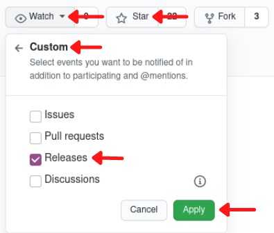

--- 
title: "Hands-on Elixir & OTP: Cryptocurrency trading bot"
author: "Kamil Skowron"
date: "0.6.1"
site: bookdown::bookdown_site
output: bookdown::gitbook
documentclass: book
link-citations: yes
github-repo: Cinderella-Man/hands-on-elixir-and-otp-cryptocurrency-trading-bot
description: ""
graphics: yes
nocite: '@*'
classoption: oneside
geometry: "left=3cm, right=3cm, top=2.5cm, bottom=2.5cm"
twitter-handle: kamilskowron
monofont: Consolas.ttf
---

# Preface {-}

### Want to learn Elixir & OTP by creating a real-world project? {-}


With "Hands-on Elixir & OTP: Cryptocurrency trading bot", you will **gain hands-on experience by writing an exciting software project from scratch.** We will explore all the key abstractions and essential principles through iterative implementation improvements.

We will start by creating a new umbrella application, subscribing to WebSocket streams, implementing a basic trading flow, and focusing on improving it by expanding on the topics like supervision trees, resiliency, refactoring using macros, utilising the Registry, testing and others.

**This book is 95% complete - chapters 1-23 are finished,** and I'll add more content soon. It's also a loosely written representation of the [Hands-on Elixir & OTP: Cryptocurrency trading bot](https://www.youtube.com/watch?v=wVYIx7M6o28&list=PLxsE19GnjC5Nv1CbeKOiS5YqGqw35aZFJ) video course released on YouTube.

This work is licensed under the Creative Commons Attribution-NonCommercial-ShareAlike 4.0 International [CC BY-NC-SA 4.0](https://creativecommons.org/licenses/by-nc-sa/4.0/).

**To get notified about updates** to this book just "watch" the [source code's repository](https://github.com/Cinderella-Man/hands-on-elixir-and-otp-cryptocurrency-trading-bot), and don't forget to leave a star:

```{r, fig.align="center", out.width="60%", echo=FALSE}

```

\newpage

## Limit of Liability/Disclaimer of Warranty {-}

**THIS BOOK IS NOT FINANCIAL ADVICE**

THE SOFTWARE/BOOK IS PROVIDED "AS IS", WITHOUT WARRANTY OF ANY KIND, EXPRESS OR IMPLIED, INCLUDING BUT NOT LIMITED TO THE WARRANTIES OF MERCHANTABILITY, FITNESS FOR A PARTICULAR PURPOSE AND NONINFRINGEMENT. IN NO EVENT SHALL THE AUTHORS OR COPYRIGHT HOLDERS BE LIABLE FOR ANY CLAIM, DAMAGES OR OTHER LIABILITY, WHETHER IN AN ACTION OF CONTRACT, TORT OR OTHERWISE, ARISING FROM, OUT OF OR IN CONNECTION WITH THE SOFTWARE/BOOK OR THE USE OR OTHER DEALINGS IN THE SOFTWARE/BOOK.

## PDF & EPUB {-}

To keep this book up to date and publicly available for people who can't afford to pay for it, I've released it in the HTML format free online at [https://www.elixircryptobot.com](https://www.elixircryptobot.com).

The PDF & EPUB formats are available for purchase on [Gumroad](https://gum.co/cSGdY).

## Preface {-}

In recent years [Elixir](https://elixir-lang.org/) programming language gained a lot of interest in the industry.

Its unmatched parallelisation capabilities are unique and powerful, making it a great candidate for highly concurrent systems like the ones trading assets on exchanges.

In this book, we will go through the development process of a cryptocurrency trading bot in Elixir. We will start ground up and chapter by chapter progress with the implementation ending up with a fully-fledged *naive* trading strategy. We will be designing process supervision trees, describing why specific decisions were taken and how will they impact the system going forward.

By any stretch of the imagination, I don't believe that "this is *the only* way"(nor even the best way) to create a cryptocurrency trading bot in Elixir. This book focuses more on building a real-life project and iterating over it, taking decisions on the way as it would happen in a real work environment. Some parts will be "perfect" the first time around, but there are also others, where we will make compromises to "get it to working", and then when the time is right, we will refactor them as we will gain a better understanding of Elixir/OTP and the domain.

## Who this book is for {-}

This book will be an excellent resource for everyone that already knows the basics of Elixir and wants to get a feel of how developing a non-trivial system looks like using it.

Readers do not need deep knowledge about cryptocurrencies to follow along, as I will shy away from crypto/trading jargon as well as will explain it whenever it's unavoidable.

**This is not a book focused on trading strategies, neither it's financial advice to trade at all.** The main focus of this book is to showcase how the implementation of even complex problems can be achieved in Elixir by simple processes working together in an orchestrated manner.

**The strategy described in this book is naive and most probably will lose money**, but that's not the point of this book. **As we will build up the strategy, we will face a spectrum of problems developers face at work. It's a great primer if you want to get your first "project" behind your belt**.

So, if you've already gone through the motions and learned Elixir and OTP but still feel like you need to get your hands dirty with a "real problem" to "make it stick", this book is for you.

## What this book covers {-}

This book is an ongoing project, and at present, it contains the following chapters:

* Chapter 1 - Stream live cryptocurrency prices from the Binance WSS

Stream live cryptocurrency prices (trade events) from the Binance exchange. We will create a new umbrella project and a `streamer` application inside it starting grounds up. The streamer application will use a Websocket client called `WebSockex` to connect with the Binance API and receive a live feed. After receiving the event as a JSON string, we will decode it using the `jason` library and convert it to our data struct. We will see decoded trade events logged to the terminal by the end of the chapter.

* Chapter 2 - Create a naive trading strategy - single trader without supervision

In this chapter, we will create our first *naive* trading strategy. We will generate another application inside our umbrella called `naive`. We will put data streamed to our `streamer` application to good use by sending it over to the `naive` application. We will start with a very basic solution consisting of a single process called `trader` that will utilise the `GenServer` behaviour. It will allow us to go through the complete trading cycle and give us something that "works".

* Chapter 3 - Introduce PubSub as a communication method

To allow our trading strategy to scale to multiple parallel traders, we need to find a way to distribute the latest prices (trade events) to those multiple traders. We will introduce PubSub to broadcast messages from the streamer(s) to the trader(s). PubSub will allow us to break hardcoded references between applications in our umbrella and become a pattern that we will utilise moving forward.

* Chapter 4 - Mock the Binance API

Besides historical prices (trade events), to perform backtesting, we need to be able to mock placing orders and get trade events back as they are filled. In this chapter, we will focus on developing the solution that will allow our traders to "trade" without contacting the Binance exchange(for people without Binance accounts). This will also allow us to backtest our trading strategy.

* Chapter 5 - Enable parallel trading on multiple symbols

Our basic strategy implementation from the last chapter is definitely too basic to be used in a "production environment" - it can't be neither scaled nor it is fault-tolerant. In this chapter, we will upgrade our naive strategy to be more resilient. This will require a supervision tree to be created and will allow us to see different supervision strategies in action and understand the motivation behind using and stacking them.

* Chapter 6 - Introduce a `buy_down_interval` to make a single trader more profitable

At this moment our `Naive.Trader` implementation will blindly place a buy order at the price of the last trade event. Whenever the `Naive.Trader` process will finish trade, a new `Naive.Trader` process will be started and it will end up placing a buy order at the same price as the price of the previous sell order. This will cost us double the fee without gaining any advantage and would cause further complications down the line, so we will introduce a `buy_down_interval` which will allow the `Naive.Trader` processes to place a buy order below the current trade event's price.

* Chapter 7 - Introduce a trader budget and calculating the quantity

Since the second chapter, our `Naive.Trader` processes are placing orders with a hardcoded quantity of 100. In this chapter, we will introduce a budget that will be evenly split between the `Naive.Trader` processes using chunks. We will utilize that budget to calculate quantity (to be able to do that we need to fetch further `step_size` information from the Binance API).

* Chapter 8 - Add support for multiple transactions per order

Our `Naive.Trader` implementation assumes that our orders will be filled within a single transaction, but this isn't always the case. In this chapter, we will discuss how could we implement the support for multiple transactions per order and race conditions that could occur between the bot and the Binance API.

* Chapter 9 - Run multiple traders in parallel

With PubSub, supervision tree, buy down and budget in place we can progress with scaling the number of traders. This will require further improvements to our trading strategy like introducing a `rebuy_interval`. At the end of this chapter, our trading strategy will be able to start and run multiple traders in parallel.

* Chapter 10 - Fine-tune trading strategy per symbol

Currently, the naive strategy works based on settings hardcoded in the `leader` module. To allow for fine-tuning the naive trading strategy per symbol we will introduce a new database together with the table that will store trading settings.

* Chapter 11 - Supervise and autostart streaming

In the last chapter, we introduced a new database inside the `naive` application to store default settings, in this chapter we will do the same for the `streamer` application. Inside the settings, there will be a `status` flag that will allow us to implement the autostarting functionality on initialization using Task abstraction.

* Chapter 12 - Start, stop, shutdown, and autostart trading

To follow up after autostarting streaming we will apply the same trick to the trading supervision tree using Task abstraction. We will need to introduce a new supervision level to achieve the correct supervision strategy.

* Chapter 13 - Abstract duplicated supervision code

As both the `naive` and the `streamer` applications contain almost the same copy-pasted code that allows us to start, stop and autostart workers. We will look into how could we abstract the common parts of that implementation into a single module. We will venture into utilizing the `__using__` macro to get rid of the boilerplate.

* Chapter 14 - Store trade events and orders inside the database

To be able to backtest the trading strategy, we need to have historical prices (trade events) and a list of orders that were placed stored in the database, which will be the focus of this chapter. At this moment, the latest prices (trade events) are broadcasted to PubSub topic and traders are subscribing to it. We will create a new application called `data_warehouse` inside our umbrella that will be responsible for subscribing to the same PubSub topics and storing incoming prices (trade events) in the Postgres database. We will update the `Naive.Trader` module to broadcast orders as traders will place them.

Then we will move on to adding supervision similar to the one from the `naive` and the `streamer` applications but this time we will show how we could avoid using both common module and macros by utilizing the `Registry` module. 

* Chapter 15 - Backtest trading strategy

In this chapter, we will be backtesting our trading strategy by developing a publisher inside the DataWarehouse application. It will stream trade events from the database to broadcast them to the `TRADE_EVENTS:#{symbol}` PubSub topic. It will use the same topic as data would be streamed directly from the Binance. From the trader's perspective, it won't any difference and will cause normal trading activity that will be stored inside the database to be analyzed later.

* Chapter 16 - End-to-end testing

We've reached the stage where we have a decent solution in place, and to ensure that it's still working correctly after any future refactoring, we will add tests. We will start with the "integration"/"end-to-end"(E2E) test, which will confirm that the whole "trading" works. To perform tests at this level, we will need to orchestrate databases together with processes and broadcast trade events from within the test to cause our trading strategy to place orders. We will be able to confirm the right behaviour by checking the database after running the test.

* Chapter 17 - Mox rocks

In the previous chapter, we’ve implemented the end-to-end test that required a lot of prep work, and we were able to see the downsides of this type of tests clearly. This chapter will focus on implementing a more granular test that will utilize the `mox` package to mock out the dependencies of the `Naive.Trader`. We will look into how the Mox works and how we will need to modify our code to use it.

* Chapter 18 - Functional Elixir

In this chapter, we will venture into the functional world by looking at how could we improve our code to push side effects to the edge. We will revise the `Naive.Trader` code to abstract away our strategy code into a new module called `Naive.Strategy`. From this place, we will reorganise the code to maximise the amount of easily testable pure functions. Finally, we will explore hypothetical implementations that will allow us to inject data into function or even manage effects to aid testability. We will compare those to solutions built into Elixir like the `with` statement.

* Chapter 19 - Idiomatic OTP

In the last chapter, we were looking into how we could reorganise *the code* to maximise the amount of pure code. In this chapter, we will look into different ways of implementing the OHLC(open-high-low-close) aggregator, considering similar optimisation but expanding to limit the number of processes to aid testability and maintainability.

* Chapter 20 - Idiomatic trading strategy

We will use the knowledge gained in the last chapter to revise our Naive trading strategy so we will minimise the number of processes required to trade. We will move the functionalities provided by the `Naive.Leader` and the `Naive.SymbolSupervisor` into our strategy, taking care to put as much of it as possible into the pure part. In the end, our `Naive.Trader` will be able to manage multiple positions(trade cycles), and the vast majority of code previously scattered across multiple modules/processes will become easily testable pure functions inside our `Naive.Strategy`.

* Chapter 21 - Layers of abstraction

In this chapter, I acknowledge that the Mox package was misused throughout the book. We will look into the idiomatic way of using it, its consequences, and why you should avoid it. On the other hand, we will check out the `Mimic` package, which does not impact our production system at all. Along the way, we will reconsider how to deal with logging and the usage of module attributes as "dependency injection."

* Chapter 22 - 80/20 win with pure logic

In the 20th chapter, we refactored most of the code inside the Naive strategy, promising ourselves that it would make testing and maintenance easy. In this chapter, we will test that, proving that we are now able to test the vast majority of the system using trivial, easy-to-understand input-output tests.

* Chapter 23 - Back to the Monolith

In this chapter, we will look back at the issues/complexity umbrella applications cause. We will port the whole application to a new Phoenix skeleton, using this opportunity to refactor/merge logic that was previously spread across multiple apps.

## Contributing, Errata and Source code {-}

The book is written using [R Markdown](http://rmarkdown.rstudio.com/)(it's a very similar syntax to the GitHub markdown but supports many more features including code execution, etc.) and converted to final form (for example PDF) using the [bookdown](https://www.bookdown.org/) app. This means that editing a chapter is as simple as editing the markdown source of that chapter.

There are two repositories related to this book(both hosted on Github):

* [source code of the book itself](https://github.com/Cinderella-Man/hands-on-elixir-and-otp-cryptocurrency-trading-bot)
* [code written across the book where the final code of each chapter has its own branch](https://github.com/Cinderella-Man/hands-on-elixir-and-otp-cryptocurrency-trading-bot-source-code)

In regards to contributions - I would love to follow the standard process of forking, making changes, opening PR(please look is there a branch for the next version and point to it instead of `main`), merging, and releasing a new version of the book.

This books has also the **GitHub Discussions** enabled for both the [book's repo](https://github.com/Cinderella-Man/hands-on-elixir-and-otp-cryptocurrency-trading-bot/discussions) as well as [source code's repo](https://github.com/Cinderella-Man/hands-on-elixir-and-otp-cryptocurrency-trading-bot-source-code/discussions), please feel welcome to start any discussions related to book there. 

```{r include=FALSE}
# automatically create a bib database for R packages
knitr::write_bib(c(
  .packages(), 'bookdown', 'knitr', 'rmarkdown'
), 'packages.bib')
```
