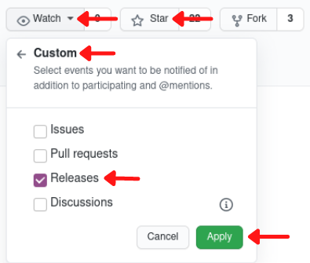

--- 
title: "Hands-on Elixir & OTP: Cryptocurrency Trading Bot"
author: "Kamil Skowron"
date: "0.9.1"
site: bookdown::bookdown_site
output: bookdown::gitbook
documentclass: book
link-citations: yes
github-repo: Cinderella-Man/hands-on-elixir-and-otp-cryptocurrency-trading-bot
description: "Learn Elixir and OTP by building a cryptocurrency trading bot from scratch"
graphics: yes
nocite: '@*'
classoption: oneside
geometry: "left=3cm, right=3cm, top=2.5cm, bottom=2.5cm"
twitter-handle: kamilskowron
monofont: Consolas.ttf
---

# Preface: Your Journey into Elixir & OTP {-}

### Want to learn Elixir & OTP by creating a real-world project? {-}


What if you could master Elixir's most powerful features - concurrent processes, fault-tolerant systems, and real-time data streams - by building something genuinely exciting?
A cryptocurrency trading bot connects to live markets, makes decisions in milliseconds, and keeps running while you sleep.
It's an ideal project for learning Elixir because the problems it presents are exactly the problems Elixir was designed to solve.

With "Hands-on Elixir & OTP: Cryptocurrency Trading Bot", you'll **gain practical experience by building a real-world software project from scratch.**
We'll explore key abstractions and essential principles through iterative improvements to our implementation.

We'll start by creating a new umbrella application and subscribing to WebSocket streams. Then we'll implement a basic trading flow and progressively improve it by
exploring topics like supervision trees, resiliency, refactoring with macros, the Registry, testing, and more.

### Why This Project? {-}

A cryptocurrency trading bot relies on the exact capabilities Elixir was designed for, giving you natural exposure to advanced concepts as you solve real problems.

**Work with real concurrency:**
You'll manage multiple traders simultaneously - each monitoring different symbols, making independent decisions, and communicating via message passing.
This gives you hands-on experience with the Actor model and Elixir's lightweight processes.
More importantly, you'll learn about isolation: if one trader crashes due to a weird API response, all the other traders won't be impacted.
The BEAM's preemptive scheduler provides soft real-time characteristics, ensuring a single "heavy" process - like a complex strategy calculation - cannot starve others, keeping your bot responsive during high volatility.

**Build fault-tolerant systems:** Markets run 24/7, so your bot must recover from failures automatically.
You'll see how supervision trees and the "let it crash" philosophy create self-healing systems when individual components fail.
This doesn't mean ignoring errors or writing sloppy code - it means designing your system so that when unexpected failures happen (and they will),
recovery to a known good state is automatic. No more manually restarting services at 3 AM.

**Manage stateful processes:** Trading involves tracking positions, budgets, market conditions, and orders across multiple concurrent processes. You'll learn to design systems
where state is isolated, predictable, and easy to reason about.

**Integrate with external systems:** Real applications need to connect to WebSocket streams, make HTTP requests, store data in databases, and handle network failures gracefully.
You'll work with all of these integration challenges.

The beauty of this approach is that you'll encounter problems naturally as we build the system. Then you'll learn the Elixir/OTP concepts needed to solve them. By the time
you finish, you'll understand not just how Elixir's features work, but when and why to use them. The patterns you'll learn apply far beyond trading - to IoT systems,
web applications, and any concurrent, fault-tolerant software.

### Is This Book for You? {-}

This book bridges the gap between knowing Elixir's basics and building non-trivial systems with it.
If you've learned Elixir and OTP but want hands-on experience with a real-world project to solidify your understanding, this book is for you.

**Prerequisites:** You should be able to write a GenServer from scratch, understand why `handle_call` vs `handle_cast` matters,
and know what a supervision tree does (even if you haven't built complex ones).
If terms like "process mailbox" or "linking vs monitoring" feel unfamiliar, consider reviewing those concepts first.
Readers do not need deep knowledge about cryptocurrencies to follow along,
as I'll avoid crypto/trading jargon and explain it when necessary.

### Important Disclaimers {-}

**THIS BOOK IS NOT FINANCIAL ADVICE**

**This is not a book focused on trading strategies, nor is it financial advice to trade at all.** The main focus of this book is to show how even complex problems can be solved in Elixir by simple processes working together in an orchestrated way.

**The strategy described in this book is naive and will most likely lose money**, but that's not the point of this book. **As we build the strategy, we'll encounter a wide range of real-world challenges that developers face at work. It's a great primer for getting your first substantial project under your belt**.

### This Book's Development Philosophy {-}

This book follows a realistic development process - we'll make compromises to get features working quickly, then refactor them later as we learn better patterns. Some parts will be "perfect" the first time around, while others we'll deliberately improve in subsequent chapters. This mirrors how real-world software development actually works.

We'll start from the ground up, progressing chapter by chapter. By the end, you'll have a fully-featured (though naive) trading strategy. We'll design process supervision trees, explaining why we made specific decisions and how they will impact the system going forward. When we encounter limitations or better approaches, we'll refactor our code to demonstrate how systems evolve.

With this iterative approach, you'll see both quick, temporary solutions and refined implementations. You'll understand not only the final code but also the journey - dead ends, compromises, and gradual improvements that mirror real projects.

Unlike many tutorials that start with a 'perfect' final architecture, we will intentionally begin with an umbrella application structure.
This allows us to see how isolated components interact in Elixir, but also provides a front-row seat to the gradually increasing maintenance costs of managing multiple internal apps.
By the time we consolidate into a Phoenix monolith in Phase 3, you won't just know how to do it - you'll understand the specific friction points (like configuration drift and dependency tangling) that make it necessary.
We'll start with an umbrella not because it's the "right" way for every project, but because it forces you to confront the boundaries between your systems early on.
You'll experience the "architectural tax" first-hand - the ongoing cost of coordinating configuration, dependencies, and releases across multiple apps -
which makes the eventual move to a monolith feel like a strategic relief rather than a chore.

The goal isn't to show you the "perfect" way to build a trading bot, but to give you experience with the decision-making process that guides Elixir development. By the end, you'll have intuition for when to choose processes over functions, how to structure supervision trees, and when complexity is worth the benefits.

### What You'll Learn {-}

This book guides you through four distinct phases of building a cryptocurrency trading bot in Elixir, each focusing on different aspects of system design and development:

**Phase 1: Building the Foundation** (Chapters 1-4)

Start by connecting to live cryptocurrency data streams and creating your first trading bot.
You'll build an umbrella application, work with WebSocket connections, implement a basic GenServer-based trader,
and learn to decouple components using PubSub.
We'll also create a mock exchange to simulate realistic trading conditions without risking real money.

**Phase 2: Scaling and Resilience** (Chapters 5-11)

Transform your single trader into a robust, multi-symbol trading system.
You'll master supervision trees, implement parallel trading across multiple cryptocurrencies,
add budget management and dynamic quantity calculations, and build complete lifecycle management for starting, stopping, and restarting traders.
This phase focuses on making your system fault-tolerant and production-ready.

**Phase 3: Testing and Architecture Refinement** (Chapters 12-22)

Improve code quality and maintainability through advanced OTP patterns and comprehensive testing.
You'll eliminate duplication using macros, build a data pipeline for storing trade events, implement backtesting capabilities,
and master both end-to-end testing and focused unit testing with Mox and Mimic.
This phase emphasizes clean architecture, functional programming patterns,
and ultimately consolidating from umbrella apps to a Phoenix monolith when the overhead of maintaining complexity outweighs the architectural benefits.
You'll learn to identify the signals that tell a developer their system structure is no longer serving the project's needs.

**WIP: Phase 4: Production Deployment and Operations** (Chapters 23-25)

Transition to a production-ready system optimized for operational simplicity.
You'll migrate from Postgres to SQLite and introduce clustering,
where each node runs its own local database - eliminating the network as a point of failure for writes and keeping trading nodes self-contained.
We'll configure cluster formation with `libcluster` and use Elixir's native distribution to aggregate data into a unified view.
Then you'll build a Phoenix LiveView dashboard that queries each node's state via RPC and subscribes to PubSub for real-time trade events,
giving you a complete picture of the entire system without a centralized database.
Finally, you'll implement a backup strategy that's as simple as copying files.

Each phase builds naturally on the previous one,
taking you from basic concepts to production-ready systems while demonstrating how Elixir applications evolve over time.

### How to Get the Most From This Book {-}

**Follow along by coding:** This book is designed to be hands-on. You'll get the most value by actually writing and running the code as we build the trading bot together. Each chapter builds upon the previous one, so I recommend following them in order.

**Chapter structure:** Each chapter follows a consistent pattern.
We start by identifying a problem or limitation in our current implementation,
then discuss the Elixir/OTP concepts needed to solve it.
From there, we implement the solution step by step and verify our changes with tests.

**Code repositories:** Use the source code repository to check your progress. Each chapter has its own branch with the completed code, so you can compare your implementation or catch up if needed.

**Prerequisites check:** Before starting Chapter 1, make sure you have Elixir 1.18+ and Erlang/OTP 27+ installed
to take advantage of improved compiler feedback and the latest developer tooling, along with a text editor configured for Elixir.

**Getting help:** If you get stuck, check the GitHub Discussions in either the book repository or source code repository.

### Source Code and Repositories {-}

There are two repositories related to this book (both hosted on GitHub):

* [the book itself](https://github.com/Cinderella-Man/hands-on-elixir-and-otp-cryptocurrency-trading-bot)
* [code written across the book where the final code of each chapter has its own branch](https://github.com/Cinderella-Man/hands-on-elixir-and-otp-cryptocurrency-trading-bot-source-code)

**To get notified about updates** to this book, simply watch the [book's repository](https://github.com/Cinderella-Man/hands-on-elixir-and-otp-cryptocurrency-trading-bot), and don't forget to leave a star:

```{r, fig.align="center", out.width="60%", echo=FALSE}

```

This book is based on the [Hands-on Elixir & OTP: Cryptocurrency Trading Bot](https://www.youtube.com/watch?v=wVYIx7M6o28&list=PLxsE19GnjC5Nv1CbeKOiS5YqGqw35aZFJ) video course released on YouTube.

### Community and Contributing {-}

The book is written using [R Markdown](http://rmarkdown.rstudio.com/) (it has very similar syntax to GitHub Markdown but supports many more features including code execution, etc.) and converted to final form (for example, PDF) using the [bookdown](https://www.bookdown.org/) app. This means that editing a chapter is as simple as editing the markdown source of that chapter.

For contributions, I'd love to follow the standard process: fork, make changes, open a PR, merge, and release a new version of the book. Please check if there's a branch for the next version and point your PR to it instead of `main`.

This book also has **GitHub Discussions** enabled for both the [book's repo](https://github.com/Cinderella-Man/hands-on-elixir-and-otp-cryptocurrency-trading-bot/discussions) and the [source code's repo](https://github.com/Cinderella-Man/hands-on-elixir-and-otp-cryptocurrency-trading-bot-source-code/discussions). Feel free to start any book-related discussions there.

### Book Formats and Access {-}

To keep this book up to date and publicly available for people who can't afford to pay for it, I've released it in HTML format free online at [https://www.elixircryptobot.com](https://www.elixircryptobot.com).

The PDF & EPUB formats are available for purchase on [Gumroad](https://gum.co/cSGdY).

This work is licensed under the Creative Commons Attribution-NonCommercial-ShareAlike 4.0 International [CC BY-NC-SA 4.0](https://creativecommons.org/licenses/by-nc-sa/4.0/).

#### Legal Disclaimer {-}

THE SOFTWARE/BOOK IS PROVIDED "AS IS", WITHOUT WARRANTY OF ANY KIND, EXPRESS OR IMPLIED, INCLUDING BUT NOT LIMITED TO THE WARRANTIES OF MERCHANTABILITY, FITNESS FOR A PARTICULAR PURPOSE AND NONINFRINGEMENT. IN NO EVENT SHALL THE AUTHORS OR COPYRIGHT HOLDERS BE LIABLE FOR ANY CLAIM, DAMAGES OR OTHER LIABILITY, WHETHER IN AN ACTION OF CONTRACT, TORT OR OTHERWISE, ARISING FROM, OUT OF OR IN CONNECTION WITH THE SOFTWARE/BOOK OR THE USE OR OTHER DEALINGS IN THE SOFTWARE/BOOK.

```{r include=FALSE}
# automatically create a bib database for R packages
knitr::write_bib(c(
  .packages(), 'bookdown', 'knitr', 'rmarkdown'
), 'packages.bib')
```
